# Plan2Build: data architecture

| Item | Value |
|---|---|
| Document | `SYSTEM_BLUEPRINT/01_ARCHITECTURE/DATA_ARCHITECTURE.md` |
| Version | 0.3 (2026-10-04: section 4.16, the tables built for Handover 1, and the D-03 and D-04 rulings). 0.2 the same day: B-03 registration model, OTP challenge columns, rate card demo flag; earlier text 0.1 proposed |
| Date | 2026-10-03 |
| Status | Architecture proposal for Chirag's review. No migrations exist yet. |
| Business authority | `IHB_FLOW.md` v1.2 section 12 (F-001 to F-123, data rules), section 33; `PROFESSIONALS_FLOW.md` v1.2 section 10 (PF-001 to PF-048), section 27 (PDATA-001 to PDATA-053), sections 44.7 and 44.8; `RECOMMENDATION_ENGINE.md` sections 4, 9, 10 |
| Related | DOMAIN_ARCHITECTURE.md (ownership), STATE_MODEL.md (state columns), SECURITY_ARCHITECTURE.md (privacy classes), OBSERVABILITY_AND_OPERATIONS.md (backups) |

## 1. Principles

1. PostgreSQL is the only system of record. Files live in R2 and are referenced by `file_objects`; Redis holds nothing that cannot be rebuilt.
2. One database, one schema (`public`) for the application, plus the `procrastinate` schema owned by the job library. Module ownership of each table is written here and enforced by code review and the import linter, not by database schemas, so that a later move to schemas or services stays open.
3. Normalised relational tables for anything that is joined, filtered or constrained. JSONB only for payloads whose shape is versioned by a `schema_version` column and whose fields are not used in joins: requirement answers, the standard update payload, engine configuration and snapshots, template contexts, frozen snapshots. A JSONB column never holds a foreign key.
4. Identifiers: `id uuid` primary keys generated as UUIDv7 in the application (time-ordered, so inserts stay index-friendly), plus human-readable codes where people read them (`projects.code` like `P2B-RPR-00042`, `variations.number` per project, auditors' `unique_code`, invoice numbers).
5. State columns are `text` with a CHECK constraint whose values come from STATE_MODEL.md; the transition table in code is the only writer.
6. Every table has `created_at` and `updated_at` (`timestamptz`, UTC). Mutable aggregates carry `version integer` for optimistic locking (S06 §8.1). Append-only tables have no `updated_at` and no UPDATE or DELETE grant for the application role.
7. Soft deletion (`deleted_at`) exists only where the flows allow removal: drafts, file objects, notifications, saved lists. Transactional records (lines, quotes, variations, inspections, marks, payments, audit) are never deleted; they change state (S01 §17.1).
8. Money: `numeric(14,2)` in INR; the currency is a column with the default `INR` for future proofing. No payment amounts between homeowner and professional are stored anywhere (CD-09); the only money figures are Plan2Build's own invoices, contract values, change costs, BOQ amounts, quote prices and option prices.
9. Privacy classes on every table: P0 public, P1 internal business data, P2 personal data (name, email, phone, address, exact location), P3 sensitive (identity and business documents, PAN, GST, payment references, site evidence, MFA secrets). P2 and P3 columns are never logged, never sent to external AI services, and are masked in analytics.
10. Retention is set per table (section 14); the build record is permanent and homeowner-owned.
11. All data stays in India: Supabase project in Mumbai; R2 with the Asia-Pacific jurisdiction hint where available (AQ-08).

## 2. Database conventions

| Convention | Rule |
|---|---|
| Naming | `snake_case`, plural table names, singular column names, `_id` suffix for foreign keys, `_at` for timestamps, `is_` for booleans |
| Foreign keys | Declared on every reference, `ON DELETE RESTRICT` by default; `ON DELETE CASCADE` only for pure child rows of a soft-deletable parent (file variants) |
| Uniqueness | Business uniqueness is a UNIQUE constraint or index, never only application logic: one lead per (project, contractor), one quote per (rfq, contractor), one line per (project, code), one webhook event per provider event id |
| Indexes | Every foreign key; every state column used in work queues as a partial index on open states; `(project_id, created_at desc)` on project-scoped lists; GIST on geography; GIN on tsvector and JSONB keys that are filtered |
| Pagination | Keyset on `(created_at, id)` for user-facing lists; offset allowed in operations tables under 10,000 rows |
| Concurrency | `version` check on every update of a stateful row; `SELECT ... FOR UPDATE` on the parent row for counted invariants (at most three open leads per project; one SELECTED quote per RFQ) |
| Transactions | One business action, one transaction; the outbox row and the audit row are written inside it |
| Enum strategy | `text` plus CHECK; lookup tables where values carry data (reason categories, decline reasons) |
| Extensions | `postgis`, `pg_trgm`, `pgcrypto`, `pg_stat_statements`; nothing else |
| Roles | `app_rw` (the API and worker; no DDL; no DELETE on append-only tables), `app_migrate` (Alembic), `app_readonly` (reporting and the team's SQL access) |
| Row-level security | Not at the POC (AQ-05); the design keeps `project_id` and `profile_id` on every row that RLS would need |
| Partitioning | None at the POC; `audit_events`, `spec_line_events`, `analytics_events` and `notification_deliveries` are partitioned by month when any passes about 10 million rows |

## 3. Entity relationship overview

```mermaid
erDiagram
    USERS ||--o{ USER_CONTACTS : has
    USERS ||--o{ SESSIONS : has
    USERS ||--o{ PROJECTS : owns
    PROJECTS ||--o{ PROJECT_MEMBERSHIPS : grants
    PROJECTS ||--|| PROJECT_REQUIREMENTS : captures
    PROJECTS ||--o{ STAGE_INSTANCES : instantiates
    PROJECTS ||--o{ PROJECT_SPEC_LINES : instantiates
    PROJECT_SPEC_LINES ||--o{ SPEC_LINE_EVENTS : logs
    PROJECT_SPEC_LINES ||--o{ QUALIFYING_OPTIONS : offers
    PROJECTS ||--|| BUILD_PLANS : has
    BUILD_PLANS ||--o{ BUILD_PLAN_VERSIONS : versions
    BUILD_PLAN_VERSIONS ||--o{ BOQ_LINES : lists
    PROJECTS ||--|| CONTRACT_BASELINES : locks
    PROJECTS ||--o{ LEADS : sends
    PROFESSIONAL_PROFILES ||--o{ LEADS : receives
    PROJECTS ||--o{ RFQS : issues
    RFQS ||--o{ QUOTES : receives
    QUOTES ||--o{ QUOTE_VERSIONS : versions
    QUOTE_VERSIONS ||--o{ QUOTE_LINES : prices
    QUOTE_VERSIONS ||--o{ NORMALISATION_ADJUSTMENTS : adjusted_by
    RFQS ||--o{ COMPARISONS : compared_in
    RFQS ||--o| SELECTIONS : awarded_by
    PROJECTS ||--o{ VARIATIONS : changes
    PROJECTS ||--o{ PAYMENT_MILESTONES : pays_by
    STAGE_INSTANCES ||--o{ INSPECTIONS : inspected_by
    INSPECTIONS ||--o{ INSPECTION_CHECKPOINTS : records
    INSPECTIONS ||--o{ NON_CONFORMANCES : raises
    PROJECTS ||--o{ ISSUES : raises
    PROJECTS ||--|| BUILD_RECORDS : ends_in
    PROJECTS ||--|| PACKAGE_PURCHASES : buys
    PACKAGE_PURCHASES ||--o{ INVOICES : bills
    INVOICES ||--o{ PAYMENT_ATTEMPTS : paid_by
    USERS ||--o{ PROFESSIONAL_PROFILES : acts_as
    PROFESSIONAL_PROFILES ||--o{ VERIFICATION_CASES : verified_by
    PROFESSIONAL_PROFILES ||--o{ CLUB_MEMBERSHIPS : curated_in
    PROFESSIONAL_PROFILES ||--o{ SERVICE_AREAS : covers
    RECOMMENDATION_REQUESTS ||--o{ RECOMMENDATION_CANDIDATES : scores
    FILE_OBJECTS ||--o{ FILE_VARIANTS : derives
```

## 4. Table catalogue

Columns listed are the important ones; every table also has `id uuid`, `created_at`, `updated_at` unless marked append-only. "Owner" is the module (DOMAIN_ARCHITECTURE.md). Source identifiers (F, PF, PDATA, CD) tie each table to the blueprints.

### 4.1 core

| Table | Purpose and source | Important columns | Keys and constraints | Indexes | Versioning, deletion, audit | Owner and privacy | Retention |
|---|---|---|---|---|---|---|---|
| `outbox_events` | Transactional outbox for domain events | `event_type`, `aggregate_type`, `aggregate_id`, `payload jsonb`, `occurred_at`, `processed_at`, `attempts`, `last_error`, `dedupe_key` | UNIQUE `dedupe_key` | partial on `processed_at IS NULL` | Append then mark processed; no delete grant | core; P1 (payload holds ids, never P2) | 90 days after processing, then archived |
| `feature_flags` | Staged rollout switches | `key`, `enabled`, `audience jsonb`, `updated_by` | PK `key` | | Audited | core; P1 | Permanent |
| `settings` | Runtime settings not in catalog | `key`, `value jsonb`, `version` | PK `key` | | Audited | core; P1 | Permanent |
| `i18n_strings` | User-facing strings for templates and server messages (English now) | `namespace`, `key`, `locale`, `text`, `version` | UNIQUE (`namespace`,`key`,`locale`) | | Versioned | core; P0 | Permanent |
| `procrastinate_*` | Job queue tables owned by the library | per library | per library | per library | Succeeded jobs pruned | core; P1 (payloads hold ids only) | 14 days |

### 4.2 identity

| Table | Purpose and source | Important columns | Keys and constraints | Indexes | Versioning, deletion, audit | Owner and privacy | Retention |
|---|---|---|---|---|---|---|---|
| `users` | Account per audience (F-010, F-015, F-016; PDATA-001). A self-registered user is created only when the OTP is verified, in the same transaction as its verified contact and first session (B-03, decided by Chirag 2026-10-04); no row exists for a contact that never verified | `audience` (ihb, pro, ops), `display_name`, `status`, `locale`, `last_login_at`, `version` | CHECK `status` per STATE_MODEL §2; CHECK `audience` | `(audience, status)` | Audited transitions; never deleted (CLOSED) | identity; P2 | Lifetime plus 7 years after CLOSED |
| `user_contacts` | Email and phone with verification (F-011, F-014) | `user_id`, `kind` (email, phone), `value`, `normalized`, `verified_at`, `is_primary` | UNIQUE (`kind`,`normalized`) per audience through `users.audience` join (enforced by a composite unique on `(audience, kind, normalized)` with `audience` denormalised) | `normalized` | Audited | identity; P2 | With the user |
| `otp_challenges` | OTP for login, acknowledgement and transfer (F-014, F-072, F-097). Keyed by the normalised contact, not by a `user_contacts` row, because a person signing up has no account until the code is verified (B-03, 2026-10-04) | `audience`, `purpose`, `contact_kind`, `contact_normalized`, `code_hash` (argon2id with a server pepper), `code_ciphertext` (AES-GCM with the application key, so the delivery job can send the code; cleared once delivered), `state` (STATE_MODEL §2), `expires_at`, `attempts`, `max_attempts`, `verified_at`, `locked_at`, `delivered_at`, `delivery_failed_at`, `ip_hash`, `user_id` (set at verification) | CHECK `state`, `purpose`, `contact_kind` | `(audience, contact_kind, contact_normalized, created_at desc)` | Never deleted before retention; only the state, attempt, delivery and ciphertext columns change | identity; P2 (contact), P3 (hash, ciphertext) | 7 days |
| `sessions` | Server-side sessions per host (ADR-010) | `token_hash`, `user_id`, `audience`, `expires_at`, `absolute_expires_at`, `last_seen_at`, `revoked_at`, `ip_hash`, `user_agent`, `device_id`, `mfa_verified_at` | UNIQUE `token_hash` | `(user_id)`, partial on active | Revocation audited | identity; P2 | 90 days after expiry |
| `mfa_secrets` | TOTP for operations and admin (S06 §18) | `user_id`, `secret_encrypted`, `enabled_at`, `recovery_codes_hash text[]` | UNIQUE `user_id` | | Audited | identity; P3 | With the user |
| `consents` | Versioned consent evidence (F-017, F-018) | `user_id`, `document` (privacy, terms, marketing), `version`, `accepted_at`, `withdrawn_at`, `source`, `ip_hash` | | `(user_id, document)` | Append-only | identity; P2 | 7 years |
| `user_devices` | Devices for sessions and the auditor PWA | `user_id`, `label`, `last_seen_at`, `push_token` (nullable) | | `(user_id)` | | identity; P2 | With the user |

### 4.3 projects

| Table | Purpose and source | Important columns | Keys and constraints | Indexes | Versioning, deletion, audit | Owner and privacy | Retention |
|---|---|---|---|---|---|---|---|
| `projects` | Aggregate root (PDATA-035; F-020 to F-043; CD-02, CD-03) | `code`, `owner_user_id`, `status`, `path` (PLAN_FIRST, QUOTE_REVIEW), `contractor_route` (OWN, CLUB, NONE), `project_type` (NEW_HOME only accepted), `city`, `locality`, `plot_geom geography(Point,4326)`, `address_text`, `plot_size`, `plot_unit`, `built_up_area_sqft`, `floors`, `has_basement`, `quality_tier`, `budget_band`, `start_window`, `target_completion`, `funding_source`, `current_stage_text`, `contractor_status`, `project_class` (A, B, C computed), `on_hold_reason`, `archived_at`, `version` | UNIQUE `code`; CHECK `status`; CHECK `project_type` | `(owner_user_id)`, `(status)`, GIST `plot_geom`, `(city, locality)` | Status history table; audited; never deleted | projects; P2 (`address_text`, `plot_geom` exact location) | Lifetime of the record |
| `project_requirements` | The multiple-choice requirement and priority ranking (F-021 to F-040; CD-02; CD-28) | `project_id`, `schema_version`, `answers jsonb`, `priorities jsonb` (ranked list of the four), `services_needed text[]`, `style text[]`, `notes` (max 500), `vastu_preference`, `facing`, `setbacks jsonb`, `rooms jsonb`, `submitted_at`, `review_notes`, `reviewed_by`, `version` | UNIQUE `project_id` | GIN `answers` | Versioned by `version`; audited on submit | projects; P2 (free text may hold personal data) | With the project |
| `project_memberships` | Per-project roles (F-041, F-043, F-085; CD-27 label) | `project_id`, `user_id`, `role` (OWNER, HOUSEHOLD, CONTRACTOR, ARCHITECT, OPS_ADVISOR, OPS_FIELD, AUDITOR_ASSIGNED), `label` ("Chosen by the family"), `permissions jsonb` (household delegations), `granted_by`, `granted_at`, `revoked_at` | UNIQUE (`project_id`,`user_id`,`role`) | `(user_id)` partial on `revoked_at IS NULL` | Audited; revoked rows kept | projects; P1 | With the project |
| `project_status_history` | Transitions (STATE_MODEL §5) | `project_id`, `from_status`, `to_status`, `actor_user_id`, `reason`, `at` | | `(project_id, at)` | Append-only | projects; P1 | With the project |
| `enquiries` | Acquisition funnel before an account (F-001 to F-006; E04) | `source`, `first_source`, `calculator_inputs jsonb`, `rate_card_version`, `estimate jsonb`, `phone` (nullable), `email` (nullable), `consent_marketing`, `converted_user_id`, `converted_at`, `session_hash` | | `(created_at)`, `(converted_user_id)` | Append-only except conversion | projects; P2 | 13 months unless converted |

### 4.4 catalog

| Table | Purpose and source | Important columns | Keys and constraints | Indexes | Versioning, deletion, audit | Owner and privacy | Retention |
|---|---|---|---|---|---|---|---|
| `stage_masters` | The 16 stages (S04 §2; PDATA-049 flags) | As built in 4.16 (D-04 ruling): versioned configuration, `default_duration_days` and `cost_share_pct` NULL until approved | UNIQUE (`version`,`number`); numbers never reused | | Versioned configuration; audited | catalog; P0 | Permanent |
| `spec_line_masters` | The 67 lines (codes A01 to C24; PDATA-045) | `code`, `title`, `consuming_stage`, `lead_time_weeks`, `is_structural`, `brand_category`, `verification_method`, `is_long_lead` | PK `code`; CHECK `is_structural` implies `brand_category IS NULL` | | Immutable codes | catalog; P0 | Permanent |
| `spec_line_master_versions` | Criteria templates with approval (DecisionVersion) | `code`, `schema_version`, `criteria_template`, `valid_from`, `valid_to`, `approved_by_user_id` (structural engineer for structural lines), `change_reason` | UNIQUE (`code`,`schema_version`) | `(code, valid_from)` | Append-only; audited | catalog; P0 | Permanent |
| `checkpoint_masters` | Checkpoints per gate with expected evidence (PDATA-043) | `gate_stage_number`, `version`, `sequence`, `text`, `expected_evidence_type`, `is_critical`, `active_from` | UNIQUE (`gate_stage_number`,`version`,`sequence`) | | Versioned; audited | catalog; P0 | Permanent |
| `rate_cards` | City rate cards for the estimator (F-004; S05 F2) | `city`, `version`, `schema_version`, `rates jsonb`, `is_demo`, `label`, `valid_from`, `published_by` | UNIQUE (`city`,`version`); CHECK `is_demo OR published_by IS NOT NULL` | `(city, valid_from)` | Versioned. `is_demo` marks development and demonstration cards built from the S14 prototype values; they are never served in production and every estimate from one is flagged (Chirag, 2026-10-04: prototype rates are not real Raipur rates) | catalog; P0 | Permanent |
| `enlistment_class_rules` | Class table (44.7; CD-15, CQ-07) | `version`, `class`, `max_floors`, `max_builtup_sqft`, `basement_allowed`, `evidence_rule jsonb`, `active_from` | UNIQUE (`version`,`class`) | | Versioned; audited | catalog; P0 | Permanent |
| `offerings` | The package and its instalment plans (CD-05; F-060; CQ-01) | `code`, `name`, `description`, `price numeric(14,2)` (nullable until CQ-01), `tax_rate`, `instalment_plan jsonb` (list of triggers), `version`, `active_from`, `active_to` | UNIQUE (`code`,`version`) | | Versioned; audited | catalog; P0 | Permanent |
| `config_values` | Windows and thresholds (44.7: 48 h, 10 days, 30 days, max 3; CQ-12 window; mismatch window) | `key`, `value jsonb`, `version`, `updated_by` | PK `key` | | Audited | catalog; P1 | Permanent |
| `reason_categories` | Lookup: variation reasons, delay causes, decline reasons, issue types | `kind`, `code`, `label`, `active` | UNIQUE (`kind`,`code`) | | | catalog; P0 | Permanent |

### 4.5 specification

| Table | Purpose and source | Important columns | Keys and constraints | Indexes | Versioning, deletion, audit | Owner and privacy | Retention |
|---|---|---|---|---|---|---|---|
| `project_spec_lines` | The ledger line per project (PDATA-046; F-070 to F-075) | `project_id`, `code`, `master_version_id`, `issued_criteria`, `state`, `chosen_option_id`, `chosen_at`, `otp_challenge_id`, `decide_by`, `is_long_lead`, `consuming_stage_instance_id`, `version` | UNIQUE (`project_id`,`code`); CHECK `state`; FK `chosen_option_id` to an option of the same line (trigger) | `(project_id, state)`, `(decide_by)` partial on states before CHOSEN | Every transition appends `spec_line_events`; audited | specification; P1 | With the project |
| `spec_line_events` | Append-only history (F-073; S06 §7.1) | `line_id`, `from_state`, `to_state`, `actor_user_id`, `actor_role`, `at`, `evidence_file_id`, `reason`, `source_channel`, `payload jsonb` | | `(line_id, at)` | Append-only; no update or delete grant | specification; P1 | With the project |
| `qualifying_options` | 3 to 5 options per line (PDATA-047; R1 to R9) | `line_id`, `product_name`, `brand`, `supplier_name`, `price numeric(14,2)`, `technical_evidence_ref`, `qualification_status`, `sort_order`, `issued_at`, `issued_by` | CHECK via trigger: the line's master is not structural (S05 rule 8); UNIQUE (`line_id`,`sort_order`) | `(line_id)` | Audited | specification; P1 (`supplier_name`, `brand` hidden from auditors by the API) | With the project |
| `material_records` | Purchased, installed, verified with evidence (PDATA-048; F-076) | `line_id`, `purchased_product`, `purchased_brand`, `purchase_evidence_file_id`, `is_switch`, `switch_reason`, `recorded_by`, `installed_at`, `installer`, `installation_evidence_file_id`, `verified_at`, `verification_method`, `verification_checkpoint_id`, `version` | UNIQUE `line_id` | | Audited; switch is an event | specification; P1 | With the project |

### 4.6 buildplan and design

| Table | Purpose and source | Important columns | Keys and constraints | Indexes | Versioning, deletion, audit | Owner and privacy | Retention |
|---|---|---|---|---|---|---|---|
| `build_plans` | One per project | `project_id`, `current_version_id`, `created_by` | UNIQUE `project_id` | | | buildplan; P1 | With the project |
| `build_plan_versions` | Frozen versions (PDATA-044; S06 §16.1) | `build_plan_id`, `version_no`, `state`, `schema_version`, `content jsonb` (estimate, specification extract, inclusions and exclusions, decisions calendar extract), `design_version_id`, `payment_schedule jsonb`, `cashflow_plan jsonb`, `rendered_document_id`, `share_token_id`, `issued_at`, `issued_by`, `superseded_at` | UNIQUE (`build_plan_id`,`version_no`); CHECK `state` | | ISSUED rows immutable (trigger blocks UPDATE except `superseded_at`, `rendered_document_id`, `share_token_id`) | buildplan; P1 | With the project |
| `boq_lines` | BOQ per version (PDATA-050; F-025) | `build_plan_version_id`, `item_code`, `description`, `stage_number`, `spec_line_code`, `quantity numeric(14,3)`, `unit`, `rate numeric(14,2)`, `rate_card_version`, `amount numeric(14,2)`, `assumptions` | | `(build_plan_version_id)` | Immutable with the version | buildplan; P1 | With the project |
| `structural_signoffs` | Engineer sign-off per structural line and version (BR-055) | `build_plan_version_id`, `line_code`, `engineer_user_id`, `signed_at`, `note` | UNIQUE (`build_plan_version_id`,`line_code`) | | Append-only; audited | buildplan; P1 | With the project |
| `contract_baselines` | Locked baseline (PDATA-040; BR-052 as changed by CD-05) | `project_id`, `state`, `locked_at`, `locked_by_version_id`, `baseline_cost numeric(14,2)`, `baseline_schedule jsonb`, `baseline_spec_version` | UNIQUE `project_id` | | LOCKED row immutable | buildplan; P1 | With the project |
| `quote_reviews` | Review of a homeowner's existing quote (CD-04) | `project_id`, `external_quote_file_id`, `contractor_name`, `contractor_contact`, `comments jsonb` (per stage and line), `state`, `reviewed_by`, `published_at`, `rendered_document_id` | | `(project_id)` | Audited | buildplan; P2 (contractor contact) | With the project |
| `design_requests` | Concept or architect design (CD-25; 33.6) | `project_id`, `kind` (CONCEPT, ARCHITECT), `inputs jsonb` (plot, facing, rooms, vastu, style), `sanctioned_plan_file_id`, `state`, `architect_profile_id`, `requested_by` | | `(project_id)` | Audited | design; P1 (inputs hold no identity) | With the project |
| `design_artefacts` | Plans, elevations, sections, model references, passes, views, architect packs | `request_id`, `type`, `version_no`, `floor`, `file_id`, `vector_file_id`, `state`, `checked_by`, `checked_at`, `label`, `supersedes_id`, `provider_job_id` | UNIQUE (`request_id`,`type`,`floor`,`version_no`); CHECK `type` | `(request_id, type)` | APPROVED rows immutable; audited | design; P1 | With the project |
| `generation_jobs` | Provider calls (ADR-013) | `artefact_id`, `provider`, `model`, `prompt_hash`, `input_file_ids uuid[]`, `state`, `provider_request_id`, `cost_estimate numeric(10,4)`, `error`, `started_at`, `completed_at` | | `(state)` partial on open | Append-only | design; P1 (prompt text never contains P2) | 2 years |
| `design_reviews` | Human checks of plans and views (CQ-26) | `artefact_id`, `reviewer_id`, `decision`, `reason`, `at` | | `(artefact_id)` | Append-only; audited | design; P1 | With the project |

### 4.7 professionals

| Table | Purpose and source | Important columns | Keys and constraints | Indexes | Versioning, deletion, audit | Owner and privacy | Retention |
|---|---|---|---|---|---|---|---|
| `professional_profiles` | Profile per professional (PDATA-002, PDATA-034; PF-001 to PF-048) | `user_id`, `kind` (CON, ARC, INT, SPC, STE, AUD), `firm_name`, `principal_name`, `display_name`, `unique_code` (auditors, CD-21; contractors later), `base_geom geography(Point,4326)`, `base_address`, `service_radius_km`, `years_experience`, `team_size`, `bio`, `pan_hash`, `gst_number`, `status`, `search_tsv tsvector` (generated), `version` | UNIQUE `user_id`; UNIQUE `unique_code` | GIST `base_geom`, GIN `search_tsv`, trigram on `firm_name` | Audited | professionals; P2 (`base_address`), P3 (`gst_number`, `pan_hash`) | Lifetime plus 7 years |
| `professional_categories` | Categories and subtypes per profile with the verification pointer (PF-001, PF-002) | `profile_id`, `category`, `subtype`, `verification_case_id`, `club_membership_id` | UNIQUE (`profile_id`,`category`,`subtype`) | | | professionals; P1 | With the profile |
| `service_areas` | Coverage polygons (PF-004; RE §3.2) | `profile_id`, `name`, `geom geography(MultiPolygon,4326)`, `max_travel_minutes` | | GIST `geom` | | professionals; P1 | With the profile |
| `verification_cases` | One per profile, category and scope (PDATA-003; PA-008 to PA-019; CD-27 PROJECT_ONLY) | `profile_id`, `category`, `scope` (FULL, PROJECT_ONLY), `project_id` (for PROJECT_ONLY), `state`, `submitted_at`, `reviewer_id`, `decided_at`, `reason`, `reapply_after`, `version` | UNIQUE (`profile_id`,`category`,`scope`,`project_id`); CHECK `state` | `(state)` partial on open | Audited | professionals; P1 | With the profile |
| `verification_evidence` | Evidence files locked after submission (PDATA-004; PF-009 to PF-013) | `case_id`, `kind`, `file_id`, `locked_at`, `notes` | | `(case_id)` | Locked rows immutable | professionals; P3 | With the profile |
| `reference_calls` | D2 reference calls (PF-034; 44.8) | `case_id`, `reference_name`, `reference_phone`, `project_described`, `outcome`, `notes`, `called_by`, `called_at` | | `(case_id)` | Append-only | professionals; P2 | With the profile |
| `site_visits` | D2 site visit record (PF-035; 44.8 checklist) | `case_id`, `visit_date`, `site_address`, `checklist jsonb`, `score`, `visited_by`, `notes` | | `(case_id)` | Append-only | professionals; P2 | With the profile |
| `club_memberships` | Champions Club per profile and category (CD-27; 44.8) | `profile_id`, `category`, `state`, `class`, `applied_at`, `admitted_at`, `scorecard jsonb`, `decided_by`, `reapply_after`, `suspended_reason`, `removed_reason`, `version` | UNIQUE (`profile_id`,`category`); CHECK `state`, `class` | `(state, class)` | Audited | professionals; P1 | With the profile |
| `club_reviews` | Six-monthly reviews and triggers (44.8) | `membership_id`, `period_start`, `period_end`, `metrics jsonb`, `result` (CLEAR, WARNING, SUSPENSION, REMOVAL), `improvement_plan`, `reviewed_by`, `at` | | `(membership_id, at)` | Append-only; audited | professionals; P1 | With the profile |
| `contractor_capacity` | Capacity (44.7) | `profile_id`, `max_concurrent_sites`, `active_sites` (maintained by events), `paused_until`, `updated_by` | PK `profile_id` | | Audited | professionals; P1 | With the profile |
| `listing_entries` | Materialised public listing projection (members only; BR-089) | `profile_id`, `category`, `class`, `display jsonb` (badge, verified details, portfolio file ids, audit summary counts), `service_area_summary`, `refreshed_at` | UNIQUE (`profile_id`,`category`) | GIN on `display` keys used by filters | Rebuilt on events | professionals; P0 (only fields allowed on the public profile; audit detail subject to POQ-051) | Rebuilt |

> **Superseded (2026-10-04, PD-18).** `club_memberships` and `club_reviews` are not to be built. Listing state lives on `professional_categories` (PENDING_REVIEW, CHANGES_REQUESTED, LISTED, SUSPENDED, REJECTED); "Champions Club" is the label for LISTED. The `projects` attributes `path` and `contractor_route` are also superseded (PD-17): service needs and engagements are per category. `listing_entries` lists LISTED professionals. See `02_IMPLEMENTATION/PRODUCT_FLOW_RECONCILIATION.md`.

### 4.8 leads

> **Superseded (2026-10-05, Slice 3.4, Connection and Lead decision).** `leads` and `lead_events` are not built. The family's request to a professional is a `connection`, per project and category (section 4.18); a lead may exist later only as an operational record a downstream workflow needs, never duplicating a connection. The three-open-leads-per-project invariant is replaced by at most 3 open connections per project and category (N-05).

| Table | Purpose and source | Important columns | Keys and constraints | Indexes | Versioning, deletion, audit | Owner and privacy | Retention |
|---|---|---|---|---|---|---|---|
| `leads` | Listing leads (44.7; CD-26) | `project_id`, `profile_id`, `source` (HOMEOWNER_PICK, ENGINE_SUGGESTION, REPLACEMENT), `project_class`, `contractor_class`, `state`, `sent_at`, `accept_by`, `quote_by`, `viewed_at`, `responded_at`, `decline_reason_code`, `withdrawn_reason`, `engine_request_id`, `brief_snapshot jsonb` (locality, sizes, budget band, start window, services, package held; no identity), `version` | UNIQUE (`project_id`,`profile_id`); CHECK `state` | `(project_id)` partial on open states; `(profile_id, state)`; `(accept_by)` and `(quote_by)` partial on open | `lead_events`; audited | leads; P1 (snapshot holds no P2) | With the project |
| `lead_events` | History | `lead_id`, `from_state`, `to_state`, `actor_user_id`, `at`, `reason` | | `(lead_id, at)` | Append-only | leads; P1 | With the project |

Invariant: at most `config_values['lead.max_open_per_project']` open leads per project, enforced in the service with `SELECT ... FOR UPDATE` on the project row.

### 4.9 rfq

| Table | Purpose and source | Important columns | Keys and constraints | Indexes | Versioning, deletion, audit | Owner and privacy | Retention |
|---|---|---|---|---|---|---|---|
| `rfqs` | Standard RFQ (PDATA-036; F-081) | `project_id`, `pack_version`, `state`, `issued_at`, `drawings_file_ids uuid[]`, `boq_version_id`, `spec_set_version`, `timeline jsonb`, `quote_format_version`, `architect_pack_artefact_id`, `closed_at`, `cancel_reason`, `version` | UNIQUE (`project_id`,`pack_version`); CHECK `state` | `(project_id)` | Audited | rfq; P1 | With the project |
| `rfq_invitations` | Who was invited and how (F-080; CD-26) | `rfq_id`, `profile_id`, `source` (NOMINATED, INTRODUCED, LEAD), `lead_id`, `state`, `invited_at`, `responded_at`, `decline_reason_code` | UNIQUE (`rfq_id`,`profile_id`) | `(profile_id, state)` | Audited | rfq; P1 | With the project |
| `quotes` | One quote per contractor and RFQ (or standard-template route) | `project_id`, `rfq_id` (nullable for the template route), `profile_id`, `route` (STANDARD_RFQ, STANDARD_TEMPLATE), `latest_version_id`, `state`, `captured_by_staff`, `version` | UNIQUE (`rfq_id`,`profile_id`); UNIQUE (`project_id`,`profile_id`,`route`) | `(project_id)`, `(profile_id)` | Audited | rfq; P1 | With the project |
| `quote_versions` | Immutable submissions (PDATA-007, PDATA-037; F-082; CD-17) | `quote_id`, `version_no`, `state`, `valid_from`, `valid_to`, `submitted_at`, `submitted_by`, `total numeric(14,2)`, `timeline jsonb`, `warranty jsonb`, `payment_terms jsonb`, `inclusions`, `exclusions`, `attachment_file_ids uuid[]`, `superseded_at` | UNIQUE (`quote_id`,`version_no`); CHECK `valid_to > valid_from`; CHECK `state` | `(quote_id, version_no desc)`, `(valid_to)` partial on SUBMITTED | SUBMITTED rows immutable (trigger) | rfq; P1 (visible to the homeowner as submitted; never to other contractors) | With the project |
| `quote_lines` | Line by line (PDATA-008, PDATA-037) | `quote_version_id`, `stage_number`, `spec_line_code`, `boq_line_id`, `price numeric(14,2)`, `is_excluded`, `alternate_spec`, `note` | CHECK (`price IS NOT NULL` OR `is_excluded`) | `(quote_version_id)` | Immutable with the version | rfq; P1 | With the project |
| `normalisation_adjustments` | Adjustment list (PDATA-038; F-083) | `quote_version_id`, `spec_line_code`, `deviation_type`, `description`, `rupee_impact numeric(14,2)`, `technical_impact`, `clarification_status`, `created_by` | | `(quote_version_id)` | Audited (S06 §11) | rfq; P1 (never shown to contractors) | With the project |
| `comparisons` | Frozen comparison (PDATA-009; F-084; CD-18) | `rfq_id`, `version_no`, `state`, `snapshot jsonb` (quotes as submitted, adjustments, normalised totals, recommendation and reasons, risk flags), `recommendation_request_id`, `rendered_document_id`, `share_token_id`, `published_at`, `decided_at` | UNIQUE (`rfq_id`,`version_no`) | | PUBLISHED rows immutable | rfq; P1 | With the project |
| `selections` | Award (PDATA-010; F-085, F-100) | `rfq_id`, `quote_version_id`, `profile_id`, `selected_by`, `selected_at`, `contract_value numeric(14,2)`, `start_date`, `end_date`, `notes` | UNIQUE `rfq_id` | | Immutable; audited | rfq; P1 | With the project |
| `clarifications` | Questions routed through Plan2Build (S07 §5) | `rfq_id`, `quote_id`, `thread_id`, `asked_by`, `status`, `shared_with_all` (answers shared to every invited contractor are a choice, POQ-012) | | `(rfq_id)` | Audited | rfq; P1 | With the project |

### 4.10 recommendation

| Table | Purpose and source | Important columns | Keys and constraints | Indexes | Versioning, deletion, audit | Owner and privacy | Retention |
|---|---|---|---|---|---|---|---|
| `engine_configs` | Versioned configuration (RE §9, §10) | `use`, `version`, `config jsonb`, `validated`, `validation_report jsonb`, `created_by`, `active_from`, `active_to` | UNIQUE (`use`,`version`) | `(use, active_from)` | Append-only; audited; the validator rejects brand item types and paid signals | recommendation; P1 | Permanent |
| `recommendation_requests` | Each run (RE §9) | `use`, `project_id`, `comparison_id`, `trigger`, `config_id`, `model_version`, `state`, `computed_at`, `published_at`, `error` | CHECK `state` | `(project_id)`, `(state)` partial on open | Audited | recommendation; P1 | 7 years (reproducibility) |
| `recommendation_candidates` | Scored candidates with reasons | `request_id`, `subject_type` (CONTRACTOR, ARCHITECT, QUOTE), `subject_id`, `eligible`, `failed_rules jsonb`, `signal_snapshot jsonb`, `criterion_scores jsonb`, `total numeric(8,5)`, `rank`, `reasons jsonb` | UNIQUE (`request_id`,`subject_type`,`subject_id`) | `(request_id, rank)` | Immutable | recommendation; P1 (never exposed to professionals) | 7 years |
| `recommendation_reviews` | Team overrides (BR-142) | `request_id`, `candidate_id`, `reviewer_id`, `action`, `reason`, `old_value jsonb`, `new_value jsonb`, `at` | | `(request_id)` | Append-only; audited | recommendation; P1 | 7 years |
| `recommendation_shown_items` | What the homeowner saw | `request_id`, `candidate_id`, `position`, `fit_label`, `shown_at` | | `(request_id)` | Append-only | recommendation; P1 | 7 years |
| `recommendation_outcomes` | Labels for learning (RE §7) | `subject_type`, `subject_id`, `project_id`, `request_id`, `label` (0 to 4), `lead_state`, `quoted`, `selected`, `measures jsonb`, `recorded_at` | UNIQUE (`request_id`,`subject_type`,`subject_id`) | `(project_id)` | Append-only | recommendation; P1 | 7 years |
| `professional_metrics` | Materialised signals (RE §4) | `profile_id`, `metric`, `numerator numeric`, `denominator numeric`, `raw_value numeric`, `smoothed_value numeric`, `as_of` | UNIQUE (`profile_id`,`metric`,`as_of`) | `(profile_id, metric, as_of desc)` | Rebuilt nightly; history kept | recommendation; P1 (a member sees own) | 7 years |
| `exposure_ledgers` | Weekly caps (RE §3.4) | `profile_id`, `week_start`, `suggestions`, `leads` | PK (`profile_id`,`week_start`) | | Updated in place | recommendation; P1 | 2 years |

### 4.11 construction, variations, money

| Table | Purpose and source | Important columns | Keys and constraints | Indexes | Versioning, deletion, audit | Owner and privacy | Retention |
|---|---|---|---|---|---|---|---|
| `stage_instances` | 16 stages per project, repeats per floor (PDATA-049; S05 rule 3) | `project_id`, `stage_number`, `floor`, `sequence`, `state`, `gate_status`, `planned_start`, `planned_end`, `actual_start`, `actual_end`, `progress_pct`, `is_gate`, `is_payment_milestone`, `version` | UNIQUE (`project_id`,`stage_number`,`floor`); CHECK `state`, `gate_status` | `(project_id, sequence)`, `(planned_end)` partial on not completed | Audited | construction; P1 | With the project |
| `stage_updates` | Standard updates (CD-19; CQ-11) | `stage_instance_id`, `posted_by`, `type` (PROGRESS, COMPLETION_REQUEST), `schema_version`, `payload jsonb` (progress, notes, materials used, open issues), `file_ids uuid[]`, `posted_at` | | `(stage_instance_id, posted_at)` | Append-only | construction; P1 | With the project |
| `exception_feed_items` | Operations exception feed (S05 O1) | `project_id`, `kind` (OVERDUE_DECISION, UNACKNOWLEDGED_CHANGE, OPEN_NC, STAGE_BEHIND_PLAN, PAYMENT_MISMATCH, LEAD_EXPIRING), `ref_type`, `ref_id`, `severity`, `opened_at`, `closed_at` | UNIQUE (`kind`,`ref_type`,`ref_id`) partial on open | `(closed_at)` partial on open | Rebuilt by events and a nightly job | construction; P1 | 2 years |
| `variations` | Change register (PDATA-039; F-090 to F-099; CD-08) | `project_id`, `number`, `raised_by`, `raised_role`, `description`, `reason_code`, `stage_instance_id`, `spec_line_id`, `cost_impact numeric(14,2)`, `time_impact_days`, `delay_cause_code`, `evidence_file_ids uuid[]`, `state`, `assessment jsonb` (valid, cost, time, notes), `assessed_by`, `assessed_at`, `ack_by`, `acknowledged_by`, `acknowledged_at`, `otp_challenge_id`, `closure_outcome`, `closed_by`, `closed_at`, `closure_reason`, `version` | UNIQUE (`project_id`,`number`); CHECK `state`; CHECK `closure_outcome` | `(project_id, state)`, `(ack_by)` partial on ASSESSED | `variation_events`; audited | variations; P1 | With the project |
| `variation_events` | History | `variation_id`, `from_state`, `to_state`, `actor_user_id`, `at`, `note` | | `(variation_id, at)` | Append-only | variations; P1 | With the project |
| `contract_values` | Money position figures (F-100 to F-102, F-105; CD-09) | `project_id`, `original_value numeric(14,2)`, `approved_changes_total numeric(14,2)`, `current_value numeric(14,2)`, `currency`, `set_at`, `version` | UNIQUE `project_id` | | Audited; changes in `contract_value_changes` | money; P1 (contract value visibility to the contractor is CQ-13) | With the project |
| `contract_value_changes` | One row per applied variation | `project_id`, `variation_id`, `delta numeric(14,2)`, `applied_at` | UNIQUE `variation_id` | `(project_id)` | Append-only | money; P1 | With the project |
| `payment_milestones` | Due state and marks, no amounts (CD-09; DT-11; BR-108) | `project_id`, `stage_instance_id`, `sequence`, `is_retention`, `state`, `due_at`, `paid_marked_at`, `paid_marked_by`, `received_marked_at`, `received_marked_by`, `settled_at`, `mismatch_flagged_at`, `version` | UNIQUE (`project_id`,`stage_instance_id`,`is_retention`); CHECK `state`; no amount column exists by design | `(project_id, sequence)`, `(state)` partial on DUE | Audited | money; P1 | With the project |

### 4.12 assurance

| Table | Purpose and source | Important columns | Keys and constraints | Indexes | Versioning, deletion, audit | Owner and privacy | Retention |
|---|---|---|---|---|---|---|---|
| `inspections` | Gate inspections (PDATA-042) | `project_id`, `stage_instance_id`, `gate_number`, `checklist_version`, `auditor_profile_id`, `scheduled_for`, `state`, `readiness_confirmed_at`, `synced_at`, `locked_at`, `report_hash`, `approved_by`, `approved_at`, `result` (PASSED, OPEN_NC), `reinspection_of_id`, `travel_km`, `version` | CHECK `state`; FK `reinspection_of_id` | `(project_id)`, `(auditor_profile_id, scheduled_for)`, `(state)` partial on open | LOCKED rows immutable (trigger); audited | assurance; P1 | With the project |
| `inspection_checkpoints` | Results per checkpoint | `inspection_id`, `checkpoint_master_id`, `result` (PASS, OBSERVATION, NON_CONFORMANCE, NOT_APPLICABLE), `note`, `measured_values jsonb`, `device_seq`, `captured_at`, `received_at` | UNIQUE (`inspection_id`,`checkpoint_master_id`) | `(inspection_id)` | Immutable after lock | assurance; P1 | With the project |
| `inspection_evidence` | Photos, videos, measurements (S05 P6) | `checkpoint_id`, `file_id`, `captured_at`, `captured_geom geography(Point,4326)`, `location_permitted`, `device_id`, `device_seq`, `sha256`, `received_at` | UNIQUE (`device_id`,`device_seq`) | `(checkpoint_id)` | Immutable; EXIF kept | assurance; P3 (site evidence) | With the project |
| `inspection_sync_batches` | Idempotent offline sync | `inspection_id`, `device_id`, `batch_seq`, `payload_hash`, `received_at`, `applied` | UNIQUE (`inspection_id`,`device_id`,`batch_seq`) | | Append-only | assurance; P1 | 2 years |
| `inspection_acknowledgements` | Contractor or homeowner acknowledgement (F-113) | `inspection_id`, `user_id`, `role`, `at`, `otp_challenge_id` | | `(inspection_id)` | Append-only | assurance; P1 | With the project |
| `non_conformances` | Defects (F-112) | `inspection_id`, `checkpoint_id`, `severity` (MINOR, MAJOR, CRITICAL), `description`, `corrective_action`, `owner_profile_id`, `due_date`, `state`, `closed_at`, `closure_basis` (REINSPECTION, REVIEWER), `closure_inspection_id`, `version` | CHECK `state`; CHECK `closure_basis` | `(inspection_id)`, `(state, due_date)` partial on open | `nc_events`; original finding immutable | assurance; P1 | With the project |
| `nc_events` | Rectification evidence and transitions | `nc_id`, `from_state`, `to_state`, `actor_user_id`, `at`, `evidence_file_ids uuid[]`, `note` | | `(nc_id, at)` | Append-only | assurance; P1 | With the project |
| `inspection_reports` | Report versions (F-111) | `inspection_id`, `version_no`, `rendered_document_id`, `plain_language jsonb`, `technical_appendix jsonb`, `share_token_id`, `approved_at` | UNIQUE (`inspection_id`,`version_no`) | | Immutable | assurance; P1 | With the project |
| `auditor_assignments` | Scheduling with travel (S05 O1) | `inspection_id`, `auditor_profile_id`, `assigned_by`, `assigned_at`, `travel_km`, `cost_estimate numeric(10,2)` | UNIQUE `inspection_id` | `(auditor_profile_id, assigned_at)` | Audited | assurance; P1 | 7 years |

### 4.13 issues, records, billing

| Table | Purpose and source | Important columns | Keys and constraints | Indexes | Versioning, deletion, audit | Owner and privacy | Retention |
|---|---|---|---|---|---|---|---|
| `issues` | Issue log (CD-10; PDATA-021) | `project_id`, `raised_by`, `raised_role`, `title`, `description`, `severity`, `stage_instance_id`, `spec_line_id`, `evidence_file_ids uuid[]`, `assignee_profile_id`, `due_date`, `state`, `fix_proof_file_ids uuid[]`, `fixed_at`, `verified_at`, `closed_at`, `escalated_at`, `version` | CHECK `state` | `(project_id, state)`, `(assignee_profile_id, state)` | `issue_events`; audited | issues; P1 | With the project |
| `issue_events` | History | `issue_id`, `from_state`, `to_state`, `actor_user_id`, `at`, `note` | | `(issue_id, at)` | Append-only | issues; P1 | With the project |
| `disputes` | Operations-handled disputes (CD-10; PDATA-023) | `project_id`, `issue_id`, `opened_by`, `description`, `evidence_file_ids uuid[]`, `state`, `decided_by`, `decision`, `decided_against_profile_id`, `decided_at`, `reason` | CHECK `state` | `(project_id)`, `(decided_against_profile_id)` | Audited | issues; P1 | 7 years after closure |
| `handovers` | Handover (J22) | `project_id`, `started_at`, `snag_inspection_id`, `retention_milestone_id`, `completed_at`, `accepted_by` | UNIQUE `project_id` | | Audited | records; P1 | With the project |
| `build_records` | Permanent record (CD-11; F-120) | `project_id`, `owner_user_id`, `state`, `version_no`, `assembled_at`, `issued_at`, `share_token_id`, `export_pdf_document_id`, `export_json_file_id` | UNIQUE `project_id` | | ISSUED immutable; transfers change `owner_user_id` only | records; P1 (owner identity P2 lives in users) | Permanent |
| `build_record_artefacts` | Immutable snapshots per line, inspection, variation, warranty, document (F-121, F-122) | `record_id`, `source_type`, `source_id`, `source_version`, `label`, `included`, `data jsonb` | UNIQUE (`record_id`,`source_type`,`source_id`,`source_version`) | `(record_id)` | Immutable | records; P1 | Permanent |
| `warranties` | Warranty per line (F-123) | `record_id`, `spec_line_code`, `product`, `term_months`, `expiry_date`, `installer`, `evidence_file_id` | | `(record_id)`, `(expiry_date)` | Immutable | records; P1 | Permanent |
| `record_transfers` | Transfer to a new owner (DT-14) | `record_id`, `from_user_id`, `to_contact`, `to_user_id`, `otp_challenge_id`, `transferred_at` | | `(record_id)` | Append-only; audited | records; P2 | Permanent |
| `post_handover_optins` | Coming-soon opt-ins (CD-12; CQ-16) | `project_id`, `service`, `opted_at`, `note`, `handled_by`, `handled_at` | | `(project_id)` | Audited | records; P1 | 7 years |
| `package_purchases` | The package per project (CD-05; F-060) | `project_id`, `offering_id`, `offering_version`, `plan` (AT_ONCE, INSTALMENTS), `state`, `purchased_at`, `total numeric(14,2)`, `currency`, `version` | UNIQUE `project_id` | | Audited | billing; P1 | 7 years (tax) |
| `invoices` | Plan2Build invoices (F-061; S02 §18.1) | `purchase_id`, `number` (sequential per financial year), `instalment_no`, `amount`, `tax jsonb`, `total`, `state`, `issued_at`, `due_at`, `paid_at`, `cancelled_at`, `receipt_document_id`, `version` | UNIQUE `number`; CHECK `state` | `(purchase_id)`, `(state, due_at)` partial on ISSUED | Immutable after ISSUED except state and dates; audited | billing; P1 (GST invoice holds the homeowner's name and address: P2) | 7 years after the financial year |
| `invoice_lines` | Lines | `invoice_id`, `description`, `amount`, `tax_rate`, `hsn_sac` | | `(invoice_id)` | Immutable | billing; P1 | With the invoice |
| `instalment_schedules` | Plan rows (CQ-01) | `purchase_id`, `instalment_no`, `trigger` (ON_PURCHASE, ON_STAGE, ON_DATE), `stage_number`, `due_date`, `amount`, `invoice_id` | UNIQUE (`purchase_id`,`instalment_no`) | | Audited | billing; P1 | With the purchase |
| `payment_attempts` | Razorpay orders (PDATA-014) | `invoice_id`, `provider`, `provider_order_id`, `amount`, `currency`, `state`, `checkout_meta jsonb`, `expires_at` | UNIQUE (`provider`,`provider_order_id`) | `(invoice_id)`, `(state)` partial on open | Audited | billing; P1 | 7 years |
| `payments` | Captured payments (PDATA-015, PDATA-051; F-062) | `attempt_id`, `provider_payment_id`, `amount`, `method`, `captured_at`, `fee numeric(10,2)`, `tax_on_fee numeric(10,2)`, `raw jsonb` (minimal fields only) | UNIQUE (`provider`,`provider_payment_id`) | `(attempt_id)` | Immutable; audited | billing; P3 (gateway references) | 7 years |
| `payment_events` | Webhook log for idempotency and reconciliation (PDATA-052) | `provider`, `event_id`, `event_type`, `payload jsonb`, `signature_valid`, `received_at`, `processed_at`, `result` | UNIQUE (`provider`,`event_id`) | `(processed_at)` partial on NULL | Append-only | billing; P3 | 7 years |
| `refunds` | Refunds (CQ-04) | `payment_id`, `amount`, `reason`, `state`, `provider_refund_id`, `requested_by`, `requested_at`, `completed_at` | UNIQUE `provider_refund_id` | `(payment_id)` | Audited; MFA required | billing; P3 | 7 years |

### 4.14 documents, notifications, messaging, audit, ops, analytics

| Table | Purpose and source | Important columns | Keys and constraints | Indexes | Versioning, deletion, audit | Owner and privacy | Retention |
|---|---|---|---|---|---|---|---|
| `file_objects` | Every binary (F-039; S06 §11) | `bucket`, `object_key` (server-generated, section 6), `purpose`, `owner_user_id`, `project_id`, `profile_id`, `declared_mime`, `detected_mime`, `size_bytes`, `sha256`, `state`, `scan_result`, `exif_policy` (STRIP, KEEP), `uploaded_at`, `available_at`, `deleted_at`, `retention_class`, `version` | UNIQUE (`bucket`,`object_key`); CHECK `state`; CHECK `size_bytes <= limit per purpose` (application) | `(project_id)`, `(profile_id)`, `(state)` partial on PENDING_UPLOAD and SCANNING, `(sha256)` | Soft delete; objects never overwritten; audited views for private documents | documents; P2 or P3 by purpose | Per `retention_class` (section 14) |
| `file_variants` | Resized and converted variants | `file_id`, `variant` (THUMB, MEDIUM, LARGE), `object_key`, `width`, `height`, `size_bytes`, `mime` | UNIQUE (`file_id`,`variant`) | | Cascade with the parent's soft delete | documents; as parent | As parent |
| `rendered_documents` | PDFs rendered from templates (BR-050, BR-056) | `kind`, `subject_type`, `subject_id`, `subject_version`, `template_version`, `context_hash`, `file_id`, `state`, `rendered_at`, `error`, `locale` | UNIQUE (`kind`,`subject_type`,`subject_id`,`subject_version`,`template_version`,`locale`) | `(subject_type, subject_id)` | Deterministic: same inputs, byte-identical output (BR-056) | documents; P1 or P2 by kind | As subject |
| `share_tokens` | No-login access (S05 rule 4; OQ-047) | `token_hash`, `target_type`, `target_id`, `created_by`, `expires_at`, `revoked_at`, `view_count`, `last_viewed_at`, `max_views` | UNIQUE `token_hash` | `(target_type, target_id)` | Audited creation and revocation | documents; P1 | With the target |
| `document_access_log` | Views of private documents | `target_type`, `target_id`, `viewer_user_id`, `share_token_id`, `ip_hash`, `at` | | `(target_type, target_id, at)` | Append-only | documents; P1 | 2 years |
| `notification_templates` | Channel templates (CD-19 updates, lead notices, OTP) | `key`, `channel`, `locale`, `subject`, `body`, `version`, `active` | UNIQUE (`key`,`channel`,`locale`,`version`) | | Versioned; audited | notifications; P0 | Permanent |
| `notification_preferences` | Per user and channel | `user_id`, `channel`, `enabled`, `quiet_hours jsonb` | UNIQUE (`user_id`,`channel`) | | | notifications; P1 | With the user |
| `notifications` | In-app inbox (PDATA-027) | `user_id`, `event_type`, `title`, `body`, `deep_link`, `aggregate_type`, `aggregate_id`, `read_at`, `deleted_at` | | `(user_id, created_at desc)` partial on unread | Soft delete | notifications; P1 | 13 months |
| `notification_deliveries` | Per channel delivery (S02 TX-039) | `notification_id`, `channel`, `provider`, `provider_message_id`, `state`, `attempts`, `last_error`, `queued_at`, `sent_at`, `delivered_at` | | `(state)` partial on QUEUED and FAILED | Append then update state | notifications; P1 | 13 months |
| `threads` | Conversation contexts (PDATA-026) | `context_type` (LEAD, RFQ_CLARIFICATION, VARIATION, OPS), `context_id`, `project_id`, `closed_at` | UNIQUE (`context_type`,`context_id`) | `(project_id)` | | messaging; P1 | With the project |
| `thread_participants` | Membership | `thread_id`, `user_id`, `role`, `joined_at`, `left_at` | UNIQUE (`thread_id`,`user_id`) | `(user_id)` | | messaging; P1 | With the thread |
| `messages` | Messages (no deletion) | `thread_id`, `author_id`, `body`, `attachment_file_ids uuid[]`, `edited_at` | | `(thread_id, created_at)` | Append-only; edits keep history in `payload_history jsonb` | messaging; P2 (free text) | With the project |
| `audit_events` | Append-only audit (PDATA-032; S01 §21.1) | `at`, `actor_user_id`, `actor_role`, `actor_type` (USER, SYSTEM, JOB), `action`, `entity_type`, `entity_id`, `project_id`, `old_value jsonb`, `new_value jsonb`, `old_hash`, `new_hash`, `reason`, `is_override`, `request_id`, `session_id`, `ip_hash`, `user_agent_hash` | | `(entity_type, entity_id, at)`, `(actor_user_id, at)`, `(project_id, at)` | No UPDATE or DELETE grant; monthly partitions at scale | audit; P1 (values may embed P2: masked on export) | 7 years |
| `security_events` | Logins, lockouts, webhook rejections, permission denials | `at`, `kind`, `user_id`, `contact_hash`, `ip_hash`, `severity`, `details jsonb` | | `(kind, at)` | Append-only | audit; P1 | 2 years |
| `ops_queue_items` | Work queues for the console | `kind`, `ref_type`, `ref_id`, `state`, `priority`, `claimed_by`, `claimed_at`, `resolved_at` | UNIQUE (`kind`,`ref_type`,`ref_id`) partial on open | `(kind, state, priority)` | Rebuilt from events | ops; P1 | 2 years |
| `ops_notes` | Internal notes | `ref_type`, `ref_id`, `author_id`, `body` | | `(ref_type, ref_id)` | Append-only | ops; P1 | With the reference |
| `analytics_events` | Product analytics (no P2) | `at`, `event`, `actor_type`, `actor_id`, `session_hash`, `properties jsonb` | | `(event, at)` | Append-only; monthly partitions at scale | analytics; P1 | 13 months raw |
| `daily_aggregates` | KPIs | `day`, `metric`, `dimensions jsonb`, `value numeric` | UNIQUE (`day`,`metric`,`dimensions`) | | Rebuilt | analytics; P1 | Permanent |

### 4.15 Tables introduced by the later documents (added 2026-10-03, same revision)

The API, job, integration, security, AI and operations documents introduced these supporting tables. Name reconciliation: those documents say `recommendation_review_actions`, `exposure_ledger` and `analytics_daily`; the catalogue names are `recommendation_reviews` (4.10), `exposure_ledgers` (4.10) and `daily_aggregates` (4.14), which govern.

| Table | Purpose and source | Important columns | Keys and constraints | Indexes | Versioning, deletion, audit | Owner and privacy | Retention |
|---|---|---|---|---|---|---|---|
| `idempotency_keys` | Replay protection for API writes (API_ARCHITECTURE.md section 1) | `session_id`, `key`, `request_hash`, `response_status`, `response_body jsonb`, `created_at` | UNIQUE (`session_id`,`key`) | `(created_at)` for pruning | Pruned by the maintenance job | core; P1 | 24 hours |
| `rate_counters` | Postgres fallback for rate limits when Redis is unavailable | `bucket_key`, `window_start`, `count` | PK (`bucket_key`,`window_start`) | | Pruned | core; P1 (subject is a hashed contact, session or IP) | 1 day |
| `job_runs` | Each periodic job execution (EVENT_AND_BACKGROUND_JOB_ARCHITECTURE.md section 3) | `job_name`, `started_at`, `finished_at`, `status`, `counts jsonb`, `error` | | `(job_name, started_at desc)` | Append-only | core; P1 | 90 days |
| `job_failures` | Summary of jobs that reached the failed state (the dead-letter view) | `job_name`, `job_id`, `queue`, `ids jsonb`, `error_class`, `error`, `attempts`, `failed_at`, `requeued_at`, `requeued_by` | | `(failed_at desc)` partial on `requeued_at IS NULL` | Append then mark requeued; audited requeue | core; P1 | 1 year |
| `integration_calls` | Outbound provider calls for reconciliation, cost and alerting (INTEGRATION_ARCHITECTURE.md section 1) | `provider`, `operation`, `request_id`, `status`, `latency_ms`, `error_class`, `cost_estimate numeric(10,4)`, `at` | | `(provider, at)` | Append-only | core; P1 | 90 days |
| `backup_manifests` | Nightly dump records and row counts used by restore verification | `env`, `object_key`, `size_bytes`, `sha256`, `row_counts jsonb`, `taken_at`, `verified_at`, `verification_result` | UNIQUE `object_key` | `(taken_at desc)` | Append then update verification | core; P1 | 13 months |
| `billing_exceptions` | Reconciliation differences and amount mismatches for operations | `kind`, `invoice_id`, `attempt_id`, `provider_ref`, `expected jsonb`, `observed jsonb`, `state`, `resolved_by`, `resolution`, `reason` | CHECK `state` | `(state)` partial on open | Audited resolution | billing; P1 | 7 years |
| `professional_conflicts` | Recorded conflicts of interest until the independence protocol settles (POQ-053, POQ-054) | `profile_id`, `project_id`, `homeowner_user_id`, `kind`, `reason`, `recorded_by` | UNIQUE (`profile_id`,`project_id`) partial | `(profile_id)` | Audited | professionals; P1 | With the project |
| `geocode_cache` | Nominatim results by normalised query (INTEGRATION_ARCHITECTURE.md section 5) | `query_normalised`, `provider`, `result jsonb`, `point geography`, `fetched_at` | PK `query_normalised` | GIST `(point)` | Permanent; refreshed on demand | projects; P1 (queries may contain locality text, never names) | Permanent |
| `contact_suppressions` | Hard bounces and complaints per contact | `contact_hash`, `channel`, `reason`, `provider_ref`, `at`, `cleared_at` | UNIQUE (`contact_hash`,`channel`) | | Audited clearing | notifications; P1 | 2 years |
| `notification_rules` | Event to recipient to channel rules (EVENT_AND_BACKGROUND_JOB_ARCHITECTURE.md section 5) | `event_type`, `recipient_rule`, `audience`, `mandatory`, `channels text[]`, `template_key`, `digest_group`, `suppression_window`, `version`, `active` | UNIQUE (`event_type`,`recipient_rule`,`version`) | `(event_type)` partial on active | Versioned; audited | notifications; P0 | Permanent |
| `design_prompt_templates` | Prompt templates and style vocabulary for view generation (AI_AND_RECOMMENDATION_ARCHITECTURE.md A3) | `key`, `provider`, `version`, `template`, `style_vocabulary jsonb`, `active`, `created_by` | UNIQUE (`key`,`provider`,`version`) | | Versioned; audited | design; P0 | Permanent |
| `recommendation_reason_templates` | Reason sentences per criterion (B4) | `criterion_key`, `locale`, `template`, `version`, `active` | UNIQUE (`criterion_key`,`locale`,`version`) | | Versioned; audited | recommendation; P0 | Permanent |
| `fairness_reports` | Monthly fairness review output (B7) | `period_start`, `period_end`, `metrics jsonb`, `flags jsonb`, `generated_at`, `reviewed_by`, `reviewed_at` | UNIQUE (`period_start`) | | Append then mark reviewed | recommendation; P1 | 7 years |

### 4.16 As built for Handover 1 (migration `0004_handover1_projects`, 2026-10-04)

The catalogue rows above are the design for the whole product. This is what exists now; where it differs, this section governs for the built tables and the row above stays the target for later slices.

| Table | As built | Differs from the design row because |
|---|---|---|
| `cities` (new) | `code` PK, `name` UNIQUE, `state`, `is_active`. Seeded: `RPR`, Raipur, Chhattisgarh, active | Projects need a reference to the cities served (R-2: Raipur only); `projects.city` becomes `city_code` FK |
| `stage_master_versions` (new) and `stage_masters` | Versions: `version` PK, `status` (DRAFT, ACTIVE, RETIRED; partial UNIQUE on ACTIVE), `source_note`, `approved_by`, `activated_at`. Stages: `id`, `version` FK, `number` (1 to 16), `code` (`STAGE_nn`), `name`, `sequence`, `is_audit_gate`, `is_payment_milestone`, `repeats_per_floor`, `default_duration_days` (NULL allowed), `cost_share_pct` (NULL allowed); UNIQUE (`version`,`number`) and (`version`,`code`). Version 1 ACTIVE: the 16 S04 names and flags, durations and cost shares NULL | D-04 ruling: a configurable, versioned stage master with no invented durations. The design's `duration_days_min`/`max` band is replaced by one approved default; a NULL means "Schedule to be confirmed" |
| `requirement_question_sets` (new) | `version` PK, `status` (partial UNIQUE on ACTIVE), `locale`, `definition jsonb` (sections, questions, options, `show_if`, review flag rules), `source_document`, `approved_note`. Version 1 is `REQUIREMENT_QUESTIONS_V1.md` section L; a test compares the two | B-02: the question set is data, versioned; a change is a new version |
| `projects` | `id`, `code` (`P2B-RPR-nnnnn` from `project_code_seq`), `owner_user_id`, `status` (CHECK of the 14 states), `project_type` (NEW_HOME), `city_code` FK, `locality`, `plot_geom geography(Point,4326)` with GIST, `plot_area_sqft`, `built_up_area_sqft`, `floors` (1 to 4), `has_basement`, `quality_tier`, `budget_band`, `start_window`, `submitted_at`, `version` | Only the columns slice 1 fills. `funding_source` is not built (R-7 removed the question). `path`, `contractor_route`, `project_class` and the rest arrive with their slices |
| `project_requirements` | `project_id` UNIQUE, `question_set_version` FK, `answers jsonb` (keys of the question set), `review_flags varchar[]` (operations only), `submitted_at`, `version` | All answers, including priorities, setbacks, rooms and style, live in `answers` against the versioned set instead of separate columns, so a new question needs no migration. Review flags `PROPERTY_TYPE_OTHER` and `CONSTRUCTION_STARTED` come from the set's rules (R-4, R-8) |
| `project_memberships`, `project_status_history` | As designed, without `label` and `permissions` (household members are a later slice); history is append-only by trigger | |
| `enquiries` | `kind` (COMING_SOON_HELP, OTHER_CITY), `work_type` (RENOVATION, INTERIORS, REPAIRS; required for COMING_SOON_HELP, forbidden otherwise), `email`, `ip_hash`, `converted_user_id`, timestamps | R-1 and R-2 capture only these fields. Consent for marketing is not captured until D-17 |
| `geocode_cache` | `query_normalised` PK (coordinates rounded to 4 decimals), `provider`, `locality`, `city`, `result jsonb`, `fetched_at` | No point column or GIST index: lookups are by the rounded key only |
| `idempotency_keys` | As designed | |
| `file_objects` | `bucket`, `object_key` UNIQUE, `purpose` (REQUIREMENT_UPLOAD), `owner_user_id`, `project_id`, `original_name`, `declared_mime`, `detected_mime`, `size_bytes`, `sha256`, `state` (PENDING_UPLOAD, UPLOADED, SCANNING, AVAILABLE, QUARANTINED, FAILED, DELETED), `rejection_reason`, `available_at`, `deleted_at`, `version` | `scan_result`, `exif_policy` and `retention_class` wait for the purposes that need them; EXIF is always stripped from requirement photos |
| `document_access_log` | `file_id`, `viewer_user_id`, `ip_hash`, `at`; append-only by trigger | Keyed by file for now; share tokens are a later slice |

Added by migration `0005_slice2_staff_and_review_queue` (Slice 2 foundation):

| Table | As built | Differs from the design row because |
|---|---|---|
| `staff_roles` (new; gap G-01) | `user_id`, `role` (OPS, ADMIN), `granted_by`, `granted_at`, `revoked_at`, `revoked_by`, `reason`; one active grant per user and role (partial UNIQUE) | New: the design had no staff role table |
| `mfa_secrets` | `user_id` PK, `secret_ciphertext` (AES-GCM, bound to the user), `key_version`, `enabled_at` (NULL while enrolment is pending), `last_used_step` (each TOTP step used once), `recovery_code_hashes` (argon2id), `version` | `last_used_step` and `key_version` added for replay protection and key rotation |
| `ops_queue_items` | As designed, plus `resolved_by` and `version`; CHECK that a claimed item names its claimer; open items unique per reference | |

Added by migration `0006_review_and_workspace` (Slice 2 review and workspace, rulings 2.1 to 2.10):

| Table | As built | Differs from the design row because |
|---|---|---|
| `spec_packages` (new) | `code` PK (A, B, C), `name`, `issued` (S04 text, e.g. "Before stage 3"), `sequence` | New: S04 groups lines into three packages the design kept as a column |
| `spec_line_masters` | `code` PK, `package`, `sequence`, `item`, `consuming_stages` SMALLINT[], `decide_by_weeks`, `verified_at`, `brand_category`, `is_structural`, `is_long_lead`; CHECK no brand category on a structural line | Versioned text moved to the next table |
| `spec_line_master_versions` (new) | `code`, `version`, `status`, `performance_specification`, `engineer_signoff` (PENDING, NOT_REQUIRED), `approved_note`, `approved_by`, `activated_at`; UNIQUE (`code`, `version`); one ACTIVE per code (partial UNIQUE). Version 1 seeded ACTIVE from `migrations/data/spec_lines_v1.json` (S04, ruling 2.5) | Master text is versioned so issued lines never change |
| `stage_instances` | `project_id`, `stage_master_id`, `stage_number`, `floor` (-1 basement, 0 ground, 1 to 3 upper; NULL for stages that do not repeat), `sequence`, `state` NOT_STARTED, `is_gate`, `gate_status` (NOT_INSPECTED on gates only, CHECK), `is_payment_milestone`, `planned_start`, `planned_end` NULL (ruling 2.9), `actual_start`, `actual_end`, `version`; UNIQUE (`project_id`, `stage_number`, `floor`) NULLS NOT DISTINCT | `floor` added for ruling 2.2 |
| `project_spec_lines` | `project_id`, `code`, `master_version_id`, `issued_criteria` (copied at creation), `engineer_signoff`, `state` SPECIFIED, `is_long_lead`, `decide_by` NULL until a schedule exists, `consuming_stage_instance_id` (first instance of the earliest consuming stage); UNIQUE (`project_id`, `code`) (ruling 2.3) | |
| `spec_line_events` | `line_id`, `from_state`, `to_state`, `actor_user_id`, `actor_role`, `at`, `reason`, `payload`; append-only by trigger | |

Changed by migration `0007_dashboard_and_estimates` (Slice 3.0, 2026-10-05):

| Table | As built | Why |
|---|---|---|
| `spec_groups` (was `spec_packages`) | Same columns; `spec_line_masters.package` renamed `spec_group` | A, B and C are specification groups, never products (PD-09) |
| `project_estimates` (new) | `project_id`, `requirement_version` (UNIQUE together), `status` (AVAILABLE, UNAVAILABLE), `unavailable_reason` (BUILT_UP_AREA_NOT_GIVEN, NO_RATE_CARD), `inputs` (city, area, floors, finish level), `rate_card_id`, `result` (totals, duration, stage split, rate card identity), `created_at`; CHECK that AVAILABLE rows have a result and card; append-only by trigger | The indicative estimate stored with each submission (PD-03, PD-04) |

Added by migration `0008_ai_design_concepts` (Slice 3.1, 2026-10-05):

| Table | As built |
|---|---|
| `design_prompt_templates` | `view` (EXTERIOR, INTERIOR), `version`, `status` (one ACTIVE per view), `body` with `$facts`, `negative_prompt`, `note`. Version 1 seeded for both views |
| `design_generations` | `project_id`, `sequence` (UNIQUE per project), `view`, `funding` (FREE, PAID), `credit_ref` (for Slice 3.3; PAID requires it), `free_quota` in force, `state` (QUEUED, RUNNING, SUCCEEDED, FAILED), `provider`, `model`, `prompt_template_id` and `_version`, `question_set_version`, `requirement_version`, `snapshot` (sanitised facts), `provider_request` (exactly what the provider receives), `output_file_id`, `failure_reason`, `failure_detail` (internal), `provider_usage`, `attempts`, `is_authoritative` (CHECK false), `requested_by`, `created_at`, `started_at`, `completed_at`, `version`. CHECKs tie SUCCEEDED to an output and FAILED to a reason |
| `design_references` | `project_id`, `generation_id`, `authority` (CHECK ILLUSTRATIVE_ONLY), `marked_by`, `marked_at`, `removed_at`, `removed_by` (both or neither, CHECK); one active reference per concept (partial UNIQUE where `removed_at` IS NULL), removed ones kept as history (migration 0009) |
| `file_objects` | `purpose` also AI_CONCEPT |

Added by migration `0010_professionals` (Slice 3.2, 2026-10-05):

| Table | As built |
|---|---|
| `service_categories` | `code` (PK), `parent_code` (subtypes point at SPECIALIST), `name`, `sequence`, `active`. Seeded: CONTRACTOR, ARCHITECT, STRUCTURAL_ENGINEER, SITE_CIVIL_ENGINEER, MEP, INTERIOR_DESIGNER, SPECIALIST; subtypes WATERPROOFING, SOLAR, LANDSCAPING, FABRICATION, PAINTING |
| `listing_requirement_versions` | `category_code`, `version`, `status` (one ACTIVE per category, partial UNIQUE), `requirements` JSONB (id, label, accepted check kinds, level REQUIRED or WHERE_APPLICABLE, count), `validity_months`, `reapply_months`, `note`. Version 1 from D-02 |
| `professional_profiles` | `user_id` (UNIQUE), `display_name`, `firm_name`, `bio`, `years_experience`, `team_size`, `base_locality`, `base_geom` geography(Point) with a GIST index, `service_radius_km` (1 to 300), `created_by` (operations-created accounts), `version` |
| `professional_categories` | `profile_id`, `category_code` (UNIQUE together), `subtypes`, `listing_state`, `hidden`, `requirement_version_id` (frozen at submission), `submitted_at`, `listed_at`, `review_due_at`, `reapply_after`, `message` (to the professional); partial index on LISTED and not hidden |
| `verification_cases` | `category_id`, `requirement_version_id`, `opened_at`, `decision`, `decided_by`, `decided_at`, `message_to_professional`, `internal_note`; one open case per category (partial UNIQUE) |
| `verification_checks` | `case_id`, `kind`, `subject`, `outcome` (PASSED, FAILED, NOT_APPLICABLE), `detail`, `internal_note`, `recorded_by`, `recorded_at`; append-only by trigger |
| `professional_documents`, `professional_references`, `portfolio_items` | Evidence per profile (documents and references optionally per category); `removed_at` instead of deletion; portfolio `review_state` PENDING, APPROVED, REJECTED |
| `professional_listing_history` | `category_id`, `from_state`, `to_state`, `event`, `actor_user_id`, `actor_role`, `reason`, `at`; append-only by trigger |
| `file_objects`, `ops_queue_items` | `purpose` also VERIFICATION_EVIDENCE and PORTFOLIO; `kind` also PROFESSIONAL_REVIEW |

Not created, by decision: club tables (Champions Club is a name, PD-18), rating or review tables (D-07), enlistment class columns (D-05 OPEN), and any single-route field on `projects`. Where sections 6 and 7 below describe a public portfolio bucket and "relevance then alphabetical" listing order, the 3.2 build differs: portfolio images are served by signed links from the private bucket, and the directory order is the neutral daily shuffle of D-08.

Added by migration `0011_billing` (Slice 3.3, 2026-10-05). Owner `billing` unless noted; money `numeric(14,2)` INR; triggers make append-only tables refuse UPDATE and DELETE (`p2b_forbid_mutation`) and let the others change only their lifecycle columns (`p2b_allow_only_columns`):

| Table | As built |
|---|---|
| `eligibility_checklist_versions` (catalog) | `version`, `status` (one ACTIVE), `items` (id, label, help), `note`, `created_by`, `published_by`, `published_at`. v1 seeded with the five L-02 checks |
| `eligibility_assessments` (projects) | `project_id` (UNIQUE), `checklist_version_id`, `results` (item, outcome, note), `assessed_by`, `assessed_at`; append-only |
| `offerings` | `code`, `kind` (PACKAGE, AI_CREDIT; UNIQUE), `name`. Seeded `P2B_PACKAGE`, `AI_CREDIT_SINGLE` |
| `pricing_rule_versions`, `instalment_plan_versions`, `tax_configuration_versions`, `offering_versions` | Versioned configuration with `status` (one ACTIVE per scope), `is_test`, `note`, `created_by`, `published_by`, `published_at`; content immutable. Offering versions name a pricing rule, payment modes, an instalment plan (CHECK: only with INSTALMENTS) and the terms version |
| `orders` | `code`, `buyer_user_id`, `project_id` (CHECK: package orders only), `kind`, `offering_version_id`, `quantity` (CHECK 1), `pricing_rule_version_id`, `pricing_inputs`, `price`, `taxable_total`, `tax`, `tax_total`, `total` (CHECK = taxable + tax), `payment_mode`, `instalment_plan`, `tax_configuration_version_id`, `terms_version`, `buyer`, `is_test`, `state`, `cancelled_at`, `cancel_reason`; one open package order per project (partial UNIQUE); amounts immutable |
| `payment_dues` | `order_id`, `sequence`, `amount`, `taxable_amount`, `tax`, `tax_amount`, `due_rule` (ON_ORDER, DAYS_AFTER_ACTIVATION), `due_days`, `due_at`, `state`, `paid_at` |
| `payment_attempts` | `due_id`, `provider`, `provider_order_id` (UNIQUE with provider), `amount`, `currency`, `state` (CREATED, CAPTURED, FAILED, EXPIRED), `failure_code`, `created_by`, `finished_at` |
| `payments` | `attempt_id`, `provider`, `provider_payment_id` (UNIQUE with provider), `amount`, `currency`, `method`, `fee`, `tax_on_fee`, `applied`, `source` (WEBHOOK, FETCH), `captured_at`; append-only |
| `payment_events` | `provider`, `provider_event_id` (UNIQUE with provider), `event_type`, minimal `payload`, `received_at`, `processed_at`, `result` |
| `invoices`, `invoice_lines`, `invoice_tax_lines`, `invoice_sequences` | Tax invoices and credit notes with seller and buyer snapshots, UNIQUE (`series`, `financial_year`, `number`), `document_id` set once by the rendering job; lines immutable; a locked counter per series and year |
| `refund_requests`, `refund_decisions`, `refunds` | Requests (one open per order), append-only decisions (approved amount, ends package, credits revoked, reason, role), provider refunds (UNIQUE provider id) |
| `package_entitlements`, `package_entitlement_history`, `package_service_usage` | One ACTIVE entitlement per project, append-only history, first delivery per package service |
| `ai_credit_ledger` | `account_user_id`, `sequence` (UNIQUE per account), `entry`, `quantity`, `balance_after` (CHECK ≥ 0), references by entry kind (CHECK); one GRANT per order and one CONSUME and RETURN per generation (partial UNIQUE); append-only |
| `billing_exceptions` | `kind`, `provider_ref` (UNIQUE with kind and provider), order, attempt and payment references, expected and observed values, resolution by staff |
| `fake_gateway_records` (integrations) | Provider-side state of the fake gateway; empty outside local development and tests |
| `file_objects` | `purpose` also INVOICE (buyer-owned, no project) |

### 4.18 As built for Slice 3.4 (migration `0012_engagements`, 2026-10-05)

Owner `engagements` unless noted. Lifecycle-only trigger (`p2b_allow_only_columns`) on connections, engagements, shared files and quote reviews; `engagement_events` append-only.

| Table | As built |
|---|---|
| `service_value_categories` (catalog) | PK (`question_set_version`, `service_value`), `category_code`. v1 seed (N-01): CONSTRUCTION and CIVIL_WORK to CONTRACTOR, ARCHITECTURAL_DESIGN to ARCHITECT, STRUCTURAL_DESIGN to STRUCTURAL_ENGINEER, MEP to MEP, INTERIOR_DESIGN to INTERIOR_DESIGNER; PROJECT_MANAGEMENT and APPROVALS have no row |
| `project_service_needs` | UNIQUE (`project_id`, `category_code`), `state` (UNDECIDED, NEEDED, NOT_NEEDED), `subtypes`, `source` (REQUIREMENT, FAMILY), `updated_by`, `version`. Written on the first change; until then the need is derived from the requirement |
| `connections` | `project_id`, `category_code`, `profile_id`, `state` (SENT, ACCEPTED, DECLINED, EXPIRED, WITHDRAWN), `brief` (no identity), `family_contact` (name, phone, account email, optional site address; shown to the professional only when ACCEPTED), `professional_contact` (set on acceptance), `sent_by`, `sent_at`, `respond_by`, `responded_at`, `decline_reason` and `decline_note` (CHECK: OTHER needs a note), `withdraw_reason`, `withdrawn_by_role`, `withdraw_note`, `engagement_id`, `version`. Partial UNIQUE (`project_id`, `category_code`, `profile_id`) WHERE SENT |
| `project_engagements` | `project_id`, `category_code`, `party` (LISTED with `profile_id` and `connection_id`; OUTSIDE with `outside_name`, `outside_firm`, `outside_contact`; CHECK), `state` (ACTIVE, ENDED), `created_by`, `started_at`, `ended_at`, `ended_by_role`, `end_reason`, `version`. Partial UNIQUE (`project_id`, `category_code`) WHERE ACTIVE (N-02) |
| `engagement_documents` | Requirement files the family shared with one engagement; `unshared_at` instead of deletion; partial UNIQUE while shared |
| `engagement_events` | Connection and engagement history: subject, from and to state, actor and role, reason; append-only |
| `quote_review_requests` | Intake only: `category_code`, `quoted_by`, `note`, `file_ids` (1 to 5 QUOTE_DOCUMENT files of the family, checked by the service), `state` SUBMITTED, `submitted_by`, `submitted_at` |
| `file_objects` | `purpose` also QUOTE_DOCUMENT (family-owned, no project) |
| `package_service_usage` (billing) | First write: `CONNECTION_ACCEPTED`, on the first acceptance under a package (N-12). Slice 3.6 adds `RFQ_SELECTION`, written when the homeowner selects a contractor's quote (QD-02, a new product decision, 2026-10-06; N-12 unchanged) |

Outside contacts are plain P2 text, like `user_contacts`, not separately encrypted (the readiness recommendation in M was not adopted; SLICE3_4_READINESS R).

### 4.19 As built for Slice 3.5 (migration `0013_buildplan`, 2026-10-05)

Owner `buildplan` unless noted. Database triggers enforce the version model: a version's content changes only while DRAFT (`p2b_build_plan_version_guard`); values, BOQ lines and schedule entries change only while their version is DRAFT, drawing files only while their set is DRAFT, rate card lines only while their card is DRAFT (`p2b_child_editable`, `p2b_status_child_editable`); set-once columns (`p2b_set_once`); design requests, acceptances and history are append-only.

| Table | As built |
|---|---|
| `item_rate_cards`, `item_rate_card_lines` (catalog) | BP-06: geography, version, status DRAFT/PUBLISHED/RETIRED, `is_demo`, effective from and to, source or reference, prepared by, published by and at; lines item code, description, unit, rate. Published cards never change |
| `drawing_checker_appointments` | BP-01: name, qualification, registration reference, optional linked account, appointed and ended by |
| `signoff_statements` | BP-04: versioned text, one ACTIVE; v1 seeded with the baseline wording, marked pending final client and legal confirmation. Reference data: user ids without foreign keys |
| `design_requests` | Kind (LISTED_PROFESSIONAL, OUTSIDE_PROFESSIONAL, HOMEOWNER_PROVIDED, PLAN2BUILD_ARRANGED), engagement, provider, scope, illustrative AI concept ids only |
| `drawing_sets`, `drawing_files` | Set states DRAFT, SUBMITTED, IN_CHECK, CHANGES_REQUESTED, APPROVED, REJECTED, SUPERSEDED; content hash set at submit; checker, note and evidence; files with class (SITE_PLAN, FLOOR_PLAN, ELEVATION, SECTION, STRUCTURAL, OTHER), floor, title, sheet, sha256 |
| `build_plans` | One per project; `accepted_version_id` |
| `build_plan_versions` | States DRAFT, IN_REVIEW, ISSUED, ACCEPTED, CHANGES_REQUESTED, SUPERSEDED, WITHDRAWN; drawing set, rate card, requirement version, scope lists, content hash, last editor, submitted, issued (CHECK issuer is not the last editor), issued and accepted documents, closed and reason |
| `build_plan_spec_values` | Per version and S04 line: master version, criteria text, applicability, value, basis, source note, evidence files, entered by, carried from |
| `boq_lines` | Item from the version's one card, description and unit from the card, quantity and its basis (drawing file required when measured), rate, server-computed amount, stage, floor, spec lines |
| `build_plan_schedule_entries` | One per stage instance: duration, explicitly entered predecessors; `planned_start` and `planned_end` CHECK NULL (BP-07A deferred) |
| `structural_signoffs` | Per version and line: mode (ONE_TIME_CODE or SIGNED_DOCUMENT), signer, category, credential reference, statement and text, content hash, drawing set and structural drawing hashes, line snapshot, challenge or document, state SIGNED/VOID |
| `build_plan_acceptances` | Version, number, content hash, issued document sha256, owner, one-time code challenge (UNIQUE), statement version (`statement_id`, migration 0014) and its filled-in text, time |
| `acceptance_statements` (migration `0014_acceptance_statements`) | BP-05 acceptance wording as versioned configuration: template with $version_no, $project_code, $content_hash; one ACTIVE; v1 functional wording, IMPLEMENTED / PENDING FINAL CLIENT + LEGAL CONFIRMATION; reference data without user foreign keys |
| `build_plan_events` | History of requests, sets, versions and sign-offs |
| `otp_challenges` (identity) | Purposes ACCEPT_BUILD_PLAN and SIGN_STRUCTURAL with `subject_id` (CHECK: confirmations have a subject); such codes never sign anyone in |
| `project_spec_lines` (specification) | `accepted_value_id`: the line's value in the accepted version |
| `file_objects` | Purposes DRAWING, BUILD_PLAN_EVIDENCE, BUILD_PLAN_DOCUMENT |

[SUPERSEDED] by this model: `contract_baselines`, `payment_schedules`, `cashflow_plans`, `design_artefacts`, `generation_jobs` (DATA 4.x designs); the RFQ baseline is the accepted version.

Specification seed (D-03 ruling): the five structural lines A04, A05, A09, A12 and A13 carry no brand category, and no brand or vendor concept replaces it; the `spec_line_masters` CHECK above is unchanged.

### 4.20 As built for Slice 3.6 (migration `0015_rfq`, 2026-10-06)

Owner `rfq` unless noted (module named in DOM 3.10; ADR-024 records `engagements`). Section 4.9's design is [SUPERSEDED] where it differs: no `quotes` table (the invitation holds a contractor's versions), no pack versions (QD-16), no `contract_values`, no recommendation tables (QD-10). Guards as in 3.3 to 3.5: lifecycle columns only (`p2b_allow_only_columns`), set-once columns (`p2b_set_once`), append-only (`p2b_forbid_mutation`), and `p2b_review_open_child` (adjustments change only while their quote's review is open).

| Table | As built |
|---|---|
| `rfqs` | CONTRACTOR only (CHECK, QD-26); the ACCEPTED Build Plan version (FK); states DRAFT, ISSUED, CLOSED, CANCELLED; one open (DRAFT or ISSUED) per project and category; `max_recipients` copied from configuration (3, QD-04); `quotes_due_at`; the frozen manifest JSON and its sha256 set once at issue (CHECK: ISSUED and CLOSED are frozen); cancel reason OWNER, OPERATIONS, PACKAGE_ENDED, BASELINE_SUPERSEDED, PROJECT_CLOSED |
| `rfq_invitations` | Party LISTED (profile) or OUTSIDE (the engaged outside party, staff capture only, QD-22); source NOMINATED, INTRODUCED (written reason, CHECK) or ENGAGED (QD-13); states PROPOSED, SENT, ACCEPTED, DECLINED, EXPIRED, WITHDRAWN; brief without identity; `respond_by` (48 hours, QD-05); N-06 decline reasons; the contractor's contact held for after a selection; one per contractor and RFQ |
| `quote_drafts` | The contractor's private working copy; deleted on submission or discard |
| `quote_versions` | Immutable submissions: kind STANDARD or RENEWAL (`renewal_of`, QD-06); states SUBMITTED, SUPERSEDED, WITHDRAWN, EXPIRED, SELECTED, NOT_SELECTED; review state PENDING, NEEDS_CLARIFICATION, REVIEWED, CLOSED; validity dates (CHECK `valid_to > valid_from`); GST treatment and note; duration and stage durations; payment terms, warranty and materials as text only (CD-09, BP-10); comparable and additional totals; content sha256; staff capture with evidence (CHECK) |
| `quote_lines` | Append-only: every RFQ quantity line priced (unit rate and server amount) or excluded with a reason (CHECK); additional items priced, never excluded |
| `quote_adjustments` | Plan2Build's findings: line or specification line, deviation type, description, rupee impact, basis, clarification status; never in any contractor response (QD-08) |
| `rfq_clarifications` | One question and one answer: CONTRACTOR_ASKS or PLAN2BUILD_ASKS; OPEN, ANSWERED, CLOSED; shared with all only for contractor questions (CHECK) |
| `comparisons` | Version per RFQ; PUBLISHED, SUPERSEDED, DECIDED; the included quote versions, stored order seed (QD-11), snapshot and its sha256, the fpdf2 document (QD-23); at least one quote (QD-24) |
| `selection_statements` | QD-12 wording as versioned configuration ($project_code, $contractor, $version_no); one ACTIVE; v1 IMPLEMENTED / PENDING FINAL CLIENT + LEGAL CONFIRMATION. Reference data |
| `selections` | Append-only, one per RFQ and per quote version: comparison, invitation, engagement and whether it was created, owner, one-time code challenge (UNIQUE), statement and filled-in text. No contract value |
| `rfq_events` | History of every RFQ, invitation, quote, review, clarification, comparison and selection transition |
| `project_engagements` (engagements) | `origin` CONNECTION, OUTSIDE or RFQ_SELECTION (ADR-024); `selection_id`; `family_contact` and `professional_contact` for an engagement started by a selection (CHECK `party_fields` widened) |
| `package_service_usage` (billing) | CHECK `service IN ('CONNECTION_ACCEPTED', 'RFQ_SELECTION')` (N-12; QD-02 new product decision) |
| `otp_challenges` (identity), `file_objects` (documents) | Purpose SELECT_QUOTE; purposes QUOTE_ATTACHMENT and COMPARISON_DOCUMENT |

### 4.21 As built for Slice 3.7A, execution (migration `0016_execution`, 2026-10-06)

Owners `construction` and `money` (ADR-008 names). No execution entity and no project status movement (EX-01). Section 4.11's `stage_logs` design is [SUPERSEDED] by `stage_updates`; no percentage, no planned date, no amount anywhere (EX-02, EX-04, EX-05).

| Table | As built |
|---|---|
| `stage_instances` (existing) | States move NOT_STARTED → IN_PROGRESS (first update) → COMPLETION_REQUESTED → COMPLETED, or back to IN_PROGRESS on a return (EX-03); `completion_requested_at` added (EX-12 exception); CHECK `dates_not_calculated_bp07a` keeps `planned_start` and `planned_end` NULL; trigger `stage_instances_lifecycle_only` allows only `state`, `gate_status`, `actual_start`, `actual_end`, `completion_requested_at`, `updated_at`, `version` to change and refuses deletes (H-09 closed) |
| `stage_updates` | Append-only. Stage instance, the CONTRACTOR engagement it was made under (NOT NULL, EX-19), kind PROGRESS or COMPLETION_REQUEST, note, optional materials and open problems, photo file ids (at least one, CHECK), optional `corrects_update_id`, posted by and role (PROFESSIONAL, or OPS and ADMIN for an OUTSIDE contractor) |
| `construction_events` | Append-only history: subject STAGE (transitions, with actor role and reason) or CONTRACTOR (a different engagement posted on the stage) |
| `payment_marks` (money) | Append-only; the latest per stage and side is current. Side PAID (marked by FAMILY) or RECEIVED (PROFESSIONAL, or OPS and ADMIN for an OUTSIDE contractor, with the engagement), value YES or NO, optional note. No amount, contract value or settled state (CHECK on side and role) |
| `file_objects` (documents) | Purpose STAGE_EVIDENCE (images only); `capture_claim` jsonb (EX-22) |

### 4.22 As built for Slice 3.7B, assurance (migration `0017_assurance`, 2026-10-06)

Owner `assurance` (ADR-008 name). Section 4.12's design is [SUPERSEDED] where it differs: no offline sync tables (EX-10), no device sequence, EXIF never kept (EX-22: capture claims live on `file_objects.capture_claim`), findings close only through a re-inspection (EX-11, no reviewer closure). Guards: lifecycle columns only, append-only history, `p2b_child_editable` (results only while their inspection is IN_PROGRESS), `p2b_status_child_editable` (checkpoints only while their checklist is DRAFT), and `p2b_inspection_frozen` (content columns frozen from SUBMITTED; APPROVED, RETURNED and CANCELLED terminal).

| Table | As built |
|---|---|
| `auditor_appointments` | Unique `auditor_code` (AUD-nnnnn from `auditor_code_seq`), name, qualification, registration reference, optional credential file, optional linked professionals-host user (one ACTIVE appointment per user), ACTIVE or ENDED with actor, time and reason (EX-09) |
| `checklist_versions`, `checkpoints` | Versions DRAFT, PUBLISHED (one), RETIRED; user ids without foreign keys (reference data). Checkpoint: gate 1 to 6, sequence, code, text, expected evidence, critical flag, specification line code. Version 1 seeded PUBLISHED from S04 "verified at": Gate 1: 6, Gate 2: 3, Gate 3: 3, Gate 4: 13, Gate 5: 2; no Gate 6 (EX-08; S04 maps C24 to Gate 6, noted for the draft) |
| `inspections` | Project, gate stage instance, gate number, kind INITIAL or REINSPECTION (`nc_ids`, `reinspects_id`), `amends_id`, appointment, checklist version, states SCHEDULED, IN_PROGRESS, SUBMITTED, APPROVED, RETURNED, CANCELLED (reasons OPERATIONS, PACKAGE_ENDED, PROJECT_CLOSED); one live INITIAL per stage instance (partial UNIQUE, EX-07); submission by the auditor with a SUBMIT_INSPECTION code or by staff capture with the signed report; `content_sha256` of the frozen content |
| `inspection_results` | One per checkpoint: PASS, OBSERVATION, NON_CONFORMANCE, NOT_APPLICABLE (with reason); note, measurement, room tag, evidence file ids; a finding's severity MINOR, MAJOR or CRITICAL with description, corrective action and due date (CHECK all or none) |
| `non_conformances` | Opened at approval from a finding; text, severity and checkpoint set once; states OPEN, RECTIFICATION_SUBMITTED, REINSPECTION_SCHEDULED, CLOSED (CHECK: closed only with the closing inspection and time); due date changed by operations with a reason |
| `inspection_reports` | Append-only report versions (fpdf2, sha256); a correction is a new version with its reason (EX-14) |
| `test_results` | Append-only later results on a checkpoint (cube tests) |
| `assurance_events` | Append-only history with reasons and evidence file ids |
| `stage_instances` (construction) | `gate_status` set only through `construction.interface.set_gate_status`, derived from the records; each change is a `construction_events` row with subject GATE |
| `file_objects`, `otp_challenges` | Purposes INSPECTION_EVIDENCE, INSPECTION_REPORT; confirmation purpose SUBMIT_INSPECTION |

### 4.23 As built for Slice 3.7C, handover and Build Record (migration `0018_records`, 2026-10-06)

Owner `records` (ADR-008 name). Section 4.13's design is [SUPERSEDED] where it differs: no share tokens, transfers or opt-ins (EX-17), no material records (EX-16). Guards: lifecycle columns only, `p2b_child_editable` (documents and warranties only while the handover is OPEN), `p2b_records_frozen` (a handover never changes once ACKNOWLEDGED or ISSUED_BY_OPERATIONS; a Build Record version never changes once ISSUED except to SUPERSEDED), append-only history.

| Table | As built |
|---|---|
| `acknowledgement_statements` | Versioned statement template ($project_code), one ACTIVE; v1 seeded ACTIVE as functional wording, IMPLEMENTED / PENDING FINAL CLIENT + LEGAL CONFIRMATION; reference data (user ids without foreign keys) |
| `handovers` | One per project: OPEN, READY, ACKNOWLEDGED (owner, time, challenge, statement and its filled-in text, CHECK complete) or ISSUED_BY_OPERATIONS (actor, time, reason; CHECK: no acknowledgement fields, EX-15) |
| `handover_documents` | Kind WARRANTY, MANUAL, DRAWING, CERTIFICATE, PHOTO, OTHER; title; HANDOVER_DOCUMENT file; who added it |
| `warranties` | Item, term, expiry date, installer (MVP P8), optional specification line and document |
| `build_records` | Versions per project: DRAFT (one), ISSUED (one), SUPERSEDED; basis ACKNOWLEDGED or ISSUED_BY_OPERATIONS; snapshot jsonb (schema version 1) and its sha256; PDF (BUILD_RECORD_DOCUMENT) and JSON export (BUILD_RECORD_EXPORT) with their sha256; a version after the first names its correction reason (CHECK) |
| `records_events` | Append-only history |
| `file_objects`, `otp_challenges` | Purposes HANDOVER_DOCUMENT, BUILD_RECORD_DOCUMENT, BUILD_RECORD_EXPORT; confirmation purpose ACKNOWLEDGE_HANDOVER |

## 5. Geospatial design

- Projects store the plot as a `geography(Point, 4326)` chosen by a map pin (the address text is secondary). Professionals store a base point and optional service polygons; a profile without polygons uses `base_geom` plus `service_radius_km`.
- Eligibility query (leads, recommendation stage 2): `ST_DWithin(profile.base_geom, project.plot_geom, radius_m)` OR `ST_Covers(service_area.geom, project.plot_geom)`, both served by GIST indexes. Straight-line distance in kilometres is a scoring signal at the POC; road travel time comes from an OSRM container when enabled (INTEGRATION_ARCHITECTURE.md section 6) and is cached in `travel_time_cache (from_cell, to_cell, minutes, computed_at)` keyed by rounded coordinates.
- Why PostGIS: it is already on Supabase, the data set is tiny, and the queries are two functions with an index. A separate geospatial store would be unjustified at any scale this product can reach in India's tier-2 cities.
- Future scaling: H3 cells as a pre-filter when profiles exceed tens of thousands; still inside Postgres.

## 6. File and object naming

- Buckets: `p2b-prod-private`, `p2b-prod-public`, `p2b-staging-private`, `p2b-staging-public`, `p2b-backups` (separate credentials).
- Object keys are generated by the server, never by the client: `{env}/{purpose}/{yyyy}/{mm}/{file_uuid}` with variants under `{file_uuid}/v/{variant}`. The original filename is metadata in `file_objects`, never part of the key.
- Objects are immutable: a new version of a document is a new object; `file_objects.sha256` lets the build record prove integrity. It is the hash of the final stored bytes, after any re-encoding (H-07, fixed in Slice 3.7).
- Capture claims (Slice 3.7, EX-22): `file_objects.capture_claim` (jsonb, nullable) holds what the uploading device claims (capture time; location only where the device gives it). It is never read from EXIF, which the pipeline strips, and is never authoritative; the server's own receipt time is `created_at`.
- Public bucket holds only listing portfolio images and marketing assets; everything else is private and served by presigned URLs with 15-minute validity (5 minutes for P3 evidence).

## 7. Search design

- Contractor listing: filters on class, category, locality or distance, services; a text box over `professional_profiles.search_tsv` (firm name, principal, bio, specialisations) with trigram fallback on `firm_name`. No price filter or sort exists (BR-089, PBR-038); ordering is by relevance then alphabetical, never by rank (section 8 of RECOMMENDATION_ENGINE.md).
- Project workspace search: lines by code or title, documents by name, both as indexed `ILIKE` and tsvector on small per-project sets.
- Build record search: natural-language search across the project's records (S08 §7) is a later feature; the data for it is the `build_record_artefacts.data` JSONB with a GIN index when wanted.
- No OpenSearch: Postgres full-text covers thousands of profiles and documents with sub-10 ms queries at this size.

## 8. Transaction boundaries and concurrency

| Action | Boundary | Locking |
|---|---|---|
| Choose a specification line | line update, event, audit, outbox in one transaction | `version` check on the line |
| Send leads | project row `FOR UPDATE`; count open leads; insert leads; outbox | project row lock holds the "at most three" invariant |
| Submit a quote version | insert version and lines; mark previous SUPERSEDED; update `latest_version_id`; audit; outbox | `version` on the quote |
| Record selection | selection insert; quote versions SELECTED and NOT_SELECTED; rfq CLOSED; audit; outbox | rfq row `FOR UPDATE` (one selection per rfq, also UNIQUE) |
| Acknowledge a variation | state change; contract value change; stage completion date; audit; outbox | `version` on the variation and on `contract_values` |
| Payment marks | milestone update; audit; outbox | milestone row `FOR UPDATE` (two marks may race) |
| Webhook capture | payment event insert (UNIQUE event id); attempt and invoice update; purchase state; audit; outbox | the UNIQUE constraint rejects replays before any state change |
| Inspection sync | batch insert (UNIQUE); apply checkpoints and evidence; audit | batch UNIQUE gives idempotency |
| Lock inspection | hash computed from checkpoint and evidence rows; state LOCKED; audit; outbox | `version` on the inspection |

## 9. Versioning summary

| Pattern | Used for |
|---|---|
| Immutable version rows (`*_versions`) | Build Plan, quote, comparison, design artefacts, specification masters, templates, engine configuration, inspection reports |
| Append-only event rows | specification lines, variations, leads, issues, non-conformances, audit, security, notification deliveries, outbox |
| Locked rows with triggers | ISSUED Build Plan versions, SUBMITTED quote versions, LOCKED inspections, PUBLISHED comparisons, LOCKED baselines, ISSUED build records |
| `version` integer for optimistic locking | Every mutable aggregate row |
| Content hashes | Inspection reports, rendered documents, file objects, audit old and new values |

## 10. Privacy classification by column group

| Class | Columns | Handling |
|---|---|---|
| P0 public | catalog, templates, listing projection fields approved for the public profile, marketing files | Cacheable at the edge |
| P1 internal | project facts without exact location, states, quotes, adjustments, inspections, variations, marks, metrics, audit values | Served only to authorised roles; included in backups |
| P2 personal | names, emails, phones, `address_text`, `plot_geom`, reference names and phones, site addresses, free text, GST invoice name and address | Never logged; masked in analytics; shown to professionals only as the lead and project rules allow (locality not exact location before acceptance); erasure rules on closure per J25 (open) |
| P3 sensitive | identity and business evidence files, `gst_number`, `pan_hash`, MFA secrets, OTP hashes, gateway references, raw payment events, inspection evidence | Encrypted at rest by the providers; evidence URLs 5-minute validity; access logged; never exported to analytics; never sent to AI providers |

## 11. Data residency

Supabase project region `ap-south-1` (Mumbai). R2 buckets created with the jurisdiction hint for Asia-Pacific where Cloudflare offers it (AQ-08); if unavailable, the risk and the mitigation (only encrypted backups and non-personal renders in another region) are recorded. Backups copied to `p2b-backups` stay in the same jurisdiction. Grafana Cloud and Sentry receive logs with P2 masked and no P3 (OBSERVABILITY_AND_OPERATIONS.md section 3).

## 12. Migration practice

Alembic, one migration per change, expand-contract for anything a running version depends on (add column, backfill, switch code, drop later). Destructive migrations need Chirag's confirmation and a backup (sakha L9). Every migration runs on staging first, from the same image that will serve production (ENVIRONMENT_AND_DEPLOYMENT.md section 7). Seed data (stages, lines, checkpoints, class rules, offerings, templates) ships as versioned data migrations with the `catalog.version_published` event.

## 13. Archival

At the POC nothing is archived. Triggers for later: `audit_events` beyond 10 million rows (monthly partitions, older partitions to R2 as Parquet after 2 years, retained 7 years); completed projects beyond 5 years with no activity (`projects.status = ARCHIVED`, files moved to R2 Infrequent Access, build record stays hot).

## 14. Retention classes

| Class | Applies to | Rule |
|---|---|---|
| PERMANENT | Build records and artefacts, warranties, catalog, templates | Never deleted; survive account closure and transfer |
| PROJECT | Everything scoped to a project (lines, quotes, inspections, variations, marks, documents) | Kept for the life of the record; after a closure request, personal identifiers are pseudonymised where the law allows, the record stays (J25 flows open) |
| FINANCIAL | Invoices, payments, refunds, payment events | 7 years after the financial year (Indian tax practice; confirm with the client's accountant, AQ-11) |
| PROFESSIONAL | Profiles, evidence, verification, membership | Lifetime plus 7 years after closure |
| SECURITY | Sessions, OTP challenges, security events | 90 days, 7 days, 2 years |
| OPERATIONAL | Outbox, job rows, deliveries, exception items, access logs | 14 days to 2 years as listed |
| ANALYTICS | Raw events | 13 months; aggregates permanent |

| ID | Question | Default until answered |
|---|---|---|
| AQ-11 | Financial retention period and GST invoice format, to confirm with the client's accountant before the billing module is built | 7 years after the financial year; sequential invoice numbers per financial year |
