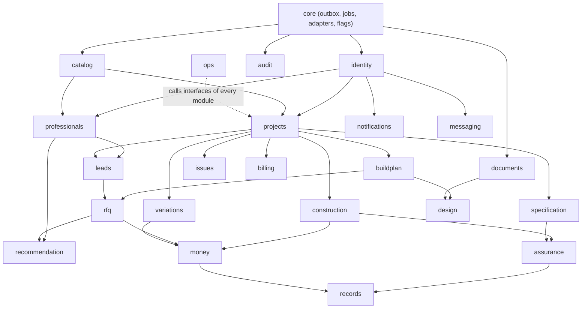

# Plan2Build: domain architecture

| Item | Value |
|---|---|
| Document | `SYSTEM_BLUEPRINT/01_ARCHITECTURE/DOMAIN_ARCHITECTURE.md` |
| Version | 0.1 (proposed) |
| Date | 2026-10-03 |
| Status | Architecture proposal for Chirag's review |
| Business authority | `IHB_FLOW.md` v1.2 section 33 (J00 to J25), `PROFESSIONALS_FLOW.md` v1.2 section 44 (P01 to P26, role flows, 44.7 leads, 44.8 Champions Club), `RECOMMENDATION_ENGINE.md` v0.1 |
| Related | SYSTEM_ARCHITECTURE.md section 8 (module map), STATE_MODEL.md, DATA_ARCHITECTURE.md, API_ARCHITECTURE.md |

## 1. How the domains were derived

Each module below owns one part of the canonical flows: a stage or group of stages of the homeowner journey (J00 to J25), a part of the professional journey (P01 to P26), or a cross-cutting service the flows rely on (documents, notifications, audit, billing). The test for a boundary: the module's tables change together, are read by the same screens, and have one clear owner (homeowner, professional, Plan2Build operations or the system). Where the flows name an entity (the 16 stages, the 67 specification lines, the RFQ pack, the lead, the inspection, the build record) the module is named after it. Nothing is added that the flows do not contain.

## 2. Ubiquitous language

One term per concept, used in code, tables, API and documents.

| Term | Meaning | Not to be confused with |
|---|---|---|
| Homeowner (IHB) | The family building a new house; the project owner | Household member (a person the owner adds with a role) |
| Enquiry | An anonymous or early contact: calculator session, "start your build plan", "talk to an expert" (J02, J03) | Lead (a listing lead sent to a contractor) |
| Project | The homeowner's aggregate root: requirement, workspace, plan, sourcing, build, record | Property (the plot facts inside the project) |
| Requirement | The multiple-choice facts and priorities captured at J06 | Project status |
| Workspace | The project's 16 stage instances, 67 specification lines and access grants (J08) | The Build Plan (a document) |
| Stage instance | One of the 16 construction stages instantiated for the project (stages 5, 6 and 9 once per floor) | Milestone (a payment milestone attached to a stage) |
| Specification line | One of the 67 decisions, instantiated per project with issued criteria and a six-state ledger | Qualifying option (a product offered against a line) |
| Package | The single Plan2Build offering (CD-05): Build Plan, quote review and comparison, stage inspections | Instalment (a part-payment of the package fee) |
| Build Plan | The issued, frozen plan: estimate, specifications, BOQ, schedules, concept design, decisions calendar | Concept design (the drawings and 3D views inside it) |
| Baseline | The locked cost, schedule and specification against which every change is measured | Contract value (the awarded contractor's price recorded at award) |
| Lead | A Request Quote from the listing sent to one contractor (44.7) | Enquiry; RFQ invitation |
| RFQ pack | The standard quote request: drawings, BOQ, specifications, timeline, quote format, pack version | Quote (a contractor's response) |
| Quote version | One immutable submission of a quote; revisions are new versions; the homeowner sees the latest (CD-17) | Adjustment (Plan2Build's normalisation finding on a quote) |
| Comparison | The scope-normalised view of all quotes with the adjustment list, frozen at decision | Recommendation (the engine's reasoned suggestion beside it) |
| Champions Club | The name for every professional Plan2Build has reviewed and approved for public listing (PD-18, 2026-10-04); not a membership or tier. Earlier text: the curated set of professionals Plan2Build lists, recommends and sends leads to (CD-27) | Verification (the checks a professional passes) |
| Enlistment class | A, B or C: the size of project a contractor may take (44.7) | Category (contractor, architect, auditor) |
| Update | A milestone or site update in the standard format (CD-19) | Issue (a problem the homeowner raises) |
| Variation | A change to the baseline, qualified and quantified by Plan2Build, acknowledged by OTP (CD-08) | Issue |
| Payment mark | The homeowner's "paid" and the professional's "received" marks on a milestone, without amounts (CD-09) | Payment (Plan2Build's own fee through Razorpay) |
| Inspection | One auditor visit at a gate stage, with checkpoint results and evidence | Non-conformance (one defect found) |
| Build record | The permanent, transferable record assembled at handover (CD-11) | Document (any file or rendered PDF) |
| Operations | Plan2Build's team: reviewers, advisors, field staff, central approvers | Admin (user and configuration administration) |

## 3. Module catalogue

Each module lists: responsibility; owned entities (tables are detailed in DATA_ARCHITECTURE.md); public interface (service operations other modules and routers call); dependencies (modules it calls); events emitted and consumed (EVENT_AND_BACKGROUND_JOB_ARCHITECTURE.md gives payloads); data ownership and permissions; scalability notes.

### 3.1 core

- Responsibility: the shared kernel: database session and unit of work, outbox writer, job enqueue, feature flags, settings, i18n string tables, geo helpers (PostGIS wrappers), provider adapter interfaces (email, SMS, payment, image generation, routing, storage), clock, ids.
- Owns: `outbox_events`, `feature_flags`, `settings`, `i18n_strings`, Procrastinate's job tables.
- Interface: `uow()`, `publish(event)`, `enqueue(task, payload, run_at)`, `flag(name)`, `setting(name)`, adapters.
- Dependencies: none (everything depends on core).
- Events: none of its own.
- Ownership: system. Permissions: not exposed through the API except flags and settings to admin.
- Scalability: stateless helpers; the outbox relay is one worker task.

### 3.2 identity

- Responsibility: user accounts for every audience, contacts (email, phone) and their verification, OTP challenges, sessions per host, MFA for operations, consents and their versions, devices.
- Owns: `users`, `user_contacts`, `otp_challenges`, `sessions`, `mfa_secrets`, `consents`, `user_devices`.
- Interface: `register(contact, audience)`, `start_otp(contact)`, `verify_otp(challenge, code)`, `create_session(user, audience, device)`, `resolve_session(cookie)`, `revoke_sessions(user)`, `enrol_mfa`, `verify_mfa`, `record_consent(user, document, version)`, `get_user`.
- Dependencies: core (adapters for email and SMS), notifications (OTP delivery through the notification pipeline with a priority lane).
- Events emitted: `user.registered`, `user.contact_verified`, `session.created`, `session.revoked`, `user.suspended`, `user.closed`, `mfa.enrolled`.
- Events consumed: `professionals.account_requested` (operations creates an account for a contractor, CD-07).
- Ownership: the user; operations see status and contacts; admin manages suspension.
- Permissions: self for own data; admin for suspension and closure; operations read.
- Scalability: session lookup is one indexed read per request; OTP counters in Redis.

### 3.3 projects

- Responsibility: the project aggregate: creation from an enquiry or registration, the requirement (J05, J06), submission and operations review (J07), workspace instantiation (J08, through catalog and specification), memberships and per-project roles (household members, the contractor with project-only access, the architect when engaged), project status (STATE_MODEL.md section 4), the "coming soon" routing for other types (CD-03).
- Owns: `projects`, `project_requirements`, `project_memberships`, `project_status_history`.
- Interface: `create_project(owner)`, `save_requirement(project, fields)`, `submit_requirement`, `review_requirement(decision, notes)`, `instantiate_workspace(project)` (calls catalog and specification), `add_member(project, user, role, label)`, `remove_member`, `get_project_for(user)`, `assert_membership(user, project, roles)` (the authorisation primitive every other module calls), `set_status`.
- Dependencies: identity, catalog (stage master), specification (line instantiation), construction (stage instances), audit, notifications.
- Events emitted: `project.created`, `requirement.submitted`, `requirement.accepted`, `requirement.needs_info`, `project.workspace_instantiated`, `project.member_added`, `project.member_removed`, `project.status_changed`.
- Events consumed: `billing.package_paid` (moves the project to PLANNING), `rfq.selection_recorded` (adds the contractor membership), `records.build_record_issued` (moves to COMPLETED).
- Ownership: the homeowner owns the project; Plan2Build operations review and administer; members read per role.
- Permissions: owner edits the requirement until submission; operations accept or ask for information; membership grants are owner or operations only; the contractor never edits project facts.
- Scalability: a project is a small aggregate; membership checks are cached per request.

### 3.4 catalog

- Responsibility: versioned reference data: the 16 stages with flags (gate, payment milestone, repeats per floor), the 67 specification line masters and their versions (codes A01 to C24, structural flags, lead times), audit checkpoint masters per gate, city rate cards for the estimator, enlistment class rules, offerings (the package, prices once CQ-01 is answered), configuration windows (lead acceptance, quote, inactivity), notification and document templates' registry.
- Owns: `stage_masters`, `spec_line_masters`, `spec_line_master_versions`, `checkpoint_masters`, `rate_cards`, `enlistment_class_rules`, `offerings`, `config_values`.
- Interface: `current_stage_masters()`, `current_spec_masters()`, `checkpoints_for(gate, version)`, `rate_card(city, version)`, `class_for_project(floors, area, basement)`, `class_rules(version)`, `offering(code)`, `config(key)`.
- Dependencies: core, audit (configuration changes are audited).
- Events emitted: `catalog.version_published` (any master or rule version).
- Events consumed: none.
- Ownership: Plan2Build operations and admin; the structural engineer approves structural master versions.
- Permissions: read by all modules; write by admin and, for structural lines, the structural engineer's sign-off recorded.
- Scalability: small tables, cached in process with invalidation on `catalog.version_published`.

### 3.5 specification

- Responsibility: the per-project ledger of 67 lines: instantiation in SPECIFIED with issued criteria, decide-by dates from the consuming stage and lead time, long-lead flags, qualifying options issued by operations (3 to 5, ordered by price, never on structural lines), the homeowner's choice with OTP acknowledgement, the purchased, installed and verified states with evidence, switch events, the decisions calendar, append-only events.
- Owns: `project_spec_lines`, `spec_line_events`, `qualifying_options`, `material_records`.
- Interface: `instantiate_lines(project, masters_version)`, `issue_options(line, options[])`, `choose(line, option, otp)`, `record_purchase(line, evidence, product)`, `record_installation(line, evidence)`, `record_verification(line, inspection_ref)`, `decisions_calendar(project)`, `lines_due(before)`.
- Dependencies: catalog, identity (OTP), documents (evidence files), money (baseline value), assurance (verification references), audit, notifications.
- Events emitted: `specline.options_issued`, `specline.chosen` (freezes into the baseline), `specline.purchased`, `specline.installed`, `specline.verified`, `specline.switch_recorded`, `specline.deadline_approaching`, `specline.overdue`.
- Events consumed: `project.workspace_instantiated`, `construction.stage_dates_changed` (recompute deadlines), `assurance.checkpoint_verified`.
- Ownership: Plan2Build issues and owns the lines; the homeowner owns the choice; the contractor records purchase and installation (default pending POQ-021); the auditor verifies.
- Permissions: the auditor never sees supplier or brand on a line (BR-122); the homeowner sees all six states at the MVP (C-029 open; default: all six, since the homeowner's PWA shows the ledger in S06).
- Scalability: 67 rows per project plus events; the calendar query is one indexed scan per project.

### 3.6 buildplan

- Responsibility: the Build Plan: drafting by the advisor (estimate, specifications, inclusions and exclusions, BOQ lines with rate versions, payment schedule, cash-flow plan, decisions calendar extract), structural sign-off of structural lines, the concept design attachment (from design), issue as a frozen version with PDF and share link, later versions, and the contract baseline lock on issue (BR-052 as changed by CD-05). Also the quote-review deliverable for homeowners who hold a contractor's quote (CD-04): the review comments against the workspace.
- Owns: `build_plans`, `build_plan_versions`, `boq_lines`, `payment_schedules`, `cashflow_plans`, `contract_baselines`, `quote_reviews`.
- Interface: `create_draft(project)`, `update_draft(sections)`, `request_structural_signoff`, `record_signoff(line_codes, engineer)`, `attach_design(design_version)`, `issue(version)` (freezes, renders, locks the baseline), `supersede(version, reason)`, `create_quote_review(project, external_quote)`, `publish_quote_review`.
- Dependencies: catalog, specification, design, documents (render and share), money (baseline), billing (package status gates issue), audit, notifications.
- Events emitted: `buildplan.drafted`, `buildplan.signoff_requested`, `buildplan.signed_off`, `buildplan.issued`, `buildplan.superseded`, `baseline.locked`, `quote_review.published`.
- Events consumed: `design.approved` (attach), `billing.package_paid` (allows issue), `documents.rendered` (marks the PDF ready).
- Ownership: Plan2Build; the structural engineer owns sign-off; the homeowner reads.
- Permissions: advisor drafts; engineer signs; operations issue; homeowner and members read issued versions; contractors read the parts included in the RFQ pack only.
- Scalability: rendering is a job; versions are immutable rows.

### 3.7 design

**As built (ADR-025, 2026-10-06):** this module was built as three parts: `designs` (illustrative images, Slice 3.1), `buildplan` (design requests, drawing sets, checking, Slice 3.5) and `houseplans` (concept floor plans, section 3.25). The text below is the original design.

- Responsibility: the concept design pipeline (IHB 33.6): intake (sanctioned plan upload or plan-library fit), the approved vector plan, the 3D model reference, depth and line exports, image generation requests to the provider adapter, generated views with review states, replacement by an architect's design pack (CD-25), and the "illustrative" labelling. Structural design never passes through this module (BR-055).
- Owns: `design_requests`, `design_artefacts` (plans, elevations, views, model references, each versioned), `generation_jobs`, `design_reviews`.
- Interface: `start_concept_design(project, inputs)`, `attach_sanctioned_plan(file)`, `select_library_layout(layout)`, `approve_plan(version, checker)`, `request_views(plan_version, style, cameras)`, `review_view(view, decision, reason)`, `attach_architect_pack(files, architect)`, `current_design(project)`.
- Dependencies: documents (files, variants), core (image provider adapter), professionals (architect identity), buildplan (attachment), audit, notifications.
- Events emitted: `design.requested`, `design.plan_approved`, `design.view_generated`, `design.view_reviewed`, `design.approved`, `design.architect_pack_attached`, `design.generation_failed`.
- Events consumed: `requirement.accepted` (start concept design when the package is paid), `billing.package_paid`.
- Ownership: Plan2Build; the architect owns an architect pack; the homeowner approves the concept.
- Permissions: only geometry and style words leave the platform to the provider; the checker (CQ-26) approves plans; the team approves each view.
- Scalability: provider-bound; its own job queue name so it can get its own worker container.

### 3.8 professionals

- Responsibility: professional profiles for every role (contractor, architect, interior designer, specialist, structural engineer, auditor with a unique ID), categories and service areas (PostGIS), evidence and verification cases per category, basic verification for the family's contractor (project-only scope), Champions Club curation (gates, scorecard, class, outcomes), ongoing review and triggers (warning, suspension, removal), capacity, the public listing projection, and the professional's own metrics view.
- Owns: `professional_profiles`, `professional_categories`, `service_areas`, `verification_cases`, `verification_evidence`, `reference_calls`, `site_visits`, `club_memberships`, `club_reviews`, `contractor_capacity`, `professional_metrics` (materialised by recommendation's jobs, read here).
- Interface: `create_profile(user, category)`, `submit_evidence`, `submit_for_verification(scope)`, `review_verification(decision, reason)`, `record_reference_call`, `record_site_visit`, `curate(application, scorecard, decision, class)`, `run_club_review(member)`, `warn/suspend/reinstate/remove(member, reason)`, `set_capacity`, `listing(filters)`, `eligible_for(project)` (class, area, capacity, status), `metrics_for(professional)`.
- Dependencies: identity, catalog (class rules), documents (evidence), audit, notifications, recommendation (metrics), leads (withdrawal on suspension through events).
- Events emitted: `professional.profile_created`, `verification.submitted`, `verification.changes_requested`, `verification.verified`, `verification.rejected`, `professional.suspended`, `professional.reinstated`, `club.applied`, `club.admitted`, `club.changes_requested`, `club.rejected`, `club.warned`, `club.suspended`, `club.removed`, `club.class_changed`, `capacity.changed`.
- Events consumed: `assurance.report_approved`, `construction.stage_completed`, `variations.closed`, `issues.closed`, `leads.responded`, `rfq.quote_submitted` (all feed metrics through recommendation's jobs), `issues.dispute_decided` (suspension trigger).
- Ownership: the professional owns the profile; operations own verification, curation and membership; the system owns metrics.
- Permissions: a professional sees own data and own metrics, never a rank or another member's data; homeowners see the listing projection (members only, no ratings, no prices); operations see everything.
- Scalability: listing is a materialised projection refreshed on events; PostGIS index on service areas.

### 3.9 leads

**Superseded by ADR-024 (2026-10-06):** the module is `engagements` (connections and per-category engagements, SLICE3_4_READINESS section 0). The text below describes the superseded lead design.

- Responsibility: listing leads (44.7): creation from Request Quote (up to three picks), the eligibility check with reasons, delivery, the acceptance and quote windows, decline reasons, expiry, replacement suggestions through recommendation, withdrawal on suspension or class change, the project-facts-changed update, and the join into the RFQ or the standard-template quote route.
- Owns: `leads`, `lead_events`.
- Interface: `request_quotes(project, contractor_ids[])`, `accept(lead)`, `decline(lead, reason)`, `expire_due()` (scheduled), `withdraw(lead, reason)`, `open_leads(project)`, `lead_view_for_contractor(lead)` (the privacy-shaped brief).
- Dependencies: projects (facts, package status), professionals (eligibility), catalog (class rules, windows), rfq (join on acceptance), recommendation (replacements), messaging (thread on acceptance), notifications, audit.
- Events emitted: `lead.sent`, `lead.viewed`, `lead.accepted`, `lead.declined`, `lead.expired`, `lead.quoted`, `lead.selected`, `lead.not_selected`, `lead.withdrawn`.
- Events consumed: `professional.suspended`, `club.suspended`, `club.class_changed`, `requirement.changed_after_submission`, `rfq.quote_submitted`, `rfq.selection_recorded`, `project.inactive` (scheduled check).
- Ownership: Plan2Build (system) owns the lead; the homeowner chose; the contractor responds.
- Permissions: the contractor sees locality, sizes, budget band, start window, services and package status, never name, phone or exact address before acceptance; the homeowner sees the lead state and decline reason category.
- Scalability: tens of rows per project; scheduled expiry job every few minutes.

### 3.10 rfq

- Responsibility: the standard RFQ pack (drawings, BOQ, specifications, timeline, fixed quote format, pack version, optional architect pack), invitations (nominated contractor, introductions, accepted leads), quotes in the fixed format with every line priced or excluded, staff capture on behalf of a contractor, validity dates, immutable versions with the homeowner seeing only the latest (CD-17), clarifications routed through Plan2Build (messaging), normalisation adjustments per quote and line, the comparison snapshot, the quote-template route for leads without the package, selection and the award record (contract value and dates captured for money).
- Owns: `rfqs`, `rfq_invitations`, `quotes`, `quote_versions`, `quote_lines`, `normalisation_adjustments`, `comparisons`, `selections`.
- Interface: `issue_rfq(project, pack)`, `invite(rfq, contractor, source)`, `start_quote(invitation)`, `submit_quote_version(quote, lines, validity, terms)`, `capture_on_behalf(...)`, `withdraw_quote`, `add_adjustment(quote_version, line, deviation, rupee_impact)`, `finalise_comparison(rfq)` (freezes a snapshot and requests a recommendation), `record_selection(rfq, quote_version, contract_value, dates)`, `latest_quotes_for_homeowner(rfq)`.
- Dependencies: projects, professionals, buildplan (pack contents), leads, recommendation (quote recommendation), money (award), messaging (clarifications), documents (pack files, quote attachments), audit, notifications.
- Events emitted: `rfq.issued`, `rfq.invitation_sent`, `rfq.quote_submitted`, `rfq.quote_version_created`, `rfq.quote_withdrawn`, `rfq.quote_expired`, `rfq.adjustments_complete`, `rfq.comparison_finalised`, `rfq.selection_recorded`, `rfq.closed`.
- Events consumed: `lead.accepted` (invite), `buildplan.issued` (pack available), `recommendation.approved` (attach to the comparison), `design.architect_pack_attached` (new pack version).
- Ownership: Plan2Build owns the RFQ and the comparison; the contractor owns its quote versions; the homeowner owns the selection.
- Permissions: a contractor sees only its own quotes and clarifications, never another's price or the comparison (BR-088); the homeowner sees quotes as submitted, the adjustment list and the recommendation; internal costs are never shown (BR-086).
- Scalability: a few quotes per project; snapshot rows are immutable.

### 3.11 recommendation

- Responsibility: the engine (AI_AND_RECOMMENDATION_ARCHITECTURE.md): configuration versions, requests, eligibility with stored failure reasons, candidate retrieval, scoring with smoothing, re-ranking, written reasons, team review with recorded overrides, shown items, outcomes, nightly metrics and exposure ledgers; the quote recommendation at comparison; later the architect shortlist and lead allocation.
- Owns: `engine_configs`, `recommendation_requests`, `recommendation_candidates`, `recommendation_reviews`, `recommendation_shown_items`, `recommendation_outcomes`, `professional_metrics`, `exposure_ledgers`.
- Interface: `request_shortlist(project, use, trigger)`, `request_quote_recommendation(comparison)`, `review(request, action, reason)`, `publish(request)`, `record_outcome(subject, project, outcome)`, `recompute_metrics()` (nightly), `explain(candidate)`.
- Dependencies: projects, professionals, leads, rfq, catalog (config), audit, notifications (team review queue), core (routing adapter).
- Events emitted: `recommendation.requested`, `recommendation.computed`, `recommendation.review_needed`, `recommendation.approved`, `recommendation.shown`, `recommendation.failed`, `metrics.recomputed`.
- Events consumed: `lead.declined`, `lead.expired`, `rfq.adjustments_complete`, `design.architect_requested`, and all evidence events listed under professionals.
- Ownership: system; operations review; the homeowner sees reasons and fit labels.
- Permissions: professionals never see ranks or others' data; configuration edits are admin with audit; the validator rejects brand item types and paid signals.
- Scalability: shortlist jobs in the worker; quote recommendation inline (a handful of rows); metrics nightly.

### 3.12 construction

- Responsibility: stage instances with planned and actual dates and progress, the standard update (CD-19) with photos, notes and documents against a stage or milestone, completion requests and approvals (authority default in STATE_MODEL.md section 6, corrected under H-10; decided by EX-03: the owner, or operations with a reason), the exception feed (overdue decisions, unacknowledged changes, open defects, stages behind plan), and the planned-versus-actual schedule. [SUPERSEDED] as built (3.7A): no planned dates, progress percentage, behind-plan flag or delay attribution until BP-07A (EX-04).
- Owns: `stage_instances`, `stage_updates`, `exception_feed_items` (materialised).
- Interface: `instantiate_stages(project, floors)`, `post_update(stage, payload, files)`, `request_completion(stage, evidence)`, `approve_completion(stage, actor)`, `raise_block(stage, issue)`, `reschedule(stage, dates, reason)`, `schedule_position(project)`, `exceptions(project | all)`.
- Dependencies: projects, catalog, documents, specification (deadlines), money (milestone due), assurance (gate clearance), issues, audit, notifications.
- Events emitted: `construction.stage_started`, `construction.update_posted`, `construction.completion_requested`, `construction.stage_completed`, `construction.stage_dates_changed`, `construction.stage_behind_plan`, `construction.stage_blocked`.
- Events consumed: `project.workspace_instantiated`, `assurance.gate_cleared`, `variations.activated` (completion date), `issues.raised`.
- Ownership: Plan2Build owns the instances; the contractor posts updates; the homeowner approves completion; operations override with reason.
- Permissions: updates in the standard format only; dates changed only by the contractor's update plus operations acceptance, or by a variation.
- Scalability: 16 to 30 instances per project; the exception feed is a nightly plus event-driven materialisation.

### 3.13 variations

- Responsibility: change control (CD-08): raise with reason, stage, line, cost and time impact, evidence; Plan2Build's qualification and quantification; OTP acknowledgement by the other party; escalation after the configured window; the discussion step; closure with an outcome; the numbered register per project; delay-day attribution.
- Owns: `variations`, `variation_events`, `variation_discussions`. [OPEN] H-10: none of these exists; variations are out of 3.7 (EX-24) and DATA has no `variation_discussions`.
- Interface: `raise(project, by, payload)`, `assess(variation, valid, cost, time, notes)`, `acknowledge(variation, otp)`, `escalate_due()` (scheduled), `open_discussion`, `add_discussion_note`, `close(variation, outcome, decider)`, `register(project)`.
- Dependencies: projects, specification (affected line), construction (affected stage, completion date), money (contract value), identity (OTP), documents, audit, notifications.
- Events emitted: `variation.raised`, `variation.assessed`, `variation.acknowledged`, `variation.activated`, `variation.escalated`, `variation.discussion_opened`, `variation.closed`.
- Events consumed: `specline.chosen` (a change after choice becomes a variation, S04 §8).
- Ownership: the raiser owns the request; Plan2Build owns assessment and closure; both parties receive the record.
- Permissions: raise by owner or contractor; assess by operations; acknowledge by the other party only; close by operations (closure authority is CQ-12; default operations).
- Scalability: small; the escalation job runs every few minutes.

### 3.14 money

- Responsibility: the money position without payment amounts (CD-09): contract value at award, approved change costs, current contract value and projected final cost, payment milestones derived from stage flags and the schedule, due state (stage complete and gate cleared), paid and received marks, retention at stage 16, mismatch detection (CQ-13 default: flag after a configured number of days), and what each party may see (contractor sees marks and approved changes; amounts of payments never exist).
- Owns: `contract_values`, `payment_milestones`, `payment_marks`. [SUPERSEDED] H-10, EX-05: as built (3.7A) the module owns only `payment_marks` (DATA 4.21); milestones are the stage masters' flags and no contract value is stored.
- Interface: `record_award(project, contract_value, dates)`, `apply_change(variation, cost)`, `milestones(project)`, `mark_paid(milestone, otp?)`, `mark_received(milestone)`, `money_position(project, viewer_role)`.
- Dependencies: projects, construction, assurance (gate cleared), variations, buildplan (schedule), audit, notifications.
- Events emitted: `milestone.due`, `milestone.paid_marked`, `milestone.received_marked`, `milestone.settled`, `milestone.mismatch`, `contract_value.changed`.
- Events consumed: `rfq.selection_recorded`, `variation.activated`, `construction.stage_completed`, `assurance.gate_cleared`.
- Ownership: Plan2Build computes; the homeowner marks paid; the professional marks received.
- Permissions: the homeowner sees everything except the contractor's internal figures (BR-086, F-108 never exists here); the contractor sees marks, approved changes and, pending CQ-13, the contract value.
- Scalability: ten milestones per project.

### 3.15 assurance

- Responsibility: gate inspections: scheduling and auditor assignment with travel radius, the offline job pack (checklist version, project and gate data without supplier or brand), checkpoint results, evidence with capture time and location and server hashes, acknowledgements, sync and lock, central approval, the plain-language report, non-conformances with rectification evidence, re-inspection and closure (S05 governs: re-inspection; reviewer closure behind a flag, C-066), gate clearance, the capped-remedy eligibility flag (terms open), and the inspection record feeding profiles and metrics.
- Owns: `inspections`, `inspection_checkpoints`, `inspection_evidence`, `non_conformances`, `nc_events`, `inspection_reports`, `auditor_assignments`.
- Interface: `schedule(project, stage, auditor, date)`, `job_pack(inspection)`, `confirm_readiness`, `submit_sync(inspection, results, evidence_refs)` (idempotent per device batch), `lock(inspection)`, `approve_report(inspection, reviewer)`, `return_for_amendment`, `submit_rectification(nc, evidence)`, `schedule_reinspection(nc)`, `close_nc(nc, basis)`, `gate_status(stage)`.
- Dependencies: projects, construction, professionals (auditor identity, unique ID), catalog (checkpoint masters), documents (evidence, report render), specification (verification of lines), money (gate cleared), audit, notifications.
- Events emitted: `inspection.scheduled`, `inspection.pack_downloaded`, `inspection.synced`, `inspection.locked`, `inspection.report_approved`, `inspection.returned`, `nc.raised`, `nc.rectification_submitted`, `nc.reinspection_scheduled`, `nc.closed`, `assurance.gate_cleared`, `assurance.checkpoint_verified`.
- Events consumed: `construction.completion_requested` (gate stages), `documents.file_available` (evidence processed).
- Ownership: the auditor owns findings (immutable after lock); operations own scheduling and approval; the contractor owns rectification evidence; the homeowner reads reports.
- Permissions: the auditor never sees supplier or brand (BR-122); the homeowner sees reports; the contractor sees findings to fix.
- Scalability: evidence volume dominates storage; sync is batched and idempotent for poor connectivity.

### 3.16 issues

- Responsibility: the homeowner issue log (CD-10): raise with evidence, assignee fix with proof, homeowner verification and closure, reopen, escalation to operations, and dispute cases handled by operations with recorded decisions.
- Owns: `issues`, `issue_events`, `disputes`.
- Interface: `raise(project, by, payload)`, `acknowledge`, `submit_fix(issue, proof)`, `verify(issue)`, `reopen(issue, reason)`, `escalate(issue)`, `open_dispute(issue | project, by)`, `decide_dispute(dispute, decision, reason)`.
- Dependencies: projects, documents, construction (blocking a stage), professionals (dispute decided against a member), audit, notifications.
- Events emitted: `issue.raised`, `issue.acknowledged`, `issue.fixed`, `issue.verified`, `issue.closed`, `issue.reopened`, `issue.escalated`, `dispute.opened`, `dispute.decided`.
- Events consumed: none.
- Ownership: the raiser owns the issue; the assignee fixes; operations own escalations and disputes.
- Permissions: project members raise and see; operations decide disputes with reason.
- Scalability: small.

### 3.17 records

- Responsibility: handover and the permanent build record (CD-11): assembly from the ledger, evidence, inspections, variations and warranties; the concealed services map per room; immutable artefact versions; export as PDF and structured data; share tokens readable without an account; transfer to a new owner; the "Chosen by the family" label; post-handover opt-in records for the back office (CD-12).
- Owns: `build_records`, `build_record_artefacts`, `warranties`, `handovers`, `record_transfers`, `post_handover_optins`.
- Interface: `start_handover(project)`, `assemble_record(project)` (job), `issue_record(version)`, `export(record, format)`, `create_share_token(record)`, `transfer(record, new_owner_contact)`, `record_optin(project, service)`.
- Dependencies: specification, assurance, variations, money (final marks), construction, documents (render, share), identity (new owner), audit, notifications.
- Events emitted: `handover.started`, `handover.completed`, `build_record.assembled`, `build_record.issued`, `build_record.transferred`, `post_handover.optin_recorded`.
- Events consumed: `assurance.gate_cleared` (final snag), `milestone.settled` (retention).
- Ownership: the homeowner owns the record; Plan2Build assembles it.
- Permissions: readable with a share token without login; transfer only by the owner with OTP.
- Scalability: assembly is a job; artefacts are immutable.

### 3.18 billing

- Responsibility: Plan2Build's own fee (CD-05): the package purchase, invoices with tax lines, the instalment plan (at once or per milestone), Razorpay orders, payment attempts and captured payments confirmed by signed webhooks, receipts, reconciliation, refunds and cancellation as operations actions (policy CQ-04), and the package status that gates the Build Plan issue and the RFQ route.
- Owns: `package_purchases`, `invoices`, `invoice_lines`, `instalment_schedules`, `payment_attempts`, `payments`, `payment_events`, `refunds`, `receipts`.
- Interface: `purchase_package(project, plan)`, `create_invoice(purchase, instalment)`, `create_order(invoice)`, `handle_webhook(event)` (idempotent), `reconcile()` (scheduled), `refund(payment, amount, reason)`, `package_status(project)`.
- Dependencies: projects, catalog (offerings), documents (invoice and receipt PDFs), core (payment adapter), audit, notifications.
- Events emitted: `billing.invoice_issued`, `billing.payment_captured`, `billing.payment_failed`, `billing.package_paid` (first payment or full payment per plan), `billing.instalment_due`, `billing.instalment_overdue`, `billing.refunded`.
- Events consumed: `requirement.accepted` (offer the package), `construction.stage_completed` (instalment due per milestone, if the plan ties instalments to milestones; CQ-01).
- Ownership: Plan2Build; the homeowner reads invoices and receipts.
- Permissions: only the project owner pays; operations refund with reason and MFA; webhooks are machine-only.
- Scalability: a few rows per project; webhook endpoint rate-limited and idempotent.

### 3.19 documents

- Responsibility: every binary: file objects with declared type and size, presigned uploads and completion, type sniffing and virus scanning, EXIF handling by purpose, image variants, hashes, versions (objects never overwritten), rendered documents (HTML to PDF) with deterministic inputs, share tokens with expiry and revocation, access grants per project role, view logging for private records, retention and deletion marks.
- Owns: `file_objects`, `file_variants`, `rendered_documents`, `share_tokens`, `document_access_log`.
- Interface: `create_upload(owner, purpose, declared_type, size)`, `complete_upload(file)`, `get_url(file, viewer, ttl)`, `render(template, context, purpose)` (job), `create_share_token(document, expiry)`, `revoke_token`, `mark_deleted(file, reason)`.
- Dependencies: core (storage adapter, scanner adapter), projects and professionals (authorisation context), audit.
- Events emitted: `documents.upload_completed`, `documents.file_available`, `documents.file_quarantined`, `documents.rendered`, `documents.render_failed`, `documents.share_token_created`, `documents.share_token_revoked`.
- Events consumed: render requests from buildplan, rfq, assurance, billing, records.
- Ownership: the uploader and the purpose's owner module; Plan2Build operates storage.
- Permissions: no client path is ever trusted; private objects only through short-lived URLs; share tokens are the only anonymous access.
- Scalability: storage volume in R2; processing in the worker; a dedicated queue name for media.

### 3.20 notifications

- Responsibility: turning domain events into notifications per recipient and channel: templates (English at the MVP, Hindi later) with deep links, per-user channel preferences, in-app inbox, email through Resend, SMS through MSG91 when enabled, WhatsApp later, retries, delivery status, suppression rules (quiet hours optional), and the priority lane for OTP.
- Owns: `notification_templates`, `notification_preferences`, `notifications` (in-app), `notification_deliveries`.
- Interface: `notify(event, recipients, channel_policy)`, `inbox(user)`, `mark_read`, `set_preferences`, `deliveries_for(notification)`.
- Dependencies: core (email, SMS adapters), identity (contacts), audit.
- Events emitted: `notification.delivered`, `notification.failed`.
- Events consumed: every domain event listed in EVENT_AND_BACKGROUND_JOB_ARCHITECTURE.md section 4 with a recipient rule.
- Ownership: system; the recipient owns preferences.
- Permissions: a user sees only own notifications; deep links still pass authorisation.
- Scalability: per-channel job queues so one provider outage does not block the others.

### 3.21 messaging

- Responsibility: in-platform threads: between homeowner and contractor after lead acceptance, clarifications routed through Plan2Build during the RFQ (the contractor never sees other contractors), discussion threads on variations, and operations notes; attachments through documents; admin access logged.
- Owns: `threads`, `thread_participants`, `messages`.
- Interface: `open_thread(context, participants)`, `post(thread, by, body, attachments)`, `threads_for(user)`.
- Dependencies: identity, documents, audit, notifications.
- Events emitted: `message.posted`.
- Events consumed: `lead.accepted`, `rfq.clarification_requested`, `variation.discussion_opened`.
- Ownership: participants.
- Permissions: context-based membership; operations read with an audit row (S02 §12.2).
- Scalability: small.

### 3.22 audit

- Responsibility: append-only audit events for every state transition, override, configuration change, permission change, login and private document view; security events (failed logins, lockouts, webhook rejections); export for review.
- Owns: `audit_events`, `security_events`.
- Interface: `record(actor, action, entity, old, new, reason, context)`, `query(filters)` (operations), `own_records(user)` (professionals see own relevant records, S02 §3).
- Dependencies: core.
- Events emitted: none (it is the sink).
- Events consumed: all, through the unit of work (writes happen in the same transaction as the change, not through the outbox).
- Ownership: system.
- Permissions: read by admin and operations; a user may read entries about their own objects; no update or delete grants exist for the application role.
- Scalability: partitioned by month at scale; indexed by entity and actor.

### 3.23 ops

- Responsibility: the operations console's use cases composed from other modules: queues (requirements to review, verifications and curations, recommendations to approve, inspection reports to approve, variations to assess, disputes), the exception feed, configuration editing (catalog) with versions, user and membership administration, data corrections with reason, and reporting views.
- Owns: `ops_queue_items` (materialised), `ops_notes`.
- Interface: `queues(role)`, `claim(item)`, `resolve(item, action)`, plus pass-through calls to module interfaces.
- Dependencies: every module through its interface; never their tables.
- Events emitted: `ops.item_claimed`, `ops.item_resolved`.
- Events consumed: the review-needed events of each module.
- Ownership: Plan2Build.
- Permissions: operations roles with MFA; admin for configuration and users; every action audited.
- Scalability: small.

### 3.24 analytics

- Responsibility: product analytics events (funnel from enquiry to package, lead response rates, time to award, inspection outcomes), daily aggregates, KPI views for the team; never personal data in event payloads beyond ids.
- Owns: `analytics_events`, `daily_aggregates`.
- Interface: `track(event, properties)`, `kpis(range)`.
- Dependencies: core.
- Events consumed: selected domain events.
- Ownership: system.
- Scalability: append-only, aggregated nightly; moves to a warehouse at scale.

### 3.25 houseplans (ADR-025, PD-28)

- Responsibility: the non-authoritative concept floor plan: requirement normalisation, architectural intent, layout rulesets (versioned, PUBLISHED only in production), deterministic layout generation, independent validation, deterministic repair, typed editing operations, revisions and named versions, derived `PlanGeometry` for 2D, 3D and PDF, and naming a VALID version as an illustrative reference.
- Owns: `layout_rulesets`, `house_plans`, `house_plan_versions` (Checkpoint 1); `house_plan_ops` (editing checkpoint); design brief storage after AD-03.
- Interface: `plan_reference_facts(project, version_ids)` for `buildplan` (checks a named plan version belongs to the project and is VALID). Nothing else.
- Dependencies: projects (requirement answers through `projects.interface`), billing (credits, after AD-06), documents (PDF files, later), audit, identity.
- Events emitted: `houseplan.generation_requested`, `houseplan.generation_finished`.
- Events consumed: its own `houseplan.generation_requested` (queues the job on `engine`).
- Ownership: owner edits; members view; operations read only; professionals later.
- Scalability: CPU-bound solve on the worker, one at a time; `houseplans.engine` is pure and can move to its own worker image.
- Detail: `02_IMPLEMENTATION/AI_DESIGN_ENGINE_CHECKPOINT_1.md`.

## 4. Dependency layers

Rules: arrows point from the module that is depended on to the module that depends on it; no cycles are allowed at the service-call level (cycles are broken with events, for example professionals does not call leads; it emits `club.suspended` and leads withdraws). The import linter in CI enforces the table (TESTING_ARCHITECTURE.md section 8).

## 5. Actor access by module

| Module | Homeowner | Household member | Contractor (project-only) | Club contractor | Architect | Structural engineer | Auditor | Operations | Admin |
|---|---|---|---|---|---|---|---|---|---|
| identity | own | own | own | own | own | own | own | read, suspend | full |
| projects | own project | read per role | assigned project, read | assigned project, read | assigned project, read | none | assigned gate's project summary | review, administer | full |
| catalog | none | none | none | none | none | approve structural masters | none | edit non-structural | full |
| specification | choose, read | read | record purchase and installation, read (no supplier for the auditor only) | same | read design-relevant | approve structural lines | verify, no supplier or brand | issue options, override with reason | full |
| buildplan | read issued | read issued | read RFQ pack parts | same | read, attach pack | sign off | none | draft, issue | full |
| design | approve concept, request architect | read | none | none | own packs | none | none | run pipeline, check plans, review views | full |
| professionals | listing read | listing read | own profile | own profile, own metrics | own | own | own | verify, curate, suspend | full |
| leads | request, read own | read | none | respond to own | respond to own (design requests) | none | none | read, withdraw | full |
| rfq | read own, select | read | own quotes | own quotes | own design quotes | none | none | issue, capture, adjust | full |
| recommendation | read reasons | read | none | none | none | none | none | review, override | configure |
| construction | approve completion, read | read | post updates, request completion | same | none | none | read gate stages | override with reason | full |
| variations | raise, acknowledge | read | raise, acknowledge | same | raise on design scope | none | read related evidence | assess, discuss, close | full |
| money | mark paid, read position | read | mark received, read marks and approved changes | same | mark received (design fee) | none | none | read, correct with reason | full |
| assurance | read reports, acknowledge | read | read findings, submit rectification | same | none | none | own inspections | schedule, approve, close | full |
| issues | raise, verify | raise | fix with proof | same | fix | none | none | escalate, decide disputes | full |
| records | own record, share, transfer | read | read own audit record entries | same | none | none | none | assemble, issue | full |
| billing | pay, read invoices | read | none | none | none | none | none | refund with reason, reconcile | full |
| documents | own and project files per role | per role | per role | per role | per role | per role | own evidence | per role | full |
| notifications | own | own | own | own | own | own | own | own | templates |
| messaging | own threads | own | own | own | own | none | none | read with audit | full |
| audit | own entries | none | own entries | own entries | own entries | own | own | read | full |
| ops | none | none | none | none | none | none | none | queues | full |
| analytics | none | none | none | none | none | none | none | KPIs | full |

"Own" means the user's own objects; "assigned" means membership through `project_memberships`. Household members' rights per role are a configuration (owner delegates; OQ-027 on who may give OTP acknowledgements stays open; default: only the owner).

## 6. Cross-module workflows

Each workflow names the transaction boundaries. Inside one boundary, all writes commit or none; across boundaries, the outbox carries the hand-off and every handler is idempotent.

### 6.1 Requirement to workspace (J06 to J08)

1. Transaction A (projects): requirement saved and submitted; `requirement.submitted`.
2. Operations review in the ops console; Transaction B (projects): `requirement.accepted` or `requirement.needs_info`.
3. Handler of `requirement.accepted` (worker): Transaction C: construction instantiates stage instances from `stage_masters` for the floors; specification instantiates the 67 lines with issued criteria and deadlines; projects records the grants; `project.workspace_instantiated`. Idempotent by project id.
4. Handler: notifications to the homeowner; billing offers the package.

### 6.2 Package purchase and Build Plan issue (J09, J10)

1. Transaction A (billing): invoice and Razorpay order created.
2. Webhook (billing): payment captured, invoice paid, `billing.package_paid` (idempotent by event id).
3. Handlers: projects moves to PLANNING; design starts the concept pipeline; the advisor drafts in buildplan.
4. Transaction B (buildplan): issue version n: freeze content, request render (documents job), lock the contract baseline (money), `buildplan.issued`, `baseline.locked`.
5. Handlers: documents renders the PDF and creates the share token; notifications to the homeowner; rfq marks the pack available.

### 6.3 Listing lead to RFQ (44.7)

1. Transaction A (leads): eligibility checks per pick with reasons stored; leads created in SENT; `lead.sent` per lead.
2. Handlers: notifications to each contractor; recommendation replacement request if fewer than three picks passed.
3. Transaction B (leads): accept; `lead.accepted`. Handlers: messaging opens the thread; rfq invites the contractor if the package is held, else the quote-template route starts.
4. Scheduled job: expiries by window; `lead.expired` triggers a replacement request.

### 6.4 Quotes to award (J13 to J15)

1. Transaction A (rfq): quote version submitted (lines validated: every line priced or excluded; validity dates present); previous version marked SUPERSEDED; `rfq.quote_version_created`.
2. Operations add adjustments; Transaction B: `rfq.adjustments_complete` when every live quote is adjusted.
3. Handler: recommendation computes the quote recommendation; operations review; `recommendation.approved`.
4. Transaction C (rfq): comparison finalised with a frozen snapshot that includes the recommendation; `rfq.comparison_finalised`; documents renders the comparison PDF.
5. Transaction D (rfq): selection recorded with contract value and dates; `rfq.selection_recorded`. Handlers: money records the award and creates payment milestones; projects adds the contractor membership and moves to CONTRACTED; leads marks selected and not selected; notifications to all parties. [SUPERSEDED] H-10: as built (3.6, ADR-024) the selection engages the contractor with no contract value, no payment milestones and no project status move.

### 6.5 Variation to money (J18, J19)

1. Transaction A (variations): raised; `variation.raised`.
2. Transaction B: assessed (valid, cost, time); `variation.assessed`; notifications to the other party with the OTP acknowledgement request.
3. Transaction C: acknowledged by OTP; variation ACTIVE; `variation.activated`. Handler: money applies the cost to the current contract value; construction updates the completion date; both parties notified.
4. Scheduled: unacknowledged past the window: `variation.escalated`; discussion opened; closure recorded by operations.

### 6.6 Inspection to gate clearance and milestone due (J20, J19)

1. Transaction A (assurance): scheduled; `inspection.scheduled`. The auditor downloads the pack (no supplier or brand fields).
2. Sync (assurance): batches arrive with device ids and sequence numbers; each batch idempotent; evidence files completed through documents; `inspection.synced`.
3. Transaction B: lock (hash of the report content); `inspection.locked`; documents renders the report.
4. Transaction C: operations approve; `inspection.report_approved`; non-conformances created if any; specification records verification of lines covered.
5. If no open non-conformances: `assurance.gate_cleared`; handler in money marks the milestone DUE when the stage is complete; construction records clearance.
6. Rectification and re-inspection repeat steps 1 to 5 for the non-conformance set.

### 6.7 Handover and build record (J22)

1. Final snag inspection cleared (6.6) and retention milestone settled (money).
2. Transaction A (records): handover completed; `handover.completed`.
3. Job: assemble the build record from specification, assurance, variations, warranties and documents; Transaction B: record issued with immutable artefact versions; share token created; `build_record.issued`.
4. Handler: projects moves to COMPLETED; notifications; analytics.

## 7. Extraction readiness

| Module | Own tables only | Interface only | Events only across the boundary | Candidate for a service | Trigger |
|---|---|---|---|---|---|
| design | Yes | Yes | Yes | First | Provider throughput or GPU self-hosting |
| recommendation | Yes | Yes | Yes | Second | Learned models, batch allocation |
| documents (rendering part) | Yes | Yes | Yes | Third | Render volume |
| notifications | Yes | Yes | Yes | Possible | Channel volume |
| others | Yes | Yes | Mostly | No | None foreseen |

Shared data that would need replication before extraction: project membership (authorisation) and professional identity. Both are small and would be served by the identity and projects modules' APIs.
