# Plan2Build: environments, repository and deployment

| Item | Value |
|---|---|
| Document | `SYSTEM_BLUEPRINT/01_ARCHITECTURE/ENVIRONMENT_AND_DEPLOYMENT.md` |
| Version | 0.1 (proposed) |
| Date | 2026-10-03 |
| Status | Architecture proposal for Chirag's review. Staging placement confirmed by Chirag on 2026-10-03 (second stack on the same VPS). |
| Business authority | Chirag's baseline (GitHub Actions; never production credentials in development; never real client data without authorisation); S06 §11 (separate environments, secrets in a managed store); S06 §16.1 (critical tests before release) |
| Related | CLOUD_AND_HOSTING_ARCHITECTURE.md (VPS layout), TESTING_ARCHITECTURE.md (what CI runs), OBSERVABILITY_AND_OPERATIONS.md (release runbook), SECURITY_ARCHITECTURE.md (secrets) |

## 1. Environments

| Environment | Where | Database | Files | Providers | Data | Who deploys | Hosts |
|---|---|---|---|---|---|---|---|
| LOCAL | Developer machine, Docker Compose (`infra/local`) | Postgres 16 with PostGIS in a container | R2 bucket `p2b-dev-private` and `p2b-dev-public` (shared by developers; presigned behaviour must match production), or MinIO for offline work with a note that URL semantics differ | Mailpit for email (captures everything), Razorpay test mode, image provider stub (returns a labelled placeholder) or the real API under a daily cap, Redis container or none | Seed fixtures (catalog versions, a demo project, demo professionals), all synthetic | Developer | `localhost:3000` with host emulation by a query parameter or `*.localhost` names: `ihb.localhost`, `pro.localhost`, `admin.localhost` |
| DEV | None persistent | | | | | | A branch build can be deployed to the staging stack on demand; a standing DEV environment is not justified for a two-person team |
| STAGING | Second Compose stack on the production VPS | Separate Supabase project (Free) | `p2b-staging-private`, `p2b-staging-public` | Razorpay test mode and a staging webhook secret; Resend with a recipient allow-list; image provider with a daily cap; separate Upstash database; separate Sentry and Grafana environments | Synthetic seed plus anonymised copies only with Chirag's written authorisation per copy | GitHub Actions on every merge to `main` | `staging.plan2build.in`, `staging-professionals.plan2build.in`, `staging-admin.plan2build.in`, behind Caddy basic auth |
| PROD | Production Compose stack | Supabase Pro project (Mumbai) | `p2b-prod-private`, `p2b-prod-public`, `p2b-backups` | Live credentials | Real | GitHub Actions on a release tag, after a manual approval in the `production` environment | `plan2build.in`, `professionals.plan2build.in`, `admin.plan2build.in` |

Rules that hold across environments:

- Production credentials exist only in the production `.env` on the VPS and in Chirag's password manager. CI never holds production application secrets; it holds the SSH deploy key and the registry token.
- Real client data never leaves production except as an encrypted backup to `p2b-backups`, or as an anonymised copy authorised in writing for a named purpose and deleted after use.
- Every environment has its own provider credentials and webhook secrets; a webhook signed for staging cannot verify in production.
- Configuration comes from the environment (12-factor); `pydantic-settings` and Next.js environment validation fail fast on a missing variable; `.env.example` documents every variable with its purpose and whether it is secret.
- Feature flags (`feature_flags` table, overridable by environment variable) gate unfinished features in production; flags are removed within two releases of full rollout.

## 2. Seed and anonymisation

| Artefact | Content | Used in |
|---|---|---|
| `apps/api/seeds/catalog/` | Stage list, the 67-line specification master, checkpoint catalogue, rate card for Raipur, class rules, offerings (price blank until CQ-01), notification rules and templates, engine configuration | Every environment (versioned data loaded by migration-like seed command) |
| `apps/api/seeds/demo/` | One homeowner with a project through each state, five professionals across categories, leads, an RFQ with three quotes, a comparison, two inspections, variations, issues | LOCAL and STAGING |
| `tools/anonymise.py` | Replaces names, contacts, addresses and identity fields with generated values; drops P3 files; keeps states, amounts and dates | Authorised copies for staging only |

## 3. Repository

One repository (monorepo), one version:

```text
plan2build/
  apps/
    web/                     Next.js (App Router), one app serving three hosts by middleware
      src/app/(ihb)/         homeowner routes
      src/app/(pro)/         professional routes, including /inspections (PWA)
      src/app/(ops)/         operations and admin routes
      src/lib/api/           generated client from packages/contracts
    api/                     FastAPI and the worker (one image, two commands)
      src/p2b/
        core/                config, db, unit of work, outbox, jobs, auth dependencies, errors
        <module>/            identity, projects, catalog, specification, buildplan, design,
                             professionals, leads, rfq, recommendation, construction, variations,
                             money, assurance, issues, records, billing, documents, notifications,
                             messaging, audit, ops, analytics
          router.py          HTTP routes (thin)
          service.py         transitions and rules
          models.py          SQLAlchemy tables
          schemas.py         Pydantic request and response models
          events.py          event types and payload schemas
          jobs.py            Procrastinate tasks
          queries.py         shaped read queries
        integrations/        razorpay, resend, msg91, gemini, flux, osrm, nominatim, clamav, r2
      migrations/            Alembic
      seeds/
      tests/                 unit, integration, contract, authz matrix
  packages/
    contracts/               OpenAPI JSON, generated TypeScript types and client, enums and state vocabulary exported from Python
  infra/
    edge/ prod/ staging/ local/   Compose files and Caddyfile per stack
    scripts/                 bootstrap-vps.sh, deploy.sh, backup.sh, restore.sh, cf-ips.sh, anonymise wrapper
  docs/                      links to SYSTEM_BLUEPRINT (the blueprint stays in its folder)
  tools/                     import-linter config, custom lint rules, check scripts
  .github/workflows/         ci.yml, deploy-staging.yml, deploy-prod.yml, scheduled.yml
```

Module rules enforced by `import-linter`: a module imports another module only through its `interface.py`; `core` imports no module; `integrations` import no module; `recommendation/core` imports nothing but the standard library and Pydantic.

Shared contracts: the API's OpenAPI document and the Python enums are the source; `packages/contracts` is generated in CI and committed by the pipeline (or generated at build time with a diff check so a stale commit fails). The web app imports types from there only.

## 4. Branching and releases

| Topic | Rule |
|---|---|
| Model | Trunk-based: `main` is always deployable; short-lived branches `feat/...`, `fix/...`, `chore/...`; squash merge |
| Pull requests | Required for `main`; CI green; one review (the other developer, or Chirag for solo work with a self-review checklist); the PR template asks for the migration plan, the `EXPLAIN` of new queries, and the rollback note |
| Versioning | Semantic tags `v0.MINOR.PATCH` during the POC; `v1.0.0` at the first real homeowner; the version is baked into both images and shown in the admin console |
| Staging deploy | Automatic on every merge to `main` with image tag `sha-<short>`; smoke tests run after deploy |
| Production deploy | On a tag `v*`, after manual approval in the GitHub `production` environment (Chirag or a named approver); the same image digest that passed on staging is promoted (no rebuild) |
| Hotfix | Branch from the tag, fix, tag `vX.Y.Z+1`, same pipeline |
| Changelog | Generated from PR titles into `CHANGELOG.md` at tag time |

## 5. Pipeline

```mermaid
flowchart LR
    PR[Pull request] --> L[Lint and types: ruff, mypy, eslint, tsc]
    L --> U[Unit and integration tests, authz matrix, S06 critical tests]
    U --> C[Contract: OpenAPI diff, generate packages/contracts]
    C --> M[Migrations: upgrade and downgrade on a fresh database; squawk lint]
    M --> B[Build images: web, api]
    B --> S[Scan: Trivy, pip-audit, npm audit, gitleaks]
    S --> E[E2E smoke: Playwright against an ephemeral Compose stack]
    E --> P[Push images to GHCR: sha tag]
    P -->|merge to main| DS[Deploy staging]
    DS --> SM[Smoke and Lighthouse CI]
    SM -->|tag v*| AP{Approval}
    AP --> DP[Deploy production]
    DP --> V[Post-deploy checks: readyz, headers, synthetic login]
```



Deploy steps (`infra/scripts/deploy.sh`, run over SSH as `deploy`):

1. `docker compose pull` the tagged images.
2. Run migrations as a one-shot container with `app_migrate` (`alembic upgrade head`), with `lock_timeout` 5 s and retries so a long-running query cannot be blocked indefinitely.
3. `docker compose up -d worker`, then `api`, then `web`, each with `--wait` on its health check. Caddy stops routing to an upstream that fails its health check, so a bad release is visible within seconds and the previous container keeps serving until the new one is healthy (Compose replaces the container, so there is a brief gap of a few seconds per service; acceptable at the POC, recorded as planned maintenance when a release is large).
4. Post-deploy checks: `/readyz`, security headers, a synthetic OTP login on staging (on production only `/readyz` and headers).
5. Record the deploy in Sentry releases and Grafana annotations.

## 6. Migrations

| Rule | Detail |
|---|---|
| Tool | Alembic, one migration per PR, autogenerate reviewed by hand |
| Expand and contract | Additive changes first (new column nullable or with default, new table, new index `CONCURRENTLY`); code that writes both; backfill as a job; contract (drop, NOT NULL) one release later, after the previous release no longer runs |
| Forbidden without a plan | Table rewrites on large tables, `ALTER TYPE` on hot columns, renaming columns in one step, long exclusive locks; `squawk` flags them in CI |
| Data migrations | Jobs or one-shot commands, idempotent, logged, never inside a schema migration |
| Downgrade | Every migration has a downgrade; where impossible (data loss), the migration is marked irreversible and the PR documents the manual path |
| Testing | CI runs upgrade and downgrade on a fresh database and upgrade on a copy of the latest staging dump |
| Seeds | Versioned catalog seeds run after migrations with an idempotent upsert on (key, version) |

## 7. Rollback

| Layer | How | Time |
|---|---|---|
| Application | Redeploy the previous tag (images are immutable, digests recorded); the previous code works against the expanded schema by rule | Under 5 minutes |
| Schema | Contract steps are one release behind, so rolling back code needs no schema change; if an expand step itself must be undone, run the migration downgrade during a maintenance window | Minutes to an hour |
| Data | Point-in-time restore (Supabase Pro PITR add-on if purchased) or the nightly dump; OBSERVABILITY_AND_OPERATIONS.md section 7 | Hours; RPO per that document |
| Configuration | Catalog and engine configuration are versioned rows; activating the previous version is an admin action with audit | Seconds |

## 8. Secrets handling in the pipeline

| Secret | Held by | Used for |
|---|---|---|
| `DEPLOY_SSH_KEY` | GitHub environment `staging` and `production` | SSH to the VPS as `deploy` |
| `GHCR_TOKEN` | GitHub | Push and pull images |
| Application secrets | VPS `.env` per stack (section 1) | Runtime only |
| Test provider keys for CI (Razorpay test, image stub) | GitHub secrets | Integration tests that need them; most tests use fakes |

Secrets never appear in logs (masked by Actions), images (multi-stage builds, `.dockerignore`), or the client bundle (`NEXT_PUBLIC_` variables are reviewed; only the Razorpay `key_id`, Sentry DSN, map tile key and host names are public).

## 9. Local development

`make up` starts Postgres, Mailpit, Redis, the API with reload, the worker, and the web app; `make seed` loads catalog and demo data; `make test` runs the suites; `make contracts` regenerates types. Host emulation: the web middleware reads `x-p2b-host` in development so the three audiences can be tested on one port, or `/etc/hosts` entries for `ihb.localhost`, `pro.localhost`, `admin.localhost`. Webhooks in local development arrive through a tunnel (Razorpay test webhooks to a `cloudflared` tunnel) only when needed; most webhook tests replay stored fixtures.

## 10. Open points

| ID | Question | Default until answered |
|---|---|---|
| AQ-29 | GitHub organisation and repository ownership (ConjunIQ or Plan2Build), and who approves production deploys | Chirag's organisation; Chirag approves |
| AQ-30 | Whether the client receives read access to the repository during the POC | No; the client receives the blueprint and releases |
