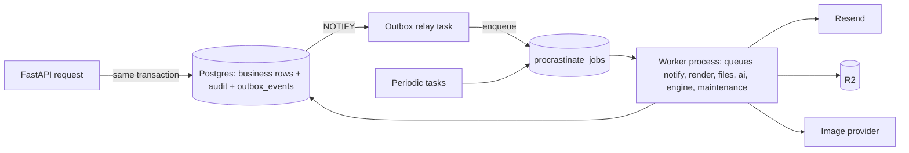

# Plan2Build: event and background job architecture

| Item | Value |
|---|---|
| Document | `SYSTEM_BLUEPRINT/01_ARCHITECTURE/EVENT_AND_BACKGROUND_JOB_ARCHITECTURE.md` |
| Version | 0.1 (proposed) |
| Date | 2026-10-03 |
| Status | Architecture proposal for Chirag's review. Queue choice confirmed by Chirag on 2026-10-03 ("you decide"; Postgres-backed queue chosen, ADR-009). |
| Business authority | `IHB_FLOW.md` v1.2 section 14 (notification events), `PROFESSIONALS_FLOW.md` v1.2 sections 29 and 44.7, S01 §23.2 ("Every notification event is generated from an explicit system event, not from UI-only behavior"), S06 §10 (configurable reminders with suppression, no spam) |
| Related | DOMAIN_ARCHITECTURE.md (events per module), DATA_ARCHITECTURE.md (`outbox_events`, `procrastinate_*`, `notification_deliveries`), API_ARCHITECTURE.md (which endpoints emit), INTEGRATION_ARCHITECTURE.md (provider adapters) |

## 1. Shape

Three mechanisms, one database, one worker process:

| Mechanism | What it is | Used for |
|---|---|---|
| Transactional outbox | A row in `outbox_events` written in the same transaction as the business change | Every domain event. The only way a module tells another module or the outside world that something happened. |
| Job queue (Procrastinate) | Tasks in the `procrastinate` schema, taken with `SELECT ... FOR UPDATE SKIP LOCKED`, woken by `LISTEN/NOTIFY` | Work that must not run inside a web request: notification delivery, rendering, file processing, image generation, recommendation computation, metrics, exports, provider calls |
| Scheduled jobs (Procrastinate periodic tasks) | Cron-style tasks the worker defers to itself | Deadline reminders, lead and quote expiry, variation escalation, reconciliation, backups, pruning |

The outbox relay is itself a worker task: every two seconds (or on NOTIFY) it reads unprocessed outbox rows in `occurred_at` order, fans each out to the handlers subscribed to its type, enqueues the jobs those handlers ask for, and marks the row processed. Handlers run in the relay only when they are cheap and idempotent (write a queue row, enqueue a job); anything slower becomes a job.

Why not an in-process event bus: a Python signal fired inside the request is lost if the process dies after commit, and it makes the request wait on side effects. Why not Redis Streams or RabbitMQ at the POC: a second system to back up, monitor and secure for a few hundred jobs a day; the Postgres queue also gives transactional enqueue, which removes the "committed but never enqueued" class of bugs (ADR-009 records the alternatives).

## 2. Outbox contract

| Field | Rule |
|---|---|
| `event_type` | `module.noun_verbed`, past tense, lower snake case, listed in section 4. New types are added to the catalogue in the same change that emits them. |
| `aggregate_type`, `aggregate_id` | The entity the event is about (`project`, `lead`, `quote_version`, ...). |
| `payload` | Identifiers and the facts a consumer needs to decide; never names, phone numbers, addresses or document contents (P1 only). Consumers load P2 data themselves with their own authorisation. `schema_version` inside the payload. |
| `dedupe_key` | `{event_type}:{aggregate_id}:{version or transition}`, UNIQUE. A retried request that would emit the same event again is rejected at the constraint, which is the signal that the business write itself was a duplicate. |
| `occurred_at` | Transaction time. Ordering is by `occurred_at, id` within one aggregate; no global ordering is promised. |
| Processing | `processed_at IS NULL` partial index; the relay claims a batch of 100 with `FOR UPDATE SKIP LOCKED`, handles, marks. A handler failure leaves `processed_at` null, increments `attempts`, stores `last_error`; after 10 attempts the row stays unprocessed and an alert fires (section 7). |
| Retention | 90 days after processing, then moved to the archive table by the maintenance job (DATA_ARCHITECTURE.md section 13). |

Modules never read another module's tables to find out what happened; they subscribe to events. Modules never call `notifications` directly; `notifications` subscribes to the events it cares about and applies the recipient rules in section 5.

## 3. Job contract

| Topic | Rule |
|---|---|
| Definition | One Python function per job, decorated as a Procrastinate task, living in the module that owns the work (`apps/api/src/p2b/<module>/jobs.py`). The function receives ids, never objects. |
| Queues | `notify` (deliveries; two worker slots), `render` (PDFs with fpdf2, ADR-023: invoices; Build Plan PDFs render in the issuing request; one slot), `files` (sniff, scan, variants; two slots), `ai` (image generation calls; one slot, provider rate-limited), `engine` (recommendation computation and metrics; one slot), `maintenance` (expiry sweeps, reconciliation, archival, backups; one slot), `priority` (OTP email and security notices; two slots, never shared with bulk work). One worker process runs all queues with a concurrency of 8; a second worker process can be started for any subset of queues without code change. |
| Idempotency | Every job is safe to run twice. It re-reads state, checks the precondition (for example "delivery still QUEUED"), and uses UNIQUE constraints or `dedupe_key` columns to make its writes once. A job that finds its work done returns successfully. |
| Retries | Exponential backoff with jitter: 30 s, 2 min, 10 min, 1 h, 6 h (5 attempts) for provider calls; 3 attempts at 1 min for internal work; OTP delivery retries every 20 s for 2 minutes then marks the challenge delivery failed. `retry` strategy is declared on the task. |
| Timeouts | Every provider call has a client timeout (Resend 10 s, image generation 120 s, Razorpay 15 s, OSRM 5 s). The job itself has a lock timeout; a job stuck longer than 15 minutes is marked stalled and requeued once. |
| Failure terminal state | After the last attempt the job is `failed` in `procrastinate_jobs` and a `job_failures` summary row is written (core) with job name, ids and error class. Sentry receives the exception. Operations see failed jobs in the admin console. There is no separate dead-letter queue table at the POC; Procrastinate's failed state plus the summary row is the DLQ. |
| Priority | Procrastinate `priority`; OTP and security notices highest; bulk reminders lowest. |
| Scheduling | `periodic` tasks with cron expressions in IST; each periodic job writes a `job_runs` row (started, finished, counts) so a missed run is visible. |
| Observability | Structured log per job: job name, ids, attempt, duration, outcome. Metrics: queue depth per queue, oldest queued age, success and failure counts, duration histogram (OBSERVABILITY_AND_OPERATIONS.md). |
| Payload size | Ids only; large inputs are read from the database or R2 inside the job. |

## 4. Event catalogue

Each event: emitter, payload (beyond `aggregate_id`), consumers, and the jobs the consumers enqueue. N = notification (see section 5 for recipients), J = job. Only events with consumers are listed; events emitted for audit trail alone (for example `lead.viewed`) are written to the outbox for analytics and have no handler.

### 4.1 Identity and onboarding

| Event | Payload | Consumers and effect |
|---|---|---|
| `otp.issued` | challenge id, channel, purpose | notifications: J `deliver_otp` on `priority` (email now; SMS when enabled) |
| `user.registered` | user id, audience | notifications: N welcome (next-step link); analytics |
| `user.contact_verified` | contact id, kind | professionals: phone verified flag |
| `session.revoked` (by another session or admin) | session id, reason | notifications: N security notice |
| `user.suspended` | user id, reason code | identity: revoke sessions; leads: withdraw open leads if a professional; notifications: N to the user; N to homeowners with active projects if the user is a contractor (PNOT-42) |
| `enquiry.created`, `enquiry.contact_captured` | enquiry id, kind | ops: queue item; notifications: N estimate PDF (J `render_estimate` then N) |

### 4.2 Projects and requirements

| Event | Payload | Consumers and effect |
|---|---|---|
| `project.created` | project id, owner id | analytics |
| `requirement.submitted` | project id | ops: review queue item; notifications: N homeowner confirmation |
| `requirement.needs_info` | project id, questions id | notifications: N homeowner |
| `requirement.accepted` | project id, path | billing: offer package (N with link); design: start concept when paid; projects: instantiate workspace (J `instantiate_workspace` from catalog version); analytics |
| `requirement.changed_after_submission` | project id, changed facts | leads: re-evaluate open leads (withdraw with reason when class no longer covers, 44.7 rule 4); N to contractors |
| `project.workspace_instantiated` | project id, catalog version | specification: create 67 lines with deadlines; construction: create stage instances |
| `project.member_added` | membership id | notifications: N invitation to the member |
| `project.status_changed` | project id, from, to, reason | notifications: N per transition table (hold, resume, cancel to members); leads: withdraw on CANCELLED or ON_HOLD |
| `project.inactive` (scheduled) | project id, days | leads: withdraw open leads at 30 days (configuration); N homeowner nudge at 14 days |

### 4.3 Specification, Build Plan, design

| Event | Payload | Consumers and effect |
|---|---|---|
| `specline.options_issued` | project id, line code | notifications: N homeowner when `decide_by - lead_time` is reached (scheduled, not immediate) |
| `specline.deadline_approaching` (scheduled) | project id, line code, days | notifications: N homeowner (and household) with deep link; suppression: one per line per lead-time step |
| `specline.overdue` (scheduled) | project id, line code | ops: exception item; notifications: N homeowner; N contractor if the line blocks a stage |
| `specline.chosen` | project id, line code, option id, chosen_at | notifications: N contractor on the project and ops; variations: record if the choice changes a locked baseline (S04 §8); analytics |
| `specline.switch_recorded` | project id, line code, reason | notifications: N homeowner; ops: exception if the switch is unapproved |
| `buildplan.signoff_requested` | version id | notifications: N structural engineer |
| `buildplan.signed_off` | version id | ops: queue item (ready to issue) |
| `buildplan.issued` | project id, version id | documents: J `render_build_plan`; rfq: pack available; projects: PLAN_ISSUED; notifications: N homeowner when `documents.rendered` arrives (share link); analytics |
| `baseline.locked` | project id, version id | specification: freeze chosen lines |
| `quote_review.published` | project id, review id | documents: J `render_quote_review`; notifications: N homeowner on rendered |
| `design.requested` | request id, project id | design: J `generate_concept_plan` (when a library layout is used) or wait for the checker |
| `design.plan_approved` | request id, artefact id | design: J `generate_views` on `ai` (3 to 5 views); notifications: none until views exist |
| `design.view_generated` | artefact id | ops: review queue (team review, CQ-26 default) |
| `design.view_reviewed` | artefact id, outcome | design: when all views are reviewed, emit `design.approved` or regenerate rejected ones (max 2 rounds, then ops exception) |
| `design.approved` | request id | buildplan: attach; notifications: N homeowner (view the concept) |
| `design.architect_requested` | project id, request id | recommendation: `recommendation.requested` for architects (use = architect shortlist, once CQ-25 is settled; until then an ops queue item) |
| `design.architect_pack_attached` | request id, artefact ids | rfq: new pack version if an RFQ is open; notifications: N homeowner and ops |
| `design.generation_failed` | request id, provider, error class | design: retry per section 3; after the last attempt, ops exception; N nobody external |

### 4.4 Professionals, Club, leads

| Event | Payload | Consumers and effect |
|---|---|---|
| `professional.profile_created` | profile id | analytics |
| `professionals.account_requested` | contact, firm | identity: create user; notifications: N invitation (PNOT-03) |
| `verification.submitted` | case id, scope | ops: verification queue; notifications: N professional acknowledgement |
| `verification.changes_requested` | case id, items | notifications: N professional (PNOT-06) |
| `verification.verified` | case id, profile id, scope | notifications: N professional (PNOT-05); professionals: listing eligibility if Club member; leads: none |
| `verification.rejected` | case id, reason code | notifications: N professional (PNOT-07) |
| `club.applied` | membership id | ops: curation queue |
| `club.admitted` | membership id, class | notifications: N professional; professionals: J `rebuild_listing_entry`; analytics |
| `club.changes_requested`, `club.rejected`, `club.warned` | membership id, reason, plan | notifications: N professional |
| `club.suspended` | membership id, reason | leads: withdraw open leads with reason; rfq: invitations DECLINED by system with reason; professionals: J `rebuild_listing_entry` (remove); notifications: N professional; N homeowners with open leads |
| `club.removed` | membership id | as suspended, plus listing removal is permanent |
| `club.class_changed` | membership id, from, to | leads: re-evaluate open leads; professionals: J `rebuild_listing_entry` |
| `capacity.changed` | profile id | recommendation: no immediate action (read at compute time) |
| `lead.sent` | lead id, profile id, project id, accept_by | notifications: N contractor (portal + email, 44.7 step 5); analytics |
| `lead.accepted` | lead id | messaging: open thread; rfq: invitation if a Build Plan is issued; notifications: N homeowner |
| `lead.declined` | lead id, reason code | recommendation: `recommendation.requested` for one replacement; notifications: N homeowner (replacement offered) |
| `lead.expired` (scheduled) | lead id | as declined |
| `lead.quoted` | lead id, quote id | none beyond audit (quote events carry the notifications) |
| `lead.selected`, `lead.not_selected` | lead id | notifications: N contractor (selected: PNOT-18; not selected: 44.7 step 10) |
| `lead.withdrawn` | lead id, reason | notifications: N contractor with the reason; N homeowner when withdrawn by operations |

### 4.5 RFQ, quotes, comparison, recommendation

| Event | Payload | Consumers and effect |
|---|---|---|
| `rfq.issued` | rfq id, project id | analytics |
| `rfq.invitation_sent` | invitation id, profile id, respond_by | notifications: N contractor (PNOT-10); scheduled reminder at half the window (suppressed if responded) |
| `rfq.pack_version_changed` | rfq id, version | notifications: N invited contractors (PNOT-12); rfq: quotes against the old version flagged for confirmation |
| `rfq.quote_version_created` | quote id, version id | notifications: N homeowner (quote received, PNOT-15), N ops; leads: QUOTED; recommendation: none until adjustments complete |
| `rfq.quote_withdrawn` | quote id | notifications: N homeowner and ops |
| `rfq.quote_expired` (scheduled) | version id | notifications: N contractor (asks for a revalidation), N ops |
| `rfq.clarification_requested` | clarification id | messaging: thread; notifications: N contractor (PNOT-13) |
| `rfq.adjustments_complete` | rfq id | recommendation: `recommendation.requested` (use = quote recommendation) |
| `rfq.comparison_finalised` | comparison id | documents: J `render_comparison`; notifications: N homeowner on rendered (comparison ready) |
| `rfq.selection_recorded` | rfq id, selected version id, contractor profile id | projects: contractor membership and CONTRACTED; money: contract value and milestone plan; leads: selected and not selected; notifications: N selected contractor, N others, N homeowner (confirmation); analytics |
| `recommendation.requested` | request id, use, context ids | recommendation: J `compute_recommendation` on `engine` |
| `recommendation.computed` | request id | recommendation: `recommendation.review_needed` unless configuration allows auto-approval for the use (BR-142 says review for shortlists) |
| `recommendation.review_needed` | request id | ops: review queue |
| `recommendation.approved` | request id, use | leads: send replacement or shortlist leads (use = contractor shortlist); rfq: attach to comparison (use = quote); notifications: N homeowner (suggestions ready) |
| `recommendation.failed` | request id, error class | ops: exception; recommendation: manual shortlist path |
| `metrics.recomputed` (scheduled) | run id | professionals: metrics visible to the professional; ops: review-due flags |

### 4.6 Construction, variations, money

| Event | Payload | Consumers and effect |
|---|---|---|
| `construction.update_posted` | update id, stage instance id, type | notifications: N homeowner (progress; daily digest unless the type is completion, delay or safety), N ops on delay or safety |
| `construction.completion_requested` | stage instance id | assurance: schedule inspection queue item if the stage is a gate; notifications: N homeowner (review and accept) |
| `construction.stage_completed` | stage instance id | money: milestone DUE (if no gate, or gate cleared); billing: instalment due if the plan ties to milestones (CQ-01); professionals and recommendation: evidence event; notifications: N contractor (accepted) |
| `construction.stage_dates_changed` | stage instance id, old, new, reason | specification: recompute deadlines; notifications: N members (schedule changed) |
| `construction.stage_behind_plan` (scheduled) | stage instance id, days | ops: exception; notifications: N homeowner and contractor (weekly digest) |
| `construction.stage_blocked` | stage instance id, reason | ops: exception; notifications: N members |
| `variation.raised` | variation id, raised by role | ops: assessment queue; notifications: N other party (raised), N ops |
| `variation.assessed` | variation id, ack_by | notifications: N other party with the OTP acknowledgement link (PNOT-34); scheduled escalation at `ack_by` |
| `variation.activated` | variation id, cost, time | money: contract value and completion date; construction: schedule; notifications: N both parties (recorded change) |
| `variation.escalated` (scheduled) | variation id | ops: exception; notifications: N both parties (PNOT-35) |
| `variation.discussion_opened` | variation id | messaging: thread; notifications: N ops |
| `variation.closed` | variation id, outcome | notifications: N both parties; professionals: evidence event |
| `milestone.due` | milestone id | notifications: N homeowner (payment due with amount from the contract, PNOT-21), N contractor |
| `milestone.paid_marked`, `milestone.received_marked` | milestone id, by | notifications: N the other party (asks for their mark) |
| `milestone.settled` | milestone id | records: retention tracking; notifications: N both |
| `milestone.mismatch` (scheduled) | milestone id, days | ops: exception; notifications: N both parties |
| `contract_value.changed` | project id, old, new, cause | analytics |

### 4.7 Assurance, issues, disputes

| Event | Payload | Consumers and effect |
|---|---|---|
| `inspection.scheduled` | inspection id, auditor profile id, scheduled_for | notifications: N auditor (PNOT-38), N homeowner and contractor (date); scheduled reminder the day before (PNOT-39) |
| `inspection.pack_downloaded`, `inspection.synced` | inspection id | analytics; ops: visibility |
| `inspection.locked` | inspection id, report hash | documents: J `render_inspection_report`; ops: approval queue |
| `inspection.report_approved` | inspection id, nc count, gate cleared | assurance: NCs OPEN; specification: lines VERIFIED; documents: J `render_homeowner_report` (plain language); notifications: N homeowner (report), N contractor (findings) (PNOT-40); professionals: evidence event |
| `inspection.returned` | inspection id, reason | notifications: N auditor |
| `nc.raised` | nc id, severity | notifications: N contractor (rectify by), N homeowner (plain language) |
| `nc.rectification_submitted` | nc id | ops: re-inspection queue; notifications: N homeowner |
| `nc.reinspection_scheduled` | nc id, inspection id | as `inspection.scheduled` |
| `nc.closed` | nc id | notifications: N both (PNOT-41); assurance: gate cleared if last |
| `assurance.gate_cleared` | stage instance id | construction: next stage may start; money: milestone DUE; records: handover when the final gate; notifications: N members |
| `issue.raised` | issue id, raised by, assignee | notifications: N assignee, N ops when severity is high (PNOT-30) |
| `issue.acknowledged`, `issue.fixed` | issue id | notifications: N homeowner |
| `issue.verified`, `issue.closed`, `issue.reopened` | issue id | notifications: N assignee; professionals: evidence event on close |
| `issue.escalated` | issue id | ops: exception; notifications: N ops |
| `dispute.opened` | dispute id | notifications: N parties (PNOT-36) |
| `dispute.decided` | dispute id, decided against | notifications: N parties (PNOT-37); professionals: suspension trigger review (Club) |

### 4.8 Records, billing, documents, messaging

| Event | Payload | Consumers and effect |
|---|---|---|
| `handover.started` | project id | notifications: N homeowner (what to expect), N contractor (documents due) |
| `build_record.assembled` | record id | ops: issue queue |
| `build_record.issued` | record id, project id | projects: COMPLETED; documents: J `export_build_record` (PDF and ZIP); notifications: N homeowner (share link) on export done; analytics |
| `build_record.transferred` | record id, to user id | notifications: N both owners |
| `post_handover.optin_recorded` | optin id, service | ops: back-office list; notifications: N homeowner acknowledgement |
| `billing.invoice_issued` | invoice id, due_at | notifications: N homeowner (pay now link); scheduled reminders at 3 days before and on the due date |
| `billing.payment_captured` | attempt id, invoice id | documents: J `render_receipt`; notifications: N homeowner receipt on rendered (PNOT-27) |
| `billing.payment_failed` | attempt id, reason code | notifications: N homeowner (retry link, PNOT-28) |
| `billing.package_paid` | project id, purchase id | projects: PLANNING; design: start concept; buildplan: issue allowed; analytics |
| `billing.instalment_due`, `billing.instalment_overdue` (scheduled) | invoice id | notifications: N homeowner; ops: exception on overdue |
| `billing.refunded` | refund id | documents: J `render_credit_note`; notifications: N homeowner |
| `documents.upload_completed` | file id | documents: J `process_file` on `files` (sniff, scan, variants) |
| `documents.file_available` | file id | assurance: evidence ready; design: input ready; the owning module clears any "processing" flag |
| `documents.file_quarantined` | file id, reason | the owning module marks the reference invalid; notifications: N uploader; ops: exception |
| `documents.rendered` | document id, kind, context id | the requesting module marks the document ready and emits its own "ready" event; notifications per that event |
| `documents.render_failed` | document id, error | retry per section 3; ops exception on final failure |
| `documents.share_token_created` | token id | audit only |
| `message.posted` | message id, thread id | notifications: N thread members per preference (PNOT-49), batched: at most one email per thread per 10 minutes |
| `notification.failed` | delivery id, channel | notifications: fallback channel if configured (email failed and SMS enabled, or the reverse); ops exception after all channels fail for an OTP or a mandatory notice |
| `catalog.version_published` | catalog, version | cache invalidation (PERFORMANCE_ARCHITECTURE.md); recommendation: config reload |

## 5. Notification pipeline

Event to notification to recipient to channel to template to retry to delivery status to deep link:

1. The `notifications` module subscribes to the events above. For each it applies a recipient rule from `notification_rules` (data: event type, recipient role or relation, mandatory flag, channels in order, template key, digest group, suppression window). Rules are configuration, not code.
2. For each recipient a `notifications` row is written (in-app inbox; always, even when no external channel is used), with the deep link (host-aware: homeowner links go to `plan2build.in`, professional links to `professionals.plan2build.in`).
3. Preferences are applied: mandatory notices (OTP, security, payment, acknowledgement requests, inspection findings, lead receipts, suspension) ignore opt-outs; optional ones (progress digests, tips, reminders beyond the first) respect them (S06 §10; OQ-026 default).
4. Suppression: a `digest_group` collapses events into one message per window (construction updates: daily at 18:00 IST; messages: 10 minutes per thread; deadline reminders: one per step). A `suppression_key` prevents the same notice twice in its window.
5. A `notification_deliveries` row per channel is created QUEUED and a job `deliver_notification` is enqueued on `notify` (or `priority` for OTP and security).
6. The job renders the template (`notification_templates`, versioned, English at MVP, locale column present), calls the provider adapter (Resend now; MSG91 and WhatsApp later behind the same interface), stores the provider message id, and marks SENT. Provider webhooks (Resend delivery and bounce events) update DELIVERED, BOUNCED or FAILED.
7. Retries per section 3. On terminal failure `notification.failed` fires and the fallback channel rule applies; OTP failure also preserves the challenge so the user can request again (S02 §20).
8. The in-app inbox is the record of truth for "what the user was told"; delivery rows are the record of "how".

Audience separation: a template is bound to an audience; a professional template can never be rendered for a homeowner recipient, and the deep link host is derived from the recipient's audience, never from the event.

## 6. Scheduled jobs

| Job | Schedule (IST) | Queue | What it does | Idempotency |
|---|---|---|---|---|
| `relay_outbox` | every 2 s and on NOTIFY | in-process loop | Section 2 | claim with SKIP LOCKED |
| `sweep_specline_deadlines` | hourly | maintenance | Emits `specline.deadline_approaching` at each lead-time step and `specline.overdue` after `decide_by` | per line and step `suppression_key` |
| `sweep_leads` | every 15 min | maintenance | Expires leads past `accept_by`; withdraws leads on inactive projects at 30 days | state precondition |
| `sweep_quotes` | hourly | maintenance | Marks quote versions EXPIRED past `valid_to`; reminders at half the RFQ window | state precondition |
| `sweep_variations` | hourly | maintenance | Escalates ASSESSED variations past `ack_by` | state precondition |
| `sweep_milestones` | daily 09:00 | maintenance | Mismatch detection after the configured days; instalment due and overdue | per milestone and day |
| `sweep_schedule` | daily 07:00 | maintenance | `construction.stage_behind_plan` for stages past planned end; weekly digest on Mondays | per stage and week |
| `sweep_inspections` | daily 08:00 | maintenance | Day-before reminders; stale IN_PROGRESS inspections flagged after 7 days | per inspection and day |
| `recompute_metrics` | daily 02:00 | engine | `professional_metrics` from evidence events; Club review-due flags; `metrics.recomputed` | run id; full recompute |
| `reconcile_payments` | daily 03:00 | maintenance | Razorpay payments and refunds versus local attempts; flags differences (INTEGRATION_ARCHITECTURE.md) | per provider id |
| `backup_database` | daily 01:30 | maintenance | `pg_dump` to R2 `p2b-backups` (OBSERVABILITY_AND_OPERATIONS.md) | file name by date |
| `prune_and_archive` | daily 04:00 | maintenance | Succeeded jobs older than 14 days; processed outbox older than 90 days to archive; expired idempotency keys and OTP challenges; share tokens past expiry marked EXPIRED; files PENDING_UPLOAD older than 24 h DELETED | by age |
| `rebuild_listing` | daily 05:00 and on Club events | maintenance | Listing projection rows for public search and the ISR cache tag | full rebuild |
| `check_project_inactivity` | daily 06:00 | maintenance | `project.inactive` at 14 and 30 days without homeowner activity | per project and threshold |
| `verify_backups` | weekly Sunday 02:30 | maintenance | Restores the latest dump into a scratch database in the staging stack and runs row-count checks | by backup file |

Every scheduled job writes `job_runs`; a missed run (no row within 2x the period) raises an alert.

## 7. Failure handling

| Failure | Effect | Handling |
|---|---|---|
| Worker process down | Jobs and outbox accumulate; requests keep succeeding | Docker restart policy; alert on queue depth above 200 or oldest job older than 10 minutes (5 minutes for `priority`) |
| Postgres unreachable | Requests fail (503); worker idles with backoff | Same incident as the database; nothing to do in the queue layer |
| Provider down (Resend, image, Razorpay) | Jobs retry with backoff on their own queue; other queues unaffected | Circuit breaker per provider: after 5 consecutive failures, jobs on that provider are deferred 5 minutes without consuming attempts; alert |
| Poison job (always raises) | Reaches failed after its attempts | `job_failures` row, Sentry event, admin console list, manual requeue after a fix |
| Outbox handler bug | Row stays unprocessed, relay continues with others | Alert at 10 attempts; handler fix; relay reprocesses |
| Duplicate side effect | An email sent twice | Delivery rows are unique per (notification, channel); a second run finds SENT and exits |
| Clock skew between app and database | Scheduled sweeps off by seconds | All deadlines compare against `now()` from the database, not the host |

## 8. Migration path

Triggers and steps, in order (SCALABILITY_AND_MIGRATION_PLAN.md repeats them with the other stages):

1. More worker capacity: run a second `worker` container with a subset of queues (`render`, `files`, `ai`) on the same VPS; then on a second VPS pointed at the same database. No code change.
2. Queue depth sustained above 5,000 or job throughput above about 50 per second (far beyond the POC): move to a managed queue. Because every job call goes through `p2b.core.jobs.enqueue(name, **ids)` and every handler is a plain function, the adapter can target Redis-backed (RQ, Dramatiq) or a managed broker without touching modules. The outbox stays; only the relay's target changes.
3. Cross-service events (after a module is extracted): the relay publishes outbox rows to a broker topic as well; consumers in other services subscribe. The outbox table format is already the message format.

## 9. Open points

| ID | Question | Default until answered |
|---|---|---|
| AQ-12 | Which notices are mandatory versus optional (OQ-026, POQ-045)? | Section 5 step 3 list |
| AQ-13 | Daily digest time for construction updates and whether homeowners can switch to immediate | 18:00 IST, immediate available as a preference |
| AQ-14 | Lead-time steps for decision reminders (how many days before `decide_by`) | 14, 7 and 2 days for long-lead items; 7 and 2 for others; configuration |
