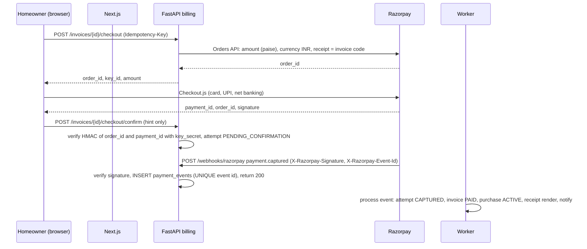

# Plan2Build: integration architecture

| Item | Value |
|---|---|
| Document | `SYSTEM_BLUEPRINT/01_ARCHITECTURE/INTEGRATION_ARCHITECTURE.md` |
| Version | 0.1 (proposed) |
| Date | 2026-10-03 |
| Status | Architecture proposal for Chirag's review. Provider choices confirmed by Chirag on 2026-10-03: Razorpay Checkout in-app, Resend, OpenStreetMap stack, email OTP first then SMS. |
| Business authority | CD-01 (construction money never through Plan2Build), CD-05 (one package, instalments), BR-040 (server-side payment confirmation), BR-041 and BR-042 (idempotent webhooks, failed payment never paid), DEP-11 (fee payment path), BR-014 (secrets never in the client), S01 §21 (webhook signatures and idempotency, rate-limited payment initiation), S06 §9 and §11 |
| Related | API_ARCHITECTURE.md (webhook and checkout endpoints), EVENT_AND_BACKGROUND_JOB_ARCHITECTURE.md (jobs and the notification pipeline), AI_AND_RECOMMENDATION_ARCHITECTURE.md (image provider adapter), SECURITY_ARCHITECTURE.md (threats), COST_MODEL.md |

## 1. Rules for every integration

| Rule | Detail |
|---|---|
| One adapter per provider | `apps/api/src/p2b/integrations/<provider>/` exposes a small interface owned by the consuming module (`MessageProvider`, `PaymentProvider`, `ImageProvider`, `TravelTimeProvider`, `GeocodeProvider`, `ScanProvider`). Modules import the interface, never the SDK. Swapping a provider is a new adapter plus a configuration value. |
| Secrets | Server-side only, read from the environment at start, never logged, never in the client bundle. Razorpay's public `key_id` is the single value the browser receives. Rotation per SECURITY_ARCHITECTURE.md section 9. |
| Timeouts | Every outbound call has a connect and a read timeout (table in section 10). No unbounded calls. |
| Where calls happen | Inside a request only when the user is waiting for the result (Razorpay order creation, geocode of a typed address). Everything else runs in a job with retries. |
| Retries and breakers | Retries only in jobs, with backoff and jitter; a per-provider circuit breaker defers jobs after 5 consecutive failures (EVENT_AND_BACKGROUND_JOB_ARCHITECTURE.md section 7). |
| Idempotency | Outbound: the provider's idempotency mechanism where one exists (Resend `Idempotency-Key`, Razorpay `receipt` and refund `notes`), otherwise our own record checked before the call. Inbound: provider event id stored with a UNIQUE constraint before any state change. |
| Webhooks | Raw body captured before parsing; signature verified with the provider's secret; event stored; 200 returned; processing in a job. An unverifiable signature returns 401 and writes a `security_events` row. Replays are 200 with no effect. Secrets per environment. |
| Data sent | Listed per provider in section 10 and kept minimal. No provider receives a homeowner's name with a plot address and a phone together; image providers receive geometry images and style words only. |
| Environments | Test credentials in LOCAL, DEV and STAGING (Razorpay test mode, Resend with a recipient allow-list, image provider with a daily cap); production credentials only in PROD (ENVIRONMENT_AND_DEPLOYMENT.md). |
| Record | `integration_calls` (core; P1): provider, operation, request id, status, latency, error class, cost estimate; 90 days. Used for reconciliation, cost tracking and alerting. |

## 2. Payments: Plan2Build's fee through Razorpay

Two money flows exist and only one touches a gateway:

| Flow | Through Plan2Build? | Mechanism |
|---|---|---|
| Homeowner pays Plan2Build for the package (CD-05) | Yes | Razorpay Checkout in-app, server-verified, webhook-reconciled (this section) |
| Homeowner pays the contractor or an architect (CD-01) | Never | Marks only (`payment_milestones`, `money` module); no gateway, no escrow, no Razorpay Route; the contract value and milestone amounts are facts the platform records, not money it moves |

### 2.1 Flow

The client callback is a hint that lets the page show "confirming" immediately; it never marks anything paid (BR-040). Only a verified webhook, or the reconciliation job reading the Payments API, moves an invoice to PAID.

### 2.2 Rules

| Topic | Rule |
|---|---|
| Amounts | Integers in paise on the wire; `numeric(14,2)` INR in the database; the webhook amount must equal the invoice amount due or the event is stored and flagged `AMOUNT_MISMATCH` for operations, never applied |
| Order to invoice | One Razorpay order per payment attempt; `payment_attempts.provider_order_id` UNIQUE; the order `receipt` is the invoice code so provider reports map back |
| Events handled | `payment.captured`, `payment.failed`, `order.paid` (treated as confirmation of captured), `refund.processed`, `refund.failed`, `payment.dispute.created` (ops item). Unknown event types are stored and ignored. |
| Idempotency | `payment_events.provider_event_id` UNIQUE (from `X-Razorpay-Event-Id`); a second delivery hits the constraint and returns 200 (BR-041; S06 §16.1 critical test "webhook received twice does not double-post") |
| Ordering | Events may arrive out of order; the processor applies transitions through the state table (STATE_MODEL.md section 15) and treats an already-terminal attempt as done |
| Failure | `payment.failed` marks the attempt FAILED and leaves the invoice ISSUED with a retry link (BR-042; PEC-062); the homeowner can create a new attempt (new order) |
| Timeout or unknown | An attempt INITIATED for more than 30 minutes without an event is checked by the reconciliation job against the Payments API (`GET /orders/{id}/payments`); the UI shows "pending, do not pay again" (EC-030; BR-043) |
| Retries from Razorpay | Razorpay retries undelivered webhooks for about 24 hours; our endpoint must answer within 5 seconds, which the store-then-200 pattern guarantees |
| Refunds | Operations request a refund with reason (CQ-04 policy pending); the job calls the Refunds API with `notes.refund_id` = our refund id and checks for an existing refund on the payment first; `refund.processed` completes it; partial refunds allowed; a credit note document is rendered |
| Invoices and receipts | Plan2Build issues its own invoice numbers (sequence per financial year, GST format with the accountant: AQ-11); Razorpay's invoice product is not used; receipts and invoices are rendered documents in R2 |
| Reconciliation | Daily job: every attempt and refund in a non-terminal state older than 30 minutes is queried; every captured payment in Razorpay for the last 3 days is matched to a local attempt; differences become `billing_exceptions` for operations; settlement reports (T+2 or T+3) are exported monthly for the accountant, not reconciled in the application at the POC |
| Rate limits | Checkout creation T2 plus a per-invoice limit of 5 attempts per hour; webhook endpoint T4 |
| Testing | Razorpay test mode in staging with test cards and UPI; webhook delivered to the staging host; a replay fixture in CI covers duplicate, out-of-order and amount-mismatch cases |

Not used: payment links (CQ-03 answered for the MVP with in-app Checkout; links can be added later behind the same `PaymentProvider` interface for ops-assisted collection), subscriptions (instalments are our invoices, not gateway subscriptions, so the schedule stays under our control), Razorpay Route or escrow (CD-01).

## 3. Email: Resend

| Topic | Rule |
|---|---|
| Domain | Sending domain `plan2build.in` with SPF, DKIM and DMARC (`p=quarantine` after a warm-up fortnight at `p=none`); return-path subdomain as Resend requires. From addresses per audience and purpose: `no-reply@` for OTP and notices, `team@` for human replies, with reply-to set to a monitored inbox. |
| Templates | Rendered by the worker from `notification_templates` (MJML or plain HTML compiled at build time, versioned); Resend's template feature is not used so versions and audits stay in our database |
| Idempotency | Resend `Idempotency-Key` header = our `notification_deliveries.id`; a retried job cannot double-send |
| Webhooks | `email.delivered`, `email.bounced`, `email.complained`, `email.delivery_delayed` through `POST /webhooks/resend` with Svix signature verification; updates `notification_deliveries.state`; a hard bounce or complaint adds the address to `contact_suppressions` and raises an ops item for a verified user's contact |
| Rate limits | Resend's default is a few requests per second; the `notify` queue sends one at a time per worker slot, which is far below it; the batch endpoint is used for digests |
| OTP | Sent on the `priority` queue; subject and body carry the code and the purpose; links are not used for OTP at MVP (AQ-03 default: code) |
| Staging | Recipient allow-list (`@plan2build.in` and named testers); any other recipient is written as SENT_SUPPRESSED without a provider call (AQ-07 default) |
| Fallback | None at MVP for email itself; when SMS is enabled, `notification.failed` on an OTP email triggers an SMS send if the phone is verified |

## 4. SMS and WhatsApp (later, same interface)

| Provider | When | What is needed before use |
|---|---|---|
| MSG91 (SMS) | When Chirag enables SMS OTP ("then we'll be using sms too") | DLT registration (entity and sender header), approved templates for OTP and transactional notices, India-only numbers, delivery-report webhook; the `MessageProvider` adapter adds `send_sms`; the OTP challenge gains `channel = SMS`; cost about ₹0.16 to ₹0.25 per message plus GST (COST_MODEL.md) |
| WhatsApp Business (Cloud API through a BSP) | After pilot behaviour shows reminders need it (S07 §16.7) | Business verification, template approvals, opt-in capture (a consent record), conversation-based pricing, 24-hour session rules; deep links keep working because they are plain URLs |

Both plug into the notification pipeline as channels; recipient rules choose channels in order; nothing in modules changes.

## 5. Maps, geocoding, travel time (OpenStreetMap stack)

| Need | POC choice | Rule |
|---|---|---|
| Map display (plot pin, service area drawing, listing map) | Vector or raster tiles from a tile provider with a free tier (MapTiler, or Protomaps self-hosted PMTiles for Chhattisgarh served from R2) | OpenStreetMap's own tile servers are not for production applications under their usage policy; a tile provider or self-hosted tiles is required; attribution shown on every map |
| Geocoding (typed address to a point) | Pin drop is the primary input (CD-02 form); typed-address lookup through Nominatim (public instance for the POC at under 1 request per second with caching, or a self-hosted instance later) | Results cached in `geocode_cache` by normalised query (P1); the homeowner confirms the pin; the stored truth is the pin, not the geocoder's guess |
| Reverse geocoding (pin to locality name) | Nominatim with the same cache | Locality name shown on listings and leads instead of the address (privacy) |
| Distance for eligibility and the travel signal | PostGIS `ST_Distance` on `geography` times an urban factor (1.4, configuration) | No external call |
| Road travel time | `OsrmProvider` against an OSRM container with the Chhattisgarh extract (Geofabrik), enabled only when the straight-line signal proves too coarse | About 1 GB RAM for the state extract; monthly data refresh job; 5 second timeout; straight-line fallback |
| Google Maps | Behind the same interfaces (`GeocodeProvider`, `TravelTimeProvider`, tile URL) when coverage or quality demands it | Billing account and API restrictions by HTTP referrer and IP; not at the POC |

## 6. Image generation providers

Adapter and contracts in AI_AND_RECOMMENDATION_ARCHITECTURE.md section A3. Integration facts:

| Provider | Auth | Data sent | Terms to verify at purchase | Cost estimate |
|---|---|---|---|---|
| Google Gemini API (Gemini 3.1 Flash Image) | API key, server-side, restricted to the project | Reference images (rasterised drawings without title blocks), prompt text | Paid tier terms on not training on inputs; data retention window; region of processing (OQ-059 residency statement) | About $0.067 per image (2026-10-03) |
| fal.ai or Replicate (FLUX.1 Kontext pro) | API key | Same | Same questions | About $0.04 per image |

A weekly canary job generates one image per provider on staging to catch model retirements and API changes before they reach a homeowner's project.

## 7. Virus scanning and file processing

| Topic | Choice |
|---|---|
| Scanner | ClamAV (`clamd`) as a container on the VPS, signatures refreshed by `freshclam` daily; `ScanProvider.scan(file) -> CLEAN or INFECTED(signature)`. About 1.3 GB RAM resident; included in the VPS sizing (CLOUD_AND_HOSTING_ARCHITECTURE.md). External scanning APIs would send private documents to a third party and are not used. |
| Type detection | `libmagic` on the first bytes; the declared type must agree with the sniffed type or the file is QUARANTINED |
| Images | Re-encoded with Pillow (strips EXIF including GPS and camera serials), resized variants (thumbnail, 1600 px), original kept |
| PDFs | Checked with `pikepdf`: encrypted or JavaScript-bearing PDFs are quarantined; page count and size limits per purpose |
| DXF, DWG | Accepted for drawings from the team and architects; not parsed at the POC; scanned and stored |
| Outcome | `documents.file_available` or `documents.file_quarantined`; quarantined objects stay in R2 under `quarantine/` for 30 days then are deleted |

## 8. Document rendering

Superseded in part by ADR-023 (2026-10-05): fpdf2 renders Build Plan PDFs (in the issuing request) and invoices (in the `render` job); the WeasyPrint design below is not used. WeasyPrint in the worker (`render` queue) renders HTML templates to PDF for Build Plans, quote reviews, comparisons, inspection reports, receipts, invoices, credit notes, estimate PDFs and build record exports (ADR-018). Fonts bundled in the image; templates versioned with the catalog; rendered documents are immutable objects with a `document_versions` row. A render is a job with a 120 second timeout and 3 retries; the Build Plan render stays under 30 seconds (BR-156 target).

## 9. Cloudflare

DNS for `plan2build.in` and subdomains, proxied (orange cloud) for the three application hosts and `files.plan2build.in`; R2 for all objects (ADR-006); Cloudflare Access is not used at the POC (the admin host relies on MFA plus an optional IP allow-list, AQ-02); WAF managed rules on the free plan; Bot Fight Mode on the public pages only (it must not interfere with webhook endpoints, which are excluded by path rule).

## 10. Provider registry

| Provider | Purpose | Interface | Timeout (connect, read) | Retry | Webhook | Idempotency | Fallback | Environment separation |
|---|---|---|---|---|---|---|---|---|
| Razorpay | Package fee collection, refunds | `PaymentProvider` | 5 s, 15 s | Jobs only (refund, reconcile); order creation fails fast | Yes, HMAC-SHA256 body signature, event id header | Provider event id; order per attempt; refund notes | None (manual recording by ops with evidence if the gateway is down for long) | Test mode keys and a separate webhook secret per environment |
| Resend | Email delivery | `MessageProvider` | 5 s, 10 s | 5 attempts, backoff | Yes, Svix signature | `Idempotency-Key` = delivery id | SMS once enabled (OTP only) | Allow-listed recipients outside PROD |
| MSG91 (later) | SMS | `MessageProvider` | 5 s, 10 s | 5 attempts | Delivery reports | Our delivery id in the request | Email | Test sender in non-PROD |
| WhatsApp BSP (later) | WhatsApp | `MessageProvider` | 5 s, 10 s | 5 attempts | Status callbacks | Delivery id | SMS or email | Sandbox numbers |
| Tile provider | Map tiles | URL template in the web app | browser | browser | No | n/a | Cached tiles degrade gracefully | Separate keys with referrer restrictions |
| Nominatim | Geocoding | `GeocodeProvider` | 3 s, 5 s | 2 attempts | No | Cache by query | Pin drop | Shared public instance with a user agent string; self-host when volume grows |
| OSRM (optional) | Travel time | `TravelTimeProvider` | 2 s, 5 s | 1 attempt | No | n/a | Straight-line | Same container image, separate stack |
| Gemini API | 3D views | `ImageProvider` | 10 s, 120 s | 3 attempts | No | `request_tag` and our artefact id | FLUX Kontext | Daily cap in non-PROD |
| fal.ai or Replicate | 3D views fallback | `ImageProvider` | 10 s, 120 s | 3 attempts | Optional completion webhook | Artefact id | None | Same |
| ClamAV (local) | Scanning | `ScanProvider` | 2 s, 60 s | 3 attempts | No | Re-scan is safe | Quarantine on failure (fail closed) | Per stack |
| Sentry, Grafana Cloud, UptimeRobot | Observability | agents and SDKs | n/a | n/a | Alert webhooks inbound to email or chat | n/a | Logs stay local | Separate projects per environment |
| Cloudflare R2 | Object storage | boto3 S3 client | 5 s, 60 s | 3 attempts | No | Immutable object keys | None (R2 outage stalls uploads; the application keeps running) | Separate buckets per environment |
| Supabase (Postgres) | Database | asyncpg through SQLAlchemy | pool and statement timeouts | Driver level | No | n/a | None | Separate projects per environment |

## 11. Notification pipeline integration points

The pipeline is specified in EVENT_AND_BACKGROUND_JOB_ARCHITECTURE.md section 5. Provider-facing details: each channel adapter returns a provider message id and a normalised status; status webhooks map to `QUEUED, SENT, DELIVERED, BOUNCED, FAILED, SUPPRESSED`; deep links are absolute URLs on the recipient's audience host; unsubscribe links for optional notices update preferences through a signed, single-purpose token (never a session).

## 12. Open points

| ID | Question | Default until answered |
|---|---|---|
| AQ-19 | Tile provider choice (MapTiler free tier versus self-hosted Protomaps PMTiles on R2) | MapTiler free tier for the POC; Protomaps when the free tier is exceeded |
| AQ-20 | Who the accountant is and the GST invoice format (AQ-11 restated for integration) | Sequential invoice numbers per financial year; fields per the accountant |
| AQ-21 | Whether the OSRM container is enabled at the POC | Off; straight-line with a 1.4 factor |
