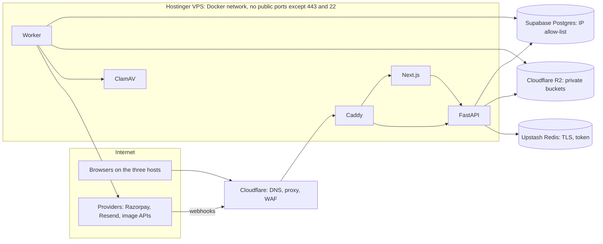

# Plan2Build: security architecture

| Item | Value |
|---|---|
| Document | `SYSTEM_BLUEPRINT/01_ARCHITECTURE/SECURITY_ARCHITECTURE.md` |
| Version | 0.2 (2026-10-04: B-03 registration timing, delivery ciphertext, CSRF on public writes; earlier text 0.1 proposed) |
| Date | 2026-10-03 |
| Status | Architecture proposal for Chirag's review. Session and OTP decisions confirmed by Chirag on 2026-10-03 (server-side sessions; email OTP first). |
| Business authority | BR-010 (server-side authorisation), BR-013 (project isolation), BR-161 (project-level authorisation and version on every write), BR-144 and PBR-061 (MFA for admin and consultants), BR-011 and BR-012 (rate limits and OTP lockout), BR-014 (secrets never in the client), BR-162 (encryption), BR-030 (uploads), BR-015 and BR-071 (consent), BR-016 and BR-140 to BR-142 (audit, no hard deletes, overrides), BR-122 and PBR-046 (auditor never sees supplier or brand), BR-088 and PBR-033 (contractors never see each other's quotes), S06 §11 and §16.1 |
| Related | API_ARCHITECTURE.md (conventions), DATA_ARCHITECTURE.md (privacy classes, retention), CLOUD_AND_HOSTING_ARCHITECTURE.md (network), OBSERVABILITY_AND_OPERATIONS.md (security alerts and incident runbooks), TESTING_ARCHITECTURE.md (security tests) |

## 1. Principles

1. Authentication, then authorisation, then business logic, in that order, on the server, for every request. The UI is never a control (BR-010).
2. Deny by default. Every endpoint declares its actor set and its object rule; an endpoint without a rule fails the import linter.
3. Least data. Responses are shaped per role; providers receive the minimum; logs carry ids, not personal data.
4. Immutable records and audit for anything that matters (BR-140, BR-141); overrides carry a reason (BR-142).
5. Secure defaults in frameworks, not custom crypto: argon2id, TOTP per RFC 6238, HMAC verification from provider SDKs, parameterised SQL through SQLAlchemy, Pydantic validation.
6. Security work is sized for a two-person team: the controls below are standard, testable and cheap to run; the costly items (external penetration test) are scheduled, not skipped.

## 2. Trust boundaries

Boundaries: browser to Caddy (TLS, cookies, CSRF); Caddy to application (loopback only); application to database (TLS, allow-listed IP, least-privilege role); application to R2 (signed requests, presigned URLs for browsers); worker to providers (API keys, timeouts); providers to webhooks (signatures).

## 3. Authentication

### 3.1 OTP (email now, SMS later)

| Topic | Rule |
|---|---|
| Code | 6 digits from a CSPRNG; stored as argon2id hash with a server pepper; shown once in the message; valid 10 minutes (AQ-03 default). Because delivery is a job, the code is also held encrypted (AES-GCM, application key, the challenge id as associated data) until the job has sent it; the ciphertext is then cleared |
| Challenge | `otp_challenges` row bound to contact, audience (host), purpose (LOGIN, REGISTER, VERIFY_CONTACT, ACKNOWLEDGE_SPEC_LINE, ACKNOWLEDGE_VARIATION, SELECTION, TRANSFER) and, for acknowledgements, the object id. A code issued for one purpose or object cannot verify another. |
| Attempts | 5 wrong codes lock the challenge; 10 failed challenges per contact per hour lock the contact for 1 hour (`OTP_LOCKED`, 423) with a security event and, for an existing user, a security notice |
| Sends | 5 per contact per 10 minutes; 20 verifications per IP per 10 minutes; 60 OTP starts per IP per hour (T1) |
| Enumeration | `otp/start` returns the same response for known and unknown contacts; timing is equalised by always hashing |
| Registration | The user is created only after the OTP is verified, never at `otp/start` (B-03, Chirag 2026-10-04). A verified contact on first login creates the user with the audience's default role; an invitation token (members, own contractor, ops-created accounts) binds the new user to the intended role and project; without an invitation a professional registers as unverified. Slice 1 opens self-registration on the homeowner host only |
| Acknowledgements (BR-070, BR-100) | The OTP that freezes a specification line or activates a variation is a separate challenge with purpose and object id, requested from the action screen; the audit row stores the challenge id so the record shows which code acknowledged what |
| Recovery | Lost access to the email: operations verify identity on a call against the profile and the project facts, then change the contact through an admin endpoint with MFA, reason and audit; no self-service recovery path exists at MVP (AQ-22) |
| SMS later | Same challenge model with `channel`; OTP via SMS and email simultaneously for acknowledgements once SMS exists |

### 3.2 Sessions

| Topic | Rule |
|---|---|
| Token | 256-bit random, base64url; the database stores `sha256(token)`; the cookie carries the token; a database leak does not yield sessions |
| Cookies | `p2b_ihb_session` on `plan2build.in`, `p2b_pro_session` on `professionals.plan2build.in`, `p2b_ops_session` on `admin.plan2build.in`; `HttpOnly; Secure; SameSite=Lax; Path=/`; host-only (no `Domain` attribute) so a cookie for one host is never sent to another; `__Host-` prefix |
| Audience binding | The session row stores the audience; a request on another host with that cookie name cannot exist, and the API rejects a mismatch anyway |
| Lifetime | Homeowner and household: 14 days idle, 90 days absolute. Professionals: 7 days idle, 30 days absolute. Operations and admin: 12 hours idle, 24 hours absolute; MFA re-verification required every 8 hours and before overrides, approvals, refunds, catalog publishes and account administration (`mfa_verified_at` on the session). |
| Rotation | Session id rotated on privilege change (MFA verify, role change); old id revoked |
| Revocation | User-initiated (sessions list), admin suspension (all sessions), password-less so no "password change" trigger; revocation is immediate because every request reads the session row from Postgres (a 60-second Redis cache with delete-on-revoke exists behind a flag, off at the POC; PERFORMANCE_ARCHITECTURE.md section 5) |
| Device record | `user_agent` family and first IP stored for the sessions list; full user agent and IP go to security events, not the session row |
| Never | JWT access tokens in localStorage, long-lived bearer tokens in the browser, sessions shared across hosts |

### 3.3 MFA (operations, admin, structural engineer sign-off)

TOTP per RFC 6238, 30 second step, one step of drift; secrets encrypted at rest with the application key (AES-GCM, key in the environment, rotated by re-encryption); ten recovery codes hashed with argon2id, single use; enrolment required at first login on `admin.plan2build.in`; the structural engineer's sign-off endpoint on the professional host requires MFA because it is a life-safety approval (BR-055). Whether auditors need MFA is open (PAMB-023); default no, because the PWA already binds to a verified phone and inspection reports pass central approval (AQ-23).

### 3.4 Machine authentication

Webhooks: provider signatures (section 7). Internal calls between Next.js and FastAPI: loopback only, with the user's cookie forwarded on SSR; no service token. Future API clients (none at MVP): scoped API keys stored hashed, per client, with rate limits.

## 4. Authorisation

### 4.0 As built for the Slice 2 foundation (2026-10-04)

Staff roles OPS and ADMIN live in `staff_roles` and are checked from the database on every request, after session and account status and before MFA. Operations and admin routes name their roles; OPS does not admit admin routes and ADMIN does not admit review routes. Staff accounts exist only through the server command (no self-registration on the admin host); revoking a role ends the account's sessions. MFA is implemented as section 3.3 describes, with each TOTP step accepted once and the session id rotated on success without extending the absolute lifetime. Not built yet: admin reset of a lost authenticator, structural engineer sign-off.

### 4.0b As built for billing (Slice 3.3, 2026-10-05)

Card data: payments use Razorpay's hosted Checkout, so card, UPI and bank details never reach Plan2Build; billing stores provider ids, method and amounts only, and the integration stays outside PCI DSS card-data scope. Only the Razorpay key id reaches the browser. The checkout callback is a hint whose signature is checked; webhooks are verified with HMAC-SHA256 on the raw body, stored once by event id and processed under the order lock; invalid signatures write a security event. Production refuses the fake gateway, test keys and TEST configuration; non-production refuses live keys. Refund decisions, package cancellation, exception resolution and configuration publishing need a staff role and MFA within the window, a reason and an audit row. Launch gates still open: the nonce CSP naming Razorpay Checkout's script, frame and connect sources and the storage endpoint (N-02, N-07); the bucket CORS rule from `infra/r2/` (N-01).

### 4.1 Layers

| Layer | Check | Failure |
|---|---|---|
| Session | Valid, unexpired, audience matches host | 401 |
| Account status | ACTIVE (SUSPENDED can read own data and open disputes only; CLOSED nothing) | 403 |
| Role | The endpoint's actor set (homeowner, household, professional category, auditor, ops, admin) | 403 |
| MFA | Required for the endpoint and verified within 8 hours | 403 `MFA_REQUIRED` |
| Membership or ownership | `project_memberships` with role and permissions for the project; the file's context; the quote's owner; the inspection's assignee | 404 outside visibility, 403 for a visible object without the right |
| State | Transition allowed from the current state (STATE_MODEL.md) | 409 |
| Version | `version` matches | 409 |

Implemented as FastAPI dependencies composed per router, so a route cannot be written without naming its rule. The import linter fails any router function without an authorisation dependency.

### 4.2 Object rules that matter most

| Rule | Enforcement |
|---|---|
| A homeowner never reaches another homeowner's project (BR-013) | Every project-scoped query joins `project_memberships` on the current user; no endpoint accepts a project id without that join; a test enumerates every project endpoint with a foreign membership and expects 404 |
| Contractors see only invited projects and their own submissions (PBR-033); never another quote (BR-088) | Quote and comparison queries filter by `professional_profile_id = current`; the comparison endpoint exists only on the homeowner host; the RFQ pack response model has no field for other quotes |
| Contractor costs never visible to the homeowner (BR-086) | The homeowner response models for quotes contain submitted prices and adjustments only; internal rate fields do not exist in those models |
| Auditor never sees supplier or brand (BR-122) | A separate response model for the auditor's pack and line views without those fields; a test asserts the serialised JSON has no such keys |
| Household members act within their permissions (OQ-027) | `permissions jsonb` on the membership checked per action; OTP acknowledgements stay with the owner |
| Own contractor (CD-27) | Membership with `scope = PROJECT_ONLY` on that project; no listing, no leads, no RFQ invitations elsewhere |
| Operations cannot edit data directly | No ops endpoint writes a business field outside a module transition; overrides are transitions with reason; the database roles give the application `app_rw` and people `app_readonly` only |
| Admin separation | Admin endpoints live under `/admin`, require the ops session with the ADMIN role and MFA, and are reachable only on `admin.plan2build.in` (Caddy routes `/api/v1/admin/*` only from that host) |

### 4.3 Response shaping

One response model per audience per resource where fields differ (`SpecLineHomeownerView`, `SpecLineContractorView`, `SpecLineAuditorView`). Shaping by model, not by deleting fields after serialisation, so a forgotten filter cannot leak.

## 5. Threat model

| Threat | Vector | Mitigations | Residual and test |
|---|---|---|---|
| Cross-site scripting | User content (messages, notes, file names) rendered in React or in PDF templates | React escaping; no `dangerouslySetInnerHTML` (lint rule); Markdown not supported in user fields; CSP with nonces, `default-src 'self'`, `frame-ancestors 'none'`, `object-src 'none'`; PDF templates autoescape; file names regenerated server-side | Residual: third-party scripts (Razorpay Checkout) allowed by explicit CSP source. Test: payload fixtures in e2e |
| Cross-site request forgery | Cookie sessions; login CSRF through `otp/verify` | `SameSite=Lax`; `X-Requested-With` header and `Origin` check on every state change, with or without a cookie (webhooks exempt, signature-verified); no state change on GET | Test: request without header returns 403 |
| IDOR and broken object authorisation | Guessable or leaked ids | UUIDv7 ids; membership joins (4.2); 404 outside visibility; presigned URLs scoped to one object | Test: foreign-membership sweep over all endpoints |
| Privilege escalation | Role or audience confusion; household to owner; professional to ops | Audience bound to host and session; role from the database, never from the client; MFA for privileged actions; invitations carry the role; no self-registration as ops | Test: cross-host cookie replay, role tampering fixtures |
| Malicious uploads | Executables, polyglots, PDF with JavaScript, images with embedded payloads | Presigned PUT with content type and size limits; sniffing; re-encoding images; `pikepdf` checks; ClamAV; quarantine; `Content-Disposition: attachment` and `X-Content-Type-Options: nosniff` on downloads; never served from an application host origin | Residual: zero-day in the renderer; downloads are never executed server-side. Test: EICAR and polyglot fixtures |
| SSRF | URLs supplied by users (none at MVP) or by providers (webhook payload URLs) | The application makes outbound calls only to configured hosts; no user-supplied URL is fetched; the worker's egress list is documented | Test: fixture with a loopback URL in a payload is ignored |
| SQL injection | Query building | SQLAlchemy Core and ORM with bound parameters; raw SQL only in migrations and the search layer with parameters; `app_rw` has no DDL | Test: Schemathesis and a lint for f-strings in `text()` |
| Command injection | Rendering and file tools | No shell calls with user input; fpdf2 (ADR-023), Pillow, pikepdf, libmagic called as libraries; ClamAV over a socket | Test: file names with shell metacharacters |
| Credential theft | Session cookies, OTP codes, API keys | HttpOnly cookies; hashed sessions and codes; keys in environment files with mode 600; no secrets in images or repo (gitleaks in CI); Sentry scrubbing | Residual: a compromised VPS. Mitigation: SSH keys only, patches, minimal services |
| OTP abuse | Brute force, SMS pumping (later), enumeration | Attempt and send limits; lockouts; uniform responses; SMS limited to Indian numbers with per-number and per-IP caps when enabled | Test: lockout thresholds |
| Rate abuse and denial of service | Floods on public pages, estimate, uploads | Cloudflare proxy and WAF; token buckets per tier; upload size caps; job queue backpressure; Caddy request limits | Residual: application-level DoS beyond VPS capacity; alert and Cloudflare "under attack" mode |
| Webhook spoofing | Forged Razorpay or Resend calls | Signature verification on the raw body; per-environment secrets; event id uniqueness; amounts checked against invoices; webhook paths excluded from caching and bot rules but allowed only with valid signatures | Test: wrong-signature fixture returns 401 and logs |
| Payment callback tampering | Client reports success | Client callback is a hint; only webhooks or API reconciliation change state (BR-040) | Test: forged client confirm leaves the invoice ISSUED |
| Leaked signed URLs | Shared or logged presigned links | 15 minute expiry (5 for P3); URL bound to one object and method; `document_access_log`; never logged in full (query string stripped in logs); share tokens are the deliberate path with revocation | Residual: a link used within its window by the wrong person; accepted and audited |
| API data exposure | Over-fetching, debug responses, OpenAPI exposure | Response models per audience; no generic serialisation; OpenAPI UI off in PROD; error bodies without stack traces; `INTERNAL` code only | Test: snapshot of each response model's fields |
| AI data leakage | Personal data sent to image providers; prompt injection in free text | Geometry images without title blocks; style vocabulary, no free text; no LLM at the POC; provider terms recorded | Test: prompt builder unit tests assert absence of P2 fields |
| Insider misuse (operations) | Direct edits, exports, snooping | No direct database access for people (`app_readonly` for named analysts only); every ops read of a thread or document is logged; overrides need reasons; admin audit search; separation of ops and admin roles | Residual: a privileged admin; mitigated by audit and small team |
| Supply chain | Compromised dependency or image | Lockfiles; Dependabot; `pip-audit` and `npm audit` in CI; Trivy image scan; base images pinned by digest; no post-install scripts from unknown packages | Residual: upstream compromise before detection |
| Session fixation and hijacking | Pre-set cookie, stolen cookie | Session created only after OTP verify, id never accepted from the client before that; rotation on privilege change; `Secure` and host-only cookies | Test: fixation attempt |
| Clickjacking | Framing the app | `frame-ancestors 'none'`; `X-Frame-Options: DENY` | Header test |
| Open redirect | `next` parameters after login | Allow-list of relative paths; no absolute URLs | Test |
| Subdomain takeover | Dangling DNS | DNS records created with their targets; quarterly review; staging hosts removed when unused | Checklist |
| Backup exposure | Dumps in R2 | `p2b-backups` bucket private, separate API token with write-only for the backup job and read for restores; dumps encrypted with `age` before upload; keys held by Chirag and one other person | Restore drill verifies decryption |
| Log leakage | Personal data in logs | Structured logging with an allow-list of fields; contact values masked; Sentry `send_default_pii=False` and scrubbers | Log review in staging |

## 6. Browser and transport controls

| Control | Value |
|---|---|
| TLS | Cloudflare edge TLS 1.2 minimum, 1.3 preferred; origin certificate from Cloudflare on Caddy; Full (strict) mode; HSTS `max-age=31536000; includeSubDomains; preload` after a two-week test with a short max-age |
| CSP | Nonce-based script sources from Next.js; `connect-src 'self' https://api.razorpay.com https://*.sentry.io`; `img-src 'self' https://files.plan2build.in data: blob:`; `frame-src https://api.razorpay.com` (Checkout); report-only for the first fortnight, then enforced; reports to Sentry |
| Other headers | `X-Content-Type-Options: nosniff`, `Referrer-Policy: strict-origin-when-cross-origin`, `Permissions-Policy` denying camera and microphone except on the auditor PWA routes that need the camera, `Cross-Origin-Opener-Policy: same-origin` |
| Cookies | Section 3.2 |
| CORS | None for the web apps (same origin); `api.plan2build.in` allows no browser origins at MVP |
| Service worker (auditor PWA) | Scope limited to `/inspections/*` on the professional host; caches only the job pack and static assets; IndexedDB data is encrypted at rest by the device, not by the app; the pack contains no supplier or brand (BR-122) and no homeowner contact; a `lock` or sign-out clears the queue after a successful sync |

## 7. Webhook verification

| Provider | Verification |
|---|---|
| Razorpay | `X-Razorpay-Signature` = HMAC-SHA256(raw body, webhook secret), compared in constant time; `X-Razorpay-Event-Id` stored UNIQUE; the endpoint path contains no secret; secret per environment |
| Resend | Svix headers (`svix-id`, `svix-timestamp`, `svix-signature`) verified with the signing secret; timestamp tolerance 5 minutes; `svix-id` UNIQUE |
| Image provider completion (if used) | Shared secret in a header plus our artefact id; otherwise polling |

All webhook endpoints: no cookies, no CSRF, T4 limits, body size cap 256 KB, processing in a job after a 200.

## 8. File and document security

Summarised from DATA_ARCHITECTURE.md section 6 and INTEGRATION_ARCHITECTURE.md section 7: server-generated object keys; immutable objects; private buckets; presigned PUT with declared type and size; processing pipeline before `AVAILABLE`; presigned GET with short expiry; `document_access_log` for private documents; share tokens hashed, single purpose, expiring, revocable; public bucket only for listing images approved by the professional and reviewed by ops; `files.plan2build.in` serves only the public bucket with `Cache-Control` and no directory listing.

## 9. Secrets and keys

| Secret | Where | Rotation |
|---|---|---|
| Database URLs (app_rw, app_migrate) | `/srv/p2b/<env>/.env` (mode 600, owner `deploy`), GitHub Actions environment secrets for CI | Quarterly, or on any suspicion; two-phase (add new role credential, switch, drop old) |
| Session pepper, OTP pepper, application encryption key | Same | Pepper rotation invalidates sessions (planned maintenance); encryption key rotation by re-encrypting MFA secrets (`key_version` column) |
| Razorpay key id and secret, webhook secret | Same; `key_id` also in the web app's public configuration | On staff change or yearly; webhook secret per environment |
| Resend API key and webhook secret | Same | Yearly |
| R2 access keys (app, backup write-only, restore read) | Same | Yearly |
| Image provider keys | Same (worker only) | Yearly; restricted to the image API |
| Upstash token | Same | Yearly |
| Sentry DSN, Grafana tokens | Same | Not secret-critical; rotate on leak |
| SSH keys | Chirag and one deploy key for CI | On staff change |

No secret in the repository, Docker images, Next.js client bundle, logs or Sentry events. `gitleaks` runs in CI. Secrets ownership (who holds production values): AQ-09.

## 10. Data protection and privacy

| Topic | Rule |
|---|---|
| Classes and retention | DATA_ARCHITECTURE.md sections 10 and 14 (P0 public to P3 identity documents and financial) |
| Encryption | At rest: Supabase (AES-256 volumes), R2 (server-side), application-level AES-GCM for MFA secrets and the auditor's identity number (AQ-06); in transit: TLS everywhere including database and Redis |
| Consent | `consents` rows with document, version, timestamp, source and IP class; marketing consent separate (BR-071); withdrawal recorded |
| Minimisation | Contractors receive a brief without identity before acceptance (CD-26); auditors receive no supplier or brand (BR-122); brands receive nothing at MVP (CD-13); providers per INTEGRATION_ARCHITECTURE.md |
| Data principal requests (DPDP readiness) | Access: export of the user's data through an ops job. Correction: profile edits plus an ops path. Erasure: after the retention period of records the user is party to, personal fields are replaced with tombstones (`users.display_name = 'Deleted user'`, contacts removed, files kept only where a build record or financial record requires them); a request is logged with its outcome. Grievance contact published on the sites. Flow details open (J25, AQ-24). |
| Residency | Supabase Mumbai region for the database; R2 location hint APAC; image providers may process outside India (statement for the homeowner: AQ-08) |
| Breach process | Section 12 |

## 11. Audit and security logging

| Log | Content | Retention |
|---|---|---|
| `audit_events` | Every transition, override, approval, catalog publish, admin action, ops read of threads and documents: actor, role, entity, before and after, reason, request id | Project retention (DATA_ARCHITECTURE.md) |
| `security_events` | Login success and failure, OTP issued and failed, lockouts, session revocations, MFA enrol and verify, permission denials, rate limits, CSRF rejections, webhook signature failures, admin logins, impossible travel (later) | 13 months |
| Application logs | Structured JSON with request id, user id, route, status, duration; no bodies, no personal data | 30 days (OBSERVABILITY_AND_OPERATIONS.md) |

Alerts (OBSERVABILITY_AND_OPERATIONS.md): webhook signature failures above 5 per hour, OTP lockouts above 20 per hour, admin login from a new IP, permission denials above 100 per hour for one user, any `app_migrate` login outside a deployment window.

## 12. Incident response

| Step | Action |
|---|---|
| Severity | SEV1: data exposure, payment integrity, full outage. SEV2: partial outage, suspected compromise without confirmed exposure. SEV3: single-user security issue. SEV4: cosmetic. |
| Contain | Revoke sessions (all or by audience), rotate the affected secret, block IPs at Cloudflare, disable the affected endpoint by feature flag, take the admin host offline if needed |
| Assess | Audit and security logs by request id; R2 access logs; Supabase logs; Sentry |
| Notify | DPDP: the Data Protection Board and affected users for a personal data breach, within the statutory window and in plain language; Razorpay for payment issues; the template lives in the runbook |
| Recover | Restore per OBSERVABILITY_AND_OPERATIONS.md if integrity is in doubt; re-enable in stages |
| Learn | Post-mortem within 48 hours for SEV1 and SEV2 in `.sakha/incidents-plan2build.md`; actions tracked |

## 13. Security testing

| Test | Where | Frequency |
|---|---|---|
| Authorisation matrix tests (every endpoint × every role × foreign membership) | pytest, generated from the route registry | Every CI run |
| S06 §16.1 critical tests (version cannot change after issue; no cross-contractor quote visibility; comparison cannot mutate quotes; locked report immutable; invalid state jumps blocked without override; duplicate webhook does not double-post; offline sync without duplicates; configuration validator rejects brand ranking) | pytest | Every CI run |
| Response model field snapshots per audience | pytest | Every CI run |
| Schemathesis against OpenAPI | CI | Every CI run on the API |
| Dependency and image scanning (`pip-audit`, `npm audit`, Trivy), `gitleaks` | CI | Every CI run; Dependabot weekly |
| OWASP ZAP baseline scan against staging | GitHub Actions scheduled | Weekly |
| Header and cookie checks (Mozilla Observatory style script) | CI after deploy | Every deploy |
| External penetration test | Vendor | Before the first real homeowner's payment, then yearly (COST_MODEL.md optional line) |
| Restore drill (also a security control) | Ops | Monthly |

## 14. Open points

| ID | Question | Default until answered |
|---|---|---|
| AQ-22 | Identity verification steps for account recovery when email access is lost | Ops call plus two project facts plus a cooling period of 24 hours before the contact changes |
| AQ-23 | MFA for auditors (PAMB-023) | Not required; phone-verified account and central approval of reports |
| AQ-24 | Data principal request flow and the named grievance officer (DPDP) | Ops queue item; Chirag as the named contact until staffed |
| See AQ-02 | IP allow-list for `admin.plan2build.in` (raised in SYSTEM_ARCHITECTURE.md) | Off until the team has fixed IPs; MFA is the control |
