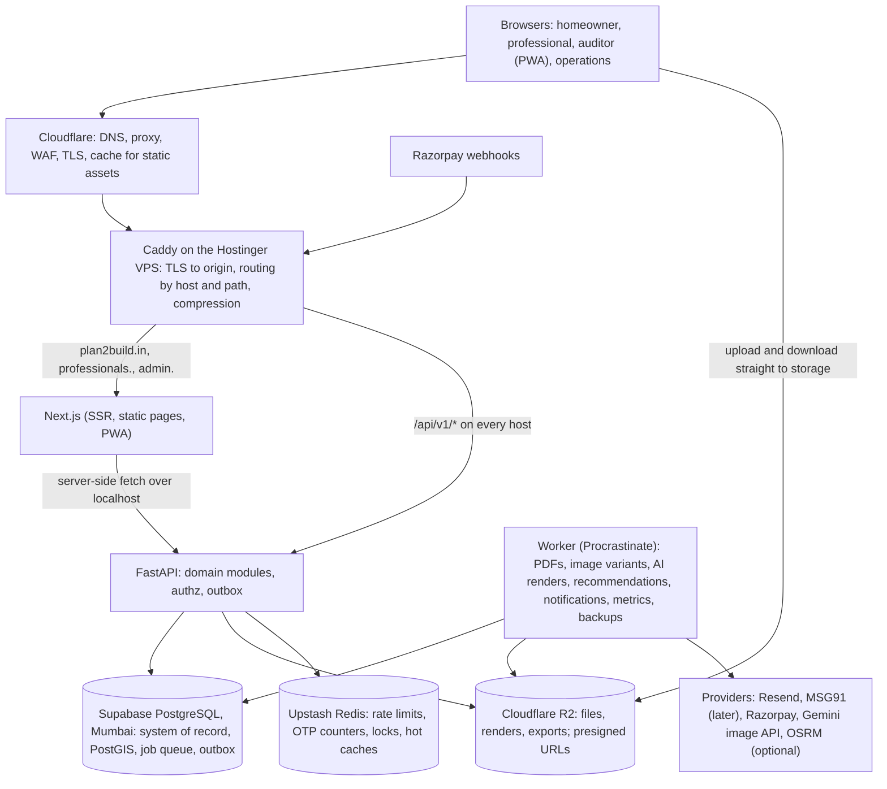

# Plan2Build: system architecture

| Item | Value |
|---|---|
| Document | `SYSTEM_BLUEPRINT/01_ARCHITECTURE/SYSTEM_ARCHITECTURE.md` |
| Version | 0.1 (proposed) |
| Date | 2026-10-03 |
| Status | Architecture proposal for Chirag's review. No application code exists yet. |
| Business authority | `IHB_FLOW.md` v1.2 (sections 32, 33), `PROFESSIONALS_FLOW.md` v1.2 (sections 43, 44), `RECOMMENDATION_ENGINE.md` v0.1; then the Source of Truth; then general engineering knowledge |
| Companion documents | The other files in this folder; `ADR/` holds the decision records |

## 1. Frame

| Question | Answer |
|---|---|
| What it does | An aggregator for independent house builders in Raipur: a homeowner defines a new-home project, buys one Plan2Build package (Build Plan with concept design, standard quote request and scope-normalised comparison with a reasoned recommendation, stage inspections, change control, issue log, permanent build record), finds contractors from a curated Champions Club or brings their own, and tracks the build. Professionals join, are curated, receive leads and quote requests, quote in a fixed format, deliver with standard updates, and build a verified record. Plan2Build's operations team runs curation, reviews, inspections and exceptions. |
| Who uses it and how many | POC in Raipur: tens of homeowner families (planning figure 20 to 50 in the first year), 30 to 80 professionals (mostly contractors, some architects), 5 to 10 Plan2Build staff, 1 to 3 retained auditors and one structural engineer. Public pages and the contractor listing may see a few thousand visits a month. All users are in India. |
| What must never break | The record of the house: specification decisions, OTP acknowledgements, quotes as submitted, inspection findings, change history, payment marks and the build record. Authorisation between homeowners and professionals (nobody sees another contractor's prices; the auditor never sees the supplier). Plan2Build's own fee payments. The independence rules (no brand recommendation, no paid position, no price ranking). |
| Out of scope for the MVP | Construction money through the platform (CD-01), other project types (CD-03), material supply (CD-13), the matched marketplace (CD-22), the brand dashboard (CD-23), ratings and reviews (CQ-17), post-handover service orders (CD-12), Hindi UI (Chirag, 2026-10-03: English only), native apps. |

Non-functional targets (section 10 and PERFORMANCE_ARCHITECTURE.md): availability target 99.5% monthly for the application (the sources' BR-154), measured by an external check; p95 API latency under 300 ms for standard reads; a recovery point of 24 hours in the worst case and a recovery time of 4 hours for a VPS loss (OBSERVABILITY_AND_OPERATIONS.md); all data in India (Supabase Mumbai, Hostinger India, R2 with jurisdiction hints); strong consistency inside a project (one Postgres primary); eventual consistency only for notifications, metrics and search indexes.

## 2. Principles

1. Production-quality software, POC-sized infrastructure. The code is built to the standard of a product that will carry real families' houses; the infrastructure is one VPS plus free and low tiers of managed services.
2. Spend only where it changes reliability, speed, security, functionality or development velocity. Nothing is bought for theoretical scale.
3. The business application never knows where it runs. Postgres, object storage, Redis, email, SMS, maps, payments and image generation sit behind interfaces with one adapter each; moving a provider is configuration plus an adapter, never a rewrite.
4. Infrastructure grows in independent dimensions: database (Supabase tier, then any Postgres), files (R2 volume), compute (VPS size, then more VPS, then a cloud), background work (worker count), AI (provider quota). SCALABILITY_AND_MIGRATION_PLAN.md gives the triggers.
5. One engine, many uses: rules, weights, reference data and configuration are rows in tables, versioned, not code branches.
6. Every state change is an auditable event; every sensitive object has an owner and a visibility rule enforced on the server.

## 3. Decisions taken with Chirag on 2026-10-03

| Topic | Decision | Chirag's input |
|---|---|---|
| Background jobs | PostgreSQL-backed queue (Procrastinate), worker process from the same codebase | "you decide" |
| Browser to API | Same origin on each host: `/api/v1/*` proxied to FastAPI; no CORS for the web app | "you decide" |
| Sessions | Server-side sessions, HttpOnly cookie, TOTP MFA for operations | Chose the recommendation |
| OTP channel | Email OTP at the MVP; SMS (DLT-registered provider) added later; phone verified from day one so the switch is configuration | "start with email for MVP and then we'll be using SMS too" |
| Reverse proxy | Caddy | Chose the recommendation |
| Frontend hosting | Next.js on the VPS | Chose the recommendation |
| Staging | Second Compose stack on the same VPS, own Supabase project and bucket | Chose the recommendation |
| Observability | Sentry, Grafana Cloud free tier, external uptime check | Chose the recommendation |
| Auditor inspection app | Offline PWA module inside the professionals app | Chose the recommendation |
| Plan2Build fee collection | Razorpay Checkout in the app, webhook-confirmed | Chose the recommendation (answers CQ-03 for the MVP) |
| Transactional email | Resend | Chose the recommendation |
| Maps | OpenStreetMap-based: map pin for the plot, OSM tiles, PostGIS distance; OSRM routing only when travel time matters; Google behind the same interface later | "openstreetmap for POC or MVP as we will be using it only in Raipur" |
| Supabase plan | Free while building; Pro before the first real homeowner's data | Chose the recommendation |
| Languages | English only at the MVP; strings kept in message files as a coding standard so Hindi can be added without touching screens | "English only" |
| Domain and hosts | `plan2build.in` for homeowners only; `professionals.plan2build.in` for every professional role; `admin.plan2build.in` for Plan2Build operations | Stated by Chirag ("plantobuild" heard as plan2build; AQ-01 confirms the spelling) |

## 4. Topology

The same shape runs twice on the VPS (production and staging) with separate hosts, databases and buckets (ENVIRONMENT_AND_DEPLOYMENT.md).

### 4.1 Request paths

Read path, authenticated page (for example a homeowner opening the project workspace):

1. Browser requests `plan2build.in/app/projects/{id}` with the session cookie. Cloudflare passes it to Caddy (authenticated pages are never cached at the edge).
2. Caddy routes to Next.js. A server component calls FastAPI over localhost with the cookie forwarded, `GET /api/v1/projects/{id}/workspace`.
3. FastAPI resolves the session (one indexed query), checks project membership, runs the shaped query set (stages, line summary, due milestones, open items) with at most a handful of statements, returns JSON.
4. Next.js renders HTML; the browser receives a finished page. Interactive parts hydrate; subsequent navigation uses client fetches to the same API.

Write path, a sensitive transition (a homeowner confirming a specification choice by OTP):

1. `POST /api/v1/projects/{id}/spec-lines/{code}/choose` with the chosen option and the OTP code, an `Idempotency-Key` header.
2. FastAPI verifies session, membership and role, the OTP (Redis counter for attempts), the line's current state (OPTIONS_ISSUED) and the record version.
3. In one transaction: update the line to CHOSEN, append a `spec_line_events` row, append an `audit_events` row, insert an outbox row `specline.chosen` and the jobs it implies (notification, baseline update).
4. The worker relays the outbox row: notifications go to the professional and the operations feed; the baseline value is recomputed; metrics are updated.

File path (an auditor photo):

1. The PWA asks `POST /api/v1/uploads` for a presigned R2 PUT URL bound to the inspection, the content type and a size limit.
2. The browser uploads straight to R2 (no VPS bandwidth). The PWA then calls `POST /api/v1/uploads/{id}/complete`.
3. The worker sniffs the file type, scans it, strips EXIF where required (not for inspection photos, whose capture time and location are evidence), makes variants, writes the hash and marks the file available.
4. Readers receive short-lived presigned GET URLs through the API; variants of public images are served through Cloudflare's cache.

## 5. Hosts and audiences

| Host | Audience | Session cookie | Route groups | Notes |
|---|---|---|---|---|
| `plan2build.in` (and `www`) | Public visitors and homeowners | `p2b_ihb_session` | `/` marketing, `/estimate`, `/contractors` (listing), `/app/*` (homeowner workspace) | Marketing pages static; listing incrementally regenerated |
| `professionals.plan2build.in` | Contractors, architects, other professionals, the structural engineer, auditors | `p2b_pro_session` | `/` (professional landing and registration), `/pro/*`, `/inspect/*` (offline PWA) | The auditor PWA is a route group with its own service worker scope |
| `admin.plan2build.in` | Plan2Build operations and admin | `p2b_ops_session` | `/ops/*` | MFA required; IP allow-list optional (AQ-02); separate audit stream |
| `staging.plan2build.in`, `staging-professionals.plan2build.in`, `staging-admin.plan2build.in` | Team and client demos | as above with a `staging_` prefix | same | Single-level names so Cloudflare's free certificate covers them |
| `files.plan2build.in` | Public images only (listing portfolios, marketing) | none | R2 custom domain | Private objects are never on this host |

One Next.js application serves all three hosts: a middleware reads the `Host` header and rewrites to the matching route group, so a homeowner route cannot be reached on the professionals host. FastAPI learns the audience from the session, not from the host; a session created on one host is rejected on another. Users who hold two roles (a Plan2Build staff member who is also a homeowner) log in separately on each host.

## 6. Architecture style

| Option | Fit for Plan2Build now | Cost | Verdict |
|---|---|---|---|
| Modular monolith with background workers | One deployable API, one database, modules with explicit interfaces, events through an outbox; the worker runs the same code | Discipline is needed to keep module boundaries honest (section 6.1); one process restart affects every module | Chosen (ADR-008) |
| Microservices | Independent scaling and deploys per service | Network calls between modules that share one database today; distributed transactions for flows that span modules (a choice that freezes the baseline and notifies three parties); an operations load the team does not have | Rejected now; the extraction rule below keeps it possible |
| Serverless functions on a managed platform | Zero server administration | Cold starts on every request on Indian 4G; Postgres connection churn; the offline auditor sync and the PDF jobs fit badly; against the Hostinger baseline | Rejected |
| Backend-as-a-service (Supabase as the whole backend) | Fastest to a demo | Business rules in database policies and edge functions; the OTP channel, the role model per project and the audit chain are awkward there; a move away from Supabase becomes a rewrite | Rejected; Supabase stays Postgres only (ADR-004) |

### 6.1 Module rules

1. A module is a Python package with a public service interface; other modules call that interface, never its tables.
2. A module owns its tables; the owner is written in DATA_ARCHITECTURE.md. Cross-module reads for a screen go through query services that are allowed to join across tables for reading only.
3. A module publishes domain events through the outbox table in the same transaction as its write; consumers react in the worker.
4. Reference data and configuration (stages, specification masters, class rules, engine configuration, offerings) live in tables with versions, never in code constants.
5. No module imports the web layer; the web layer (routers) is thin: validate, authorise, call a service, map the result.
6. Tests enforce the import rules (TESTING_ARCHITECTURE.md).

### 6.2 When a module becomes a service

A module is extracted only when one of these holds and an ADR records it: it needs a different scaling profile the worker tier cannot give it; it needs a different runtime; it needs a different release cadence or team; or its data has no joins with the rest. The first candidates, in order, are design generation (CPU and provider bound), the recommendation engine (batch and model serving), and document rendering. Each already runs as jobs behind an interface, which is the only preparation needed.

## 7. Components

| Component | Runs where | Responsibility | Scales by |
|---|---|---|---|
| Cloudflare | Edge | DNS, TLS to the user, WAF and bot rules, caching static assets and public images, hiding the origin IP | Plan tier |
| Caddy | VPS container | TLS to the origin, routing by host and path, compression, request size limits, access logs with request IDs | Stateless; one per VPS |
| Next.js | VPS container | Server-rendered pages per host, static marketing pages, the PWA shell, calling FastAPI for data | Replicas behind Caddy, then a CDN-hosted build |
| FastAPI | VPS container, 2 Uvicorn workers | The application: authn and authz, domain modules, validation, OpenAPI contract, outbox writes, presigned URL issue, Razorpay webhook endpoint | Uvicorn workers, then more containers, then more VMs |
| Worker | VPS container, Procrastinate with a small concurrency | Every job: PDF rendering, image variants and scanning, AI renders, recommendation shortlists and nightly metrics, notifications, outbox relay, reminders and expiries (lead windows, decide-by dates), backups | Concurrency, then more worker containers, then a queue service |
| PostgreSQL (Supabase, Mumbai) | Managed | System of record, PostGIS, full-text search, job queue and outbox tables, sessions | Supabase compute tier, then any managed Postgres with replicas |
| Cloudflare R2 | Managed | All binary objects with versions modelled in the database | Volume |
| Upstash Redis | Managed | Rate limits, OTP attempt counters, idempotency and lock keys, hot caches with TTLs | Command budget, then a fixed plan or a Redis on the VPS |
| Providers | External | Email (Resend), SMS later (MSG91), payments (Razorpay), image generation (Gemini adapter), routing (OSRM container when needed) | Per provider; each behind an adapter with timeouts and circuit breakers |

## 8. Module map

| Module | Owns | Short description |
|---|---|---|
| `identity` | users, contacts, sessions, OTP challenges, MFA secrets, consents, devices | Who someone is and how they prove it |
| `projects` | projects, memberships and roles, requirements, project status | The homeowner's aggregate and who may act on it |
| `catalog` | stage master, specification masters and versions, checkpoint masters, rate cards, class rules, offerings, engine and other configuration | Versioned reference data |
| `specification` | project specification lines, events, qualifying options, material ledger, decisions calendar | The 67-line decision ledger per project |
| `buildplan` | Build Plans and versions, BOQ lines, payment schedules, cash-flow plans, contract baseline | The paid plan and the locked baseline |
| `design` | design requests, generated artefacts, review states, provider calls | Concept drawings and 3D views pipeline, architect design hand-off |
| `professionals` | professional profiles, categories, verification cases and evidence, Champions Club membership, class, capacity, service areas, listing | Everyone who works on houses |
| `engagements` (replaces `leads`, ADR-024) | service needs, connections, engagements (origin CONNECTION, OUTSIDE or RFQ_SELECTION), engagement documents and events, quote-holder intake | The family's request to a professional through to the per-category engagement |
| `rfq` | RFQ packs, invitations, quotes and versions, quote lines, clarifications, normalisation adjustments, comparisons, selections | Standard quote request through to award |
| `recommendation` | engine configs, requests, candidates, review actions, shown items, outcomes, metrics, exposure | Shortlists and quote recommendations with reasons |
| `construction` | stage instances, milestone updates, exception feed | Tracking the build in the standard format |
| `variations` | changes, qualification, acknowledgements, discussions, closures | Change control (CD-08) |
| `money` | contract values, approved change costs, milestone due states, payment marks, money position | Money position without amounts for payments (CD-09) |
| `assurance` | inspections, checkpoint results, evidence, non-conformances, reports, auditor assignments, offline sync | Gates and fixes |
| `issues` | issues, fixes with proof, verification, disputes handled by operations | Issue log (CD-10) |
| `records` | build record artefacts, warranties, handover, share tokens, exports | The permanent record (CD-11) |
| `billing` | offerings purchased, invoices, instalment plans, Razorpay orders and payments, receipts | Plan2Build's own fee (CD-05) |
| `documents` | file objects, uploads, variants, scans, rendered documents, share links, access grants | Every binary and every rendered PDF |
| `notifications` | notification events, templates, deliveries, preferences, in-app inbox | Outbound messages |
| `messaging` | threads and messages (lead conversations, clarifications through Plan2Build) | In-platform communication |
| `audit` | audit events, security events | Append-only history |
| `ops` | review queues, exception feed views, configuration editing, user administration | The operations console's use cases, composed from the other modules |
| `analytics` | analytics events, daily aggregates | Funnel and KPI numbers |
| `core` | outbox, jobs, feature flags, settings, i18n strings, geo utilities, provider adapters | Shared kernel |

DOMAIN_ARCHITECTURE.md gives each module's interfaces, dependencies and events.

## 9. Cross-cutting mechanisms

| Mechanism | How it works | Document |
|---|---|---|
| Transactional outbox | A write and its `outbox_events` row commit together; the worker relays events to handlers and marks them processed; handlers are idempotent | EVENT_AND_BACKGROUND_JOB_ARCHITECTURE.md |
| Jobs | Procrastinate tasks in Postgres with retries, backoff, scheduled tasks and a dead-letter state; enqueued inside the business transaction | same |
| Audit | `audit_events` is append-only (no UPDATE or DELETE grants); every state transition and every override writes one row with actor, old and new values and reason | SECURITY_ARCHITECTURE.md, DATA_ARCHITECTURE.md |
| Authorisation | Session, then role, then object ownership and project membership, then state preconditions; a central dependency in FastAPI; tests cover every endpoint | SECURITY_ARCHITECTURE.md, API_ARCHITECTURE.md |
| State machine | One canonical state vocabulary in `STATE_MODEL.md`, implemented as a transition table checked in the service layer | STATE_MODEL.md |
| Document rendering | HTML templates rendered to PDF by the worker, stored in R2 with a hash, exposed by share tokens | INTEGRATION_ARCHITECTURE.md, DATA_ARCHITECTURE.md |
| Configuration as data | Reference tables with versions and an `active_from`; the engine, class rules, windows and offerings read from them | DATA_ARCHITECTURE.md, AI_AND_RECOMMENDATION_ARCHITECTURE.md |
| Feature flags | A small `feature_flags` table read at startup and cached; used for staged rollouts (SMS OTP, Hindi, WhatsApp) | ENVIRONMENT_AND_DEPLOYMENT.md |
| Localisation | English only at the MVP; every user-facing string is in a message file (web) or a template table (notifications, PDFs); no string literals in code paths that face users | PERFORMANCE_ARCHITECTURE.md (payload), TESTING_ARCHITECTURE.md |

## 10. Sizing estimate for the POC

Assumptions are labelled; they steer the sizing only.

| Quantity | Estimate | Basis |
|---|---|---|
| Active users per day | 30 to 100 | 20 to 50 families, 30 to 80 professionals, 5 to 10 staff; not everyone daily |
| API requests per day | about 5,000 to 20,000 | 50 to 200 requests per active user per day (dashboards, lists, uploads) |
| Peak API rate | under 5 requests per second | Spiky at Indian evening hours; still two orders of magnitude below one FastAPI container's capacity |
| Public page views | a few thousand a month, served from Cloudflare cache | Marketing and listing pages are static or regenerated |
| Files | about 300 to 600 photos per house at 2 to 5 MB, plus documents; about 1 to 3 GB per house; 50 houses is about 100 GB in R2 | Inspection evidence dominates |
| Database size | under 2 GB in year one | Row counts in the thousands per table; events and audit rows in the hundreds of thousands |
| Background jobs | tens to hundreds per day; nightly metric and backup jobs | PDFs, renders, notifications, expiries |
| AI renders | 10 to 40 images per house | Concept views and revisions |

Conclusion: a 2 vCPU, 8 GB VPS is idle most of the time. The design problem is latency on mid-range Android over 4G and reliability, not throughput. Memory budget on the VPS: Next.js about 400 MB, FastAPI two workers about 500 MB, worker about 500 MB (peaks of 1 GB during PDF and image jobs), Caddy and the monitoring agent about 200 MB, staging stack about 1.2 GB with limits, operating system about 500 MB. About 3.5 GB in use, 4 GB headroom.

## 11. Failure inventory

| Component dies | User sees | System does | Recovery |
|---|---|---|---|
| VPS (whole box) | Site down | Nothing runs; Cloudflare shows an error page | Rebuild from images and configuration in under 4 hours (OBSERVABILITY_AND_OPERATIONS.md section 8); data is in Supabase and R2, so nothing on the VPS is unique except logs |
| Next.js container | Site down, API still answers | Caddy health check fails; Compose restarts it | Automatic restart; alert if it flaps |
| FastAPI container | Pages that need data fail; static pages still render | Compose restarts; Next.js shows an error state on data fetch | Automatic restart |
| Worker | Delayed PDFs, renders, notifications; nothing lost | Jobs stay queued in Postgres | Restart; queue depth alert |
| Supabase Postgres unavailable | Everything that needs data fails | API returns 503 with a retry hint; Next.js error states; jobs pause | Supabase restores; the application reconnects with backoff; no data loss once writes are committed |
| Supabase Postgres data loss | Data missing | Restore from Supabase daily backup (Pro) or the nightly `pg_dump` in R2 | RPO up to 24 hours; RTO about 2 hours |
| R2 unavailable | Uploads and downloads fail; pages render | Presigned URL issue fails gracefully; jobs needing files retry | Cloudflare restores; nothing to do |
| Upstash Redis unavailable | Nothing visible if the fallback works | Rate limits fall back to Postgres counters for OTP, open for low-risk endpoints; caches miss | Reconnect; alert |
| Resend or MSG91 down | OTP emails or SMS delayed | Notification jobs retry with backoff; OTP screen offers "resend"; a second channel can be enabled by flag | Provider recovers; DLQ reviewed |
| Razorpay down | Checkout fails | Invoice stays open; the homeowner retries; no double charge because orders carry the invoice id | Provider recovers; reconciliation job catches missed webhooks |
| Image generation provider down | Renders delayed | Jobs retry, then a second provider by flag, then a manual queue for the team | Provider recovers |
| Cloudflare misconfiguration | Site unreachable or cached private page | Configuration is in git (Terraform or a documented checklist) | Revert the rule; cache purge |
| Bad deploy | Errors after release | Health checks fail on the new container; the deploy script stops | Redeploy the previous tag; migrations are expand-contract so the previous code still runs |

Remaining single points of failure at the POC: the one VPS and the one Postgres primary. Both are accepted for the POC with the recovery procedures above. The current bottleneck is the worker during PDF and image jobs on 2 vCPU (jobs queue, pages stay fast). The next bottleneck after a bigger VPS is Postgres connection count and query latency, which is the trigger for a Supabase compute upgrade and the pooler (SCALABILITY_AND_MIGRATION_PLAN.md).

## 12. Validation questions

| # | Question | Answer |
|---|---|---|
| 1 | Can the POC run comfortably on one Hostinger VPS? | Yes. Section 10: about 3.5 GB RAM in use and single-digit requests per second against 8 GB and 2 vCPU; heavy work is in the worker. |
| 2 | Can the frontend and backend stay fast on that infrastructure? | Yes, by rendering strategy, indexes, shaped payloads and files off the VPS (PERFORMANCE_ARCHITECTURE.md). The VPS CPU is not the limiting factor at POC load. |
| 3 | Can heavy workloads run asynchronously? | Yes. Every operation over about 300 ms of CPU is a job: PDFs, image variants, AI renders, recommendations, notifications, metrics, exports, backups. |
| 4 | Can database load scale independently? | Yes. Supabase compute tiers, then read replicas or any managed Postgres; the application uses one connection string and a pooler setting. |
| 5 | Can files scale independently? | Yes. R2 grows by volume; the VPS never streams files. |
| 6 | Can recommendation processing scale independently? | Yes. It runs as worker jobs today; the module can become a service (section 6.2) without changing its data contracts. |
| 7 | Can AI and image generation scale independently? | Yes. Provider quota and a separate worker queue; a dedicated worker container is a Compose change. |
| 8 | Can the system migrate away from Hostinger without rewriting the application? | Yes. Everything on the VPS is containers plus Caddy configuration; the same images run on any Linux VM or a cloud. |
| 9 | Can Supabase Postgres move to another PostgreSQL provider? | Yes. Only Postgres features are used (plus PostGIS and pg_trgm, available everywhere); `pg_dump` and restore, then a connection string change. |
| 10 | Can R2 move to S3? | Yes. S3 API through boto3; bucket names and endpoint are configuration; object naming is provider-neutral. |
| 11 | Can Upstash move to managed Redis? | Yes. Standard Redis protocol over TLS; no Upstash-specific features. |
| 12 | Can the monolith split into services? | Yes, per module, under the rules in section 6.1 and 6.2; events already flow through the outbox. |
| 13 | Is the security model strong enough for production data? | Yes for the data classes involved (SECURITY_ARCHITECTURE.md): server-side sessions, MFA for operations, per-object authorisation, private storage with presigned URLs, append-only audit, signed webhooks, rate limits. |
| 14 | Is project-level isolation enforced? | Yes. Every project-scoped endpoint resolves membership and role before touching data; tests assert it for every endpoint; Postgres row-level security is the planned second layer (AQ-05). |
| 15 | Is every sensitive operation auditable? | Yes. State transitions, overrides, configuration changes, logins, document views of private records and permission changes write audit rows. |
| 16 | Are payment webhooks safe and idempotent? | Yes. Signature verified with the Razorpay secret, event id stored with a unique constraint, order id bound to the invoice, amount checked against the invoice, replay ignored (INTEGRATION_ARCHITECTURE.md). |
| 17 | Are file uploads secure? | Yes. Presigned PUT bound to a declared type and size, server-side sniffing and scanning after upload, private buckets, no client-provided paths, short-lived GET URLs. |
| 18 | Can the system recover from VPS failure? | Yes, within 4 hours, from images, configuration in git and data in Supabase and R2. |
| 19 | Can developers deploy safely? | Yes. CI gates, staging on the same box, expand-contract migrations, health-checked restarts, rollback to the previous image tag. |
| 20 | Can another AI understand the architecture without guessing? | Yes if it reads this folder in the order given in README.md: every decision has a reason and a document, every entity has an owner, every state has a transition table. |

## 13. What breaks first

At the POC, the first thing to break is not capacity but operations discipline: a missed Supabase upgrade (free tier pausing or no backups) or a deploy without the staging step. The architecture answers both with a checklist (ENVIRONMENT_AND_DEPLOYMENT.md). The first technical limit is the worker during bursts of PDF and render jobs on 2 vCPU; the sign is queue depth, and the fix is a second worker container or the next VPS size. The second limit is Postgres on Supabase's shared Micro compute under sustained load; the sign is p95 query latency, and the fix is the Small compute tier.

## 14. Open architecture decisions (AQ)

| ID | Decision needed | Default used in these documents | Who decides |
|---|---|---|---|
| AQ-01 | Confirm the domain spelling `plan2build.in` and that the three hosts are final | `plan2build.in`, `professionals.`, `admin.` | Chirag |
| AQ-02 | Whether `admin.plan2build.in` is restricted to an IP allow-list or a VPN in addition to MFA | MFA only at the POC; allow-list optional | Chirag |
| AQ-03 | Email OTP at the MVP: OTP code versus magic link | Six-digit code, 10-minute validity (works in a mobile browser without switching apps) | Chirag |
| AQ-04 | WhatsApp as a notification channel: when to apply for the Business API | After the pilot's first ten families; SMS first | Chirag with the client |
| AQ-05 | Postgres row-level security as a second authorisation layer | Application-layer only for the POC; RLS in phase 1 | Sakha, with Chirag's agreement |
| AQ-06 | Where the retained auditor's identity and unique ID (CD-21) are kept | A professional profile of category AUD with the unique ID as a visible code | Chirag with the client (CQ-15) |
| AQ-07 | Whether the staging stack is allowed to send real emails and SMS | Emails to an allow-list only; SMS off | Chirag |
| AQ-08 | Data residency statement for R2 (jurisdiction hint) and Supabase (Mumbai) in the privacy notice | Both set to India where the provider allows | Chirag with the client (OQ-059) |
| AQ-09 | Who holds the production secrets and the Razorpay, Supabase and Cloudflare accounts | A Plan2Build company account per provider with Chirag as owner and a second admin | Chirag |
| AQ-10 | Whether Hindi is wanted before the pilot ends (the sources require it; Chirag chose English only for the MVP) | English only; strings externalised | Chirag with the client |

## 15. Document map

| Document | What it answers |
|---|---|
| TECH_STACK_AND_RATIONALE.md | Why each technology; what is not used yet |
| DOMAIN_ARCHITECTURE.md | Modules, ownership, interfaces, events, dependencies |
| STATE_MODEL.md | The canonical state vocabulary and transition tables |
| DATA_ARCHITECTURE.md | Every table, column group, constraint, index, privacy and retention |
| API_ARCHITECTURE.md | Conventions and the endpoint catalogue |
| EVENT_AND_BACKGROUND_JOB_ARCHITECTURE.md | Outbox, jobs, schedules, retries, migration to a managed queue |
| AI_AND_RECOMMENDATION_ARCHITECTURE.md | Design generation subsystem and the recommendation engine's technical contracts |
| INTEGRATION_ARCHITECTURE.md | Razorpay, email, SMS, maps, image providers, notifications |
| SECURITY_ARCHITECTURE.md | Threat model, authn and authz, file security, secrets |
| PERFORMANCE_ARCHITECTURE.md | Targets, rendering strategy, caching, indexing, monitoring of targets |
| CLOUD_AND_HOSTING_ARCHITECTURE.md | The VPS layout, containers, networking, firewall, backups |
| ENVIRONMENT_AND_DEPLOYMENT.md | Environments, repository structure, CI and CD, migrations, rollback |
| OBSERVABILITY_AND_OPERATIONS.md | Logs, metrics, tracing, alerts, runbooks, backups and recovery |
| TESTING_ARCHITECTURE.md | Test layers mapped to the flows and the state model |
| SCALABILITY_AND_MIGRATION_PLAN.md | Stages and objective triggers |
| COST_MODEL.md | Fixed, usage-based and optional costs per stage |
| ADR/ | Decision records ADR-001 to ADR-020 |
