# Plan2Build: IHB canonical flow

Canonical end-to-end specification of the Independent House Builder (IHB) journey on Plan2Build, extracted and reconciled from the complete `SOURCE_OF_TRUTH` directory.

## 0. Document control

| Item | Value |
|---|---|
| File | `SYSTEM_BLUEPRINT/IHB_FLOW.md` |
| Version | 1.2 (1.1 added the client decisions of 2026-10-03; 1.2 adds the same day's answers to four open points; version 1.0 was the first written canonical version and included the incremental reconciliation of three artifacts added on 2026-10-02) |
| Prepared | 2026-10-02 |
| Updated | 2026-10-03, twice. Version 1.1: client decisions CD-01 to CD-24 and open points CQ-01 to CQ-21 (section 32); revised canonical flow for the MVP (section 33). Version 1.2: CD-25 to CD-28, which answer CQ-05, CQ-06, CQ-07 (in part), CQ-08 (in part) and CQ-10, new open points CQ-22 to CQ-26, the drawings method with the architect option (section 33.6) and the companion design `SYSTEM_BLUEPRINT/RECOMMENDATION_ENGINE.md`. Sections 1 to 31 are unchanged apart from short client-decision notes at the top of affected stages, decision trees, state machines and registers, and the precedence rules added to sections 0, 1 and 3.2. |
| Basis | All 25 top-level artifacts in `SOURCE_OF_TRUTH/` (13 DOCX, 10 PNG, 1 HTML, 1 ZIP containing 5 PNG), plus 27 figures embedded inside three DOCX files |
| Source of Truth status | Read only. No file in `SOURCE_OF_TRUTH/` was created, modified, renamed, moved or deleted. Extraction was done into a temporary scratch area outside the project. |
| Reconciliation note | The 22 original artifacts were fully extracted first (baseline). Before this file was first written, three new artifacts were added (`Plan2Build_Mockup_Pages.zip`, `Plan2Build Homebuilding Platform Pitchboard.png`, `ChatGPT Image Oct 1, 2026, 06_38_10 PM.png`). Section 29 records the baseline-versus-new-evidence delta, every contradiction, the supersession decisions and the regression audit. |

### 0.1 How to read this document

1. Sections 1 to 5 explain what the sources are, how much authority each carries, and who the IHB is.
2. Section 6 gives the lifecycle overview and section 7 the stage-by-stage journey summary.
3. Section 8 is the detailed specification for every journey stage (J00 to J25), using a fixed template.
4. Sections 9 to 21 are cross-cutting views (decision trees, state machines, actors, data, permissions, notifications, payments and pricing, orders, cancellations, failures, edge cases, dependencies).
5. Sections 22 to 27 hold the business rules, assumptions, ambiguities, conflicts, open questions and missing information.
6. Sections 28 to 31 hold traceability, the reconciliation, the completeness audit and the final canonical flow.
7. Sections 32 and 33 hold the client's decisions of 2026-10-03 and the canonical flow revised for the MVP. Where they apply, they take precedence over sections 1 to 31 for the MVP and the POC.

Anyone implementing from this document should read section 3.2 (source authority model), section 25 (conflicts) and section 32 (client decisions) before building any stage. Several product-shaping questions are unresolved in the sources themselves, and the document does not resolve them by guessing; section 32 records the ones the client has since decided, and section 33 is the flow to build for the MVP.

### 0.2 Classification tags

Every requirement, behavior or fact carries one or more of these tags.

| Tag | Meaning |
|---|---|
| `EXPLICIT` | Directly stated in the cited source (text, table, diagram label, UI label, or code). |
| `DERIVED` | Strongly implied by one or more sources without adding new behavior. The derivation is stated. |
| `AMBIGUOUS` | The sources are insufficient, internally inconsistent, or open to more than one reading. Logged in section 24 (AMB-nnn). |
| `CONFLICT` | Two or more sources disagree. Logged in section 25 (C-nnn). |
| `OPEN QUESTION` | A human or client decision is required. Logged in section 26 (OQ-nnn). |
| `UNKNOWN — REQUIRES CONFIRMATION` | No source says what happens. Nothing has been invented in its place. |
| `SUPERSEDED` | Defined by an earlier source and explicitly replaced by a later, more authoritative one. Kept for traceability in section 29.5. |
| `[D1]` `[D2]` `[D3]` | The product direction the statement comes from (see section 3.2). |
| `[MOCKUP]` | Evidence is a visual mockup. It shows UI elements and labels, not behavior. Behavior read from a mockup is at most `DERIVED`. |
| `CLIENT DECISION` | Decided on 2026-10-03 by the client, by Chirag for the client, or by Sakha on Chirag's delegation; each row of section 32.2 states which (CD-nn). Takes precedence over the sources, conflicts and open questions it covers, for the MVP and the POC. |

### 0.3 Identifier scheme

| Prefix | Used for | Section |
|---|---|---|
| S01 to S25 | Source artifacts (S23a to S23e are the five files inside the ZIP) | 3.1 |
| D1, D2, D3 | Product directions present in the sources | 3.2 |
| J00 to J25 | IHB journey stages | 7, 8 |
| A-Jnn-nn | Individual IHB actions inside a stage | 8 |
| DT-nn | Decision trees | 9 |
| SM-nn | State machines | 10 |
| INT-nn | IHB interactions with other actors and systems | 11 |
| F-nnn | IHB data fields | 12 |
| PR-nnn | Price points | 15 |
| EC-nnn | Edge cases | 19 |
| DEP-nn | Cross-module dependency chains | 21 |
| BR-nnn | Business rules | 22 |
| AS-nn | Assumptions made by this document | 23 |
| AMB-nnn | Ambiguities | 24 |
| C-nnn | Conflicts | 25 |
| OQ-nnn | Open questions | 26 |
| MI-nnn | Missing information | 27 |
| R-nnn | Reconciliation (delta) rows | 29 |
| CD-nn | Client decisions (2026-10-03); identical register in `PROFESSIONALS_FLOW.md` section 43 | 32 |
| CQ-nn | Open points after the client decisions; identical list in `PROFESSIONALS_FLOW.md` section 43 | 32 |

---

## 1. Document purpose

This document is the permanent system reference for how the IHB journey on Plan2Build is supposed to work, from first contact with Plan2Build until the end of the relationship. It is written so that a developer, designer, QA engineer, product manager, architect, client reviewer or another AI agent can understand the IHB experience, its decisions, states, interactions, dependencies and business rules without reading the original files and without inventing missing behavior.

Four rules govern the content.

1. Source of Truth outranks general knowledge, and general knowledge outranks assumptions. Where Plan2Build differs from a typical marketplace or construction product, Plan2Build wins.
2. Nothing is filled in silently. Missing behavior is marked `UNKNOWN — REQUIRES CONFIRMATION`. Disagreements are marked `CONFLICT`. Unclear material is marked `AMBIGUOUS`.
3. Every meaningful statement is traceable to a source (notation in section 3.3).
4. Since version 1.1, a client decision recorded in section 32 outranks the Source of Truth for the item it covers, for the MVP and the POC. The sources stay recorded as they are.

## 2. Scope

### 2.1 In scope

- Every action, screen, field, decision, state, rule, payment, notification and interaction that the IHB (the homeowner building an individual house) performs, sees, receives or depends on, across all product directions present in the sources.
- Other actors (contractors and other professionals, Plan2Build advisors, city lead or concierge, operations, auditors, structural engineer, payment gateway, notification channels, AI services, suppliers, partners, brands) only as far as they affect what the IHB experiences or waits for.
- Pricing of every Plan2Build offering presented to the IHB, and every pricing conflict.
- The three artifacts added on 2026-10-02 and their reconciliation against the earlier 22 artifacts.

### 2.2 Out of scope

- The internal journeys of professionals, auditors, operations and brands, except where they produce IHB-visible outcomes. These are referenced, not specified.
- Development-vendor commercial terms (development fees, AMC, vendor payment milestones and the vendor bank details that appear in S09 and S12). They do not affect the IHB journey and are not reproduced.
- Technology stack choices, except where they change IHB-visible behavior (for example web/PWA versus native app, OTP login, payment gateway, notification channels, offline capture).
- Investor and market-sizing material, except where it defines the IHB segment or IHB-facing pricing.

---

## 3. Source material reviewed

### 3.1 Source inventory

All files were read in full. DOCX files were extracted paragraph by paragraph and table by table in body order, including headers, footers, comments and embedded images; a word-level check against the raw DOCX XML confirmed nothing was dropped. Images were read at native resolution and then re-read as zoomed crops so that small UI text could be transcribed accurately. The HTML file was read as markup and its script logic was analysed. The ZIP was listed and extracted recursively (it contains five PNG files and no nested archives or other file types).

| ID | File | Type | Date evidence | Self-declared status or nature | Direction | IHB relevance |
|---|---|---|---|---|---|---|
| S01 | `Plan2Build_Transactional_Verification_Blueprint.docx` | DOCX, 65 tables, 8 embedded figures | Core properties modified 2026-09-20 11:02 UTC | "Final functional specification before implementation"; footer "Final pre-development blueprint" | D1 | High (full homeowner transactional model; earlier draft of S02) |
| S02 | `Plan2Build_Final_Transactional_and_Verification_Blueprint.docx` | DOCX, 20 tables, 14 embedded figures | Core properties modified 2026-09-20 11:28 UTC (26 minutes after S01) | "Final pre-development functional specification"; converts the supplied journey boards (S18, S19) into an operating model | D1 | High |
| S03 | `Plan2Build_Strategy_and_POC Sept 21 2026.docx` | DOCX | In-document date 21 September 2026; core properties 2026-09-24 | "Working strategy — for decision, not for circulation"; "Plan2Build by ConjunIQ" | D2 | High (business model, IHB promise, pricing, POC gates) |
| S04 | `Plan2Build_Specification_Schema.docx` | DOCX | "Version: 1.0 · 24 September 2026" | "Reference data to be seeded. Codes are immutable once released." | D2 | High (67 decisions, 16 stages, six states, packages, OTP acknowledgement) |
| S05 | `Plan2Build_MVP_Build_Plan.docx` | DOCX | "Date: 24 September 2026"; from ConjunIQ Technologies Private Limited to the development partner | "Supersedes: the earlier MVP functional specification, which described a monitoring-led product. That document should not be used." | D2 | High (governing build instruction: modules, acceptance criteria, exclusions) |
| S06 | `Plan2Build_Technology_Product_Blueprint_with_Journey_Maps.docx` | DOCX, 5 embedded journey maps | Footer "Confidential - founder/developer working document 24 September 2026" (read from the DOCX footer XML; the body extraction does not include footers) | "Recommended v1.0 architecture for validation and build" | D2 | High (homeowner journey map, channel matrix, modules, data model) |
| S07 | `Plan2Build_Client_Product_and_Implementation_Blueprint.docx` | DOCX | Footer "Client Review Draft \| 24 September 2026"; core modified 2026-09-24 14:59 UTC | "Status: Client review before implementation begins"; prepared from S03, S04, S05, S06 | D2 | High (synthesis of D2 homeowner journey and money visibility) |
| S08 | `Plan2Build_Current_POC_Product_Technical_Budget_Plan_₹3L.docx` | DOCX (generated) | Filesystem 2026-09-24 23:45 IST; core dates unreliable | "Client-facing decision document" | D2 | Medium |
| S09 | `PLAN2BUILD_PLAN.docx` | DOCX | Core modified 2026-09-24 18:40 UTC | Commercial proposal rewritten to the D2 platform; contains vendor bank details (not reproduced) | D2 | Medium (D2 access matrix and system hand-offs) |
| S10 | `PLAN2BUILD — COMPLETE BUDGET & EXPENDITURE PLAN (1).docx` | DOCX | "Prepared 19 September 2026"; "Version 2.0" | Commercial proposal (₹3.30 lakh development) for the marketplace platform | D1 | Medium (marketplace homeowner journey, access matrix, hand-offs) |
| S11 | `Plan2Build_Budget_Original_Revised_₹3L_No_Image_Generation.docx` | DOCX | Core created and modified 2026-09-19 06:41 UTC | Same proposal re-priced to ₹3.00 lakh; user flows identical to S10 | D1 | Medium (duplicate flows) |
| S12 | `PLAN2BUILD.docx` | DOCX | Core modified 2026-09-24 18:41 UTC | Same content as S11 plus vendor bank details (not reproduced) | D1 | Medium (duplicate flows) |
| S13 | `plan2build - 2026_10_01 12_29 UTC - Notes by Gemini.docx` | DOCX (AI meeting notes and transcript) | Meeting 1 October 2026, 12:29 UTC; Alok Jha and Chirag | AI-generated summary; notes state "You should review Gemini's notes to make sure they're accurate"; transcript is partly garbled | D3 | Medium (latest dated decisions: listing tiers, requirement capture, billing philosophy) |
| S14 | `Plan2Build (Copy).html` | HTML prototype with working JavaScript | Filesystem 2026-09-27 | Public landing page "Plan2Build BY CONJUNIQ" with a working cost calculator and comparison demo | D2 | High (actual first-touch UI and calculator logic) |
| S15 | `ChatGPT Image Sep 14, 2026, 07_36_10 AM.png` | Image (landing/product overview board) | 14 September 2026 | Reference board (S01 Appendix A "Homeowner landing / product overview") | D1 | Medium |
| S16 | `ChatGPT Image Sep 14, 2026, 07_38_16 AM.png` | Image ("The Plan2Build Framework") | 14 September 2026 | Reference board (S01 Appendix A "Plan2Build Framework") | D1 | Medium |
| S17 | `ChatGPT Image Sep 14, 2026, 07_42_22 AM.png` | Image ("How Plan2Build Works" long page) | 14 September 2026 | Reference board (S01 Appendix A "How Plan2Build Works") | D1 | Medium |
| S18 | `ChatGPT Image Sep 16, 2026, 10_34_28 PM (1).png` | Image ("Plan2Build Homeowner Journey") | 16 September 2026 | Pixel-identical to S02 "Reference Board 1"; the six-stage homeowner journey with six screen mockups | D1 | High |
| S19 | `ChatGPT Image Sep 16, 2026, 10_34_29 PM (2).png` | Image ("Service Provider Journey") | 16 September 2026 | Pixel-identical to S02 "Reference Board 2" | D1 | Low to medium (what professionals see of the IHB project) |
| S20 | `ChatGPT Image Sep 25, 2026, 10_11_14 AM.png` | Image ("Plan2Build Offerings & Pricing", three-column version) | 25 September 2026 10:11:14 | Price board for "Individual Home Builders" | D2 (pricing variant) | High (pricing) |
| S21 | `ChatGPT Image Sep 25, 2026, 10_11_52 AM.png` | Image (seven-offering version) | 25 September 2026 10:11:52 | Price board | D2 (pricing variant) | High (pricing) |
| S22 | `ChatGPT Image Sep 25, 2026, 10_12_03 AM.png` | Image (seven-offering version, revised) | 25 September 2026 10:12:03 (latest of the three) | Price board | D2 (pricing variant) | High (pricing) |
| S23 | `Plan2Build_Mockup_Pages.zip` (NEW) | ZIP of 5 PNG mockups (941 x 1672 each) | ZIP entries dated 2026-10-01 18:17; added to Source of Truth 2026-10-02 | Website page mockups; two carry labels "Page 1 — Home" and "Page 4 — Compare Professionals" | D3 | High |
| S23a | `plan2build_homebuilding_platform_homepage.png` | Mockup ("Page 1 — Home") | as S23 | Home page | D3 | High |
| S23b | `plan2build_services_better_homes_begin_here.png` | Mockup (unlabelled; matches pitchboard page 2 "Services") | as S23 | Services page | D3 | High |
| S23c | `plan2build_home_project_planner.png` | Mockup (unlabelled; matches pitchboard page 3 "Post Requirement") | as S23 | Post Your Requirement form | D3 | High |
| S23d | `plan2build_professional_comparison_dashboard.png` | Mockup ("Page 4 — Compare Professionals") | as S23 | Professional search and side-by-side comparison | D3 | High |
| S23e | `plan2build_complete_build_planning_dashboard.png` | Mockup (unlabelled; matches pitchboard page 5 "Complete Build Plan") | as S23 | Build Plan dashboard | D3 | High |
| S24 | `Plan2Build Homebuilding Platform Pitchboard.png` (NEW) | Image, five labelled page mockups | Added 2026-10-02; no internal date | "1. Home Page", "2. Services Page", "3. Post Requirement Page", "4. Compare Professionals Page", "5. Complete Build Plan Page". Caption text is only a few pixels tall at 1536 x 1024, so small figures are at the limit of legibility | D3 | High |
| S25 | `ChatGPT Image Oct 1, 2026, 06_38_10 PM.png` (NEW) | Image (logo) | 1 October 2026, 6:38 PM | Wordmark "Plan2Build" with house and blueprint-grid mark, plus a rounded-square app-icon variant | D3 | None (branding only; see 3.4) |

Embedded figures (27) were read and are cited as `S01 fig N` and `S02 fig N`, and `S06 map N`:

- S01 figures 1 to 8: master lifecycle; architect, civil contractor, interior, specialist category flows; homeowner master journey; payment state flow; admin operating flow.
- S02 figures 1 to 14: master lifecycle; homeowner journey state flow; AI planning transaction; professional onboarding; opportunity-to-quote lifecycle; payment flow; build lifecycle; change order approval; post-construction lifecycle; admin loop; authentication flow; data relationships; Reference Boards 1 and 2 (identical to S18 and S19).
- S06 maps 1 to 5: homeowner journey (PLAN, COMPARE, BUILD, TRACK); contractor journey; auditor journey; operations journey; six-state material decision ledger.

### 3.2 Source authority model

The sources describe three product directions that overlap on the journey skeleton but disagree on how the IHB finds professionals, what Plan2Build sells, and which features exist.

| Direction | Sources | One-line description | Authority evidence |
|---|---|---|---|
| D1: marketplace and project operating system | S01, S02, S10, S11, S12, S15, S16, S17, S18, S19 (dated 14 to 20 September 2026) | Two-sided platform. The homeowner posts or qualifies a project, gets an AI-assisted plan, is matched with verified professionals (architects, civil contractors, interior designers, specialists), compares quotes, selects, pays milestones through the platform, tracks the build, handles issues, change orders and disputes, completes handover, then uses Improve (warranty, maintenance, renovation). Brands and a super-admin console exist. | S01 and S02 call themselves "final pre-development" specifications. S10 to S12 are commercial proposals. No sign-off is recorded. |
| D2: decision-and-evidence platform (ConjunIQ) | S03, S04, S05, S06, S07, S08, S09, S14, S20, S21, S22 (dated 21 to 27 September 2026) | "Own the decision. Influence the transaction. Never own the execution." Plan2Build sells written, performance-based specification advice (Build Plan; three packages), a standard RFQ and scope-normalised quote comparison, a variation log, independent stage inspections with a capped remedy, and a permanent build record. Construction money moves directly between homeowner and contractor; Plan2Build only records it. Contractor ratings, price ranking, auctions, escrow, payment gating, marketplace mechanics (including material, loan and insurance marketplaces), lending, AI design and plan generation, 3D visualisation, image generation, renovation and maintenance are excluded or postponed for the POC (S03 §6; S05 §9; S06 §2; S07 §2; S08 §13; S09 Assumptions). | S05 is the governing build instruction to the development partner and states that it supersedes earlier material ("Earlier material described a construction-monitoring platform built around contractor listings, site tracking and escrow. That is not what we are building."). S07 is a client-review synthesis. S03 is a working strategy for decision. S20 to S22 are price boards that keep the D2 positioning ("Independent", "Unbiased", "On your side") but package the offers differently. |
| D3: marketplace front door (1 October 2026) | S13, S23 (a to e), S24, S25 (S13, S23 and S25 dated 1 October 2026; S24 carries no date; all added to the Source of Truth on 2 October 2026) | Website where homeowners choose a service category, post a requirement, are matched with or search for verified professionals (with ratings, reviews, prices, filters), request quotes, use "free home building tools", and generate a Complete Build Plan that includes architectural design and 3D visualisation. Services include renovation, interiors, specialist trades, PMC and materials from suppliers. The meeting notes add free basic listings and paid premium listings for providers. | The latest dated material. None of it states that it supersedes D2. The mockups carry no status or version marker. The meeting notes are AI-generated and carry an accuracy disclaimer. The ZIP timestamps (18:17 on 1 October) fall shortly after the meeting (12:29 UTC, 17:59 IST), so the mockups are probably a response to the meeting's next step "Create User Flows" (`DERIVED`). |

Rules applied in this document:

1. **D2 written specifications provide the default detailed behavior.** Mockups (D3) show screens and labels but not behavior, and D1 was explicitly replaced in part by S05. Where D2 defines behavior and nothing contradicts it, that behavior is canonical.
2. **D1 content that D2 explicitly excludes or changes is `SUPERSEDED`**, on the strength of S05's supersession statement and the D2 exclusion lists (S03 §6, S05 §9, S06 §2, S07 §2, S08 §13, S09 MVP boundaries). It is preserved in section 29.5. Whether S01 and S02 are the exact "earlier MVP functional specification" named in S05 is `DERIVED`, not stated.
3. **D1 content that D2 does not address is retained** and tagged `[D1]`, with its applicability to the current direction marked as requiring confirmation where it matters.
4. **D3 content that adds detail without contradicting D2 is integrated** and tagged `[D3]` (for example requirement-form fields, upload limits, Save Draft, "What Happens Next").
5. **D3 content that contradicts D2 does not overwrite D2.** Both are recorded, the item is tagged `CONFLICT`, and an open question is raised. Recency alone is not treated as authority, because no D3 artifact claims to replace D2 and the mockups are not marked as approved. Several D3 features also reinstate D1 features that D2 removed, which makes the direction question (OQ-001) the single largest open decision in the Source of Truth.
6. **Inside D2**, where two documents differ, the more specific or governing document is noted (S05 for build scope and acceptance criteria, S04 for specification data, S03 for business intent) and the difference is logged.
7. **Marketing statistics and sample data in images are illustrative**, not requirements (for example "10,000+ Home Plans Created", "4.8/5", "Raipur, Chhattisgarh", "₹ 40 – 55 Lakh"). They are used only as evidence of field formats. Actual code defaults in S14 are treated as defaults of that prototype.
8. **The S14 calculator logic is a prototype**: its multipliers and rates are `EXPLICIT` for that prototype, and S05 F2 (versioned city rate cards maintained by operations) defines the intended production mechanism.
9. **Many D1 rules are proposals by the D1 documents' own account.** S01 Appendix A: "Where the boards show a concept but not an exact implementation detail, the document marks the behavior as a proposed system rule that should be confirmed before coding." S01 never marks which rules these are. D1 rules are tagged `EXPLICIT` here because S01 or S02 states them, but any D1 rule that is not visible on the reference boards (S15 to S19) should be read as a proposal awaiting confirmation (AMB-076). The board-visible D1 items are listed after the Build Plan content table in 8.11.
10. **Between S01 and S02, "newer" records dates, not precedence.** Both call themselves final. S01 contains homeowner rules that S02 lacks (the readiness-action rule, opportunity states, agreement prerequisites, refund scenarios, the progress-percentage rule, issue fields, the handover checklist and the status dictionaries). Those S01 rules are retained; S02 does not supersede them by being saved later.
11. **Client decisions outrank the sources for what they decide (since version 1.1).** The client's decisions of 2026-10-03 (section 32) take precedence over rules 1 to 10, for the MVP and the POC, for the items they decide. They do not rewrite sections 1 to 31.

### 3.3 Traceability notation

Citations use the source ID followed by the most precise location available:

- DOCX: section number and heading as they appear in the document, table name or module code, for example `[S05 §6 P5]`, `[S04 §8]`, `[S02 §4.2 table]`, `[S01 §19 T25]`. DOCX files have no fixed pagination, so page numbers are not cited.
- Embedded figures: `[S02 fig 6]`, `[S06 map 1]`.
- Images and mockups: the panel or section label as printed, for example `[S18 › 2 Project Qualification]`, `[S23c › 4 Services Needed]`, `[S24 › 3. Post Requirement Page]`.
- HTML: element ID or section, for example `[S14 #cost]`, `[S14 script calc()]`.
- Meeting notes: `[S13 Decisions]`, `[S13 Next steps]`, `[S13 transcript 00:05:50]`.

Quoting convention:

- Text inside double quotation marks is the source's own wording. Sentences are verbatim (apart from straight-versus-curly quote marks).
- Where the source presents content as a table row, the quote joins the cells in reading order with ": " or "; ", and arrows ("→") join consecutive boxes of a diagram or columns of a transaction row (for example `"Homeowner raise issue → Issue → OPEN → Provider/admin alert"` is the S01 §19 T28 row). No words are changed.
- Square brackets inside a quote mark an editorial substitution, for example "[city]".
- Text transcribed from images was read from zoomed crops at native resolution. Line breaks in the image become spaces; icon glyphs (checkmarks, arrows) are omitted.
- In Mermaid diagrams, node labels are this document's own wording, not quotations.

### 3.4 Logo (S25) assessment

The logo sheet shows the wordmark "Plan2Build" (navy, with a yellow "2"), a house outline with a yellow roof edge and a four-pane yellow window, construction grid lines to the right of the house, and a rounded-square app-icon version of the same mark. It carries no labels, product names, tiers, flows or pricing. It is recorded as branding only. The app-icon variant is not treated as evidence that a native IHB app is in scope; D2 explicitly defers the native homeowner app (S06 §3.1, S07 §2, S08 §1, S09 MVP boundaries). The mark differs from the open-house mark used in S23 and S24 and from the square "Plan2Build BY CONJUNIQ" mark in S14 (branding inconsistency, not IHB-relevant).

---

## 4. IHB definition

### 4.1 Terminology mapping

The acronym "IHB" does not appear in any extracted text, table, image label, HTML or meeting summary. The closest occurrences are a garbled transcript line ("Chirag: Huh? IB or professionals." / "Alok Jha: Correct. ISB. Second.") in S13 at 00:00:01, which may be a mis-transcription of "IHB" (`AMBIGUOUS`, AMB-001), and the Gemini summary "structuring platform categories to include professionals, ISB, and professional services".

The person this document calls the IHB is named differently across sources:

| Source term | Where | Notes |
|---|---|---|
| "individual house builder" | S03 §1 ("India's PMC for people building their own home"), S03 §2 investor statement, S05 §2 | The business-strategy name of the target customer. |
| "Individual Home Builders" | S20, S21, S22 header box | Defines the segment (see 4.2). |
| "Homeowner" | Every DOCX, S14, S15 to S18, S23, S24 | The platform role name used for this user everywhere. |
| "Homeowner / Project Owner" | S02 §2 | Role table. |
| "Homeowner / household" | S07 §8 | Role table. |
| "Prospect / homeowner" | S06 §3 | Before and after conversion. |
| "family", "the family" | S03, S05, S14 | Used in business narrative ("a family building their own home"). |
| "Household / Customer" | S06 §7 data model | Entity holding family/contact, billing, communication preferences. |
| "customer" | S03, S05, S06, S20 to S22 | Commercial term. |

`DERIVED` mapping used in this document: **IHB = the Plan2Build "Homeowner" role when the project is the construction of an individual (standalone) house on the homeowner's own or controlled plot.** The user prompt expands IHB as "Independent House Builder"; the sources use "individual house builder" and "Individual Home Builders". The two expansions are treated as the same person.

### 4.2 Segment definition

| Attribute | Value | Source | Tag |
|---|---|---|---|
| Who | "For Individual Home Builders" | S20, S21, S22 header | `EXPLICIT` |
| What they build | "Standalone homes on your own or controlled plot" (S20, S22); "Standalone homes on your own controlled plot" (S21) | S20 to S22 | `EXPLICIT` (wording differs between versions, AMB-002) |
| Size of build | "₹40 lakh+ construction cost (excl. land)" | S20 to S22 | `EXPLICIT`; whether this is a hard eligibility gate or a marketing target is `OPEN QUESTION` (OQ-002) |
| Positioning promise | "Independent", "Unbiased", "On your side" | S20 to S22 | `EXPLICIT` |
| Typical profile in the business model | A family in a tier-2 city building one house; model house ₹65 lakh; pilot city Raipur; houses above ₹50 lakh pour ready-mix concrete | S03 §1.2, §5.1, §7 | `EXPLICIT` (business model) |
| Relationship to contractor | The family usually already has a contractor it trusts; Plan2Build never replaces that contractor and never signs the construction contract | S03 §8.1, S05 §2, S14 hero | `EXPLICIT` |
| Why the offer is advisory-led | Modelled cost to serve about ₹89,000 per house in a dense pilot against a maximum plausible inspection fee of ₹50,000 to ₹60,000, so "an execution- or inspection-only business therefore loses money on every house"; POC target "Cost to serve per house ≤ ₹89,000, falling" | S03 §1.2, §7.2; S05 §2 | `EXPLICIT` (business context, not an IHB price) |
| Expertise | "We make you a competent buyer, not a construction expert." "You will make sixty-seven material decisions building your home, and you are qualified to make none of them." | S03 §2, S14 hero | `EXPLICIT` |
| Purchase frequency | Heading "A family builds once"; "There is no repeat purchase, no retention and no natural LTV expansion." | S03 §1.3 | `EXPLICIT` |
| First-time builder | Captured as a Yes/No field in D1 qualification | S18 › 2, S02 §4.2 | `EXPLICIT` [D1] |
| Board audience (D1) | "A guided flow for first-time home builders, renovators and upgraders" | S18 header | `EXPLICIT` [D1]; broader than the IHB |

### 4.3 IHB versus the wider Homeowner role

D1 and D3 serve a broader "homeowner" who may also renovate, do interiors, add a floor, repair, maintain or build an apartment project (S01 §6.1, S10 Homeowner scope, S18 › 1, S23b, S23c, S24 › 1, S24 › 3). D2 limits the POC to individual new-house construction and excludes renovation, maintenance and post-handover services (S05 §9; S03 §6 "Postpone"; S06 §2; S07 §2; S08 §13; S09 MVP boundaries).

This document specifies the IHB journey (new standalone house). Where a source offers other project types at the same entry point, the routing is documented because the IHB passes through the same screen, and the handling of non-IHB choices is marked (C-006, OQ-003).

### 4.4 People on the IHB side

| Person | Evidence | Tag |
|---|---|---|
| Homeowner (primary account holder, Project Owner) | S02 §4.1 step 5 "links the user as Project Owner"; S01 §2 | `EXPLICIT` |
| Someone managing the project for the owner | S01 §2: Homeowner "Owns or manages a project" | `EXPLICIT` [D1] |
| Plan2Build admin or support acting on the IHB's project | S02 §3 admin column: "Create own project: Yes - support"; "Edit own planning inputs: Yes - support/audit"; "Accept quote: Yes - only with controlled intervention"; "Make/approve payment: Yes - controlled operational actions"; every manual override is audited with reason (S01 §17.1) | `EXPLICIT` [D1] |
| Spouse | S05 §6 P2 "role-based access for homeowner, spouse, contractor and Plan2Build staff" | `EXPLICIT` (permissions of the spouse role: `UNKNOWN — REQUIRES CONFIRMATION`, OQ-027) |
| Household / family | S06 §7 Household / Customer entity; S07 §8 "Homeowner / household"; S03 "the family" | `EXPLICIT` |
| Authorised project user | S02 §3 "Make/approve payment: Yes - authorized project user" | `EXPLICIT` [D1]; how users are authorised is `UNKNOWN — REQUIRES CONFIRMATION` |
| Future owner of the house | S05 §6 P8 build record "transferable to a new owner" | `EXPLICIT` |

Roles are per project, not global; one person can hold different roles on different projects (S05 §6 P2 acceptance criteria, `EXPLICIT`).

---

## 5. IHB goals and responsibilities

### 5.1 Goals (what the IHB gets)

| # | Goal | Source | Tag |
|---|---|---|---|
| G1 | Know what the house should cost | S03 §2 homeowner statement, S03 §4.1, S20 "Know what to build, what it should cost and what you are actually being quoted" | `EXPLICIT` |
| G2 | Have the scope and exclusions in writing | S03 §2, §4.1 | `EXPLICIT` |
| G3 | Have someone independent check the things that cannot be undone | S03 §2; S14 hero "checks the six things that cannot be undone" | `EXPLICIT` |
| G4 | Have a stage-wise cash-flow plan (families "routinely run out of money mid-build") | S03 §4.1, §6 | `EXPLICIT` |
| G5 | Know which decisions are due when | S03 §4.1; S04 §8 | `EXPLICIT` |
| G6 | Compare quotes on equal scope rather than on headline price | S03 §3.2; S14 #compare; S05 §6 P4 | `EXPLICIT` |
| G7 | Keep a permanent record of how the house was built ("Your land has papers; your building has none") | S03 §5.2; S04 §9; S05 §6 P8; S14 record section | `EXPLICIT` |
| G8 | Independent verification with a capped remedy (at scale); disclosed-margin materials | S03 §4.1 | `EXPLICIT` [D2] |
| G9 | Clarity, better choices, control, less stress | S18 bottom band; S16 "How these elements help" | `EXPLICIT` [D1] |
| G10 | Save time, save money, reduce risk, peace of mind | S17 "Why Plan2Build?" | `EXPLICIT` [D1] |
| G11 | Find and compare verified professionals; get multiple quotes; get matched to the right services | S23a, S23c, S23d, S24 | `EXPLICIT` [D3] |
| G12 | Maintain, repair and upgrade the home after it is built | S18 › 6; S15 › 4; S16 › 4; S17 › 4 | `EXPLICIT` [D1]; postponed in D2 (C-006, OQ-023) |

### 5.2 Responsibilities (what the IHB must do)

| # | Responsibility | Source | Tag |
|---|---|---|---|
| R1 | Provide project facts (location, plot, built-up area, floors, budget band, target start, funding source, current construction stage) and drawings or other inputs | S07 §4.2; S06 §6 module B; S06 map 1 "Define: Project facts + drawings" | `EXPLICIT` |
| R2 | Pay for Plan2Build's paid services (for example the first advisory instalment before receiving the Build Plan) | S06 §5.1 PLAN; S09 §3 "Pay Plan2Build fees" | `EXPLICIT` (prices conflict, section 15) |
| R3 | Choose or nominate the contractors who receive the standard RFQ, or accept Plan2Build introductions | S06 §5.1 COMPARE; S07 §4.4; S09 Homeowner scope | `EXPLICIT` [D2] |
| R4 | Choose among qualifying brand options without a recommendation from Plan2Build | S04 §6 R6 | `EXPLICIT` [D2] |
| R5 | Acknowledge each specification line with OTP at the Chosen state | S04 §8 | `EXPLICIT` [D2] |
| R6 | Raise or acknowledge variations with OTP before they take effect | S05 §6 P5 | `EXPLICIT` [D2] |
| R7 | Sign the construction contract with, and pay, the contractor directly | S07 §4.5, §12; S14 contractors pledge "Your client signs with you and pays you." | `EXPLICIT` [D2] |
| R8 | Record or acknowledge construction payments (payments recorded by either party with acknowledgement) | S05 §5 commercial data, §6 P7; S09 Homeowner scope "record relevant payments" | `EXPLICIT` [D2] |
| R9 | Make decisions by their decide-by dates (the calendar surfaces each decision at its lead time) | S04 §8; S05 §6 P2 | `DERIVED` (sources define the deadline and the reminder, not a duty statement) |
| R10 | Give acknowledgement at inspections when relevant | S06 §5.3 "Capture contractor/homeowner acknowledgement when relevant" | `EXPLICIT` [D2]; when it is "relevant" is `UNKNOWN — REQUIRES CONFIRMATION` |
| R11 | Approve milestones, raise issues, approve or reject change orders, accept handover, review professionals | S01 §2, §19; S02 §3 | `EXPLICIT` [D1] |
| R12 | Choose the right experts and proceed ("Plan Your Project") after comparing | S23c "What Happens Next?" step 4 (mockup copy) | `DERIVED` [D3][MOCKUP] |

---

## 6. IHB lifecycle: high-level overview

### 6.1 Journey as stated by each source

The sources state the homeowner journey in at least twenty forms. They agree on a skeleton (discover, capture the project, plan, compare, select, build, verify or track, hand over) and disagree on order, on what "plan" contains, on how professionals are found, and on what happens after handover.

| Source | Journey exactly as stated | Direction |
|---|---|---|
| S01 §1 | IDEA → QUALIFY → PLAN → DISCOVER → COMPARE → QUOTE → SELECT → AGREE → PAY → BUILD → HANDOVER → IMPROVE | D1 |
| S01 fig 1 | Onboard → Qualify & Verify → Plan → Discover → Compare → Quote / Select → Build → Handover → Improve | D1 |
| S01 §24.1 | SIGN UP → VERIFY → QUALIFY PROJECT → AI PLAN → REVIEW/FINALIZE → DISCOVER → RFQ → RECEIVE QUOTES → COMPARE → SHORTLIST → SELECT → AGREEMENT → PAY → TRACK BUILD → APPROVE MILESTONES → MANAGE ISSUES / CHANGES → HANDOVER → WARRANTY → MAINTENANCE / RENOVATION / REPAIRS → REVIEW | D1 |
| S01 fig 6 | Register/sign in → Create project → AI planning assistant captures requirements → Generate draft plan + cost/BOQ/schedule → Review and finalize plan → Match with suitable professionals → Request/receive quotations → Compare scope, cost, timeline and warranty → Shortlist and select → Agreement + payment setup → Track milestones, updates and issues → Approve changes/payments → Handover + documents + warranties → Maintain, repair and upgrade | D1 |
| S02 fig 1 | Homeowner Onboarding → Project Qualification → AI-Assisted Plan → Discover & Compare → RFQ/Quote → Select & Engage → Build/Track → Handover → Improve/Maintain | D1 |
| S02 §24 | ONBOARDING → PROJECT QUALIFICATION → AI-ASSISTED PLAN → PLAN CONFIRMED → PROFESSIONAL DISCOVERY → RFQ / OPPORTUNITY → QUOTES → COMPARE + SHORTLIST → SELECT PROFESSIONAL(S) → ENGAGEMENT(S) ACTIVATED → INVOICE / MILESTONE PAYMENT → BUILD / DELIVER (progress updates, documents, issues, inspections, change orders) → COMPLETION + HANDOVER → WARRANTY + MAINTENANCE → REPAIR / RENOVATION / UPGRADE → NEW SERVICE OPPORTUNITY → PROFESSIONAL MARKETPLACE LOOP | D1 |
| S18 | 1 Onboarding → 2 Project Qualification → 3 Plan → 4 Compare → 5 Build → 6 Improve | D1 |
| S15, S16, S17 | Plan → Compare → Build → Improve | D1 |
| S10, S11, S12 §4 | Register / OTP → Choose project type → Enter property, budget and timeline → Select required services/products → Post requirement → View recommendations → Invite and compare quotes → Shortlist / chat / site visit → Hire and pay → Track milestones and documents → Close and review → Maintenance / improve | D1 |
| S03 §2 | PLAN → COMPARE → BUILD → TRACK | D2 |
| S06 §5.1 and map 1 | PLAN (Discover → Qualify → Define → Commit → Receive) → COMPARE (Nominate → Issue RFQ → Quote → Clarify → Compare) → BUILD (Activate → Decide → Procure → Control → Assure) → TRACK (Assemble → Evidence → Verify → Handover → Retain) | D2 |
| S07 §3 | 1 Discover → 2 Plan → 3 Compare → 4 Build → 5 Assure → 6 Track | D2 |
| S07 §4 | Discover → Qualify → Plan → Compare → Build → Assure & Track | D2 |
| S08 §4 | Register/OTP → choose project type → enter location, size, budget and timeline → submit requirements → receive Build Plan → invite/receive contractor quotations → compare scope-normalised quotations → select contractor → manage decisions, documents, variations and assurance → receive final Build Record | D2 |
| S09 §4 | (PLAN → COMPARE → BUILD → ASSURE → RECORD) Public website and calculator → enquiry/OTP → project onboarding → Build Plan → decisions calendar → standard RFQ → quote comparison → contractor selection → construction stages → variations → assurance reports → build record | D2 |
| S05 §11 | public estimator → paid Build Plan → scope-normalised comparison of three real quotes → locked baseline → six audit gates → build record | D2 |
| S20 | Cost Check → Quote Review → Compare & Decide → Build Plan → Stage Checks → Assurance → Ecosystem Services ("A typical journey, flexible to your needs.") | D2 pricing |
| S21, S22 | Free Cost Check → ₹4,999 Quote Review → ₹9,999 Compare & Decide → Build Plan (₹29,999+ in S21; ₹24,999+ in S22) → ₹5,000–₹7,500 Stage Checks → ₹30,000+ Assurance → Ecosystem Services ("Most homeowners use a combination of these services based on their needs and stage of construction.") | D2 pricing |
| S14 | Hero CTAs "Start your build plan" and "See what your house should cost"; #start "Send us your plot, your area and roughly when you want to start. We will come back with an indicative cost broken down by stage, and what your first decisions are." | D2 |
| S23a | 01 Choose a Service → 02 Post Requirement → 03 Compare Professionals → 04 Build with Confidence | D3 |
| S23b | 01 Understand Your Need → 02 Explore Services → 03 Connect & Get Started | D3 |
| S23c "What Happens Next?" | 1 Receive Expert Guidance → 2 Get Matched with Professionals → 3 Compare Quotes → 4 Plan Your Project | D3 |
| S24 › 1 | 1 Tell us what you need → 2 Get matched (with verified professionals and receive quotations) → 3 Plan with clarity (designs, cost estimates and project plans) → 4 Build with confidence (track progress with expert support) | D3 |
| S24 › 5 "Next Steps" | 1 Finalise design and customise as per your needs → 2 Get detailed quotations from shortlisted professionals → 3 Review and finalise contractor and agreement → 4 Start construction with project monitoring support | D3 |
| S23e timeline | 01 Design & Planning → 02 Approvals & Permissions → 03 Construction Phase → 04 Interiors & Finishes → 05 Handover & Move In | D3 |

Observations (all `DERIVED` from the table):

1. Every source places a planning or estimating step early and a build-tracking step late.
2. D2 places the paid Build Plan before contractor comparison (plan-first). S24 › 1 and S23c place matching and quotations before "Plan with clarity" (match-first), but S24 › 5 lists "Finalise design and customise as per your needs" before "Get detailed quotations from shortlisted professionals" (plan-then-quote), so D3 is itself inconsistent. S20 to S22 place Quote Review and Compare & Decide before the Build Plan (quote-first). This ordering conflict is C-041.
3. D1 and D3 end with an Improve or post-construction loop; D2 ends with the permanent build record and explicitly postpones renovation and maintenance (C-006).

### 6.2 Canonical stage list used in this document

The canonical list is the union of all stages found in the sources, in the order that most sources agree on. Availability per direction is shown so that no stage is silently dropped or silently assumed.

| Stage | Name | D1 | D2 | D3 | Section |
|---|---|---|---|---|---|
| J00 | Awareness and acquisition | Implied (landing pages) | Defined (content, video, calculator, field visits) | Implied (home page, social links, newsletter) | 8.1 |
| J01 | Public website exploration (anonymous) | Mockups | Defined (S14 prototype, S05 P1) | Mockups | 8.2 |
| J02 | Free cost estimate | "Budget Estimator", "Cost Estimate" | Defined (S14 calculator logic, S05 F2/P1, S20 to S22 "Home Cost Check" free) | "Cost Calculator" free tool | 8.3 |
| J03 | Entry action (start build plan, enquiry, post requirement, talk to an expert) | "Start Your Journey", "Start Your Build Plan" | "Start your build plan", enquiry | "Get Started", "Post Your Requirement", "Talk to an Expert" | 8.4 |
| J04 | Registration and authentication | Defined (S01 §4.1, S02 §4.1) | Partly defined (OTP/email login, consent logging) | Not shown | 8.5 |
| J05 | Intent and project-type selection | Defined (six intents) | "choose project type" (S08, S09) | Defined (four to six project types) | 8.6 |
| J06 | Project qualification and requirement capture | Defined (S02 §4.2) | Defined (project facts) | Defined (S23c form) | 8.7 |
| J07 | Requirement submission and Plan2Build review | Readiness action rule | Lead intake and qualification by operations | "Submit Requirement", team review | 8.8 |
| J08 | Project workspace creation | Project in Draft/Onboarding | Defined (stages, specification instances, decision deadlines) | Build Plan dashboard | 8.9 |
| J09 | Selecting and paying for Plan2Build services | Not applicable (no IHB fees defined) | Defined in part (pay first advisory instalment; Razorpay) | "Free & No Obligation" | 8.10 |
| J10 | Build Plan production, issue and acceptance | AI-assisted plan | Defined (S05 P3) | "Generate My Build Plan" | 8.11 |
| J11 | Specification decisions and decisions calendar | Not present | Defined (S04, S05 P2, P3) | Not present | 8.12 |
| J12 | Professional sourcing | Matching, discovery | Nominate or introductions | Directory search, matching, recommendations | 8.13 |
| J13 | RFQ and quotations | Defined | Defined (standard RFQ pack) | "Request Quote" | 8.14 |
| J14 | Comparison and decision | Defined (normalisation, shortlist) | Defined (scope-normalised adjustment list) | Side-by-side profile comparison | 8.15 |
| J15 | Award and contract | Selection, agreement, engagement | Award between homeowner and contractor; baseline | "Review and finalise contractor and agreement" | 8.16 |
| J16 | Build execution tracking | Milestones, site updates | Stage instances, progress | Project tracker, tasks and approvals | 8.17 |
| J17 | Procurement and material tracking | Not present | Six-state ledger | "Material Supply" service | 8.18 |
| J18 | Variations (change orders) | Defined | Defined (S05 P5) | Not shown | 8.19 |
| J19 | Money position and construction payments | Platform payments (superseded) | Recording only (S05 P7) | Not shown | 8.20 |
| J20 | Assurance gates and non-conformances | Optional inspections | Defined (six gates, auditor app) | Not shown | 8.21 |
| J21 | Issues, disputes and exceptions | Defined | Exception feed, non-conformances | Not shown | 8.22 |
| J22 | Handover and permanent build record | Handover checklist | Defined (S05 P8) | "Handover & Move In" phase | 8.23 |
| J23 | Post-handover: warranty, maintenance, renovation | Defined (Improve) | Postponed | Renovation and upgrade services offered | 8.24 |
| J24 | Reviews and reputation | Defined | Excluded in POC | Ratings and reviews displayed | 8.25 |
| J25 | Account management, privacy and data rights | Partly defined | Partly defined | Privacy statements | 8.26 |

### 6.3 High-level canonical flow

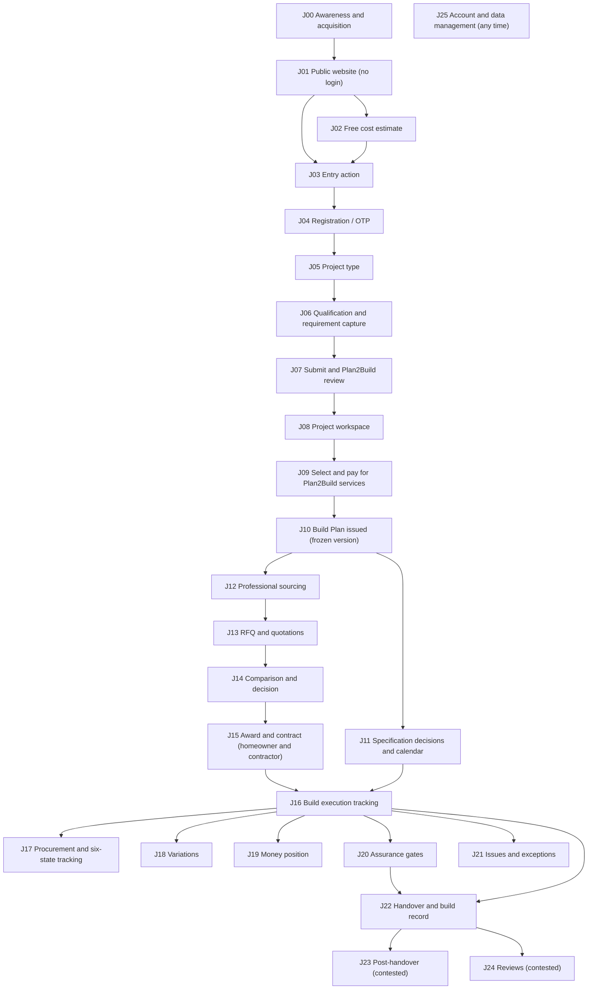
```mermaid
flowchart TD
    J00["J00 Awareness and acquisition"] --> J01["J01 Public website (no login)"]
    J01 --> J02["J02 Free cost estimate"]
    J01 --> J03["J03 Entry action"]
    J02 --> J03
    J03 --> J04["J04 Registration / OTP"]
    J04 --> J05["J05 Project type"]
    J05 --> J06["J06 Qualification and requirement capture"]
    J06 --> J07["J07 Submit and Plan2Build review"]
    J07 --> J08["J08 Project workspace"]
    J08 --> J09["J09 Select and pay for Plan2Build services"]
    J09 --> J10["J10 Build Plan issued (frozen version)"]
    J10 --> J11["J11 Specification decisions and calendar"]
    J10 --> J12["J12 Professional sourcing"]
    J12 --> J13["J13 RFQ and quotations"]
    J13 --> J14["J14 Comparison and decision"]
    J14 --> J15["J15 Award and contract (homeowner and contractor)"]
    J15 --> J16["J16 Build execution tracking"]
    J11 --> J16
    J16 --> J17["J17 Procurement and six-state tracking"]
    J16 --> J18["J18 Variations"]
    J16 --> J19["J19 Money position"]
    J16 --> J20["J20 Assurance gates"]
    J16 --> J21["J21 Issues and exceptions"]
    J20 --> J22["J22 Handover and build record"]
    J16 --> J22
    J22 --> J23["J23 Post-handover (contested)"]
    J22 --> J24["J24 Reviews (contested)"]
    J25["J25 Account and data management (any time)"]
```

### 6.4 The three orderings side by side

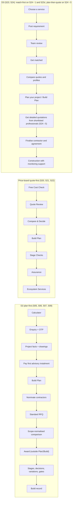
```mermaid
flowchart LR
    subgraph D2["D2 plan-first (S05, S06, S07, S09)"]
        a1["Calculator"] --> a2["Enquiry + OTP"] --> a3["Project facts + drawings"] --> a4["Pay first advisory instalment"] --> a5["Build Plan"] --> a6["Nominate contractors"] --> a7["Standard RFQ"] --> a8["Scope-normalised comparison"] --> a9["Award (outside Plan2Build)"] --> a10["Stages, decisions, variations, gates"] --> a11["Build record"]
    end
    subgraph P["Price-board quote-first (S20, S21, S22)"]
        b1["Free Cost Check"] --> b2["Quote Review"] --> b3["Compare & Decide"] --> b4["Build Plan"] --> b5["Stage Checks"] --> b6["Assurance"] --> b7["Ecosystem Services"]
    end
    subgraph D3["D3 (S23, S24): match-first on S24 › 1 and S23c; plan-then-quote on S24 › 5"]
        c1["Choose a service"] --> c2["Post requirement"] --> c3["Team review"] --> c4["Get matched"] --> c5["Compare quotes and profiles"] --> c6["Plan your project / Build Plan"] --> c6b["Get detailed quotations from shortlisted professionals (S24 › 5)"] --> c7["Finalise contractor and agreement"] --> c8["Construction with monitoring support"]
    end
```

### 6.5 How the IHB experience is phased during the POC (D2)

The D2 documents release the platform in phases tied to the pilot's commercial gates, so an IHB who joins early does not get the full canonical flow.

| Period | What the IHB gets | Source |
|---|---|---|
| Gate 1, weeks 1 to 8 | Field visit; written Build Plan (cost, specification, scope, cash-flow schedule) at ₹15,000 to ₹20,000, half upfront; "No app, no platform." "Gate 1 can be run with almost no platform: public landing/calculator, CRM-style lead capture and an internal Build Plan workflow." "Do not delay Gate 1 for a software release." | S03 §7.1; S06 §2, §13.1 |
| Phase 0, weeks 0 to 8 | "Landing/content; calculator; lead/project intake; simple payment link; internal admin case list; Build Plan generated with partly manual operations. No homeowner app." | S06 §13 |
| Sprints 3 to 4 (Gate 1) | Build Plan generator used internally: "Initially our advisor generates it; the customer never sees the tool." | S05 §8 |
| Sprint 5 (Gate 1) | Public estimator and stage guides | S05 §8 |
| Phase 1, weeks 6 to 14 | Project/stage model, decision schema, rate cards, estimator, BOQ, schedule/cash-flow, versioned Build Plan, "customer portal/PWA" | S06 §13 |
| Sprints 6 to 7 (Gate 2) | RFQ pack and comparison engine | S05 §8 |
| Sprint 8 (Gate 2) | Contractor portal and the project workspace: "Contractors must be able to respond to an RFQ; homeowners need somewhere to see it." | S05 §8 |
| Phase 2, weeks 10 to 20 | RFQ builder, contractor web portal, standard quote form, clarifications, comparison engine, PDF outputs, variation log | S06 §13 |
| Sprints 9 to 12 (Gate 3) | Auditor app and gate checklists (9 to 10); variations and money position (11); build record and operations console (12) | S05 §8 |
| Phase 3, weeks 16 to 28 | Auditor mobile app, offline sync, six gates, evidence, NC closure, six-state ledger, payments/referrals, build record | S06 §13 |
| Sprints 13 to 14 | "Hindi completion, hardening, handover" | S05 §8 |
| Phase 5, after traction | "Manufacturer analytics, verified contractor profiles, richer procurement marketplace, post-handover/renovation journeys, native homeowner app if usage merits." | S06 §13 |

Consequences (`DERIVED`): Gate 1 families receive the Build Plan as a document from an advisor before any homeowner workspace exists, so the canonical order in 6.3 (workspace before payment and Build Plan) describes the finished POC, not the first pilot families. "A gate that does not pass stops the work behind it." (S05 §8). S05 and S06 differ on when the homeowner workspace arrives (S05 sprint 8; S06 Phase 1, weeks 6 to 14) and on when verified contractor profiles arrive (S05 C1 in the MVP; S06 Phase 5; C-067).

---

## 7. Complete end-to-end IHB journey (summary)

This table is the one-page view of the journey. Section 8 specifies each stage in full.

> **Client decisions (2026-10-03), CD-01 to CD-28.** Section 33 gives the journey revised for the MVP. This table still records the sources.

| Stage | Objective for the IHB | What the IHB does (summary) | What Plan2Build does (summary) | Exit | Definition status |
|---|---|---|---|---|---|
| J00 | Become aware that independent help exists | Sees content, videos, search results, social posts; in the Raipur POC may be visited at home | Publishes content and stage guides; field team visits families with recent building permits (POC Gate 1) | Lands on the website or agrees to a consult | Partly defined |
| J01 | Understand the offer without committing | Reads the landing, services, independence and pricing pages; tries the quote-comparison demo | Serves public, indexable pages, usable on low-end Android without login | Starts an estimate or an entry action | Defined (D2 prototype, D3 mockups) |
| J02 | Learn what the house should cost | Enters city, built-up area, floors, finish level | Returns a cost range, per-square-foot range, duration and stage-wise breakdown; optionally a PDF in return for a mobile number | Proceeds to enquiry or leaves | Defined |
| J03 | Ask for help | Clicks "Start your build plan", "Post Your Requirement", "Get Started", "Talk to an Expert", or applies through an enquiry | Captures a lead; promises to come back with an indicative cost and first decisions (D2) or reviews the requirement (D3) | Lead exists | Partly defined |
| J04 | Get an identity on the platform | Verifies with OTP (D2) or registers with name, email, password or social login and verifies email (D1) | Creates the account, records consent, assigns the homeowner role | Account active | Partly defined (method conflict) |
| J05 | Say what kind of project this is | Chooses "Build a new home" (IHB) or another type | Routes to the matching qualification | Project type chosen | Defined (options conflict) |
| J06 | Describe the project | Enters location, property type, plot and built-up area, floors, budget, start timeline, funding source, current stage, services needed, style, notes, files | Validates, saves drafts, shows a running summary | Requirement complete | Defined (field sets differ) |
| J07 | Hand the project to Plan2Build | Submits the requirement (D3) or chooses an explicit readiness action (D1) | Team reviews the requirement and may contact the IHB; lead is qualified | Project accepted for planning | Partly defined |
| J08 | Get a workspace | Opens the project workspace and decisions calendar | Instantiates 16 stages (repeating stages per floor), 67 specification lines and decision deadlines; sets per-project roles | Workspace live | Defined (D2) |
| J09 | Buy Plan2Build's help | Chooses and pays for the Build Plan or package, or a quote review or comparison | Collects the fee (Razorpay or payment link) and records it | Paid engagement | Partly defined (prices conflict) |
| J10 | Receive the written plan | Reads and keeps the Build Plan (PDF and share link) | Advisor drafts, edits and issues; issued version is frozen; issuing Package A locks the baseline | Build Plan issued | Defined (D2); content conflicts |
| J11 | Make the material decisions on time | Reviews each specification line, chooses among at least three qualifying options, acknowledges with OTP | Issues lines and options at their lead time; long-lead items flagged | Lines chosen and frozen | Defined (D2) |
| J12 | Find contractors and other professionals | Nominates own contractors or accepts introductions (D2); searches, filters, saves and shortlists professionals (D3) | Introduces verified contractors (D2); matches and recommends (D3) | Contractors identified | Contested (C-004) |
| J13 | Get comparable quotes | Waits for quotes; answers clarifications through Plan2Build | Issues the standard RFQ pack; captures quotes (including on behalf of offline contractors); resolves clarifications | Quotes received | Defined (D2) |
| J14 | Understand why quotes differ | Reads the comparison and chooses | Produces the scope-normalised comparison (adjustment list, rupee impact per specification line) | Contractor chosen | Defined (D2); presentation conflicts |
| J15 | Engage the contractor | Signs the contract with the contractor directly | Records the contract baseline; stays out of the contract | Build can start | Partly defined |
| J16 | Keep control during construction | Views stage progress, decision deadlines, documents and evidence | Tracks stage instances, dates and progress; exception feed | Construction progressing | Partly defined |
| J17 | Know what was bought and installed | Sees specified, options issued, chosen states (and possibly more, C-029) | Records purchased, installed and verified states with evidence | Materials verified | Defined (D2) |
| J18 | Control changes | Raises or acknowledges variations with OTP | Updates contract value and completion date; escalates unacknowledged variations | Variation active or escalated | Defined (D2); rejection path unknown |
| J19 | Know the money position | Records and acknowledges payments; views paid to date, due now, projected final cost | Computes the money position; never moves construction money | Position current | Defined (D2) |
| J20 | Get independent verification | Buys assurance (optional); receives plain-language audit reports; acknowledges when relevant | Schedules auditors; inspects offline; logs and closes non-conformances by re-inspection | Gates passed | Defined (D2); pricing conflicts |
| J21 | Resolve problems | Raises issues and disputes (D1) | Escalates via the exception feed (D2); admin dispute workflow (D1) | Problem closed | D1 defined; D2 thin |
| J22 | Take over the finished house with its record | Receives the build record (PDF and structured data), readable without an account and transferable | Assembles the record automatically, including the concealed services map | Record delivered | Defined (D2) |
| J23 | Look after the house | Warranty reminders, maintenance, renovation, upgrades (D1, D3) | Postponed in D2 | Ongoing | Contested |
| J24 | Rate the professionals | Gives reviews (D1, D3) | Excluded in D2 POC | Review submitted | Contested |
| J25 | Manage the account and data | Edits profile, consents, notification preferences; exports or transfers the build record | Consent logging, privacy controls, retention | Ongoing | Partly defined |

---

## 8. Detailed flow by stage

Each stage uses the same template: objective, entry conditions, IHB actions (as action cards), system actions, data, validation, state changes, notifications, branches, errors, dependencies, exit conditions, next possible states, and unknowns. Action cards list the full set of fields requested for every IHB action (actor, trigger, preconditions, input, UI interaction, system behavior, validation, output, state change, notification, next actions, failure paths, alternatives, dependencies, business rules, data). A field reads `UNKNOWN — REQUIRES CONFIRMATION` when no source answers it.

### 8.1 J00: Awareness and acquisition

**Objective.** The IHB learns that Plan2Build exists and that independent help is available before the construction contract is signed.

**Entry conditions.** None. The IHB is anonymous.

**Evidence.**

| Fact | Source | Tag |
|---|---|---|
| Content "captures the buyer nine to eighteen months out at near-zero marginal cost" | S03 §8.3 | `EXPLICIT` [D2] |
| Content is produced per video (freelance, about ₹9,000 per video) and the city lead fronts on camera | S03 §7.3 | `EXPLICIT` [D2] |
| The public funnel is "indexed by search engines and linked from every video. No login." | S05 §6 P1 | `EXPLICIT` [D2] |
| "Everything the customer receives is a document ... These documents are the acquisition engine, not a reporting side-effect." Every paid deliverable is a branded PDF and a shareable web link that opens without a login | S05 §3 rule 4 | `EXPLICIT` [D2] |
| POC Gate 1 acquisition: "Pull residential building permits issued in Raipur in the last 60 days. Visit 40 families. Offer a written Build Plan ... at ₹15,000–₹20,000, half payable upfront. No app, no platform." | S03 §7.1 Gate 1 | `EXPLICIT` [D2], POC test only |
| A local associate (ready-mix concrete business) "supplies introductions, local credibility, a field base and visibility of pour schedules" | S03 §7 | `EXPLICIT` [D2] |
| KPI "Houses sourced through content ≥ 1"; "Content-sourced houses: Paid projects whose first attributable qualified source is content/organic" | S03 §7.2; S06 §17 | `EXPLICIT` [D2] |
| Funnel reporting "runs from video or calculator through registration to paid engagement" | S05 §6 O1 | `EXPLICIT` [D2] |
| "Watch How It Works" (2 min video) CTA on landing pages (S15, S17, S23a, S23c, S23e, S24 › 1); "See How It Works 2 min video" (S23b) | S15, S17, S23a to S23e, S24 | `EXPLICIT` [D1][D3] |
| Social channels in footer: Facebook, Instagram, YouTube, LinkedIn, Pinterest | S23a to S23e footers | `EXPLICIT` [D3][MOCKUP] |
| "Stay Updated" block with an email input; S23a wording "Get home building tips, trends and offers straight to your inbox." (other pages: "directly in your inbox", "delivered to your inbox"; S23c: "Get the latest tips, home ideas, trends and offers directly to your inbox.") | S23a to S23e footers | `EXPLICIT` [D3][MOCKUP] |
| Testimonial "Plan2Build helped us save time, avoid costly mistakes and build our home with confidence." (Rohan & Priya, Indore) | S17 | `EXPLICIT` [D1][MOCKUP], illustrative |

**IHB actions.**

A-J00-01 Watch content or a video.
- Actor: prospective IHB. Trigger: content discovered through search, social or a shared link. Preconditions: none. Input: none. UI interaction: plays the "How It Works" video or external content. System behavior: records an anonymous funnel event (S05 §5 `lead / calculator_session`: "Anonymous funnel events through to registration, for acquisition measurement"). Validation: none. Output: content. State change: none. Notification: none. Next actions: open the website (J01), use the calculator (J02). Failure paths: `UNKNOWN — REQUIRES CONFIRMATION`. Alternatives: field visit (A-J00-02). Dependencies: content production. Business rules: none specific. Data: lead source (S06 §6 module B "Lead source").

A-J00-02 Receive a field visit during the POC (D2, Raipur Gate 1).
- Actor: family; Plan2Build city lead. Trigger: the family holds a residential building permit issued in Raipur in the last 60 days (S03 §7.1). Input: conversation. UI interaction: none ("No app, no platform"). System behavior: none required for Gate 1; a CRM-style lead capture and an internal Build Plan workflow are sufficient (S06 §2 POC discipline). Output: offer of a written Build Plan at ₹15,000 to ₹20,000, half payable upfront (PR-005). Next actions: pay the upfront half (J09) or decline. Failure paths: family declines (Gate 1 kill criterion is fewer than 5 of 40 paying). Data: lead record. Business rules: BR-090.

A-J00-03 Open a shared Plan2Build document link.
- `DERIVED` from S05 §3 rule 4 (documents open without login and are the acquisition engine). Who shares and how the link attributes the new visitor are `UNKNOWN — REQUIRES CONFIRMATION`.

A-J00-04 Subscribe to the newsletter (D3).
- Actor: visitor. UI: email field with a submit arrow in the footer "Stay Updated" block (S23a to S23e). System behavior, confirmation, double opt-in and unsubscribe: `UNKNOWN — REQUIRES CONFIRMATION`. Business rule from D2 that applies: marketing consent must be separate and optional (S06 §11 "Separate optional marketing consent from service communications", BR-071).

**System actions.** Record anonymous funnel events from first visit (S05 §6 P1 acceptance criteria; S06 §17 instrumentation).

**Data.** Lead source, first attributable source, funnel events (F-001 to F-003).

**Branches.** Digital entry (content, search, social) or physical entry (field visit, associate introduction).

**Errors.** None defined.

**Dependencies.** Content production; S05 P1 public funnel; analytics (S06 §9 PostHog; S07 §17).

**Exit conditions.** Visitor lands on the public website or agrees to a consult.

**Next possible states.** J01, J02, J03, J09 (POC field-sale path).

**Unknowns.** Attribution method; newsletter behavior; whether D3 social campaigns target IHBs (S13 social campaigns target service providers, not homeowners).

### 8.2 J01: Public website exploration

> **Client decisions (2026-10-03), CD-03, CD-22.** Renovation, interiors, kitchens, extensions and repairs appear on the website as "coming soon" (phase 2). Plan2Build's contractor listing is part of the POC; the rest of the marketplace is future intent.

**Objective.** The IHB understands the offer without creating an account.

**Entry conditions.** Any visitor.

**D2 page (S14 prototype) as built.**

| Element | Content as built | Behavior |
|---|---|---|
| Navigation | Logo "Plan2Build BY CONJUNIQ"; links "Compare quotes" (#compare), "What we do" (#consults), "How we stay independent" (#independence), "Cost estimate" (#cost); button "Start your build plan" (#start) | In-page anchors |
| Hero | "The cheapest quote is almost never the cheapest house." Lede: "You will make sixty-seven material decisions building your home, and you are qualified to make none of them. Plan2Build writes them down as specifications, compares your quotes on equal scope, and checks the six things that cannot be undone. We never take your contract and we never replace your contractor." Buttons "Start your build plan", "See what your house should cost" | Anchors to #start and #cost |
| Comparison demo (#compare) | "Three quotes for the same house", "2,650 sq ft, G+1, Raipur · real structure, figures illustrative"; toggle "As quoted" / "Scope-normalised" | See below |
| Consults (#consults) | "Three consults, at the three moments you are already worried." Package A, B, C cards with fees and contents | Static |
| Independence (#independence) | "We specify performance. We never specify brands." Five published rules; example specification line A13 | Static |
| Cost calculator (#cost) | "What a house like yours should cost." "No signup, no email." | See J02 |
| Contractors section | "We are not your competitor..." five pledges; "Listing is free for the contractors we invite."; button "Apply to be listed" | Contractor-facing; visible to the IHB |
| Build record section | "Your land has papers. Your building has none." Record description; "It costs you nothing." | Static |
| Start (#start) | "Tell us about the house you want to build." "Send us your plot, your area and roughly when you want to start. We will come back with an indicative cost broken down by stage, and what your first decisions are." Button "Start your build plan" | The button links to #start itself; no form exists in the prototype (see J03) |
| Footer | "Independent specification advice for the family building one house, and for the contractor building a reputation." Homeowner links: Cost estimate, Compare your quotes, The three consults, How we stay independent. Contractor links: How listing works, Apply to be listed, Contact us. "ConjunIQ Technologies Private Limited". "Estimates are indicative and vary with site conditions, design and specification." | Anchors |

Comparison demo behavior (`EXPLICIT`, S14 script):

- Data: Contractor A ₹48.20 L with no adjustments. Contractor B ₹44.60 L as quoted with four adjustments: +₹185k "Excludes waterproofing to terrace and both bathrooms"; +₹62k "Quotes Fe500 where the drawings call for Fe500D"; +₹140k "Compound wall and gate not in scope"; +₹48k "12 mm internal plaster against the specified 15 mm" (normalised ₹48.95 L). Contractor C ₹49.80 L as quoted with one adjustment −₹120k "Includes a false ceiling in two rooms you did not ask for" (normalised ₹48.60 L).
- Default mode "As quoted": shows raw totals; the lowest raw quote is tagged "Looks cheapest by ₹3.6 lakh"; footer text "This is the comparison you get today: three numbers, no way to know what sits behind them. Switch to scope-normalised to see what our specification audit finds."
- "Scope-normalised" mode: shows normalised totals and each adjustment; a quote with no adjustments shows "Scope complete as issued. Nothing to add."; the lowest normalised total is tagged "Genuinely the lowest, on equal scope"; Contractor B is tagged "Now the most expensive of the three"; footer text explains that the cheaper-looking quote "is the dearest of the three — and it would have arrived as four separate bills you never agreed to. This is what we do before you sign anything: not find you the lowest number, but make the numbers comparable."
- Tension with S05 P4 ("The headline output is never a ranking by price") is logged as C-012.

**D2 requirements for the public site.**

| Requirement | Source | Tag |
|---|---|---|
| Fully usable and indexable without an account | S05 §6 P1 AC | `EXPLICIT` |
| Pages render correctly on a low-end Android device on a slow connection | S05 §6 P1 AC | `EXPLICIT` |
| Sixteen stage guide pages, each available in Hindi, carrying the correct cost share and duration from F1 | S05 §6 P1 outputs and AC | `EXPLICIT` |
| Public estimator interactive within three seconds on a mid-range Android over 3G | S05 §7 Performance | `EXPLICIT` |
| Hindi and English from first release, including the public website | S05 §3 rule 6, §7 Language | `EXPLICIT` |
| Landing pages, content and SEO on public web | S06 §4 matrix | `EXPLICIT` |
| Customer-facing naming: of "Home Building Intelligence Platform" versus "Homeowner Decision Platform", "use the first with investors and neither with customers. A homeowner in Raipur does not buy an intelligence platform." | S03 §2 | `EXPLICIT` [D2] (the D1 boards use both phrases on customer-facing pages: S15 "INDIA'S HOMEOWNER DECISION PLATFORM"; S16 "A homeowner decision platform powered by home building intelligence."; S17 "INDIA'S HOME-BUILDING INTELLIGENCE PLATFORM") |
| The independence rules are public before launch: "These are not optional, and they should be published before the first customer is served." The qualification rules "are published, and they are enforced in the data layer, not only in the interface." | S03 §4.2; S04 §6 | `EXPLICIT` [D2] |

**D3 public pages (S23, S24).** Navigation: Home, Services, Build Plan, Professionals, Tools, Resources, About, search icon, "Get Started" (S23); Services, House Plans, Projects, Resources, About, search icon, "Get Started" (S24 › 1). Home sections: hero "Build, Renovate and Improve Your Home with Confidence." with "Explore Services" and "Post Your Requirement" (S23a); "What do you need help with?" project-type tiles (S24 › 1); service categories; "How It Works"; "Why Choose Plan2Build"; "Featured Tools" (free); "Featured Professionals" (top-rated); "Popular House Plans" (S24 › 1); CTA band; footer with Help Centre, Contact Us, FAQs, Terms & Conditions, Privacy Policy, phone "Mon – Sat, 9:00 AM – 6:00 PM". Services page (S23b, S24 › 2): six categories with sub-services, a service search box (S24 › 2 "Search for a service (e.g, architect, waterproofing, kitchen)"), "Not Sure What You Need?" project-type cards, "How to Choose the Right Service" three steps, CTA "Post Your Requirement" and "Talk to an Expert".

**D1 public pages (S15, S16, S17).** "Login" and "Start Your Journey" / "Start Your Build Plan" in the header; four pillars Plan, Compare, Build, Improve; "Talk to an Expert"; trust strip (Verified Professionals, Transparent Pricing, Expert Guidance, Lifetime Support).

**IHB actions.**

A-J01-01 Toggle the comparison demo (D2). Covered above. No data is stored. `EXPLICIT`.

A-J01-02 Browse service categories and sub-services (D3). Trigger: "Explore Services", "View All Services", "Explore →". System behavior on "Explore Services →" per category: `UNKNOWN — REQUIRES CONFIRMATION` (no category detail page is in the sources).

A-J01-03 Search for a service (D3, S24 › 2) or use the header search icon (S23, S24). Results page and matching logic: `UNKNOWN — REQUIRES CONFIRMATION`.

A-J01-04 Browse "Popular House Plans" and "View All Plans" (S24 › 1). The plans shown are "Modern 2 BHK 1,200 sq ft", "3 BHK Family Home" with an area that is barely legible (it reads as "1,650 sq ft"; an earlier transcription gave "1,850"), "Luxury Villa 3,500 sq ft", "Duplex Home 2,400 sq ft". What a house plan is (purchasable design, inspiration, template for the Build Plan) and what selecting one does: `UNKNOWN — REQUIRES CONFIRMATION` (OQ-035, C-057).

A-J01-05 View featured professionals and "View Profile" (S23a). Covered in J12.

A-J01-06 Read help content (FAQs, Help Centre, Terms & Conditions, Privacy Policy) (S23 footers). Content: `UNKNOWN — REQUIRES CONFIRMATION` (MI-010).

**Errors.** None defined for public pages beyond performance targets.

**Exit conditions.** Visitor starts an estimate (J02), takes an entry action (J03) or leaves.

**Unknowns.** Category and search results pages; house plan pages; "Resources" and "Projects" content; language switcher placement (Hindi requirement exists, UI does not).

### 8.3 J02: Free cost estimate

**Objective.** Tell the IHB what a house like theirs should cost, before they talk to anyone.

**Entry conditions.** None. No account. "No signup, no email." (S14 #cost).

**Price.** Free in every source that prices it: "Home Cost Check" priced "Free" (S20 to S22); "Cost Calculator" listed under "Plan Smarter with Our Free Home Building Tools." (S23a); "Free calculator and content at the top of the funnel" (S03 §4).

**A-J02-01 Run the cost calculator (D2 prototype, S14).**

| Field | Specification |
|---|---|
| Actor | IHB (anonymous) |
| Trigger | Opens #cost or "See what your house should cost" |
| Preconditions | None |
| Input | City (select), Total built-up area in sq ft (number), Floors (select), Finish level (three-button segmented control) |
| Input options (prototype) | City: Raipur (default), Bilaspur, Bhubaneswar, Nagpur, Indore, Jaipur, Pune, Bengaluru. Floors: Ground only, Ground + 1 (default), Ground + 2, Ground + 3. Finish level: Standard, Premium (default), Luxury. Area default 2650. |
| UI interaction | Any change recalculates immediately (`input` event on city, area, floors; click on a finish button) |
| System behavior (prototype formula, `EXPLICIT` from S14 script) | City multiplier: Raipur 1.00, Bilaspur 1.01, Bhubaneswar 1.03, Nagpur 1.04, Indore 1.06, Jaipur 1.08, Pune 1.12, Bengaluru 1.14. Finish rate per sq ft (low to high): Standard ₹1,520 to ₹1,800; Premium ₹1,950 to ₹2,400; Luxury ₹2,650 to ₹3,600. Floor factor = 1 + (floors − 1) × 0.012. Per-sq-ft range = finish rate × city multiplier × floor factor. Total range = per-sq-ft range × area. Duration in months = round(12 + area / 700 + (floors − 1) × 1.6). Stage amounts = midpoint of total range × stage share. |
| Stage shares (prototype) | Drawings and approvals 3%; Site prep and excavation 2%; Foundation and footings 8%; Plinth and backfilling 4%; Columns and beams 9%; Slab casting 11%; Blockwork 8%; Roof, parapet, staircase 4%; First-fix conduiting 5%; Waterproofing 3%; Plastering 7%; Doors and windows 8%; Flooring and tiling 10%; Second-fix and sanitary 7%; Painting and finishes 7%; External works and handover 4% (total 100%) |
| Validation (prototype) | HTML attributes min 600, max 12000, step 50 on area; the script itself only clamps area to a minimum of 300 and treats empty or non-numeric input as 300. Values above 12,000 are calculated as entered. Production validation: `UNKNOWN — REQUIRES CONFIRMATION` (OQ-043). |
| Output | "Likely cost to build, excluding land and approvals"; total range in lakh; "₹lo – ₹hi per sq ft · about N months from excavation to handover"; sixteen stage bars with amounts. At the default inputs the script, which runs on page load, shows "₹52.3 L – ₹64.4 L" and "₹1,973 – ₹2,429 per sq ft · about 17 months from excavation to handover". The markup's static placeholder "₹51.7 L – ₹63.6 L" (computed without the floor factor) is overwritten immediately. |
| State change | None |
| Notification | None |
| Next actions | "Start your build plan" (J03); change inputs |
| Failure paths | None in prototype |
| Alternatives | D3 calculator page ("Open Calculator", S23e), D1 "Budget Estimator" (S16) |
| Dependencies | Production: S05 F2 rate engine and versioned rate cards; F1 stage master (cost shares and durations) |
| Business rules | BR-001 to BR-006 |
| Data | Calculator session event (F-003); production estimate stores the rate-card version (F-004) |

**Production requirements for the estimator (D2).**

| Requirement | Source | Tag |
|---|---|---|
| Inputs: city, built-up area, floor count, quality tier, rate card in force | S05 §6 F2 | `EXPLICIT` |
| Inputs: city/locality, plot/build area, floors, finish level, structural assumptions | S06 §10 | `EXPLICIT` |
| Outputs: cost range, per-square-foot range, indicative duration, stage-wise breakdown that sums to the total | S05 §6 F2 | `EXPLICIT` |
| Output: range, assumptions, rate version, CTA; "Never present false precision" | S06 §10 | `EXPLICIT` |
| "The output should not pretend to be exact; it should explain the assumptions behind the range" | S07 §4.1 | `EXPLICIT` |
| Stage-wise breakdown always sums to the headline total | S05 §6 F2 AC | `EXPLICIT` |
| An estimate stores the rate-card version used and can be regenerated identically months later | S05 §6 F2 AC | `EXPLICIT` |
| Operations can create a new rate-card version for a city without altering estimates already issued; rates maintainable without a deployment | S05 §6 F2 AC; O1 | `EXPLICIT` |
| Outputs also include a downloadable PDF estimate; a mobile number is optionally collected "for the PDF"; a lead record is captured | S05 §6 P1 | `EXPLICIT` (the S14 prototype has no PDF and no mobile field) |
| Rate cards per city, per quality tier, per period; versioned | S05 §5 reference data | `EXPLICIT` |
| City list in the POC: one city; multi-city configuration beyond city-level rate cards is out of scope | S05 §9; S03 §6 | `EXPLICIT` |
| Pilot scope: "Nine months, one city, two localities, roughly 40 families entering the funnel." City reference data carries "Name, state, rate multiplier, active flag." | S03 §7; S05 §5 | `EXPLICIT` [D2] |
| Estimator outputs include "confidence/range" and the rate version used; rate items carry "confidence" | S06 §6 module E, §7 RateCard; S07 §14 module E | `EXPLICIT` [D2] |
| Basis of the figures: "Built from what houses in this range actually cost, broken down the same way your contractor will quote." The estimator and city rate index are "calibrated by walking real sites." | S14 #cost; S03 §6 | `EXPLICIT` [D2] |
| "Home Cost Check" contents: "Estimated construction cost for your plot size", "Typical specifications for your city", "Guidance on next steps"; outcome "Understand the likely cost and what to do next." | S21, S22 | `EXPLICIT` [D2 pricing]; the calculator in S14 shows no specifications (AMB-010) |

**D3 statements.** "Cost Calculator: Get an estimated cost for your home project instantly." (S23a) and "Get an accurate cost estimate based on your plot size, design and specifications." (S23e). "Accurate" conflicts in tone with "indicative" (S14 footer) and "never present false precision" (S06 §10): AMB-011.

**Branches.** Leave; adjust inputs; go to J03; (production) request the PDF by giving a mobile number (A-J02-02).

**A-J02-02 Request the PDF estimate (production, D2).** Input: optional mobile number. Output: downloadable PDF. Consent text, OTP on the mobile number, and follow-up contact rules: `UNKNOWN — REQUIRES CONFIRMATION` (OQ-042).

**Errors.** None defined.

**Exit conditions.** IHB has an indicative range.

**Next possible states.** J03, or leave.

**Unknowns.** Production input limits and units; locality-level rates (S06 mentions locality); how "structural assumptions" are entered; PDF content; whether the Home Cost Check is the calculator or an advisor service. The output label excludes approvals ("excluding land and approvals") while the stage breakdown includes "Drawings and approvals" at 3% and the duration runs "from excavation to handover" (AMB-071).

### 8.4 J03: Entry action (enquiry, start build plan, post requirement, talk to an expert)

**Objective.** The IHB signals that they want Plan2Build's help with their house.

**Entry points found in the sources.**

| Entry point | Label | Source | Destination as specified |
|---|---|---|---|
| E1 | "Start your build plan" | S14 nav, hero, #start | #start section: "Send us your plot, your area and roughly when you want to start. We will come back with an indicative cost broken down by stage, and what your first decisions are." The prototype button points back to #start; no form exists. |
| E2 | Enquiry + OTP | S06 map 1 "Qualify: Enquiry + OTP"; S07 §4.2; S09 §4 "enquiry/OTP" | Project workspace creation after OTP (J04, J08) |
| E3 | "Post Your Requirement" | S23a hero and CTA band, S23b hero and banner, S23c page | Post Your Requirement form (J05 to J07) |
| E4 | "Get Started" | S23, S24 header | `UNKNOWN — REQUIRES CONFIRMATION` |
| E5 | "Talk to an Expert" / "Talk to Our Team" / "Need Help?" | S24 › 2, S23e, S23c, S17 | Human contact; channel (call, chat, callback, booking) `UNKNOWN — REQUIRES CONFIRMATION` (OQ-025, OQ-034) |
| E6 | "Get Expert Recommendations" | S23d banner: "Let Plan2Build shortlist the right professionals for you. Share your requirements and we'll match you with the best verified professionals — tailored to your project, location and budget." | `DERIVED`: leads to requirement capture; exact destination unknown |
| E7 | "Generate My Build Plan" | S23e hero and banner | `UNKNOWN — REQUIRES CONFIRMATION` (C-009) |
| E8 | "Explore Planning", "Explore Assurance", "Explore Services" | S20 | Offer pages not in the sources |
| E9 | "Start Your Journey", "Start Your Home Plan", "Start Your Build Plan", "Plan Your Home" | S15, S17 | D1 onboarding (J04, J05) |
| E10 | Field visit offer | S03 §7.1 | Offline sale (J09) |
| E11 | Calculator PDF request | S05 §6 P1 | Lead record with optional mobile number |

**A-J03-01 Start a build plan (D2).**
- Actor: IHB. Trigger: clicks "Start your build plan". Preconditions: none. Input (as stated): plot, area, roughly when to start (S14 #start). UI interaction: `UNKNOWN — REQUIRES CONFIRMATION` (no form in prototype). System behavior: captures an enquiry (lead) (S06 §4 "Lead/enquiry + OTP onboarding" on public web and homeowner PWA). Validation: `UNKNOWN — REQUIRES CONFIRMATION`. Output promised: "an indicative cost broken down by stage, and what your first decisions are" (S14). Who replies and through which channel: `DERIVED` Plan2Build staff (S06 §3 city lead / concierge "Onboard families"); channel `UNKNOWN — REQUIRES CONFIRMATION`. Turnaround: `UNKNOWN — REQUIRES CONFIRMATION`. State change: lead created; enquiry status (S07 §7 operations "Lead intake: Source, locality, enquiry status, conversion funnel"); enquiry status values `UNKNOWN — REQUIRES CONFIRMATION`. Notification: `UNKNOWN — REQUIRES CONFIRMATION`. Next actions: OTP onboarding (J04). Dependencies: operations lead intake (S06 map 4 "Lead intake: Qualify project/source").

**A-J03-02 Post a requirement (D3).** Specified in J05 to J07 (the form itself).

**A-J03-03 Ask for an expert (D3, D1).** Labels E5. Behavior: `UNKNOWN — REQUIRES CONFIRMATION`. S21 and S22 sell "Expert discussion (60 mins)" inside Quote Review and "Expert discussion (90 mins)" inside Compare & Decide; whether "Talk to an Expert" is free pre-sales contact or a paid session is `UNKNOWN — REQUIRES CONFIRMATION` (OQ-034).

**Branches.** D2 enquiry then OTP; D3 form without visible login; D1 sign-up first; offline field sale.

**Exit conditions.** A lead or draft requirement exists.

**Next possible states.** J04 (if login is required before capture), J05 (if capture comes first), J09 (field sale).

### 8.5 J04: Registration and authentication

**Objective.** Give the IHB a verified identity and a homeowner role so that a project can be created and sensitive actions (payments, OTP acknowledgements) can be attributed.

**Entry conditions.** IHB has decided to proceed (J03).

**Sources by direction.**

| Aspect | D1 | D2 | D3 |
|---|---|---|---|
| Method | "User submits name, email and password or a supported social sign-in method." (S01 §4.1) | "OTP/email login" (S06 §6 module A); "OTP/email authentication" (S07 §19); "Register/OTP" (S08 §4); "enquiry/OTP" (S09 §4) | Not shown |
| Verification | "Email verification is completed before sensitive actions are enabled." (S01 §4.1). "Email verification is completed if required by the authentication provider." (S02 §4.1) | OTP | Not shown |
| Phone | "Optional phone verification can be used for high-risk actions such as payments, payout-related approvals or account recovery." (S01 §4.1) | OTP is used for onboarding and for acknowledgements (S04 §8, S05 P5) | Not shown |
| Role | "Profile is created with HOMEOWNER role." (S01 §4.1); "User starts account creation and selects/accepts the homeowner experience." (S02 §4.1) | Roles are per project (S05 P2) | Not shown |
| Project gating | "The first project wizard begins only after minimum profile/account verification." (S01 §4.1) | Enquiry and OTP onboarding create the project workspace (S07 §4.2) | Requirement form shown without login (S23c) |
| Profile | "User may optionally create a display/profile record; project identity remains separate from personal profile identity." (S02 §4.1) | User: role, contact, auth status, consent, organisation (S06 §7) | Not shown |
| Consent | Not specified | "Version privacy notice/terms acceptance and retain timestamp/source. Provide consent withdrawal where applicable." (S06 §11); consent logging (S06 module A) | "We never share your personal details without your consent." (S23c) |
| Email provider | Resend: "OTP, verification, password reset and transactional email" (S10 to S12) | Resend Pro "OTP, verification, password reset and transactional email" (S09 §5) | Not shown |
| Channel of OTP | Not specified | "Email + SMS: OTP, urgent reminders, key transactional links" (S07 §16.7) | Not shown |

These differences are logged as C-024 (verification gating), C-025 (method) and C-026 (timing of account creation).

**A-J04-01 Register (canonical union).**

| Field | Specification |
|---|---|
| Actor | IHB |
| Trigger | Entry action requiring identity (J03), or the first project wizard (D1) |
| Preconditions | None |
| Input | D1: name, email, password, or social sign-in. D2: contact for OTP (mobile number or email; which one is `UNKNOWN — REQUIRES CONFIRMATION`) |
| UI interaction | Enter details; receive OTP or verification email; enter OTP or click verification link |
| System behavior | Creates User (S01 §19 T01 "User account", result PENDING_EMAIL, side effect "Verification email"); creates session (S02 fig 11 Login/sign-up → Auth provider → Session/token → Backend authorization → Role + project membership); records consent version and timestamp (S06 §11) |
| Validation | OTP correctness and expiry; rate limits on login and OTP (S01 §21, S02 §16; stated in D1 only); "Wrong OTP / expired token: Rate-limit; allow retry; lock or cooldown after repeated failures" (S01 §20). Limits and durations: `UNKNOWN — REQUIRES CONFIRMATION` |
| Output | Verified account; homeowner role |
| State change | D1 account: PENDING_EMAIL → ACTIVE (S01 §4.4, T02). D2: auth status field exists (S06 §7); values `UNKNOWN — REQUIRES CONFIRMATION` |
| Notification | D1: verification email (T01); "Welcome / next step" on verification (T02) |
| Next actions | Choose project type (J05) or continue the requirement (J06) |
| Failure paths | Wrong or expired OTP (retry, then lock or cooldown); email delivery failure: "Record delivery failure; preserve OTP/account action safely", user may "Retry / alternate verification method", "Support queue if repeated" (S02 §20); invalid session: "Denied + audit" (S02 fig 11) |
| Alternatives | Social sign-in (D1 only) |
| Dependencies | Authentication provider (Supabase Auth in S10 to S12 and as the lean option in S07 §16.3); Resend for email; SMS provider (S07 §16.7) |
| Business rules | BR-010 to BR-016 |
| Data | F-010 to F-019 |

**A-J04-02 Log in.** Method per A-J04-01. Session mechanism: "Use secure, HTTP-only session mechanisms where applicable" (S02 §16). Session expiry duration: `UNKNOWN — REQUIRES CONFIRMATION` (session expiry is a required QA scenario in S01 §23.3).

**A-J04-03 Reset password (D1 only).** S01 T49: User resets password → credential record → ACTIVE → email. D2 does not mention passwords; S09 still budgets "password reset" email. Whether passwords exist in D2: `OPEN QUESTION` (OQ-004).

**A-J04-04 Verify phone for high-risk actions (D1).** Optional in S01 §4.1. D2 uses OTP for acknowledgements; whether OTP goes to a verified phone: `UNKNOWN — REQUIRES CONFIRMATION`.

**Security rules applying to the IHB account (all directions, not contradicted).**

- All privileged API calls are authorized server-side; client UI visibility is not a security control (S01 §21; S02 §3 "A hidden button is not a permission model").
- Role-based permissions enforced at endpoint and data-query levels (S01 §21); row-level or equivalent boundaries "so one homeowner cannot access another project" (S02 §16); "Every sensitive action must check actor identity, role, project membership, ownership and current object state" (S02 §3).
- Security-sensitive events are logged: "login changes, role changes, verification, quote acceptance, payments, refunds, change-order approval and admin overrides" (S02 §16).
- "Account compromise suspected: Force re-auth/session revocation as policy dictates; Security notice; Admin/security review" (S02 §20).
- "Account suspension blocks sensitive actions while preserving historical project records needed for operations and disputes" (S01 §21).
- Sensitive logs exclude raw passwords, secret keys and unnecessary personal data (S01 §21).

**Exit conditions.** IHB is authenticated with a homeowner identity.

**Next possible states.** J05, J06.

**Unknowns.** OTP channel, OTP length and validity, retry and lock thresholds, session length, multi-device behavior, change of mobile number, account recovery in D2, whether a requirement can be submitted anonymously (D3).

### 8.6 J05: Intent and project-type selection

> **Client decision (2026-10-03), CD-03.** "Build a new home" is the only project type at the MVP. Any other type leads to a "coming soon" page and is built in phase 2. This settles OQ-003, and C-006 for the MVP.

**Objective.** Capture what the IHB wants to do, so the right qualification follows.

**Entry conditions.** IHB is in onboarding (D1, after account creation) or on the requirement form (D3).

**Options by source.**

| Source | Prompt | Options |
|---|---|---|
| S18 › 1 (D1) | "What would you like to do? Choose the option that best describes your goal." | Build a new home; Renovate my home; Do interiors; Add a floor / room; Repairs & maintenance; Not sure (Help me decide). Button "Continue →". |
| S01 §6.1 (D1) | Onboarding choices | Build a new home; Renovate my home; Do interiors; Add floor / room; Repairs & maintenance; Not sure |
| S10 to S12 (D1) | "Select project type" | new villa/house, apartment work, renovation, upgrade, interiors, kitchen or another defined category |
| S08 §4, S09 (D2) | "choose project type" | Not enumerated; D2 POC scope is new individual house construction (S05 §9 excludes renovation, maintenance, post-handover) |
| S24 › 1 (D3) | "What do you need help with?" | Build a New Home; Renovate / Remodel; Interiors; Kitchen; Upgrade / Repairs; Others |
| S24 › 3 (D3) | "What do you want to do?" | Build a New Home; Renovate / Remodel; Interiors; Kitchen; Upgrade / Repairs |
| S23c (D3) | "1 Project Type: What would you like to do?" | Build New Home ("Construct a new home on your plot."); Renovation ("Upgrade or remodel your existing home."); Interiors ("Design and decorate your interior spaces."); Repair & Upgrade ("Repairs, maintenance or functional upgrades.") |
| S23b (D3) | "Not Sure What You Need? ... Choose your project type to get started" | Build New Home ("From design to handover"); Renovate Home ("Upgrade or remodel"); Interiors ("Stylish & functional spaces"); Upgrade & Repair ("Fix, replace or improve") |

**A-J05-01 Choose "Build a new home" (the IHB path).**

| Field | Specification |
|---|---|
| Actor | IHB |
| Trigger | Onboarding step 1 or form section 1 |
| Preconditions | D1: account exists (S01 §4.1, S02 §4.1). D3: none visible |
| Input | One selection |
| UI interaction | Select a tile (selected tile shows a highlighted border and check, S23c, S24 › 3); D1 "Continue →" |
| System behavior | D1: "The system creates a Project in Draft/Onboarding state and links the user as Project Owner." (S02 §4.1 step 5); next action "Project qualification" (S01 §6.1). D3: a "Your Project Summary" panel is shown ("Build New Home: A residential home construction project in Bangalore."), but it does not match the form state shown (the city field is empty), so whether it updates live is `UNKNOWN` (S23c [MOCKUP]) |
| Validation | One option required (`DERIVED` from single-select tiles); D3 marks no asterisk on project type |
| Output | Qualification form for a new home |
| State change | D1 project: DRAFT (S01 T03) / Draft/Onboarding (S02 §19) |
| Notification | None |
| Next actions | J06 |
| Failure paths | None defined |
| Alternatives | Other project types (A-J05-02), "Not sure" (A-J05-03) |
| Dependencies | None |
| Business rules | BR-020, BR-021 |
| Data | F-020 project type |

**A-J05-02 Choose a non-IHB project type.** D1 routes: Renovate → "Renovation qualification"; Do interiors → "Interior scope qualification"; Add floor / room → "Extension/addition qualification"; Repairs & maintenance → "Yes / service request" → "Service qualification" (S01 §6.1). D3 keeps the same form. D2 POC: these types are out of scope (S05 §9); what the UI does when one is chosen: `UNKNOWN — REQUIRES CONFIRMATION` (OQ-003).

**A-J05-03 Choose "Not sure".** D1: "Yes, exploratory" project → "Decision assistant → recommended project type" (S01 §6.1). The decision assistant itself is not specified anywhere: `UNKNOWN — REQUIRES CONFIRMATION`. D3: "Not sure what you need? Talk to our experts" (S24 › 2) or "Not Sure What You Need?" project-type cards (S23b).

**Exit conditions.** Project type recorded.

**Next possible states.** J06.

### 8.7 J06: Project qualification and requirement capture

> **Client decisions (2026-10-03), CD-02, CD-28.** The requirement form uses multiple-choice boxes, so the homeowner picks answers instead of typing. It also asks the homeowner to rank what matters most (quality of work, finishing on time, staying within budget, experience with similar homes); the ranking sets the recommendation weights (proposed, `RECOMMENDATION_ENGINE.md`). The final fields and options are still open (OQ-039).

**Objective.** Record the facts Plan2Build needs to plan, estimate, match and specify.

**Entry conditions.** Project type chosen (J05).

**Field set per source** (complete field catalogue with types and rules in section 12).

| Field | D1 (S02 §4.2, S01 §6.2, S18 › 2) | D2 (S05, S06, S07, S08, S09) | D3 (S23c, S24 › 3) |
|---|---|---|---|
| Property type | Required before plan generation; examples "Independent house, apartment, land"; board "landed, apartment, etc."; mock value "Independent House" | Not listed as a field | S23c "Property Type *" dropdown (Independent House shown); S24 › 3 image tiles Independent House, Villa, Apartment, Plot Construction |
| Location | "City / service location"; normalise to address + coordinates where available | city/locality (S06 §6 B, §7); location (S07 §4.2) | S23c "City / Location *" ("Search city, area or pincode"); S24 › 3 "Where is your project?" ("Select City / Location") |
| Plot / flat size | Numeric bounds, unit normalisation; mock "2,400 sq ft" | plot (S05 §5; S06 §7) | S23c "Plot or Home Size *" numeric with unit dropdown ("Sq. ft.") |
| Built-up area | "Plot / flat size and planned built-up area" (S01 §6.2) | built-up area (S06 §7, S07 §4.2); area per floor (S05 §5) | S24 › 3 "Approximate built-up area" bands: < 1,000 sq ft; 1,000 – 2,000 sq ft; 2,000 – 3,000 sq ft; > 3,000 sq ft |
| Floors | Not captured | floors (S05 §5, S07 §4.2, S09) | Not captured |
| Quality tier / finish level | Not captured | quality tier (S05 §5, S09) | Not captured (S23c style preferences are different) |
| Budget | "Range, not a single false-precision number"; mock "₹ 40 – 55 Lakh"; "Budget range and financing preference" | budget (S05 §5); budget band (S06 §7, S07 §4.2) | S23c "Project Budget Range *" dropdown (₹ 50 Lakhs – ₹ 1 Crore shown); S24 › 3 "Estimated budget" bands: < ₹25 Lakhs; ₹25 – 50 Lakhs; ₹50 Lakhs – 1 Cr; > ₹1 Cr |
| Funding / financing | "financing preference" (S01 §6.2) | funding source (S05 §5, S07 §4.2) | Not captured |
| Timeline | "Window, target date optional"; mock "6 – 12 months"; "expected start and target completion" | target start (S05 §5, S07 §4.2, S09); target dates (S06 §7) | S23c "Preferred Start Timeline *" (Within 3 – 6 months shown); S24 › 3 "When do you plan to start?" ("Select timeline") |
| First-time builder | Yes / No ("Boolean / unknown") | Not captured | Not captured |
| Stage of readiness | Enum; "drives recommendation urgency"; mock "Just exploring" | "stage" (S06 §6 B); "current construction stage" (S07 §4.2) | Not captured |
| Contractor status | Not captured | "contractor status" (S06 §6 B) | Not captured |
| Requirements, preferences, constraints | Listed (S01 §6.2) | "other relevant inputs" (S07 §4.2) | S23c "Additional Information" textarea ("Share any specific requirements, design ideas or other details. (Optional)"; placeholder "E.g. number of bedrooms, special features, preferred materials, or any specific requirements..."), counter "0/500"; S24 › 3 "Any other details? (optional)". No D3 form has a bedroom (BHK) field, although S20 and S21 price the Build Plan per BHK: how the BHK count is captured is `UNKNOWN — REQUIRES CONFIRMATION` |
| Services needed | S10 §4: "Enter property, budget, timeline, stage and required services/products"; "Select required services/products → Post requirement" (D1 proposal). S01/S02 qualification does not list it; S01 §9.1 selects professional categories at RFQ | Not captured | S23c "Services Needed" multi-select: Architectural Design & Planning; Full Home Construction; Interior Design & Execution; Structural & Civil Work; MEP (Electrical, Plumbing, HVAC); Approvals & Legal Support; Material Supply; Project Management; Renovation / Demolition |
| Style | Not captured | Not captured | S23c "Style Preferences" ("What style do you prefer? (Optional)"): Modern, Contemporary, Traditional, Minimalist, Luxury, Other |
| Drawings and files | Not captured at qualification | "drawings" (S07 §4.2; S06 §6 B); "upload drawings/inputs" (S06 §5.1) | S23c "Upload Files": "Share inspiration images, floor plans or any relevant documents. (Optional)"; "Supports: JPG, PNG, PDF (Max 10MB each)" |
| Stakeholders | Not captured | "stakeholders" (S05 §6 P2 inputs) | Not captured |
| Documents | Not captured | "documents" (S05 §6 P2 inputs) | Same as files |

**A-J06-01 Enter project details (canonical union).**

| Field | Specification |
|---|---|
| Actor | IHB |
| Trigger | Project type chosen |
| Preconditions | D1: Project exists in Draft/Onboarding. D2: OTP onboarding done. D3: none visible |
| Input | Fields above |
| UI interaction | D1: single "Project Details" screen with dropdowns and a Yes/No radio, button "Next →" (S18 › 2). D3 (S23c): long form with seven numbered sections, a five-step stepper (Project Type, Property Details, Budget & Timeline, Services Needed, Review & Submit), a right-hand "Your Project Summary" panel with "Edit", and buttons "Save Draft" and "Submit Requirement →". D3 (S24 › 3): three-step wizard (Project Details, Your Preferences, Review & Submit) with chip selectors and "Next: Your Preferences →" |
| System behavior | D1: "Progress is saved after each step so the flow can be resumed on web or mobile." (S02 §4.1 step 6); upserts the qualification (S02 §17 TX-003 "Save qualification ... Upserts project qualification ... Validation"). D3: Save Draft stores the partial requirement (`DERIVED` from the button label; storage and expiry `UNKNOWN — REQUIRES CONFIRMATION`); summary panel mirrors entries. D2 option: AI "Requirement understanding: Convert natural-language homeowner inputs into structured fields for review" (S08 §7) |
| Validation | D1 (S02 §4.2): property type required before plan generation; location normalised to address and coordinates where available; size numeric with bounds and unit normalisation (bounds not given); budget is a range; timeline a window with optional target date; first-time builder Boolean or unknown; readiness an enum. D3 (S23c [MOCKUP]): fields carry asterisks (City / Location, Property Type, Plot or Home Size, Project Budget Range, Preferred Start Timeline), so they are probably required (`DERIVED`; enforcement and error messages not shown); Style, Additional Information and Upload Files marked optional; Additional Information limited to 500 characters (counter "0/500"); files limited to JPG, PNG, PDF, 10 MB each. Services Needed has neither an asterisk nor "(Optional)": requiredness `UNKNOWN — REQUIRES CONFIRMATION` |
| Output | Saved qualification or draft requirement; summary |
| State change | D1: qualification version saved; on completion T04 → QUALIFIED with side effect "Plan invitation" (S01 §19). D3: draft (`DERIVED`) |
| Notification | D1: plan invitation (T04); channel not given |
| Next actions | Save draft and leave; continue; submit (J07) |
| Failure paths | Map or geocoding failure: "Allow manual address entry; mark geocoding pending" and the user continues "with address text" (S02 §20). File upload failure: "No broken reference saved; retry upload" (S02 §20); "Upload fails or corrupted: Do not create a completed document record; allow retry" (S01 §20). Oversize or wrong-type file: rejection message `UNKNOWN — REQUIRES CONFIRMATION`. AI parsing failure (D1): "Failed AI calls return a recoverable state and do not block the project record" (S02 §4.3.2) |
| Alternatives | Abandon and resume later (D1 explicit; D3 Save Draft) |
| Dependencies | Google Maps Platform "Address, geocoding, service area and distance" (S09 §5; S10 §5); object storage with signed URLs and virus scanning (S06 §11) |
| Business rules | BR-022 to BR-030 |
| Data | F-020 to F-043 |

**A-J06-02 Upload drawings, inspiration images and documents.**
- D3 UI: drop zone "Click to upload files or drag and drop"; thumbnails with a remove "✕"; "+ Add More Files" (S23c). Shown examples: front-view.jpg, floor-plan.pdf, interior.jpg.
- D2 rules: private buckets, signed URLs, short expiry, virus scanning, content-type and size restrictions (S06 §11); "Use signed URLs for large file upload/download" (S06 §8.1); evidence uploads use idempotency keys (S06 §8.1); files are "private objects with metadata and durable IDs" (S06 §15).
- D1 rules: "User uploads a document/photo/video and the backend creates a file record plus storage reference." Metadata attached: project, engagement, uploader, category, version, created time and visibility. A superseding document becomes the current version while history remains accessible to authorized users. "Access is enforced using project/engagement membership and role rules." "Download/view events may be logged for sensitive commercial documents." "Delete actions are policy-controlled; financial and audit records should not be physically deleted merely because a user removes a UI attachment." (S02 §12.1). "File access uses signed/authorized URLs and context-based permissions." (S01 §21).
- Maximum number of files: `UNKNOWN — REQUIRES CONFIRMATION`. Virus-scan failure handling: `UNKNOWN — REQUIRES CONFIRMATION`.

**A-J06-03 Save draft and resume.** D3 "Save Draft" (S23c); D1 "resume a partially completed project" is an acceptance criterion (S02 §22.1). Cross-device resume: D1 says "on web or mobile" (S02 §4.1). Draft expiry and anonymous drafts: `UNKNOWN — REQUIRES CONFIRMATION` (OQ-041).

**A-J06-04 Edit a section from the summary.** S23c "Your Project Summary" with "Edit". Behavior (jump back to section): `DERIVED` from the label.

**Exit conditions.** Required fields complete.

**Next possible states.** J07.

**Unknowns.** Exact enumerations (timeline options, budget bands, readiness values, property types beyond those shown, unit list), bounds on plot size, whether floors and quality tier are captured in D3, the relationship between "plot size" and "built-up area", and whether IHBs outside the ₹40 lakh+ segment are accepted (OQ-002).

### 8.8 J07: Requirement submission and Plan2Build review

**Objective.** Hand the project to Plan2Build for planning or matching.

**Entry conditions.** Required fields complete.

**A-J07-01 Submit the requirement (D3).**

| Field | Specification |
|---|---|
| Actor | IHB |
| Trigger | "Submit Requirement →" (S23c) or step 3 "Review & Submit" (S24 › 3) |
| Preconditions | Required fields valid |
| Input | The requirement |
| UI interaction | Review summary; submit |
| System behavior | Mockup copy only (S23c [MOCKUP]; `DERIVED`), "What Happens Next?": step 1 "Receive Expert Guidance" ("Our team reviews your requirement and may reach out for more details."); step 2 "Get Matched with Professionals" ("We connect you with verified and relevant architects, contractors and service providers."); step 3 "Compare Quotes" ("Receive and compare proposals, quotes and recommendations."); step 4 "Plan Your Project" ("Choose the right experts and start your home building journey with confidence.") |
| Validation | As J06 |
| Output | Confirmation screen: `UNKNOWN — REQUIRES CONFIRMATION` |
| State change | Requirement submitted (`DERIVED`); named statuses `UNKNOWN — REQUIRES CONFIRMATION` |
| Notification | `UNKNOWN — REQUIRES CONFIRMATION` |
| Next actions | Wait for team contact; browse professionals (J12) |
| Failure paths | `UNKNOWN — REQUIRES CONFIRMATION` |
| Alternatives | "Talk to Our Team" (S23c "Need Help?") |
| Dependencies | Plan2Build team review capacity |
| Business rules | "Free & No Obligation"; "Get matched and compare quotes for free. No commitment required." (S23c, BR-031); "Your information is safe with us. We never share your personal details without your consent." (S23c, BR-072) |
| Data | Submitted requirement (F-020 to F-043) |

**A-J07-02 Choose a readiness action (D1).** Rule: "Saving qualification does not automatically publish a project to professionals. The homeowner must explicitly choose a readiness action such as 'Start comparing professionals' or 'Request quotes.'" (S01 §6.2, `EXPLICIT`). This is the D1 equivalent of submitting.

**A-J07-03 Be qualified as a lead (D2).** Operations "Lead intake (Qualify project/source)" (S06 map 4); city lead "Onboard families" (S06 §3); field operations executive "Onboarding and concierge logging" (S03 §7.3). Qualification criteria: `UNKNOWN — REQUIRES CONFIRMATION`. Segment signals present in sources: ₹40 lakh+ construction cost (S20 to S22); houses above ₹50 lakh pour ready-mix concrete, which "acts as a segmentation filter" (S03 §7); the pilot covers "one city, two localities" (S03 §7) and city records carry an "active flag" (S05 §5), so location may decide eligibility during the pilot (`DERIVED`; AMB-012).

**Conflict.** D1 S10 hand-off says "Homeowner posts requirement → Validate, categorize and match → Providers/brands receive relevant opportunity" (automatic), while S23c inserts a human review and S01 §6.2 requires an explicit readiness action. Logged as C-043.

**Exit conditions.** Requirement accepted by Plan2Build (D2, D3) or readiness action taken (D1).

**Next possible states.** J08 (workspace), J09 (purchase), J12 (matching in D3).

### 8.9 J08: Project workspace creation

**Objective.** Create the IHB's project as the single record that every later module writes into.

**Entry conditions.** D2: OTP onboarding complete and project facts captured. D1: Project created at intent selection.

**System behavior (D2, `EXPLICIT`).**

| Behavior | Source |
|---|---|
| "Homeowner completes onboarding → Create project, stages, specification instances and decision deadlines → Homeowner receives project workspace" | S09 §4 system hand-offs |
| "A project can be instantiated against the model, producing the correct number of stage instances for its floor count, with every specification line instantiated in the Specified state." | S05 §6 F1 outputs |
| Instantiating a G+2 project creates the correct repeated instances of stages 5, 6 and 9, one set per floor | S05 §6 F1 AC |
| Every specification line instance references its master code; the code cannot be edited on an instance | S05 §6 F1 AC |
| Changing a master record does not retroactively alter issued project instances | S05 §6 F1 AC; S04 §10 |
| P2 project workspace: "Where the homeowner sees their own project. Also the container every other module writes into." Outputs: "A live project with stages instantiated, a decisions calendar, and role-based access for homeowner, spouse, contractor and Plan2Build staff." | S05 §6 P2 |
| The decisions calendar is generated automatically from specification-line lead times and updates when a stage date moves | S05 §6 P2 AC |
| "A decision surfaces to the homeowner at its lead time, not when it is already needed." | S05 §6 P2 AC |
| Roles are per project, not global; one person can hold different roles on different projects | S05 §6 P2 AC |
| Long-lead items (doors, windows, sanitaryware, concealed valve bodies) are flagged distinctly | S05 §6 P2 AC; S04 §8 |
| "Enquiry and OTP onboarding create the project workspace." | S07 §4.2 |
| "The same project record is shared by the homeowner, contractor, auditor and operations team. Different users see different views of the same underlying information." | S07 §3 |

**System behavior (D1).** "The system creates a Project in Draft/Onboarding state and links the user as Project Owner." Project identity is separate from personal profile identity (S02 §4.1). "Every major object must remain linked to the same Project record." (S02 §2 core design principle).

**D3 workspace view (S23e, `[MOCKUP]`).** KPI strip: Estimated Project Cost "₹ 1,85,00,000" with "±5% from estimate" and an info icon; Project Duration "10 - 12 Months" (May 2024 - Apr 2025); BOQ Items "1,248 Items (Across 12 categories)"; Shortlisted Professionals "4 Professionals (2 Contractors • 2 Designers)"; Project Stage "Planning & Design" with a progress bar "2 of 5 completed". Sections: Smart Tools, Your Project Timeline, Project Budget & BOQ, Project Tasks & Approvals. Detailed in J10 and J16.

**IHB actions.**

A-J08-01 Open the project workspace. Channel: responsive web / PWA (S06 §2, S07 §1). Content per S06 §4 matrix: project profile and drawings upload, Build Plan dashboard, BOQ / schedule / cash-flow plan, decision calendar and reminders, scope-normalised comparison, variation request and acknowledgement, non-conformance and rectification, material six-state tracking, payments and invoices, build record and handover dossier.

A-J08-02 Invite household members or stakeholders (spouse). `DERIVED` from S05 P2 roles and the "stakeholders" input. How invitations work: `UNKNOWN — REQUIRES CONFIRMATION` (OQ-027).

A-J08-03 Update project facts after creation. D1: "Edit own planning inputs: Yes" (S02 §3). D2: editing project facts after the Build Plan has been issued: `UNKNOWN — REQUIRES CONFIRMATION`. Stage-date changes move the calendar (S05 P2), but who changes stage dates is `UNKNOWN — REQUIRES CONFIRMATION`. Concurrent edits (for example two household members): "Every write endpoint checks project-level authorisation and expected record version to prevent silent overwrite." (S06 §8.1).

**The sixteen canonical stages** ("The canonical stage model every line references", S04 §4; reproduced in S07 §10). "Stages 5, 6 and 9 repeat per floor and must be instantiable N times per project."

| # | Parent stage | Audit gate | Payment milestone |
|---|---|---|---|
| 1 | Pre-construction, drawings and approvals | None | Yes (mobilisation) |
| 2 | Site preparation and excavation | None | None |
| 3 | Foundation and footings | Gate 1 (pre-pour) | Yes |
| 4 | Plinth and backfilling | Gate 2 (plinth beam) | Yes |
| 5 | Superstructure: columns and beams (per floor) | None | None |
| 6 | Slab casting (per floor) | Gate 3 (pre-pour, each slab) | Yes |
| 7 | Blockwork and brickwork | None | Yes |
| 8 | Roof, parapet and staircase | None | None |
| 9 | First-fix electrical and plumbing conduiting | Gate 4 (pre-plaster) | None |
| 10 | Waterproofing | Gate 5 | Yes |
| 11 | Internal and external plastering | None | Yes |
| 12 | Doors, windows and fabrication | None | None |
| 13 | Flooring and tiling | None | Yes |
| 14 | Second-fix electrical, plumbing and sanitary | None | Yes |
| 15 | Painting and finishes | None | None |
| 16 | External works, snagging and handover | Gate 6 (snag) | Yes (retention release) |

Stage 9 repeats per floor and carries Gate 4, so Gate 4 (and its concealed-services capture) also repeats per floor (`DERIVED`). Whether specification lines consumed at repeating stages get one instance per floor or one per project is not stated (AMB-067, OQ-052).

POC timing (`DERIVED` from S05 §8): the project workspace arrives with sprint 8, after Gate 1 families have already bought and received their Build Plan as a document (section 6.5).

**Data created.** Project (F-020 onward), project_stage instances (planned and actual dates, progress, floor), project_spec_line instances (Specified), decision_deadline records (S05 §5).

**State changes.** Project created (D1 DRAFT or Draft/Onboarding; D2 status values `UNKNOWN — REQUIRES CONFIRMATION`, OQ-029). Every specification line instance enters SPECIFIED (S05 F1).

**Dependencies.** F1 stage and specification master seeded; floor count known (stages 5, 6, 9 repeat per floor). Planned stage dates are needed for decision deadlines ("Derived from the consuming stage start and the line lead time", S05 §5 decision_deadline). Where the planned stage start dates come from before a contractor schedule exists: `UNKNOWN — REQUIRES CONFIRMATION` (`DERIVED` candidates: target start plus stage_master "typical duration band").

**Exit conditions.** Workspace exists.

**Next possible states.** J09, J10.

### 8.10 J09: Selecting and paying for Plan2Build services

> **Client decisions (2026-10-03), CD-01, CD-04, CD-05.** One package holds everything: the Build Plan, quote review and comparison, and stage inspections. The homeowner pays for it all at once or in instalments, one per milestone. A homeowner who already holds a contractor's quote gets Plan2Build's review of that quote against the workspace, and the Build Plan is also offered. Construction money never passes through Plan2Build. This replaces the three-package and separate-service alternatives (PC-02, C-011) for the MVP. Price, instalments, fee collection and refunds are CQ-01 to CQ-04.

**Objective.** The IHB buys the Plan2Build service they need. The full price catalogue and its conflicts are in section 15.

**Entry conditions.** Lead qualified (J07). In D2 the first advisory instalment is paid after project facts and drawings and before the Build Plan is received (S06 §5.1 PLAN; S06 map 1 "Commit: Pay advisory").

**What can be bought (summary; prices in section 15).**

| Offering | Direction | When in the journey | Source |
|---|---|---|---|
| Core advisory: Packages A (Structure), B (Concealed systems), C (Finishes), invoiced as three instalments at three points in the build. "Each one is a written document you keep: what to build, what it should cost, what is included, and what to decide by when. Delivered mostly remotely, so you are not paying for anyone to stand on your site." (S14). Why the homeowner buys each (S04 §3): A "Fixes cost and scope before anything is committed"; B "Highest-regret decisions in the build; permanent once plastered" (and "it is where the homeowner typically knows least", S04 §5); C "Largest discretionary spend, highest emotional engagement" | D2 | A before construction starts; B before first-fix (about month 5); C before flooring (about month 10) | S03 §3.1, §4; S04 §3, §5; S05 §2; S14 #consults |
| Written Build Plan at ₹15,000 to ₹20,000, half upfront | D2 POC Gate 1 test only | After field visit | S03 §7.1 |
| ₹2,999 Build Plan as "a paid tripwire that qualifies intent, never as the flagship" | D2 (from an earlier working note, retained by S03 as tripwire) | Entry | S03 §3.1 |
| Home Cost Check (free), Independent Quote Review, Compare & Decide, Complete Build Plan, Stage Checks, Assurance Package, Ecosystem services | D2 pricing variant | "A typical journey, flexible to your needs" (S20); "Most homeowners use a combination of these services based on their needs and stage of construction." (S21, S22) | S20, S21, S22 |
| Six-gate assurance package with capped remedy | D2 | Sold when paying families convert to live builds | S03 §3.3, §4, §7.1 Gate 3; S05 §2 |
| Free tools and free matching | D3 | Any time | S23a, S23c |

**A-J09-01 Choose an offering.**
- Actor: IHB. Trigger: Plan2Build proposes the next service, or the IHB selects one on the offerings page ("Explore Planning", "Explore Assurance", "Explore Services", S20). Input: selection; size or BHK option for the Build Plan (S20, S21 "1 BHK + 2D Design + Landscape", "2 BHK + 2D Design + Landscape", "3 BHK + 2D Design + Landscape"; S22 "based on house size and complexity"). Output: price and invoice. Selection UI, cart and terms acceptance: `UNKNOWN — REQUIRES CONFIRMATION`.
- Sales-sequencing rule (internal, D2): "Package C is the easiest first sale ... Package A displaces a decision the contractor makes today, so it meets more resistance. Lead with C when testing; lead with A once there is a track record." (S04 §3). This means an IHB may be offered Package C first even though A is chronologically first (`DERIVED`). What a C-first IHB's journey looks like (no locked baseline from A): `UNKNOWN — REQUIRES CONFIRMATION` (OQ-006).
- Prices are configuration: the admin module covers "Rates, schema versions, templates, users, city settings, service pricing, exception queues, audit search." (S06 §6 module N; S07 §14 module N).
- Display: "standard Indian payment/tax display" is assumed for Phase 1 (S10 §7, D1 proposal); the D2 Payment record carries "tax" (S06 §7). The tax rate and invoice format are not stated (MI-007).

**A-J09-02 Pay a Plan2Build fee.**

| Field | Specification |
|---|---|
| Actor | IHB |
| Trigger | Invoice or payment link for a Plan2Build service |
| Preconditions | Offering chosen |
| Input | Payment instrument (cards, UPI, netbanking are the Razorpay capabilities cited in S06 §9) |
| UI interaction | Phase 0: "simple payment link" (S06 §13). Later: Razorpay checkout (S06 §9; S07 §16.9; S08 §5; S09 §5). POC Gate 1: offline, half upfront (S03 §7.1) |
| System behavior | "Razorpay payment collection and webhook reconciliation" (S08 §5). Payment record: invoice, line, amount, tax, payment gateway reference, status, reconciliation (S06 §7 Payment). Use idempotency keys for payment callbacks (S06 §8.1). Domain event "PaymentSucceeded" (S06 §8.1) |
| Validation | Server-side verification of the gateway result: D1 rule "Payment confirmation must be based on a verified server-side result/webhook, not the client UI alone." (S02 fig 6 caption) and "Webhook endpoints validate provider signatures and use idempotency keys" (S01 §21). Applicability of D1 payment rules to D2 fee collection: `DERIVED` (D2 S06 requires idempotent webhooks; signature validation is stated only in D1) |
| Output | Paid status; receipt (receipt content and delivery channel `UNKNOWN — REQUIRES CONFIRMATION`) |
| State change | Payment status values for Plan2Build fees are not defined in D2. The only defined payment state machines are D1's (SM-14). `OPEN QUESTION` (OQ-016) |
| Notification | Payment reminders are a D2 notification type (S06 §6 module M "payment reminders"); success notice not specified in D2 |
| Next actions | Build Plan production (J10) |
| Failure paths | D1 rules (not contradicted by D2): payment failure "Do not mark paid; retain invoice" and the user retries (S02 §20); webhook delayed "Keep payment pending; poll/reconcile where supported; Do not repeat blindly; show pending" (S02 §20); duplicate webhook "Idempotency prevents duplicate payment record" (S02 §20; S06 §16.1 "Payment webhook can be received twice without double-posting revenue"); gateway timeout "Mark as UNKNOWN/PENDING and reconcile using provider callback before retrying automatically" (S01 §11.4) |
| Alternatives | Offline payment (Gate 1); payment assisted by the city lead ("assist payments", S06 §3). Razorpay is not limited to fees: "Razorpay is proposed for Plan2Build-controlled commercial collections such as advisory or assurance fees and any approved referral/supply transactions that the business chooses to process through the platform" (S07 §12); "future eligible payment flows" (S07 §16.9); "Plan2Build fees and other approved transactions" (S09 §5) |
| Dependencies | Razorpay account owned by Plan2Build (S09 §7 ownership); webhook reconciliation; alerts for failed payments (S06 §8 Observability) |
| Business rules | BR-040 to BR-046 |
| Data | F-060 to F-066 |

**A-J09-03 Pay later advisory instalments (Packages B and C).** `DERIVED` from "invoiced in three instalments timed to the three moments a family is already anxious" (S03 §3.1) and package timing (S04 §3). Trigger and reminder: `UNKNOWN — REQUIRES CONFIRMATION`. What happens if the IHB does not buy B or C (decisions in those packages remain Specified with no issued options?): `UNKNOWN — REQUIRES CONFIRMATION` (OQ-006).

**A-J09-04 Apply the Quote Review credit (D2 pricing variant).** S22 only: Compare & Decide "₹9,999 (₹4,999 fully adjusted if you already purchased Quote Review)". S20 and S21 do not have this rule. Mechanism (automatic credit or manual): `UNKNOWN — REQUIRES CONFIRMATION`.

**A-J09-05 Buy assurance.** Specified in J20. Assurance is optional (`DERIVED` from the attach-rate KPI: "Assurance attach rate ≥ 40%", S03 §7.2; "Projects purchasing assurance / paid Build Plan projects reaching live-build eligibility", S06 §17).

**Refunds and cancellations of Plan2Build fees.** No source defines them for the IHB (OQ-017; section 17).

**Exit conditions.** Fee paid or engagement agreed.

**Next possible states.** J10.

### 8.11 J10: Build Plan production, issue and acceptance

> **Client decisions (2026-10-03), CD-05, CD-06, CD-25.** The Build Plan includes architectural design drawings and 3D views, which overrides the S05 §9 exclusion of 3D visualisation for the MVP (PC-08, C-008). By default Plan2Build provides a concept design made with software tools, with 3D views generated through image-generation APIs; a homeowner who wants a better 2D or 3D design can request an architect, whose design then replaces the concept drawings. The recommended method (section 33.6) keeps the concept 2D plans as dimensioned drawings checked before they feed the BOQ (CQ-26) and leaves structural design to the registered structural engineer. Both development proposals excluded image generation (S09; S11), so it needs a budget line (CQ-24). With one package there is no separately sold Package A: the baseline locks when the Build Plan is issued (`DERIVED`).

**Objective.** Give the IHB a written plan: what to build, what it should cost, what is included and excluded, when money is needed and what to decide by when.

**Entry conditions.** D2: project facts complete and first instalment paid (S06 §5.1). D1: qualification complete (S01 T04, "Plan invitation").

**Build Plan contents by source.**

| Content item | D2 (S05 P3, S06, S07) | D2 pricing (S22) | D3 (S24 › 5, S23e) | D1 (S02 §4.3.1) |
|---|---|---|---|---|
| Cost estimate | Yes | "Cost estimate and cash flow plan" | "Cost Estimate" tab; S23e "Estimated Project Cost" | "Preliminary cost estimate / range" |
| Stage-wise budget | Yes | Not listed | Not shown | Not listed |
| Budget by category | Not listed | Not listed | S23e: "Structure & Civil 35%", "Interiors & Woodwork 22%", "MEP (Electrical, Plumbing, HVAC) 18%", "Finishes (Flooring, Paint, etc.) 15%", "Contingency 10%" | Not listed |
| BOQ | Yes | "Specifications and BOQ (Bill of Quantities)"; S20/S21 sell a "BOQ add-on ₹10,000" | "BOQ / BOM"; S23e "BOQ Items 1,248" and "BOQ Summary" | "BOQ and specification starter set" |
| Written specification set (performance-based) | Yes (67-line schema) | "Specifications" | Not specified | Starter set |
| Inclusions and exclusions | Yes | Not listed | Not listed | Not listed |
| Payment schedule | Yes | Not listed | Not listed | Not listed |
| Cash-flow plan by stage, showing money needed by month | Yes | "cash flow plan" | Not listed | "Cash-flow view" |
| Decisions calendar extract | Yes | Not listed | Not listed | Not listed |
| Schedule | Yes (S06, S07) | "Construction schedule" | "Timeline" tab; "Project Schedule" | "Stage-wise schedule" |
| Architectural design / drawings | Not included; "AI design generation, plan generation, 3D visualisation: Not part of the proposition" (S05 §9); "Image generation is excluded." (S09 Assumptions) | "Detailed plan, drawings and specifications for execution" (S21, S22 subtitle); "Detailed architectural plan (as per your chosen scope)" (S22); S20/S21 "1 BHK + 2D Design + Landscape", "2 BHK + 2D Design + Landscape", "3 BHK + 2D Design + Landscape"; S20 journey strip "Build Plan" "Design and specifications" | "Architectural Design"; "Get a customised plan with design, cost estimate, BOQ, timeline and recommended professionals." (S24 › 5); "Architects, floor plans, 2D/3D design, structural design, approvals support." (S24 › 2) | "Design brief" |
| 3D visualisation | Excluded (S05 §9) | Not listed | "3D Visualisation" (S24 › 5) | Not listed |
| Contractor options / recommended professionals | Standard RFQ pack in Package A (S14) | "Contractor selection framework" | "Contractor Options"; "Recommended Professionals" with "Request Quote" | "Recommended professional categories" |
| Expert discussion and revisions | Not stated | "Expert discussion and revisions" | "Talk to an Expert" | Not stated |
| Confidence or range indicator | Estimator outputs carry "confidence/range" (S06 §6 module E; S07 §14 module E) | Not stated | "±5% from estimate" (S23e) | "Confidence or completeness indicator for the plan" |
| Questions or missing information for the homeowner to confirm | Not stated | Not stated | Not stated | Yes |
| Assumptions | Yes: "include assumptions/exclusions" (S06 §10); Build Plan QA covers "assumptions" (S07 §7); plan history keeps "Approved Build Plan versions and assumptions" (S07 §13) | Not stated | Not stated | Not stated |
| Disclosure of Plan2Build earnings where it supplies material | Yes, printed in rupees (S05 rule 10, P3 AC; S04 R7) | "Any Plan2Build commercial relationship disclosed where applicable" (S20) | Not stated | Not stated |

These differences are logged as C-008. How the plan is produced is logged as C-009.

D1 reference boards (the only D1 content S01 Appendix A treats as confirmed; section 3.2 rule 9) show, for planning: "Requirements & needs", "Design brief", "Cost estimate", "BOQ & specifications", "Schedule", "Cash flow plan" with a mock "₹ 42 – 55 Lakh" and "Cash Flow Monthly plan" (S18 › 3); "Get cost estimates, design options, BOQ, specifications and a project roadmap tailored to your plot and needs." with a "Design Preview" panel (S15); "Design Alternatives" (S16); "Design & Layouts" ("Explore home designs and customise", S17). For comparing: "Materials & brands", "Finance options", "Quote normalization", "Exclusions & inclusions", "AI-powered recommendations" (S18 › 4); "Material Options" and "Finance Options" ("Compares loan choices and repayment implications.", S16); "Explore finance options" (S17). For building: "Milestone Payments" ("Links payments to verified progress.", S16), "Document Vault", "Change Order Tracker" (S16), "Manage payments" (S17). The D1 finance options sit against D2's exclusion of lending and loan marketplaces (C-038).

**A-J10-01 Plan2Build produces and issues the Build Plan (D2, system and advisor actions the IHB waits for).**

| Step | Behavior | Source |
|---|---|---|
| 1 | Advisor generates a first draft from project parameters, the rate card in force and the specification lines of the package | S05 P3 inputs, AC |
| 2 | Performance criteria are templates; the advisor issues each line with project-specific values filled in; the issued text is stored on the project instance, not read live from the master | S04 §10 |
| 2a | Before issue, criteria are checked against standards: "Performance criteria are indicative and must be confirmed against the applicable Indian Standards and the project's structural design before issue." | S04 closing note |
| 3 | Structural lines (marked †) are issued under the sign-off of a registered structural engineer: "Plan2Build compiles and communicates; the engineer specifies." | S04 §3 liability note; S03 §7.3 |
| 4 | The specification is written and issued before any brand option is shown | S04 R1 |
| 5 | Every brand-relevant line shows at least three qualifying options with prices, one in the value tier, "ordered by price" (S05 P3 AC; S05 rule 7, S03 §4.2 "ordered by price and never by commercial relationship"; S14 "Ordered by price."). Only S04 R5 also allows alphabetical order (C-061). Maximum five and the short-set statement come from S04 R2 only | S05 P3 AC; S04 R2, R3, R5 |
| 6 | Where Plan2Build supplies a material, the margin in rupees is printed on the document | S05 rule 10, P3 AC; S04 R7 |
| 7 | Advisor can edit any figure or line; the edit is recorded | S05 P3 AC |
| 8 | Central operations QA the Build Plan (rate-card version, schema version, assumptions, document issue) | S06 §3; S07 §7 |
| 9 | Issue: the document version is frozen and published as a branded PDF and a shareable web link that opens without login and renders identically, legible on a phone | S05 rule 4, P3 AC, §7 Documents; S09 §4 hand-off |
| 10 | Issuing Package A locks the contract baseline: cost, schedule and specification | S05 P3 AC |
| 11 | Later changes create a new version rather than overwriting the issued one | S06 §10, §16.1; S07 §4.3 |
| Performance | Build Plan generation within thirty seconds (system time) | S05 §7 |
| POC | Gate 1: "Initially our advisor generates it; the customer never sees the tool." | S05 §8 |

**A-J10-02 Receive and read the Build Plan (IHB).**

| Field | Specification |
|---|---|
| Actor | IHB |
| Trigger | Build Plan issued ("Homeowner receives the approved Build Plan", S09 §4) |
| Preconditions | Issued version exists |
| Input | None |
| UI interaction | Opens the PDF or the share link; views the Build Plan dashboard in the PWA (S06 §4) |
| System behavior | Serves the frozen version |
| Validation | Share link works without login (S05 rule 4); private files otherwise use signed URLs with short expiry (S06 §11). Whether the Build Plan share link can be revoked or expires: `UNKNOWN — REQUIRES CONFIRMATION` (OQ-047) |
| Output | Build Plan |
| State change | None for the IHB in D2 |
| Notification | Delivery channel `UNKNOWN — REQUIRES CONFIRMATION`; D1 "Plan ready" (S01 T05) |
| Next actions | Make specification decisions (J11); nominate contractors (J12); download (S24 › 5 "Download Plan"); "Talk to an Expert" (S24 › 5, S23e) |
| Failure paths | Document render failure: render status is tracked on the document entity (S05 §5 document "render status"); IHB-visible behavior `UNKNOWN — REQUIRES CONFIRMATION` |
| Alternatives | D1: review an AI draft and accept or modify it (A-J10-03) |
| Business rules | BR-050 to BR-058 |
| Data | Document (type, version, project, render status, PDF reference, public share token) (S05 §5) |

**A-J10-03 Review and confirm an AI-generated plan (D1, `SUPERSEDED` in D2 for plan generation).** D1 flow: "Qualification → AI interview → Structured requirements → Draft plan → Cost / BOQ / schedule → User review → Finalize plan → Publish eligible needs" (S01 §7.1). "AI output is proposed structure; the user confirms it before it becomes the project source of truth." (S02 §4.3). "User must accept/modify; no silent overwrite" (S01 §7.2). "User edits create a new plan version" (S02 §4.3.2). "Every important AI output should have a source marker such as AI_DRAFT, USER_EDITED or PROFESSIONAL_VERIFIED" (S01 §7.3), while the PROJECT_PLAN record in the same section uses AI_DRAFT, USER_FINAL and PRO_VERIFIED (inconsistent inside S01, AMB-066); "PROJECT_PLAN(version, source=AI_DRAFT|USER_FINAL|PRO_VERIFIED, approved_by, approved_at)" (S01 §7.3). Result states of the plan transactions: T05 "PLAN_DRAFT" (AI interaction + draft plan) and T06 "PLAN_FINAL" (project plan version) (S01 §19); neither appears in the S01 project state lists. "The AI should not directly mutate authoritative project records without a validation step." (S02 §4.3). AI must be "framed as guidance, not a legally binding construction estimate or professional certification" (S02 §4.3.2). "Every generated plan carries a version number and timestamp." "Prompt context excludes unnecessary private data." "Per-user rate limiting and cost logging are mandatory." (S02 §4.3.2). AI task rules (S01 §7.2): requirement discovery stores structured fields and keeps a user-visible summary; plan suggestion needs user acceptance or modification with no silent overwrite; cost guidance is labelled "as estimate, not contractual quote"; BOQ assistance needs "User review and professional validation"; timeline guidance must "Be editable; final schedule belongs to project"; professional matching uses explainable criteria. "An AI response is not itself the transaction. The transaction occurs when the application writes structured, versioned project data." (S01 §7.3). AI planning flow (S02 fig 3): qualification inputs → backend prompt builder with project context → OpenAI API → structured draft requirements, plan, estimate and schedule → validation rules → homeowner review → confirm plan → persist as Plan v1. Failed AI calls "return a recoverable state and do not block the project record"; "AI provider unavailable: Keep plan draft; retry with backoff; record failure; User: Retry / continue manually" (S02 §4.3.2, §20). Status: D2 states that AI plan generation is "Not part of the proposition" (S05 §9) and that "Engineer-approved rules determine cost/specification outputs" (S06 §1). D3 "Generate My Build Plan" (S23e) does not say how the plan is generated (C-009).

**A-J10-04 Respond to the Build Plan (D2).** S09 §3 gives the homeowner "Build Plan / specification: View / respond". What "respond" covers beyond specification choices (J11): `UNKNOWN — REQUIRES CONFIRMATION`. S22 includes "Expert discussion and revisions" in the Build Plan; number of revisions and how a revision is requested: `UNKNOWN — REQUIRES CONFIRMATION`.

**A-J10-05 Use D3 Build Plan dashboard tools (S23e, `[MOCKUP]`).** "Generate My Build Plan →"; "Open Calculator →"; "Generate BOQ →" ("Generate a detailed Bill of Quantities and Bill of Materials for accurate planning."); "Create Schedule →" ("Create a realistic timeline with key milestones, tasks and dependencies."); "Compare Now →"; "Open Tracker →"; "View Detailed Schedule →"; "View All Tasks →"; budget view selector "Estimated Cost ▾". Behavior of each: `UNKNOWN — REQUIRES CONFIRMATION`. Self-service BOQ generation conflicts with advisor-issued BOQ (C-008, C-009) and with the paid "BOQ add-on" (C-037).

**Branches.** Paid Build Plan issued; D1 AI draft accepted or edited; D3 self-generated plan.

**Exit conditions.** Issued Build Plan (D2), confirmed plan (D1).

**Next possible states.** J11, J12.

**Unknowns.** Turnaround from payment to issue; what the IHB sees between payment and issue; revision process; whether the IHB must formally accept the issued Build Plan; how a C-first or quote-first IHB gets a baseline.

### 8.12 J11: Specification decisions and the decisions calendar

> **Client decisions (2026-10-03), CD-05, CD-24.** The client approved this step as shown (step 11). The three advisory packages are no longer sold separately; the lines still surface at their lead time through the decisions calendar.

**Objective.** The IHB makes each of the 67 material and system decisions on time, against performance specifications, choosing brands only from qualifying options.

**Entry conditions.** Package issued with lines in Specified and, for brand-relevant lines, Options issued.

**The six states** (S04 §2; S05 rule 2; S06 §7.1; S06 map 5; S07 §9): `SPECIFIED → OPTIONS_ISSUED → CHOSEN → PURCHASED → INSTALLED → VERIFIED`. Map 5 labels: Specified "Performance criteria"; Options issued "Qualifying choices"; Chosen "Homeowner decision"; Purchased "Actual product/value"; Installed "Site application"; Verified "Inspection evidence". Visibility: "The homeowner sees the first three; only Plan2Build sees the last three." (S04 §2; S03 §3.4), contradicted by S06 §4 and S07 §13 (C-029). Full state machine: SM-06.

**Packages and timing (S04 §3, §4).**

| Package | Issued | Lines | What the IHB decides |
|---|---|---|---|
| A Structure | Before stage 3 ("issued before excavation" in the heading; S14 "Before you dig. Stages 1–7.") | 21 (A01 to A21) | Soil investigation, foundation type, PCC, foundation concrete, reinforcement steel, cover blocks, binding wire, anti-termite treatment, plinth beam concrete, backfill, foundation waterproofing, column and beam concrete, slab concrete, admixture, curing, shuttering, blockwork, block mortar, lintels and sills, sunken slab treatment, structural steel |
| B Concealed systems | Before stage 9, about month 5 (S14 "Month five, before plaster. Stages 9–10.") | 22 (B01 to B22) | Electrical load and phase, point schedule, wiring cable, conduits, distribution board and protection, earthing, switches and sockets, inverter and battery provision, solar provision, EV charging provision, data/TV/CCTV conduits, water supply piping, drainage piping, concealed valves and bodies, bathroom waterproofing, terrace waterproofing, overhead tank, underground sump, pump and pressure system, rainwater harvesting, septic tank or sewer connection, air-conditioning provisions |
| C Finishes | Before stage 13, about month 10 (S14 "Month ten, before flooring. Stages 11–16.") | 24 (C01 to C24) | Internal plaster, external plaster and texture, wall putty, primer, internal paint, external paint, living and bedroom flooring, kitchen and utility flooring, bathroom floor tile, bathroom wall tile, tile adhesive and grout, skirting, staircase finish, kitchen counter, kitchen sink and faucet, WC, basin and counter, CP fittings, main door, internal doors, windows, railings and grills, false ceiling, external works |

Each line carries code, item, performance specification, consuming stage, decide-by (weeks before the consuming stage), verified-at, brand category and record field (S04 §2). Structural lines (marked †): A01, A02, A04, A05, A09, A12, A13, A19 (S04 §5; R9 lists A02, A04, A05, A09, A12, A13, A19 "or any line marked †").

**A-J11-01 Read a specification line.** IHB sees the performance specification ("grade, class, rating, thickness, system type. Never a brand.", S04 §2). The "Item" field is "The decision in plain language, as the homeowner would recognise it." (S04 §2). Example (S14 specification card "What a specification line looks like", fields as printed): Line A13; Item Slab concrete; Grade M25; Exposure class Moderate; Slump range 100–125 mm; Delivery RMC, pumped; Verified at Gate 3 + cube test; Decide by 3 weeks prior; note "No brand appears on this line. Nor on any structural line, and no manufacturer can pay to appear there. Your contractor buys what meets the spec; our engineer checks that he did." The card's fields differ from S04's A13 criteria ("Grade, delivery mode (RMC or site mix), pump requirement"); exposure class and slump range are S04's A04 fields (AMB-072).

**A-J11-02 Review qualifying options.**

| Field | Specification |
|---|---|
| Actor | IHB |
| Trigger | Line reaches Options issued (at package issue or at its lead time) |
| Preconditions | Line is brand-relevant and not structural (R9; qualifying options are "Never attached to a structural line", S05 §5) |
| Input | None |
| UI interaction | Brand choice happens in its own step: "Brand selection is a separate, visible step" (S03 §4.2); "in a separate and clearly distinct step" (S05 rule 7); "a separate, visible qualifying step" (S04 §1). Views three to five qualifying products with prices, at least one in the value tier, ordered by price (S04 R5 also allows alphabetical order; C-061); S14 Package C "Three costed options per category, you choose" |
| System behavior | Shows qualifying_option records: product, supplier, price, technical evidence reference, qualification status (S05 §5) |
| Validation | Order is never for sale (R5); options never shown before the specification (R1); if fewer than three qualify, the set is shown with a plain statement that it is short (R2); a product qualifies only by meeting the written performance criteria, "evidenced by test certificates or IS conformity. The criteria are published." (R4) |
| Output | Option list |
| Notification | Decision surfaces at its lead time (S05 P2 AC); reminders through the decision calendar (S06 module M "Decision due dates") |
| Business rules | BR-060 to BR-069 |

**A-J11-03 Ask Plan2Build which option to pick.** "Plan2Build does not recommend one qualifying brand over another. Where asked directly, the answer refers to the published criteria and to verified installation performance, never to commercial terms." (S04 R6, `EXPLICIT`).

**A-J11-04 Choose an option and acknowledge with OTP.**

| Field | Specification |
|---|---|
| Actor | IHB ("The homeowner chooses, unprompted", S04 R6) |
| Trigger | Decision due |
| Preconditions | Line in Options issued |
| Input | Selected option; OTP |
| UI interaction | Select; confirm with OTP |
| System behavior | Records the chosen option on the project_spec_line; writes an append-only spec_line_event with actor, timestamp and evidence reference (S05 §5); domain event "DecisionChosen" (S06 §8.1) |
| Validation | OTP (S04 §8); state cannot jump across invalid transitions without an authorised override and reason (S06 §16.1) |
| Output | Line in Chosen |
| State change | OPTIONS_ISSUED → CHOSEN. "Acknowledgement freezes the line into the contract baseline; any later change becomes a variation with cost and schedule impact attached." (S04 §8) |
| Notification | `UNKNOWN — REQUIRES CONFIRMATION` |
| Next actions | Next decision; procurement (J17) |
| Failure paths | Wrong or expired OTP (retry rules per J04) |
| Alternatives | Change later through a variation (J18) |
| Dependencies | OTP delivery; options issued |
| Data | F-070 to F-076 |

**A-J11-05 Respond to the decisions calendar.**
- "The Decide by column generates the decisions calendar automatically. Each line surfaces to the homeowner at its lead time ahead of the consuming stage — so tile selection is asked for six weeks before flooring, not the week it is needed." (S04 §8).
- Long-lead items "must be flagged distinctly in the interface": 10 weeks for C19 main door and C21 windows; 8 weeks for C16 WC, C17 basin, C18 CP fittings, C20 internal doors, C22 railings, B07 switches and sockets; 6 weeks for B14 concealed valves and bodies, which "Must match the CP range chosen much later — the commonest sequencing failure in the build" (S04 §8).
- The calendar updates when a stage date moves (S05 P2 AC).
- Missed decide-by date: the exception feed lists "overdue decisions" (S05 O1; S07 §7). What the IHB sees and whether anything is blocked: `UNKNOWN — REQUIRES CONFIRMATION` (OQ-044).

**Lines without a brand category or structural lines.** These have no qualifying options. How such a line moves from Specified to Chosen (skip Options issued, or treat issue of the specification as both): `AMBIGUOUS` (AMB-020). For structural lines S14 adds who buys: "Your contractor buys what meets the spec; our engineer checks that he did." S04's own line table gives several structural lines a brand category (A01 "Testing lab"; A04, A09 and A12 "Cement / RMC"; A05 "Steel"; A13 "RMC / Cement"), while S04 §10 and S05 F1 make it "structurally impossible to attach a brand or a commercial field to a line flagged structural" (C-065).

**Package timing versus line timing.** Lines surface "at its lead time ahead of the consuming stage" (S04 §8), but some lines fall due before the package that contains them is issued: B18 underground sump and B21 septic or sewer (stage 2, 6 weeks) and B17 overhead tank (stage 8) sit in Package B ("Before stage 9"); C01 and C02 plaster (stage 11) and C19 to C22 doors, windows and railings (stage 12, 8 to 10 weeks) sit in Package C ("Before stage 13"); A01 soil investigation (stage 1, 6 weeks) sits in Package A ("Before stage 3"). Which comes first for these lines, the package or the lead time, is not stated (C-064, OQ-051). Whether SPECIFIED lines of packages not yet bought are visible to the IHB is also not stated (AMB-068).

**Lines at repeating stages.** Lines consumed at stages 5, 6 and 9 (for example A12 "Grade by floor", A13 to A16, A20, B01 to B04, B06, B08 to B14, B22) may need one instance per floor; A16 names two consuming stages ("5, 6"). Not stated (AMB-067, OQ-052).

**Contractor view of decisions.** The contractor has "Stages / decisions: View / acknowledge" and "Build Plan / specification: Scope view" (S09 §3). When the contractor acknowledges a decision, and whether that is required before CHOSEN takes effect, is not stated.

**Exit conditions.** All lines of the package chosen.

**Next possible states.** J17 (procurement), J18 (variation for later changes).

### 8.13 J12: Professional sourcing

> **Client decisions (2026-10-03), CD-07, CD-15, CD-16, CD-18, CD-22, CD-26, CD-27, CD-28.** Both routes stay. The family's own contractor is invited by link and OTP, with onboarding help from Plan2Build, which can create the account; it needs basic verification only, not Champions Club membership, and gets project-only access (proposed; a failed check is CQ-23). Otherwise the contractor comes from the Champions Club, Plan2Build's curated list of the best Raipur contractors: introduced by Plan2Build with the recommendation engine's shortlist, or found in the contractor listing, where a Request Quote goes as a lead to at most three contractors the homeowner picks, each only if its enlistment class covers the project (proposed; PROFESSIONALS_FLOW section 44.7). Plan2Build never recommends a brand. Matching and the full marketplace are future intent. What sets the class: CQ-07.

**Objective.** Identify the contractor(s) and other professionals who will quote and build.

**This stage differs most between directions (C-001, C-004).**

**D2: nominate or be introduced (canonical D2 behavior).**

| Behavior | Source |
|---|---|
| "Choose/nominate contractors → Plan2Build issues standard RFQ" | S06 §5.1 COMPARE; S06 map 1 "Nominate: Choose contractors" |
| "The homeowner may nominate contractors or use contractor introductions." | S07 §4.4 |
| "Nominate or select contractors for a standard RFQ" | S09 Homeowner scope |
| Transaction layer includes "Verified contractor introductions" | S03 §4; S05 §2 |
| "We never sign the construction contract, and we never replace the contractor the family already chose." | S05 §2 |
| Contractor journey: "Invite by project link/OTP; no complex onboarding before value is clear." | S06 §5.2 |
| "Contractors see only invited projects and their own submissions." | S06 §11 |
| Contractor record: "Firm, principal, verification status, reference call records, site visit record. No public rating or ranking field." | S05 §5 contractor |
| Contractor portal outputs "A verified public profile page the contractor can share"; profile carries "verification status, portfolio and audit record — and no star rating, score or ranking"; "No feature allows contractors to be sorted or filtered by price." | S05 §6 C1 |
| POC: RFQ issued "to 15 hand-picked contractors on behalf of paying families"; "8 or more contractors sign as founding partners after two reference calls and a site visit each" | S03 §7.1 Gate 2 |
| "Listing is free for the contractors we invite." | S14 contractors section |

A-J12-01 Nominate own contractor(s) (D2).
- Actor: IHB. Input: contractor identity and contact (fields `UNKNOWN — REQUIRES CONFIRMATION`). System behavior: contractor is invited by project link and OTP (S06 §5.2). Whether a nominated contractor must be verified before quoting is not settled: S08 §4 orders the contractor journey "Register/OTP → business/profile details → verification → receive RFQ", S09 §4 "OTP/profile → verification → receive RFQ", and S09 asks contractors to "Create a verified contractor/business profile ... receive RFQs and submit a standardised quote", while S06 §5.2 says "Invite by project link/OTP; no complex onboarding before value is clear." The D2 documents therefore lean towards verification before the RFQ, but none addresses the family's own contractor specifically (OQ-010, C-055). Contractor declines or ignores: `UNKNOWN — REQUIRES CONFIRMATION`.

A-J12-02 Accept Plan2Build contractor introductions (D2). Introduced contractors are verified (S03 §4). How many are introduced and how the IHB accepts them: `UNKNOWN — REQUIRES CONFIRMATION`.

**D3: search, filter, compare, save, request quote (`[MOCKUP]`, conflicts with D2 where noted).**

A-J12-03 Search professionals (S23d, S24 › 4).
- UI (S23d): "Find the Right Professionals for Your Project" filter bar: Service Category (All Services), City (Bangalore), Budget Range (Any Budget), Minimum Rating (4.0+), Experience (Any Experience), Availability (Available Now), search button; "Popular Services" chips: All, Architects, Contractors, Interior Designers, Electrical, Plumbing, Painting, Civil Work, Modular Kitchens. Results header "Found 24 Verified Professionals — Compare profiles, check reviews and request quotes from the best professionals near you."; "Sort by: Relevance".
- UI (S24 › 4): page "Architects in Mumbai — Compare verified architects for your project. View profiles, ratings, past work and request quotations."; category tabs All, Architects, Interior Designers, Civil Contractors, More; filters Location, Rating (5★; 4★ & above; 3★ & above), Experience (0–5 years; 5–10 years; 10+ years), Project Type (Independent House; Villa; Apartment; Renovation), Budget Range (Select range), "Verified Only" toggle; "124 Architects found"; "Sort by" with "Relevance" selected.
- Card content: name, firm, category, "Verified Professional" badge, star rating with review count, years of experience, city, completed projects, "Specializes In" tags, "Starting from" price (₹1.5 Lakhs; ₹1,800 / sq.ft.; ₹2.0 Lakhs; ₹15,000), info icon, heart (save), "View Profile →", "+ Compare", "Request Quote" (S23d); name, city, rating, years, projects, tags, heart, "View Profile", "Request Quote" (S24 › 4).
- Relevance ranking logic, other sort options, filter semantics ("Budget Range" of what), meaning of "Availability: Available Now", "Verified Only" when the page says all are verified: `UNKNOWN — REQUIRES CONFIRMATION` (OQ-009, AMB-030).
- Conflicts with D2: ratings displayed and filterable (C-002); price displayed and budget filter (C-003); open directory rather than invitation (C-004).

A-J12-04 Save a professional (heart icon) (S23d, S24 › 4). Saved list location and use: `UNKNOWN — REQUIRES CONFIRMATION`. (S19 shows the same heart on opportunity cards for professionals.)

A-J12-05 View a professional profile ("View Profile"). Profile page content: `UNKNOWN — REQUIRES CONFIRMATION` (no profile page in the sources). D2 profile content: verification status, portfolio and audit record, no rating (S05 C1). D2 dates verified contractor profiles differently: in the MVP (S05 C1; S09 §2 "Verified profile, RFQ inbox ...") versus Phase 5 "verified contractor profiles" (S06 §13) (C-067). The profile's "audit record" comes from inspections of homeowners' houses, while "Individual house data belongs to the homeowner" (S04 §7); consent and redaction are not addressed (AMB-070).

A-J12-06 Add to compare ("+ Compare"), then use "Compare Professionals Side by Side" (S23d): rows Years of Experience, Services Offered, Completed Projects, Client Reviews, Location, Typical Project Size, Average Response Time, Price Range; toggle "Show only differences". Maximum number compared: four shown; limit `UNKNOWN — REQUIRES CONFIRMATION`. This is a profile comparison, distinct from the D2 quote comparison (J14).

A-J12-07 Get matched or get expert recommendations (D3). "Get Matched with Professionals: We connect you with verified and relevant architects, contractors and service providers." (S23c). "Let Plan2Build shortlist the right professionals for you ... tailored to your project, location and budget." (S23d). "Recommended Professionals" on the Build Plan page with "Request Quote" (S24 › 5). Matching logic: `UNKNOWN — REQUIRES CONFIRMATION`. D2 defers this: "Advanced recommendation/personalisation layer" is postponed (S06 §2) and "Richer recommendation/personalisation" is listed as later (S07 §2). D1 provides a fully specified matching model (below) that may or may not apply (OQ-009).

**D1: system matching and opportunity publication (`[D1]`).**
- Matching dimensions: service category and specialization; location / service radius; project type; budget / project size; required timeline / availability; past-project relevance; verification status; profile completeness; quote history / response behavior; user-selected preferences (S01 §8.1).
- "Professionals should see projects they are eligible to serve, not a random lead feed." (S01 §8). "The system should never expose a provider simply because the provider exists in the directory; eligibility and matching rules determine inclusion." (S02 §4.4).
- "Only professionals meeting minimum verification requirements are eligible for normal marketplace discovery." (S02 §4.4).
- Verification is per category: "A provider may be verified for one category and remain unverified for another." "Opportunity matching must use both verification status and category specialization." "If a provider loses a required credential, the affected category can be suspended without deleting the entire account." (S02 §6.5).
- Fit score "explainable at a high level: category fit, location fit, scope fit, budget fit, availability and profile quality. Keep the score as decision support rather than an unreviewable automated selection." (S01 §8.2 rule). "Compute a project-fit score from explicit rules first; AI/semantic ranking can augment but should not replace hard eligibility constraints." (S02 §4.4). Matching uses "explainable criteria; do not expose hidden sensitive factors" (S01 §7.2).
- "Allow shortlisting without committing to a professional." "Allow the homeowner to select professional categories independently; one project can involve several professionals." (S02 §4.4).
- "Decision support should explain why a provider is recommended; it must not imply a guarantee of quality or outcome." (S10 §4).
- No professionals found: "Offer broader radius/category or allow manual admin intervention" (S01 §20).
- What providers see of the IHB's project (S19 › 3): structured brief with location, budget, scope, expected start date and service needed; example card "Independent House, Raipur, Chhattisgarh, ₹40-55 Lakh, Civil Construction, Start: Apr 2025". Providers also see a project fit score, number of competitors, typical quote range, market insights and a readiness score (S19 › 4). Whether IHB data shown to providers includes contact details: `UNKNOWN — REQUIRES CONFIRMATION`.

**Professional categories available to the IHB.**

| Direction | Categories | Source |
|---|---|---|
| D1 | Architect; Civil Contractor; Interior Designer / Fit-out; Specialist (configurable subtypes such as MEP, waterproofing, solar, landscaping, painting, repairs, maintenance; S02 adds HVAC, plumbing, electrical, structural consultancy, inspections) | S01 §3; S02 §6 |
| D2 | Contractors (RFQ participants); structural engineer and auditor work for Plan2Build, not for the IHB; suppliers through disclosed-margin supply | S03, S05 |
| D3 | Architects; Contractors (civil, turnkey); Interior Designers; Electrical; Plumbing; Painting; Civil Work; Modular Kitchens; AC & HVAC; Waterproofing; Solar; PMC services; Materials and suppliers | S23b, S23d, S24 › 2 |
| D3 meeting | "flows for and professionals, architect, contractor, suppliers, material suppliers" | S13 transcript; S13 Next steps |

**Exit conditions.** Contractor(s) identified for the RFQ or quote request.

**Next possible states.** J13.

### 8.14 J13: RFQ and quotations

> **Client decisions (2026-10-03), CD-17, CD-20.** Each quote is valid between a start date and an end date. A revision becomes a new version: Plan2Build keeps every earlier version and the homeowner sees only the latest. An architect's final design pack can be part of the standard RFQ package. Open: CQ-09.

**Objective.** Obtain quotes against one standard scope so that they can be compared.

**Entry conditions.** D2: Build Plan (Package A, which contains "Standard RFQ pack your contractors quote against", S14) issued; contractors nominated or introduced.

**D2 RFQ behavior (`EXPLICIT`).**

| Behavior | Source |
|---|---|
| RFQ is "The standard request issued to contractors for a project, with its BOQ, drawings, specification set and quotation format." | S05 §5 rfq |
| RFQ pack: "BOQ, drawings, specification, timeline, standard quotation format" | S03 §7.1 Gate 2 |
| "Issues one standard scope to several contractors, then explains the differences in what comes back." | S05 §6 P4 |
| Inputs: "The issued specification set, BOQ, drawings, timeline and a fixed quotation format. Contractor responses, entered by the contractor or by our staff on their behalf." | S05 §6 P4 |
| "A quote can be captured by Plan2Build staff on a contractor's behalf, for contractors who will not use the portal." | S05 §6 P4 AC |
| "RFQ: Mandatory pack version; standard line schema; contractor cannot submit final quote with required fields missing without explicit exclusion." | S06 §10 |
| "Submit quote against the standard scope; system flags missing/excluded lines before final submission." | S06 §5.2 |
| "Missing quotation line: Contractor must explicitly mark the exclusion rather than silently omit the item." | S07 §11 |
| Quote / quote_line: "A contractor response, mapped line by line to the RFQ scope." Quote fields: contractor, RFQ, line, price, inclusion/exclusion, alternate spec, validity | S05 §5; S06 §7 |
| "Answer clarification requests without exposing competitor prices." | S06 §5.2 |
| "Clarify: Plan2Build resolves questions and records clarifications against scope." | S07 §5 |
| "Contractor cannot see another contractor's quotation." | S06 §16.1 |
| "A contractor can complete a quotation in the standard format on a phone." | S05 §6 C1 AC |
| RFQ record: rfq_id, project, pack version, issue date, invited contractors, status | S06 §7 |
| Who creates and issues the RFQ: Plan2Build ("Plan2Build issues standard RFQ", S06 §5.1; operations "Create / assist / monitor", S09 §3). The homeowner may "Invite / compare" (S09 §3). S06 §4 lists "RFQ creation / issue" under contractor web and ops web | `AMBIGUOUS` (AMB-031) |

**A-J13-01 Wait for quotes (IHB).** The IHB does not fill the RFQ; Plan2Build issues it. IHB-visible progress (invited, responded, pending): `UNKNOWN — REQUIRES CONFIRMATION`. Response deadline, late quotes and reminders in D2: `UNKNOWN — REQUIRES CONFIRMATION` (OQ-011). Notifications: "RFQ reminders" exist as a notification type (S06 module M), audience `UNKNOWN — REQUIRES CONFIRMATION`.

**A-J13-02 Answer a clarification (IHB).** Clarifications run through Plan2Build (S07 §5). Whether the IHB is asked directly: `UNKNOWN — REQUIRES CONFIRMATION`. D1: clarifications happen "in a project-linked conversation; material changes create a revised RFQ version" (S01 §9.1); T11 "Professional ask clarification → Message + clarification → OPEN → Homeowner alert"; T12 "Homeowner revise RFQ → RFQ version → UPDATED → Provider alert".

**A-J13-03 Request a quote from a professional (D3).** "Request Quote" on cards (S23d, S24 › 4, S24 › 5). What is sent (the requirement, the Build Plan, an RFQ pack), confirmation and tracking: `UNKNOWN — REQUIRES CONFIRMATION` (C-005).

**D1 RFQ and quote behavior (`[D1]`).**
- RFQ creation: "Homeowner finalizes project requirements and selects one or more professional categories. System creates RFQ with a versioned scope, target timeline and response deadline. Providers receive a notification and can open the full brief." (S01 §9.1).
- Quote schema (S01 §9.2): base price (required); line items / BOQ mapping (required for detailed projects); inclusions (required); exclusions (required); timeline, start plus duration or milestone schedule (required); warranty (category dependent); payment terms (required); materials / brands (when applicable); revision validity (required); attachments (as required).
- Opportunity states: SM-09. RFQ states: SM-10. Quote states: SM-11. Comparison states: SM-12.
- "Provider does not respond: Expire invitation; optionally send reminder; do not mark quote as zero" (S01 §20). "Quote edited after submission deadline: Require a new quote version / extension" (S01 §20). "Quote submitted after deadline: Reject or route to exception policy; Provider sees reason; Admin override only if policy allows" (S02 §20).
- Quote notifications to the homeowner: "Quote received" (S01 §14.3; S02 §14 push and email, deep link "Compare / quote").
- S10 hand-off: "Provider submits quote → Notify and add to comparison → Homeowner evaluates and shortlists."
- Category-specific quote structures the IHB would compare (S01 §3): Architect "Design scope, deliverables, revision count, timeline, fee structure, site visits"; Civil Contractor "Scope, BOQ, exclusions, timeline, warranty, payment schedule, materials responsibility"; Interior Designer / Fit-out "Rooms/areas, concept, finishes, BOQ, procurement, execution timeline, warranty"; Specialist "Visit/service scope, diagnosis, material/labour split, timeline, warranty, service report".
- Messaging rules (S01 §14.2; S02 §12.2): "Messages belong to a context: Project, Opportunity, Quote or Service Order." "Files sent in chat should be stored as document/media objects with permissions inherited from the context." "Important commercial changes discussed in chat should not silently become system terms. They require a quote revision or change order." "Block/report controls should exist for safety, fraud or abusive content." "Participants are derived from project/engagement membership, not arbitrary usernames." "Admin access should be controlled and auditable rather than silent." Messaging is not specified in D2 (C-045).

**Exit conditions.** Enough quotes received (D2 definition of done uses "three real quotes", S05 §11; S21 and S22 "Compare up to 3 quotations").

**Next possible states.** J14.

### 8.15 J14: Comparison and decision

> **Client decisions (2026-10-03), CD-04, CD-18, CD-28.** Plan2Build gives the scope-normalised comparison together with a recommendation based on the homeowner's requirements. The adjustment list stays primary, the headline is never who is cheapest, the homeowner chooses, and Plan2Build never recommends a brand. The recommendation weighs scope completeness, the scope-normalised total against Plan2Build's estimate, timeline and payment fit, warranty and the contractor's verified record, using the homeowner's ranked priorities; it comes with written reasons and trade-offs, and an unusually low quote is flagged as a risk, not presented as a win (proposed, `RECOMMENDATION_ENGINE.md`). A homeowner who already holds a quote gets Plan2Build's review of it against the workspace (CD-04).

**Objective.** The IHB understands why quotes differ on equal scope and chooses a contractor.

**D2 comparison (`EXPLICIT`).**

| Rule | Source |
|---|---|
| "Our flagship differentiator ... It is a specification audit, not a price grid." | S05 §6 P4 |
| "The comparison should be scope-normalised, and the headline finding should never be who is cheapest." | S03 §3.2 |
| Output: "A comparison document showing each quote as submitted, the adjustments found, and the normalised total — with every adjustment traced to a specification line." | S05 §6 P4 |
| "The headline output is never a ranking by price. The primary presentation is the adjustment list." | S05 §6 P4 AC |
| "Each adjustment states the specification line, the deviation found, and the rupee impact." | S05 §6 P4 AC |
| "Contractor input costs, margins and internal rates are never visible to a homeowner — verified by an access-control test." | S05 §6 P4 AC |
| "No auction, bidding, countdown or price-ranked listing exists anywhere in the module." | S05 §6 P4 AC |
| Flow: Issued scope (BOQ + drawings + specs) → Contractor quote (standard format) → Validation (missing / exclusions) → Normalisation (specification delta) → Comparison (reason + rupee impact) → Decision (homeowner chooses) | S07 §11 |
| Example presentations: waterproofing excluded ("Quote is shown as submitted; the system adds a visible adjustment linked to the relevant specification line"); lower material grade ("traced to the specific performance requirement rather than hidden inside a score"); reduced thickness or scope ("explains what changed and how that changes the comparable value"); missing quotation line ("Contractor must explicitly mark the exclusion") | S07 §11 |
| "B is ₹4 lakh lower because B excludes waterproofing, specifies Fe500 rather than Fe500D, and assumes 12mm plaster against 15mm" | S03 §3.2 |
| "Preserve original contractor quote unchanged"; "Comparison cannot mutate original submitted quote." | S06 §10, §16.1 |
| normalisation_adjustment: "Per quote: the exclusions, grade differences and quantity differences found, each with a rupee impact and a reference to the specification line concerned. This is the comparison engine's output and must be auditable." | S05 §5 |
| ComparisonFinding: scope delta, commercial impact, technical impact, clarification status | S06 §7 |
| Staff "normalise quotes" and QA comparisons | S06 §3; S07 §7; S09 §4 operations journey |
| AI may draft scope-normalisation explanations with human review; extract line items and exclusions from quotations; detect duplicate or contradictory quote items | S06 §12; S07 §20; S08 §7 |
| Comparison delivered as a document (PDF and share link) | S05 rule 4; S05 P4 output "A comparison document" |
| System hand-off: "Contractor submits quote → Validate line items, exclusions and scope differences → Homeowner receives a traceable comparison" | S09 §4 |

**A-J14-01 Read the comparison and choose (D2).**

| Field | Specification |
|---|---|
| Actor | IHB |
| Trigger | Comparison issued |
| Preconditions | Quotes captured and normalised |
| Input | None, then a choice |
| UI interaction | Reads quotes as submitted, the adjustment list per quote and the normalised totals (PWA "Scope-normalised comparison", S06 §4) |
| System behavior | Presents the comparison; no price ranking as the headline |
| Validation | No contractor internal rates shown (access-control test) |
| Output | Decision |
| State change | Selection: D2 states not named; D1 SELECTED (S01 T16) |
| Notification | D1 "Quote accepted" to selected professional and homeowner (S02 §14) |
| Next actions | Award (J15) |
| Failure paths | Comparison reveals no material differences (POC kill criterion at portfolio level, S03 Gate 2); individual-case handling `UNKNOWN — REQUIRES CONFIRMATION` |
| Alternatives | Ask for clarification; request revised quotes (D1 quote states include "Revision Requested" and "Resubmitted", S02 §19) |
| Business rules | BR-080 to BR-089 |

**A-J14-02 Buy an Independent Quote Review or Compare & Decide (D2 pricing variant, S21, S22).** Quote Review (₹4,999): "Detailed review of one quotation"; "What is included, missing and unclear"; "Risk areas and key questions to ask your contractor"; "Expert discussion (60 mins)"; outcome "Know exactly what you are paying for and the risks." Compare & Decide (₹9,999): "Compare up to 3 quotations on a common basis"; "Detailed comparison report"; "Specification and quality check"; "Cost-saving opportunities"; "Expert discussion (90 mins)"; outcome "Choose the right contractor and scope with clarity." These start from quotes the IHB already holds ("Get an expert review of your contractor's quote", S21, S22), which allows a quote-first path without a prior Build Plan (C-041).

**A-J14-03 Shortlist (D1, D3).** D1: "Allow shortlisting without committing to a professional" (S02 §4.4); T15 "Homeowner shortlist provider → Selection candidate → SHORTLISTED → Professional optional" (S01). D3: "Faster Shortlisting" (S23d); "Shortlisted Professionals: 4 Professionals (2 Contractors • 2 Designers)" (S23e); "Get detailed quotations from shortlisted professionals" (S24 › 5).

**D1 comparison (`[D1]`).** Process: "Raw quotes → Scope normalization → Exclusions / inclusions mapping → Comparable total → Difference analysis → Homeowner shortlist → Selection"; "The comparison page should preserve the original quote and a normalized comparison snapshot. A normalized value must never overwrite the professional's submitted value." (S01 §9.3). Rules: map quoted items to a common scope or BOQ line where possible; identify exclusions explicitly; flag missing scope rather than assuming it is included; display warranty and timeline alongside cost; allow homeowner notes without changing the provider quote; preserve every submitted revision as a versioned quote (S02 §7.1). Structured comparison fields: "quote/typical range, timeline, warranty, past work, rating/reviews, exclusions, scope coverage and response indicators" (S02 §4.4). Comparison object states: Draft, Saved, Finalized (S02 §7). ComparisonSnapshot is "Frozen comparison view used for decision" (S01 §18). Mockups: S18 › 4 contractor cards with price, rating, review count and tags (on-time delivery, detailed BOQ, 5 year warranty) and "Compare Selected (2) →"; S15 › 2 rows Quote (comparable), Timeline, Warranty, Exclusions with a "Recommended" box naming "Apex Constructions" ("Best balance of cost, quality and experience.")

**Presentation conflict.** S14's demo tags the lowest normalised quote "Genuinely the lowest, on equal scope"; S15 shows a "Recommended" contractor; S05 P4 forbids a price ranking as the headline output. Logged as C-012.

**Exit conditions.** Contractor chosen.

**Next possible states.** J15.

### 8.16 J15: Award and contract

**Objective.** The IHB engages the chosen contractor; Plan2Build records the baseline but is not a party to the construction contract.

**D2 behavior (`EXPLICIT`).**

| Behavior | Source |
|---|---|
| "Award remains between homeowner and contractor" | S06 §5.1 BUILD |
| "Once the homeowner chooses a contractor, the execution contract remains between the homeowner and contractor." | S07 §4.5 |
| "We never take the contract. Your client signs with you and pays you." | S14 contractors pledge |
| "We never sign the construction contract, and we never replace the contractor the family already chose." | S05 §2 |
| "Why will this not become 800 people and ₹80 crore? (Answer: we never take the contract; execution risk, supervision and liability stay with the contractor.)" | S03 §8.3 |
| contract_baseline: "Locked original scope, cost and schedule. Every variance is measured against this." | S05 §5 |
| "Issuing Package A locks the contract baseline: cost, schedule and specification." | S05 §6 P3 AC |
| Definition-of-done order: "... a scope-normalised comparison of three real quotes, a locked baseline, six audit gates ..." | S05 §11 |
| Baseline view: "Baseline: Issued scope + value" | S07 §12 |
| E-signature services "Digio/Leegality later" | S06 §8 external services |
| Plan2Build holds the documents: "Plan2Build will hold identity data, construction drawings, property information, contracts, payment references and site evidence. Treat these as sensitive business/personal records even where the law does not classify every field as sensitive." "contract documents" are among the outputs reviewed on a larger screen | S06 §11, §3.1 |
| Build Plan (S22) includes a "Contractor selection framework"; D3 next step "Review and finalise contractor and agreement" | S22; S24 › 5 |

**A-J15-01 Sign the contract with the contractor.** Outside the platform in D2 (`DERIVED` from the statements above). Whether the IHB uploads the signed contract, and in which document class: `UNKNOWN — REQUIRES CONFIRMATION`.

**A-J15-02 Confirm the selected contractor in the project.** The project must know its contractor (the contractor later acknowledges variations and responds to findings, S05 C1, S09 §3). How the selection is recorded and what happens to non-selected contractors: `UNKNOWN — REQUIRES CONFIRMATION` in D2. D1: "Other invited providers are marked as not selected / opportunity closed according to business rules." (S01 §10.1).

**Baseline ambiguity.** S05 P3 locks the baseline when Package A is issued (before any quote exists), while S05 §11 places the locked baseline after the quote comparison and S05 P7 reports an "Original contract value". Whether the baseline value is the Build Plan estimate or the selected contractor's quote: `AMBIGUOUS` (AMB-040, OQ-012).

**D1 behavior (`[D1]`).**
- Selection transaction: "Homeowner selects a provider from the comparison workspace. System creates a Selection record containing selected quote version, selected scope snapshot and timestamps. Other invited providers are marked as not selected / opportunity closed according to business rules. A project engagement record is created and quote state becomes ACCEPTED or SELECTED pending agreement/payment setup. The provider confirms acceptance and the project becomes READY_TO_START once required prerequisites are satisfied." (S01 §10.1).
- Agreement prerequisites: accepted scope / quote snapshot; professional identity and verification complete; project parties confirmed; payment schedule created; required documents uploaded / accepted; start date and initial milestone agreed (S01 §10.2).
- "No hidden transition: Never move a project to ACTIVE solely because a provider was selected." (S01 §10.2).
- Multi-provider: "A single homeowner project can contain more than one professional engagement ... create an Engagement per selected service category while preserving one shared Project as the source of truth." (S01 §10.3). "The homeowner can accept a quote for one category without completing every other category." "Completion of one engagement can trigger the next recommended step but should not automatically create a financial obligation." "A contractor must not be granted access to unrelated specialist scope unless explicitly authorized." "Each engagement has its own scope, commercial terms, milestones, documents, invoices and completion state." (S02 §8). S02 fig 12 hangs milestones, invoices and payments, documents, issues, change orders, reviews and warranties off the Engagement rather than the Project.
- Typical timing per engagement (S01 §10.3): architect "Before / during planning"; civil contractor "Main construction"; interior "During/after core construction"; specialist "At any required stage".
- Homeowner approvals and payments in design engagements: architects use "deliverable-based payments such as concept approval, drawing package and final design handover" (S01 §5.3); for interiors "payments can follow design approval, procurement and installation milestones" (S01 §5.5). The category figures add "Agreement and advance / milestone payment" and "Milestone acceptance" (architect, S01 fig 2) and "Agreement + design approval" and "Execution updates + approvals" (interior, S01 fig 4); the interior role flow runs "CONCEPT → MATERIAL/FINISH APPROVALS → EXECUTION UPDATES" (S01 §24.4).
- D1 marketplace proposal: "Homeowner hires | Create project and milestones | Provider starts delivery workflow" (S10 §4 system hand-offs). Here the project record is created at hire, not at onboarding (C-018).
- Engagement types and payment patterns: architect (advance + design milestones / final deliverable); civil contractor (mobilization + construction milestones + final retention/closeout as configured); interior (design advance + procurement/execution milestones + handover); specialist (visit/diagnostic fee + service completion or single payment) (S01 §10.3).
- Transactions: T16 select provider → SELECTED → provider alert; T17 professional accepts engagement → Agreement → ACCEPTED → homeowner alert; T18 system creates payment schedule → DUE → payment reminder; T22 system activates project → ACTIVE → project-start notification (S01 §19). TX-015 "Accept quote: Engagement created/activated pending terms; Acceptance rules"; TX-016 "Create engagement: Scope, terms and milestones stored; Project membership" (S02 §17).
- Engagement states: SM-13.

**Exit conditions.** Contractor engaged; baseline recorded.

**Next possible states.** J16.

### 8.17 J16: Build execution tracking

> **Client decision (2026-10-03), CD-19.** Milestone and site updates follow one standard format set by Plan2Build. Its contents are CQ-11.

**Objective.** The IHB keeps control during construction without Plan2Build taking over execution.

**Entry conditions.** Contractor engaged (J15); stage instances exist (J08).

**D2 behavior (`EXPLICIT`).**

| Behavior | Source |
|---|---|
| BUILD: "Award remains between homeowner and contractor → project milestones/stages activated → decision calendar → procurement status → variations → six assurance gates → non-conformance and closure." | S06 §5.1 |
| Map 1 BUILD: Activate (Stages & milestones) → Decide (Decision calendar) → Procure (Six-state ledger) → Control (Variations) → Assure (Gates / NC / closure) | S06 map 1 |
| "Plan2Build tracks stages, decision deadlines, procurement states, variations, assurance gates and evidence." | S07 §4.5 |
| project_stage: "Instance of a stage within a project. Supports N per project for repeating stages. Carries planned and actual dates, progress, and the floor it belongs to." | S05 §5 |
| stage_sub_activity: "Sub-activities within a stage, used for progress and for the daily log." | S05 §5 |
| "Every log entry, quotation line, payment, document, photograph and audit result carries a foreign key to a specific stage instance and, where applicable, a specification line instance." | S05 §3 rule 1 |
| Stage engine: "Configurable construction stages, dependencies, target dates, actual dates, status and gate linkage." | S06 §6 module C |
| Operations "Project activation (Stages + decision calendar)" | S06 map 4 |
| Exception feed shows "stages behind benchmark" / "stages behind plan" | S05 O1; S07 §7 |
| "Full project management execution tooling: Gantt charts, resource planning, contractor ERP. We do not take the construction contract, so we do not need them." (out of scope) | S05 §9 |
| Homeowner access: "Stages / decisions: View / manage" | S09 §3 |
| Contractor: "Respond to clarifications, acknowledge approved variations, upload agreed documents/evidence and view relevant project status." | S09 Service-provider scope |

**A-J16-01 View stage progress.** Actor: IHB. UI: project workspace (PWA). Output: stage list with planned and actual dates and progress (data per S05 §5). Who records actual dates and progress (contractor, operations, auditor): `UNKNOWN — REQUIRES CONFIRMATION` (OQ-029). Daily log author and IHB visibility of the daily log: `UNKNOWN — REQUIRES CONFIRMATION`.

**A-J16-02 View documents and evidence.** D2 homeowner sees assurance evidence and approved documents ("View approved documents, audit reports and build evidence", S09 Homeowner scope). Contractor-uploaded "agreed documents/evidence" (S09). Document storage and access rules: private storage, signed URLs (S06 §11).

**A-J16-03 Manage stages and decisions ("View / manage", S09 §3).** What "manage" allows the IHB to change (for example stage dates): `UNKNOWN — REQUIRES CONFIRMATION`.

**D1 behavior (`[D1]`).**
- Milestone model: Foundation, Structure, Masonry, Plastering, Finishes, Handover, with evidence (photos, site note, inspection document, quantities, material evidence, selections, snag list, documents, warranty) and approval (homeowner, optional inspector; handover "Homeowner + required admin rule") (S01 §12.2).
- Site update transaction: "Professional opens project → Select milestone → Upload photos/videos → Add progress note → Submit → System validates permissions + file metadata → Update stored → Notification → Homeowner views / comments / raises issue" (S01 §12.3).
- Milestone transaction: engagement activated with agreed milestone plan; provider marks milestone ready to start or scheduled start reached; provider posts progress and evidence; "Homeowner may receive notification and review evidence"; inspection scheduled and recorded if required; "Milestone becomes Completed only when the configured completion rule is met"; payment request triggered or released per agreed terms; issues and change orders linked to the milestone (S02 §10.1).
- Progress percentage: "Progress should be derived from configured milestone weights or measurable work packages. A raw '62%' should never be manually editable without an audit record. If the provider proposes a progress percentage, store both the submitted value and the system-calculated value." (S01 §12.4).
- Approve milestone: T24 "Professional complete milestone → Evidence + request → PENDING_APPROVAL → Homeowner alert"; T25 "Homeowner approve milestone → Milestone → APPROVED → Provider alert" (S01 §19). TX-022 "Milestone complete: System/Admin/Homeowner per rule" (S02 §17). "Who may approve milestones and when" is a listed open decision (S01 §23.1). In D2 no homeowner milestone approval exists; a milestone "becomes due on stage completion, and on audit clearance where the stage is a gate" (S05 P7). In S01 the homeowner pays when the milestone amount falls due, and "Homeowner/admin acceptance" of completion evidence makes the provider payable "eligible for settlement" (S01 §11.3; T25, T26). S02 and S10 instead put payment after completion: "Payment request is triggered or released according to agreed payment terms" (S02 §10.1 step 7); "Milestone completed | Request approval/payment | Homeowner approves or raises issue" (S10 §4). D1 therefore states payment timing two ways (C-060). Status: homeowner acceptance as the trigger for releasing money through the platform is `SUPERSEDED` (no platform construction payments in D2), and stage-completion authority in D2 is `UNKNOWN — REQUIRES CONFIRMATION`.
- "Milestone missed: Mark at-risk; trigger alerts; optional escalation" (S01 §20).
- Document vault classes the IHB can hold (S01 §14.1), all versioned: Project plan (owner System/Homeowner: requirements, plan versions, BOQ); Quote (Professional: quotation, exclusions, proposal); Agreement (System/parties: accepted scope / contract); Execution (Professional: site reports, invoices, progress reports); Inspection (Inspector/admin/homeowner: inspection reports); Handover (Professional: final docs, manuals, warranties); Maintenance (Homeowner/professional: service receipts, maintenance reports). "Download/view events may be logged for sensitive commercial documents." (S02 §12.1).
- Execution records by category (S01 §3): Architect "Drawings, design briefs, revisions, approvals, final design pack"; Civil Contractor "Milestones, site photos, progress reports, invoices, change orders, handover pack"; Interior "Concept boards, drawings, selections, procurement updates, installation progress, snag closure"; Specialist "Before/after media, service report, invoice, warranty, completion proof".
- Category-to-workflow matrix (S02 §21): plan/requirements input (architect primary; contractor reference; interior primary for interiors; specialist scope-specific); BOQ interaction (design/specification context; primary BOQ; material/spec schedule; category BOQ/checklist); milestones (design stages; construction stages; fit-out stages; service-specific stages); site updates (when relevant; primary; primary; when relevant); change orders (design; construction; material/scope; technical scope); warranty record (design/service if offered; construction; fit-out/material; category/service); post-handover maintenance (possible for all; primary for specialists).
- "The overall project dashboard aggregates all engagements while preserving category-level ownership." (S02 §8).
- Mockup S18 › 5: "Project Progress — Your dream home is taking shape." "Overall Progress 62%", "On track"; Foundation Completed 12 Jan 2025; Structure Completed 25 Feb 2025; Plastering In Progress 10 Apr 2025; Finishing Upcoming May 2025; Handover Upcoming Jul 2025; buttons Photos, Payments, Documents; "View Full Dashboard →". Stage 5 feature list: Milestone tracker; Payments; Updates (photos & reports); Documents; Inspections; Issue log; Change orders.
- Mockup S15 › 3: "Project Progress — Raipur Residence", 45%, "On track • 8 months to go", Foundation, Plinth, Structure, Masonry, Plastering, Finishes, Handover with dates and statuses.

**D3 behavior (`[D3][MOCKUP]`).**
- "Your Project Timeline — From design to handover — a clear roadmap for your dream home.": 01 Design & Planning, 1 - 2 Months (Finalise requirements; Concept design; Detailed drawings); 02 Approvals & Permissions, 1 - 3 Months (Municipal approvals; Statutory clearances; Commencement certificate); 03 Construction Phase, 5 - 7 Months (Site preparation; Structural construction; Block work & roofing); 04 Interiors & Finishes, 2 - 3 Months (Electrical, plumbing, HVAC; Flooring & finishes; Modular interiors); 05 Handover & Move In, 2 - 4 Weeks (Final inspections; Snag list closure; Handover & move in). "View Detailed Schedule →" (S23e).
- "Project Tasks & Approvals — Track your key tasks, approvals and milestones in one place.": Finalize architectural design, Mar 10, 2024, Completed; Prepare detailed drawings, Mar 25, 2024, Completed; Apply for municipal approval, Apr 12, 2024, In Progress; Receive commencement certificate, May 5, 2024, Pending; Start site work and foundation, May 20, 2024, Pending; each row has a "⋯" menu; "View All Tasks →" (S23e).
- "Project Tracker: Track progress, manage tasks, approvals and keep your project on schedule." (S23e); "Track milestones, timelines and progress in real-time." (S23a).
- Who creates tasks, what "approvals" means, and what the "⋯" menu does: `UNKNOWN — REQUIRES CONFIRMATION`. Task management conflicts with the D2 exclusion of PM tooling (C-032). The five-phase model differs from the 16-stage model (C-031).

**Exit conditions.** Construction reaches handover.

**Next possible states.** J17 to J22 run in parallel during construction.

### 8.18 J17: Procurement and material tracking

> **Client decision (2026-10-03), CD-13.** Plan2Build supplies no materials at the MVP; supply moves to phase 2. Its role on materials is verification and certification only. The ledger (chosen, purchased, installed, verified, with switches recorded) stays; the disclosed-margin sale and any ordering flow do not apply at the MVP. What "certification" covers is CQ-14.

**Objective.** Record what was actually bought and installed against what was specified and chosen.

**Entry conditions.** Line in CHOSEN.

**D2 behavior (`EXPLICIT`).**

| Behavior | Source |
|---|---|
| Six-state ledger continues: CHOSEN → PURCHASED → INSTALLED → VERIFIED | S04 §2; S06 §7.1 |
| "The gap between Chosen and Purchased is counter substitution. The gap between Purchased and Verified is installation failure." | S04 §2 |
| "Capture selected product separately from purchased product. A switch is a first-class event, not a note." | S06 §10 Procurement |
| Procurement decision ledger: "Specified/options/chosen/purchased/installed/verified; brand/product attributes; quantity/value; source of evidence." | S06 §6 module J |
| MaterialRecord: project decision, brand/product, selected/purchased/installed/verified metadata | S06 §7 |
| Verification evidence per line: audit gate, site log entry, or delivery challan check | S04 §2 "Verified at" |
| "Build the full state machine and the event history even though the last three have no consumer in the MVP." | S05 §3 rule 2 |
| "The auditor never sees the supplier": audit records and checklists must not expose the brand or supplier | S05 §3 rule 9; P6 AC |
| Homeowner PWA feature "Material six-state tracking" | S06 §4 |
| "The homeowner sees the first three; only Plan2Build sees the last three." | S04 §2 (contradicts the row above; C-029) |
| Materials supplied by Plan2Build at a disclosed margin: transaction layer; margin printed in rupees on the specification sheet the family keeps | S03 §4, §4.2; S05 rule 10; S04 R7; S14 independence rule 5 |
| "Supply at a disclosed margin is an operations process in the MVP, not a marketplace product." | S05 §9 |
| POC target: "30 percent or more allow us to supply at least one material category" | S03 §7.1 Gate 3 |
| No manufacturer revenue on structural lines; structural lines reject commercial data at the data layer | S04 R9; S05 rule 8; F1 AC |
| Founder decision: whether material transactions are recorded as referral, disclosed-margin sale, or both | S06 §18.1 |
| The specification set "is the procurement list" and "the audit checklist at each inspection gate" (two of the "four jobs" of the one artefact) | S04 §1 |
| "Evidence-linked state transitions: Photos, documents, receipts and audit results can be tied to the decision they prove." | S08 §3 |
| Excluded or postponed for the POC: lending ("Lending. It requires underwriting data we will not hold for two years.", S03 §6 kill list; "Lending, credit scoring, underwriting", S05 §9; "Lending / underwriting engine", S06 §2); "Material and loan marketplaces as products" (S03 §6 postpone); "Material marketplace, loan marketplace, insurance marketplace" (S05 §9); "Loan / finance marketplace" (S07 §2); "Loan/underwriting marketplace" (S08 §13) | S03; S05; S06; S07; S08 |

**A-J17-01 View procurement status.** IHB sees at least Specified, Options issued and Chosen; visibility of Purchased, Installed and Verified is contested (C-029, OQ-020).

**A-J17-02 Buy a material through Plan2Build (disclosed margin).** The IHB journey for ordering, paying, delivery, delivery failure, returns and invoices is not specified anywhere: `UNKNOWN — REQUIRES CONFIRMATION` (OQ-021, MI-020). Payment may run through Razorpay: it is proposed for "any approved referral/supply transactions that the business chooses to process through the platform" (S07 §12). Logistics is explicitly outside Phase 1 in D1 ("Advanced ERP, full accounting, logistics, video streaming and enterprise integrations are outside Phase 1", S10 §1).

**A-J17-03 Provide purchase evidence.** Who records Purchased is `UNKNOWN — REQUIRES CONFIRMATION`. Evidence types named: purchase evidence (S04 §9), delivery challan check (S04 §2 "Verified at"), receipts ("Photos, documents, receipts and audit results can be tied to the decision they prove", S08 §3). S06 §4 marks material six-state tracking as available to homeowner, auditor, contractor and operations channels.

**A-J17-04 Use ecosystem services (D2 pricing variant, D3).** S21 and S22 "Ecosystem & Transaction Services: Access the best products and partners for a better home at better value": Building Materials (cement, steel, electrical, plumbing, tiles; "Partner commission"); Home Construction Finance (loans from leading banks and NBFCs; "Referral fee"); Insurance (construction and home insurance; "Referral fee"); Solar & Green Solutions (solar, water management and sustainable options; "Referral fee"); Home Interior & Finishes (interiors, modular solutions, appliances; "Partner commission"); Partner Brands / BTL (branded products, campaigns and ecosystem partnerships; "Ecosystem revenue"). S20: "No upfront platform fee. Any Plan2Build commercial relationship disclosed where applicable." D3 services: "Materials & Home Solutions: Discover quality building materials and home solutions from trusted suppliers" (S23b); "Material Supply" in Services Needed (S23c). Referral flow, consent to share the IHB's data with a partner, and partner follow-up: `UNKNOWN — REQUIRES CONFIRMATION` (OQ-022). The finance item is a referral, which D2 includes ("finance, insurance, solar" referral in the transaction layer, S03 §4; "finance and insurance referral", S05 §2); a loan marketplace and lending are excluded (row above). D3's supplier listings may amount to the "Material marketplace/catalogue" that D2 postpones (S06 §2) (C-038).

**Exit conditions.** Lines reach VERIFIED (where verifiable; "Verified at" is blank where nothing is verifiable, S04 §2).

### 8.19 J18: Variations (change orders)

> **Client decision (2026-10-03), CD-08.** Plan2Build qualifies and quantifies every change (is it valid; what is its cost and time impact), then the other party acknowledges it by OTP. There is no decline: if the parties do not agree, Plan2Build leads a discussion step, followed by closure. This settles C-016 and the rejection part of OQ-013. The waiting period, who decides at closure, and whether acknowledgement must come before the work (C-071) are CQ-12.

**Objective.** Every deviation from the locked baseline is priced and acknowledged before the work happens.

**Entry conditions.** Baseline exists (J10, J15). A line already Chosen needs to change (S04 §8) or any scope, cost or schedule change arises.

**D2 behavior (`EXPLICIT`).**

| Behavior | Source |
|---|---|
| "Prevents the dispute. Every deviation from the locked baseline is priced and acknowledged before the work happens." | S05 §6 P5 |
| Inputs: raiser, description, affected stage and specification line, reason category, cost and schedule impact, supporting evidence | S05 §6 P5 |
| Outputs: numbered variation register, current contract value, revised completion date, attribution record for every day of delay | S05 §6 P5 |
| "Either party can raise; the other acknowledges with OTP before the variation takes effect." | S05 §6 P5 AC |
| "Approved variations update the running contract value and the projected completion date automatically." | S05 §6 P5 AC |
| "Unacknowledged variations escalate visibly to both parties after a configurable period." | S05 §6 P5 AC |
| "Delay days carry a cause category and roll up into the project schedule position." | S05 §6 P5 AC |
| Flow: Baseline (issued scope + value) → Change raised (reason + evidence) → Impact (cost + schedule) → Acknowledgement (OTP confirmation) → Active variation (baseline preserved) → Updated view (current contract value) | S07 §12 |
| "Variation acknowledged → Update current contract value and projected completion date → Both parties receive the recorded change" | S09 §4 |
| "Variation acknowledgement: Both parties approve/acknowledge before the variation becomes active" | S08 §5 |
| Module H: "Initiation, reason, cost/time impact, attachments, approval/rejection, version and audit trail." | S06 §6 |
| "Every client/contractor change records description, cost impact, schedule impact and acknowledgement before implementation where possible." | S06 §10 |
| Homeowner and contractor: "Raise / acknowledge"; operations "Manage / escalate" | S09 §3 |
| Approved variations visible to homeowner, contractor and operations | S07 §12 table |
| Exception feed lists "unacknowledged variations" | S05 O1; S07 §7 |
| After a line is acknowledged at Chosen, "any later change becomes a variation with cost and schedule impact attached" | S04 §8 |
| Softer wording in S06: "acknowledgement before implementation where possible" (S06 §10), against S05's mandatory OTP acknowledgement before the variation takes effect (S05 P5 AC) | S06 §10; S05 P5 (C-071) |

**A-J18-01 Raise a variation.**

| Field | Specification |
|---|---|
| Actor | IHB (or contractor) |
| Trigger | Change wanted or discovered |
| Preconditions | Baseline locked |
| Input | Description, affected stage and specification line, reason category, cost impact, schedule impact, supporting evidence (S05 P5) |
| UI interaction | Variation request (PWA, S06 §4) |
| System behavior | Creates a numbered variation in the register; notifies the other party (`DERIVED`; channel `UNKNOWN — REQUIRES CONFIRMATION`) |
| Validation | Required fields: `UNKNOWN — REQUIRES CONFIRMATION` beyond the input list. Who estimates the cost impact when the IHB raises: `UNKNOWN — REQUIRES CONFIRMATION` |
| Output | Pending variation |
| State change | Variation raised (state names not defined in D2; OQ-029) |
| Notification | "variation approvals" notification type (S06 module M) |
| Next actions | Wait for contractor acknowledgement |
| Failure paths | Not acknowledged within the configurable period: escalates visibly to both parties (S05 P5) |
| Alternatives | Contractor raises and IHB acknowledges (A-J18-02) |
| Business rules | BR-100 to BR-108 |
| Data | F-090 to F-099 |

**A-J18-02 Acknowledge a contractor's variation with OTP.** Effect: variation becomes active; contract value and projected completion date update automatically; both parties receive the recorded change (S05 P5, S09 §4).

**A-J18-03 Decline a variation.** D2 S05 has no reject path. S06 module H lists "approval/rejection". D1 has explicit rejection (S01 T33 "Homeowner reject change order → REJECTED → Provider alert"; S02 TX-027). What happens to the work and to the dispute risk after a rejection, and who resolves deadlock after escalation: `UNKNOWN — REQUIRES CONFIRMATION` (OQ-013, C-016).

**A-J18-04 View the variation register and current contract value.** Visible to the IHB (S07 §12).

**D1 behavior (`[D1]`).** Change order must capture "old scope, requested new scope, reason, additional/reduced cost, timeline impact, attachments, requester, approver, approval timestamp and resulting project-plan/BOQ revision. The original contract/quote must remain immutable." (S01 §13.2). "Change Order: Opened by: Provider or homeowner per policy; Required data: Reason, scope delta, cost delta, time delta, documents" (S02 §11). "No change order becomes financially active until its approval rule is satisfied." (S02 fig 8 caption). Flow: Scope change identified → Draft change order → Cost + time impact → Submit → Homeowner review → Approve (→ Update engagement scope → Notify + audit) or Reject (→ Notify + audit) (S02 fig 8). Open decision: "Change-order approval rules and whether certain monetary thresholds require admin approval." (S02 App B). "Change order: User does not respond: Keep pending; do not silently apply" (S01 §20). "Change order conflicts with payment: Freeze conflicting state until resolved; Show dependency; Admin if dispute" (S02 §20). "Important commercial changes discussed in chat should not silently become system terms. They require a quote revision or change order." (S01 §14.2). State machines: SM-16.

**Exit conditions.** Variation active, declined or escalated.

### 8.20 J19: Money position and construction payment recording

> **Client decisions (2026-10-03), CD-01, CD-09.** Payments are made directly. For each payment milestone the homeowner marks the payment paid and the professional marks it received, yes or no, with no amount; the project then moves to the next milestone. Recording is optional: the client called it a "good to use" feature because cash payments are common and either party may avoid verifiable records. The money position keeps the agreed contract value and the cost of each approved change, so the current contract value and projected final cost remain; it shows no "paid to date" or "due now" amount, though a milestone can still show as due. Open: CQ-13.

**Objective.** The IHB always knows what the house has cost so far and what it will finally cost. Plan2Build moves no construction money.

**D2 behavior (`EXPLICIT`).**

| Behavior | Source |
|---|---|
| P7 Money position: "An honest, current answer to what the house has cost and what it will finally cost. Recording only — this module moves no money." | S05 §6 P7 |
| Inputs: payment schedule from P3, stage completion, audit clearance, approved variations, payments recorded by either party | S05 §6 P7 |
| Outputs: original contract value, approved variations, current contract value, paid to date, due now, projected final cost | S05 §6 P7 |
| "Projected final cost is visible to the homeowner and updates on every approved variation." | S05 §6 P7 AC |
| "A milestone becomes due on stage completion, and on audit clearance where the stage is a gate." | S05 §6 P7 AC |
| "Payments are recorded and acknowledged; no payment instrument, gateway or escrow is integrated." | S05 §6 P7 AC |
| "The contractor sees cost booked against revenue by stage; the homeowner never does." | S05 §6 P7 AC |
| payment_milestone / payment: "Amounts due against stages, and payments recorded by either party with acknowledgement. Recording only — no money movement." | S05 §5 |
| "For the POC, construction payments between homeowner and contractor remain outside Plan2Build. The platform records payment milestones, amounts and acknowledgements so the homeowner can understand the current financial position." | S07 §12 |
| "Homeowner → contractor construction payment: Recorded/acknowledged where required; money movement remains outside Plan2Build in the current POC" | S08 §5 |
| Escrow and payment gating: "Leave the payment milestone data model in place, but integrate no payment instrument and build no release mechanism." | S05 §9 |
| Payment milestones by stage: 1 (mobilisation), 3, 4, 6, 7, 10, 11, 13, 14, 16 (retention release) | S04 §4 |

Financial visibility (S07 §12, `EXPLICIT`):

| Financial view | Available to |
|---|---|
| Original contract value | Homeowner + authorised operations |
| Approved variations | Homeowner + contractor + operations |
| Current contract value | Homeowner + authorised operations |
| Paid to date / due now / projected final cost | Homeowner + authorised operations |
| Contractor internal cost or margin | Contractor + authorised operations only; not homeowner-facing |

This table gives the contractor no view of the current contract value, paid to date or due now, yet payments are "recorded by either party with acknowledgement" (S05 §5), the contractor has "Payments: View recorded status" (S09 §3) and both parties receive each recorded variation (S09 §4). What the contractor sees of the money position is therefore inconsistent inside D2 (C-069). The contractor portal is "Deliberately thin. Enough for a contractor to participate in an RFQ and acknowledge variations, and nothing more." (S05 C1), which leaves no defined surface for acknowledging the IHB's recorded payments or for P7's "cost booked against revenue" view (AMB-069).

**A-J19-01 View the money position.** Output per P7 outputs. Updates on each approved variation.

**A-J19-02 Record a payment made to the contractor.** Actor: IHB ("record relevant payments", S09 Homeowner scope). Input fields (amount, date, method, reference, evidence): `UNKNOWN — REQUIRES CONFIRMATION`. Acknowledgement by the contractor: required ("payments recorded by either party with acknowledgement", S05 §5); acknowledgement method (OTP or click): `UNKNOWN — REQUIRES CONFIRMATION`.

**A-J19-03 Acknowledge a payment recorded by the contractor.** `DERIVED` from "recorded by either party with acknowledgement". What happens if the IHB disputes the recorded amount: `UNKNOWN — REQUIRES CONFIRMATION` (OQ-015).

**A-J19-04 See a milestone become due.** Due on stage completion; for gate stages (3, 4, 6, 10, 16 are both gates and payment milestones per S04 §4) also on audit clearance. If the IHB has not bought assurance, whether gate-stage milestones become due on completion alone: `UNKNOWN — REQUIRES CONFIRMATION` (OQ-014). Payment reminders exist as a notification type (S06 module M).

**Superseded D1 behavior.** In D1 the homeowner paid milestones through the platform gateway, funds were allocated to milestone, platform fee and provider payable, and provider settlement followed approval (S01 §11.3 "Milestone created → Amount due → Homeowner pays → Gateway success → Payment recorded → Milestone work progresses → Provider submits completion evidence → Homeowner/admin acceptance → Configured payable becomes eligible for settlement → Provider settlement → Milestone closed"; S02 §9). D2 removes platform-controlled construction payments for the POC (S05 §9; S07 §12, §16.9; S08 §5; S09 cost-control note "Construction payments remain outside Plan2Build escrow"). Status: `SUPERSEDED` (section 29.5). D3 shows no payment behavior. D1 itself never assumed escrow ("This blueprint does not assume an escrow model", S02 §9; "should not describe funds as 'escrow' unless the selected payment provider and the legal/commercial model actually support escrow-like custody", S01 §11.3).

### 8.21 J20: Assurance gates and non-conformances

> **Client decisions (2026-10-03), CD-05, CD-21, CD-24.** Stage inspections are part of the single package, so every package holder's house is inspected at the inspection stages; assurance is no longer a separate optional purchase. Every auditor has a unique ID (CQ-15). The client ticked the inspection step as shown (step 21), including the six stages and the capped remedy; the remedy's terms stay open (OQ-018) and so does non-conformance closure (C-066).

**Objective.** An independent engineer checks the work at the moments that cannot be undone, and defects are recorded and fixed before they are covered up.

**Entry conditions.** IHB has bought assurance (optional; J09) and the stage reaches a gate.

**Gates (S04 §4, `EXPLICIT`).**

| Gate | Stage | Moment |
|---|---|---|
| Gate 1 | 3 Foundation and footings | Pre-pour |
| Gate 2 | 4 Plinth and backfilling | Plinth beam |
| Gate 3 | 6 Slab casting (per floor) | Pre-pour, each slab |
| Gate 4 | 9 First-fix electrical and plumbing conduiting | Pre-plaster |
| Gate 5 | 10 Waterproofing | Waterproofing (ponding tests per B15, B16) |
| Gate 6 | 16 External works, snagging and handover | Snag |

Gate 3 repeats for each slab, and Gate 4 sits on stage 9, which also repeats per floor, so a multi-floor house has more than six inspections (`DERIVED` from "Pre-pour, each slab", S04 §4 "Stages 5, 6 and 9 repeat per floor" and S05 rule 3).

**D2 behavior (`EXPLICIT`).**

| Behavior | Source |
|---|---|
| Six-gate independent verification with capped remedy; "if we clear a gate and a structural defect in what we inspected surfaces later, we pay to fix it, capped" | S03 §3.3, §4 |
| Inspector: "Quality auditor: Retained consultant, ~₹4,000 per inspection: Independent structural consultant. Deliberately not a hire, and deliberately unconnected to the associate's business." | S03 §7.3 |
| Auditor app is offline-first; complete inspection with no connectivity, syncs later without data loss | S05 rule 5, P6 AC |
| Inputs: structured checklist per gate, photographs, measurements, test results, pass / observation / non-conformance per checkpoint | S05 P6 |
| Outputs: "A plain-language audit report PDF for the homeowner with technical detail appended, a pass status against the gate, and a tracked non-conformance register." | S05 P6 |
| Photographs geotagged and timestamped at capture; sequence cannot be backdated | S05 P6 AC |
| "A non-conformance can only be closed by a re-inspection record with evidence and sign-off." (S07 §6: "Closure requires a new re-inspection with evidence and sign-off"; S09: "a separate re-inspection before closure"). Other D2 wording differs: "Rectification evidence is submitted and closed by authorised reviewer" (S06 §5.3); "re-inspection where required" (S08 §2, §4) (C-066) | S05 P6 AC |
| "Cube test results entered at 7 and 28 days attach retrospectively to the correct pour." | S05 P6 AC |
| "The auditor interface never displays the supplier or brand of the material being inspected." | S05 P6 AC; rule 9 |
| Auditor journey: open assigned project and gate; download job pack for offline use; confirm stage readiness and checklist version; capture item evidence (pass / observation / non-conformance / not-applicable); for exceptions record severity, note, photo/video, corrective action required; "Capture contractor/homeowner acknowledgement when relevant"; sync; server locks report version and generates inspection report; rectification evidence submitted and closed by authorised reviewer; original evidence immutable | S06 §5.3 |
| "Audit gate completed → Lock inspection report; create observation/NC records if required → Homeowner and contractor receive relevant status" | S09 §4 |
| "Once an inspection report is locked, later changes are amendments rather than edits to the original history." | S07 §6; S06 §10 |
| Gate 4 capture produces the as-built concealed services map, room by room | S04 §9; S05 P8 AC |
| Operations: gate scheduling (assign auditor, readiness); audit scheduling by geography and load, travel radius, cost per audit; central operations approve inspection reports | S06 map 4; S05 O1; S06 §3 |
| Assurance module includes "capped-remedy eligibility flags" | S06 §6 module I |
| AI around reports: "Draft homeowner-friendly report language" only with human review; "Classify uploaded evidence" is a good early use; never "Pass/fail assurance decisions without evidence" | S06 §12; S07 §20 |
| Evidence capture: "Photos and videos are timestamped, geotagged where permitted, upload-resumable and bound to the inspection record." | S07 §6 |
| POC evidence goal: "One caught defect — a real non-conformance found, recorded and rectified, ideally filmed with the contractor's consent." The homeowner's consent to filming at their house is not mentioned (OQ-056) | S03 §8.2 |
| AI must not make a "Pass/fail assurance decision without checklist evidence" or "Promise warranty/remedy eligibility outside rules engine" | S06 §12 |
| Homeowner access: "Assurance / evidence: View reports"; contractor "Respond to findings" | S09 §3 |
| Non-conformance / rectification available on homeowner PWA | S06 §4 |
| NonConformance fields: severity, description, owner, due date, closure evidence, status | S06 §7 |

**A-J20-01 Know when a gate is due.** Gate scheduling is done by operations. Whether and how the IHB is told the date: `UNKNOWN — REQUIRES CONFIRMATION`. "Inspection reminders" exist as a notification type (S06 module M).

**A-J20-02 Be present or acknowledge at the inspection.** "Capture contractor/homeowner acknowledgement when relevant" (S06 §5.3). Which findings need the IHB's acknowledgement: `UNKNOWN — REQUIRES CONFIRMATION`.

**A-J20-03 Receive the audit report.** Plain-language PDF with technical detail appended; pass status; non-conformance register (S05 P6). AI may draft the homeowner-friendly language only under human review (S06 §12). Delivery channel: `UNKNOWN — REQUIRES CONFIRMATION`.

**A-J20-04 Follow a non-conformance to closure.** Contractor rectifies ("Respond to findings", S09); re-inspection with evidence and sign-off closes it (S05 P6; S07 §6; S09), although S06 §5.3 lets an "authorised reviewer" close it on rectification evidence (C-066, OQ-055). If the contractor does not rectify: the exception feed lists "open non-conformances" (S05 O1); IHB-facing consequence (milestone stays not due, remedy eligibility lost): `UNKNOWN — REQUIRES CONFIRMATION` (OQ-019).

**A-J20-05 Claim the capped remedy.** Cap, eligibility, claim window and process: `UNKNOWN — REQUIRES CONFIRMATION` (OQ-018). S06 §18.1 requires the founders to "Approve assurance gates, remedy eligibility logic and who has authority to sign/override."

**Pricing variant (S20 to S22).** S20: "Individual Stage Check ₹5,000 – ₹7,500", "3-Stage Package ₹18,000 – ₹22,000" (S20 only), "Full Assurance Package ₹30,000 – ₹40,000+". S21, S22: "Stage Checks" at "₹5,000 – ₹7,500 per stage check" and "Assurance Package" at "₹30,000 – ₹40,000+ (based on house size and number of stages)". Contents: "On-site inspection by certified engineer"; "Quality and specification verification"; "Photo-based reports and findings" (S20) / "Report with photos, findings and recommendations" (S21, S22); "Flag risks and corrective actions"; package adds "Multiple stage inspections (foundation to finishing)", "Detailed reports for each stage", "Compliance with approved plans and specifications", "Access to expert support through your construction". Outcome "Check critical work before it gets covered up." / "Be confident that your home is being built as per plan." / "Independent assurance throughout your construction journey." No remedy is mentioned (C-035, C-050).

**D1 behavior (`[D1]`).** Inspection object: "Opened by: Homeowner/admin/assigned inspector where applicable; Required data: Checkpoint, date, findings, evidence; Resolution states: Scheduled, Completed, Failed, Passed, Follow-up" (S02 §11). Inspections are optional on milestones ("Homeowner / optional inspector", S01 §12.2). Landing pages: "Optional expert inspections" (S17), "optional independent inspections" (S15), "Quality Checks: Helps review important execution checkpoints." (S16).

**Exit conditions.** Gate passed, or passed with observations, or non-conformances closed.

### 8.22 J21: Issues, disputes and exceptions

> **Client decision (2026-10-03), CD-10.** The homeowner issue log is included at the MVP, exactly as shown to the client: raise, fix with proof, verify, close. Plan2Build's operations team handles exceptions and disputes. This settles OQ-032 and narrows OQ-031; state names (C-022) and dispute steps (C-023) stay open.

**Objective.** Problems are recorded and resolved through defined workflows rather than informal chat.

**D2 coverage.** D2 has no homeowner issue or dispute module. It has non-conformances (J20), variations ("Prevents the dispute.", S05 P5), an internal exception feed (overdue decisions, unacknowledged variations, open non-conformances, stages behind benchmark; S05 O1), "issue closure" as a notification type and a contractor task (S06 module M; S06 §5.2 "If selected, participate in variation acknowledgement and issue closure"; S06 §20 contractor web "issue closure"), and operations that "handle exceptions and disputes" (S08 §4) and "refunds/exceptions" (S06 §3). How an IHB raises an issue or a dispute in D2: `UNKNOWN — REQUIRES CONFIRMATION` (OQ-031, OQ-032).

**D1 behavior (`[D1]`).**
- Issue lifecycle "OPEN → ACKNOWLEDGED → IN_PROGRESS → RESOLVED → VERIFIED → CLOSED; Branch: ESCALATED / DISPUTED" (S01 §13.1) versus "Open, Acknowledged, In Progress, Resolved, Closed" (S02 §11) (C-022).
- Issue fields: type (quality, delay, payment, safety, scope, documentation, other); severity (low / medium / high / critical); reported by (homeowner / professional / admin); location in project (milestone / area / room / stage); evidence (photos, video, document, notes); assigned party (provider or internal owner); due date; resolution proof (comment, image, document or inspection); closure actor (homeowner/admin depending rule) (S01 §13.1).
- Transactions: T28 "Homeowner raise issue → Issue → OPEN → Provider/admin alert"; T29 "Professional resolve issue → Issue evidence → RESOLVED → Homeowner alert"; T30 "Homeowner verify issue → Issue → CLOSED → Provider alert" (S01 §19). TX-023 raise issue (homeowner or professional; project membership); TX-024 resolve issue (assignee; evidence/response) (S02 §17).
- "Issue: No resolution by due date: Escalate to admin" (S01 §20); "Issue unresolved: Escalate based on severity/SLA; Status remains visible; Admin queue" (S02 §20).
- Dispute lifecycle "OPEN → EVIDENCE_COLLECTION → UNDER_REVIEW → RESOLUTION_PROPOSED → ACCEPTED / ESCALATED → CLOSED" (S01 §13.3) versus "Open, Under Review, Awaiting Response, Resolved, Closed", opened by "Either party" with "Issue/transaction references, description, evidence" (S02 §11) (C-023).
- Who opens a dispute: T34 "Admin open dispute → Dispute → OPEN → All relevant parties" (S01) versus TX-037 "Dispute open: Any party" (S02).
- "Dispute resolution should be an operational workflow, not an informal chat decision. Every outcome needs an admin actor, reason, evidence and timestamp." (S01 §13.3). "Dispute: Evidence incomplete: Set evidence request state and deadline" (S01 §20).
- Homeowner permission: "Resolve dispute: Can raise/respond" (S02 §3).
- Provider dispute on payments: "Freeze affected settlement if configured; create dispute record and admin task" (S01 §11.4) (payment part `SUPERSEDED`).
- Messaging: "Block/report controls should exist for safety, fraud or abusive content." (S01 §14.2). "Provider blocked/suspended: Prevent new commercial actions; preserve historic data" (S01 §20). "Provider suspended with active projects: Prevent new opportunities; preserve active records; Notify affected homeowner/provider; Admin reviews active engagements" (S02 §20).
- D1 commercial proposal: super-admin "Handle complaints / disputes" (S10 §4); "Monitor ... reviews and complaints" (S10 §3).

**Exit conditions.** Issue or dispute closed.

### 8.23 J22: Handover and permanent build record

> **Client decisions (2026-10-03), CD-09, CD-11.** The client called the permanent build record "the best feature"; it is a must-have. At handover the final (retention) payment is marked paid and received, yes or no, with no amount.

**Objective.** The IHB takes over the finished house together with a permanent, portable record of how it was built.

**D2 behavior (`EXPLICIT`).**

| Behavior | Source |
|---|---|
| P8 Build record: "The permanent documented history of the house, assembled as a byproduct of work already done. Never sold separately, and never itemised on a price list." | S05 §6 P8 |
| Inputs: specifications, chosen products, purchase evidence, audit results, photographs, variations, warranties | S05 §6 P8 |
| Output: "An exportable record per house — PDF plus structured data — including the as-built concealed services map captured before plastering." | S05 §6 P8 |
| "Exportable and portable: readable without a Plan2Build account and transferable to a new owner." | S05 §6 P8 AC |
| "Every warranty carries its term, expiry and installer." | S05 §6 P8 AC |
| "The concealed services capture at the pre-plaster gate is organised room by room." | S05 §6 P8 AC |
| "The record is assembled automatically; no manual compilation step." | S05 §6 P8 AC |
| Per specification line at handover: "the performance specification, the product chosen, the purchase evidence, the installation date, the verification result, the warranty term and expiry, and the installer", plus the as-built concealed services map "recording the position of every conduit and pipe, room by room" | S04 §9 |
| "The record is free, never itemised on a price list, and never sold." | S04 §9 |
| Record contents: plan history; specification record (performance requirement, selected option and lifecycle state); procurement evidence (purchase records, delivery evidence and switch events where available); assurance (inspection reports, photographs, tests, non-conformances and closure evidence); variations; warranty information (term, expiry and installer); concealed services map; handover documents (exportable PDF plus structured data) | S07 §13 |
| TRACK: "Permanent build record accumulates approved plan versions, selected specification, invoices/evidence where available, variation history, inspection reports, verified materials and handover documents." Map: Assemble (approved versions) → Evidence (invoices / site proof) → Verify (inspection reports) → Handover (verified materials + docs) → Retain (permanent build record) | S06 §5.1, map 1 |
| "Auto-assemble from canonical records; downloadable summary + supporting evidence; platform record remains searchable after handover." | S06 §10 |
| "Permanent project dossier assembled automatically from source records; exportable but platform retains canonical record." | S06 §6 module L |
| "When the house is finished you get the complete record of how it was built: every specification, every material actually used, every check, every warranty with its expiry, and a map of where each pipe and conduit runs behind each wall. It costs you nothing. ... It matters the first time you renovate, claim a warranty, or sell." | S14 record section |
| "Your land has papers; your building has none." | S03 §5.2; S04 §9; S14 |
| Stage 16 "External works, snagging and handover": Gate 6 (snag) and payment milestone "Yes (retention release)" | S04 §4 |
| AI may support "Search project/build record"; "Build-record search: Natural-language search across the project's approved records" | S06 §12; S08 §7 |

**A-J22-01 Complete snagging.** D2: Gate 6 (snag) inspection (J20). D1: "Snag / punch list closure" in the handover checklist (S01 §15.1). D3: "Final inspections; Snag list closure; Handover & move in" (S23e).

**A-J22-02 Accept handover.** D1: T36 "Professional upload handover documents → Document + handover checklist → HANDOVER_PENDING → Homeowner alert"; T37 "Homeowner accept handover → Project + handover → COMPLETED → Provider alert" (S01 §19); TX-031 "Handover: Provider + Homeowner; Engagement complete + handover record; All required docs" (S02 §17). Handover checklist: final milestone completion evidence; snag / punch list closure; final invoice and payment reconciliation; final drawings / manuals / certificates; warranty records; supplier / material references; service contacts; project completion date; user acceptance / sign-off (S01 §15.1). Handover approval: "Homeowner + required admin rule" (S01 §12.2). "Handover stores final documents, warranties, completion photos and final payment/completion status." (S02 §13). D2 has no formal homeowner handover acceptance: `UNKNOWN — REQUIRES CONFIRMATION`.

**A-J22-03 Receive and export the build record.** PDF plus structured data; readable without an account (S05 P8). Trigger for assembly and delivery timing: `UNKNOWN — REQUIRES CONFIRMATION`.

**A-J22-04 Transfer the record to a new owner.** Required capability (S05 P8 AC). Mechanism (share link, ownership transfer of the project, export file): `UNKNOWN — REQUIRES CONFIRMATION` (OQ-030).

**A-J22-05 Search the build record.** AI-assisted natural-language search across approved records (S08 §7; S06 §12). In POC scope: `UNKNOWN — REQUIRES CONFIRMATION` (OQ-033).

**Exit conditions.** Record delivered; project complete (D2 project status values: `UNKNOWN — REQUIRES CONFIRMATION`).

### 8.24 J23: Post-handover (warranty, maintenance, renovation, Improve)

> **Client decision (2026-10-03), CD-12.** After handover, Plan2Build's back-office team helps homeowners at the MVP. Support for renovation, resale and insurance is not built in the MVP: it appears as "coming soon" and is offered as a promise, and homeowners who opt in are helped directly by the team. This settles OQ-023, and C-006 for the MVP. Details are CQ-16.

**Status.** Contested (C-006, OQ-023).

**D2.** Postponed: "Renovation and maintenance, which follows the build record rather than preceding it." (S03 §6 Postpone); "Renovation, maintenance and post-handover services: Follows the build record, not the MVP." (S05 §9); "Renovation/maintenance marketplace" postponed (S06 §2; S07 §2; S08 §13); "post-handover marketplace services" excluded (S09 Assumptions); Phase 5 "post-handover/renovation journeys" (S06 §13). The build record is the D2 post-handover artifact; it keeps "a relationship with a household after handover — for renovation, extension, resale, insurance and warranty claims" (S03 §5.2).

**D1 Improve stage (`[D1]`).**
- Board: "6 Improve: Maintain, repair and upgrade your home over time." Warranty reminders; Maintenance (scheduled); Renovation planning; Solar / interiors / upgrades; Home value record; Access to trusted professionals (S18 › 6). Mock "Your Home for Life — Ongoing care for a better tomorrow." tabs Maintenance, Upgrades, Home Value; "AC Service Due in 2 months"; "Painting Check Due in 6 months"; "Water Tank Cleaning Due in 6 months"; "Solar System" with status "Performing well"; "Plan Renovation [Start planning]"; "Home Value Record: Track your home value"; "Explore Upgrade Options →".
- S15 › 4 mock: "Your Home for Life — Keep it in top shape"; Raipur Residence completed Dec 2025; 5 Active Warranties; 3 Upcoming Service; 1 Renovation Idea; reminders "Waterproofing warranty expires in 6 months", "Exterior paint inspection in 1 year", "Solar panel cleaning in 1 year".
- S16 IMPROVE elements: Renovation Planning; Home Maintenance; Repairs & Service Network; Solar & Efficiency Upgrades; Interiors & Add-ons; Home Value Record. S17: Warranty tracking; Maintenance reminders; Renovation planning; Upgrade recommendations; Access to trusted professionals; buttons Schedule Service, Plan Renovation, Explore Upgrades.
- Warranty lifecycle "WARRANTY_REGISTERED → ACTIVE → EXPIRING_SOON → EXPIRED; Branch: CLAIM_OPEN → RESOLVED → CLOSED" (S01 §15.2). "Warranty entries include product/service, provider, start date, expiry date and evidence." "Maintenance reminders create actionable tasks rather than static dates." "Repair or upgrade requests can create new service opportunities using the same professional marketplace." "Home value/history records should remain informational unless the product later integrates a verified valuation source." (S02 §13).
- Service request flow: "Homeowner identifies need → Choose maintenance/repair/renovation/upgrade → Match service provider → Quote / appointment → Select → Service order → Completion proof → Payment → Review → Future reminder" (S01 §15.3). Transactions T38 to T42 (warranty registration, maintenance reminder, service request PUBLISHED, specialist accepts service → SCHEDULED, specialist completes service → PENDING_CONFIRMATION) (S01 §19); service request states SM-23. The homeowner can also create maintenance tasks: TX-033 "Create maintenance task: System/Homeowner; Maintenance task; Schedule"; and repair requests: TX-034 "Create repair request: Homeowner; New service opportunity/request; Matching" (S02 §17).
- Notifications: "Warranty reminder" and "Maintenance due" to homeowner (S01 §14.3); "Warranty expiring: Homeowner: Push + email: Improve / warranty"; "Maintenance due: Homeowner: Push: Improve / service request" (S02 §14).
- Retention loop: "The Improve stage feeds future demand back into the verified professional network." (S01 §15.3 box).

**D3.** Renovation, interiors, kitchen and repair are offered as project types and service categories (S23b, S23c, S24 › 1, S24 › 2); there is no post-handover screen.

**Capped remedy after handover.** The remedy covers a structural defect "in what we inspected" that surfaces after Plan2Build cleared the gate: "we pay to fix it, capped" (S03 §3.3). Whether Plan2Build pays the IHB or pays for the fix directly, and the claim flow, are unknown (OQ-018).

### 8.25 J24: Reviews and reputation

> **Client decision (2026-10-03), CD-22.** The client did not decide on reviews and ratings, so C-002 and OQ-024 stay open (CQ-17). The marketplace path shown to the client, which ended in a homeowner review, is future intent.

**Status.** Contested (C-002, OQ-024).

| Direction | Behavior | Source |
|---|---|---|
| D1 | "Reputation is earned from verified platform activity, not only star ratings." (S01 §16). Homeowner gives verified reviews after a completed engagement ("Verified reviews: Homeowner after completed engagement: After closure"); "Ratings should never be editable by admins for convenience. If moderation is required, the review should be hidden/removed via a documented moderation action while preserving the original audit record." T43 "Homeowner review professional → Review → SUBMITTED → Professional/admin optional"; TX-035 "Review submission: Homeowner; Completed engagement" | S01 §16, §19; S02 §17 |
| D1 | "Reviews: Give" (homeowner); "Receive/respond" (provider); "Moderate" (super admin). Hand-off: "Project closes → Request review and archive → Both parties complete rating/feedback" | S10 §3, §4 |
| D1 | Provider reputation metrics: verified reviews, project count, on-time delivery, response rate, profile strength, repeat business, complaint / dispute rate | S01 §16; S19 › 7 |
| D2 | Excluded in the POC: "Contractor ratings, scores, stars or league tables: A quality contractor who sees himself ranked leaves. Verification status and audit record only." Public profile carries "no star rating, score or ranking". "Do not build public contractor ratings until there is sufficient verified project history to make them meaningful." "Reputation is represented through verification, portfolio and project/audit records." | S05 §9, C1; S06 §13.1; S09 |
| D3 | Ratings and review counts on every professional card; "Top-Rated Professionals"; "Client Reviews" comparison row; minimum-rating filter; "4.8/5" "Average Rating" | S23a, S23d, S24 › 4, S24 › 5 |
| D3 meeting | "recommendation review" (transcript fragment) | S13 |

S10's "Both parties complete rating/feedback" implies the professional may also rate the homeowner (`AMBIGUOUS`, AMB-050). How an IHB submits a review in D3 is not shown: `UNKNOWN — REQUIRES CONFIRMATION`.

### 8.26 J25: Account management, privacy and data rights

**Objective.** The IHB controls their profile, consents, notifications and data, and keeps access to their house record.

| Capability | Behavior | Source | Tag |
|---|---|---|---|
| Profile | "Create/manage profile: Yes" (homeowner) | S09 §3; S10 §3 | `EXPLICIT` |
| Consent records | Version privacy notice and terms acceptance; retain timestamp and source; consent withdrawal where applicable; consent logging | S06 §11, module A | `EXPLICIT` [D2] |
| Marketing consent | Separate optional marketing consent from service communications | S06 §11 | `EXPLICIT` [D2] |
| Notification control | "Configurable reminders with suppression rules; no spam. User can control non-essential messages." | S06 §10 | `EXPLICIT` [D2] |
| Communication preferences | Household / Customer entity holds communication preferences | S06 §7 | `EXPLICIT` [D2] |
| Data minimisation | Collect only data required for the service | S06 §11 | `EXPLICIT` [D2] |
| Data rights | DPDP readiness: data inventory, purpose/notice mapping, processor contracts, grievance/contact mechanism, correction/erasure workflow where legally applicable, India-focused legal review before launch | S06 §11 | `EXPLICIT` [D2]; IHB-facing workflow `UNKNOWN — REQUIRES CONFIRMATION` |
| Data ownership | "Individual house data belongs to the homeowner, and this is stated in the engagement letter." Manufacturer-facing data is aggregated and anonymised; no homeowner identity, address or contact is ever supplied to a brand | S04 §7 | `EXPLICIT` [D2] |
| Data residency | "All data stored in India." (S05 §7); S07 §19 hedges: "Production data should remain in India-region infrastructure where the chosen provider supports it." (C-070) | S05 §7; S07 §19 | `EXPLICIT` [D2]; `CONFLICT` |
| Sensitive records | "Plan2Build will hold identity data, construction drawings, property information, contracts, payment references and site evidence. Treat these as sensitive business/personal records even where the law does not classify every field as sensitive." | S06 §11 | `EXPLICIT` [D2] |
| Encryption | "TLS in transit; cloud-managed encryption at rest; secrets in managed secret store, never source code." | S06 §11 | `EXPLICIT` [D2] |
| Breach handling | Incident response: "Named owner, severity matrix, breach triage, credential revocation, evidence preservation and customer/regulatory notification workflow." | S06 §11 | `EXPLICIT` [D2] |
| Retention | Define retention per document type; allow legal/business hold; remove orphaned uploads and expired temporary data | S06 §11 | `EXPLICIT` [D2]; periods `UNKNOWN — REQUIRES CONFIRMATION` |
| Deletion | "No destructive hard delete for important transactional records; use status changes / soft delete where appropriate." "Delete actions are policy-controlled; financial and audit records should not be physically deleted merely because a user removes a UI attachment." | S01 §17.1; S02 §12.1 | `EXPLICIT` [D1] |
| Account closure | "CLOSED: Account no longer operational; Historical records retained according to retention policy" | S01 §4.4 | `EXPLICIT` [D1]; IHB-initiated closure flow `UNKNOWN — REQUIRES CONFIRMATION` |
| Privacy promise | "Your Data Stays Private"; "Your personal information is always protected and never shared without consent."; "We never share your personal details without your consent." | S23c | `EXPLICIT` [D3] |
| Policies | Terms & Conditions and Privacy Policy pages | S23 footers | `EXPLICIT` [D3]; content `UNKNOWN — REQUIRES CONFIRMATION` (MI-010) |
| Support | Help Centre, Contact Us, FAQs; phone "Mon – Sat, 9:00 AM – 6:00 PM" | S23 footers | `EXPLICIT` [D3][MOCKUP] |
| Build record portability | Readable without an account; transferable to a new owner | S05 P8 | `EXPLICIT` [D2] |
| Language | Hindi and English from first release; Chhattisgarhi and further languages follow | S05 rule 6 | `EXPLICIT` [D2]; language-switch UI `UNKNOWN — REQUIRES CONFIRMATION` |

**Engagement letter.** S04 §7 states that data ownership "is stated in the engagement letter", which establishes that an engagement letter exists between the IHB and Plan2Build (`DERIVED`). When it is issued, how it is accepted or signed, and what else it contains: `UNKNOWN — REQUIRES CONFIRMATION` (MI-011).

---

## 9. Decision trees

Branches shown only where a source supports them. Branches that exist in the flow but whose outcome no source defines end in "UNKNOWN".

### DT-01: Entry routing for an anonymous visitor

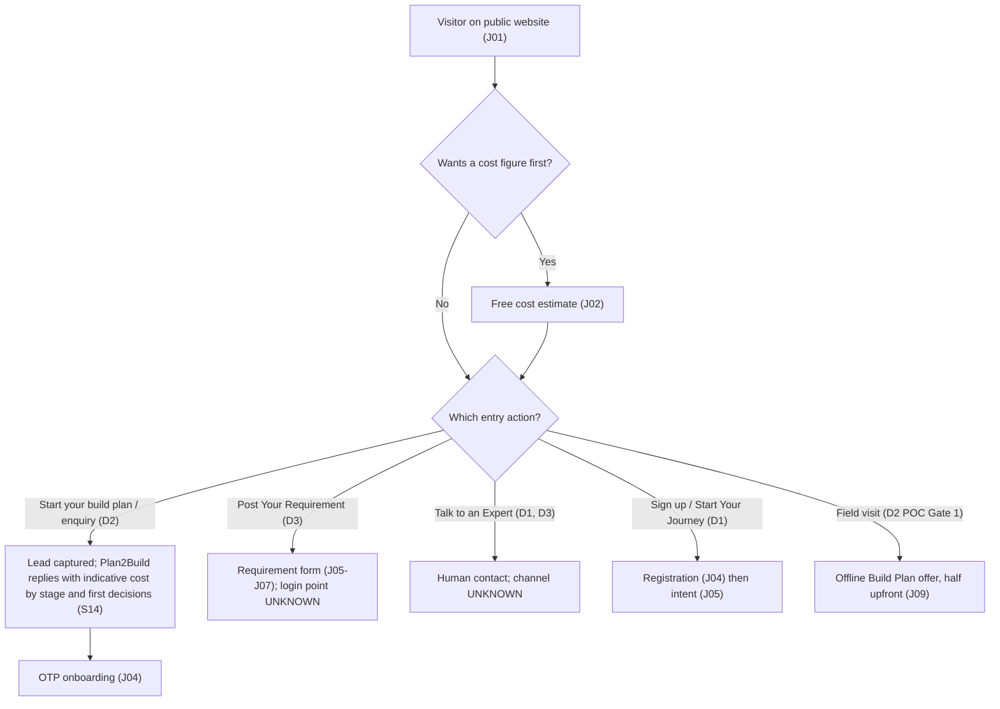
```mermaid
flowchart TD
    V["Visitor on public website (J01)"] --> Q1{"Wants a cost figure first?"}
    Q1 -- Yes --> C["Free cost estimate (J02)"]
    Q1 -- No --> Q2{"Which entry action?"}
    C --> Q2
    Q2 -- "Start your build plan / enquiry (D2)" --> E1["Lead captured; Plan2Build replies with indicative cost by stage and first decisions (S14)"]
    E1 --> OTP["OTP onboarding (J04)"]
    Q2 -- "Post Your Requirement (D3)" --> PR["Requirement form (J05-J07); login point UNKNOWN"]
    Q2 -- "Talk to an Expert (D1, D3)" --> TE["Human contact; channel UNKNOWN"]
    Q2 -- "Sign up / Start Your Journey (D1)" --> SU["Registration (J04) then intent (J05)"]
    Q2 -- "Field visit (D2 POC Gate 1)" --> FV["Offline Build Plan offer, half upfront (J09)"]
```

### DT-02: Project-type routing

> **Client decision (2026-10-03), CD-03.** At the MVP only "Build a new home" proceeds; every other type shows a "coming soon" page (phase 2).

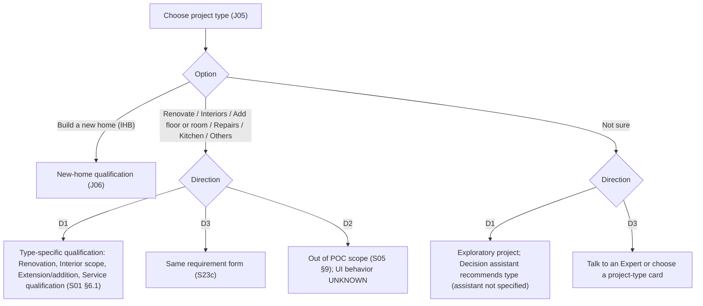
```mermaid
flowchart TD
    T["Choose project type (J05)"] --> B{"Option"}
    B -- "Build a new home (IHB)" --> Q["New-home qualification (J06)"]
    B -- "Renovate / Interiors / Add floor or room / Repairs / Kitchen / Others" --> R{"Direction"}
    R -- D1 --> R1["Type-specific qualification: Renovation, Interior scope, Extension/addition, Service qualification (S01 §6.1)"]
    R -- D3 --> R2["Same requirement form (S23c)"]
    R -- D2 --> R3["Out of POC scope (S05 §9); UI behavior UNKNOWN"]
    B -- "Not sure" --> N{"Direction"}
    N -- D1 --> N1["Exploratory project; Decision assistant recommends type (assistant not specified)"]
    N -- D3 --> N2["Talk to an Expert or choose a project-type card"]
```

### DT-03: IHB eligibility

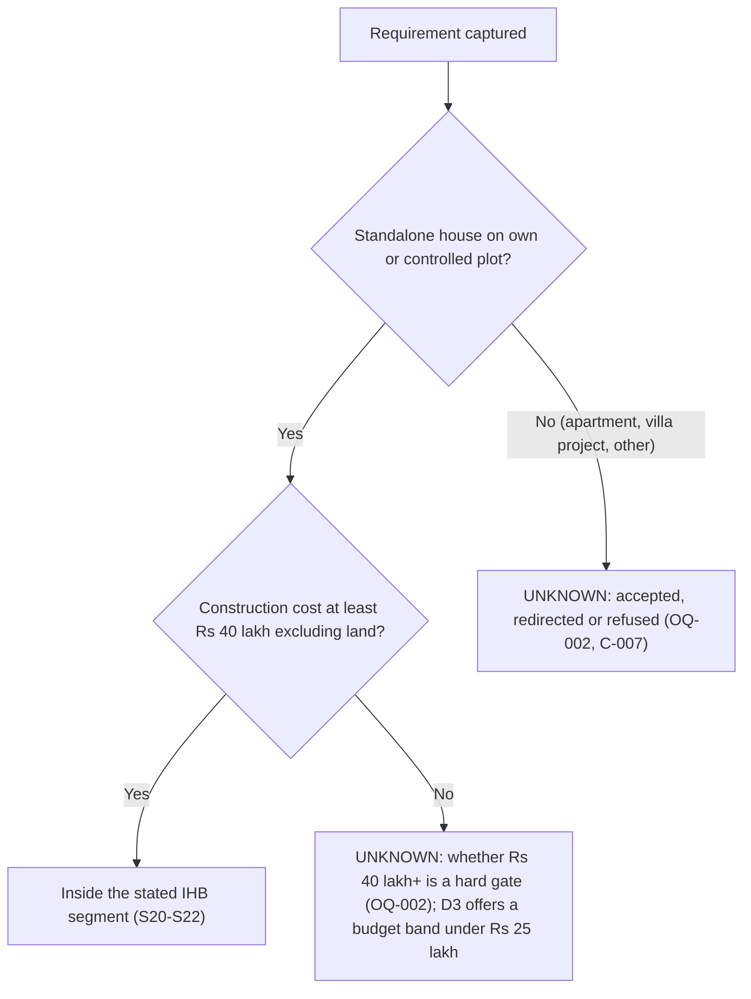
```mermaid
flowchart TD
    S["Requirement captured"] --> P{"Standalone house on own or controlled plot?"}
    P -- Yes --> C{"Construction cost at least Rs 40 lakh excluding land?"}
    P -- "No (apartment, villa project, other)" --> U1["UNKNOWN: accepted, redirected or refused (OQ-002, C-007)"]
    C -- Yes --> IHB["Inside the stated IHB segment (S20-S22)"]
    C -- No --> U2["UNKNOWN: whether Rs 40 lakh+ is a hard gate (OQ-002); D3 offers a budget band under Rs 25 lakh"]
```

### DT-04: Requirement submission and publication

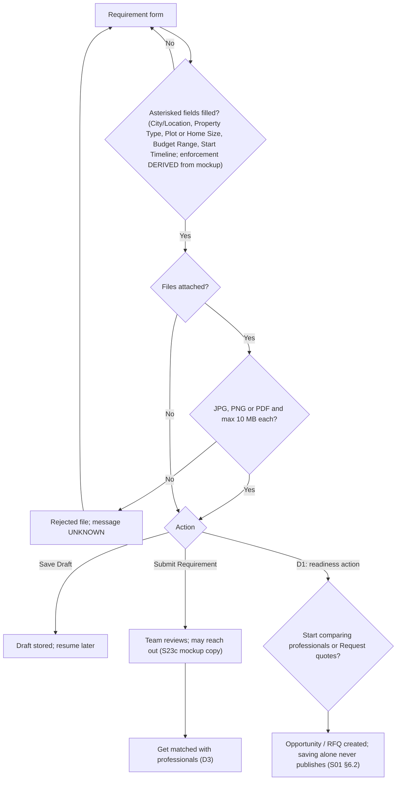
```mermaid
flowchart TD
    F["Requirement form"] --> V{"Asterisked fields filled? (City/Location, Property Type, Plot or Home Size, Budget Range, Start Timeline; enforcement DERIVED from mockup)"}
    V -- No --> F
    V -- Yes --> U{"Files attached?"}
    U -- Yes --> FT{"JPG, PNG or PDF and max 10 MB each?"}
    FT -- No --> FE["Rejected file; message UNKNOWN"]
    FE --> F
    FT -- Yes --> A{"Action"}
    U -- No --> A
    A -- "Save Draft" --> D["Draft stored; resume later"]
    A -- "Submit Requirement" --> R["Team reviews; may reach out (S23c mockup copy)"]
    R --> M["Get matched with professionals (D3)"]
    A -- "D1: readiness action" --> RA{"Start comparing professionals or Request quotes?"}
    RA --> PUB["Opportunity / RFQ created; saving alone never publishes (S01 §6.2)"]
```

### DT-05: Service path (ordering conflict C-041)

> **Client decisions (2026-10-03), CD-04, CD-05, CD-22.** Both branches stay at the MVP inside one package: with a quote, Plan2Build reviews it against the workspace and comments; without one, the plan-first path (Build Plan, standard RFQ, comparison). The D3 match-first branches are future intent. The revised tree is in section 33.3.

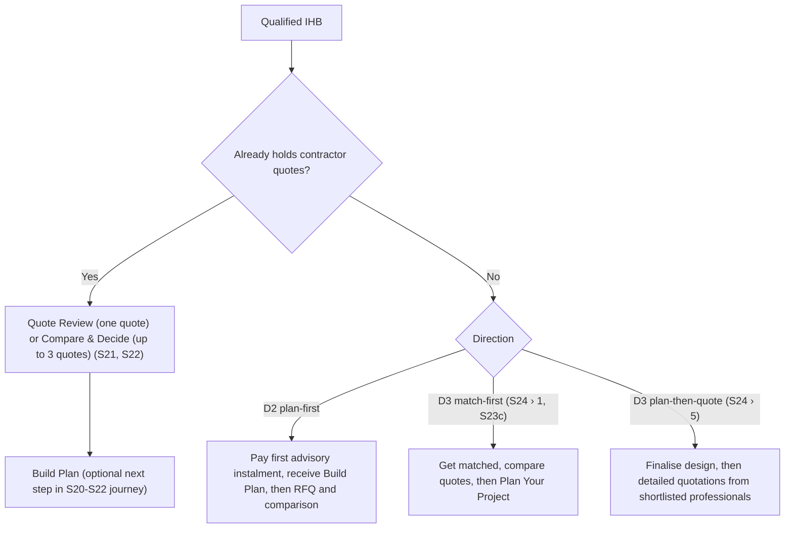
```mermaid
flowchart TD
    S["Qualified IHB"] --> H{"Already holds contractor quotes?"}
    H -- Yes --> QR["Quote Review (one quote) or Compare & Decide (up to 3 quotes) (S21, S22)"]
    QR --> BP["Build Plan (optional next step in S20-S22 journey)"]
    H -- No --> D{"Direction"}
    D -- "D2 plan-first" --> P1["Pay first advisory instalment, receive Build Plan, then RFQ and comparison"]
    D -- "D3 match-first (S24 › 1, S23c)" --> M1["Get matched, compare quotes, then Plan Your Project"]
    D -- "D3 plan-then-quote (S24 › 5)" --> M2["Finalise design, then detailed quotations from shortlisted professionals"]
```

### DT-06: Paying a Plan2Build fee

> **Client decision (2026-10-03), CD-05.** The fee is for one package, paid at once or in instalments per milestone. Whether it is collected through checkout, a payment link or offline is CQ-03.

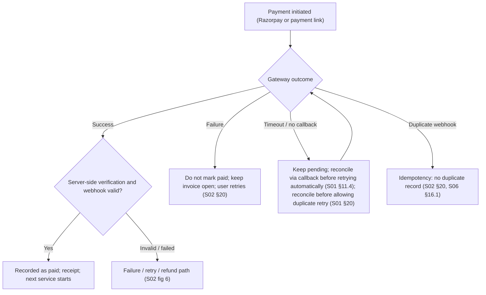
```mermaid
flowchart TD
    I["Payment initiated (Razorpay or payment link)"] --> G{"Gateway outcome"}
    G -- Success --> W{"Server-side verification and webhook valid?"}
    W -- Yes --> PAID["Recorded as paid; receipt; next service starts"]
    W -- "Invalid / failed" --> FAIL["Failure / retry / refund path (S02 fig 6)"]
    G -- Failure --> FAIL2["Do not mark paid; keep invoice open; user retries (S02 §20)"]
    G -- "Timeout / no callback" --> PEND["Keep pending; reconcile via callback before retrying automatically (S01 §11.4); reconcile before allowing duplicate retry (S01 §20)"]
    PEND --> G
    G -- "Duplicate webhook" --> IDEM["Idempotency: no duplicate record (S02 §20, S06 §16.1)"]
```
Applicability of D1 payment rules to D2 fee collection is `DERIVED`; refunds for Plan2Build fees are `UNKNOWN` (OQ-017).

### DT-07: Specification line decision

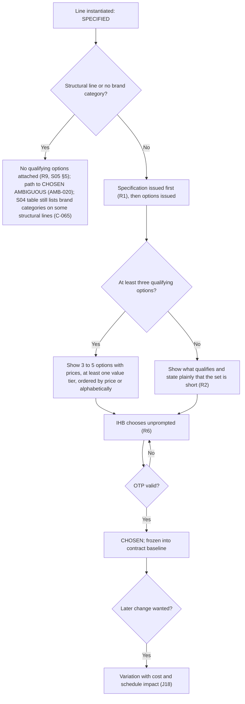
```mermaid
flowchart TD
    L["Line instantiated: SPECIFIED"] --> S{"Structural line or no brand category?"}
    S -- Yes --> X["No qualifying options attached (R9, S05 §5); path to CHOSEN AMBIGUOUS (AMB-020); S04 table still lists brand categories on some structural lines (C-065)"]
    S -- No --> O["Specification issued first (R1), then options issued"]
    O --> N{"At least three qualifying options?"}
    N -- Yes --> SH["Show 3 to 5 options with prices, at least one value tier, ordered by price or alphabetically"]
    N -- No --> SS["Show what qualifies and state plainly that the set is short (R2)"]
    SH --> CH["IHB chooses unprompted (R6)"]
    SS --> CH
    CH --> OTP{"OTP valid?"}
    OTP -- No --> CH
    OTP -- Yes --> C["CHOSEN; frozen into contract baseline"]
    C --> LATER{"Later change wanted?"}
    LATER -- Yes --> VAR["Variation with cost and schedule impact (J18)"]
```

### DT-08: Contractor sourcing

> **Client decisions (2026-10-03), CD-07, CD-15, CD-16, CD-22, CD-26, CD-27.** For the POC: the family's own contractor (invited by link and OTP, with onboarding help; basic verification and project-only access, without Club membership), or a Champions Club contractor, introduced by Plan2Build or found in the contractor listing, where a Request Quote goes as a lead to at most three contractors the homeowner picks whose enlistment class covers the project. The "Must a nominated contractor be verified?" branch is answered by basic verification (proposed; a failed check is CQ-23). D1 matching is future intent.

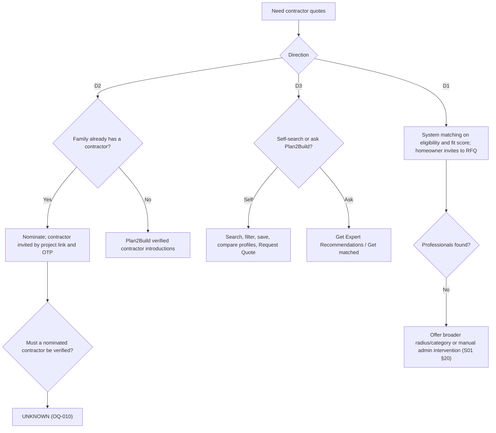
```mermaid
flowchart TD
    S["Need contractor quotes"] --> D{"Direction"}
    D -- D2 --> O{"Family already has a contractor?"}
    O -- Yes --> N["Nominate; contractor invited by project link and OTP"]
    O -- No --> I["Plan2Build verified contractor introductions"]
    N --> V{"Must a nominated contractor be verified?"}
    V --> U["UNKNOWN (OQ-010)"]
    D -- D3 --> M{"Self-search or ask Plan2Build?"}
    M -- Self --> SR["Search, filter, save, compare profiles, Request Quote"]
    M -- "Ask" --> GR["Get Expert Recommendations / Get matched"]
    D -- D1 --> MA["System matching on eligibility and fit score; homeowner invites to RFQ"]
    MA --> NF{"Professionals found?"}
    NF -- No --> BR["Offer broader radius/category or manual admin intervention (S01 §20)"]
```

### DT-09: Quote capture and validation (D2)

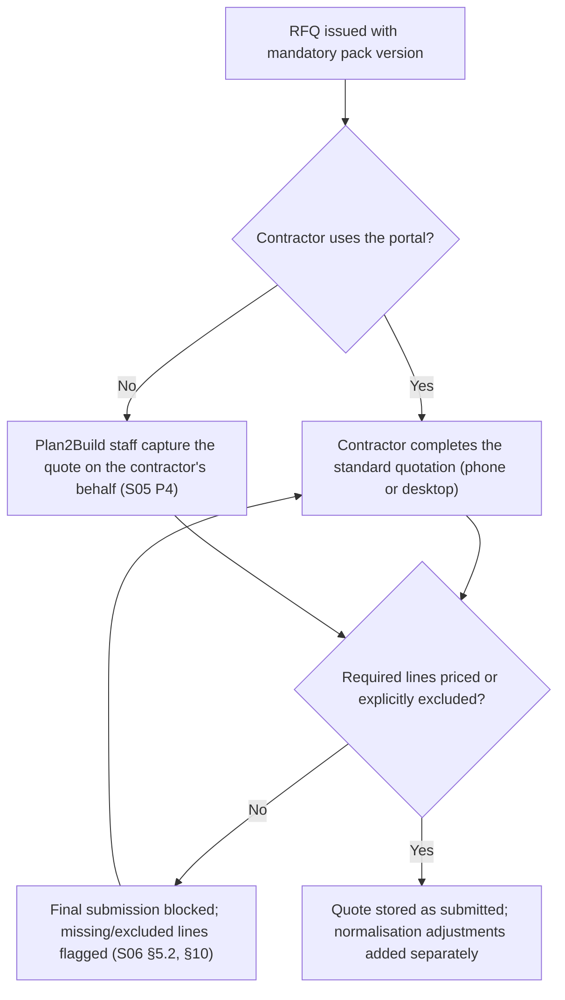
```mermaid
flowchart TD
    R["RFQ issued with mandatory pack version"] --> P{"Contractor uses the portal?"}
    P -- Yes --> Q["Contractor completes the standard quotation (phone or desktop)"]
    P -- No --> ST["Plan2Build staff capture the quote on the contractor's behalf (S05 P4)"]
    Q --> V{"Required lines priced or explicitly excluded?"}
    ST --> V
    V -- No --> BL["Final submission blocked; missing/excluded lines flagged (S06 §5.2, §10)"]
    BL --> Q
    V -- Yes --> OK["Quote stored as submitted; normalisation adjustments added separately"]
```

### DT-10: Variation (D2 with D1 alternatives)

> **Client decision (2026-10-03), CD-08.** The "Declines" branch is removed. Plan2Build qualifies and quantifies the change before acknowledgement; without agreement, Plan2Build leads a discussion step followed by closure. The revised tree is in section 33.3.

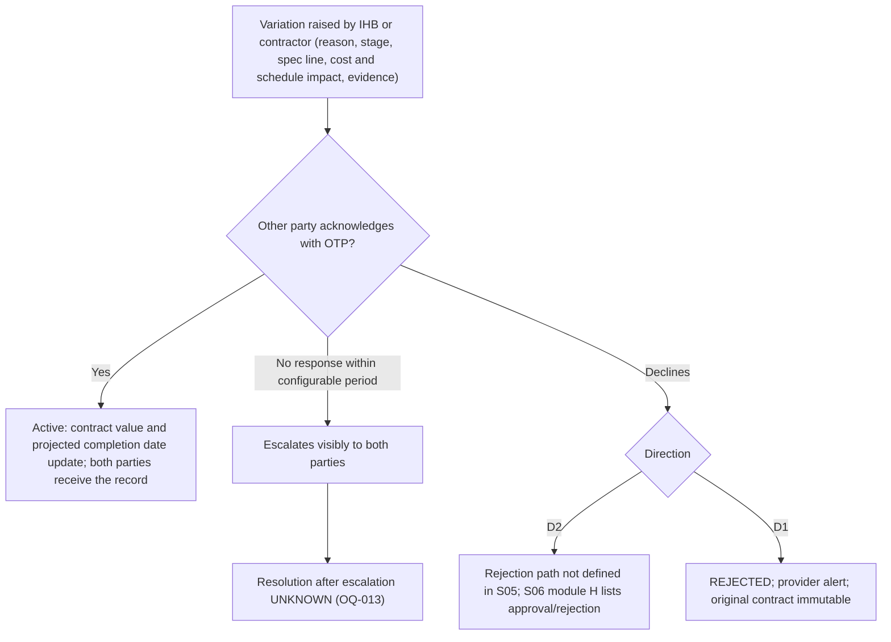
```mermaid
flowchart TD
    R["Variation raised by IHB or contractor (reason, stage, spec line, cost and schedule impact, evidence)"] --> A{"Other party acknowledges with OTP?"}
    A -- Yes --> ACT["Active: contract value and projected completion date update; both parties receive the record"]
    A -- "No response within configurable period" --> ESC["Escalates visibly to both parties"]
    ESC --> U["Resolution after escalation UNKNOWN (OQ-013)"]
    A -- "Declines" --> RJ{"Direction"}
    RJ -- D2 --> U2["Rejection path not defined in S05; S06 module H lists approval/rejection"]
    RJ -- D1 --> REJ["REJECTED; provider alert; original contract immutable"]
```

### DT-11: When a construction payment becomes due (D2, recording only)

> **Client decisions (2026-10-03), CD-05, CD-09.** Every package holder has stage inspections, so the "Assurance not purchased" branch does not arise for them. A due milestone carries no amount; it is marked paid and received, yes or no. The revised tree is in section 33.3.

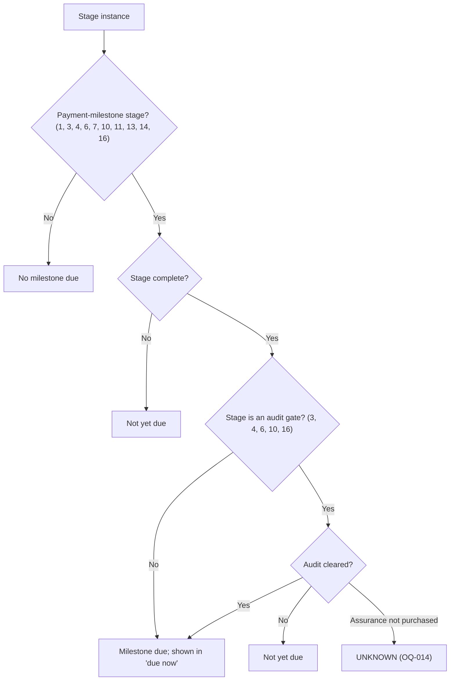
```mermaid
flowchart TD
    S["Stage instance"] --> PM{"Payment-milestone stage? (1, 3, 4, 6, 7, 10, 11, 13, 14, 16)"}
    PM -- No --> NO["No milestone due"]
    PM -- Yes --> C{"Stage complete?"}
    C -- No --> W["Not yet due"]
    C -- Yes --> G{"Stage is an audit gate? (3, 4, 6, 10, 16)"}
    G -- No --> DUE["Milestone due; shown in 'due now'"]
    G -- Yes --> AC{"Audit cleared?"}
    AC -- Yes --> DUE
    AC -- No --> W2["Not yet due"]
    AC -- "Assurance not purchased" --> U["UNKNOWN (OQ-014)"]
```

### DT-12: Gate inspection outcome

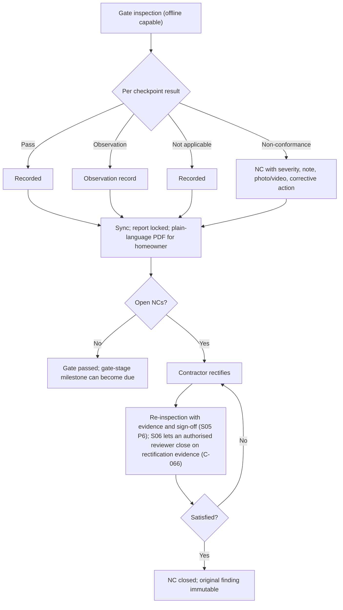
```mermaid
flowchart TD
    G["Gate inspection (offline capable)"] --> I{"Per checkpoint result"}
    I -- Pass --> P["Recorded"]
    I -- Observation --> O["Observation record"]
    I -- "Not applicable" --> NA["Recorded"]
    I -- "Non-conformance" --> NC["NC with severity, note, photo/video, corrective action"]
    P --> L["Sync; report locked; plain-language PDF for homeowner"]
    O --> L
    NA --> L
    NC --> L
    L --> RC{"Open NCs?"}
    RC -- No --> PASS["Gate passed; gate-stage milestone can become due"]
    RC -- Yes --> RECT["Contractor rectifies"]
    RECT --> RE["Re-inspection with evidence and sign-off (S05 P6); S06 lets an authorised reviewer close on rectification evidence (C-066)"]
    RE --> CL{"Satisfied?"}
    CL -- Yes --> CLOSED["NC closed; original finding immutable"]
    CL -- No --> RECT
```

### DT-13: Authentication failures

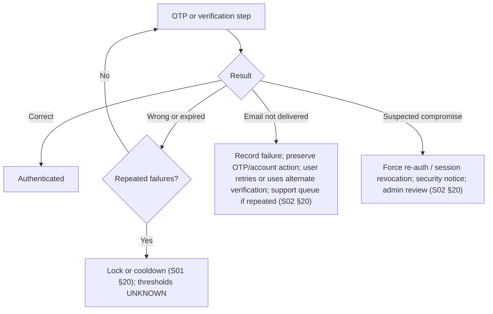
```mermaid
flowchart TD
    O["OTP or verification step"] --> R{"Result"}
    R -- Correct --> OK["Authenticated"]
    R -- "Wrong or expired" --> RT{"Repeated failures?"}
    RT -- No --> O
    RT -- Yes --> LK["Lock or cooldown (S01 §20); thresholds UNKNOWN"]
    R -- "Email not delivered" --> ED["Record failure; preserve OTP/account action; user retries or uses alternate verification; support queue if repeated (S02 §20)"]
    R -- "Suspected compromise" --> SC["Force re-auth / session revocation; security notice; admin review (S02 §20)"]
```

### DT-14: After handover

> **Client decision (2026-10-03), CD-12.** At the MVP the post-handover branch is the back office helping homeowners; renovation, resale and insurance support is "coming soon", offered as a promise with opt-in. Neither the D2 postponement nor the D1 Improve loop applies as written.

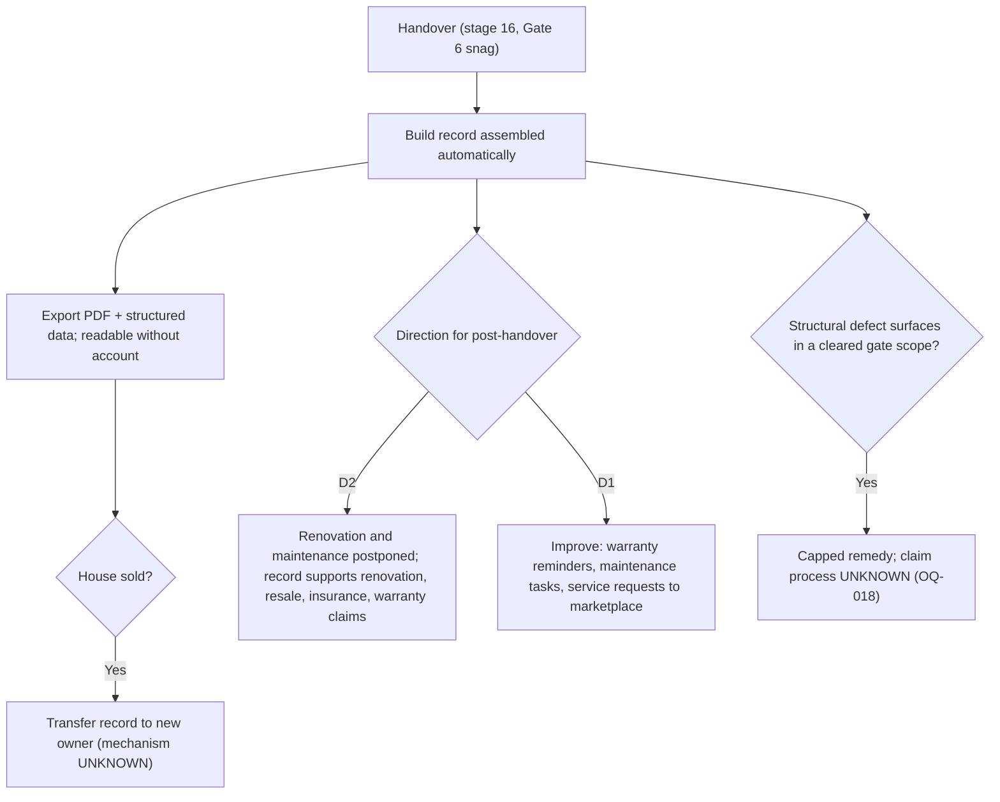
```mermaid
flowchart TD
    H["Handover (stage 16, Gate 6 snag)"] --> BR["Build record assembled automatically"]
    BR --> E["Export PDF + structured data; readable without account"]
    E --> T{"House sold?"}
    T -- Yes --> TR["Transfer record to new owner (mechanism UNKNOWN)"]
    BR --> D{"Direction for post-handover"}
    D -- D2 --> PO["Renovation and maintenance postponed; record supports renovation, resale, insurance, warranty claims"]
    D -- D1 --> IM["Improve: warranty reminders, maintenance tasks, service requests to marketplace"]
    BR --> DEF{"Structural defect surfaces in a cleared gate scope?"}
    DEF -- Yes --> REM["Capped remedy; claim process UNKNOWN (OQ-018)"]
```

---

## 10. State machines

Each machine lists its states exactly as named in the sources. Where sources disagree, every version is shown and the conflict is referenced. "Invalid transitions" are listed only where a source states them; elsewhere they are marked unknown.

General rules that apply to every machine (all `EXPLICIT`):
- "Only configured actors may move the object between states, and every sensitive transition is recorded as an audit event." (S02 §19, repeated for every machine).
- "Every major state has a database state and API transition." (S01 §23.2).
- "Use stable machine-readable status names in the backend; display friendly labels in the UI." (S01 App B).
- "Every project can be reconstructed chronologically from audit/event records." (S01 §23.2). "Audit trail on every state transition." (S05 §7 Security).
- "Every notification event is generated from an explicit system event, not from UI-only behavior." (S01 §23.2).
- Decision state "cannot jump across invalid transitions without authorised override + reason" (S06 §16.1).
- Every manual override "creates an audit event with actor, old value, new value and reason" (S01 §17.1).

### SM-01: IHB user account `[D1]`

| State | Meaning | Caused by | Trigger | Next states | Side effects |
|---|---|---|---|---|---|
| PENDING_EMAIL | "Account created, email not verified" | User | Register (T01) | ACTIVE | Verification email |
| ACTIVE | "Normal user account" | User / System | Verify email (T02); password reset returns to ACTIVE (T49) | SUSPENDED ("No action / can become SUSPENDED"); a direct ACTIVE to CLOSED transition is not stated | Welcome / next step |
| SUSPENDED | "Access restricted due to policy or operational action" | Admin | Policy or operational action | ACTIVE ("Admin restores"), CLOSED | Blocks sensitive actions; historical records preserved (S01 §21) |
| CLOSED | "Account no longer operational" | Admin (D1); IHB-initiated closure `UNKNOWN` | Closure | None stated | "Historical records retained according to retention policy" |

Sources: S01 §4.4, App B ("PENDING_EMAIL → ACTIVE → SUSPENDED → CLOSED"), §19. D2 has an "auth status" field (S06 §7) with no values (OQ-029). S01 §4.4 also lists PENDING_REVIEW, RESUBMISSION_REQUIRED and VERIFIED, which apply to professionals, not to the IHB.

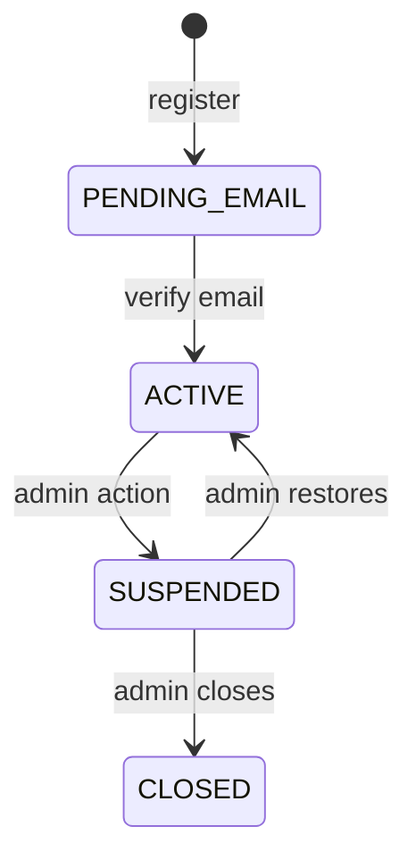
```mermaid
stateDiagram-v2
    [*] --> PENDING_EMAIL: register
    PENDING_EMAIL --> ACTIVE: verify email
    ACTIVE --> SUSPENDED: admin action
    SUSPENDED --> ACTIVE: admin restores
    SUSPENDED --> CLOSED: admin closes
```

### SM-02: Lead and enquiry `[D2]`

States are not named in any source. Known stages of the funnel: anonymous visit and calculator session (S05 §5 `lead / calculator_session`) → lead captured (S05 P1 "captured lead record") → registration (S05 P1 AC "first visit through to project registration") → paid engagement (S05 O1 "through registration to paid engagement"). Operations track an "enquiry status" (S07 §7) whose values are `UNKNOWN — REQUIRES CONFIRMATION`.

### SM-03: Requirement `[D3]` (`DERIVED` from UI labels; not formal states)

| Derived state | Evidence |
|---|---|
| Draft | "Save Draft" button (S23c) |
| Submitted | "Submit Requirement →" (S23c); "Review & Submit" step (S23c, S24 › 3) |
| Under team review | "Our team reviews your requirement and may reach out for more details." (S23c) |
| Matched | "Get Matched with Professionals" (S23c) |
| Comparing quotes | "Compare Quotes" (S23c) |
| Planning | "Plan Your Project" (S23c) |

Formal status names, transitions back to Draft, expiry and cancellation: `UNKNOWN — REQUIRES CONFIRMATION` (OQ-040, OQ-041).

### SM-04: Project (CONFLICT C-018)

Version A, S01 §12.1:
`DRAFT → PLANNING → RFQ_OPEN → PROVIDER_SELECTED → AGREEMENT_PENDING → ACTIVE → ON_HOLD / AT_RISK / COMPLETED → HANDOVER_PENDING → COMPLETED → WARRANTY_ACTIVE → MAINTENANCE` (COMPLETED appears twice as written).

Version B, S01 Appendix B:
`DRAFT → QUALIFIED → PLANNING → RFQ_OPEN → PROVIDER_SELECTED → AGREEMENT_PENDING → ACTIVE → ON_HOLD → AT_RISK → HANDOVER_PENDING → COMPLETED`

Version C, S02 §19:
`Draft / Onboarding → Qualified → Planning → Plan Confirmed → Open for Discovery → RFQ Open → Selecting → Active → On Hold → Completed → Handed Over → Archived`

Additional states used in S01 transactions: QUALIFIED (T04), ACTIVE (T22), HANDOVER_PENDING (T36), COMPLETED (T37); S01 §10.1 READY_TO_START (in no list). PLAN_DRAFT (T05) and PLAN_FINAL (T06) are result states of the plan transactions, not project states.

D2: project has a "status" field (S05 §5 project; S06 §7) with no values (OQ-029). D3: "Project Stage: Planning & Design: 2 of 5 completed" over five phases (S23e).

Differences: B and C add QUALIFIED; C adds Plan Confirmed, Open for Discovery, Selecting, Handed Over and Archived and lacks PROVIDER_SELECTED, AGREEMENT_PENDING, AT_RISK and HANDOVER_PENDING; A and B place HANDOVER_PENDING before COMPLETED while C places Completed before Handed Over; A adds WARRANTY_ACTIVE and MAINTENANCE.

Transition rules stated: "Never move a project to ACTIVE solely because a provider was selected. Project activation should require the configured prerequisites so that payments, milestones, documents and parties remain synchronized." (S01 §10.2). Activation is T22 "System | Activate project | Project | ACTIVE | Project-start notification" (S01 §19); the prerequisites in S01 §10.2 include "Payment schedule created", not a payment made. The S01 transaction numbers form a catalogue, not a sequence. In S10 the project record is created when the homeowner hires ("Homeowner hires | Create project and milestones | Provider starts delivery workflow", S10 §4). "Milestone missed: Mark at-risk" (S01 §20). "Projects: lock/unlock only by policy" for admins (S02 §15).

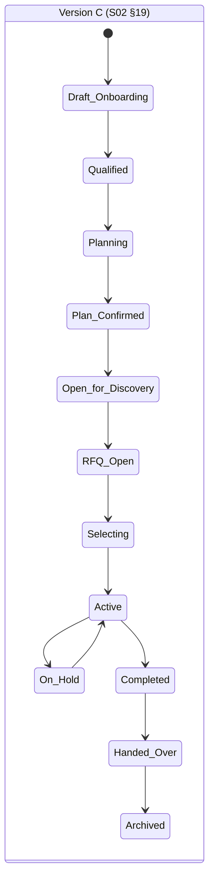
```mermaid
stateDiagram-v2
    state "Version C (S02 §19)" as C {
        [*] --> Draft_Onboarding
        Draft_Onboarding --> Qualified
        Qualified --> Planning
        Planning --> Plan_Confirmed
        Plan_Confirmed --> Open_for_Discovery
        Open_for_Discovery --> RFQ_Open
        RFQ_Open --> Selecting
        Selecting --> Active
        Active --> On_Hold
        On_Hold --> Active
        Active --> Completed
        Completed --> Handed_Over
        Handed_Over --> Archived
    }
```

### SM-05: Project stage instance `[D2]`

Fields: planned and actual dates, progress, floor; N instances for stages 5, 6 and 9 (one per floor) (S05 §5, rule 3, F1). Flags from stage_master: is_audit_gate, is_payment_milestone, repeats_per_floor, sequence, typical duration band, cost share percentage (S05 §5). Status values: `UNKNOWN — REQUIRES CONFIRMATION`. Known transitions with consequences: stage completion makes the stage's payment milestone due, and for gate stages audit clearance is also required (S05 P7). Stage dates moving updates the decisions calendar (S05 P2). "stages behind benchmark" appear in the exception feed (S05 O1).

### SM-06: Specification line (six-state decision ledger) `[D2]`

| State | Meaning | Caused by | Trigger and preconditions | Side effects and data | IHB visibility |
|---|---|---|---|---|---|
| SPECIFIED | Performance criteria written for this project | System | Project instantiated (S05 F1: "every specification line instantiated in the Specified state"); issued text stored on the project instance (S04 §10) | spec_line_event appended | Visible (whether lines of a package not yet bought are visible is not stated, AMB-068) |
| OPTIONS_ISSUED | Qualifying choices presented | Advisor / Plan2Build (`DERIVED`) | Specification issued first (R1); brand-relevant, non-structural line; 3 to 5 options, one value tier (R2, R3) | qualifying_option records | Visible |
| CHOSEN | Homeowner decision | IHB | OTP acknowledgement (S04 §8) | "Acknowledgement freezes the line into the contract baseline; any later change becomes a variation" (S04 §8); domain event DecisionChosen (S06 §8.1) | Visible |
| PURCHASED | "Actual product/value" | `UNKNOWN — REQUIRES CONFIRMATION` | Purchase evidence; delivery challan check where specified | Switch event if purchased product differs from chosen (S06 §10) | Contested (C-029) |
| INSTALLED | "Site application" | `UNKNOWN — REQUIRES CONFIRMATION` | Installation recorded (installation date in build record, S04 §9) | Installer recorded | Contested |
| VERIFIED | "Inspection evidence" | Auditor (gate), site log or test (S04 "Verified at") | Verification at the stated method; blank where nothing is verifiable | Verification result in build record | Contested |

Invalid transitions: "Decision state cannot jump across invalid transitions without authorised override + reason." (S06 §16.1). Structural lines can never carry qualifying options or commercial fields (S05 F1 AC; R9). Event history: spec_line_event "Append-only history of state transitions with actor, timestamp and evidence reference" (S05 §5); DecisionEvent "state_from/to, actor, time, evidence, reason, source channel" (S06 §7). "Do not store this only as one mutable status field. Keep the current state for speed, but also store an append-only DecisionEvent row for every transition." (S06 §7.1).

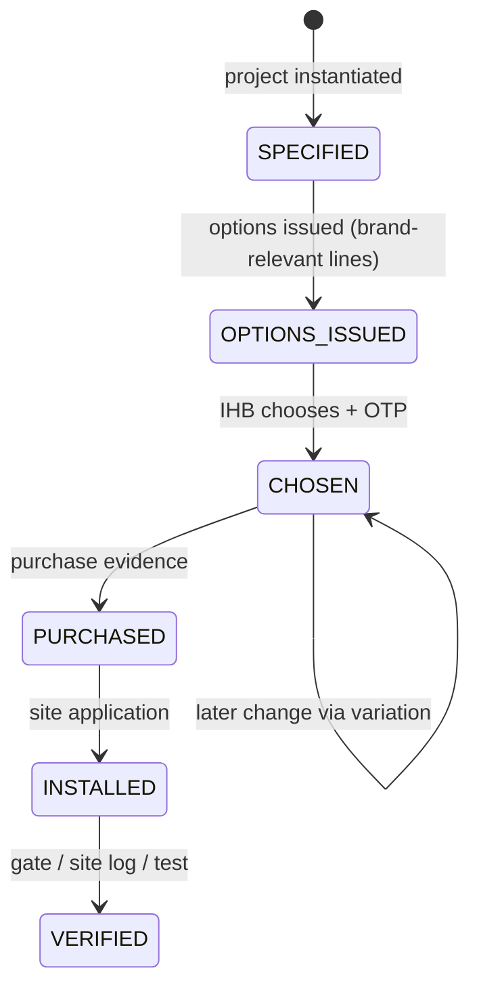
```mermaid
stateDiagram-v2
    [*] --> SPECIFIED: project instantiated
    SPECIFIED --> OPTIONS_ISSUED: options issued (brand-relevant lines)
    OPTIONS_ISSUED --> CHOSEN: IHB chooses + OTP
    CHOSEN --> PURCHASED: purchase evidence
    PURCHASED --> INSTALLED: site application
    INSTALLED --> VERIFIED: gate / site log / test
    CHOSEN --> CHOSEN: later change via variation
```

### SM-07: Build Plan and other issued documents

D2 (S05, S06, S07): advisor first draft → edits recorded → issued (version frozen, PDF and share link) → later change creates a new version; "Build Plan version cannot change after issue without creating a new version" (S06 §16.1). Document entity carries "render status" (S05 §5), values `UNKNOWN — REQUIRES CONFIRMATION`.

D1 document lifecycle: `Uploaded → Processing → Available → Superseded → Archived` (S02 §19). "If a document supersedes an earlier document, the new record becomes the current version while the history remains accessible to authorized users." (S02 §12.1). Plan source markers AI_DRAFT, USER_EDITED, PROFESSIONAL_VERIFIED; PROJECT_PLAN source AI_DRAFT, USER_FINAL, PRO_VERIFIED (S01 §7.3). AI_OUTPUT has a status field (S01 §7.3).

### SM-08: Contract baseline `[D2]`

Unlocked → Locked. Locking trigger: "Issuing Package A locks the contract baseline: cost, schedule and specification." (S05 P3 AC). Locked items do not change, but the baseline grows: each later line "freezes ... into the contract baseline" when acknowledged at CHOSEN (S04 §8), months after Package A was issued. "Every variance is measured against this." (S05 §5); "Active variation: Baseline preserved" (S07 §12). Timing conflict with the definition-of-done ordering: AMB-040.

### SM-09: Opportunity `[D1]`

S01 §8.2:

| State | Meaning | Who moves it |
|---|---|---|
| DRAFT | Project need not yet published | Homeowner |
| MATCHING | System is finding eligible providers | System |
| PUBLISHED | Opportunity visible to eligible providers | System / Admin |
| VIEWED | Provider opened details | System |
| INTERESTED | Provider signals interest | Professional |
| RFQ_INVITED | Provider is invited to quote | Homeowner/System |
| QUOTE_SUBMITTED | Provider submitted quote | Professional |
| SELECTED | Provider selected | Homeowner |
| DECLINED | Provider or homeowner declined | Relevant actor |
| EXPIRED | Opportunity closed by date/rule | System/Admin |

S02 §7 gives opportunity state examples "Open, paused, closed".

### SM-10: RFQ

D1 (S02 §7): Draft, Open, Closed, Cancelled. Opening requires "Deadline/eligibility" (TX-011). D1 RFQ is versioned; "material changes create a revised RFQ version" (S01 §9.1). D2: RFQ has "pack version, issue date, invited contractors, status" (S06 §7); status values `UNKNOWN — REQUIRES CONFIRMATION`.

### SM-11: Quote (CONFLICT C-020)

> **Client decision (2026-10-03), CD-17.** Every quote is valid between a start date and an end date, and a revision becomes a new version. Plan2Build keeps every version; the homeowner sees only the latest.

S01 App B: `DRAFT → SUBMITTED → SHORTLISTED → SELECTED → REJECTED → WITHDRAWN → EXPIRED` (a dictionary of statuses, not a single path).
S02 §19: `Draft → Submitted → Revision Requested → Resubmitted → Shortlisted → Accepted → Rejected → Withdrawn → Expired`.
S02 §7 object table: Draft, Submitted, Revised, Withdrawn, Rejected, Shortlisted, Accepted, Expired.
S01 §10.1: "quote state becomes ACCEPTED or SELECTED pending agreement/payment setup".
Rules: "Quote is immutable by version once submitted; revisions create new versions." (S02 §18.1); shortlisting requires "RFQ still open" (TX-014); submission requires "Verified provider + open RFQ" (TX-012); revision keeps "Previous version preserved" (TX-013). D2 rule: final submission blocked while required lines are neither priced nor explicitly excluded (S06 §10).

### SM-12: Comparison `[D1]`

Draft, Saved, Finalized (S02 §7). ComparisonSnapshot is a "Frozen comparison view used for decision" (S01 §18). T14 "Compare quotes → Comparison snapshot → COMPARING" (S01 §19).

### SM-13: Engagement `[D1]`

`Pending Activation → Active → Paused → Completed → Cancelled → Disputed` (S02 §19); object table "Pending, Active, Paused, Completed, Cancelled, Disputed" (S02 §7). D2 equivalent: none (the contract is outside the platform).

### SM-14: Payment (D1; applicability to D2 fee collection is OQ-016) (CONFLICT C-019)

S01 §11.2:

| State | Meaning | Next states |
|---|---|---|
| CREATED | Payment requirement generated | INITIATED / CANCELLED |
| INITIATED | Payment intent created | PENDING / FAILED / CANCELLED |
| PENDING | Awaiting gateway confirmation | SUCCESS / FAILED / EXPIRED |
| SUCCESS | Gateway confirms payment | ALLOCATED / SETTLEMENT_PENDING |
| FAILED | Gateway rejects or technical failure | RETRY / CANCELLED |
| ALLOCATED | Funds assigned to configured project/fee buckets | SETTLEMENT_PENDING |
| SETTLEMENT_PENDING | Provider payout requested / queued | SETTLED / FAILED |
| SETTLED | Provider settlement confirmed | FINAL |
| REFUND_PENDING | Refund requested | REFUNDED / REFUND_FAILED |
| REFUNDED | Amount reversed | FINAL |

S02 §9 (with user-visible results):

| State | Meaning | System action | User-visible result |
|---|---|---|---|
| Initiated | Payment transaction created | Store gateway order/reference | Show payment in progress |
| Pending | Checkout not yet confirmed | Wait for gateway result; allow retry rules | Payment pending |
| Paid / Captured | Verified successful payment | Create immutable payment record; link to invoice/milestone | Success + receipt |
| Failed | Gateway indicates failure | Record failure reason if available; keep invoice open | Retry payment |
| Expired | Payment window expired | Close attempt; keep obligation open if business policy permits | Start a new attempt |
| Refund Requested | Refund process started | Create refund transaction | Refund under process |
| Refunded | Refund verified | Link refund to original payment | Refund completed |
| Partially Refunded | Only part returned | Store amount and reason | Updated balance |
| Disputed | Charge/payment dispute raised | Freeze relevant workflow if needed; admin queue | Under review |
| Settled | Provider settlement completed | Record settlement reference and date | Settlement visible where appropriate |

Other states named: UNKNOWN/PENDING on gateway timeout (S01 §11.4); RECONCILED (T47); NO_DUPLICATE (T48); REFUND_FAILED, RETRY (S01 §11.2 next states).

D1 construction-payment use of this machine is `SUPERSEDED` (section 29.5). Plan2Build fee collection in D2 has no defined machine.

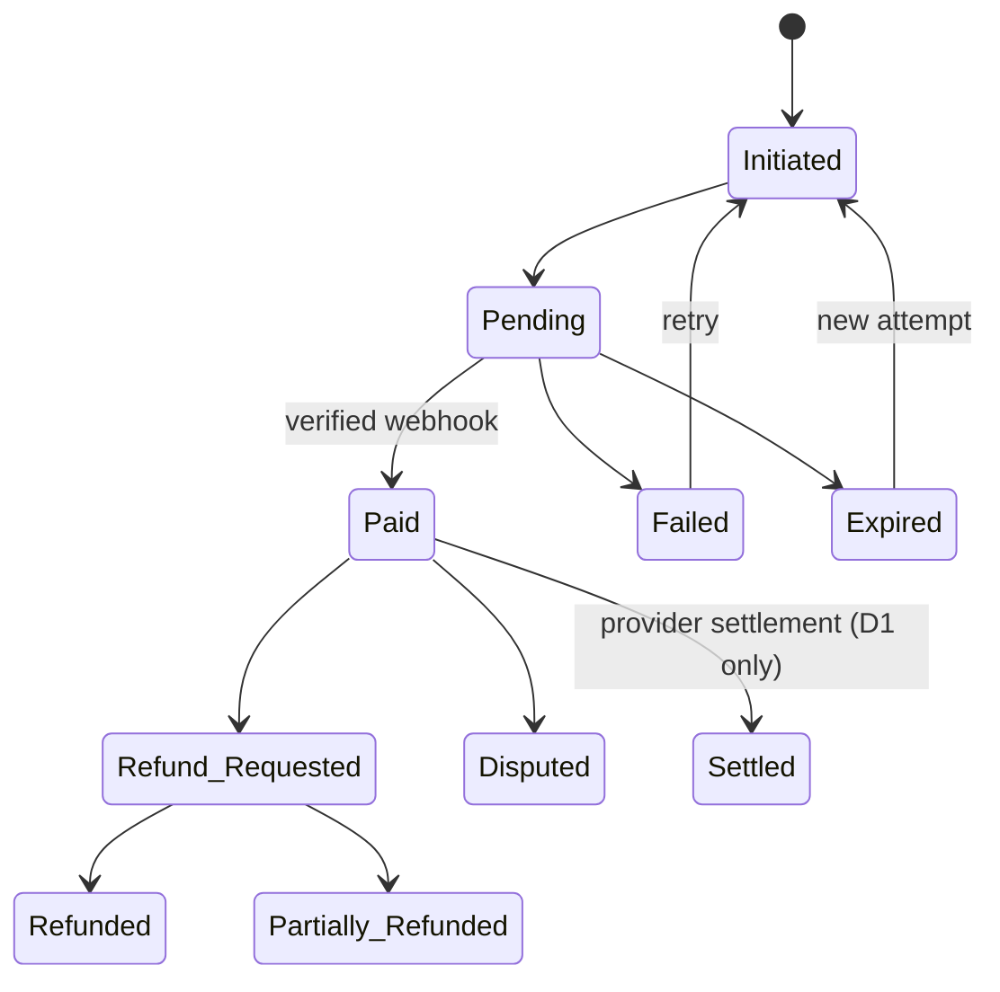
```mermaid
stateDiagram-v2
    [*] --> Initiated
    Initiated --> Pending
    Pending --> Paid: verified webhook
    Pending --> Failed
    Pending --> Expired
    Failed --> Initiated: retry
    Expired --> Initiated: new attempt
    Paid --> Refund_Requested
    Refund_Requested --> Refunded
    Refund_Requested --> Partially_Refunded
    Paid --> Disputed
    Paid --> Settled: provider settlement (D1 only)
```

### SM-15: Construction payment record `[D2]`

> **Client decision (2026-10-03), CD-09.** A payment record is two yes-or-no marks per milestone: paid (homeowner) and received (professional). No amount is recorded and recording is optional. What happens when the marks disagree is CQ-13.

Recorded by either party → acknowledged by the other (S05 §5 "payments recorded by either party with acknowledgement"). Status names, rejection of a recorded payment, and correction: `UNKNOWN — REQUIRES CONFIRMATION` (OQ-015). No money movement (S05 P7).

### SM-16: Variation / change order (CONFLICT C-017)

> **Client decision (2026-10-03), CD-08.** There is no Rejected state. A change is qualified and quantified by Plan2Build, then acknowledged; disagreement goes to a discussion step, then closure. State names stay open.

D2 (S05 P5, S07 §12; names not given): Raised → (acknowledged with OTP by the other party) → Active ("takes effect"; contract value and completion date updated) ; Raised → (configurable period passes) → Escalated (visible to both parties). Rejection: not defined in S05; S06 module H includes "approval/rejection".

D1 version A (S01 §13.2): `DRAFT → SUBMITTED → REVIEW → ACCEPTED / REJECTED → IMPLEMENTED → CLOSED`.
D1 version B (S02 §19): `Draft → Submitted → Clarification → Approved → Rejected → Cancelled`.
D1 transactions: T31 professional submits → REVIEW → homeowner alert; T32 homeowner approves → ACCEPTED → provider alert, plan update; T33 homeowner rejects → REJECTED → provider alert (S01 §19).
Rules: "No change order becomes financially active until its approval rule is satisfied." (S02 fig 8). "User does not respond: Keep pending; do not silently apply" (S01 §20).

```mermaid
stateDiagram-v2
    [*] --> Raised: IHB or contractor raises
    Raised --> Active: other party acknowledges with OTP
    Raised --> Escalated: no acknowledgement within configurable period
    Raised --> Rejected: rejection (S06 module H; D1)
    Escalated --> [*]: resolution UNKNOWN
```

### SM-17: Milestone and task (CONFLICT C-021)

S02 §19: `Upcoming → Ready → In Progress → Awaiting Review → Completed → Blocked → Cancelled`.
S01 transactions: IN_PROGRESS (T23), PENDING_APPROVAL (T24), APPROVED (T25).
S01 §12.2 example statuses: Completed / in progress / upcoming / ready.
S18 › 5 mock: Completed, In Progress, Upcoming. S19 › 6 mock: Completed, In Progress, Pending, Upcoming.
S23e tasks: Completed, In Progress, Pending.
D2: stage instances, not milestones; payment milestone "due" (S05 P7).

### SM-18: Gate inspection `[D2]`

Assigned (project + gate) → Offline pack downloaded → Readiness confirmed (checklist version) → Inspecting (pass / observation / non-conformance / not-applicable per item) → Synced and locked (report frozen; report hash) → Rectify → Re-inspect → Closed (verified record) (S06 §5.3; S07 §6 "Assigned → Offline pack → Readiness → Inspect → Evidence → Sync & lock → Rectify → Close"). After lock, corrections are amendments (S06 §10). GateInspection fields: project, gate, auditor, checklist version, start/end, result, locked report hash (S06 §7). D1 inspection states: Scheduled, Completed, Failed, Passed, Follow-up (S02 §11).

### SM-19: Non-conformance `[D2]`

Open (finding immutable) → Rectification evidence submitted → Re-inspection with evidence and sign-off → Closed (S05 P6 AC; S07 §6; S09 "a separate re-inspection before closure"). S06 §5.3 instead says "Rectification evidence is submitted and closed by authorised reviewer", and S08 says "re-inspection where required" (C-066). Fields: severity, description, owner, due date, closure evidence, status (S06 §7). Overdue or open NCs appear in the exception feed (S05 O1).

### SM-20: Issue `[D1]` (CONFLICT C-022)

> **Client decision (2026-10-03), CD-10.** The homeowner issue log at the MVP follows raised, fixed with proof, verified, closed. Final state names stay open.

S01: `OPEN → ACKNOWLEDGED → IN_PROGRESS → RESOLVED → VERIFIED → CLOSED`, branch `ESCALATED / DISPUTED`. S02: `Open → Acknowledged → In Progress → Resolved → Closed`. Homeowner verifies and closes (T30 "Homeowner verify issue → CLOSED"); "Closure actor: Homeowner/admin depending rule" (S01 §13.1).

### SM-21: Dispute `[D1]` (CONFLICT C-023)

S01: `OPEN → EVIDENCE_COLLECTION → UNDER_REVIEW → RESOLUTION_PROPOSED → ACCEPTED / ESCALATED → CLOSED`. S02: `Open, Under Review, Awaiting Response, Resolved, Closed`. Resolution by admin with actor, reason, evidence and timestamp (S01 §13.3; S02 TX-038).

### SM-22: Warranty `[D1]`

`WARRANTY_REGISTERED → ACTIVE → EXPIRING_SOON → EXPIRED`, branch `CLAIM_OPEN → RESOLVED → CLOSED` (S01 §15.2). Registration by system (T38 → ACTIVE, reminder schedule) or provider (TX-032). D2 stores warranty term, expiry and installer in the build record (S05 P8) without a lifecycle.

### SM-23: Service request (post-handover) `[D1]`

`DRAFT → PUBLISHED → QUOTING → SCHEDULED → IN_PROGRESS → PENDING_CONFIRMATION → COMPLETED → CANCELLED` (S01 App B; T40 PUBLISHED; T41 ServiceOrder SCHEDULED; T42 PENDING_CONFIRMATION). Postponed in D2 (J23).

### SM-24: Professional verification (as it affects the IHB)

"Only professionals meeting minimum verification requirements are eligible for normal marketplace discovery" (S02 §4.4); verification is per category ("A provider may be verified for one category and remain unverified for another", S02 §6.5); quoting requires a verified, eligible provider ("Submit quote: Yes - verified and eligible", S02 §3). States: `Draft → Submitted → Under Review → Changes Required → Verified → Suspended → Rejected` (S02 §19) versus `DRAFT → SUBMITTED → UNDER_REVIEW → RESUBMISSION_REQUIRED → VERIFIED → REJECTED → SUSPENDED` (S01 App B) and `NEEDS_RESUBMISSION` (S01 §5.1). A suspended provider "Cannot accept new opportunities/quotes" (S02 §5.1 table); with active projects: "Prevent new opportunities; preserve active records; Notify affected homeowner/provider" (S02 §20). "If a provider loses a required credential, the affected category can be suspended without deleting the entire account." (S02 §6.5). D2: contractor verification pipeline in the operations console (S05 O1) with reference calls and site visits (S03 Gate 2; S05 §5).

---

## 11. IHB interactions with other actors and systems

Each interaction is written from the IHB's side: what the IHB sends, who receives it, what comes back, and where the IHB waits.

### 11.1 Interaction catalogue

| ID | Counterpart | IHB action or request | Counterpart response | IHB-visible outcome | IHB waits? | Direction and sources |
|---|---|---|---|---|---|---|
| INT-01 | Plan2Build city lead / concierge | Enquiry, "Start your build plan", requirement submission | Onboards the family, chases documents, coordinates contractor RFQ, assists payments, schedules gates, handles exceptions | "We will come back with an indicative cost broken down by stage, and what your first decisions are." | Yes (turnaround unknown) | D2: S06 §3; S07 §8; S14 #start; S03 §7.3 |
| INT-02 | Plan2Build advisor | Pays for a package; answers questions | Generates, edits and issues the Build Plan and specification lines with options; answers brand questions only by reference to published criteria | Issued Build Plan (PDF + link) | Yes (issue turnaround unknown) | D2: S05 P3; S04 §6 R6, §10 |
| INT-03 | Plan2Build central operations | None directly | Configure rates and schema, QA Build Plans, normalise quotes, approve inspection reports, handle refunds and exceptions, keep audit logs | Comparison document, approved reports | Yes | D2: S06 §3; S07 §7 |
| INT-04 | Structural engineer / consultant | None directly (`DERIVED`) | Signs off structural lines; versions specification templates; reviews exceptions | Structural lines issued under engineer sign-off | Indirectly | D2: S04 §3; S03 §7.3; S06 §3; S07 §8 |
| INT-05 | Contractor (D2) | Nominates contractor; receives quotes through Plan2Build; signs contract; raises or acknowledges variations; records or acknowledges payments | Receives RFQ by link/OTP, quotes in standard format, answers clarifications, acknowledges variations, responds to findings, uploads agreed documents; per S09 §3 the contractor has "Build Plan / specification: Scope view", "Stages / decisions: View / acknowledge", "Variations: Raise / acknowledge", "Assurance / evidence: Respond to findings", "Payments: View recorded status" | Quotes in comparison; variation register; money position; NC closure | Yes (quotes, acknowledgements) | D2: S06 §5.2; S05 C1, P5, P7; S09 §3 |
| INT-06 | Auditor / field engineer | Buys assurance; may acknowledge at inspection | Inspects offline, records evidence, locks report, logs and re-inspects NCs; never sees supplier; per S09 §3 the auditor has "Build Plan / specification: Gate-relevant view", "Stages / decisions: Assigned gate", "Variations: View related evidence", "Payments: No payment action" | Plain-language audit report; pass status; NC register | Yes (gate schedule) | D2: S05 P6; S06 §5.3; S07 §6; S09 §3 |
| INT-07 | Professionals in a marketplace (architects, contractors, interior designers, specialists) | Requests quotes, compares, shortlists, chats, arranges site visits, negotiates, selects, approves milestones, raises issues, reviews | Quote, clarify, accept engagement, post updates, invoice, resolve issues, respond to reviews | Quotes, updates, milestones, invoices | Yes | D1: S01, S02, S10; D3: S23, S24 |
| INT-08 | Payment gateway (Razorpay) | Pays Plan2Build fees | Checkout, webhook to backend | Paid / failed / pending | Yes (confirmation) | D2: S06 §9; S07 §16.9; S08 §5; S09 §5 |
| INT-09 | Notification channels (email, SMS, WhatsApp, push) | None | Reminders and transactional links | Messages with deep links | No | D2: S06 §3.1, §9; S07 §16.7; D1: S02 §14 |
| INT-10 | AI services | Free-text requirements; questions about the record | Structured fields for review; explanation drafts (human-reviewed); record search; classification of uploaded evidence; homeowner-friendly report drafts (human-reviewed); never "Change approved BOQ/rates silently" | Structured summary; explanations | Short | D2: S08 §7; S06 §12; S07 §20; D1: S01 §7, S02 §4.3 |
| INT-11 | Suppliers, partners, brands | Buys materials through Plan2Build; uses finance, insurance, solar, interior referrals | Supply at disclosed margin (operations process); partner commission or referral fee | Margin printed on specification sheet; disclosure "where applicable" | Unknown | D2: S03 §4; S05 rule 10, §9; S20 to S22; D1 brands: S10; D3: S23b, S23c |
| INT-12 | Admin (D1) / support (D3) | Raises disputes; reports abuse; "Talk to Our Team" | Dispute workflow with admin actor, reason, evidence; moderation; suspensions; admin may also act on the IHB's project: "Create own project: Yes - support", "Edit own planning inputs: Yes - support/audit", "Accept quote: Yes - only with controlled intervention", "Submit milestone update: Yes - correction/audit", "Make/approve payment: Yes - controlled operational actions" (S02 §3) | Dispute outcome; security notices | Yes | D1: S01 §13.3, §17; S02 §3, §15; D3: S23c; S13 |
| INT-13 | Household members (spouse) | Invites (`DERIVED`) | Per-project role access | Shared project view | No | D2: S05 P2 |
| INT-14 | Future owner | Transfers the build record | Reads without an account | Record portable | No | D2: S05 P8 |
| INT-15 | Maps / geocoding | Enters location | Address, geocoding, service area, distance | Normalised location, or manual entry fallback | Short | D1: S02 §4.2, §20; S09 §5 |
| INT-16 | Plan2Build expert | "Talk to an Expert"; expert discussions in paid reviews | Guidance; 60-minute or 90-minute discussion in Quote Review or Compare & Decide | Advice | Yes | D2 pricing: S21, S22; D3: S23, S24 |

### 11.2 Core D2 interaction sequence

```mermaid
sequenceDiagram
    participant IHB
    participant WEB as Public web and PWA
    participant TEAM as Plan2Build team
    participant PAY as Razorpay
    participant CON as Contractor
    participant AUD as Auditor
    IHB->>WEB: Calculator (no login)
    WEB-->>IHB: Cost range, stage-wise breakdown
    IHB->>WEB: Enquiry and OTP onboarding
    WEB->>TEAM: Lead intake
    TEAM-->>IHB: Indicative cost by stage and first decisions
    IHB->>WEB: Project facts and drawings
    IHB->>PAY: Pay first advisory instalment
    PAY-->>WEB: Webhook verified
    TEAM->>WEB: Issue Build Plan (frozen, PDF and share link)
    WEB-->>IHB: Build Plan and decisions calendar
    IHB->>WEB: Choose qualifying options with OTP
    IHB->>TEAM: Nominate contractors or accept introductions
    TEAM->>CON: Standard RFQ pack by link and OTP
    CON-->>TEAM: Quote in standard format
    TEAM-->>IHB: Scope-normalised comparison
    IHB->>CON: Award and contract (outside Plan2Build)
    CON->>WEB: Variation raised
    WEB-->>IHB: Acknowledge with OTP
    IHB->>WEB: Record payment to contractor
    CON->>WEB: Acknowledge payment
    AUD->>WEB: Gate inspection synced and locked
    WEB-->>IHB: Plain-language audit report
    WEB-->>IHB: Build record (PDF and structured data)
```

### 11.3 Where the IHB waits on someone else

| Waiting point | Waiting for | Defined turnaround | Source |
|---|---|---|---|
| After "Start your build plan" or requirement submission | Plan2Build reply ("We will come back..."; "Our team reviews your requirement and may reach out") | None | S14; S23c |
| After paying for the Build Plan | Advisor draft, operations QA, structural engineer sign-off, issue | None (system generation within 30 seconds; human steps unbounded) | S05 P3, §7 |
| After RFQ issue | Contractor quotes | None in D2 (D1: RFQ response deadline exists, value unknown) | S01 §9.1 |
| After quotes arrive | Normalisation and comparison by staff | None | S06 §3 |
| After raising a variation | Contractor OTP acknowledgement | "configurable period" before escalation | S05 P5 |
| After recording a payment | Contractor acknowledgement | None | S05 §5 |
| Before a gate | Auditor scheduling | None | S05 O1 |
| After an NC | Contractor rectification and re-inspection | NC "due date" field exists, value not defined | S06 §7 |
| After a "Talk to an Expert" request | Expert contact | Support hours "Mon – Sat, 9:00 AM – 6:00 PM" (mockup) | S23 footers |
| D1: after inviting providers | Quotes before the response deadline | Not given | S01 §9.1 |
| D1: after selecting a provider | Provider acceptance of engagement | Not given | S01 §10.1 |

---

## 12. IHB data model

### 12.1 Entities that hold IHB data

| Entity | Holds | Source |
|---|---|---|
| User | Identity, authentication, account status; D2 fields: user_id, role, contact, auth status, consent, organisation | S01 §18; S06 §7 |
| UserProfile / Household / Customer | Homeowner profile; D2: customer_id, family/contact, billing, communication preferences | S01 §18; S06 §7 |
| Lead / calculator_session | Anonymous funnel events through to registration | S05 §5 |
| Project | D2: plot, area per floor, floors, quality tier, target start, budget, funding source, status (S05); city, locality, plot, built-up area, budget band, target dates, status (S06) | S05 §5; S06 §7 |
| ProjectQualification | D1 qualification inputs (versioned) | S01 §18 |
| project_stage / ProjectStage | Stage instances with planned and actual dates, progress, floor, status, dependency | S05 §5; S06 §7 |
| project_spec_line / ProjectDecision | Issued criteria, current state, chosen option, due date | S05 §5; S06 §7 |
| spec_line_event / DecisionEvent | Append-only state history | S05 §5; S06 §7 |
| qualifying_option | Product, supplier, price, technical evidence reference, qualification status | S05 §5 |
| decision_deadline | Derived from consuming stage start and lead time | S05 §5 |
| BOQLine | Project, item code, quantity, unit, rate version, amount, assumptions | S06 §7 |
| rfq / RFQ | BOQ, drawings, specification set, quotation format, pack version, issue date, invited contractors, status | S05 §5; S06 §7 |
| quote / quote_line | Contractor response mapped line by line; price, inclusion/exclusion, alternate spec, validity | S05 §5; S06 §7 |
| normalisation_adjustment / ComparisonFinding | Exclusions, grade and quantity differences with rupee impact and specification-line reference; scope delta, commercial impact, technical impact, clarification status | S05 §5; S06 §7 |
| contract_baseline | Locked original scope, cost and schedule | S05 §5 |
| variation | Raiser, reason category, affected stage, cost and schedule impact, acknowledgement record | S05 §5; S06 §7 |
| payment_milestone / payment | Amounts due against stages; payments recorded by either party with acknowledgement | S05 §5 |
| Payment (Plan2Build fees) | Invoice, line, amount, tax, payment gateway reference, status, reconciliation | S06 §7 |
| audit_gate / GateInspection / InspectionItem / non_conformance | Inspection instances, checkpoint results, NCs with rectification and re-inspection | S05 §5; S06 §7 |
| MaterialRecord | Project decision, brand/product, selected/purchased/installed/verified metadata | S06 §7 |
| document | Type, version, project, render status, PDF reference, public share token | S05 §5 |
| BuildRecordArtifact | Source entity, immutable version, customer-visible label, export inclusion | S06 §7 |
| AuditEvent / AuditLog | Actor, action, entity, before/after reference, timestamp, device/session metadata | S06 §7; S01 §21.1 |
| D1-only entities | Opportunity, Selection, Agreement, Engagement, Milestone, PaymentSchedule, PaymentIntent, PaymentTransaction, PaymentAllocation, Settlement, Refund, Issue, ChangeOrder, MessageThread, Message, Notification, Review, Warranty, ServiceRequest, MaintenanceRecord, Dispute, ComparisonSnapshot, AIInteraction, ProjectPlan | S01 §18; S02 §18 |

Relationship rules: "Project is the aggregate root for homeowner work." "Engagement joins one Project + one ProfessionalProfile + one service scope." "Invoice and Payment are separate: an invoice is an obligation/request, a payment is a gateway-backed transaction result." "Quote is immutable by version once submitted; revisions create new versions." (S02 §18.1). D2: "Treat PROJECT STAGE and DECISION as first-class entities." (S06 §7); "Make the stage → decision → state transition → evidence chain the canonical data model from day one." (S06 §20).

### 12.2 Field catalogue

Required = R, optional = O, unknown = U. Where a field appears in several directions, each variant is listed.

#### Acquisition and lead

| ID | Field | Format / options | Req | Validation | Collected at | Used for | Visible / editable | Source |
|---|---|---|---|---|---|---|---|---|
| F-001 | Lead source | Source of lead (content, video, calculator, associate, field visit) | U | U | J00 to J03 | Funnel analytics, KPI | Operations | S06 §6 B; S07 §7 |
| F-002 | First attributable qualified source | Content / organic / other | U | U | J00 | "Content-sourced houses" KPI | Operations | S06 §17 |
| F-003 | Calculator inputs | City (select), built-up area (number, sq ft), floors (G to G+3), finish level (Standard / Premium / Luxury) | R in calculator | Prototype: area clamped to ≥ 300; HTML min 600, max 12000, step 50 | J02 | Estimate; lead record | Anonymous | S14; S05 F2, P1 |
| F-004 | Estimate rate-card version | Version ID | R (system) | Reproducible estimate | J02 | Regeneration | System | S05 F2 AC |
| F-005 | Mobile number for PDF estimate | Phone | O | U | J02 | PDF delivery, lead | Operations | S05 P1 |
| F-006 | Newsletter email | Email | O | U | Footer | Marketing (needs separate consent, S06 §11) | U | S23 footers |

#### Account and identity

| ID | Field | Format / options | Req | Validation | Collected at | Used for | Visible / editable | Source |
|---|---|---|---|---|---|---|---|---|
| F-010 | Name | Text | R in D1 | U | J04 | Profile | IHB edits own | S01 §4.1 |
| F-011 | Email | Email | R in D1; U in D2 | Verification email (D1) | J04 | Login, verification, transactional email | IHB | S01 §4.1; S06 A |
| F-012 | Password | Secret | R in D1 if not social | Never logged (S01 §21) | J04 | Login | IHB | S01 §4.1 |
| F-013 | Social sign-in | Provider identity | O (D1) | U | J04 | Login | IHB | S01 §4.1 |
| F-014 | Mobile number / OTP contact | Phone | U (D2 OTP onboarding) | OTP (rate limits are stated only in D1: S01 §21, S02 §16) | J04 | OTP login and acknowledgements | IHB | S06 A; S07 §16.7 |
| F-015 | Role | HOMEOWNER (D1); per-project roles (D2) | R (system) | Server-side | J04, J08 | Authorization | System | S01 §4.1; S05 P2 |
| F-016 | Account / auth status | SM-01 values (D1); unknown (D2) | R (system) | Transitions per SM-01 | J04 | Access control | System, admin | S01 §4.4; S06 §7 |
| F-017 | Privacy notice / terms acceptance | Version, timestamp, source | R (`DERIVED`) | Versioned | J04 | Consent evidence | System | S06 §11 |
| F-018 | Marketing consent | Opt-in | O | Separate from service communications | J04 / later | Marketing | IHB can withdraw | S06 §11 |
| F-019 | Display / profile record; communication preferences; organisation | Text; preferences | O | U | J04 / J25 | Profile, notification control | IHB | S02 §4.1; S06 §7, §10 |

#### Project and property

| ID | Field | Format / options | Req | Validation | Collected at | Used for | Visible / editable | Source |
|---|---|---|---|---|---|---|---|---|
| F-020 | Project type / intent | D1: Build a new home, Renovate my home, Do interiors, Add a floor / room, Repairs & maintenance, Not sure. D3: Build New Home, Renovation, Interiors, Repair & Upgrade (S23c); plus Kitchen, Others (S24) | R | One choice | J05 | Routing, matching | IHB | S18; S01 §6.1; S23c; S24 |
| F-021 | Property type | D1: Independent house, apartment, land; "landed, apartment, etc."; D3: Independent House, Villa, Apartment, Plot Construction (S24 › 3); dropdown (S23c) | R (D1 "before plan generation"; D3 asterisk) | Enum | J06 | Planning, matching | IHB | S02 §4.2; S18; S23c; S24 |
| F-022 | Location | City / service location; city and locality; address + coordinates where available; search by "city, area or pincode" | R (D3 asterisk) | Normalise; manual entry allowed on map failure, geocoding pending | J06 | Rate card, matching, gate scheduling | IHB | S02 §4.2, §20; S06 §7; S23c |
| F-023 | Plot or home size | Number + unit ("Sq. ft." dropdown) | R (D3 asterisk) | "Numeric bounds, unit normalization" (bounds U) | J06 | Estimate, Build Plan | IHB | S02 §4.2; S23c |
| F-024 | Built-up area | Number (sq ft) or band (< 1,000; 1,000 – 2,000; 2,000 – 3,000; > 3,000 sq ft) | U | U | J02, J06 | Estimate | IHB | S06 §7; S07 §4.2; S24 › 3 |
| F-025 | Area per floor | Number | U | U | J06 | Stage instances, BOQ | U | S05 §5 |
| F-026 | Floors | Count (prototype G to G+3) | R in D2 (`DERIVED`: needed for stage instances) | U | J02, J06 | Repeated stages 5, 6, 9 | U | S05 §5, F1; S07 §4.2; S14 |
| F-027 | Quality tier / finish level | Standard, Premium, Luxury (prototype) | U | U | J02, J06 | Rate card | U | S05 §5; S14 |
| F-028 | Budget | Range / band. D1 example "₹ 40 – 55 Lakh"; D3 bands < ₹25 Lakhs, ₹25 – 50 Lakhs, ₹50 Lakhs – 1 Cr, > ₹1 Cr (S24 › 3); dropdown e.g. "₹ 50 Lakhs – ₹ 1 Crore" (S23c) | R (D3 asterisk) | "Range, not a single false-precision number" | J06 | Matching, segment, plan | IHB | S02 §4.2; S06 §7; S23c; S24 |
| F-029 | Funding source / financing preference | U | U | U | J06 | Cash-flow plan; finance referral | U | S05 §5; S07 §4.2; S01 §6.2 |
| F-030 | Target start / start timeline | D1 "Window, target date optional" (e.g. "6 – 12 months"); D3 "Within 3 – 6 months" (dropdown) | R (D3 asterisk) | Window | J06 | Schedule, decisions calendar | IHB | S02 §4.2; S23c |
| F-031 | Target completion | Date | O | U | J06 | Schedule | IHB | S01 §6.2 |
| F-032 | First-time builder | Yes / No / unknown | O | Boolean or unknown | J06 | Guidance | IHB | S02 §4.2; S18 |
| F-033 | Stage of readiness | Enum (e.g. "Just exploring") | U | Enum; "drives recommendation urgency" | J06 | Prioritisation | IHB | S02 §4.2; S18 |
| F-034 | Current construction stage | Stage | U | U | J06 | Mid-build onboarding (OQ-028) | IHB | S07 §4.2; S06 B |
| F-035 | Contractor status | Has contractor or not (values U) | U | U | J06 | Nominate vs introductions | IHB | S06 §6 B |
| F-036 | Services needed | Multi-select: Architectural Design & Planning; Full Home Construction; Interior Design & Execution; Structural & Civil Work; MEP (Electrical, Plumbing, HVAC); Approvals & Legal Support; Material Supply; Project Management; Renovation / Demolition | U | "You can choose multiple" | J06 | Matching (D3) | IHB | S23c |
| F-037 | Style preference | Modern, Contemporary, Traditional, Minimalist, Luxury, Other | O | Single or multiple: U (summary shows "Modern Contemporary") | J06 | Design | IHB | S23c |
| F-038 | Additional information | Free text | O | Max 500 characters | J06 | Context; AI structuring (S08 §7) | IHB | S23c; S24 › 3 |
| F-039 | Uploaded files | Images, floor plans, drawings, documents | O (D3); drawings expected in D2 | JPG, PNG, PDF; max 10 MB each; virus scan; private storage | J06 | Planning, RFQ pack | IHB, Plan2Build; others by permission | S23c; S06 §11; S07 §4.2 |
| F-040 | Requirements, preferences and constraints | Text / structured | U | AI output stored as structured fields with user-visible summary (D1) | J06 | Plan | IHB | S01 §6.2, §7.2 |
| F-041 | Stakeholders / household members | People and roles | O | Per-project roles | J08 | Access | IHB | S05 P2 |
| F-042 | Project status | SM-04 | R (system) | Transitions | System | Lifecycle | System | S05 §5 |
| F-043 | Project owner link | User → Project | R (system) | U | J05 / J08 | Authorization | System | S02 §4.1 |

#### Plan2Build engagement and fees

| ID | Field | Format | Req | Validation | Collected at | Used for | Source |
|---|---|---|---|---|---|---|---|
| F-060 | Offering selected | Package / service and option (e.g. 2 BHK) | R | U | J09 | Invoice | S20 to S22 |
| F-061 | Invoice | Line, amount, tax | R (system) | U | J09 | Payment | S06 §7 |
| F-062 | Payment | Gateway reference, status, reconciliation | R (system) | Idempotent webhook | J09 | Fee collection | S06 §7, §8.1 |
| F-063 | Receipt | U | U | U | J09 | IHB record | S02 §9 ("Success + receipt") |
| F-064 | Instalment number | 1 to 3 | U | U | J09 | Package billing | S03 §3.1 |
| F-065 | Credit applied | ₹4,999 Quote Review credit | O | S22 only | J09 | Price | S22 |
| F-066 | Engagement letter | Document | U | U | J09 (`DERIVED`) | Terms; data ownership statement | S04 §7 |

#### Specification decisions

| ID | Field | Format | Req | Validation | Collected at | Used for | Source |
|---|---|---|---|---|---|---|---|
| F-070 | Project specification line | Code, issued criteria, current state, chosen option | R (system) | Code immutable | J08, J11 | Decisions, RFQ, audit, record | S05 §5 |
| F-071 | Chosen option | qualifying_option reference | "the chosen option where one exists" (S05 §5); structural and no-brand lines reach CHOSEN without one (AMB-020) | From qualifying set | J11 | Baseline, procurement | S04 §8; S05 §5 |
| F-072 | OTP acknowledgement | OTP event | R at CHOSEN | OTP | J11 | Freezes line into baseline | S04 §8 |
| F-073 | State event | state_from/to, actor, time, evidence, reason, source channel | R (system) | Append-only | All | Audit, analytics | S06 §7 |
| F-074 | Decision deadline | Date | R (system) | Derived | J08 | Calendar | S05 §5 |
| F-075 | Long-lead flag | Boolean | R (system) | Set on the lines S04 §8 names: C19 and C21 (10 weeks); C16, C17, C18, C20, C22 and B07 (8 weeks); B14 (6 weeks). Other lines with 6-week leads are not long-lead items | J08 | UI flag | S04 §8 |
| F-076 | Switch event | Chosen ≠ purchased | System | First-class event | J17 | Record, analytics | S06 §10 |

#### RFQ, quotes, comparison and professionals

| ID | Field | Format | Req | Collected at | Used for | Source |
|---|---|---|---|---|---|---|
| F-080 | Nominated contractor | Identity and contact (fields U) | U | J12 | RFQ invitation | S06 §5.1; S07 §4.4 |
| F-081 | RFQ | Pack version, BOQ, drawings, specification set, timeline, quotation format, invited contractors | R (system) | J13 | Quotes | S05 §5; S06 §7 |
| F-082 | Quote as submitted | Lines, prices, inclusions, exclusions, alternate spec, validity | R | J13 | Comparison (never mutated) | S05 §5; S06 §7, §16.1 |
| F-083 | Normalisation adjustments | Specification line, deviation, rupee impact | R (system) | J14 | Comparison | S05 P4 |
| F-084 | Comparison document | PDF + link | R (system) | J14 | Decision | S05 rule 4, P4 |
| F-085 | Selected contractor | Reference | R | J15 | Project roles | `DERIVED` |
| F-086 | Saved professionals | Heart icon list | O | J12 | Shortlist | S23d; S24 › 4 |
| F-087 | Compare list | Up to four shown | O | J12 | Side-by-side | S23d |
| F-088 | Quote request | Request to a professional | O | J13 | D3 quotes | S23d; S24 |

#### Variations

| ID | Field | Req | Source |
|---|---|---|---|
| F-090 | Raiser | R | S05 P5 |
| F-091 | Description | R | S05 P5 |
| F-092 | Affected stage and specification line | R | S05 P5 |
| F-093 | Reason category | R (values U) | S05 P5 |
| F-094 | Cost impact | R | S05 P5 |
| F-095 | Schedule impact | R | S05 P5 |
| F-096 | Supporting evidence / attachments | U | S05 P5; S06 H |
| F-097 | Acknowledgement (OTP) | R to take effect | S05 P5 |
| F-098 | Variation number | R (system) | S05 P5 "numbered variation register" |
| F-099 | Delay cause category | R for delay days | S05 P5 |

#### Money position

| ID | Field | Visible to IHB | Source |
|---|---|---|---|
| F-100 | Original contract value | Yes | S05 P7; S07 §12 |
| F-101 | Approved variations | Yes | S05 P7; S07 §12 |
| F-102 | Current contract value | Yes | S05 P7; S07 §12 |
| F-103 | Paid to date | Yes | S05 P7 |
| F-104 | Due now | Yes | S05 P7 |
| F-105 | Projected final cost | Yes | S05 P7 |
| F-106 | Payment record (fields U) with acknowledgement | Yes | S05 §5 |
| F-107 | Payment schedule (from Build Plan) | Yes | S05 P3, P7 |
| F-108 | Contractor cost booked against revenue by stage | Never | S05 P7 |

#### Assurance and build record

| ID | Field | Visible to IHB | Source |
|---|---|---|---|
| F-110 | Assurance purchased | Yes | S03; S06 §17 |
| F-111 | Audit report (plain-language PDF, technical appendix, pass status) | Yes | S05 P6 |
| F-112 | Non-conformance register (severity, description, owner, due date, closure evidence, status) | Yes | S05 P6; S06 §7 |
| F-113 | IHB acknowledgement at inspection | Yes | S06 §5.3 |
| F-114 | Capped-remedy eligibility flag | U | S06 §6 I |
| F-115 | Supplier / brand of inspected material | Never to auditor | S05 rule 9 |
| F-120 | Build record export (PDF + structured data) | Yes | S05 P8 |
| F-121 | Per-line record (specification, product chosen, purchase evidence, installation date, verification result, warranty term and expiry, installer) | Yes | S04 §9 |
| F-122 | As-built concealed services map (room by room) | Yes | S04 §9; S05 P8 |
| F-123 | Warranty (term, expiry, installer) | Yes | S05 P8 |

### 12.3 Data rules

- "Every log entry, quotation line, payment, document, photograph and audit result carries a foreign key to a specific stage instance and, where applicable, a specification line instance." (S05 rule 1).
- Codes A01 to C24 and stages 1 to 16 are immutable, never renumbered, never reused, never derived from display order (S04 §2, §10; S05 rule 1).
- Issued text is stored on the project instance; master changes never alter issued instances (S04 §10).
- Structural lines reject commercial data at the data layer (S05 rule 8; F1 AC; S06 §16.1).
- Quotes are preserved as submitted; normalised values never overwrite them (S01 §9.3; S06 §16.1).
- Financial records are append-style; corrections are new records (S01 §21).
- Dashboards show "unknown/missing" rather than treating missing as no (S06 §16).
- Prompt context excludes unnecessary private data (S02 §4.3.2).
- Contractor commercial data is inaccessible to homeowner roles; supplier identity hidden from audit roles (S05 §7 Security).
- "every user action is attributable to a Project, a Professional Opportunity, a Quote, a Payment, a Milestone, an Issue, a Document or a post-handover Home Service record. This creates a traceable journey rather than a collection of disconnected screens." (S01 §1). "Each stage creates durable records rather than being a purely visual wizard." (S02 §4).
- "Every write endpoint checks project-level authorisation and expected record version to prevent silent overwrite." (S06 §8.1).
- Plan2Build holds "identity data, construction drawings, property information, contracts, payment references and site evidence. Treat these as sensitive business/personal records even where the law does not classify every field as sensitive." (S06 §11).

---

## 13. IHB permission matrix

### 13.1 Capabilities

| Capability | D1 (S01, S02, S10) | D2 (S05, S06, S07, S09) | D3 (S23, S24) [MOCKUP]: labels only, behavior `DERIVED` |
|---|---|---|---|
| View own project | Yes ("Own project and related professionals", S01 §2) | Yes (project workspace, S05 P2) | Yes (Build Plan dashboard) |
| View other homeowners' projects | No (row-level boundary, S02 §16) | No (project isolation, S07 §19) | U |
| Create project / requirement | Yes (S02 §3; S10 "Post requirement: Yes") | Yes ("Create project / requirement: Yes", S09 §3) | Yes (Post Your Requirement) |
| Edit own planning inputs | Yes (S02 §3) | U after Build Plan issue | Shown as a label ("Edit" on the summary) |
| Save draft and resume | Yes (S02 §4.1, §22.1) | U | Yes ("Save Draft") |
| Upload files | Yes (documents, S02 §12.1) | Yes ("Project profile / drawings upload", S06 §4) | Yes (JPG, PNG, PDF, 10 MB each) |
| Delete uploaded files | Policy-controlled (S02 §12.1) | U | Shown as a label ("✕" on thumbnails) |
| View Build Plan / specification | Yes | Yes ("View / respond", S09 §3) | Yes |
| Download Build Plan | U | Yes (PDF and share link, S05 rule 4) | Shown as a label ("Download Plan" button, S24 › 5) |
| Share documents | U | Yes (public share link; S05 rule 4) | U |
| Choose brand option (acknowledge with OTP) | Not present | Yes (S04 §8, R6) | Not present |
| Request a Plan2Build brand recommendation | Not present | Not available: Plan2Build does not recommend one qualifying brand over another (S04 R6) | Not present |
| Invite contractors to quote / nominate | Yes ("Invite to RFQ", S01 T10) | Yes ("Invite / compare", S09 §3) | Yes ("Request Quote") |
| Create or issue the RFQ itself | Yes (S01 §2 "Can create ... RFQs") | Plan2Build issues (S06 §5.1; AMB-031) | U |
| Submit a quote | No (S02 §3) | No | No |
| View contractor internal rates, margins, purchase costs | No | No (S05 P4 AC; S14 pledge) | U (cards show "Starting from" prices) |
| View other contractors' quotes (as contractor) | n/a | Contractors cannot (S06 §16.1) | n/a |
| Compare quotes | Yes | Yes (scope-normalised comparison) | Mentioned in copy ("Compare Quotes", S23c); no screen shown |
| Compare professional profiles | Partly (comparison fields include rating/reviews) | Not present | Yes (side-by-side, S23d) |
| Shortlist / save professionals | Yes (S02 §4.4) | Not present | Yes (heart; "Faster Shortlisting") |
| Accept quote / select professional | Yes ("Accept quote: Yes - project owner", S02 §3) | Yes ("select contractor", S08 §4); contract signed outside | Mentioned in copy ("Review and finalise contractor and agreement", S24 › 5); no screen shown |
| Approve milestones | Yes (S01 §2, T25) | Not present (milestones due on completion and audit clearance) | U ("approvals" in tasks) |
| Raise variation / change order | Yes (S01 §2 "change requests"; S02 §11 per policy) | Yes ("Raise / acknowledge", S09 §3) | U |
| Approve or reject change order | Yes (T32, T33) | Acknowledge with OTP (S05 P5); rejection U | U |
| Make payments to contractor through platform | Yes ("Make/approve payment: Yes - authorized project user", S02 §3) | No (recording only; S05 P7) | U |
| Pay Plan2Build fees | Not defined | Yes ("Pay Plan2Build fees", S09 §3) | U ("Free & No Obligation" for matching) |
| Record and acknowledge construction payments | Not present | Yes ("record relevant payments", S09; S05 §5) | U |
| View money position | Partly | Yes (S07 §12 table) | Budget view (S23e) |
| View contractor cost booked against revenue | n/a | Never (S05 P7) | n/a |
| Book or schedule inspections | The homeowner can open an inspection (opened by "Homeowner/admin/assigned inspector where applicable", S02 §11; TX-030 "Authorized actor"); optional inspector on milestones (S01 §12.2) | No (operations schedule gates) | U |
| View assurance reports and NCs | Inspection records | Yes ("View reports", S09 §3; NC on PWA, S06 §4) | U |
| Close a non-conformance | n/a | No (re-inspection with sign-off only, S05 P6) | n/a |
| Raise issue | Yes (T28) | U (OQ-032) | U |
| Close / verify issue | Yes (T30) | n/a | n/a |
| Raise or respond to dispute | Yes ("Can raise/respond", S02 §3) | U (OQ-031) | U |
| Resolve dispute | No (admin, S02 §3) | n/a | n/a |
| Review / rate professionals | Yes ("Reviews: Give", S10 §3; T43) | Not in POC (C-002) | Ratings shown; submission U |
| Communicate (chat / messages) | Yes (project-linked messaging, S01 §14.2; S10 chat) | "Notifications / messaging: Yes" (S09 §3); no chat feature is specified (OQ-025) | "Talk to an Expert"; admin chat in S13 |
| Contact Plan2Build support | U | City lead / concierge | Help Centre, Contact Us, phone |
| Notifications / messaging | Yes (S10 §3) | Yes ("Notifications / messaging: Yes", S09 §3) | U |
| View audit history | Own project subset (S02 §3) | U | U |
| Analytics | "Project summary" (S10 §3) | "Project view" (S09 §3) | U |
| Export / transfer build record | Not present | Yes (S05 P8) | U |
| Manage household members | U | Per-project roles (S05 P2); flow U | U |
| Accept handover | Yes (T37) | Not defined | U |
| Decline a provider | Yes (opportunity state DECLINED, "Provider or homeowner declined", S01 §8.2) | Not defined | U |
| Create a service request or maintenance task | Yes (T40, TX-034, TX-033) | Postponed | U |
| Manage warranties | Yes ("manage warranties", S02 §2) | Warranty term, expiry and installer in the build record (S05 P8) | U |
| See matched opportunities (professional view) | No ("View matched opportunities: No", S02 §3) | No | No |
| Submit milestone updates | No ("Submit milestone update: No", S02 §3) | No | U |
| Verify professionals, suspend accounts | No (S02 §3) | No | No |
| Configure rates, schema, templates | No | No (operations, S06 §4) | No |

### 13.1a What other roles may see or do on the IHB's project (S09 §3, D2)

| Capability | Contractor | Auditor | Plan2Build Ops |
|---|---|---|---|
| Primary access | Responsive web | Mobile app | Web console |
| Create / manage profile | Yes + verification | Assigned profile | Manage all |
| Create project / requirement | No | No | Create / support |
| Build Plan / specification | Scope view | Gate-relevant view | Create / QA / version |
| RFQ / quotation | Receive / submit | No | Create / assist / monitor |
| Stages / decisions | View / acknowledge | Assigned gate | Configure / monitor |
| Variations | Raise / acknowledge | View related evidence | Manage / escalate |
| Assurance / evidence | Respond to findings | Execute inspection | Assign / approve / audit |
| Payments | View recorded status | No payment action | Reconcile platform payments |
| Notifications / messaging | Yes | Yes | Control / broadcast |
| Analytics | Project/RFQ view | Assignment view | Platform-wide |

D1 admin powers on the IHB's project are listed under INT-12 (S02 §3).

### 13.2 NOT PERMITTED / RESTRICTED ACTIONS

| # | Restriction | Source | Tag |
|---|---|---|---|
| NP-01 | The IHB cannot see contractor input costs, margins or internal rates. | S05 P4 AC; S07 §8 access principle; S14 pledge | `EXPLICIT` [D2] |
| NP-02 | The IHB never sees the contractor's cost booked against revenue by stage. | S05 P7 AC | `EXPLICIT` [D2] |
| NP-03 | The IHB cannot access another homeowner's project. | S02 §16; S07 §19 | `EXPLICIT` |
| NP-04 | The IHB cannot obtain a brand recommendation from Plan2Build; Plan2Build answers only by reference to published criteria and verified installation performance. | S04 R6 | `EXPLICIT` [D2] |
| NP-05 | The IHB cannot be shown brand options before the performance specification is issued. | S04 R1 | `EXPLICIT` [D2] |
| NP-06 | The IHB cannot be shown brand options on structural lines. | S04 R9; S05 rule 8 | `EXPLICIT` [D2] |
| NP-07 | The IHB cannot be shown a price-ranked contractor list, auction, bidding or countdown. | S05 P4 AC, C1 AC, §9; S14 | `EXPLICIT` [D2] (conflicts with D3, C-003) |
| NP-08 | The IHB cannot pay the contractor through Plan2Build in the POC (no gateway, escrow or release mechanism for construction money). | S05 P7, §9; S07 §12, §16.9 | `EXPLICIT` [D2] |
| NP-09 | The IHB cannot edit an issued Build Plan, locked inspection report, submitted quote or locked baseline; changes are new versions, amendments or variations. | S06 §10, §16.1; S07 §6; S05 §5 | `EXPLICIT` |
| NP-10 | The IHB cannot close a non-conformance; only a re-inspection with evidence and sign-off closes it. | S05 P6 AC | `EXPLICIT` [D2] |
| NP-11 | The IHB cannot make a variation take effect alone; the other party must acknowledge with OTP. | S05 P5 AC | `EXPLICIT` [D2] |
| NP-12 | The IHB cannot submit quotes, submit milestone updates, see matched opportunities, verify professionals, suspend accounts or resolve disputes. | S02 §3 | `EXPLICIT` [D1] |
| NP-13 | Rule binding the auditor, not the IHB: audit records, checklists and the auditor interface never expose the supplier or brand of the material inspected. The IHB chose the product (S04 §2) and is not restricted by this rule; the auditor cannot be expected to discuss supplier choice. | S05 rule 9; S07 §6 | `EXPLICIT` [D2] |
| NP-14 | The IHB cannot rely on AI for structural or safety-critical advice, pass/fail decisions or remedy eligibility promises. | S06 §1, §12; S07 §20 | `EXPLICIT` [D2] |
| NP-15 | Saving qualification does not publish the project to professionals; the IHB must take an explicit readiness action. | S01 §6.2 | `EXPLICIT` [D1] |
| NP-16 | The IHB cannot obtain manufacturer-facing data; brands never receive homeowner identity, address or contact. | S04 §7 | `EXPLICIT` [D2] |
| NP-17 | The IHB cannot rate contractors publicly in the D2 POC. | S05 §9, C1 | `EXPLICIT` [D2] (conflicts with D1, D3) |
| NP-18 | Rule binding contractors: they participate "without accessing other contractors' commercial data or homeowner-private comparison information". The IHB's own comparison stays private to the IHB. | S09 Service-provider scope | `EXPLICIT` [D2] |

---

## 14. Notifications

### 14.1 Channel strategy

| Statement | Source | Tag |
|---|---|---|
| Homeowner reminders by WhatsApp, SMS and email with deep links back to the PWA; no native app needed in the POC | S06 §3, §3.1, map 1 | `EXPLICIT` [D2] (recommendation) |
| "Email + SMS: OTP, urgent reminders, key transactional links" as the lean start; WhatsApp + SMS + email as the richer option; "Start with the minimum channel mix needed for the POC, and add WhatsApp workflows where pilot behaviour shows that they materially improve response rates." | S07 §16.7 | `EXPLICIT` [D2] |
| WhatsApp Business API provider + SMS fallback + email | S06 §9 | `EXPLICIT` [D2] |
| Firebase Cloud Messaging "Mobile push notifications" (auditor app in D2) | S09 §5; S08 §8 "Push notifications where mobile push is required" | `EXPLICIT` |
| D1 channels: email + push per event (table 14.2) | S02 §14 | `EXPLICIT` [D1] |
| Notification text in Hindi and English | S05 §7 Language | `EXPLICIT` [D2] |
| "Configurable reminders with suppression rules; no spam. User can control non-essential messages." | S06 §10 | `EXPLICIT` [D2] |
| "Notifications are triggered on new messages based on user preferences." | S02 §12.2 | `EXPLICIT` [D1] |
| "Every notification event is generated from an explicit system event, not from UI-only behavior." | S01 §23.2 | `EXPLICIT` |
| Open decisions: "Notification channels and templates" (S01 §23.1); "Notification preferences and which events are mandatory vs optional" (S02 App B) | S01; S02 | `OPEN QUESTION` (OQ-026) |

### 14.2 Events that reach the IHB

| Event | IHB receives | Channel | Deep link | Direction | Source |
|---|---|---|---|---|---|
| Account registered | Verification email | Email | U | D1 | S01 T01 |
| Email verified | Welcome / next step | U | U | D1 | S01 T02 |
| Password reset | Email | Email | U | D1 | S01 T49 |
| OTP | OTP | Email + SMS ("OTP, urgent reminders, key transactional links") | n/a | D2 | S07 §16.7 |
| Qualification complete | Plan invitation | U | U | D1 | S01 T04 |
| Plan draft ready | Plan ready | U | U | D1 | S01 T05 |
| Plan finalized | Plan finalized | U | U | D1 | S01 T06 |
| Onboarding complete | Project workspace | U | Workspace | D2 | S09 §4 |
| Build Plan issued | Approved Build Plan (frozen PDF/web record) | U | Share link | D2 | S09 §4 |
| Decision due | Decision due date reminder at lead time | WhatsApp / SMS / email (recommended) | PWA | D2 | S06 module M; S04 §8; S05 P2 |
| RFQ progress | RFQ reminders (audience U) | U | U | D2 | S06 module M |
| Clarification requested | Homeowner alert | U | U | D1 | S01 T11 |
| Professional expresses interest | "Homeowner/system optional" | U | U | D1 | S01 T09 |
| Quote received | Quote received | Push + email | Compare / quote | D1 | S01 §14.3; S02 §14 |
| Comparison ready | Traceable comparison | U | U | D2 | S09 §4 |
| Quote accepted | Selected professional + homeowner notified | Push + email | Engagement | D1 | S02 §14 |
| Engagement accepted by provider | Homeowner alert | U | U | D1 | S01 T17 |
| Payment due | Payment due / payment reminder | U | U | D1, D2 | S01 §14.3, T18; S06 module M |
| Payment success | Receipt | Push + email | Payment / invoice | D1 | S01 T20; S02 §14 |
| Payment failure | Failure notice | U | U | D1 | S01 T20 |
| Project activated | Project-start notification | U | U | D1 | S01 T22 |
| Milestone updated | Milestone updated | Push + email | Build dashboard | D1 | S01 §14.3, T23; S02 §14 |
| Milestone completion requested | Homeowner alert | U | U | D1 | S01 T24 |
| Invoice raised by provider | Homeowner/admin alert | U | U | D1 | S01 T27 |
| Issue raised | "✓ / if raised" (homeowner gets it when the other party raises) | Push + email | Issue detail | D1 | S01 §14.3; S02 §14 |
| Issue resolved | Homeowner alert | U | U | D1 | S01 T29 |
| Issue closure | Notification type exists | U | U | D2 | S06 module M |
| Change order submitted | Homeowner alert | Push + email | Change order | D1 | S01 §14.3, T31; S02 §14 |
| Change order approved/rejected | Professional + homeowner | Push + email | Engagement | D1 | S02 §14 |
| Variation raised / approval needed | "variation approvals" | U | U | D2 | S06 module M |
| Variation acknowledged | Both parties receive the recorded change | U | U | D2 | S09 §4 |
| Variation unacknowledged | Escalates visibly to both parties after configurable period | U | U | D2 | S05 P5 |
| Inspection due | Inspection reminders (audience U) | U | U | D2 | S06 module M |
| Audit gate completed | Homeowner and contractor receive relevant status | U | U | D2 | S09 §4 |
| Dispute opened | All relevant parties | U (S01 §14.3 lists recipients only; S02 §14 has no dispute event) | U | D1 | S01 §14.3, T34 |
| Dispute resolved | Parties notified | U | U | D1 | S01 T35 |
| Provider suspended with active projects | Notify affected homeowner | U | U | D1 | S02 §20 |
| Handover documents uploaded | Homeowner alert | U | U | D1 | S01 T36 |
| Warranty expiring | Warranty reminder | Push + email | Improve / warranty | D1 | S01 §14.3; S02 §14 |
| Maintenance due | Maintenance reminder | Push | Improve / service request | D1 | S01 §14.3, T39; S02 §14 |
| Service accepted / completed | Homeowner alert | U | U | D1 | S01 T41, T42 |
| Security concern | Security notice | U | U | D1 | S02 §20 |
| Manual override by admin | "Notification when relevant" | U | U | D1 | S01 T50 |
| Operational announcement | Announcements from templates ("Notifications: Operational announcements/templates; Template and send audit") | U | U | D1 | S02 §15 |
| Data breach | "customer/regulatory notification workflow" in incident response | U | U | D2 | S06 §11 |
| Newsletter | Tips, trends and offers | Email | n/a | D3 | S23 footers |

Notification failure handling: "Email delivery failure: Record delivery failure; preserve OTP/account action safely; Retry / alternate verification method; Support queue if repeated" (S02 §20). "Notification send: System; Delivery event logged; Template/channel" (S02 TX-039). WhatsApp has an SMS fallback: "WhatsApp Business API provider + SMS fallback + email" (S06 §9). Other channel failures: `UNKNOWN — REQUIRES CONFIRMATION`.

---

## 15. Payment and transaction flow

### 15.1 Money flows that involve the IHB

| Flow | D1 | D2 (current written direction) | D3 | Status |
|---|---|---|---|---|
| IHB → Plan2Build (fees for advisory, Build Plan, reviews, assurance) | Not defined for homeowners ("Commission/Fee: optional configurable platform fee record if the business model activates it", S02 §9.1) | Razorpay collection with webhook reconciliation; Phase 0 "simple payment link"; Gate 1 offline half upfront | "Free & No Obligation" for matching and comparing quotes; free tools; Build Plan price not shown | Defined in part; prices conflict (15.6) |
| IHB → contractor (construction money) | Through the platform gateway with allocation and settlement | Outside Plan2Build; recorded and acknowledged only | Not shown | D1 `SUPERSEDED` (29.5) |
| IHB → supplier for materials bought through Plan2Build | Not defined | "Supply at a disclosed margin is an operations process in the MVP"; margin printed on the specification sheet | "Material Supply" service; suppliers | Flow `UNKNOWN — REQUIRES CONFIRMATION` (OQ-021). Razorpay is proposed for "any approved referral/supply transactions" (S07 §12) |
| Partner → Plan2Build (referral fees, partner commission) | Super admin reconciles "payments and commissions" (S10 §4) | Referral fees (finance, insurance, solar); disclosed margin; "Partner commission", "Referral fee", "Ecosystem revenue" (S21, S22) | Not shown | Not paid by the IHB; disclosure rules apply (15.7) |
| Plan2Build pays for remedying a defect (capped remedy) | Not present | "we pay to fix it, capped", for a structural defect "in what we inspected" (S03 §3.3); whether money goes to the IHB or to the fix is not stated | Not shown | Cap and process `UNKNOWN` (OQ-018) |
| Plan2Build → IHB (refunds of fees) | Refund records and states (D1) | Operations handle "refunds/exceptions" (S06 §3) | Not shown | Policy `UNKNOWN` (OQ-017) |
| Professional → Plan2Build (listing fees) | Lead access, subscription and commission configurable by super admin (S10 §4) | "Listing is free for the contractors we invite." (S14) | Basic listing free; premium listing tiers (S13) | Not paid by the IHB; affects what the IHB sees (C-039) |

### 15.2 Plan2Build fee collection (D2)

> **Client decisions (2026-10-03), CD-01, CD-05.** Plan2Build's own fee is for one package, paid at once or in instalments per milestone. How it is collected is CQ-03; CD-01 concerns only the payments between homeowners and professionals.

```mermaid
flowchart TD
    A["IHB selects service (J09)"] --> B["Invoice created: line, amount, tax (S06 §7)"]
    B --> C{"Collection route"}
    C -- "Phase 0" --> D["Simple payment link (S06 §13)"]
    C -- "Platform" --> E["Razorpay checkout: cards, UPI, netbanking (S06 §9)"]
    C -- "POC Gate 1" --> F["Offline: half payable upfront (S03 §7.1)"]
    D --> DM["Phase 0: Build Plan made with partly manual operations; how the link payment is reconciled is not stated"]
    E --> G["Webhook to backend"]
    G --> H{"Verified, idempotent?"}
    H -- Yes --> I["Payment recorded; reconciliation; service proceeds"]
    H -- "Duplicate" --> J["No double posting (S06 §16.1)"]
    H -- "Failed / pending" --> K["Failure / retry / pending rules (DT-06)"]
```

Rules that apply (sources in J09): payment confirmation from verified server-side result; idempotency keys for payment callbacks; alerts for failed payments (S06 §8 Observability); audit trail on all important payment transitions (S08 §5 "All important payment and state transitions are logged"); operations "reconcile Plan2Build payments" (S09 §4). Receipt content, GST treatment on IHB invoices (the Payment entity carries "tax", S06 §7), invoice numbering and refund policy: `UNKNOWN — REQUIRES CONFIRMATION`.

### 15.3 Construction money position (D2, recording only)

> **Client decision (2026-10-03), CD-09.** For the MVP the homeowner marks each payment paid and the professional marks it received, yes or no, without amounts. The money position keeps the contract value and the cost of each approved change; "paid to date" and "due now" amounts are dropped. Section 33.3 has the revised tree.

```mermaid
flowchart TD
    BP["Payment schedule from Build Plan (P3)"] --> MS["Payment milestones per stage (stages 1,3,4,6,7,10,11,13,14,16)"]
    MS --> DUE{"Stage complete (and audit cleared if gate)?"}
    DUE -- Yes --> D["Shown as due now"]
    D --> PAY["IHB pays contractor directly (outside Plan2Build)"]
    PAY --> REC["Either party records the payment"]
    REC --> ACK["Other party acknowledges"]
    ACK --> POS["Money position: paid to date, due now, current contract value, projected final cost"]
    VAR["Approved variations"] --> POS
```

Retention: stage 16 payment milestone is "Yes (retention release)" (S04 §4), which implies a retention amount held back until handover (`DERIVED`); amount and rules `UNKNOWN — REQUIRES CONFIRMATION`.

### 15.4 D1 payment model (retained for traceability; construction-payment use `SUPERSEDED`)

- Principle: "Every rupee movement must have a payment record, gateway reference and project context." (S01 §11). "The platform records the commercial transaction, but the exact fund-holding/settlement arrangement must be implemented according to the selected payment provider and business/legal model. This blueprint does not assume an escrow model." (S02 §9).
- Entities: PaymentSchedule, PaymentIntent, PaymentTransaction, PaymentAllocation, Invoice, Refund, Settlement, PaymentEvent, LedgerEntry (S01 §11.1); Invoice, Milestone Payment Request, Payment Attempt, Payment, Refund, Settlement, Commission/Fee, Audit Entry (S02 §9.1).
- Flow (S01 fig 7): payment request created → payment intent generated → user completes payment → gateway callback/webhook received → payment marked successful/failed → receipt + payment ledger entry created → amount allocated to milestone / platform fee / provider payable → provider payout/settlement initiated → settlement confirmed → audit trail preserved.
- Flow (S02 fig 6): milestone/invoice becomes payable → homeowner initiates payment → backend creates gateway transaction → gateway checkout → callback/webhook → backend verifies signature + status → record payment + receipt → update milestone/engagement → settlement tracked separately; failed, expired, invalid → failure/retry/refund path.
- Failure and refund scenarios (S01 §11.4): payment fails ("Keep milestone unpaid; show retry; do not duplicate invoice"); gateway times out ("Mark as UNKNOWN/PENDING and reconcile using provider callback before retrying automatically"); duplicate callback ("Idempotency key prevents duplicate transaction / ledger entries"); partial refund ("Create refund record against original transaction and update refundable balance"); full refund ("Payment and relevant payable balances move to refunded state"); provider dispute ("Freeze affected settlement if configured; create dispute record and admin task"); milestone cancelled after payment ("Apply configured refund / reallocation policy and preserve audit history").
- Security: "Financial records are immutable append-style transactions; corrections are represented by new records." "Webhook endpoints validate provider signatures and use idempotency keys." "Rate-limit ... payment initiation endpoints." (S01 §21). "Financial actions require stronger permission than ordinary content moderation." (S01 §17.1).
- Open D1 decisions: "Exact payment/settlement business model and platform fee rules" (S01 §23.1); D1 states milestone payment timing two ways: in S01 §11.3 the homeowner pays when the amount falls due and acceptance releases the provider settlement; in S02 §10.1 step 7 and S10 §4 payment is requested after milestone completion (C-060); "Exact payment settlement model and whether Plan2Build charges a commission, subscription, lead fee, or none in the first release" (S02 App B).

### 15.5 Price catalogue (every IHB-relevant price point in the Source of Truth)

| ID | Item | Price | Conditions / contents | Source | Status |
|---|---|---|---|---|---|
| PR-001 | Cost calculator / Home Cost Check | Free | No signup, no email (S14); "Estimated construction cost for your plot size; Typical specifications for your city; Guidance on next steps" (S21, S22) | S03 §4; S14; S20 to S22; S23a | Consistent across sources |
| PR-002 | Build Plan tripwire | ₹2,999 | "Keep ₹2,999 as a paid tripwire that qualifies intent, never as the flagship." Originates in an earlier working note not in the Source of Truth | S03 §3.1 | D2 strategy recommendation |
| PR-003 | Core advisory | ₹45,000 to ₹50,000 per house | "invoiced in three instalments timed to the three moments a family is already anxious" | S03 §3.1, §4 | D2 strategy recommendation |
| PR-004 | Advisory (three packages) revenue model | ₹47,000 per house | Starts month 1 | S03 §5.1; S05 §2 | D2 model |
| PR-005 | Written Build Plan (POC Gate 1 test) | ₹15,000 to ₹20,000 | "half payable upfront"; cost, specification, scope, cash-flow schedule; no app | S03 §7.1 | POC test |
| PR-006 | Package A Structure | ₹20,000 to ₹25,000 | 21 decisions; before stage 3 (S04) / "Before you dig. Stages 1–7." (S14); concrete grades, steel grade and corrosion class, waterproofing and anti-termite, scope document with exclusions, stage-wise payment schedule and cash-flow plan, standard RFQ pack | S04 §3; S14 | D2 |
| PR-007 | Package B Concealed systems | ₹12,000 to ₹15,000 | 22 decisions; before stage 9, about month 5; electrical point schedule and load plan, cable class, conduits, earthing, plumbing and pressure test, bathroom and terrace waterproofing with ponding test, solar/inverter/EV provisions | S04 §3; S14 | D2 |
| PR-008 | Package C Finishes | ₹15,000 to ₹20,000 | 24 decisions; before stage 13, about month 10; tiles, sanitaryware, CP fittings, paint, doors, windows, glazing, hardware; "Three costed options per category, you choose" | S04 §3; S14 | D2 |
| PR-009 | Independent Quote Review | ₹4,999 | Detailed review of one quotation; included / missing / unclear; risk areas and questions; expert discussion 60 mins | Price S20, S21, S22; contents S21, S22 only | D2 pricing |
| PR-010 | Compare & Decide | ₹9,999 | Up to 3 quotations on a common basis; detailed comparison report; specification and quality check; cost-saving opportunities; expert discussion 90 mins. S22 only: "₹4,999 fully adjusted if you already purchased Quote Review" | Price S20, S21, S22; contents S21, S22 only | D2 pricing |
| PR-011 | 1 BHK + 2D Design + Landscape | ₹29,999 | Build Plan option | S20, S21 | Earlier price-board versions |
| PR-012 | 2 BHK + 2D Design + Landscape | ₹39,999 | Build Plan option | S20, S21 | Earlier price-board versions |
| PR-013 | 3 BHK + 2D Design + Landscape | ₹49,999 | Build Plan option | S20, S21 | Earlier price-board versions |
| PR-014 | BOQ add-on | ₹10,000 | Add-on to the Build Plan | S20, S21 | Earlier price-board versions; S22 includes BOQ in the Build Plan |
| PR-015 | Larger / custom use case | Up to ₹59,999+ | Build Plan | S20 | Earliest price board |
| PR-016 | Plan & Decide range | Free to ₹59,999 | Column range | S20 | Earliest price board |
| PR-017 | Complete Build Plan | From ₹29,999 to ₹59,999 "depending on use case" | Pricing options as PR-011 to PR-014 | S21 | Second price board |
| PR-018 | Complete Build Plan | ₹24,999 to ₹29,999 "(based on house size and complexity)" | Detailed architectural plan (as per chosen scope); specifications and BOQ; construction schedule; cost estimate and cash flow plan; contractor selection framework; expert discussion and revisions | S22 | Latest price board |
| PR-019 | Stage Checks (S21, S22); "Individual Stage Check" (S20) | ₹5,000 to ₹7,500; "per stage check" (S21, S22) | S21, S22: on-site inspection by certified engineer; quality and specification verification; report with photos, findings and recommendations; flag risks and corrective actions. S20 lists "On-site inspection by certified engineer", "Quality and specification verification", "Photo-based reports and findings", "Flag risks and corrective actions" for the whole Verify & Assure column | S20, S21, S22 | D2 pricing |
| PR-020 | 3-Stage Package | ₹18,000 to ₹22,000 | Inspection package | S20 | Earliest price board only |
| PR-021 | Assurance Package (S21, S22); "Full Assurance Package" (S20) | ₹30,000 to ₹40,000+; "(based on house size and number of stages)" on S21, S22 only | Multiple stage inspections (foundation to finishing); detailed reports for each stage; compliance with approved plans and specifications; access to expert support through construction | S20, S21, S22 | D2 pricing |
| PR-022 | Verify & Assure (column headline) | From ₹5,000 | Column range | S20 | Earliest price board |
| PR-023 | Assurance (six gates with capped remedy) | ₹55,000 to ₹60,000 per house | Six-gate independent verification with capped remedy, contract and milestone structure, variation log, build record | S03 §4 | D2 strategy; includes the build record, which S04 §9 says is "never sold" (C-062) |
| PR-024 | Assurance revenue model | ₹58,000 per house | Starts month 5; S05 §2 contents "Six independent gate inspections with a capped remedy, variation log, permanent build record" | S03 §5.1; S05 §2 | D2 model; whether an IHB without assurance gets the variation log and build record is not stated (C-062, OQ-053) |
| PR-025 | Stage inspection (working note) | ₹3,000 to ₹7,500 per visit | Cited by S03 as underselling the role of inspection | S03 §3.3 | Superseded by S03's recommendation (`DERIVED`) |
| PR-026 | Materials at disclosed margin | About ₹70,000 per house (Plan2Build revenue) | Margin in rupees printed on the specification sheet the family keeps; no margin on structural lines | S03 §4, §5.1; S05 §2, rule 10 | D2 |
| PR-027 | Finance, insurance, solar referral | About ₹18,000 per house (Plan2Build revenue from partners) | Starts month 6 | S03 §5.1 | D2 model |
| PR-028 | Total revenue per house | ₹1.8 to ₹2.0 lakh target; ₹1,93,000 model | Sum of PR-004, PR-024, PR-026, PR-027 | S03 §3.1, §5.1 | D2 model |
| PR-029 | Ecosystem services | Partner pricing; revenue types: Building Materials (partner commission), Home Construction Finance (referral fee), Insurance (referral fee), Solar & Green Solutions (referral fee), Home Interior & Finishes (partner commission), Partner Brands / BTL (ecosystem revenue) | "No upfront platform fee. Any Plan2Build commercial relationship disclosed where applicable." (S20) | Line names S20, S21, S22; S20 labels the column "Partner pricing"; revenue types on S21, S22 only | D2 pricing |
| PR-030 | Free tools | Free | Cost Calculator, BOQ / BOM Generator, Contractor Comparison, Project Tracker | S23a | D3 |
| PR-031 | Matching and quote comparison | Free | "Free & No Obligation"; "Get matched and compare quotes for free. No commitment required." | S23c | D3 |
| PR-032 | Build record | Free; "never itemised on a price list, and never sold" | Byproduct of paid work | S04 §9; S05 P8; S14 | D2 |
| PR-033 | Professionals' indicative prices (not Plan2Build fees) | "Starting from ₹1.5 Lakhs", "₹1,800 / sq.ft.", "₹2.0 Lakhs", "₹15,000"; Price Range "₹1,800 – ₹2,500 / sq.ft." etc. | Illustrative mockup values | S23d | D3 (conflicts with D2 price-display rules, C-003) |
| PR-034 | Billing philosophy | "charge clients for project completion rather than by hours"; "guaranteed delivery"; summary: "tiered listings and guaranteed project pricing", "guaranteed project delivery pricing instead of hourly rates" | Meeting decision ("Aligned") | S13 | D3; scope unclear (C-040); a guaranteed price conflicts with the indicative-estimate rules (C-072) |
| PR-035 | Listings and tiers | Basic listing free for service providers; premium listing options (celebrity endorsements, portfolio assistance); "growth and premium growth tiers, which encompass designing, budgeting, and monitoring, alongside project requirement capture" | Listings are provider-side; the audience of the growth tiers is not stated and may be homeowners (AMB-073) | S13 | D3 |
| PR-036 | Capped remedy cap | Not stated | | S03 §3.3 | `UNKNOWN` (OQ-018) |
| PR-037 | Advisory engagement (as a later sale) | ₹15,000 to ₹25,000 | Cited as the engagement a ₹2,999 tripwire would make "impossible to sell later to the same person" | S03 §3.1 | D2 strategy |

All D2 amounts are estimates by their authors: "All unit economics, conversion targets and cost estimates in this document are our own bottom-up estimates and should be reset against observed data from the first twenty Raipur site visits." (S03); "Fee ranges, package structure and scale gates are our own bottom-up estimates." (S04); "Figures quoted here are our own bottom-up estimates." (S05). Service prices are admin configuration ("service pricing", S06 §6 module N).

### 15.6 Pricing conflict register

> **Client decisions (2026-10-03), CD-05, CD-06.** PC-02 and PC-08 are settled. PC-04 and PC-06 no longer price separate products; PC-03, PC-05 and PC-07 are narrowed; PC-01 becomes the package price (CQ-01). See section 32.3.

| ID | Topic | Conflicting values | Sources | Authority assessment | Required decision |
|---|---|---|---|---|---|
| PC-01 | Price of the Build Plan / core advisory | ₹2,999 tripwire; ₹15,000 to ₹20,000 (Gate 1); ₹45,000 to ₹50,000 in three instalments; ₹47,000 (A+B+C model); A+B+C ranges sum to ₹47,000 to ₹60,000; ₹29,999 to ₹59,999 (S21); ₹24,999 to ₹29,999 (S22); "Generate My Build Plan" with "free" tools (S23) | S03; S04; S05; S14; S20 to S22; S23 | S03 and S05 are strategy and build instruction (21 to 24 September); S20 to S22 are later (25 September) customer-facing price boards; S23 is latest but shows no Build Plan price. No source declares a final price list. S20 is also internally inconsistent: its column header says "Free – ₹59,999" while its last row says "Larger / custom use case Up to ₹59,999+". | OQ-007 |
| PC-02 | Structure of the advisory | Three packages at three build points, invoiced as instalments (S03, S04, S05, S14) versus one Complete Build Plan purchase plus separate Quote Review and Compare & Decide (S20 to S22) | as listed | S14 (27 September) still shows three packages, two days after the price boards | OQ-006 |
| PC-03 | BOQ | Included in Build Plan (S05 P3; S22); ₹10,000 add-on (S20, S21); free BOQ / BOM Generator (S23a, S23e) | as listed | Unresolved | OQ-007 |
| PC-04 | Quote comparison | Part of paid advisory and Package A RFQ pack (S03 §4; S14); ₹4,999 review and ₹9,999 compare (S20 to S22); free (S23a, S23c) | as listed | Unresolved | OQ-008 |
| PC-05 | Assurance | ₹55,000 to ₹60,000 (S03) / ₹58,000 (S05) for six gates with capped remedy; ₹30,000 to ₹40,000+ full package, ₹5,000 to ₹7,500 per stage (S20 to S22) with no remedy mentioned; ₹3,000 to ₹7,500 per visit (working note in S03) | as listed | S03 §3.3 says the per-visit monitoring item "undersells their role" and proposes a six-gate package with remedy; S20 to S22 reintroduce per-stage pricing | OQ-019 |
| PC-06 | 3-Stage Package | Present in S20 only; absent from S21 and S22 | S20 to S22 | `DERIVED`: removed in later board versions | OQ-007 |
| PC-07 | Quote Review credit | ₹4,999 adjusted into Compare & Decide (S22 only) | S22 | Latest board only | OQ-007 |
| PC-08 | Design inside the Build Plan | Excluded ("AI design generation, plan generation, 3D visualisation", S05 §9; the D2 written specification of the Build Plan, S05 P3, lists no drawings) versus the D2 price boards, which sell design and drawings: "Detailed plan, drawings and specifications for execution" (S21, S22), "2D Design + Landscape" (S20, S21), "Detailed architectural plan" (S22), "Design and specifications" (S20 journey strip); D3 "Architectural Design", "3D Visualisation" (S24 › 5) and "floor plans, 2D/3D design" (S24 › 2); D1 boards "design options" and "Design Preview" (S15), "Design Alternatives" (S16), "Design & Layouts" (S17) | as listed | S05 excludes AI-generated design; the price boards and mockups do not say the design is AI-generated, so the exclusion may not apply to human-made design (`AMBIGUOUS`) | OQ-005 |
| PC-09 | Who pays for matching | Free (S23c) versus lead fees, subscriptions or commissions on providers (S10 §4; S13 premium listings) versus "No upfront platform fee" (S20, stated in the Transact & Connect column for partner products, not for matching) | as listed | Not an IHB price conflict, but changes what the IHB sees (paid prominence) | OQ-009 |
| PC-10 | Price-board version precedence | S20 (10:11:14), S21 (10:11:52), S22 (10:12:03) generated within 49 seconds; S22 has deliberate edits (credit note, Build Plan price and contents) | S20 to S22 | `DERIVED`: S22 is the latest revision of the price board; S20 and S21 are earlier variants. Not stated by any source. | OQ-007 |

### 15.7 Disclosure and independence rules that govern prices shown to the IHB

| Rule | Source |
|---|---|
| "Our own economics are disclosed in rupees on the specification sheet the family keeps." | S03 §4.2 |
| R7 "Disclosure on the artefact: Every specification sheet carries, in plain language on the document the family keeps, which categories have brand participation and what Plan2Build earns where it supplies material." | S04 §6 |
| "Our margin is printed on the customer's document." (rule 10); "Where Plan2Build supplies a material, the margin in rupees is printed on the document." (P3 AC) | S05 §3, §6 |
| "What we earn is printed on your document: In rupees, on the specification sheet you keep. Where we supply a material, you see the margin." | S14 |
| "No upfront platform fee. Any Plan2Build commercial relationship disclosed where applicable." | S20 |
| Options "ordered by price or alphabetically. Never by commercial relationship. Order is never for sale." | S04 R5 |
| "No manufacturer revenue at all on structural lines" | S03 §4.2; S04 R9 |
| "A product enters a set by meeting the written performance criteria ... A brand that fails cannot buy entry." | S04 R4 |
| Qualification evidence: "evidenced by test certificates or IS conformity. The criteria are published." | S04 R4 |
| The rules are published and enforced in data: "They are published, and they are enforced in the data layer, not only in the interface." "These are not optional, and they should be published before the first customer is served." | S04 §6; S03 §4.2 |
| "Product qualification criteria and commercial relationships should be separate data fields and separate permissions." | S06 §11.1 |
| Options "ordered by price and never by commercial relationship" (S03 §4.2; S05 rule 7); S04 R5 also allows alphabetical order (C-061) | S03; S04; S05 |
| "Comparison and option-ranking logic should be reproducible from stored rules, not manually rearranged by sales users." | S06 §11.1 |
| "Disclosed margin/referral data should be capable of appearing on the customer-facing specification/procurement record." | S06 §11.1 |
| Conflict-of-interest disclosure: the lead founder is Managing Director of VAC Buildcare (construction chemicals, admixtures, waterproofing and flooring systems); answered by the structural-line rule, "full disclosure on every document, and an independent auditor who is never told who supplied the material" | S03 §4.2 box |

---

## 16. Order, booking and service flow

> **Client decision (2026-10-03), CD-13.** Plan2Build supplies no materials at the MVP, so the "Ordering materials" row does not apply until phase 2.

### 16.1 What the sources define

| Flow | Definition | Source | Status |
|---|---|---|---|
| Buying Plan2Build services | J09 | S03; S06; S20 to S22 | Partly defined |
| Requesting construction quotes | Standard RFQ (D2); "Request Quote" (D3); RFQ invitation (D1) | J13 | Defined in D2 and D1 |
| Engaging the contractor | Contract outside Plan2Build (D2); engagement record (D1) | J15 | Defined |
| Ordering materials | D2: Plan2Build supplies at disclosed margin as an operations process; no marketplace; ordering flow not specified. D3: "Material Supply" service; suppliers on the services page. D1 brands: "Receive product enquiries or RFQs → Route to brand team / dealer → Respond with offer or recommendation"; "full order fulfilment is a later module" (S10 §4) | S03; S05 §9; S23b, S23c; S10 | IHB flow `UNKNOWN — REQUIRES CONFIRMATION` (OQ-021) |
| Logistics and delivery | "Advanced ERP, full accounting, logistics, video streaming and enterprise integrations are outside Phase 1" (S10 §1). D2 records "delivery evidence" in the build record (S07 §13) and uses "delivery challan check" as verification (S04 §2) | S10; S04; S07 | No IHB delivery flow exists |
| Booking an inspection | Operations schedule gates (S05 O1; S06 map 4). D1: the homeowner can open an inspection (opened by "Homeowner/admin/assigned inspector where applicable", S02 §11; TX-030 "Authorized actor"); "If an inspection is required, inspection is scheduled and recorded" (S02 §10.1) | | D2: IHB does not book; notification of date `UNKNOWN`. D1: IHB may open one |
| Booking an expert session | "Expert discussion (60 mins)" and "(90 mins)" inside paid reviews (S21, S22); "Talk to an Expert" (S23e, S24 › 2) | | Booking mechanics `UNKNOWN` (OQ-034) |
| Site visit by a professional | "Shortlist / chat / site visit" (S10 §4); contractor "Inspect scope/site where applicable" (S01 fig 3); POC founding-partner site visits are Plan2Build's checks of contractors (S03 Gate 2) | | D1; scheduling `UNKNOWN` |
| Specialist service order | "request → appointment → diagnosis/visit where needed → service → evidence → invoice → acceptance → settlement" (S01 §5.6); T41 "Specialist accept service → ServiceOrder → SCHEDULED → Homeowner alert"; T42 "Specialist complete service → MaintenanceRecord + evidence → PENDING_CONFIRMATION → Homeowner alert" | S01 | D1 only; postponed in D2 |
| "Schedule Service" button | Improve panel mock | S17 | D1 mockup; behavior `UNKNOWN` |

### 16.2 What does not exist in the sources

- A shopping cart, product catalogue checkout or order tracking for the IHB.
- Delivery scheduling, delivery failure handling or returns for materials.
- Appointment booking UI for any actor.

These are recorded as missing information (MI-020 to MI-022) and are not invented here.

---

## 17. Cancellation, refund and dispute flow

> **Client decisions (2026-10-03), CD-05, CD-10.** Instalments per milestone make refunds and stopping mid-package more pressing; they are still open (CQ-04). Plan2Build's operations team handles disputes.

### 17.1 Cancellation

| Object | Cancellation behavior | Source | Status |
|---|---|---|---|
| Plan2Build service purchase (Build Plan, package, review, assurance) | Not defined | none | `UNKNOWN — REQUIRES CONFIRMATION` (OQ-017) |
| Project (IHB abandons or pauses) | D1 project states include On Hold and Archived (S02 §19); D2 none | S02 | `UNKNOWN` for D2 |
| Draft requirement | Not defined | S23c | `UNKNOWN` |
| D1 payment | CREATED or INITIATED → CANCELLED; FAILED → CANCELLED | S01 §11.2 | D1 |
| D1 engagement | Cancelled state | S02 §19 | D1 |
| D1 milestone | Cancelled state; "Milestone cancelled after payment: Apply configured refund / reallocation policy and preserve audit history" | S02 §19; S01 §11.4 | D1 |
| D1 change order | Cancelled state | S02 §19 | D1 |
| D1 RFQ | Cancelled state | S02 §7 | D1 |
| D1 quote | Withdrawn (by professional); Expired | S01 App B; S02 §19 | D1 |
| D1 service request | CANCELLED | S01 App B | D1 |
| Contractor leaves mid-build | D1: provider suspended with active projects ("Prevent new opportunities; preserve active records; Notify affected homeowner/provider; Admin reviews active engagements", S02 §20). D2: not defined | | `UNKNOWN` for D2 |

### 17.2 Refund

| Topic | Behavior | Source | Status |
|---|---|---|---|
| Refund of Plan2Build fees | Not defined; operations handle "refunds/exceptions" | S06 §3 | Policy `UNKNOWN` (OQ-017) |
| D1 refund records | "Refund: Reversal record linked to original payment"; partial and full refunds; states REFUND_PENDING → REFUNDED / REFUND_FAILED; Refund Requested → Refunded / Partially Refunded | S01 §11; S02 §9 | D1 |
| D1 refund authority | "Refund: Admin/Policy; Refund record created; Original payment reference" (TX-020); open decision "Dispute SLAs and refund authority thresholds" | S02 §17, App B | D1 |
| Capped remedy | Plan2Build pays to fix a structural defect in a cleared gate's scope, up to a cap; not a refund | S03 §3.3 | Cap and process `UNKNOWN` (OQ-018) |
| Admin payment controls | "Payments: View transactions, reconcile, refunds, disputes" (S01 §17); "Payments: View transactions, refund workflow, dispute handling" (S02 §15) | | D1 |

### 17.3 Disputes

Covered in J21. Summary: D1 defines a full dispute workflow (states, admin resolution, evidence); D2 relies on variation acknowledgement to prevent disputes ("Prevents the dispute", S05 P5) and mentions operations handling "exceptions and disputes" (S08 §4) without an IHB-facing flow; D3 shows none. Gateway charge disputes ("Disputed" payment state, S02 §9) belong to the D1 payment model.

---

## 18. Error and failure flows

| Area | Failure | Required behavior | IHB-visible response | Admin / ops involvement | Source | Direction |
|---|---|---|---|---|---|---|
| Authentication | Wrong OTP / expired token | Rate-limit; allow retry; lock or cooldown after repeated failures | Retry; then wait | None stated | S01 §20 | D1 (applies to D2 OTP, `DERIVED`) |
| Authentication | Email delivery failure | Record delivery failure; preserve OTP/account action safely | Retry / alternate verification method | Support queue if repeated | S02 §20 | D1 |
| Authentication | Invalid session or not allowed | Denied + audit | Access denied | Audit | S02 fig 11 | D1 |
| Security | Account compromise suspected | Force re-auth / session revocation as policy dictates | Security notice | Admin/security review | S02 §20 | D1 |
| Planning (AI) | AI provider unavailable | Keep plan draft; retry with backoff; record failure | Retry / continue manually | Only if repeated or systemic | S02 §20 | D1 |
| Planning (AI) | Failed AI call | "Failed AI calls return a recoverable state and do not block the project record." | Continue | None | S02 §4.3.2 | D1 |
| Location | Map API limit/error | Allow manual address entry; mark geocoding pending | Continue with address text | Only for systemic issue | S02 §20 | D1 |
| Files | Document upload fails | No broken reference saved; retry upload | Retry | Support if persistent | S02 §20 | D1 |
| Files | Upload fails or corrupted | Do not create a completed document record; allow retry | Retry | None | S01 §20 | D1 |
| Files | Wrong type or over 10 MB | Not accepted (limit stated) | Message `UNKNOWN` | None | S23c | D3 |
| Storage | Quota exceeded | Block or degrade large upload | User notified | Admins notified | S01 §20 | D1 |
| Matching | No professionals found | Offer broader radius/category or allow manual admin intervention | Broaden search | Manual intervention | S01 §20 | D1 |
| RFQ | Provider does not respond | Expire invitation; optionally send reminder; do not mark quote as zero | Fewer quotes | None | S01 §20 | D1 |
| Quote | Edited after submission deadline | Require a new quote version / extension | New version | None | S01 §20 | D1 |
| Quote | Submitted after deadline | Reject or route to exception policy | Provider sees reason | Admin override only if policy allows | S02 §20 | D1 |
| Quote | Required lines neither priced nor excluded | Final submission blocked; lines flagged | Complete quote arrives | None | S06 §5.2, §10 | D2 |
| Quote | Contractor will not use the portal | Staff capture the quote | Quote appears | Staff effort | S05 P4 | D2 |
| Payment | Failure | Do not mark paid; retain invoice | Retry payment | Review only for disputes/refunds | S02 §20 | D1 (applies to fees, `DERIVED`) |
| Payment | Gateway timeout / unknown status | Mark as UNKNOWN/PENDING; reconcile via callback before automatic retry | "Do not repeat blindly; show pending" | Ops reconciliation | S01 §11.4; S02 §20 | D1 |
| Payment | Duplicate webhook | Idempotent processing; no duplicate record | No user impact | Audit only | S01 §20; S02 §20; S06 §16.1 | D1, D2 |
| Payment | Expired payment window | Close attempt; keep obligation open if policy permits | Start a new attempt | None | S02 §9 | D1 |
| Build | Milestone missed | Mark at-risk; trigger alerts; optional escalation | Alert | Escalation | S01 §20 | D1 |
| Build | Stage behind benchmark | Appears in exception feed | `UNKNOWN` | Operations | S05 O1 | D2 |
| Decisions | Decision overdue | Appears in exception feed | `UNKNOWN` | Operations | S05 O1; S07 §7 | D2 |
| Variations | Not acknowledged | Escalates visibly to both parties after configurable period | Escalation visible | Operations "Manage / escalate" | S05 P5; S09 §3 | D2 |
| Change order | User does not respond | Keep pending; do not silently apply | Pending | None | S01 §20 | D1 |
| Change order | Conflicts with payment | Freeze conflicting state until resolved | Show dependency | Admin if dispute | S02 §20 | D1 |
| Issue | No resolution by due date / unresolved | Escalate to admin based on severity/SLA | Status remains visible | Admin queue | S01 §20; S02 §20 | D1 |
| Dispute | Evidence incomplete | Set evidence request state and deadline | Asked for evidence | Admin | S01 §20 | D1 |
| Assurance | Connectivity lost on site | Complete inspection offline; sync later without loss; no duplicate evidence/events | None | Alerts for sync conflicts | S05 P6; S06 §16, §8 | D2 |
| Assurance | Report needs correction after lock | Amendment record, not an edit | Amendment visible | Not stated | S06 §10; S07 §6 | D2 |
| Assurance | NC open | Tracked until re-inspection closes it | NC register | Exception feed | S05 P6, O1 | D2 |
| Specification | Fewer than three qualifying options | Show what qualifies and state the set is short | Short set with statement | None | S04 R2 | D2 |
| Specification | Attempt to attach brand or commercial data to a structural line | Rejected at data layer | None | None | S05 F1 AC | D2 |
| Specification | Invalid state jump | Blocked unless authorised override with reason | None | Override audited | S06 §16.1 | D2 |
| Professionals | Provider blocked or suspended | Prevent new commercial actions; preserve historic data | Notified if active projects | Admin reviews active engagements | S01 §20; S02 §20 | D1 |
| Admin | Sensitive override | Require reason and audit log | None | Audit | S01 §20 | D1 |
| Jobs | Failed background jobs (PDF, notifications) | Alerts | `UNKNOWN` | Monitoring | S06 §8 | D2 |
| Notifications | WhatsApp delivery fails | SMS fallback ("WhatsApp Business API provider + SMS fallback + email") | Message by SMS | None stated | S06 §9 | D2 |
| Assurance | NC closure authority disputed between sources | Re-inspection with evidence and sign-off (S05 P6) versus closure by authorised reviewer on rectification evidence (S06 §5.3) | NC stays open until closed | Reviewer or re-inspection | S05; S06 | D2 (C-066) |

---

## 19. Edge cases

| ID | Edge case | What the sources say | Handling | Tag |
|---|---|---|---|---|
| EC-001 | Calculator area empty, non-numeric or under 300 | Script uses max(300, value or 0) | Calculated as 300 sq ft (prototype) | `EXPLICIT` (S14) |
| EC-002 | Calculator area above 12,000 | HTML max not enforced by script | Calculated as entered (prototype) | `EXPLICIT` (S14) |
| EC-003 | Multi-floor house | Stages 5, 6, 9 instantiated once per floor; Gate 3 per slab; Gate 4 sits on stage 9 | N stage instances (`EXPLICIT`, S04 §4; S05 F1); more than six inspections, including a Gate 4 per floor (`DERIVED`) | `EXPLICIT` / `DERIVED` |
| EC-004 | Budget under ₹40 lakh | Segment is ₹40 lakh+; D3 offers "< ₹25 Lakhs" | `UNKNOWN — REQUIRES CONFIRMATION` (OQ-002) | `CONFLICT` |
| EC-005 | Plot controlled but not owned | "own or controlled plot" (S20, S22) vs "own controlled plot" (S21) | Accepted per S22 wording | `AMBIGUOUS` (AMB-002) |
| EC-006 | Apartment, villa or plot-construction property type | Offered in D1 and D3 forms | `UNKNOWN` whether in IHB scope | `CONFLICT` (C-007) |
| EC-007 | IHB already has a contractor | Common case; Plan2Build never replaces it | Nominate the contractor (D2); or Quote Review | `EXPLICIT` (S05 §2; S07 §4.4) |
| EC-008 | IHB already holds quotes before any Build Plan | Quote Review / Compare & Decide start from existing quotes | Quote-first path | `EXPLICIT` (S21, S22) |
| EC-009 | IHB joins during construction | "current construction stage" is captured | Which stages, gates and decisions apply: `UNKNOWN` (OQ-028) | `AMBIGUOUS` |
| EC-010 | Fewer than three qualifying options | Show what qualifies; state the set is short | As stated | `EXPLICIT` (S04 R2) |
| EC-011 | Line with no brand category or structural line | No qualifying options attached | Path to CHOSEN `AMBIGUOUS` (AMB-020) | `AMBIGUOUS` |
| EC-012 | IHB wants a product outside the qualifying set | Failing products cannot "buy entry" (R4); homeowner choice outside the set not addressed | `UNKNOWN` (OQ-045) | `UNKNOWN` |
| EC-013 | Decide-by date missed | Exception feed "overdue decisions" | IHB consequence `UNKNOWN` (OQ-044) | `UNKNOWN` |
| EC-014 | Stage date moves | Decisions calendar updates | Automatic | `EXPLICIT` (S05 P2) |
| EC-015 | Concealed valves chosen before CP range | B14 decide-by 6 weeks; "must match the CP range chosen much later — the commonest sequencing failure" | Flag as long-lead | `EXPLICIT` (S04 §8) |
| EC-016 | IHB changes a chosen line | Later change becomes a variation | J18 | `EXPLICIT` (S04 §8) |
| EC-017 | Contractor will not use the portal | Staff capture the quote | As stated | `EXPLICIT` (S05 P4) |
| EC-018 | Contractor will not quote to the standard scope at all | POC kill criterion at portfolio level ("Contractors will not quote to a standard scope") | Project-level handling `UNKNOWN` | `UNKNOWN` |
| EC-019 | Contractor omits lines | Must mark exclusion explicitly; submission blocked otherwise | As stated | `EXPLICIT` (S06 §10; S07 §11) |
| EC-020 | Normalised comparison shows no material differences | Portfolio-level kill criterion | Project-level handling `UNKNOWN` | `UNKNOWN` |
| EC-021 | Quote after deadline | Reject or exception policy | D1 | `EXPLICIT` (S02 §20) |
| EC-022 | Provider does not respond | Expire invitation; optional reminder; not a zero quote | D1 | `EXPLICIT` (S01 §20) |
| EC-023 | Variation not acknowledged | Escalation after configurable period | Resolution `UNKNOWN` (OQ-013) | `EXPLICIT` / `UNKNOWN` |
| EC-024 | Variation declined | No path in S05; S06 lists rejection | `UNKNOWN` (OQ-013) | `CONFLICT` (C-016) |
| EC-025 | Gate-stage milestone without purchased assurance | Due on completion and audit clearance | `UNKNOWN` (OQ-014) | `UNKNOWN` |
| EC-026 | NC not rectified | Stays open; exception feed | Consequence `UNKNOWN` (OQ-019) | `UNKNOWN` |
| EC-027 | Cube test results at 7 and 28 days | Attach retrospectively to the correct pour | As stated | `EXPLICIT` (S05 P6) |
| EC-028 | Multi-hour offline inspection | "local persistence, queued sync and conflict handling. Assume a multi-hour offline session." (S05 §7); "retry/resume; no duplicate evidence/events" (S06 §16) | As stated | `EXPLICIT` (S05 §7; S06 §16) |
| EC-029 | Locked report needs correction | Amendment record | As stated | `EXPLICIT` (S06 §10) |
| EC-030 | Payment webhook delayed, duplicated or timed out | Pending, idempotent, reconcile | As stated | `EXPLICIT` (S01, S02, S06) |
| EC-031 | OTP or email not delivered | Retry, alternate method, support queue | As stated | `EXPLICIT` (S02 §20) |
| EC-032 | Map service fails | Manual address entry; geocoding pending | As stated | `EXPLICIT` (S02 §20) |
| EC-033 | IHB abandons the form | Save Draft; resume (web or mobile in D1) | As stated; expiry `UNKNOWN` | `EXPLICIT` / `UNKNOWN` |
| EC-034 | Session expires mid-form | Session expiry is a QA scenario; behavior not stated | `UNKNOWN` | `UNKNOWN` |
| EC-035 | House sold | Record transferable to the new owner | Mechanism `UNKNOWN` | `EXPLICIT` / `UNKNOWN` |
| EC-036 | Structural defect after a gate was cleared | Capped remedy | Process `UNKNOWN` (OQ-018) | `EXPLICIT` / `UNKNOWN` |
| EC-037 | Recorded payment disputed by the other party | Acknowledgement required | `UNKNOWN` (OQ-015) | `UNKNOWN` |
| EC-038 | Package C sold first | "Lead with C when testing" | Baseline without Package A: `UNKNOWN` (OQ-006) | `AMBIGUOUS` |
| EC-039 | Rate card changes after an estimate | Issued estimates unchanged and reproducible | As stated | `EXPLICIT` (S05 F2) |
| EC-040 | Master specification changes after issue | Issued instance unchanged | As stated | `EXPLICIT` (S04 §10) |
| EC-041 | Professional loses a credential | Affected category suspended without deleting the account | D1 | `EXPLICIT` (S02 §6.5) |
| EC-042 | Provider suspended with active projects | Preserve records; notify homeowner | D1 | `EXPLICIT` (S02 §20) |
| EC-043 | Low-end phone, slow network | Public pages render on low-end Android over a slow connection; estimator interactive within 3 s on mid-range Android over 3G | As stated | `EXPLICIT` (S05 P1, §7) |
| EC-044 | Hindi-speaking IHB | Hindi from first release, including PDFs and notifications | As stated | `EXPLICIT` (S05 rule 6) |
| EC-045 | Two household members act on the same decision | Per-project roles exist; writes check "expected record version to prevent silent overwrite" (S06 §8.1) | No silent overwrite; who may acknowledge `UNKNOWN` (OQ-027) | `EXPLICIT` / `UNKNOWN` |
| EC-046 | Quote Review bought, then Compare & Decide | ₹4,999 adjusted (S22 only) | As stated in S22 | `EXPLICIT` / `CONFLICT` (PC-07) |
| EC-047 | More than three quotes to compare | Compare & Decide covers "up to 3" | Beyond three `UNKNOWN` | `UNKNOWN` |
| EC-048 | "Verified Only" toggled off (D3) | D3 says all professionals are background checked; D1 says "only professionals meeting minimum verification requirements are eligible for normal marketplace discovery" | `AMBIGUOUS` (AMB-030) | `AMBIGUOUS` |
| EC-049 | Build Plan share link forwarded | Opens without login by design | Revocation or expiry `UNKNOWN` (OQ-047) | `UNKNOWN` |
| EC-050 | Contractor leaves mid-build | Not defined in D2 | `UNKNOWN` | `UNKNOWN` |
| EC-051 | IHB stops paying for later packages (B, C) | Not defined | `UNKNOWN` (OQ-006) | `UNKNOWN` |
| EC-052 | Structural engineer sign-off delayed | Not defined | `UNKNOWN` (OQ-046) | `UNKNOWN` |
| EC-053 | A line falls due before its package is issued (for example B18 sump, B21 septic at stage 2; C19 to C22 at stage 12) | Lead-time surfacing (S04 §8) versus package timing (S04 §3) | `UNKNOWN` (C-064, OQ-051) | `CONFLICT` |
| EC-054 | Line consumed at a repeating stage (5, 6, 9) on a multi-floor house | Stage instances repeat per floor; line instances not addressed | `UNKNOWN` (AMB-067, OQ-052) | `AMBIGUOUS` |
| EC-055 | IHB did not buy assurance | Variation log and build record are listed inside the assurance fee (S05 §2) but the record is "never sold" (S04 §9) | `UNKNOWN` (C-062, OQ-053) | `CONFLICT` |
| EC-056 | Contractor needs to acknowledge a recorded payment or decision | Contractor portal is "Deliberately thin ... and nothing more" (S05 C1), yet S05 §5 and S09 §3 require contractor acknowledgements | Surface `UNKNOWN` (AMB-069) | `AMBIGUOUS` |

---

## 20. Exception handling principles

| Principle | Source |
|---|---|
| "A production system is defined as much by its failure paths as its happy paths." | S01 §20 |
| "The platform must handle exceptions as first-class transactions." | S01 §13 |
| Operations run from queues and audit trails: "Admin should operate from queues and audit trails, not direct database edits." | S02 fig 10 caption |
| "No direct database editing as an operating process." "Configuration changes require roles, reason and audit." | S06 §10 |
| "No core workflow requires direct DB edit or engineer/manual code change." | S06 §18 |
| Exception feed shows only what needs attention: overdue decisions, unacknowledged variations, open non-conformances, stages behind benchmark | S05 O1 |
| City lead / concierge "handle exceptions"; central operations "manage exceptions and reporting", "refunds/exceptions" | S06 §3; S07 §8 |
| Every manual override creates an audit event with actor, old value, new value and reason; financial actions need stronger permission | S01 §17.1 |
| "Dispute resolution should be an operational workflow, not an informal chat decision." | S01 §13.3 |
| AI outputs carry source references; safety-critical outputs stay deterministic and expert-approved | S06 §12 |
| Alerts for failed payments, failed jobs and sync conflicts | S06 §8 |
| Dashboards show "unknown/missing" rather than silently treating missing as no | S06 §16 |
| Admin may "Monitor, intervene, flag, freeze where configured" on projects; "lock/unlock only by policy"; all overrides logged | S01 §17; S02 §15 |
| "Account suspension blocks sensitive actions while preserving historical project records needed for operations and disputes." | S01 §21 |

**QA scenario groups stated by the sources (IHB-relevant).** Authentication: registration, verification, login, recovery, session expiry, role escalation attempts. Planning: AI draft, user edits, versioning, failed AI response. Marketplace: matching, opportunity expiry, RFQ invitation, no-response. Quotes: submission, late edit, comparison, shortlist, selection. Payments: success, failure, timeout, duplicate callback, refund, settlement. Build: milestones, updates, approvals, issue, change order. Handover: documents, snag closure, final acceptance, warranty creation. Improve: maintenance reminder, service request, specialist execution (S01 §23.3, D1). Critical automated tests: Build Plan version cannot change after issue without a new version; contractor cannot see another contractor's quotation; comparison cannot mutate the original quote; locked inspection report cannot be edited; decision state cannot jump invalid transitions without authorised override and reason; payment webhook received twice does not double-post; offline sync retries without duplicates; structural decision definitions reject commercial brand-ranking attributes (S06 §16.1, D2). Every module must pass its acceptance criteria in Hindi as well as English (S05 §6).

---

## 21. Cross-module dependencies

| ID | Chain (IHB action → what it depends on → what it triggers) | Sources |
|---|---|---|
| DEP-01 | Cost estimate → city rate card (versioned, per city, quality tier and period) → stage master cost shares and durations → operations rate maintenance → funnel event | S05 F1, F2, P1, O1 |
| DEP-02 | Project creation → seeded stage master (16 stages, sub-activities), 67-line specification master, audit checkpoint sets → floor count → stage instances (5, 6, 9 per floor) → specification instances in SPECIFIED → decision deadlines (need planned stage starts) | S05 §5, F1, P2 |
| DEP-03 | Build Plan issue → first instalment paid → advisor draft from rate card and package lines → criteria confirmed "against the applicable Indian Standards and the project's structural design before issue" (S04 closing note) → structural engineer sign-off for † lines → qualifying options with technical evidence → operations QA → server-side deterministic PDF and share link (Hindi and English) → baseline lock on Package A | S05 P3, §7; S04 §3, R4; S06 §3 |
| DEP-04 | Specification choice → options issued → OTP delivery (SMS/email provider) → spec_line_event → contract baseline → any later change routed to the variation module | S04 §8; S05 §5 |
| DEP-05 | RFQ → Package A issued (RFQ pack: BOQ, drawings, specification set, timeline, format) → drawings supplied by the IHB → contractors nominated or introduced (verification pipeline: reference calls, site visit) → contractor portal with OTP or staff capture → line validation → normalisation by staff (AI drafts with human review) → comparison document | S05 P4, C1, O1; S06 §5.2, §12; S14 |
| DEP-06 | Award → contract outside Plan2Build → contract baseline → original contract value in P7 | S05 §5, P7; S07 §4.5 |
| DEP-07 | Money position → P3 payment schedule → stage completion records → audit clearance (P6) → approved variations (P5) → payments recorded by either party with acknowledgement | S05 P7 |
| DEP-08 | Assurance → assurance purchased → operations gate scheduling (geography, load, travel radius) → offline auditor app → sync and lock → plain-language PDF → NC register → contractor rectification → re-inspection (S05 P6), or closure by an authorised reviewer on rectification evidence (S06 §5.3; C-066) → gate-stage milestone due → remedy eligibility flags | S05 P6, O1; S06 §5.3, module I |
| DEP-09 | Build record → specifications, chosen products, purchase evidence, audit results, photographs, variations, warranties, Gate 4 concealed-services capture → automatic assembly → export (PDF + structured data) → transfer to new owner | S05 P8; S04 §9 |
| DEP-10 | Every notification → explicit system event → channel provider (Resend email, SMS, WhatsApp provider) → preferences and suppression rules → Hindi/English template | S01 §23.2; S06 §9, §10; S09 §5; S05 §7 |
| DEP-11 | Plan2Build fee payment → Plan2Build-owned Razorpay account → webhook endpoint with idempotency (and signature validation in D1) → reconciliation by operations → invoice with tax | S06 §7, §8.1; S09 §7; S01 §21 |
| DEP-12 | Disclosure on documents → disclosed-margin supply data → document model prints margin; structural flag blocks commercial linkage | S05 rules 8, 10 |
| DEP-13 | Analytics → funnel events from first visit → registration → paid engagement → POC KPIs (paid conversion, revenue per house, contractor participation, specification adherence, assurance attach, procurement influence, cost to serve, content-sourced houses) | S05 P1, O1; S06 §17 |
| DEP-14 | D3 matching and search → professional directory with verified profiles (provider enrolment by city, state and pin code through social campaigns) → Maps API location search → ratings and reviews data → "Request Quote" | S13; S23d; S24 › 4 |
| DEP-15 | Any authenticated action → auth provider → session/token → backend authorization → role + project membership → allowed, or denied + audit | S02 fig 11 |
| DEP-16 | Engagement with Plan2Build → engagement letter stating that house data belongs to the homeowner | S04 §7 |
| DEP-17 | D1 milestone payment (superseded) → payment schedule → payment intent → gateway → allocation → settlement → milestone closed | S01 §11.3 |
| DEP-18 | D1 project activation → selection → provider acceptance → agreement prerequisites (scope snapshot, verification, parties, payment schedule, documents, start date) → ACTIVE | S01 §10 |

---

## 22. Business rules

> **Client decisions (2026-10-03), CD-01 to CD-28.** Section 32.4 lists the rules below that the client decisions refine, tighten or bring into scope.

Rules are grouped by theme. Each is `EXPLICIT` unless tagged otherwise.

**Estimation**
- BR-001 The cost calculator is usable without signup or email (S14; S05 P1).
- BR-002 Estimates are ranges with stated assumptions and never show false precision (S06 §10; S07 §4.1); budgets are captured as ranges (S02 §4.2).
- BR-003 The stage-wise breakdown always sums to the headline total (S05 F2).
- BR-004 Every estimate stores the rate-card version used and can be regenerated identically (S05 F2).
- BR-005 New rate-card versions never alter issued estimates; rates are maintainable without a deployment (S05 F2, O1).
- BR-006 The calculator figure excludes land and approvals (S14 output label); the IHB segment threshold is also stated "excl. land" (S20 to S22). The same calculator's breakdown includes "Drawings and approvals" at 3% (AMB-071).
- BR-007 "Estimates are indicative and vary with site conditions, design and specification." (S14 footer).

**Identity and security**
- BR-010 All privileged calls are authorized server-side; UI visibility is not a security control (S01 §21; S02 §3). D2: "Role-based access enforced server-side" (S05 §7); "Role-based permissions must be enforced server-side, not only through interface visibility." (S08 §12).
- BR-011 [D1] OTP, login, AI, file upload, quote submission and payment initiation are rate-limited (S01 §21; S02 §16). No D2 document states rate limits.
- BR-012 [D1] Wrong or expired OTP allows retry, then lock or cooldown (S01 §20).
- BR-013 One homeowner can never access another homeowner's project (S02 §16; S07 §19).
- BR-014 Provider API keys and secrets never reach the browser or app (S01 §21; S02 §16; S10 §7). D2: "API credentials must remain on the backend and must not be embedded in website or mobile application code." (S08 §12); "secrets in managed secret store, never source code" (S06 §11).
- BR-015 Privacy notice and terms acceptance are versioned with timestamp and source; consent can be withdrawn where applicable (S06 §11).
- BR-016 Security-sensitive events are logged (S02 §16). D2: "Append-only audit log for approvals, schema/rate changes, quote normalisation, inspections, evidence, payments and user access-sensitive actions." (S06 §11).
- BR-017 [D1] Email verification precedes sensitive actions (S01 §4.1); conflicts with S02 §4.1 (C-024).
- BR-018 [D1] The first project wizard starts only after minimum account verification (S01 §4.1).

**Project capture**
- BR-020 Project identity is separate from personal profile identity (S02 §4.1).
- BR-021 The creating user is linked as Project Owner (S02 §4.1).
- BR-022 Progress is saved after each step and resumable (S02 §4.1); D3 Save Draft (S23c).
- BR-023 Property type is required before plan generation (S02 §4.2).
- BR-024 Location is normalised to address and coordinates where available; manual entry is allowed if mapping fails (S02 §4.2, §20).
- BR-025 Size fields are numeric with bounds and unit normalisation (S02 §4.2).
- BR-026 Budget is a range (S02 §4.2).
- BR-027 Timeline is a window; target date optional (S02 §4.2).
- BR-028 [D3][MOCKUP] Fields marked with an asterisk: City / Location, Property Type, Plot or Home Size, Project Budget Range, Preferred Start Timeline (S23c). That they are enforced is `DERIVED`; error behavior is `UNKNOWN`.
- BR-029 [D3][MOCKUP] A "0/500" counter is shown under Additional Information (S23c); a 500-character limit is `DERIVED`.
- BR-030 Uploads: the S23c label reads "Supports: JPG, PNG, PDF (Max 10MB each)" ([MOCKUP]; enforcement `DERIVED`); private storage, signed URLs, virus scanning, content-type and size restrictions (S06 §11).
- BR-031 [D3][MOCKUP] The mockup claims getting matched and comparing quotes is "Free & No Obligation" (S23c). This is marketing copy (`DERIVED`) and conflicts with paid comparison (PC-04).
- BR-032 [D1] Saving qualification never publishes the project; an explicit readiness action is required (S01 §6.2).

**Payments**
- BR-040 [D1] Payment success is confirmed from a verified server-side result, not the client UI (S02 fig 6). D2 states "webhook-based reconciliation" (S06 §9) and "Razorpay payment collection and webhook reconciliation" (S08 §5).
- BR-041 Payment callbacks are idempotent; revenue is never double-posted (S06 §8.1, §16.1; S01 §21).
- BR-042 [D1] A failed payment is never marked paid; the invoice stays open for retry (S02 §20).
- BR-043 [D1] A delayed or unknown payment stays pending and is reconciled via callback "before retrying automatically" (S01 §11.4); "Reconcile before allowing duplicate retry" (S01 §20); "Keep payment pending; poll/reconcile where supported" (S02 §20).
- BR-044 Construction payments between homeowner and contractor stay outside Plan2Build; the platform records and acknowledges them only (S05 P7; S07 §12; S08 §5).
- BR-045 No escrow, payment gating or release mechanism in the POC; the payment-milestone data model stays in place (S05 §9; S03 §6).
- BR-046 Financial records are append-only; corrections are new records (S01 §21).

**Documents and the Build Plan**
- BR-050 Every customer deliverable is a branded PDF and a share link that opens without login, renders identically and is legible on a phone (S05 rule 4, P3).
- BR-051 Issued versions are frozen; later changes create new versions (S06 §10, §16.1; S07 §4.3).
- BR-052 Issuing Package A locks the contract baseline of cost, schedule and specification (S05 P3).
- BR-053 Advisor edits to the draft are recorded (S05 P3).
- BR-054 The cash-flow plan shows money needed by month (S05 P3).
- BR-055 Structural lines are issued under a registered structural engineer's sign-off (S04 §3).
- BR-056 PDFs are generated server-side, deterministic, versioned and byte-identical on regeneration (S05 §7).
- BR-057 Hindi and English from first release, including PDFs, validation messages and notifications (S05 rule 6, §7).
- BR-058 Build Plan generation completes within 30 seconds (S05 §7).
- BR-059 [D1] AI output is guidance; the user confirms it; every plan is versioned; no silent overwrite; "The AI should not directly mutate authoritative project records without a validation step." (S01 §7.2; S02 §4.3).

**Specification**
- BR-060 Plan2Build specifies performance, never a brand (S04 §1; S05 rule 7).
- BR-061 The specification is issued before any brand option is shown (R1).
- BR-062 Brand-relevant lines show 3 to 5 qualifying options with prices; if fewer qualify, the set is shown and declared short (R2).
- BR-063 At least one option is in the value tier (R3).
- BR-064 Qualification is technical and published, "evidenced by test certificates or IS conformity"; a failing product cannot buy entry (R4).
- BR-065 Options are never ordered by commercial relationship. S05 P3 AC, S05 rule 7, S03 §4.2 and S14 say "ordered by price"; S04 R5 also allows alphabetical order (C-061).
- BR-066 The homeowner chooses unprompted; Plan2Build does not recommend one qualifying brand over another (R6).
- BR-067 Each specification sheet discloses brand-participation categories and Plan2Build's earnings where it supplies material (R7).
- BR-068 Qualification is reviewed yearly; products with repeated verified installation failures are removed and the removal recorded (R8).
- BR-069 Structural lines are never brand-monetised, enforced in the data layer (R9; S05 rule 8).
- BR-070 OTP acknowledgement at Chosen freezes the line into the contract baseline; later changes become variations (S04 §8).
- BR-071 Marketing consent is optional and separate from service communications (S06 §11).
- BR-072 Personal details are never shared without consent (S23c mockup copy, `DERIVED`); no homeowner identity, address or contact goes to a brand (S04 §7).
- BR-073 Decisions surface at their lead time; long-lead items are flagged distinctly (S04 §8; S05 P2).
- BR-074 Codes are immutable; master changes never alter issued instances (S04 §10).
- BR-075 All six states and an append-only event history are captured from day one (S05 rule 2).
- BR-076 A switch (purchased differs from chosen) is a first-class event (S06 §10).
- BR-077 The homeowner sees the first three states only (S04 §2); conflicts with S06 §4 and S07 §13 (C-029).

**RFQ and comparison**
- BR-080 The standard RFQ pack contains BOQ, drawings, specification, timeline and a fixed quotation format (S03 Gate 2; S05 §5).
- BR-081 A final quote cannot be submitted while required fields are missing without explicit exclusion (S06 §10).
- BR-082 Staff may capture quotes for contractors who will not use the portal (S05 P4).
- BR-083 The comparison headline is never a price ranking; the primary presentation is the adjustment list (S05 P4).
- BR-084 Each adjustment states the specification line, the deviation and the rupee impact (S05 P4).
- BR-085 Submitted quotes are never mutated by normalisation (S06 §16.1; S01 §9.3).
- BR-086 Contractor input costs, margins and internal rates are never visible to the homeowner (S05 P4).
- BR-087 No auction, bidding, countdown or price-ranked listing (S05 P4, §9).
- BR-088 Contractors cannot see each other's quotations; clarifications never expose competitor prices (S06 §5.2, §16.1).
- BR-089 Contractor profiles carry verification status, portfolio and audit record, with no star rating; contractors cannot be sorted or filtered by price (S05 C1).

**Commercial model and matching**
- BR-090 A POC gate that fails stops the work downstream of it (S03 §7.1; S05 §1, §8).
- BR-091 Plan2Build never takes the construction contract and never replaces the family's contractor (S05 §2; S14).
- BR-092 [D1] Decision support explains why a provider is recommended and never implies a guarantee (S10 §4).
- BR-093 [D1] Only professionals meeting minimum verification requirements are eligible for normal marketplace discovery; eligibility rules decide inclusion; verification and matching are per category (S02 §4.4, §6.5).
- BR-094 [D1] The fit score is explainable decision support, not automated selection (S01 §8.2).
- BR-095 [D1] Selecting a provider never moves the project to ACTIVE by itself (S01 §10.2).
- BR-096 [D1] One project can hold several engagements; completing one never creates a financial obligation automatically (S02 §8).

**Variations and money**
- BR-100 Either party raises a variation; the other acknowledges with OTP before it takes effect (S05 P5). S06 §10 softens this to acknowledgement "before implementation where possible" (C-071).
- BR-101 Approved variations update contract value and projected completion date automatically (S05 P5).
- BR-102 Unacknowledged variations escalate visibly to both parties after a configurable period (S05 P5).
- BR-103 Delay days carry a cause category and roll into the schedule position (S05 P5).
- BR-104 The baseline is preserved; every variance is measured against it (S05 §5; S07 §12).
- BR-105 [D1] Commercial changes discussed in chat do not become system terms without a quote revision or change order (S01 §14.2).
- BR-106 [D1] The original contract or quote stays immutable when change orders apply (S01 §13.2).
- BR-107 [D1] No change order becomes financially active until its approval rule is satisfied (S02 fig 8).
- BR-108 A payment milestone becomes due on stage completion, and on audit clearance where the stage is a gate (S05 P7).
- BR-109 Projected final cost is visible to the homeowner and updates on every approved variation (S05 P7).
- BR-110 The homeowner never sees the contractor's cost booked against revenue (S05 P7).

**Assurance**
- BR-120 A non-conformance closes only through a re-inspection with evidence and sign-off (S05 P6; S07 §6; S09). S06 §5.3 lets an "authorised reviewer" close it on rectification evidence (C-066).
- BR-121 Photographs are geotagged and timestamped at capture and cannot be backdated (S05 P6); S07 §6 says "geotagged where permitted".
- BR-122 The auditor never sees the supplier or brand (S05 rule 9).
- BR-123 Corrections to a locked report are amendments (S06 §10; S07 §6).
- BR-124 AI never decides pass/fail without checklist evidence and never promises remedy eligibility (S06 §12).
- BR-125 The capped remedy covers structural defects in what a cleared gate inspected (S03 §3.3).
- BR-126 The auditor is independent of the local associate's business (S03 §7.3).

**Build record and data**
- BR-130 The build record is free, never sold, never itemised and assembled automatically (S04 §9; S05 P8). S05 §2 and S03 §4 nevertheless list the build record and variation log inside the assurance fee (C-062).
- BR-131 The record is readable without an account and transferable to a new owner (S05 P8).
- BR-132 Each warranty carries term, expiry and installer (S05 P8).
- BR-133 House data belongs to the homeowner, as stated in the engagement letter (S04 §7).
- BR-134 All data is stored in India (S05 §7). S07 §19 hedges: "where the chosen provider supports it" (C-070).

**Audit and administration**
- BR-140 Every important action creates an immutable audit event (S06 §1).
- BR-141 Important transactional records are never hard-deleted (S01 §17.1).
- BR-142 Every manual override records actor, old value, new value and reason (S01 §17.1).
- BR-143 [D1] Ratings are never edited by admins; moderation hides with an audit record (S01 §16).
- BR-144 Admin accounts are not self-created; MFA for administrators (S01 §4.3); MFA for consultant and admin accounts (S06 module A).

**Experience principles**
- BR-145 "The homeowner should always know the next decision and the next required action." (S01 §6).
- BR-146 [D1] "The website can expose the full breadth of the platform; the mobile apps should optimize for actions taken on the move: notifications, site photos, updates, approvals, quick quoting, chat, payments and maintenance." (S01 §1 core design principle). D2 defers the native homeowner app (C-027).
- BR-147 "The same project record is shared by the homeowner, contractor, auditor and operations team. Different users see different views of the same underlying information." (S07 §3).
- BR-148 "Users should see only the information required for their role and project." (S07 §8 access principle).
- BR-149 "The comparison should be scope-normalised, and the headline finding should never be who is cheapest." (S03 §3.2).
- BR-159 Brand choice is "a separate, visible step" (S03 §4.2; S04 §1); "a separate and clearly distinct step" (S05 rule 7).
- BR-160 The independence rules are published before the first customer is served and enforced in the data layer (S03 §4.2; S04 §6).
- BR-161 Every write checks project-level authorisation and the expected record version to prevent silent overwrite (S06 §8.1).
- BR-162 Plan2Build treats identity data, drawings, property information, contracts, payment references and site evidence as sensitive records; TLS in transit and encryption at rest (S06 §11).
- BR-163 AI never changes approved BOQ or rates silently; it drafts homeowner-facing report language only under human review (S06 §12; S07 §20).
- BR-164 Performance criteria are confirmed against the applicable Indian Standards and the project's structural design before issue (S04 closing note).

**Non-functional requirements the IHB experiences**

| ID | Requirement | Source |
|---|---|---|
| BR-150 | Android first, specifically low-end Android: target a device with 3 GB RAM on a 3G connection; iOS and desktop web follow; the Build Plan may assume a larger screen | S05 §7 Devices |
| BR-151 | Homeowner channel is responsive web / PWA; no native homeowner app in the POC. "PWA: A website that behaves like an app in the browser and can support installation-like access without requiring a traditional native app." A native app becomes rational only with "recurring in-build engagement: repeated evidence viewing, approvals, chat/notifications, document capture or post-handover build-record use." | S06 §2, §3.1; S07 §1, App A; S08 §1; S09 |
| BR-152 | Public estimator interactive within 3 seconds on a mid-range Android over 3G; Build Plan generation within 30 seconds | S05 §7 Performance |
| BR-153 | Common dashboard and API responses under 2 seconds on normal Indian 4G; progressive load for large project records | S06 §16 |
| BR-154 | Availability target 99.5% for the POC; planned maintenance communicated | S06 §16 |
| BR-155 | Current Chrome, Edge and Safari; responsive Android and iOS web | S06 §16 |
| BR-156 | Accessibility: semantic forms, labels, focus states, contrast, keyboard support for web; readable PDFs | S06 §16 |
| BR-157 | Documents render as responsive web pages behind a public share token and as deterministic, versioned PDFs | S05 §7 Documents |
| BR-158 | All data stored in India (S07 §19 hedges: "where the chosen provider supports it"; C-070); backups with point-in-time recovery | S05 §7; S06 §16; S07 §19 |

---

## 23. Assumptions made by this document

These are interpretive choices made to organise the material. None of them adds product behavior.

| ID | Assumption | Basis | Risk if wrong |
|---|---|---|---|
| AS-01 | The IHB is the Homeowner role when the project is a new standalone house on the owner's own or controlled plot | Section 4.1 mapping (`DERIVED`) | Low |
| AS-02 | D2 written specifications provide the default detailed behavior | Section 3.2 rule 1 | High if the client confirms D3 as the governing direction (OQ-001) |
| AS-03 | S15, S16 and S17 are the reference boards S01 Appendix A calls "Homeowner landing / product overview", "Plan2Build Framework" and "How Plan2Build Works" | Title and content match (`DERIVED`). S18 and S19 are verified pixel-identical to S02's Reference Boards 1 and 2 | Low |
| AS-04 | S01 is an earlier version of S02 | Same title, S02 saved 26 minutes later with "Final" in the filename (`DERIVED`). Both call themselves final, and S01 holds homeowner rules S02 lacks; those rules are retained (section 3.2 rule 10) | Medium: reading "newer" as precedence would wrongly drop S01-only rules |
| AS-05 | S22 is the latest revision of the price board; S20 and S21 are earlier variants | File timestamps 49 seconds apart and deliberate edits (`DERIVED`) | Medium (OQ-007) |
| AS-06 | Unlabelled ZIP pages map to pitchboard pages 2 (Services), 3 (Post Requirement) and 5 (Complete Build Plan) | Matching titles and content (`DERIVED`) | Low |
| AS-07 | Sample values in mockups (cities, prices, counts, ratings, dates, names) are illustrative | Section 3.2 rule 7 | Low |
| AS-08 | S11 and S12 carry the same user flows as S10 | Verified by text diff | None |
| AS-09 | The "earlier MVP functional specification" superseded by S05 includes the D1 transactional blueprints | S05 describes it as a construction-monitoring platform with contractor listings, site tracking and escrow; D1 is the only such material in the Source of Truth (`DERIVED`) | Medium |
| AS-10 | Statements in S14 (HTML prototype) reflect intended D2 product copy and logic, not final production code | S14 is a "(Copy)" prototype with a non-functional start button | Low |

---

## 24. Ambiguities

| ID | Ambiguity | Sources | Possible readings | Affects |
|---|---|---|---|---|
| AMB-001 | "IHB" is never written; the transcript has "IB or professionals" / "ISB" | S13 transcript 00:00:01; S13 Details | (a) mis-transcribed "IHB"; (b) another term | Terminology only |
| AMB-002 | Segment wording differs: "on your own or controlled plot" versus "on your own controlled plot". In S21 the word "own" is drawn with a malformed glyph, which looks like an image-generation artifact; S20 and S22 read "own or controlled" | S20, S22 versus S21 | (a) controlled-but-not-owned plots qualify; (b) owned plots only | J07 eligibility |
| AMB-003 | Spouse and "authorized project user" exist but their permissions are not defined | S05 P2; S02 §3 | (a) same as owner; (b) view only; (c) configurable | J08, J11, J18, J19 (who may give OTP acknowledgements) |
| AMB-010 | "Home Cost Check" includes "Typical specifications for your city", which the calculator prototype does not show | S21, S22 versus S14 | (a) calculator plus specification preview; (b) advisor service | J02 |
| AMB-011 | Estimates described as "accurate" (D3) versus "indicative", "never present false precision" (D2) | S23a, S23e versus S14, S06 §10, S07 §4.1 | Marketing tone versus product rule | J02, J10 |
| AMB-012 | The calculator lists eight cities; the POC is "one city, two localities" (S03 §7), multi-city configuration is out of scope, and city records carry an "active flag" (S05 §5) | S14 versus S05 §5, §9, S03 §7 | (a) prototype list; (b) intended launch list; (c) pilot eligibility by city and locality | J02, J07 |
| AMB-013 | "Timeline" means a start window (D3 "Preferred Start Timeline"), a duration (S24 › 5 "Timeline 10 – 12 Months"), or a window with optional target date (S02) | S18, S02 §4.2, S23c, S24 › 5 | Start window versus construction duration | J06, J10 |
| AMB-020 | Lines with no brand category and structural lines never get qualifying options; how they reach CHOSEN is unstated | S04 §2, R9; S05 §5; S14 ("Your contractor buys what meets the spec; our engineer checks that he did.") | (a) skip OPTIONS_ISSUED; (b) issue of specification counts as options issued; (c) OTP acknowledgement of the specification itself. S14 settles who buys structural materials (the contractor), not how the line reaches CHOSEN | J11, SM-06 |
| AMB-021 | Package timing: S04 "Before stage 3" (heading "issued before excavation"), "Before stage 9", "Before stage 13"; S14 "Stages 1–7", "Stages 9–10", "Stages 11–16" | S04 §3, §5 headings; S14 | Different groupings of the same packages | J09, J11 |
| AMB-022 | Who records PURCHASED and INSTALLED | S04; S05; S06 §4 | Contractor, homeowner, operations, auditor | J17, SM-06 |
| AMB-023 | Which phone or channel receives acknowledgement OTPs | S04 §8; S05 P5; S07 §16.7 | Registered mobile; email | J11, J18 |
| AMB-030 | D3 shows a "Verified Only" toggle while also stating all professionals are background checked and verified | S24 › 4; S23d | (a) unverified professionals can be listed; (b) toggle is cosmetic | J12 |
| AMB-031 | Who creates the RFQ: homeowner (D1 "Can create ... RFQs"), Plan2Build ("Plan2Build issues standard RFQ"), contractor web and ops web (S06 §4 matrix) | S01 §2; S06 §4, §5.1; S09 §3 | Plan2Build creates and issues; homeowner invites | J13 |
| AMB-032 | "Budget Range" filter on professionals: project-size band served or professional price band | S23d; S24 › 4; S02 §4.4 | Project-size fit versus price filter (the latter conflicts with S05 C1) | J12 |
| AMB-033 | "Availability: Available Now" filter has no definition | S23d | Capacity / start window (D1 "Availability: Current capacity / start window", S01 §5.2) | J12 |
| AMB-034 | "Starting from" prices on professional cards: who sets them and whether verified | S23d | Professional-entered versus Plan2Build-derived | J12 |
| AMB-035 | "Sort by: Relevance" has no definition | S23d; S24 › 4 | D1 fit score (S01 §8) or other | J12 |
| AMB-040 | Baseline lock timing: at Package A issue (S05 P3) versus after comparison (S05 §11 order); "Original contract value" in P7; later lines join the baseline when acknowledged at CHOSEN (S04 §8) | S05 P3, P7, §11; S04 §8 | (a) Build Plan estimate; (b) selected quote; (c) both, re-based at award; in every reading the baseline grows as B and C lines are chosen | J10, J15, J19 |
| AMB-041 | Payment schedule source: Build Plan (S05 P3, P7 input) versus contractor's quoted payment terms (D1 quote schema "Payment terms: Yes") | S05; S01 §9.2 | Build Plan schedule binding versus contractor terms | J19 |
| AMB-042 | S05 says no payment instrument or gateway is integrated (P7, §9); S06 to S09 add Razorpay for Plan2Build fees | S05; S06 §9; S07 §16.9; S08 §5; S09 | `DERIVED` reading: no gateway for construction money; Razorpay for Plan2Build fees and possibly "approved referral/supply transactions" (S07 §12) (see C-015) | J09, J17 |
| AMB-043 | Stage 16 payment milestone "retention release" implies a retention but no amount or rule | S04 §4 | Percentage held until handover | J19, J22 |
| AMB-044 | Inspector described as "certified engineer" (S20 to S22), "independent structural consultant" (S03), "auditor / field engineer" (S06), "our engineer" (S14) | as listed | Same role, different labels | J20 |
| AMB-045 | Assurance is "not an optional add-on" strategically (S03 §3.3) yet sold with an attach-rate target of at least 40% (S03 §7.2) | S03 | Optional purchase, central to the proposition | J09, J20 |
| AMB-046 | "Capture contractor/homeowner acknowledgement when relevant" | S06 §5.3 | Which findings require IHB acknowledgement | J20 |
| AMB-050 | "Both parties complete rating/feedback" when a project closes | S10 §4 hand-offs | Professionals may also rate homeowners | J24 |
| AMB-051 | What professionals see of the IHB's project and identity | S19 › 3, › 4; S04 §7; S23c privacy; S09 §3 (contractor "Scope view", "View / acknowledge" on decisions, "View recorded status" on payments; auditor "Gate-relevant view") | S09 §3 settles the D2 views by area; whether contact details are shared is not stated | J12, J13 |
| AMB-052 | "Partner Brands / BTL: Branded products, campaigns and ecosystem partnerships" (ecosystem revenue) | S21, S22 | Brand-funded campaigns shown to IHBs versus B2B partnerships | J17, independence rules |
| AMB-053 | Transcript: "you should work on a philosophy. We charge you to complete the project, not by ours." (sic; probably "hours") and "But it will be delivered."; summary: "emphasizing guaranteed delivery" | S13 | Plan2Build guarantees project delivery versus professionals' billing model | J09 |
| AMB-054 | Platform categories "to include professionals, ISB, and professional services" | S13 Details | Garbled; possibly IHB | Terminology |
| AMB-055 | D3 "Project Stage: Planning & Design: 2 of 5 completed" | S23e | Phase counter versus task counter | J16 |
| AMB-056 | "BOQ Items 1,248 ... Across 12 categories" while the BOQ summary lists five categories that sum to 1,248 | S23e | Mockup inconsistency | J10 |
| AMB-057 | Support phone numbers differ between mockups (+91 1800 123 4567, +91 830 316 4567, +91 9130 316 4527) | S23 footers | Placeholders | J25 |
| AMB-058 | The S23c form has a five-step stepper but seven numbered sections on one page | S23c | Wizard versus long form | J06 |
| AMB-059 | The Post Your Requirement mockup highlights "Home" in the navigation | S23c | Mockup inconsistency | J06 |
| AMB-060 | "Build Plan / specification: View / respond" | S09 §3 | What "respond" covers | J10 |
| AMB-061 | "Stages / decisions: View / manage" | S09 §3 | What the IHB may change | J16 |
| AMB-062 | Style preference single or multiple choice (summary shows "Modern Contemporary") | S23c | Single versus multiple | J06 |
| AMB-063 | Services Needed is neither asterisked nor marked optional | S23c | Required versus optional | J06 |
| AMB-064 | "Get Started" destination | S23, S24 | Requirement form, registration or service selection | J03 |
| AMB-065 | Engagement letter exists by implication only | S04 §7 | Issued at first payment, at Package A, or at registration | J09, J25 |
| AMB-066 | AI source markers differ inside S01: "AI_DRAFT, USER_EDITED or PROFESSIONAL_VERIFIED" for AI outputs versus "AI_DRAFT\|USER_FINAL\|PRO_VERIFIED" for PROJECT_PLAN | S01 §7.3 | Two vocabularies for the same idea | J10 |
| AMB-067 | Whether specification lines consumed at repeating stages (5, 6, 9) get one instance per floor; A16 names two consuming stages ("5, 6") | S04 §4, §5; S05 F1 | Per floor versus per project | J08, J11 |
| AMB-068 | Whether SPECIFIED lines of packages the IHB has not yet bought are visible | S04 §2; S05 F1; SM-06 | Visible from instantiation versus visible on package issue | J11 |
| AMB-069 | The contractor portal is "Deliberately thin ... and nothing more" yet contractors must acknowledge recorded payments and decisions and see "cost booked against revenue by stage" | S05 C1, §5, P7; S09 §3 | Portal grows beyond C1 versus acknowledgements handled offline by staff | J11, J19 |
| AMB-070 | A contractor's public profile carries an "audit record" drawn from inspections of homeowners' houses ("Your record sits on your profile and you can send it to anyone."), while "Individual house data belongs to the homeowner" | S05 C1; S14; S04 §7 | Shared with consent and redaction versus shared freely | J12, J25 |
| AMB-071 | Calculator output "excluding land and approvals" while its breakdown includes "Drawings and approvals" at 3% and the duration runs "from excavation to handover" | S14 | Label versus breakdown | J02 |
| AMB-072 | S14's example A13 card shows "Exposure class" and "Slump range", which S04 lists for A04, not A13 ("Grade, delivery mode (RMC or site mix), pump requirement") | S14; S04 §5 | Example simplification versus schema change | J11 |
| AMB-073 | S13 "growth and premium growth tiers, which encompass designing, budgeting, and monitoring, alongside project requirement capture": audience not stated | S13 | Provider tiers versus paid homeowner tiers | J09 |
| AMB-074 | What the contractor sees of the money position: S07 §12 limits contract values and paid/due figures to homeowner and operations, while payments are recorded by either party and the contractor can "View recorded status" | S07 §12; S05 §5; S09 §3, §4 | See C-069 | J19 |
| AMB-075 | How a Phase 0 "simple payment link" payment is reconciled (Phase 0 uses an internal admin case list and partly manual operations) | S06 §13 | Manual reconciliation versus webhook | J09 |
| AMB-076 | Which D1 rules are proposals: S01 says behavior not explicit on the boards is marked as "a proposed system rule that should be confirmed before coding", but marks none | S01 App A | Treat every D1 rule beyond the boards as proposed | All D1 content |

---

## 25. Conflicting source material

Columns: topic; source A; source B (and C where relevant); nature of conflict; which source is newer or more authoritative where determinable; current interpretation (only where it can be derived safely); clarification required.

> **Client decisions (2026-10-03), CD-01 to CD-28.** Section 32.3 lists the conflicts the decisions settle or narrow. The rows below are unchanged and still record the sources.

| ID | Topic | Source A | Source B / C | Nature | Newer / authority | Current interpretation | Clarification |
|---|---|---|---|---|---|---|---|
| C-001 | Governing product direction | D2: S03 §6, S05 §2 and §9, S06 §2, S07 §2, S08 §13, S09 (decision-and-evidence; marketplace mechanics, ratings, price ranking, renovation, AI design excluded) | D3: S23a to S23e, S24, S13 (directory, ratings, filters, request quote, free tools, renovation, suppliers, listing tiers). D1: S01, S02, S10 to S12, S15 to S19 | Feature sets cannot both be built | D3 newest (1 October); D2 carries the only explicit supersession statement (over earlier material); D3 claims no supersession and is unapproved mockups plus AI notes | None safe. This document uses D2 behavior as the default detail and flags every D3 difference | OQ-001 (client) |
| C-002 | Professional ratings and reviews | S05 §9, C1; S06 §13.1; S07 §2; S09 | S23a, S23d, S24 › 4, › 5 (D3); S01 §16, S02 §4.4, S10, S15, S17, S18 (D1) | Excluded versus displayed and filterable | D3 newest; D2 explicit exclusion | None | OQ-024 |
| C-003 | Price shown, filtered or sorted for professionals | S05 C1 AC, P4 AC; S14 | S23d ("Starting from", Budget Range filter, Price Range row); S24 › 4 (Budget Range filter); S15, S17, S18 (price cards) | "No feature allows contractors to be sorted or filtered by price" versus price display and budget filters (D3 sorts by Relevance) | D3 newest | None | OQ-009 |
| C-004 | How professionals enter a project | D2: nominate or introductions; contractors see only invited projects (S06 §5.1, §11; S07 §4.4; S09) | D3: open directory and "Request Quote"; matching (S23c, S23d, S24). D1: system matching and publication (S01 §8; S02 §4.4) | Invitation versus directory versus matching | D3 newest | None | OQ-009, OQ-010 |
| C-005 | What a quote request contains | Standard RFQ pack (S05 P4; S06 §10) | "Request Quote" with unspecified content (S23d, S24); D1 RFQ with versioned scope and deadline (S01 §9.1) | Standard scope versus free request | D3 newest | None | OQ-011 |
| C-006 | Project types and post-handover services | D2 POC excludes renovation, maintenance and post-handover (S05 §9; S03 §6) | D1 (S01 §6.1; S18; S10) and D3 (S23b; S23c; S24) offer renovation, interiors, kitchen, repair, add floor, Improve | Scope | D3 newest | IHB (new house) is in scope everywhere; other types contested | OQ-003, OQ-023 |
| C-007 | Property types in scope | S20 to S22: "Standalone homes on your own or controlled plot" | S02 §4.2 "Independent house, apartment, land"; S18 "landed, apartment, etc."; S24 › 3 Independent House, Villa, Apartment, Plot Construction | Segment versus form options | S22 is the latest dated statement of the segment; S24 is later but is a form | IHB = standalone house | OQ-002 |
| C-008 | Build Plan contents | S05 P3 (cost estimate, stage-wise budget, BOQ, specification set, inclusions/exclusions, payment schedule, cash-flow, decisions calendar extract; no design; AI design/plan generation/3D excluded, §9) | S21, S22 ("Detailed plan, drawings and specifications for execution"); S22 (architectural plan, specifications and BOQ, schedule, cost estimate and cash flow, contractor selection framework, expert discussion and revisions); S20, S21 (2D Design + Landscape per BHK); S24 › 5 (Architectural Design, 3D Visualisation, Cost Estimate, BOQ / BOM, Project Schedule, Contractor Options). D1 S02 §4.3.1 | Design included or not | S22 and S24 newer than S05 | None (S05 excludes AI-generated design; human design is not addressed) | OQ-005 |
| C-009 | How the Build Plan is produced | Advisor drafts and issues; "the customer never sees the tool" (S05 P3, §8) | "Generate My Build Plan" (S23e); D1 AI-assisted plan confirmed by homeowner (S01 §7; S02 §4.3) | Advisor versus self-service versus AI | S23e newest | None | OQ-005 |
| C-010 | Build Plan price | See PC-01 | | | | | OQ-007 |
| C-011 | Advisory structure | See PC-02 | | | | | OQ-006 |
| C-012 | Comparison headline | S05 P4: never a ranking by price; adjustment list first; S03 §3.2: "the headline finding should never be who is cheapest" | S14 demo tags "Genuinely the lowest, on equal scope" and "Now the most expensive of the three"; S15 "Recommended" box naming "Apex Constructions"; S23d profile side-by-side with Price Range | Ranking language | S14 later than S05 (same direction) | Adjustment list must be primary; whether a "Genuinely the lowest, on equal scope" tag is allowed is unresolved | OQ-008 |
| C-013 | Recommending professionals | D2: no contractor ranking; verified introductions; Plan2Build never recommends a brand (S04 R6) | D3 "Recommended Professionals", "Personalized Recommendations", "Get Expert Recommendations"; D1 recommendation engine and fit score (S16; S01 §8; S02 §4.4); "AI-powered recommendations" (S18 › 4); S10 "Receive recommended professionals and brands" | Recommendation allowed or not | D3 newest | Brand recommendation is excluded in D2; D2 defers professional recommendation ("Advanced recommendation/personalisation layer" postponed, S06 §2; "Richer recommendation/personalisation" later, S07 §2) | OQ-009 |
| C-014 | Construction payments | D2: recorded only (S05 P7, §9; S07 §12, §16.9; S08 §5; S09) | D1: paid through the platform with allocation and settlement (S01 §11; S02 §9; S10) | Platform money movement | D2 newer with explicit exclusion; D3 silent | **Resolved:** D1 platform construction payments are `SUPERSEDED` for the POC | None (confirm only if D3 adds payments) |
| C-015 | Payment gateway inside D2 | S05 P7 AC "no payment instrument, gateway or escrow is integrated"; §9 "integrate no payment instrument" | S06 §9, S07 §12 and §16.9, S08 §5, S09 §5: Razorpay for Plan2Build fees and "any approved referral/supply transactions" / "other approved transactions" | Apparent contradiction | Same date | `DERIVED`: S05 statements are scoped to construction money and escrow; Razorpay applies to Plan2Build fees and possibly to approved supply and referral transactions | OQ-016 (confirm) |
| C-016 | Variation rejection | S05 P5: other party acknowledges with OTP; unacknowledged escalate; no reject path | S06 §6 module H "approval/rejection"; D1 S01 T33, S02 TX-027 | Reject path present or not | Same date (S05, S06) | None | OQ-013 |
| C-017 | Variation / change-order state names | S01 §13.2 (DRAFT, SUBMITTED, REVIEW, ACCEPTED/REJECTED, IMPLEMENTED, CLOSED) | S02 §19 (Draft, Submitted, Clarification, Approved, Rejected, Cancelled); D2 unnamed | Names and steps | S02 newer than S01 | None | OQ-029 |
| C-018 | Project state machine | S01 §12.1 | S01 App B; S02 §19; S23e five phases; S10 creates the project at hire ("Homeowner hires \| Create project and milestones"); D2 undefined | Different states, order and creation point | S02 newer than S01 | None | OQ-029 |
| C-019 | Payment state machine | S01 §11.2 | S02 §9, §19 | Different states (ALLOCATED, SETTLEMENT_PENDING versus Expired, Partially Refunded, Disputed) | S02 newer | None for D2 fees | OQ-016 |
| C-020 | Quote state machine | S01 App B; S01 §10.1 | S02 §19; S02 §7 | SELECTED versus Accepted; Revision Requested/Resubmitted added | S02 newer | D1 only | OQ-029 |
| C-021 | Milestone / task states | S02 §19 | S01 T23 to T25; S18, S19 mocks; S23e tasks (Completed, In Progress, Pending) | Vocabulary | Not determinable | None | OQ-029 |
| C-022 | Issue states and closure | S01 §13.1 (with VERIFIED, ESCALATED, DISPUTED) | S02 §11 (Open, Acknowledged, In Progress, Resolved, Closed) | States | S02 newer | D1 only | OQ-032 |
| C-023 | Who opens a dispute; dispute states | S01 T34 (admin opens); S01 §13.3 states | S02 TX-037 (any party), S02 §11 states | Actor and states | S02 newer | D1 only | OQ-031 |
| C-024 | Email verification gating | S01 §4.1 (before sensitive actions) | S02 §4.1 (if required by provider) | Mandatory versus provider-dependent | S02 newer | None | OQ-004 |
| C-025 | Authentication method | S01 §4.1 (name, email, password or social) | D2 OTP/email (S06 module A; S07 §19; S08 §4; S09 §4); password-reset email budgeted (S09 §5; S10 §5) | Password versus OTP | D2 newer | OTP-based login is the D2 statement | OQ-004 |
| C-026 | When the account is created | S01 §4.1 (account before project wizard); S02 §4.1 | S07 §4.2 (enquiry + OTP create the workspace); S23c (form with no visible login); S14 (enquiry without account) | Order | D3 newest | None | OQ-004 |
| C-027 | Native homeowner app | S10 to S12 (Android and iOS homeowner app); S02 "Website + mobile" | D2: PWA first, native deferred (S06 §3.1; S07 §2; S08 §1; S09) | Channel | D2 newer, explicit | **Resolved:** native IHB app `SUPERSEDED` for the POC (logo app icon is not evidence); D2 names the trigger for revisiting it ("recurring in-build engagement", S06 §3.1) | None |
| C-028 | Language at launch | S10 to S12 "One language" | S05 rule 6, §7; S09 "Hindi + English first" | Languages | D2 newer, explicit | **Resolved:** Hindi and English from first release | None |
| C-029 | IHB visibility of the six states | S04 §2, S03 §3.4 ("homeowner sees the first three") | S06 §4 (six-state tracking on homeowner PWA); S07 §13 (lifecycle state, switch events in build record); S04 §9 and S14 (record includes purchase evidence, installation, verification) | Visibility | Same date | None | OQ-020 |
| C-030 | Estimate precision | S06 §10, S07 §4.1, S02 §4.2 (ranges, no false precision) | S23e (₹1,85,00,000 "±5% from estimate") | Point figure versus range | S23e newest | None | OQ-043 |
| C-031 | Construction stage model | 16 stages (S04 §4; S05 F1; S07 §10; S14) | D3 five phases (S23e); D1 milestones (S01 §12.2; S15; S18) | Model | Not determinable | 16 stages are the D2 data model; D3 phases may be a display grouping (`AMBIGUOUS`) | OQ-029 |
| C-032 | Project-management tooling and PMC | S05 §9 (no Gantt, resource planning, contractor ERP); S03 §6 KILL "Full PMC" | S23e (schedule with tasks and dependencies, tracker, tasks and approvals); S23b "PMC Services"; S24 › 2 "PMC"; S24 › 5 "Start construction with project monitoring support"; S23a "Project scheduling, BOQ, supervision and expert advisory." | Scope | D3 newest | None | OQ-037 |
| C-033 | Free versus paid | S23a free tools; S23c free matching and comparison | S20 to S22 paid Quote Review, Compare & Decide, Build Plan, BOQ add-on; S03 to S05 paid advisory | Price | D3 newest | Calculator free everywhere | OQ-007, OQ-008 |
| C-034 | Milestone approval by homeowner | D1: homeowner/admin acceptance of completion evidence releases the provider settlement (S01 §11.3, T25, T26); S10 requests approval and payment after completion | D2: milestone due on stage completion and audit clearance (S05 P7) | Approval step | D2 newer | Acceptance as a trigger for releasing money through the platform `SUPERSEDED`; stage-completion authority unknown | OQ-029 |
| C-035 | Assurance price, structure, remedy | S03 §4 (₹55,000 to ₹60,000, six gates, capped remedy); S05 §2 (₹58,000) | S20 to S22 (per stage ₹5,000 to ₹7,500; 3-stage ₹18,000 to ₹22,000; full ₹30,000 to ₹40,000+; no remedy mentioned) | Price and contents | S20 to S22 newer | None | OQ-019 |
| C-036 | Review and comparison pricing | D2 bundled in advisory (S03 §4) | ₹4,999 and ₹9,999 (S20 to S22); free (S23c) | Price | Not determinable | None | OQ-008 |
| C-037 | BOQ | Included (S05 P3; S22) | ₹10,000 add-on (S20, S21); free generator (S23a, S23e) | Price | Not determinable | None | OQ-007 |
| C-038 | Form of material monetisation | Disclosed-margin sale by Plan2Build (S03 §4; S05 rule 10) | "Partner commission" (S21, S22); founder decision pending (S06 §18.1); D3 supplier listings (S23b, S23c) versus D2 postponing a "Material marketplace/catalogue" (S06 §2) and excluding lending and loan marketplaces (S03 §6; S05 §9) | Sale versus referral versus marketplace | S21, S22 newer | Disclosure applies either way | OQ-022 |
| C-039 | Paid prominence versus independence | S04 R5 ("Order is never for sale"), R6; S03 §4.2; S14 ("Position is not for sale") | S13 premium listings (celebrity, growth tiers); S10 "featured listings"; S21, S22 "Partner Brands / BTL ... campaigns" | Whether payment buys visibility | S13 newest | None | OQ-009, OQ-022 |
| C-040 | Billing philosophy | Per-deliverable fees (S03, S04, S05, S20 to S22); "Never own the execution" (S03); "We never take your contract" (S14) | S13 "charge clients for project completion rather than by hours"; "guaranteed delivery" | Delivery responsibility | S13 newest | None | OQ-038 |
| C-041 | Journey order | Plan-first (S05 §11; S06 §5.1; S07 §4; S09 §4) | Quote-first (S20 to S22); match-first (S23a, S23c, S24 › 1), although S24 › 5 puts "Get detailed quotations from shortlisted professionals" after "Finalise design"; D1 (S18) | Order of plan and comparison | D3 newest | All three paths can coexist only if the client confirms (DT-05) | OQ-001, OQ-006 |
| C-042 | Requirement form | S24 › 3 (three steps; area and budget bands; five project types; four property types) | S23c (five-step stepper, seven sections; numeric size with unit; dropdowns; services, style, files) | Structure and options | S23 dated 1 October (ZIP entries); S24 undated (added 2 October); precedence unknown | None | OQ-039 |
| C-043 | What submission does | S01 §6.2 (explicit readiness action; saving never publishes) | S10 hand-off (validate, categorize, match automatically); S23c (team review first) | Publication trigger | S23c newest | Human review then matching (D3) is the latest statement, but it is unapproved mockup copy | OQ-040 |
| C-044 | Brands receiving homeowner enquiries | S10 to S12 brand journey | S04 §7 (no homeowner identity to brands); S06 (no manufacturer portal in POC) | Data flow to brands | D2 newer | **Resolved for D2:** brands get no homeowner identity; D3 suppliers reopen the question | OQ-022 |
| C-045 | Messaging and chat | D1 project messaging and chat (S01 §14.2; S02 §12.2; S10) | D2: homeowner has "Notifications / messaging: Yes" (S09 §3) without a specified chat feature; reminders via WhatsApp/SMS/email; D3 "Talk to an Expert", admin chat (S13) | Channel | Not determinable | None | OQ-025 |
| C-046 | Assurance optional or core | S03 §3.3 "not an optional add-on" | S03 §7.2 attach-rate target; S06 §17 KPI; D1 "optional independent inspections" (S15), "Optional expert inspections" (S17) | Mandatory versus optional | Not determinable | Commercially optional (`DERIVED` from attach-rate KPI) | OQ-019 |
| C-047 | Who raises change orders | S01 T31 (professional submits a change order); S01 §2 also lets the homeowner create "change requests" and decide "change orders" | S02 §11 (provider or homeowner per policy); S05 P5 (either party) | Initiator | D2 newest | Either party (D2) | None |
| C-048 | Advisory total | S03 ₹45,000 to ₹50,000 | S03 §5.1 and S05 ₹47,000; S04 package ranges ₹47,000 to ₹60,000 | Amount | Same direction | See PC-01 | OQ-007 |
| C-049 | Segment threshold | S20 to S22 "₹40 lakh+" | S24 › 3 band "< ₹25 Lakhs"; S03 "houses above ₹50 lakh" (ready-mix filter) | Threshold | Not determinable | None | OQ-002 |
| C-050 | Number of inspections | Six gates, Gate 3 per slab (S03; S04 §4; S05; S14) | "3-Stage Package" (S20); "Multiple stage inspections (foundation to finishing)" (S21, S22) | Count | S20 to S22 newer | None | OQ-019 |
| C-051 | Package stage timing | S04 §3 | S14 #consults | Stage ranges | S14 newer | See AMB-021 | OQ-006 |
| C-052 | Homeowner notification channels | D1 push + email (S02 §14) | D2 WhatsApp / SMS / email with deep links (S06 §3.1); lean email + SMS (S07 §16.7) | Channels | D2 newer | Email + SMS lean start, WhatsApp optional (S07) | OQ-026 |
| C-053 | Who creates the RFQ | Homeowner (S01 §2) | Plan2Build (S06 §5.1; S09 §3); contractor and ops web (S06 §4) | Actor | D2 newer | Plan2Build issues; IHB invites (see AMB-031) | OQ-011 |
| C-054 | Contractor channel | Service-provider mobile app (S10 to S12) | Contractor responsive web portal (S06; S07; S09) | Channel | D2 newer | **Resolved:** contractor web portal for the POC | None |
| C-055 | Verification of contractors a family nominates | D2 contractor verification pipeline, founding partners after reference calls and site visit (S03; S05 O1) | Family's own contractor is never replaced (S05 §2); "Invite by project link/OTP; no complex onboarding before value is clear." (S06 §5.2); D3 "Verified Only" toggle | Whether unverified nominees can quote | Not determinable | S08 §4 and S09 §4 put verification before receiving an RFQ, so D2 leans towards verification first; the nominated-contractor case is not addressed | OQ-010 |
| C-056 | Stage Checks then Assurance shown in sequence | S21, S22 journey strip | Offerings appear to be alternatives (per stage versus package) | Sequence versus choice | Not determinable | Alternatives (`DERIVED`) | OQ-019 |
| C-057 | House plans catalogue | Not present in D2; AI plan generation excluded (S05 §9) | S24 › 1 "House Plans" navigation and "Popular House Plans" | Feature | S24 newest | None | OQ-035 |
| C-058 | Approvals and legal support | D2 has no approvals service; stage 1 includes "drawings and approvals" (S04 §4) | S23c "Approvals & Legal Support"; S23b "Approvals & Permits"; S23e "Approvals & Permissions" phase with municipal approval tasks | Service scope | D3 newest | None | OQ-036 |
| C-059 | Role of AI | S06 §12 ("AI is an assistant to the domain workflow, not the domain authority"); S07 §20 ("protects the authority of the structured domain model") | S13 "AI serves as a super intelligent platform for project delivery" | Positioning | S13 newest | Safety-critical rules stay with experts in every source that states rules | OQ-033 |
| C-060 | D1 milestone payment timing | S01 §11.3: "Amount due → Homeowner pays → ... → Milestone work progresses → Provider submits completion evidence → Homeowner/admin acceptance → Configured payable becomes eligible for settlement" | S02 §10.1 step 7 ("Payment request is triggered or released according to agreed payment terms", after completion); S02 fig 7; S10 §4 ("Milestone completed \| Request approval/payment") | Pay before work versus pay after completion | S02 newer (date only) | D1 only; D2 records payments without moving them | None for D2 |
| C-061 | Order of qualifying options | S05 P3 AC "ordered by price"; S05 rule 7 and S03 §4.2 "ordered by price and never by commercial relationship"; S14 "Ordered by price." | S04 R5 "ordered by price or alphabetically" | Alphabetical allowed or not | Same date | Never by commercial relationship (all sources) | OQ-054 |
| C-062 | Build record and variation log: free or part of the assurance fee | S04 §9 "never itemised on a price list, and never sold"; S05 P8 "Never sold separately"; S14 "It costs you nothing." | S05 §2 table "Six independent gate inspections with a capped remedy, variation log, permanent build record \| ₹58,000 assurance fee"; S03 §4 assurance layer "contract and milestone structure, variation log, build record" | Bundled versus free | Same date | Not resolved; affects IHBs who do not buy assurance | OQ-053 |
| C-063 | Payment plumbing for escrow | S03 §6: "Build the plumbing, switch it off, revisit past 200 houses." | S05 §9: "Leave the payment milestone data model in place, but integrate no payment instrument and build no release mechanism." | Build-and-disable versus do-not-build | S05 later (governing) | Payment milestone data model only | None (S05 governs) |
| C-064 | Package issue timing versus line decide-by timing | S04 §8: each line "surfaces to the homeowner at its lead time ahead of the consuming stage" | S04 §3 package timing (B "Before stage 9"; C "Before stage 13"; A "Before stage 3") with lines consumed earlier (B18, B21 at stage 2; B17 at stage 8; C01, C02 at stage 11; C19 to C22 at stage 12; A01 at stage 1); S14 package stage ranges skip stage 8 | Decisions fall due before their package is issued or paid | Same document | Not resolved | OQ-051 |
| C-065 | Brand categories on structural lines | S04 §10 "Make it structurally impossible to attach a brand or a commercial field to a line flagged structural."; S05 F1 test | S04 §5 line table gives structural lines brand categories (A01 "Testing lab"; A04, A09, A12 "Cement / RMC"; A05 "Steel"; A13 "RMC / Cement") | Seeding the table as written fails F1 | Same document | Not resolved | OQ-052 |
| C-066 | Who closes a non-conformance | S05 P6 AC (re-inspection record with evidence and sign-off); S07 §6 ("a new re-inspection"); S09 ("a separate re-inspection before closure") | S06 §5.3 ("closed by authorised reviewer" on rectification evidence); S08 §2, §4 ("re-inspection where required") | Re-inspection always versus reviewer closure | Same date | S05 is the governing build instruction | OQ-055 |
| C-067 | When verified contractor profiles exist | S05 C1 (MVP: "A verified public profile page the contractor can share"); S09 §2 ("Verified profile, RFQ inbox ...") | S06 §13 Phase 5 ("verified contractor profiles") | MVP versus after traction | Same date | Not resolved | OQ-009 |
| C-068 | When the decisions calendar starts | S09 §4: "Build Plan → decisions calendar → standard RFQ" | S06 §5.1 BUILD ("Award ... → project milestones/stages activated → decision calendar"); S06 map 4 ("Project activation: Stages + decision calendar" after comparison QA); S08 §2 Build ("homeowner and contractor execute the construction relationship → decision calendar") | Before RFQ versus after award | Same date | Not resolved | OQ-057 |
| C-069 | Contractor view of the money position | S07 §12: contract values, paid to date, due now and projected final cost visible to "Homeowner + authorised operations" | S05 §5 (payments "recorded by either party with acknowledgement"); S09 §3 (contractor "Payments: View recorded status"); S09 §4 (both parties receive the recorded variation) | Hidden versus partly visible | Same date | Not resolved | OQ-058 |
| C-070 | Data residency | S05 §7: "All data stored in India." | S07 §19: "Production data should remain in India-region infrastructure where the chosen provider supports it."; lean hosting options without a stated region (S07 §16.4; S08 §6; S09 §5) | Mandatory versus conditional | Same date | S05 governs the build | OQ-059 |
| C-071 | Variation acknowledgement strength | S05 P5 AC: "the other acknowledges with OTP before the variation takes effect" | S06 §10: "acknowledgement before implementation where possible" | Mandatory versus best effort | Same date | S05 governs the build | OQ-013 |
| C-072 | Guaranteed pricing versus indicative estimates | BR-002 and BR-007: ranges, "Estimates are indicative" (S06 §10; S07 §4.1; S14) | S13: "guaranteed project pricing"; "guaranteed project delivery pricing instead of hourly rates" | Guarantee versus estimate | S13 newest (AI notes) | Not resolved | OQ-038 |

---

## 26. Open questions / unresolved requirements

### 26.1 Questions raised by this extraction

> **Client decisions (2026-10-03), CD-01 to CD-28.** Section 32.3 lists the questions the decisions settle or narrow; section 32.5 lists the open points that remain or arise. The rows below are unchanged.

Priority: P1 blocks the journey design; P2 blocks a stage; P3 detail.

| ID | Priority | Question | What is unclear | Sources creating it | Possible interpretations | Decision required | Stages affected |
|---|---|---|---|---|---|---|---|
| OQ-001 | P1 | Which product direction governs the IHB experience? | D2 excludes marketplace mechanics that D3 shows | C-001 | (a) D2 only; (b) D3 front door feeding D2 back end; (c) D3 marketplace replacing D2; (d) D1 | Choose direction and list which D2 exclusions are lifted | All |
| OQ-002 | P1 | Who qualifies as an IHB and what happens to others? | ₹40 lakh+ and standalone-plot rules versus wider form options | C-007, C-049, AMB-002 | Hard gate, soft target, or segment-specific journeys | Eligibility rules and handling for non-qualifying users | J06, J07 |
| OQ-003 | P1 | Which project types are offered and how are non-new-house types routed? | D2 excludes renovation etc. | C-006 | Hide, show and refer, or support | Project-type list and routing | J05 |
| OQ-004 | P1 | Authentication method and timing | Password versus OTP; channel; account before or after requirement; email verification | C-024, C-025, C-026 | OTP by SMS; OTP by email; password plus OTP | Method, channel, limits, session, recovery, timing | J03, J04, J06 |
| OQ-005 | P1 | What is the Build Plan and how is it produced? | Design and 3D included or not ("Image generation is excluded", S09); advisor versus self-service versus AI | C-008, C-009, PC-08 | D2 decision package; D2 plus architectural design; self-service generator | Content list, producer, revision policy, turnaround | J10 |
| OQ-006 | P1 | One Build Plan or three packages? | Instalments, C-first selling, what happens if B or C not bought | C-011, C-051, EC-038, EC-051 | Three packages; single plan; both | Commercial structure and journey impact | J09 to J11 |
| OQ-007 | P1 | Which price list is current? | PC-01 to PC-10 | Section 15.6 | S22 as latest board; S03/S05 model; mixture | Final price list, credit rules, GST, payment timing (upfront, half upfront, instalments) | J09 |
| OQ-008 | P2 | Is quote comparison paid or free, and how is it presented? | ₹4,999/₹9,999 versus free; adjustment list versus a "Genuinely the lowest, on equal scope" tag versus profile comparison | C-012, C-033, C-036 | | Pricing and presentation rule | J14 |
| OQ-009 | P1 | Professional discovery model | Directory or invitation; ratings; prices on cards; budget filter; recommendations; paid prominence; who sets "Starting from" prices | C-002, C-003, C-004, C-013, C-039, AMB-030 to AMB-035 | | Discovery rules | J12 |
| OQ-010 | P2 | Onboarding and verification of contractors the IHB nominates | Must they be verified before quoting (S08 §4 and S09 §4 put verification first; S06 §5.2 says no complex onboarding before value is clear)? What if they refuse the portal or the standard scope? | C-055, EC-018 | | Rules | J12, J13 |
| OQ-011 | P2 | RFQ rules | Number of contractors, response deadline, late quotes, reminders, revisions, quote validity, clarification channel, IHB visibility of progress | C-005, C-053 | D1 rules (deadline, expiry, versions) | Rules | J13 |
| OQ-012 | P2 | Baseline timing and the original contract value | AMB-040 | S05 P3, P7, §11 | | Rule | J10, J15, J19 |
| OQ-013 | P2 | Variation rejection, escalation period and deadlock | No reject path in S05; who resolves after escalation; monetary thresholds needing approval | C-016, S02 App B | | Rules and period | J18 |
| OQ-014 | P2 | Payment schedule source and due rule without assurance | AMB-041; gate-stage milestones when no audit | S05 P7 | | Rules | J19 |
| OQ-015 | P2 | Construction payment recording | Fields, evidence, acknowledgement method, disagreement handling | S05 §5 | | Fields and rules | J19 |
| OQ-016 | P2 | Plan2Build fee payments | Checkout versus link, states, receipts, GST invoices, failure messaging; whether supply and referral payments also run through Razorpay (S07 §12) | C-015, C-019, AMB-075 | Use D1 payment states | Flow and state machine | J09 |
| OQ-017 | P1 | Refunds and cancellations | No policy anywhere for Build Plan, packages, reviews, stage checks, assurance or project abandonment | Section 17 | | Policy | J09, J20, J25 |
| OQ-018 | P2 | Capped remedy | Cap, eligibility, claim window, process, evidence | S03 §3.3; S06 §18.1 | | Terms | J20, J23 |
| OQ-019 | P2 | Assurance product | Optional or bundled; per-stage purchase; number of inspections; scheduling and IHB notice; contractor refusal; unrectified NCs; pricing | C-035, C-046, C-050, C-056 | | Product definition | J20 |
| OQ-020 | P2 | Six-state visibility and recording | What the IHB sees after CHOSEN; who records PURCHASED and INSTALLED | C-029, AMB-022 | | Rules | J17 |
| OQ-021 | P2 | Material supply through Plan2Build | Ordering, payment (Razorpay "approved referral/supply transactions", S07 §12), delivery, failures, returns, invoices | Section 16 | | Flow | J17 |
| OQ-022 | P2 | Ecosystem referrals and partners | Flow, consent to share data, disclosure display, partner commission versus disclosed margin, brand campaigns | C-038, C-039, C-044, AMB-052 | | Rules | J17 |
| OQ-023 | P2 | Post-handover | In or out; timing; warranty reminders; maintenance; renovation as new project | C-006 | | Scope | J23 |
| OQ-024 | P2 | Reviews and ratings by the IHB | Allowed; when; moderation; mutual rating | C-002, AMB-050 | | Rules | J24 |
| OQ-025 | P2 | Communication channels | IHB to contractor; IHB to Plan2Build ("Talk to an Expert", chat, call) | C-045 | | Channels | J03, J13, J21 |
| OQ-026 | P2 | Notifications | Events, channels, mandatory versus optional, preferences UI, templates | C-052; S01 §23.1; S02 App B | | List | All |
| OQ-027 | P3 | Household members | Spouse permissions; invitations; who may give OTP acknowledgements | AMB-003, EC-045 | | Rules | J08, J11, J18 |
| OQ-028 | P2 | Joining mid-construction | Which stages, gates and decisions apply | EC-009 | | Rules | J06 to J11 |
| OQ-029 | P2 | D2 state machines | Status values for project, stage instance, RFQ, quote, variation, payment record, document render; stage-completion authority | C-017, C-018, C-020, C-021, C-031, C-034 | Adopt D1 names where applicable | State dictionary | All |
| OQ-030 | P2 | Account closure and data rights | Closure flow, export, erasure, retention periods, transfer of the record to a new owner | J25 | | Rules | J22, J25 |
| OQ-031 | P2 | Disputes in D2 | Any IHB-facing dispute flow (with contractor or Plan2Build) | C-023 | Adopt D1 | Decision | J21 |
| OQ-032 | P3 | Issue log in D2 | Board shows "Issue log" (S18); D2 has NCs only | C-022 | | Decision | J21 |
| OQ-033 | P3 | AI features visible to the IHB | Requirement structuring, explanation drafts, record search in POC | C-059; S08 §7 | | Scope | J06, J14, J22 |
| OQ-034 | P3 | Expert discussions | Booking, delivery, whether "Talk to an Expert" is free | S21, S22, S23, S24 | | Flow | J03, J14 |
| OQ-035 | P3 | House plans catalogue and design services | Meaning and scope | C-057 | | Scope | J01, J10 |
| OQ-036 | P3 | Approvals and legal support | Does Plan2Build provide or refer it? | C-058 | | Scope | J06, J16 |
| OQ-037 | P2 | PMC, turnkey, tasks and schedule tools | Scope versus S05 exclusions | C-032 | | Scope | J12, J16 |
| OQ-038 | P2 | Billing philosophy | Whom "charge clients for project completion", "guaranteed delivery" and "guaranteed project pricing" apply to | C-040, C-072, AMB-053 | | Decision | J09 |
| OQ-039 | P2 | Requirement form | Final structure, required fields, enumerations (timeline options, budget bands, area bands or numeric, units, property types) | C-042, AMB-058, AMB-062, AMB-063 | | Form spec | J06 |
| OQ-040 | P2 | What submission triggers | Human review, automatic matching, or explicit readiness action | C-043 | | Rule | J07 |
| OQ-041 | P3 | Draft behavior | Storage, expiry, anonymous drafts, cross-device resume | J06 | | Rules | J06 |
| OQ-042 | P3 | Lead capture | Mobile number for PDF: consent text, OTP, follow-up rules | S05 P1 | | Rules | J02 |
| OQ-043 | P3 | Estimator in production | Input limits, locality rates, structural assumptions, PDF, presentation precision | C-030, AMB-011, AMB-012 | | Spec | J02 |
| OQ-044 | P3 | Missed decide-by dates | IHB-visible consequence | EC-013 | | Rule | J11 |
| OQ-045 | P3 | Choosing outside the qualifying set | Allowed? Recorded how? | EC-012 | | Rule | J11 |
| OQ-046 | P3 | Structural engineer sign-off | Turnaround; IHB visibility | EC-052 | | Rule | J10 |
| OQ-047 | P3 | Share links | Revocation, expiry, access logging for documents opened without login | EC-049; S05 rule 4; S06 §11 | | Rule | J10, J22 |
| OQ-048 | P3 | Language selection | How the IHB switches between Hindi and English; Chhattisgarhi timing | S05 rule 6 | | UI rule | All |
| OQ-049 | P3 | File handling | Maximum file count; virus-scan failure; retention of uploads | J06 | | Rules | J06 |
| OQ-050 | P2 | Handover in D2 | Formal IHB handover acceptance; project completion status; trigger for build-record delivery | J22 | Adopt D1 handover checklist | Rule | J22 |
| OQ-051 | P2 | Lines due before their package | Which governs: package issue or the line's lead time; is the package issued early or the line pulled forward | C-064, EC-053 | | Rule | J09, J11 |
| OQ-052 | P2 | Line instances and structural brand categories | One line instance per floor or per project for lines at stages 5, 6, 9; whether S04's brand categories on structural lines are removed before seeding | AMB-067, C-065 | | Data rule | J08, J11 |
| OQ-053 | P2 | Variation log and build record without assurance | Does every IHB get P5 and P8, or only assurance buyers? | C-062, EC-055 | | Product rule | J18, J22 |
| OQ-054 | P3 | Option ordering | Price only, or price or alphabetical | C-061 | | Rule | J11 |
| OQ-055 | P2 | Non-conformance closure authority | Re-inspection always, or authorised reviewer on rectification evidence | C-066 | | Rule | J20 |
| OQ-056 | P3 | Homeowner consent for filming and for contractor audit records | Filming a caught defect at the IHB's house; contractor profiles carrying audit records from the IHB's house | S03 §8.2; AMB-070 | | Consent rule | J20, J25 |
| OQ-057 | P2 | Decisions calendar start | Before RFQ (S09) or after award (S06, S08) | C-068 | | Rule | J11, J16 |
| OQ-058 | P3 | Contractor visibility of money | What the contractor sees of contract value, payments and due amounts | C-069, AMB-074 | | Rule | J19 |
| OQ-059 | P3 | Data residency on lean hosting | Is India-only storage mandatory if the lean provider cannot guarantee it | C-070 | | Decision | J25 |

### 26.2 Decisions the sources themselves list as open

| Source | Open decision as written | Maps to |
|---|---|---|
| S01 §23.1 | Final professional category taxonomy and specialist subtypes | OQ-009 |
| S01 §23.1 | Exact verification evidence per category; whether a professional can hold multiple categories | OQ-010 |
| S01 §23.1 | Exact payment/settlement business model and platform fee rules | OQ-007, OQ-016 |
| S01 §23.1 | Who may approve milestones and when | OQ-029 |
| S01 §23.1 | Refund policy and dispute ownership | OQ-017, OQ-031 |
| S01 §23.1 | Quote expiry rules and revision policy | OQ-011 |
| S01 §23.1 | Project visibility / provider discovery rules | OQ-009 |
| S01 §23.1 | AI planning output format and human approval points | OQ-005, OQ-033 |
| S01 §23.1 | Document retention and privacy policy | OQ-030 |
| S01 §23.1 | Notification channels and templates | OQ-026 |
| S01 §23.1 | MVP versus launch feature boundary | OQ-001 |
| S02 App B | Settlement model and whether Plan2Build charges commission, subscription, lead fee or none | OQ-007 |
| S02 App B | Quote response deadlines and whether late submissions are rejected | OQ-011 |
| S02 App B | Change-order approval rules and monetary thresholds needing admin approval | OQ-013 |
| S02 App B | Dispute SLAs and refund authority thresholds | OQ-017, OQ-031 |
| S02 App B | AI model/configuration, spend limits and per-user quotas | OQ-033 |
| S02 App B | Notification preferences; mandatory versus optional events | OQ-026 |
| S02 App B | Retention policy for financial, identity and project documents | OQ-030 |
| S03 §9 | Final pricing architecture (tripwire versus core; ₹45,000 to ₹50,000 testable?) | OQ-006, OQ-007 |
| S03 §9 | Whether materials margin is taken and on what disclosure terms | OQ-022 |
| S03 §9 | Scope, stake and independence protocol with the Raipur associate | Not IHB-facing |
| S03 §9 | Migrate or rewrite the existing third-party build | Not IHB-facing |
| S03 §9 | Raise amount | Not IHB-facing |
| S06 §18.1 | Freeze the POC commercial package/pricing | OQ-007 |
| S06 §18.1 | Approve the canonical stage list and owner of the 67-decision schema | OQ-029 |
| S06 §18.1 | Material transactions recorded as referral, disclosed-margin sale, or both | OQ-022 |
| S06 §18.1 | Approve assurance gates, remedy eligibility logic and authority to sign/override | OQ-018, OQ-019 |
| S06 §18.1 | Migration versus rewrite after technical audit | Not IHB-facing |
| S06 §18.1 | Nominate one product owner with authority to resolve conflicts in 24 to 48 hours | Governance (needed to close this section) |
| S07 §26 | Confirm channel strategy, core domain model, comparison approach, payment model, AI boundary, technology, infrastructure, implementation budget | OQ-001, OQ-016 |

---

## 27. Missing information

| ID | Missing item | Why it matters for the IHB | Where it would be expected |
|---|---|---|---|
| MI-001 | Screen specifications for the D2 homeowner PWA (only journey maps and the public prototype exist) | Designers cannot build workspace, decisions, comparison, variation and money screens without them | D2 UX deliverable |
| MI-002 | Empty, loading, error and success states for every IHB screen | QA and design | Every source is silent |
| MI-003 | Login, OTP and registration screens | J04 | D2 / D3 mockups |
| MI-004 | Profile, settings, consent and notification-preference screens | J25 | D2 / D3 |
| MI-005 | Notification templates and copy (Hindi and English) | J00 to J25 | Notification spec |
| MI-006 | Confirmation screens after requirement submission and payment | J07, J09 | D3 mockups |
| MI-007 | Invoice and receipt format; GST treatment of Plan2Build fees | J09 | Commercial spec |
| MI-008 | Payment checkout UI and messages | J09 | D2 |
| MI-009 | Professional profile page | J12 | D3 |
| MI-010 | Help Centre, FAQs, Terms & Conditions, Privacy Policy content | J01, J25 | Legal and content |
| MI-011 | Engagement letter content, issue point and acceptance method | J09, J25 | Legal |
| MI-012 | Decisions calendar UI | J11 | D2 |
| MI-013 | Specification-line and options UI, including OTP acknowledgement step | J11 | D2 |
| MI-014 | Comparison document layout | J14 | D2 |
| MI-015 | Money position UI | J19 | D2 |
| MI-016 | Variation forms and register UI | J18 | D2 |
| MI-017 | Audit report template and NC display to the IHB | J20 | D2 |
| MI-018 | Build record export format and structured-data schema | J22 | D2 |
| MI-019 | Retention periods per document type | J25 | Policy |
| MI-020 | Material ordering flow | J17 | D2 operations |
| MI-021 | Delivery and logistics handling | J17 | Out of Phase 1 in D1; absent in D2 |
| MI-022 | Booking of appointments, expert sessions and site visits | J03, J14 | D2 / D3 |
| MI-023 | Response-time commitments to the IHB (lead reply, Build Plan issue, comparison, gate scheduling) | J03 to J20 | Operations |
| MI-024 | Enumerations: timeline options, final budget bands, readiness values, variation reason categories, delay cause categories, issue types (D2) | J06, J18 | Data spec |
| MI-025 | Production rate cards, stage cost shares and durations (S14 values are a prototype) | J02, J10 | F1/F2 data |
| MI-026 | Qualifying option catalogue and published criteria per line | J11 | Specification operations |
| MI-027 | Audit checkpoint lists per gate | J20 | audit_checkpoint_master |
| MI-028 | Remedy cap and terms | J20, J23 | Commercial and legal |
| MI-029 | Hindi copy for every IHB string, PDF and message | All | Localisation |
| MI-030 | Fields and copy for nominating a contractor and for the invitation the contractor receives | J12 | D2 |
| MI-031 | Error message copy for validation failures | J04, J06 | UX writing |
| MI-032 | Exact data shown to professionals about the IHB's project and identity | J12, J13 | Privacy spec |
| MI-033 | Negotiation between IHB and contractor ("Negotiate and win", S10; "Negotiation", S19 › 6) has no IHB-side definition | J14, J15 | D1 / D3 |

---

## 28. Source traceability matrix

| # | IHB behavior | Stage | Sources | Tag |
|---|---|---|---|---|
| T-01 | IHB = Homeowner role building a standalone house on own or controlled plot, ₹40 lakh+ construction cost excluding land | 4 | S20, S21, S22; S03 §1; S05 §2 | `EXPLICIT` segment; mapping `DERIVED` |
| T-02 | Plan2Build never takes the construction contract or replaces the family's contractor | J15 | S05 §2; S14; S03 §8.3; S07 §4.5 | `EXPLICIT` |
| T-03 | Free cost calculator without signup; range, per sq ft, months, 16-stage breakdown | J02 | S14 #cost and script; S05 F2, P1; S06 §10; S07 §4.1 | `EXPLICIT` |
| T-04 | Estimate stores rate-card version; reproducible; stage breakdown sums to total | J02 | S05 F2 | `EXPLICIT` |
| T-05 | Optional mobile number for PDF estimate; lead captured | J02 | S05 P1 | `EXPLICIT` |
| T-06 | "Start your build plan": plot, area, start time; Plan2Build replies with indicative cost by stage and first decisions | J03 | S14 #start | `EXPLICIT` |
| T-07 | Enquiry and OTP onboarding create the project workspace | J04, J08 | S07 §4.2; S06 map 1 | `EXPLICIT` |
| T-08 | D1 registration with name, email, password or social; email verification; HOMEOWNER role | J04 | S01 §4.1; S02 §4.1 | `EXPLICIT` [D1] |
| T-09 | Account states PENDING_EMAIL, ACTIVE, SUSPENDED, CLOSED | J04, J25 | S01 §4.4, App B | `EXPLICIT` [D1] |
| T-10 | Project types offered at entry | J05 | S18 › 1; S01 §6.1; S10; S23b; S23c; S24 › 1, › 3 | `EXPLICIT`; `CONFLICT` C-006 |
| T-11 | Qualification fields and validation | J06 | S02 §4.2; S01 §6.2; S18 › 2; S05 §5; S06 §7; S07 §4.2 | `EXPLICIT` |
| T-12 | D3 requirement form: required fields, services, style, 500-character notes, JPG/PNG/PDF up to 10 MB, Save Draft, Submit | J06, J07 | S23c; S24 › 3 | Labels `EXPLICIT`; behavior `DERIVED` [D3][MOCKUP] |
| T-13 | Saving qualification never publishes; explicit readiness action | J07 | S01 §6.2 | `EXPLICIT` [D1] |
| T-14 | After submission: team review, matching, quotes, planning; free and no obligation | J07 | S23c | `DERIVED` [D3][MOCKUP] (mockup copy) |
| T-15 | Workspace instantiates 16 stages (5, 6, 9 per floor), 67 lines in SPECIFIED, decision deadlines, per-project roles including spouse | J08 | S05 F1, P2; S09 §4 | `EXPLICIT` |
| T-16 | Pay first advisory instalment before receiving the Build Plan | J09 | S06 §5.1, map 1 | `EXPLICIT` |
| T-17 | Razorpay for Plan2Build fees; construction payments recorded only | J09, J19 | S06 §9; S07 §12, §16.9; S08 §5; S09 | `EXPLICIT` |
| T-18 | Build Plan contents, advisor issue, freeze, PDF + share link, baseline lock on Package A | J10 | S05 P3, rule 4; S06 §10; S07 §4.3; S09 §4 | `EXPLICIT` |
| T-19 | Structural lines issued under registered structural engineer sign-off | J10 | S04 §3 | `EXPLICIT` |
| T-20 | Three packages A, B, C at three build points with fees | J09, J11 | S04 §3; S14; S03 §3.1 | `EXPLICIT`; `CONFLICT` PC-02 |
| T-21 | Six-state ledger; homeowner sees first three | J11, J17 | S04 §2; S05 rule 2; S06 §7.1, map 5 | `EXPLICIT`; `CONFLICT` C-029 |
| T-22 | Qualification rules R1 to R9 | J11 | S04 §6; S14 independence | `EXPLICIT` |
| T-23 | OTP acknowledgement at CHOSEN freezes line into baseline; later change is a variation | J11 | S04 §8 | `EXPLICIT` |
| T-24 | Decisions calendar at lead time; long-lead items flagged; updates when stage dates move | J11 | S04 §8; S05 P2 | `EXPLICIT` |
| T-25 | Nominate contractors or accept verified introductions; invited by link and OTP | J12 | S06 §5.1, §5.2; S07 §4.4; S09; S03 §4 | `EXPLICIT` [D2] |
| T-26 | D3 professional search, filters, ratings, prices, compare, save, request quote | J12, J13 | S23d; S24 › 4, › 5; S23a | Labels `EXPLICIT`; behavior `DERIVED` [D3][MOCKUP]; `CONFLICT` C-002 to C-005 |
| T-27 | D1 matching dimensions, fit score, verified-only eligibility | J12 | S01 §8; S02 §4.4 | `EXPLICIT` [D1] |
| T-28 | Standard RFQ pack; staff capture; missing lines flagged; no competitor prices exposed | J13 | S05 P4; S06 §5.2, §10; S07 §5, §11; S03 Gate 2 | `EXPLICIT` |
| T-29 | Scope-normalised comparison: adjustment list, rupee impact per specification line, no price ranking, no contractor internal costs | J14 | S05 P4; S07 §11; S03 §3.2; S14 demo | `EXPLICIT`; `CONFLICT` C-012 |
| T-30 | Quote Review ₹4,999 and Compare & Decide ₹9,999 with expert discussions | J14 | Prices S20, S21, S22; contents and expert discussions S21, S22 | `EXPLICIT` [D2 pricing] |
| T-31 | D1 selection, agreement prerequisites, no hidden transition to ACTIVE, multi-engagement | J15 | S01 §10; S02 §8 | `EXPLICIT` [D1] |
| T-32 | Stage instances with planned/actual dates and progress; exception feed; no Gantt/ERP tooling | J16 | S05 §5, O1, §9 | `EXPLICIT` [D2] |
| T-33 | D3 five-phase timeline and tasks with Completed / In Progress / Pending | J16 | S23e | Labels `EXPLICIT`; behavior `DERIVED` [D3][MOCKUP]; `CONFLICT` C-031, C-032 |
| T-34 | Switch is a first-class event; auditor never sees supplier | J17 | S06 §10; S05 rule 9 | `EXPLICIT` |
| T-35 | Disclosed-margin materials; margin printed on document | J17 | S03 §4; S05 rule 10; S04 R7; S14 | `EXPLICIT` |
| T-36 | Variation: either party raises; OTP acknowledgement; auto-update of value and date; escalation | J18 | S05 P5; S07 §12; S09 §4 | `EXPLICIT` |
| T-37 | Money position outputs and visibility table | J19 | S05 P7; S07 §12 | `EXPLICIT` |
| T-38 | Milestone due on stage completion and audit clearance for gate stages | J19 | S05 P7 | `EXPLICIT` |
| T-39 | Six gates (Gate 3 per slab), offline auditor app, plain-language report, NC closed only by re-inspection | J20 | S04 §4; S05 P6; S06 §5.3; S07 §6 | `EXPLICIT` |
| T-40 | Capped remedy | J20 | S03 §3.3 | `EXPLICIT`; terms `UNKNOWN` |
| T-41 | Stage Checks ₹5,000 to ₹7,500; Full Assurance ₹30,000 to ₹40,000+ | J20 | S20, S21, S22 | `EXPLICIT`; `CONFLICT` C-035 |
| T-42 | D1 issues and disputes workflows | J21 | S01 §13; S02 §11 | `EXPLICIT` [D1] |
| T-43 | Build record: auto-assembled, free, PDF + structured data, readable without account, transferable, warranties, concealed services map | J22 | S05 P8; S04 §9; S07 §13; S14 | `EXPLICIT` |
| T-44 | D1 handover checklist and acceptance | J22 | S01 §15.1, T36, T37 | `EXPLICIT` [D1] |
| T-45 | Post-handover Improve (D1) versus postponed (D2) | J23 | S01 §15; S02 §13; S18 › 6; S03 §6; S05 §9 | `CONFLICT` C-006 |
| T-46 | Reviews by homeowner (D1), excluded (D2), displayed (D3) | J24 | S01 §16; S05 §9; S23 | `CONFLICT` C-002 |
| T-47 | Consent versioning, marketing consent, notification control, DPDP readiness, data in India | J25 | S06 §10, §11; S05 §7 | `EXPLICIT` [D2] |
| T-48 | House data belongs to the homeowner; brands get anonymised aggregates only | J25 | S04 §7 | `EXPLICIT` |
| T-49 | Hindi and English from first release | All | S05 rule 6, §7; S09 | `EXPLICIT` |
| T-50 | Responsive web / PWA; low-end Android first; performance targets | All | S05 §7; S06 §2, §16 | `EXPLICIT` |
| T-51 | Server-side authorization; project isolation; audit events | All | S01 §21; S02 §3, §16; S06 §1; S07 §19 | `EXPLICIT` |
| T-52 | Notifications: event list, channels | 14 | S01 §14.3; S02 §14; S06 module M, §3.1; S07 §16.7; S09 §4 | `EXPLICIT`; `CONFLICT` C-052 |
| T-53 | Payment failure, pending, duplicate handling | J09 | S01 §11.4, §20; S02 §9, §20; S06 §16.1 | `EXPLICIT` |
| T-54 | Map failure manual address; upload failure retry; email failure alternate verification | J04, J06 | S02 §20; S01 §20 | `EXPLICIT` |
| T-55 | POC gates with kill criteria and field-sale acquisition | J00, J09 | S03 §7.1; S05 §8 | `EXPLICIT` |
| T-56 | Price catalogue PR-001 to PR-036 | 15 | Section 15.5 | `EXPLICIT`; conflicts PC-01 to PC-10 |
| T-57 | Professionals see a structured brief: location, budget, scope, start date, service needed | J12 | S19 › 3 | `EXPLICIT` [D1] |
| T-58 | AI boundaries: assist extraction, summaries, explanations, search; never safety-critical decisions | J06, J10, J14, J22 | S06 §12; S07 §20; S08 §7 | `EXPLICIT` |
| T-59 | House Plans catalogue | J01 | S24 › 1 | `EXPLICIT` [D3]; `CONFLICT` C-057 |
| T-60 | Approvals services and phase | J06, J16 | S23b, S23c, S23e | `EXPLICIT` [D3]; `CONFLICT` C-058 |

---

## 29. Incremental reconciliation (three artifacts added on 2026-10-02)

### 29.1 Method

1. **Baseline.** The 22 original artifacts were extracted in full and their IHB-relevant content recorded (including S13, the 1 October meeting notes, which were already in the original set). `IHB_FLOW.md` had not yet been written when the new artifacts arrived, so the baseline is that complete extraction, not an earlier version of this file.
2. **New evidence.** `Plan2Build_Mockup_Pages.zip` was listed and extracted (five PNG files; no nested archives or other file types); each page and the pitchboard were read at full resolution and in zoomed crops; the logo was inspected.
3. **Comparison.** Every new element was compared with the baseline across journey stages, pricing, data, states, actors, rules, permissions and notifications, and classified as ADDED, MODIFIED, CLARIFIED, CONTRADICTED, REPLACED, EXPANDED or NO IMPACT.
4. **Integration.** New information was written into the canonical stages (J01, J03, J05 to J07, J10, J12 to J14, J16, J17, J24, J25), the data model, permissions, pricing and conflict registers. No baseline requirement was removed on the strength of the new artifacts; contradictions were recorded instead (section 3.2 rule 5).
5. **Regression audit.** A scripted check of baseline terms against the final document (29.6).

### 29.2 Delta table

| ID | Area | Existing understanding (baseline) | New evidence | Impact | Action taken | Classification |
|---|---|---|---|---|---|---|
| R-001 | Branding | Several marks across S14, S15 to S19 | S25 wordmark with house and blueprint grid; app-icon variant; S23/S24 use another mark | None on flow | Recorded as branding (3.4); app icon not read as a native-app requirement | NO IMPACT |
| R-002 | Product direction | D2 (21 to 27 September) removes D1 marketplace mechanics for the POC; S13 (1 October) mentions listings, supplier flows and Maps search | S23 and S24 show a marketplace front door: directory, ratings, filters, request quote, free tools, matching | High | C-001, OQ-001; D2 kept as default detail; D3 variants in every affected stage | CONTRADICTED |
| R-003 | Home and entry | S14 (Start your build plan, calculator, independence); S15/S17 (D1 landing) | S23a / S24 › 1 home pages: "Post Your Requirement", "Explore Services", "What do you need help with?", featured professionals, free tools, popular house plans | Medium | J01, J03 (entry points E3 to E7) | EXPANDED |
| R-004 | Service catalogue | D1 four professional families; D2 contractors only | Six categories with sub-services including PMC, materials, approvals; service search | Medium | J01, J12 categories; C-006, C-032, C-058 | ADDED / CONTRADICTED |
| R-005 | Project types | S18 six intents; S10 list; D2 new house | S23c four; S24 › 3 five; S24 › 1 six with Others; S23b four | Medium | J05 options table; C-006 | EXPANDED / CONTRADICTED |
| R-006 | Requirement fields | S02 §4.2 / S18 qualification; D2 project facts | Services Needed, Style Preferences, Additional Information (500), Upload Files (JPG/PNG/PDF, 10 MB), summary with Edit, bands for area and budget, pincode search, unit selector | High | J06 field table; F-020 to F-039; BR-028 to BR-030 | ADDED / CLARIFIED |
| R-007 | Required fields | Only property type is marked "Required before plan generation" (S02 §4.2) | Five asterisked fields | Medium | BR-028 | CLARIFIED / EXPANDED |
| R-008 | Upload limits | "content-type/size restrictions" without values | JPG, PNG, PDF; 10 MB each | Medium | BR-030 | CLARIFIED |
| R-009 | Save and resume | "Progress is saved after each step" | "Save Draft" | Low | A-J06-03 | CLARIFIED (consistent) |
| R-010 | After submission | S01 readiness action; S10 automatic matching; D2 lead intake by operations | "What Happens Next": team review → matched → compare quotes → plan | Medium | J07; C-043; OQ-040 | ADDED / CONTRADICTED (with S10) |
| R-011 | Free versus paid | Calculator free; advisory paid; paid reviews (S20 to S22) | "Free Home Building Tools"; "Free & No Obligation"; "compare quotes for free" | High | PR-030, PR-031; C-033; PC-03, PC-04 | CONTRADICTED |
| R-012 | Privacy | S04 §7; S06 §11 | "Your Data Stays Private"; "never shared without consent" | Low | BR-072 | CLARIFIED (consistent) |
| R-013 | Professional search and filters | D1 matching; D2 invitation only; no price filter or sort | Filters: service, city, budget, minimum rating, experience, availability; chips; Relevance sort; Verified Only | High | A-J12-03; C-002, C-003, C-004; AMB-030 to AMB-035 | ADDED / CONTRADICTED |
| R-014 | Professional cards | D1 cards with price, rating, tags; D2 profile without ratings | Verified badge, rating, years, city, projects, specialisations, "Starting from" price, View Profile, Compare, Request Quote, save | High | J12 | CONTRADICTED (D2) / EXPANDED (D1) |
| R-015 | Profile comparison | D1 comparison fields include rating/reviews; D2 quote comparison only | Side-by-side rows and "Show only differences" | Medium | A-J12-06; C-012 | ADDED |
| R-016 | Request Quote | D2 standard RFQ by Plan2Build; D1 homeowner invites | "Request Quote" on cards and Build Plan page | High | A-J13-03; C-005 | CONTRADICTED / ADDED |
| R-017 | Recommendations | D1 recommendation engine; D2 verified introductions | "Get Expert Recommendations", "Personalized Recommendations", "Recommended Professionals" | Medium | A-J12-07; C-013 | EXPANDED |
| R-018 | Build Plan contents | D2 P3 decision package; S21 and S22 add "Detailed plan, drawings and specifications for execution"; S22 adds architectural plan | Architectural Design, 3D Visualisation, Cost Estimate, BOQ / BOM, Project Schedule, Contractor Options; tabs; Download Plan; Recommended Professionals; Next Steps; dashboard | High | J10 content table; C-008 | CONTRADICTED (3D versus S05 §9) / EXPANDED |
| R-019 | Build Plan production | Advisor generates; customer never sees the tool | "Generate My Build Plan" | High | C-009; OQ-005 | CONTRADICTED |
| R-020 | Estimate precision | Ranges; no false precision | "₹ 1,85,00,000" with "±5% from estimate" (S23e); range "₹65 – 75 Lakhs" (S24 › 5) | Low | C-030 | CONTRADICTED (S23e) / CLARIFIED (S24) |
| R-021 | Timeline model | 16 stages | Five phases with durations and sub-items | Medium | J16; C-031 | CONTRADICTED / AMBIGUOUS |
| R-022 | Budget view | 16-stage cost shares; stage-wise budget | Category split (Structure & Civil 35%, Interiors & Woodwork 22%, MEP 18%, Finishes 15%, Contingency 10%) and BOQ summary | Low | J08, J10; C-031 | ADDED / AMBIGUOUS |
| R-023 | Tasks and approvals | D2 excludes PM tooling; D1 milestones | Task list with statuses, Project Tracker, Create Schedule | Medium | J16; C-032; SM-17 | CONTRADICTED |
| R-024 | Approvals and permits | Stage 1 includes approvals | Approvals services and phase with municipal tasks | Medium | C-058; OQ-036 | ADDED |
| R-025 | House plans | None | "House Plans" navigation; "Popular House Plans" | Medium | A-J01-04; C-057; OQ-035 | ADDED |
| R-026 | Materials and suppliers | Disclosed-margin operations process; partner commission (S21, S22); supplier flows (S13) | "Materials & Home Solutions" from trusted suppliers; "Material Supply" service | Medium | A-J17-04; OQ-021, OQ-022 | EXPANDED |
| R-027 | Human help | "Talk to an Expert" (S17); city lead | "Talk to an Expert", "Talk to Our Team", "Need Help?", Help Centre, Contact Us, FAQs, phone hours | Low | J03 E5; J25 | EXPANDED |
| R-028 | Newsletter | None (marketing consent rule exists) | "Stay Updated" email | Low | A-J00-04; F-006; BR-071 | ADDED |
| R-029 | Saving professionals | Heart on provider opportunity cards (S19) | Heart on professional cards | Low | A-J12-04; F-086 | ADDED |
| R-030 | Shortlist across categories | D1 multi-engagement | "Shortlisted Professionals 4 (2 Contractors • 2 Designers)" | Low | A-J14-03 | CLARIFIED (consistent with D1) |
| R-031 | Journey order | Plan-first (D2); quote-first (S20 to S22); D1 order | Match-first (S24 › 1; S23a; S23c); plan-then-quote (S24 › 5 Next Steps) | High | C-041; DT-05 | CONTRADICTED |
| R-032 | Login | D1 email/password; D2 OTP | No login UI; "Get Started" | Medium | C-026; OQ-004 | AMBIGUOUS |
| R-033 | Payments | Razorpay for fees; construction money recorded | No payment UI | Low | None beyond R-011 | NO IMPACT |
| R-034 | Assurance | Six gates; Stage Checks pricing; D2 is not a monitoring product (S05 header) and "supervision ... stay with the contractor" (S03 §8.3) | "Final inspections" phase item; "Start construction with project monitoring support" (S24 › 5); "Project scheduling, BOQ, supervision and expert advisory." and "plan, design, build and manage their home projects" (S23a) | Medium | J16, J20 notes; C-032 | `AMBIGUOUS` / CONTRADICTED |
| R-035 | Variations | S05 P5 | Nothing new | None | None | NO IMPACT |
| R-036 | Build record | S05 P8 | "Handover & Move In" phase only | None | None | NO IMPACT |
| R-037 | Reviews and ratings | D1 gives reviews; D2 excludes | Ratings and review counts displayed; "Top-Rated" | High | C-002; J24 | CONTRADICTED |
| R-038 | Marketing statistics | Illustrative figures in D1 boards | New illustrative figures | None | Rule 7 in 3.2 | NO IMPACT |
| R-039 | Location input | Normalised address and coordinates | "Search city, area or pincode" | Low | F-022 | CLARIFIED |
| R-040 | Size units | Unit normalisation | "Sq. ft." unit selector | Low | F-023 | CLARIFIED |
| R-041 | Budget segment | "₹40 lakh+" (S20 to S22) | Band "< ₹25 Lakhs" | Medium | C-049; OQ-002 | CONTRADICTED |
| R-042 | Property types | S02 / S18 lists | Villa, Plot Construction | Medium | C-007 | EXPANDED / CONTRADICTED (segment) |
| R-043 | Services needed | None | Nine-option multi-select | Medium | F-036 | ADDED |
| R-044 | Style | None | Six styles | Low | F-037 | ADDED |
| R-045 | How-it-works video | S15, S17 | Same CTA | None | J00 | NO IMPACT (consistent) |
| R-046 | Policy pages | None | Terms & Conditions, Privacy Policy links | Low | MI-010 | ADDED |
| R-047 | S13 meeting | Already in baseline: listing tiers, Maps search, supplier flows, project-based charging | Mockups make the D3 direction concrete | Medium | D3 defined as S13 + S23 + S24 + S25 (3.2) | CLARIFIED |
| R-048 | Specialist categories | D1 subtypes (MEP, waterproofing, solar, landscaping, painting, repairs, maintenance, HVAC, plumbing, electrical, structural consultancy, inspections) | Electrical, Plumbing, Painting, Civil Work, Modular Kitchens, AC & HVAC, Waterproofing, Solar | Low | J12 categories | EXPANDED |

### 29.3 Contradiction records (new versus existing)

| Ref | Existing requirement | New requirement | Existing source | New source | Nature | Newer / more authoritative | Final interpretation | Client confirmation |
|---|---|---|---|---|---|---|---|---|
| R-002 | Marketplace mechanics, contractor listings, ratings and price ranking are out of the POC | Website built around professional listings, ratings and quote requests | S05 §2, §9; S03 §6 | S23, S24 (with S13) | Direction | New is later; old carries explicit supersession language and is a build instruction | Not resolved; D2 detail kept as default, D3 variants recorded | Required (OQ-001) |
| R-011 | Build Plan, comparison and BOQ are paid | Tools, matching and quote comparison are free | S03, S05, S20 to S22 | S23a, S23c | Price | New is later; neither is a signed price list | Not resolved | Required (OQ-007, OQ-008) |
| R-013 / R-014 | No star rating; no sort or filter by price | Rating filter and display; budget filter; "Starting from" prices | S05 C1, §9 | S23d; S24 › 4 | Feature | As R-002 | Not resolved | Required (OQ-009, OQ-024) |
| R-016 | One standard scope issued by Plan2Build to invited contractors | Request a quote from any listed professional | S05 P4; S06 §11 | S23d; S24 › 4, › 5 | Process | As R-002 | Not resolved | Required (OQ-011) |
| R-018 / R-019 | No AI design or plan generation, no 3D; advisor issues the plan | "3D Visualisation", "Architectural Design", "Generate My Build Plan" | S05 §9, §8, P3 | S24 › 5; S23e | Scope | New is later | Not resolved; S05 excludes AI-generated design specifically | Required (OQ-005) |
| R-021 / R-023 | 16-stage model; no Gantt or task tooling | Five phases; tasks with statuses; schedule tool with dependencies | S04 §4; S05 §9 | S23e | Model and scope | New is later | Five phases may be a display grouping over 16 stages (`AMBIGUOUS`); task tooling unresolved | Required (OQ-029, OQ-037) |
| R-031 | Plan before compare | Match and quote before plan | S05 §11; S06 §5.1 | S24 › 1; S23c | Order | New is later | Not resolved | Required (OQ-001) |
| R-037 | No public contractor ratings in the POC | Ratings everywhere | S05 §9; S06 §13.1 | S23; S24 | Feature | As R-002 | Not resolved | Required (OQ-024) |
| R-041 / R-042 | Segment: standalone house on own or controlled plot, ₹40 lakh+ | Budget band under ₹25 lakh; villa, apartment and plot construction options | S20 to S22 | S24 › 3; S23c | Segment | New is later | Not resolved | Required (OQ-002) |
| R-010 | Saving never publishes; explicit readiness action (D1); automatic match (S10) | Human team review after submission | S01 §6.2; S10 | S23c | Process | New is later | Human review then matching is the latest statement; formal states unknown | Recommended (OQ-040) |

### 29.4 Pricing cross-check after adding the new artifacts

- No new Plan2Build fee amounts appear in S23, S24 or S25. The Build Plan page (S24 › 5, S23e) shows no price.
- New price-related statements: "Free Home Building Tools" (Cost Calculator, BOQ / BOM Generator, Contractor Comparison, Project Tracker); "Free & No Obligation"; "Get matched and compare quotes for free. No commitment required." (PR-030, PR-031). These conflict with paid BOQ (PR-014), paid comparison (PR-009, PR-010) and paid advisory (PR-003 to PR-008) (PC-03, PC-04, C-033).
- Professional price displays ("Starting from", "Price Range", "Typical Project Size") are new (PR-033) and conflict with D2 price-display rules (C-003).
- Every baseline price point (PR-001 to PR-029, PR-032, PR-034 to PR-036) remains in the catalogue. None is superseded by the new artifacts.
- The latest-dated price figures are therefore still the 25 September price boards for paid services (S22 latest within that family, `DERIVED`), and the 1 October mockups for what is free. No source states which governs (OQ-007).

### 29.5 Superseded requirements

> **Client decisions (2026-10-03), CD-01, CD-05, CD-15, CD-22, CD-23.** SUP-09 and SUP-14 are partly reversed (contractor listing and directory leads are in the POC); SUP-13 is moot; SUP-01, SUP-02, SUP-06 and SUP-10 are confirmed. See section 32.3.

| ID | Superseded requirement | Original source | Superseded by | Status after new artifacts |
|---|---|---|---|---|
| SUP-01 | Homeowner pays construction milestones through the platform with allocation, settlement and platform-managed refunds | S01 §11; S02 §9; S10 "Hire and pay"; boards: "Milestone Payments: Links payments to verified progress." (S16), "Manage payments" (S17), "Payments" (S18 › 5) | S05 P7, §9; S07 §12, §16.9; S08 §5; S09 | Still superseded (D3 shows no payments) |
| SUP-02 | Homeowner/admin milestone acceptance as the trigger for releasing money through the platform (S01: releases the provider settlement; S10: approval and payment requested after completion) | S01 §11.3, T25, T26; S10 hand-off | S05 P7 (due on completion and audit clearance; recording only) | Still superseded; stage-completion authority open (OQ-029); D1 timing conflict C-060 |
| SUP-03 | Native homeowner mobile app (Android and iOS) for Phase 1 | S10 to S12; S02 "Website + mobile" | S06 §3.1; S07 §2; S08 §1; S09 | Still superseded (logo app icon is not evidence) |
| SUP-04 | One language in Phase 1 | S10 to S12 | S05 rule 6; S09 | Still superseded |
| SUP-05 | AI-generated plan as the planning mechanism | S01 §7; S02 §4.3 | S05 §9; S06 §1 | AI generation superseded; production method reopened by "Generate My Build Plan" (C-009) |
| SUP-06 | Brands receive homeowner enquiries and RFQs; brand dashboard | S10 to S12 | S04 §7; S05 §9; S06 §2 | Superseded for D2; D3 suppliers reopen supplier interaction (C-044) |
| SUP-07 | Service-provider mobile app | S10 to S12 | S06; S07; S09 (contractor web portal) | Still superseded |
| SUP-08 | ₹2,999 Build Plan as the flagship | Earlier working note (cited in S03) | S03 §3.1 (tripwire only) | Superseded only as a recommendation: S03 is a "Working strategy — for decision" and lists "Final pricing architecture: tripwire versus core offer" as open (S03 §9) (OQ-006, OQ-007) |
| SUP-09 | Monitoring-led MVP built around contractor listings, site tracking and escrow | "earlier MVP functional specification" (not in the Source of Truth) | S05 header and §2 | Superseded; D3 reintroduces listings (C-001) and monitoring and supervision copy (C-032, R-034) |
| SUP-10 | Escrow and payment gating | Working note (cited in S03 §6) | S03 §6 KILL; S05 §9 | Still superseded; S03 "Build the plumbing, switch it off" versus S05 "integrate no payment instrument and build no release mechanism" (C-063) |
| SUP-11 | D1 MVP versus commercial-launch boundary. Homeowner-relevant rows (MVP / launch): Homeowner onboarding Yes / Yes; AI planning Yes / Yes, expanded; Basic matching Yes / Yes, advanced/semantic; Quote submission/comparison Yes / Yes, normalized BOQ analysis; Project/milestone tracking Yes / Yes; Photos/documents Yes / Yes, richer media; In-app chat Yes, basic / Yes, files/context/advanced; Payments Yes, selected gateway flow / Yes, settlements/refunds/disputes; Issues / change orders Yes / Yes, escalation workflows; Handover/warranty Basic / Yes, full; Improve / maintenance Basic / Yes, mature service marketplace; Advanced AI quote/BOQ analysis Later / Yes | S01 §22 | S05 §6, §9 (D2 module scope and exclusions) | Superseded |
| SUP-12 | Price boards S20 and S21 | S20, S21 | S22 (`DERIVED`) | Unconfirmed (OQ-007) |
| SUP-13 | Stage inspections at ₹3,000 to ₹7,500 per visit as a monitoring add-on | Working note (cited in S03 §3.3) | S03 §3.3, §4 (six-gate assurance with remedy) | Reopened by S20 to S22 per-stage pricing (C-035) |
| SUP-14 | Publication of the project to all eligible providers through matching | S01 §8; S02 §7 | D2 invitation model (S06 §11) | Reopened by D3 matching (C-004) |

### 29.6 Regression audit

**Method.** A list of baseline terms covering every category (identities, prices, packages, states, rules, fields, actors, edge cases, notifications, exclusions) was taken from the baseline extraction notes and checked automatically against the assembled document; every term had to appear at least once. Each new-artifact item in 29.2 was also checked for a corresponding entry in the stage sections.

**Questions and answers.**

| # | Question | Result |
|---|---|---|
| 1 | Did any previously captured requirement disappear? | No. 371 baseline and new-artifact terms (state names, prices, codes, rules, fields, labels and edge-case keywords) were checked by script against this document. All are present. The first run found one gap, the ₹89,000 cost-to-serve figure, which was restored in section 4.2. |
| 2 | Did any previously captured flow change unintentionally? | No. D2 flows are unchanged; D3 variants are added beside them, never in place of them. |
| 3 | Did any state transition disappear? | No. All 24 state machines, including every conflicting version, are retained (section 10). |
| 4 | Did any actor interaction disappear? | No. INT-01 to INT-16 include the baseline actors plus the D3 marketplace counterpart. |
| 5 | Did any pricing rule disappear? | No. PR-001 to PR-036 retain every baseline price; the new artifacts add PR-030, PR-031, PR-033 statements only. |
| 6 | Did any permission disappear? | No. Section 13 keeps D1 and D2 columns and adds D3. |
| 7 | Did any edge case disappear? | No. EC-001 to EC-052 include baseline cases; new cases EC-004, EC-006, EC-048 come from the new artifacts. |
| 8 | Did any dependency disappear? | No. DEP-01 to DEP-18; DEP-14 added for D3 search and matching. |
| 9 | Did the new artifacts introduce contradictions? | Yes; recorded as C-001 to C-005, C-008, C-009, C-012, C-013, C-030 to C-033, C-041 to C-043, C-049, C-057, C-058 (29.3). |
| 10 | Did the new artifacts introduce requirements not represented? | No. Every row in 29.2 maps to a stage section, register entry or data field. |
| 11 | Was behavior inferred from an image or the logo that the image does not specify? | Partly, before the independent image audit: mockup labels had been recorded as `EXPLICIT` rules (BR-028 to BR-031, BR-072) and traceability rows (T-12, T-14, T-26, T-33), and some D3 capabilities were marked "Yes" on labels alone (13.1). These are now `[MOCKUP]` `DERIVED` (30.16). Button destinations without evidence are `UNKNOWN`. The logo produced no requirement. |
| 12 | Was an old requirement treated as valid when new evidence supersedes it? | No new artifact states a supersession; contradictions are therefore recorded as conflicts rather than silent replacements (3.2 rule 5). Clean supersessions come only from explicit D2 statements (29.5). |

---

## 30. Completeness audit

### 30.1 Source files reviewed

All 25 top-level artifacts in `SOURCE_OF_TRUTH/` were inspected, plus every file inside the ZIP and every figure embedded in the DOCX files:

1. `Plan2Build_Transactional_Verification_Blueprint.docx` (S01) and its 8 embedded figures
2. `Plan2Build_Final_Transactional_and_Verification_Blueprint.docx` (S02) and its 14 embedded figures
3. `Plan2Build_Strategy_and_POC Sept 21 2026.docx` (S03)
4. `Plan2Build_Specification_Schema.docx` (S04)
5. `Plan2Build_MVP_Build_Plan.docx` (S05)
6. `Plan2Build_Technology_Product_Blueprint_with_Journey_Maps.docx` (S06) and its 5 embedded journey maps
7. `Plan2Build_Client_Product_and_Implementation_Blueprint.docx` (S07)
8. `Plan2Build_Current_POC_Product_Technical_Budget_Plan_₹3L.docx` (S08)
9. `PLAN2BUILD_PLAN.docx` (S09)
10. `PLAN2BUILD — COMPLETE BUDGET & EXPENDITURE PLAN (1).docx` (S10)
11. `Plan2Build_Budget_Original_Revised_₹3L_No_Image_Generation.docx` (S11)
12. `PLAN2BUILD.docx` (S12)
13. `plan2build - 2026_10_01 12_29 UTC - Notes by Gemini.docx` (S13)
14. `Plan2Build (Copy).html` (S14), markup and script
15. `ChatGPT Image Sep 14, 2026, 07_36_10 AM.png` (S15)
16. `ChatGPT Image Sep 14, 2026, 07_38_16 AM.png` (S16)
17. `ChatGPT Image Sep 14, 2026, 07_42_22 AM.png` (S17)
18. `ChatGPT Image Sep 16, 2026, 10_34_28 PM (1).png` (S18)
19. `ChatGPT Image Sep 16, 2026, 10_34_29 PM (2).png` (S19)
20. `ChatGPT Image Sep 25, 2026, 10_11_14 AM.png` (S20)
21. `ChatGPT Image Sep 25, 2026, 10_11_52 AM.png` (S21)
22. `ChatGPT Image Sep 25, 2026, 10_12_03 AM.png` (S22)
23. `Plan2Build_Mockup_Pages.zip` (S23), containing `plan2build_homebuilding_platform_homepage.png`, `plan2build_services_better_homes_begin_here.png`, `plan2build_home_project_planner.png`, `plan2build_professional_comparison_dashboard.png`, `plan2build_complete_build_planning_dashboard.png`
24. `Plan2Build Homebuilding Platform Pitchboard.png` (S24)
25. `ChatGPT Image Oct 1, 2026, 06_38_10 PM.png` (S25)

Verification steps: DOCX extraction checked word-for-word against raw XML (only a footer was initially missed and then read); S18 and S19 confirmed pixel-identical to S02's Reference Boards 1 and 2; S10, S11 and S12 compared by text diff; S20, S21 and S22 compared by pixel difference map and full reading.

### 30.2 Newly added sources

| Artifact | What it contributed |
|---|---|
| `Plan2Build_Mockup_Pages.zip` (S23a to S23e) | Concrete D3 pages: home (entry points, services, free tools, featured professionals), services (six categories with sub-services, "Not Sure What You Need?"), Post Your Requirement (complete form with required fields, services, style, notes limit, upload limits, Save Draft, Submit, "What Happens Next?", privacy promises), Compare Professionals (search, filters, cards, side-by-side comparison, expert recommendations), Complete Build Plan dashboard (KPI strip, tools, five-phase timeline, budget split, BOQ summary, tasks and approvals). |
| `Plan2Build Homebuilding Platform Pitchboard.png` (S24) | Five labelled pages giving the page set and an alternative requirement wizard (three steps, bands), the "House Plans" catalogue, the match-first "How Plan2Build Works", the architect search page with rating/experience/project-type/budget filters and "Verified Only", and the Build Plan page with 3D Visualisation, Download Plan, Recommended Professionals and Next Steps. |
| `ChatGPT Image Oct 1, 2026, 06_38_10 PM.png` (S25) | Branding only (wordmark, house mark, app-icon variant). No requirements. |

### 30.3 New requirements identified (from the new artifacts)

Requirement-form validations (BR-028 to BR-030); Save Draft; summary with Edit; Services Needed, Style Preferences, Additional Information, Upload Files fields (F-036 to F-039); "What Happens Next?" post-submission sequence; "Free & No Obligation"; privacy promises; professional search, filters, cards, save, compare, request quote; side-by-side profile comparison with "Show only differences"; expert recommendations; Build Plan page contents and actions (Download Plan, Talk to an Expert, Recommended Professionals, Next Steps); dashboard KPI strip, five-phase timeline, budget categories, BOQ summary, tasks and approvals; house plans catalogue; approvals and legal support service; materials and suppliers; newsletter; Help Centre, FAQs, Terms, Privacy pages; support hours.

### 30.4 Existing requirements modified

None was modified without a conflict record. Items whose meaning changes depending on OQ-001 are listed in 29.3.

### 30.5 Existing requirements clarified

Upload limits (R-008); required fields (R-007); save and resume (R-009); privacy (R-012); location input (R-039); size units (R-040); multi-category shortlist (R-030); D3 composition (R-047).

### 30.6 Conflicts discovered

72 conflict entries (C-001 to C-072) and 10 pricing conflicts (PC-01 to PC-10). C-060 to C-072 came from the independent audit (30.16). Of C-001 to C-059, 19 involve the new artifacts (listed in 29.6 question 9). Five are resolved by explicit later statements (C-014, C-027, C-028, C-044 for D2, C-054) and one by derivation (C-015).

### 30.7 Superseded requirements

14 entries (SUP-01 to SUP-14) in 29.5; two of them (SUP-13, SUP-14) are reopened by later material.

### 30.8 Open questions

59 open questions (OQ-001 to OQ-059) in section 26.1 (OQ-051 to OQ-059 came from the independent audit), of which the P1 set (OQ-001 to OQ-007, OQ-009, OQ-017) must be answered before the IHB journey can be designed end to end. Section 26.2 maps 29 open decisions that the sources themselves list.

### 30.9 Missing information

33 items (MI-001 to MI-033) in section 27.

### 30.10 Remaining ambiguities

51 items in section 24 (identifiers run from AMB-001 to AMB-076 with gaps; AMB-066 to AMB-076 came from the independent audit).

### 30.11 Regression audit results

See 29.6. No. 371 baseline and new-artifact terms (state names, prices, codes, rules, fields, labels and edge-case keywords) were checked by script against this document. All are present. The first run found one gap, the ₹89,000 cost-to-serve figure, which was restored in section 4.2.

### 30.12 Extraction statistics

| Measure | Count |
|---|---|
| Journey stages specified | 26 (J00 to J25) |
| IHB action cards | 87 |
| Decision trees | 14 |
| State machines | 24 |
| Actor and system interactions | 16 |
| Data fields catalogued | 92 |
| Business rules | 129 |
| Edge cases | 56 |
| Price points | 37 |
| Dependencies | 18 |
| Traceability rows | 60 |
| `UNKNOWN — REQUIRES CONFIRMATION` markers | 132 |

### 30.13 Third-pass unknown-behavior audit

The document was re-read as a developer with no Plan2Build background, asking "what happens here?" at every action. Each point without a source answer is marked `UNKNOWN — REQUIRES CONFIRMATION` in place and rolled up into an open question. The largest clusters are:

1. What the IHB sees and receives between submitting a requirement or paying, and receiving the Build Plan (OQ-016, MI-006, MI-023).
2. Every D2 status vocabulary (project, stage, RFQ, quote, variation, payment record, document render) (OQ-029).
3. Rejection and dispute paths in D2 (variation rejection, recorded-payment disagreement, disputes, issues) (OQ-013, OQ-015, OQ-031, OQ-032).
4. Refunds, cancellations and the capped remedy (OQ-017, OQ-018).
5. Behavior of every D3 button whose destination is not shown (Get Started, Explore Services, View Profile, Request Quote, Generate My Build Plan, tool buttons, task menu) (OQ-001, OQ-005, OQ-009, OQ-011).
6. Material supply, delivery and booking flows (OQ-021, OQ-034).

### 30.14 Final confidence assessment

| Area | Assessment |
|---|---|
| Fully defined (high confidence) | Public calculator logic (prototype); 16-stage model; qualification rules R1 to R9 (except option ordering, C-061); six-state ledger states; standard RFQ and scope-normalised comparison rules; variation raise and acknowledge rules (except rejection and S06 wording, C-071); money-position outputs; gate inspection and report-locking rules; build record contents and portability; security and audit rules; non-functional targets |
| Partially defined (medium confidence) | Entry and enquiry handling; registration and OTP details; requirement form (two mockup variants); workspace creation (planned dates source; per-floor line instances, AMB-067); 67-line schema seeding (structural brand categories, C-065) and package versus lead-time timing (C-064); OTP acknowledgement and baseline growth (AMB-040); Plan2Build fee collection; contractor nomination and introductions (verification order, C-055); award and baseline timing; post-submission review; NC closure authority (C-066); money-position visibility to contractors (C-069); data residency (C-070) |
| Ambiguous or conflicting (low confidence until decided) | Governing direction (D2 versus D3); professional discovery, ratings and price display; Build Plan contents, production and price; advisory structure; assurance pricing and count; free versus paid services; journey order; project types and segment rules; six-state visibility; post-handover scope |
| Missing (no source) | Refund and cancellation policy; remedy terms; dispute and issue flows in D2; material ordering and delivery; booking; D2 state vocabularies; notification templates; screen-level states (empty, loading, error, success); legal pages and engagement letter content; response-time commitments |

This document is not claimed to be complete in the sense of a finished specification. It is complete in coverage of the Source of Truth as it stands on 2026-10-02: every artifact was read, and every IHB-relevant statement found is either integrated, recorded as a conflict, or marked unknown.

### 30.15 Execution checklist

- [x] Entire existing Source of Truth considered (22 original artifacts)
- [x] ZIP opened and inspected recursively (5 PNG; no nested archives)
- [x] New image (pitchboard) inspected, all visible text read
- [x] New logo inspected (branding only)
- [x] New information extracted (30.3)
- [x] Existing requirements preserved (29.6)
- [x] New requirements integrated into stages, data, permissions, pricing
- [x] Contradictions identified (25, 29.3)
- [x] Superseded requirements identified (29.5)
- [x] Pricing cross-checked (15.5, 15.6, 29.4)
- [x] IHB flow updated (8, 31)
- [x] State transitions checked (10)
- [x] Actor interactions checked (11)
- [x] Business rules checked (22)
- [x] Permissions checked (13)
- [x] Edge cases checked (19)
- [x] Dependencies checked (21)
- [x] Traceability updated (28)
- [x] Regression audit completed (29.6)
- [x] Second completeness audit completed (30.13)
- [x] No unsupported assumptions introduced (23 lists the interpretive choices made)

---

### 30.16 Independent audit results

After the reconciled version was complete, four independent read-only auditors re-checked it against the sources. Every finding was verified against the source text or image before it was applied; findings that the sources did not fully support were applied in weaker form (as an ambiguity or open question) or not at all.

| Audit | Scope | Verified findings | Main corrections |
|---|---|---|---|
| D1 sources | S01, S02 (text and figures), S10 to S12 | 29 | Admin column of the S02 permission table; per-engagement scope (S02 §8); category payment patterns; payment timing (C-034 corrected, C-060 added); SM-04 and SM-01 transitions not supported by the sources removed; paraphrases that overstated the verification rule replaced; D1-only business rules tagged; S01 Appendix A caveat (rule 9, AMB-076) |
| D2 sources | S03, S04, S05, S14 | 40 | Calculator default output corrected to "₹52.3 L – ₹64.4 L" (the "₹51.7 L – ₹63.6 L" text is a static placeholder); option ordering (C-061); build record free versus bundled (C-062); escrow plumbing (C-063); package versus line timing (C-064); brand categories on structural lines (C-065); remedy wording; POC phasing (6.5) |
| Cross-cutting | S06 to S10, S13 | 37 | Contractor onboarding order; S09 access table (13.1a); NC closure (C-066); verified-profile timing (C-067); decisions-calendar timing (C-068); contractor money visibility (C-069); data residency (C-070); variation "where possible" (C-071); guaranteed pricing (C-072); OTP channel; rate-limit citations |
| Images and mockups | S15 to S25 and the DOCX figures | 20 (1 high, 7 medium, 12 low) | Mockup-derived rules and traceability rows retagged `[MOCKUP]` `DERIVED` (BR-028 to BR-031, BR-072, R12, T-12, T-14, T-26, T-33; the D3 column of 13.1; regression answer 29.6 Q11 corrected); price-board evidence that the Build Plan includes "drawings" (PC-08, C-008, R-018); D3 shown to be internally inconsistent on journey order (C-041, R-031, DT-05, 6.4); price-board item names and contents attributed per board (PR-009, PR-010, PR-019, PR-021, PR-029, 8.21, T-30); D1 board items added after the J10 table, to SUP-01 and to C-013; D3 monitoring and supervision copy (R-034, C-032, SUP-09); S24 described as undated; PNG count corrected to 10; the S24 house-plan area marked barely legible |

A follow-up quotation check against the text extracts and re-read images found 16 quotations whose wording or punctuation differed slightly from the source (for example "Sort by" joined to a dropdown value, list items joined with added numbering, and cell joins with commas). All were corrected. The quotations that still differ from the extracts only through nested quotation marks, joined list items or the request's own wording ("Independent House Builder", "what happens here?") were checked by hand.

## 31. Final canonical IHB flow

> **Client decisions (2026-10-03), CD-01 to CD-28.** Section 33 gives this flow revised for the MVP. Where the two differ, section 33 governs for the MVP and the POC; this section still records the sources.

### 31.1 Canonical flow with status markers

Markers: **[S]** settled in the sources; **[C]** contested (see conflict); **[U]** unknown.

1. **J00 Awareness.** Content, video, search, shared document links; POC field visits to families holding recent permits. [S]
2. **J01 Public website.** No login; indexable; low-end Android; Hindi and English. D2 page: hero, comparison demo, three consults, independence rules, calculator, record promise. D3 pages: services, house plans, featured professionals, free tools. [S] for D2 content; [C] C-001 for D3 additions.
3. **J02 Free cost estimate.** City, built-up area, floors, finish level → range, per sq ft, months, 16-stage breakdown; optional mobile number for a PDF. [S]
4. **J03 Entry action.** "Start your build plan" (D2) or "Post Your Requirement" (D3) or "Talk to an Expert". Plan2Build replies with an indicative cost by stage and first decisions (D2), or reviews the requirement and may reach out (D3). [S] intent; [U] channel and turnaround.
5. **J04 Registration.** OTP onboarding (D2) or email/password/social with email verification (D1). [C] C-024 to C-026.
6. **J05 Project type.** "Build a new home" is the IHB path. Other types: [C] C-006.
7. **J06 Requirement capture.** Location, property type, plot size, built-up area, floors, quality tier, budget range, start window, funding source, current stage, contractor status, drawings and files; D3 adds services, style, notes, file limits, Save Draft. [S] fields; [C] C-042 form.
8. **J07 Submission and review.** Submit; Plan2Build team reviews; nothing is published automatically. [S] review; [C] C-043.
9. **J08 Workspace.** 16 stages (5, 6, 9 per floor), 67 specification lines in SPECIFIED, decision deadlines, per-project roles (homeowner, spouse, contractor, staff). [S]
10. **J09 Buy Plan2Build services.** Pay the first advisory instalment (D2) via Razorpay or payment link; or buy Quote Review / Compare & Decide / Build Plan from the price board; or use free tools (D3). [C] PC-01 to PC-10; [U] refunds.
11. **J10 Build Plan.** Advisor drafts; structural engineer signs structural lines; operations QA; issued as frozen PDF and share link; Package A locks the baseline. [S] D2 mechanics; [C] C-008, C-009 contents and production.
12. **J11 Decisions.** Lines surface at lead time; 3 to 5 qualifying options ordered by price in a separate, visible brand step; IHB chooses unprompted and acknowledges with OTP; chosen lines freeze into the baseline; Packages B (about month 5) and C (about month 10) follow. [S]; [C] C-011 package structure, C-061 ordering, C-064 lines due before their package, C-068 when the calendar starts.
13. **J12 Professionals.** Nominate own contractor or accept verified introductions (D2); search, filter, compare and save professionals (D3). [C] C-002 to C-004, C-013.
14. **J13 Quotes.** Plan2Build issues the standard RFQ pack; contractors quote in the standard format (or staff capture); missing lines must be excluded explicitly; clarifications through Plan2Build. [S] D2; [C] C-005 D3 request quote; [U] deadlines.
15. **J14 Comparison.** Quotes as submitted, adjustment list with specification line, deviation and rupee impact, normalised totals; no price ranking as the headline; IHB chooses. [S]; [C] C-012 presentation, C-036 price.
16. **J15 Award.** IHB signs and pays the contractor directly; Plan2Build records the baseline. [S]; [U] baseline value timing (AMB-040).
17. **J16 Build tracking.** Stage instances with dates and progress; exception feed; D3 tasks and phases. [S] D2 data; [C] C-031, C-032.
18. **J17 Procurement.** CHOSEN → PURCHASED → INSTALLED → VERIFIED with evidence; switches recorded; optional materials at disclosed margin. [S] ledger; [C] C-029 visibility; [U] ordering flow.
19. **J18 Variations.** Either party raises with cost and schedule impact; the other acknowledges with OTP; value and completion date update; unacknowledged variations escalate. [S]; [U] rejection.
20. **J19 Money position.** Original value, approved variations, current value, paid to date, due now, projected final cost; payments recorded by either party and acknowledged; milestones due on stage completion plus audit clearance at gates. [S]
21. **J20 Assurance.** Optional purchase; six gates (Gate 3 per slab and Gate 4 per floor, `DERIVED`); offline auditor; plain-language report; NCs closed by re-inspection (S05) or by an authorised reviewer (S06); capped remedy for defects "in what we inspected". [S] mechanics; [C] C-035, C-050 pricing and count, C-066 closure; [U] remedy terms.
22. **J21 Issues and disputes.** D1 workflows exist; D2 has none for the IHB. [U] OQ-031, OQ-032.
23. **J22 Handover and record.** Gate 6 snag; build record auto-assembled with specifications, products, purchase evidence, installation, verification, warranties, concealed services map; readable without account; transferable. [S]
24. **J23 Post-handover.** D1 Improve loop versus D2 postponement. [C] C-006.
25. **J24 Reviews.** D1 and D3 ratings versus D2 exclusion. [C] C-002.
26. **J25 Account and data.** Consents, notification control, data in India, house data owned by the homeowner; closure and erasure flows unknown. [S] principles; [U] flows.

### 31.2 Canonical flow diagram with decision points

```mermaid
flowchart TD
    A["Awareness: content, video, field visit"] --> B["Public website (no login)"]
    B --> C["Free cost estimate"]
    B --> D{"Entry action"}
    C --> D
    D -- "Start build plan / enquiry" --> E["OTP onboarding"]
    D -- "Post Your Requirement (D3)" --> F["Requirement form (login point UNKNOWN)"]
    D -- "Talk to an Expert" --> X["Human contact (channel UNKNOWN)"]
    E --> F
    F --> G{"Build a new home?"}
    G -- No --> G2["Other project types: CONFLICT C-006"]
    G -- Yes --> H["Submit; Plan2Build review"]
    H --> I["Workspace: 16 stages, 67 lines, deadlines"]
    I --> J{"Already holds contractor quotes?"}
    J -- Yes --> K["Quote Review / Compare & Decide"]
    J -- No --> L["Pay first advisory instalment"]
    K -.->|"DERIVED (C-041): the boards offer an optional Build Plan next"| L
    L --> M["Build Plan issued and frozen; Package A locks baseline"]
    M --> N["Decisions: options, choose, OTP"]
    M --> O{"Contractor source"}
    O -- "Own contractor" --> P["Nominate (link + OTP)"]
    O -- "None" --> Q["Verified introductions (D2) or directory and matching (D3, CONFLICT)"]
    P --> R["Standard RFQ and quotes"]
    Q --> R
    R --> S["Scope-normalised comparison"]
    S --> T["Award: contract and payments outside Plan2Build"]
    T --> U["Build: stages, decisions, procurement"]
    N --> U
    U --> V{"Change needed?"}
    V -- Yes --> W["Variation: OTP acknowledgement or escalation"]
    W --> U
    U --> Y{"Gate stage and assurance bought?"}
    Y -- Yes --> Z["Inspection; NC until re-inspection closes"]
    Z --> U
    U --> AA["Money position: record and acknowledge payments"]
    U --> AB["Handover: Gate 6 snag"]
    AB --> AC["Build record: export, transfer"]
    AC --> AD["Post-handover and reviews: CONFLICT C-006, C-002"]
```

### 31.3 Acceptance criteria for the IHB journey stated by the sources

| Direction | Acceptance criterion | Source |
|---|---|---|
| D2 | "A family can be taken from the public estimator through a paid Build Plan, a scope-normalised comparison of three real quotes, a locked baseline, six audit gates and a build record — end to end, on the platform, in Hindi." | S05 §11 |
| D2 | "Lead → payment → Build Plan → RFQ → comparison can be completed without developer intervention." | S06 §18 |
| D2 | "A family can move from public estimator through a paid Build Plan, three real quotes, comparison, locked baseline, assurance gates and build record." | S07 §22 |
| D2 | "Every one of the 67 specification lines instantiates correctly and moves through its states, with the event history queryable." | S05 §11 |
| D2 | "Every customer-facing document renders as both a branded PDF and a public share link, legible on a phone." | S05 §11 |
| D2 | "The exclusions in section 9 are verifiably absent from the codebase." | S05 §11 |
| D2 | "A project can export a coherent handover dossier generated from canonical data." | S06 §18 |
| D2 | "Project isolation, MFA for privileged roles, private storage, backups and audit logs tested." | S06 §18 |
| D1 | "Can complete onboarding and resume a partially completed project." | S02 §22.1 |
| D1 | "Can generate and confirm an AI-assisted plan." | S02 §22.1 |
| D1 | "Can discover eligible professionals by category and location." | S02 §22.1 |
| D1 | "Can compare multiple quotes with visible scope, exclusions, timing and warranty." | S02 §22.1 |
| D1 | "Can select one or more professionals for different scopes." | S02 §22.1 |
| D1 | "Can view project milestones, documents, issues, payments and change orders." | S02 §22.1 |
| D1 | "Can complete handover and continue into Improve." | S02 §22.1 |
| D3 | No acceptance criteria are stated in the D3 artifacts. | S13, S23, S24 |

### 31.4 What a reader must not assume

- That Plan2Build holds, releases or guarantees construction money (it does not in D2; D1 never assumed escrow).
- That any professional is ranked by price, or that a cheapest quote is the recommendation (forbidden in D2; contested in D3).
- That Plan2Build recommends brands (forbidden; R6).
- That D3 mockup buttons do what their labels suggest beyond what is written here.
- That any price in this document is final (OQ-007).
- That renovation, maintenance, ratings or a native app are in the POC (contested or superseded).
- That lending, a loan marketplace or a material marketplace exists in D2 (excluded or postponed: S03 §6; S05 §9; S06 §2).
- That D1 rules beyond what the reference boards show are decided (S01 App A calls them proposals; section 3.2 rule 9).

## 32. Client decisions (2026-10-03)

This section records the decisions the client made on the client-facing flow document, as clarified by Chirag on 2026-10-03, and the answers Chirag gave or delegated the same day to four open points (CD-25 to CD-28).

### 32.1 Method and precedence

The client reviewed a printout of the client-facing flow document `SYSTEM_BLUEPRINT/PLAN2BUILD_USER_FLOWS.html` and wrote notes by hand in two rounds:

- **R1** covers Section 1 of that document, the homeowner (IHB) flow, on printed pages 2 to 8.
- **R2** covers Sections 2 to 4: the common professional flow, the role flows, and the hand-offs between homeowner, Plan2Build and professionals.

Chirag read the notes and clarified them on 2026-10-03. Where a decision rests on Chirag's account rather than on a note we read in the photos, the register says so. Step numbers and the capitalised "Section 1" to "Section 4" refer to the client document; a lower-case "section" is a section of this blueprint.

Rules for this layer:

1. A client decision takes precedence over the source directions, conflicts and open questions it covers, for the MVP and the POC in Raipur. The tag `CLIENT DECISION` and the identifiers CD-01 to CD-28 mark it.
2. Provenance is part of every row. CD-01 to CD-24 come from the client's notes and Chirag's clarifications. CD-25 to CD-28 answer four open points the same day: Chirag decided who produces the drawings (CD-25) and what the Champions Club is (CD-27), and delegated the listing-lead flow (CD-26), the rule for the family's own contractor (CD-27) and the recommendation engine (CD-28) to Sakha. Delegated designs, and the methods Sakha recommends inside Chirag's decisions, count as decided for the MVP but carry the effect "Proposed answer" until Chirag reviews them; the client sees them in the next version of the client document.
3. Sections 1 to 31 are not rewritten. They still record what the Source of Truth says. A short note at the top of each affected stage, decision tree, state machine and register points to the decision.
4. The register (section 32.2) and the open points (section 32.5) are identical in `IHB_FLOW.md` and `PROFESSIONALS_FLOW.md` (sections 43.2 and 43.5). Section 32.3 lists the effect on this document's identifiers; "IHB" and "PRO" in the register refer to identifiers in `IHB_FLOW.md` and `PROFESSIONALS_FLOW.md`. An effect of Narrowed means the decision answers part of the question and the rest stays open; Proposed answer means a delegated design answers it, pending Chirag's review.
5. Section 33 gives the flow revised for the MVP and the POC; `PROFESSIONALS_FLOW.md` section 44 gives the other side of the same journeys.
6. The first summary prepared for the client (`SYSTEM_BLUEPRINT/PLAN2BUILD_Client_Review_Changes.docx`) read step 9 as a Complete Build Plan with the other services sold separately. CD-05 replaces that reading. The round 2 questions (`SYSTEM_BLUEPRINT/PLAN2BUILD_Client_Questions_Round2.docx`) carry ten of the open points in section 32.5.

### 32.2 Decision register

| ID | Decision | Client's note (as written) or source | Clarification | Settles or narrows | Applies to |
|---|---|---|---|---|---|
| CD-01 | Plan2Build is an aggregator platform. It connects homeowners with professionals and never takes, holds or releases the payments between them. | Not written on the printout. Stated by Chirag on 2026-10-03: the portal will not take payments, because it is an aggregator portal. R2, Section 2 step 15 points the same way (CD-09). | Homeowners and professionals pay each other directly and only update the payment status on the website. This covers payments between homeowners and professionals; how Plan2Build collects its own fee is CQ-03. | IHB: C-014, C-063 and SUP-01, SUP-02, SUP-10 confirmed; OQ-001, C-001 narrowed. PRO: PC-004, PC-026 settled; PC-027, PC-028, PC-045, POQ-055 moot; POQ-031 narrowed; PRC-07 confirmed. | J15, J19; PRO §22 |
| CD-02 | The requirement form uses multiple-choice boxes, so the homeowner picks answers instead of typing. | "MCQ boxes" (R1, step 6) | Confirmed by Chirag. | IHB: OQ-039, C-042 narrowed. | J06 |
| CD-03 | The MVP covers new homes only. Renovation, interiors, kitchens, extensions and repairs move to phase 2 and appear on the website as "coming soon". | "Not at MVP stage. Needed for later development." (R1, "Building a new home?" decision after step 6) | Chirag: other types are kept for phase 2 and shown on a coming-soon page. | IHB: OQ-003 settled; C-006 settled for the MVP (with CD-12). | J01, J05 |
| CD-04 | When the homeowner already holds a contractor's quote, Plan2Build reviews the quote and the details the contractor provides against the project workspace (16 stages, 67 decisions) and comments where needed. The Build Plan is also offered at the MVP. | "At MVP I suggest P2B only reviews & comments on the quote based on point 8" (R1, "Already holding contractor quotes?" decision after step 8). The client also ticked the box describing Quote Review and Compare & Decide. | "Point 8" is step 8, the project workspace. The contractor provides the quote and the details; the Plan2Build team checks everything personally and comments. Chirag asked to offer both paths at the MVP, to give the client as much as possible. | IHB: C-041 and DT-05 settled for the MVP; OQ-001 and OQ-034 narrowed. | J09, J14; PRO §11.1 |
| CD-05 | One package holds everything: the Build Plan, quote review and comparison, and stage inspections. The homeowner pays for it all at once or in instalments, one per milestone. | "Should be one package only" (R1, step 9) | Chirag: everything in a single package; during the POC the fee can be paid upfront or milestone by milestone, which he described as "EMI". Read here as Plan2Build collecting its own fee in parts, not as credit (lending stays excluded, S03 §6; S05 §9). This replaces the reading in the first client summary, which kept quote review, comparison, stage checks and assurance as separate purchases. | IHB: OQ-006, C-011, PC-02, C-046 settled; C-056, PC-04, PC-06, PC-07 and SUP-13 moot; OQ-007, OQ-008, OQ-014, OQ-016, OQ-019, OQ-053, C-033, C-035, C-036, C-062, PC-03, PC-05 narrowed; PC-01 and OQ-017 still open (CQ-01, CQ-04). PRO: PC-038 settled for the MVP. | J09, J10, J11, J20 |
| CD-06 | The Build Plan includes architectural design drawings and 3D views. | "Yes" (R1, step 10, against the open point on design drawings and 3D views) | Confirmed by Chirag. This overrides, for the MVP, the S05 §9 exclusion of 3D visualisation. Who prepares the drawings is CQ-05. | IHB: PC-08 settled; OQ-005, OQ-035, C-008 narrowed. PRO: PC-008 narrowed. | J10 |
| CD-07 | Both contractor routes stay: the family's own contractor, or one found through Plan2Build. For the POC, Plan2Build builds its own list of contractors in Raipur, the fixed pilot market, and helps them onboard, creating accounts for those who want it. Self sign-up through the website exists and becomes the main route once the website has traction. | "This is OK. We will create a list of contractors for POC in given market." (R1, step 13) | Chirag: Raipur is the fixed market; Plan2Build helps contractors onboard in the initial phase, and even later creates an account for any contractor who asks. | IHB: OQ-009, OQ-010, C-004, C-055 narrowed. PRO: POQ-001, PC-001, PC-012, PMI-011 narrowed. | J12; PRO §8, §11 |
| CD-08 | Plan2Build qualifies and quantifies every change: whether it is valid, and its cost and time impact. The other party then acknowledges it by OTP. There is no "decline": if the parties do not agree, Plan2Build leads a discussion step, followed by closure. | "P2B needs to step in here & resolve. In fact P2B should qualify & quantify the change. Do not keep decline as an option. Put in a discussion step followed by closure." (R1, step 19). R2, Section 2 step 14: the client's note points back to this rule (recorded as a paraphrase). | Applies to every change, in the homeowner flow and every professional flow. The OTP acknowledgement is kept from the sources (S05 P5); the client did not comment on it. | IHB: C-016 settled; OQ-013 narrowed; C-071 still open (CQ-12). PRO: POQ-026, POQ-036, PC-025 narrowed; PC-024 still open (CQ-12). | J18; PRO §21 |
| CD-09 | Construction payments are made directly. For each milestone the homeowner marks the payment paid and the professional marks it received, as yes or no, with no amount; the project then moves on to the next milestone. Recording is optional. The money position keeps the agreed contract value and the cost of each approved change. | "Keep this feature as good to use. In India, as cash transactions happen & both parties might be hesitant to have verifiable records." (R1, step 20); "(Payment acknowledgement here is not quantified)" (R1, step 23); "(Optional) Keep this out of scope. Only done or not done record." (R2, Section 2 step 15) | Chirag: the amounts stay private between the parties; they tick that the money is paid and received, and the project goes to the next milestone. Chirag chose to keep the contract value and the change amounts in the money position. | IHB: C-014 refined; OQ-015, OQ-050, OQ-058, C-069 narrowed. PRO: PC-004, PC-040 settled; PC-028 moot; POQ-041, PC-018 narrowed. | J19, J22; PRO §22 |
| CD-10 | The homeowner issue log is included: raise, fix with proof, verify, close. Plan2Build's operations team handles exceptions and disputes. | "Include. Exactly in the flow stated." (R1, step 22) | The step shown to the client said that Plan2Build's operations team handles exceptions and disputes, and that the issue log was not yet confirmed. The note confirms both. | IHB: OQ-032 settled; OQ-031, C-022, C-023 narrowed. PRO: POQ-037, PC-033, PC-034 narrowed. | J21; PRO §25 |
| CD-11 | The permanent build record is a must-have feature. | "This is the best feature" (R1, step 24, with a tick) | No change to the flow. | IHB: OQ-050, OQ-053, C-062 narrowed (with CD-05, CD-09). | J22 |
| CD-12 | After handover, Plan2Build's back-office team helps homeowners with what they need at the MVP. Support for renovation, resale and insurance is not built in the MVP: it appears as "coming soon" and is offered as a promise, and homeowners who opt in are helped directly by the team. | "Yes, back office will do. (Keep the feature only at MVP)" (R1, step 25) | Chirag: the team helps people set up what they need; renovation, resale and insurance support is a promise shown as coming soon, and those who opt for it are helped. | IHB: OQ-023 settled for the MVP; C-006 settled for the MVP (with CD-03). PRO: PC-037 settled for the MVP; PRC-08 still superseded. | J23; PRO §19.5 |
| CD-13 | Material supply is out of scope for the MVP and moves to phase 2. Plan2Build's role on materials is verification and certification only. | "For MVP, let us keep material supply scope out. Only verification & certification." (R2, Supplier / Material Provider) | Chirag: material supply is kept for phase 2. What "certification" covers is CQ-14. | IHB: OQ-021, C-038 settled for the MVP; C-044 confirmed for the pilot (with CD-23); OQ-016, OQ-022, C-015 narrowed. PRO: POQ-027 settled for the MVP; POQ-043, PC-044 narrowed. | J17; PRO §23 |
| CD-14 | All three joining routes for professionals are available: an invitation to a project, an enrolment campaign that lists them, and registering on the website. | "All 3 routes should be available." (R2, Section 2 step 1) | Confirmed by Chirag. Whether every route is live in the POC is CQ-08. | PRO: POQ-001, PC-001 narrowed. | PRO §8 |
| CD-15 | A quote request made from the public directory goes as a lead only to registered contractors, according to their enlistment class. | "It should go as a lead only to registered contractors according to their enlistment class." (R2, Section 2, public directory listing) | Confirmed by Chirag. What sets the enlistment class is CQ-07. | IHB: C-004, C-005 narrowed; SUP-14 partly reversed. PRO: PMI-011, POQ-038 narrowed; PRC-06 partly reversed. | J12, J13; PRO §11 |
| CD-16 | Curation is rigorous: only top-class professionals are onboarded, and together they form Plan2Build's "Champions Club". Only curated professionals are listed. | Relayed by Chirag from the printout (Section 2, review outcome after step 4); not captured in our reading of the photos. Chirag relayed that the curation process must be top class and rigorous, and that Plan2Build must create a "champions club". | Chirag: not everyone is onboarded, so that Plan2Build keeps its reputation. | IHB: OQ-010, C-055 narrowed. PRO: POQ-048, PAMB-002 settled; POQ-038, PC-012 narrowed; POQ-005 still open (CQ-06). | J12; PRO §9 |
| CD-17 | Every quote is valid between a start date and an end date; it does not stay open indefinitely. A revision becomes a new version: Plan2Build keeps every earlier version, and the homeowner sees only the latest. | Relayed by Chirag from the printout (Section 2, step 9); not captured in our reading of the photos. Chirag relayed that a quote should not stay open permanently: it should have a start date and an end date, with the record of previous versions kept. | Chirag: the older versions stay only with Plan2Build; the homeowner has only the latest one. | IHB: OQ-011 narrowed. PRO: POQ-013, POQ-035 narrowed. | J13; PRO §12, §13 |
| CD-18 | Plan2Build gives the comparison together with a recommendation, from a recommendation engine that suggests professionals and contractors' plans based on the homeowner's requirements. The comparison stays scope-normalised, its headline is never who is cheapest, the homeowner still chooses, and Plan2Build still never recommends one brand over another. | Relayed by Chirag from the printout (Section 2, step 10); not captured in our reading of the photos. Chirag relayed that Plan2Build should give the comparison with a recommendation, from a recommendation engine. | The scope-normalised comparison (Section 1, step 15) and the brand rule (Section 1, step 11) were ticked in R1 and stay; the recommendation is added to them. | IHB: C-013 settled for professionals; OQ-008, OQ-009, C-012 narrowed. PRO: PC-002 settled for professionals; PRC-09 partly reversed; PC-017 still open (CQ-10). | J12, J14; PRO §14 |
| CD-19 | Milestone and site updates follow one standard format set by Plan2Build. | "Format standardisation" (R2, Section 2 step 13); "Standardised format" (R2, Contractor Path B, step B9) | What the format contains is CQ-11. | PRO: POQ-020, POQ-052 narrowed. | J16; PRO §19, §20 |
| CD-20 | The architect's final design pack can be part of the standard quote request (RFQ) package that contractors price. | "Can be part of RFQ package." (R2, Architect step 11) | Confirmed by Chirag. The client's note at Architect step 7, "P2B intervention same as contractor", is not yet clear (CQ-18). | PRO: POQ-022 narrowed. | J13; PRO §19.2 |
| CD-21 | Every auditor, registered as an entity, gets a unique ID. | "Unique ID of the auditor (entity)." (R2, Auditor / Inspector step 1) | Chirag: all auditors get a unique ID. Whether the auditor is a person or a firm, and where the ID appears, is CQ-15. | PRO: POQ-042 narrowed. | J20; PRO §19.7 |
| CD-22 | The full marketplace path (matching, platform payments, reviews) is shown as intent for future development. Contractor listing is part of the POC. | "Can be shown as intent for future development. However contractor listing is part of POC." (R2, Section 4, marketplace path) | Confirmed by Chirag. | IHB: OQ-001, OQ-009, C-001, C-004 narrowed; C-041 settled for the MVP (with CD-04); SUP-09 partly reversed. PRO: PAMB-020 settled; POQ-001, PC-001 narrowed; PRC-02, PRC-06 partly reversed. | J01, J12; PRO §11, §19.1, §42 |
| CD-23 | The brand dashboard stays outside the pilot and appears only to communicate the future plan. | "OK. Only for communication, not POC @ market." (R2, Brand / Manufacturer, brand dashboard) | This is our reading; it awaits the client's confirmation (CQ-19). | IHB: SUP-06, C-044 confirmed for the pilot; OQ-022 narrowed. PRO: PRC-04, PC-036 confirmed for the POC; POQ-047 narrowed. | PRO §19.8 |
| CD-24 | Steps approved without change. | R1 ticks or "OK": Section 1 steps 5, 8, 11, 14, 15, 16, 17, 18, 21, 24 and 26, and the Quote Review or Compare & Decide box. R2 ticks: Section 2 steps 12, 16 and 17 and the "Quote or decline?" decision; Section 4, invited contractor path, rows 1 to 10. | Chirag added Section 2 step 8 (review the brief) as approved, and reported that the client found the Section 3 role flows good apart from the notes in CD-13, CD-19 to CD-21, CD-23 and CQ-18. Later decisions modify some ticked steps: CD-13 removes Plan2Build's supply from step 18, CD-18 adds a recommendation to step 15, and CD-05 changes what row 1 of Section 4 says the homeowner pays for. The tick on step 21 covers the six inspection stages it listed. | IHB: C-050 narrowed. | Several |
| CD-25 | Plan2Build provides a concept design by default, made with software tools from the requirements the homeowner submits, with 3D views generated through image-generation APIs. A homeowner who wants a better 2D or 3D design can request an architect, who works as a professional on the platform. Answers CQ-05. | Chirag, 2026-10-03: an image generation tool, suggested by Sakha, generates the 3D views and the 2D drawings from the requirements the homeowner submits. Later the same day: the design Plan2Build provides is the 3D design made through image-generation APIs; architects are designers too, and a homeowner who wants a better 3D or 2D design can request one from an architect. | Method recommended by Sakha, for Chirag to confirm (IHB_FLOW section 33.6): image generation for the 3D views, guided by a 3D model of the plan so that the picture matches it; concept 2D plans kept as dimensioned vector drawings (the family's sanctioned plan where one exists, otherwise a plan library, later a layout engine), checked by a qualified person before they feed the BOQ (CQ-26); an architect's design, when requested, replaces the concept drawings in the Build Plan and the RFQ package (CD-20) and is paid directly to the architect (CD-01) unless Chirag decides otherwise (CQ-25); structural design never by AI, by the registered structural engineer (BR-055). Reason: the BOQ, cost estimate, RFQ and quotes are measured from the drawings, and image models do not keep dimensions. Image generation was excluded from both development proposals (S09; S11), so it needs a budget line (CQ-24). | IHB: PC-08 settled; OQ-005, OQ-033, OQ-035, C-009 narrowed; SUP-05 partly reversed (AI images for the 3D views only). PRO: PC-008 settled; POQ-022, POQ-023, POQ-044 narrowed (architects take part as designers on request). | J10; PRO §19.2, §19.3, §44.4 |
| CD-26 | A Request Quote from the contractor listing becomes a lead to at most three contractors the homeowner picks, each only if it is a registered Champions Club member whose enlistment class covers the project. The contractor accepts or declines within a set window. An accepted lead joins the project's standard RFQ when the homeowner holds the package; otherwise the contractor quotes on Plan2Build's standard quote template and Plan2Build offers the package for review and comparison. | Delegated to Sakha by Chirag on 2026-10-03 (answers the part of CQ-07 on what follows a lead). | Designed by Sakha; Chirag to review (PROFESSIONALS_FLOW section 44.7). The limit of three, the response and quote windows and the class thresholds are configuration, not fixed rules. The client's answer on what sets the enlistment class (CQ-07) may replace the proposed class table. | IHB: C-005, OQ-011 narrowed. PRO: PMI-011, POQ-008, POQ-009, POQ-014 proposed answers; POQ-038 narrowed. | J12, J13; PRO §11.4, §44.7 |
| CD-27 | The Champions Club is the set of professionals Plan2Build onboards and lists: only the best of the best, so that Plan2Build keeps its standard. Only members are listed, recommended or sent leads. The family's own contractor does not have to join the Club to work on that family's project: after basic verification it gets project-only access and is labelled as chosen by the family. Answers CQ-06. | Chirag, 2026-10-03: the Champions Club means onboarding only the best of the best professionals on the site, to maintain a standard. | The rule for the family's own contractor is Sakha's recommendation, for Chirag to confirm (PROFESSIONALS_FLOW section 44.8). It follows from Chirag's definition (the Club is about whom Plan2Build puts on its site) and from the rule that Plan2Build never replaces the contractor the family chose (S05 §2). The curation gates, scorecard and review triggers in section 44.8 are proposals. | IHB: OQ-010, C-055 proposed answers. PRO: POQ-005, PC-012, POQ-030 proposed answers; POQ-048 confirmed. | J12; PRO §9, §25, §44.8 |
| CD-28 | Plan2Build's recommendation engine is a staged pipeline: eligibility rules, candidate retrieval, multi-criteria scoring from verified platform evidence and the homeowner's ranked priorities, re-ranking for diversity and fair lead distribution, and written reasons for every recommendation. Rules and weights are versioned data, not code. It recommends contractors for a project and the best-fitting quote at comparison; it never recommends brands and is never a price ranking. Plan2Build's team reviews its output during the POC, and a learned ranking model replaces the expert weights once enough outcomes exist. Answers CQ-10. | Chirag, 2026-10-03, asked Sakha to design it on his behalf as a proper, scalable engine rather than simple if-else rules, using proven algorithms and what large platforms do. | Designed by Sakha; Chirag to review. Full design in `SYSTEM_BLUEPRINT/RECOMMENDATION_ENGINE.md`. | IHB: OQ-008, OQ-033, C-012 narrowed. PRO: PC-017 proposed answer (no "lowest" headline; an unusually low quote is flagged as a risk); POQ-038 narrowed. | J06, J12, J14; PRO §14, §44 |

### 32.3 Effect on this document's identifiers

Only identifiers that a decision settles, narrows, confirms, reverses or makes moot are listed, plus the open ones the decisions make more pressing. Every other open question, conflict and ambiguity is unchanged.

| Effect | ID | Topic | Detail | Decisions |
|---|---|---|---|---|
| Settled | OQ-006 | One Build Plan or three packages | One package holding everything. | CD-05 |
| Settled | OQ-032 | Issue log | Included (raise, fix with proof, verify, close). | CD-10 |
| Settled | C-011 | Advisory structure | One package. | CD-05 |
| Settled | C-016 | Variation rejection | No rejection path. | CD-08 |
| Settled | PC-02 | Advisory structure | One package. | CD-05 |
| Settled | PC-08 | Design inside the Build Plan | Included. | CD-06 |
| Settled for the MVP | OQ-003 | Project types | New homes only; other types "coming soon", phase 2. | CD-03 |
| Settled for the MVP | OQ-021 | Material supply through Plan2Build | Out; phase 2. | CD-13 |
| Settled for the MVP | OQ-023 | Post-handover | The back office helps; renovation, resale and insurance "coming soon" with opt-in. Details are CQ-16. | CD-12 |
| Settled for the MVP | C-006 | Project types and post-handover services | No further detail. | CD-03, CD-12 |
| Settled for the MVP | C-038 | Material monetisation | No supply; phase 2. | CD-13 |
| Settled for the MVP | C-041 | Journey order | Quote review and the plan-first path are both offered; match-first is future intent. | CD-04, CD-22 |
| Settled for the MVP | C-046 | Assurance optional or core | Part of every package. | CD-05 |
| Settled for professionals | C-013 | Recommending professionals | Allowed. Brands: never. | CD-18 |
| Confirmed | C-063 | Escrow plumbing | None. | CD-01 |
| Confirmed for the pilot | C-044 | Brands receiving homeowner enquiries | No brand dashboard, no supplier interaction. | CD-13, CD-23 |
| Confirmed and refined | C-014 | Construction payments | No platform payments; marks without amounts. | CD-01, CD-09 |
| Still superseded | SUP-01, SUP-02 | Platform construction payments | Confirmed. | CD-01 |
| Still superseded | SUP-06 | Brand enquiries and dashboard | For the pilot. | CD-23 |
| Still superseded | SUP-10 | Escrow and payment gating | Confirmed. | CD-01 |
| Partly reversed | SUP-05 | AI-generated plan as the planning mechanism | Image generation returns for the 3D views only; the plan and its drawings are not AI-generated. | CD-25 |
| Partly reversed | SUP-09 | Monitoring-led MVP with listings, site tracking and escrow | Contractor listing is in the POC; escrow stays out. | CD-01, CD-22 |
| Partly reversed | SUP-14 | Publication to eligible providers through matching | Matching stays out, but a directory request goes as a lead to registered contractors by enlistment class. | CD-15, CD-22 |
| Proposed answer | OQ-010 | Verification of nominated contractors | Basic verification before the RFQ and project-only access, without Club membership; a failed check is CQ-23. | CD-07, CD-16, CD-27 |
| Proposed answer | C-055 | Verification of nominated contractors | See OQ-010. | CD-07, CD-16, CD-27 |
| Moot | C-056 | Stage checks then assurance | One package. | CD-05 |
| Moot | PC-04 | Quote comparison price | As a separate product: inside the package. | CD-05 |
| Moot | PC-06 | 3-Stage Package | No further detail. | CD-05 |
| Moot | PC-07 | Quote Review credit | Unless a review is sold on its own (CQ-02). | CD-05 |
| Moot | SUP-13 | Stage inspections per visit as an add-on | Inspections are inside the package. | CD-05 |
| Narrowed | OQ-001 | Governing product direction | The decisions point to option (b): a listing front door feeding the D2 decision-and-evidence back end, with a recommendation engine added and the full marketplace deferred. The client has not chosen an option in those words. | CD-01, CD-04, CD-07, CD-15, CD-18, CD-22 |
| Narrowed | OQ-005 | Build Plan contents and production | Drawings and 3D views are included: Plan2Build's concept design made with software tools by default, an architect's design on request; structural scope is CQ-22. | CD-06, CD-25 |
| Narrowed | OQ-007 | Price list and payment timing | Paid at once or in instalments per milestone; prices are CQ-01. | CD-05 |
| Narrowed | OQ-008 | Comparison: paid or free, and presentation | Inside the paid package, with a recommendation whose method and presentation CD-28 proposes. | CD-05, CD-18, CD-28 |
| Narrowed | OQ-009 | Professional discovery model | Own contractor, or a Champions Club contractor through introduction or the contractor listing (leads to at most three contractors by enlistment class); recommendations by the engine. Ratings, prices on cards and paid prominence stay open. | CD-07, CD-15, CD-16, CD-18, CD-22, CD-26, CD-28 |
| Narrowed | OQ-011 | RFQ rules | Quote validity dates and versions; at most three contractors per listing request, with acceptance and quote windows as configuration. Late quotes and reminders stay open (CQ-09). | CD-17, CD-26 |
| Narrowed | OQ-013 | Variation rejection, escalation and deadlock | No rejection; Plan2Build qualifies and quantifies; discussion, then closure. Waiting period, closure authority and thresholds are CQ-12. | CD-08 |
| Narrowed | OQ-014 | Payment due rule without assurance | Every package holder has stage inspections, so the case without assurance does not arise for them. | CD-05 |
| Narrowed | OQ-015 | Construction payment recording | Paid and received marks, no amounts, optional. Mismatched marks and evidence are CQ-13. | CD-09 |
| Narrowed | OQ-016 | Plan2Build fee payments | No supply or referral payments at the MVP; the collection method is CQ-03. | CD-05, CD-13 |
| Narrowed | OQ-019 | Assurance product | Stage inspections are bundled in the package. Count, scheduling, contractor refusal, unrectified non-conformances and price stay open. | CD-05 |
| Narrowed | OQ-022 | Ecosystem referrals and partners | No material margin at the MVP; brand dashboard outside the pilot. Referrals and brand campaigns stay open. | CD-13, CD-23 |
| Narrowed | OQ-031 | Disputes | Plan2Build's operations team handles exceptions and disputes; the steps stay open. | CD-10 |
| Narrowed | OQ-033 | AI features visible to the IHB | AI-generated 3D views, and recommendation reasons written from scored evidence. | CD-25, CD-28 |
| Narrowed | OQ-034 | Expert discussions | The client ticked the quote review box, which includes an expert discussion; booking stays open. | CD-04, CD-24 |
| Narrowed | OQ-035 | House plans and design services | Design drawings and 3D views are part of the Build Plan, and architects design on request; the house plans catalogue stays open. | CD-06, CD-25 |
| Narrowed | OQ-039 | Requirement form | Multiple-choice boxes; fields and options stay open. | CD-02 |
| Narrowed | OQ-050 | Handover in D2 | The final payment is marked yes or no; the build record is a must-have. | CD-09, CD-11 |
| Narrowed | OQ-053 | Variation log and build record without assurance | Every package holder gets both; homeowners outside the package depend on CQ-02. | CD-05, CD-11 |
| Narrowed | OQ-058 | Contractor visibility of money | The contractor marks payments received; what else the contractor sees is CQ-13. | CD-09 |
| Narrowed | C-001 | Governing direction | See OQ-001. | CD-01, CD-22 |
| Narrowed | C-004 | How professionals enter a project | Invitation of the family's contractor, introduction from the curated list, and the contractor listing with leads; matching is future intent. | CD-07, CD-15, CD-22 |
| Narrowed | C-005 | What a quote request contains | A listing lead joins the standard RFQ when the homeowner holds the package; otherwise the contractor quotes on the standard template. | CD-15, CD-20, CD-26 |
| Narrowed | C-008 | Build Plan contents | Drawings and 3D views included, overriding the S05 §9 exclusion of 3D visualisation for the MVP. | CD-06 |
| Narrowed | C-009 | How the Build Plan is produced | The concept design is made with software tools and checked before use (CQ-26), with image generation for the 3D views; an architect designs on request; the advisor still drafts the rest of the plan (S05 P3). | CD-25 |
| Narrowed | C-012 | Comparison headline | The adjustment list stays primary and a recommendation with reasons sits beside it; no "lowest" label as a headline. | CD-18, CD-28 |
| Narrowed | C-015 | Payment gateway inside D2 | No supply or referral transactions at the MVP. | CD-13 |
| Narrowed | C-022 | Issue states | Raise, fix with proof, verify, close; state names stay open. | CD-10 |
| Narrowed | C-023 | Disputes | Plan2Build's operations team handles them. | CD-10 |
| Narrowed | C-033 | Free versus paid | Review and comparison are inside the paid package; the calculator stays free. | CD-05 |
| Narrowed | C-035 | Assurance price, structure and remedy | Inspections are inside the package; price and remedy terms stay open. | CD-05 |
| Narrowed | C-036 | Review and comparison pricing | Inside the package; price is CQ-01. | CD-05 |
| Narrowed | C-042 | Requirement form | Multiple-choice boxes. | CD-02 |
| Narrowed | C-050 | Number of inspections | The client ticked step 21, which listed the six inspection stages. | CD-24 |
| Narrowed | C-062 | Build record and variation log: free or in the assurance fee | Both come with the package and are not sold separately. | CD-05, CD-11 |
| Narrowed | C-069 | Contractor view of the money position | See OQ-058. | CD-09 |
| Narrowed | PC-03 | BOQ | The BOQ is part of the Build Plan inside the package; the free D3 BOQ tool stays open. | CD-05 |
| Narrowed | PC-05 | Assurance price | Inside the package; price is CQ-01. | CD-05 |
| Still open | OQ-017 | Refunds and cancellations | Instalments make it more pressing (CQ-04). | CD-05 |
| Still open | OQ-024 | Reviews and ratings by the IHB | See CQ-17. | None |
| Still open | C-071 | Variation acknowledgement strength | See CQ-12. | CD-08 |
| Still open | PC-01 | Build Plan price | Now the package price (CQ-01). | CD-05 |

### 32.4 Business rules affected

| Effect | Rule | Detail | Decisions |
|---|---|---|---|
| Refined | BR-044 | Payments are marked paid and received as yes or no, without amounts, and recording is optional. | CD-09 |
| Refined | BR-100 | Plan2Build qualifies and quantifies the change before the other party acknowledges; no decline. | CD-08 |
| Tightened | BR-093 [D1] | Only Champions Club members are listed, recommended or sent leads. | CD-16, CD-27 |
| Applies by derivation (`DERIVED`) | BR-092 [D1] | The MVP recommendation explains why and never implies a guarantee. | CD-18, CD-28 |
| Applies | BR-142 | A team edit to a recommendation records the actor, old value, new value and reason. | CD-28 |
| Kept, extended | BR-055 | Structural lines stay under the registered structural engineer's sign-off, and structural design is never AI-generated. | CD-25 |
| Trigger changed (`DERIVED`) | BR-052 | There is no separately sold Package A; the baseline locks when the Build Plan is issued. | CD-05 |
| Kept, extended (`DERIVED`) | BR-102 | An unacknowledged change escalates visibly; escalation leads to the discussion step. | CD-08 |
| Kept | BR-108 | The due rule is unchanged; a due milestone carries no amount. | CD-09 |
| Kept | BR-125 | The capped remedy was in the step the client ticked; its terms stay open (OQ-018). | CD-24 |
| Kept | BR-130 | The record is not itemised or sold separately; it comes with the package and is a must-have. | CD-05, CD-11 |
| Unchanged | BR-066 | Plan2Build never recommends a brand. | CD-18 |
| Unchanged | BR-083 | The adjustment list stays primary; the recommendation sits beside it, never as a price ranking. | CD-18 |
| Unchanged | BR-089 | No star rating; no price sort or filter. | CD-16, CD-18 |
| Not triggered at the MVP | BR-067 | No supply, so there are no earnings to disclose; the rule applies again if supply returns in phase 2. | CD-13 |

### 32.5 Open points after the decisions

Nothing may be built from assumption for these points. The round 2 questions are in `SYSTEM_BLUEPRINT/PLAN2BUILD_Client_Questions_Round2.docx`.

| ID | Open point | Decisions | Related identifiers | Status |
|---|---|---|---|---|
| CQ-01 | Package price and instalments: what the single package costs, which milestones the instalments follow and how much each is. Confirm that the instalments are Plan2Build's own fee collected in parts, not credit through a finance partner. | CD-05 | IHB OQ-007, OQ-019, PC-01 | Narrowed by PD-09, PD-10, PD-23 and L-03 (2026-10-05): server-side versioned pricing, 100% upfront or configured instalments not tied to construction stages; the values are open (SLICE3_3_READINESS O-01, O-02) |
| CQ-02 | Homeowners who already hold a quote: whether they buy the full package or a review on its own; what follows the review (award to that contractor, or the Build Plan and a standard RFQ); whether that contractor must join the platform to provide the details. | CD-04, CD-05 | IHB DT-05, C-041, PC-07; PRO §11.1 | Not yet asked |
| CQ-03 | How Plan2Build's own fee is collected: online checkout, payment link or offline. CD-01 covers only the payments between homeowners and professionals. | CD-01, CD-05 | IHB OQ-016, DT-06 | Settled by PD-10 and L-03 (2026-10-05): Razorpay Checkout in the app, active only after a verified payment |
| CQ-04 | Refunds and cancellation: what happens to the package and its instalments if the homeowner stops, or the build is abandoned. | CD-05 | IHB OQ-017 | Settled for the POC by PD-11 and L-03 (2026-10-05): requests decided by staff with a reason, refunded through Razorpay; "substantial work" and the wording are open (SLICE3_3_READINESS O-04, O-06) |
| CQ-05 | Who prepares the design drawings and 3D views at the MVP: Plan2Build, the homeowner's own architect, or an architect from Plan2Build's list. If any 3D images are produced by software, note that the D2 development proposal excludes image generation (S09). | CD-06, CD-20, CD-25 | IHB OQ-005, C-009; PRO PC-008, POQ-023 | Answered by Chirag in CD-25: Plan2Build's concept design with software tools by default, an architect's design on request; method for Chirag to confirm; structural scope moved to CQ-22. The client's answer to round 2 question 6 is still awaited |
| CQ-06 | Curation (Champions Club): the criteria; whether membership is shown to homeowners; how members are reviewed or removed; whether a rejected professional can apply again; whether the family's own contractor must pass it before quoting. | CD-07, CD-16, CD-27 | IHB OQ-010, C-055; PRO POQ-005, PC-012 | Answered in CD-27: definition by Chirag; the rule for the family's contractor and the curation proposals for Chirag to confirm |
| CQ-07 | Enlistment class: what sets a contractor's class (a government enlistment or Plan2Build's own classes), whether a lead goes to every contractor in the class or to a limited number, and what follows a lead (the standard RFQ or a direct quote). | CD-15, CD-26 | IHB C-005; PRO PMI-011 | Partly answered in CD-26 (what follows a lead; at most three contractors; a proposed class table). What sets the class is still asked in the round 2 questions (no. 3) |
| CQ-08 | Joining routes and roles in the POC: whether all three routes are live in the POC, and whether the listing covers architects, interior designers and specialists or only contractors. | CD-14, CD-22, CD-25 | PRO POQ-001, POQ-044 | Partly answered by CD-25 (architects take part as designers on request). Whether all three routes are live, and which other roles are listed, is still asked in the round 2 questions (no. 2) |
| CQ-09 | Quote dates: who sets the start and end dates, and what happens when a quote expires before the homeowner decides. | CD-17 | IHB OQ-011; PRO POQ-035 | Not yet asked |
| CQ-10 | Recommendation: the factors it uses; whether it names one contractor or orders several; whether contractors see it; how it stays separate from a price ranking (BR-083 in IHB_FLOW, PBR-035 in PROFESSIONALS_FLOW); whether the label "Genuinely the lowest, on equal scope" may appear. | CD-18, CD-28 | IHB C-012, OQ-008; PRO PC-002, PC-017 | Answered in CD-28 (design for Chirag to review; `RECOMMENDATION_ENGINE.md`) |
| CQ-11 | Standard update format: what it contains, and whether one format serves every trade. | CD-19 | PRO POQ-020 | Asked in the round 2 questions (no. 4) |
| CQ-12 | Changes: how long a change waits for acknowledgement before the discussion step; who decides at closure if the parties still disagree; whether acknowledgement must always come before the work is done. | CD-08 | IHB OQ-013, C-071; PRO PC-024, POQ-026 | Not yet asked |
| CQ-13 | Payment marks: whether the next milestone waits for the paid and received marks, given that recording is optional; what happens when the homeowner marks paid and the professional does not mark received; confirm that the money position shows the contract value and the cost of each approved change. | CD-09 | IHB OQ-015, OQ-058; PRO PC-040, POQ-041 | Partly asked in the round 2 questions (no. 1) |
| CQ-14 | Materials: what "certification" covers, and whether the website's materials category and "Material Supply" request are removed for the MVP. | CD-13 | IHB OQ-021; PRO POQ-043 | Asked in the round 2 questions (no. 8) |
| CQ-15 | Auditor ID: whether the auditor is registered as a person or a firm, and where the ID appears. | CD-21 | PRO POQ-042 | Asked in the round 2 questions (no. 7) |
| CQ-16 | After handover: how homeowners reach the back office, what it covers at the MVP (warranty reminders, maintenance, repairs), and how the opt-in for renovation, resale and insurance is recorded. | CD-12 | IHB OQ-023; PRO PC-037 | Not yet asked |
| CQ-17 | Reviews and ratings of professionals: in the MVP or not. Section 2 step 17, which the client ticked, counts homeowner reviews only where they are enabled. | None | IHB OQ-024, C-002; PRO POQ-033, PC-003 | Not yet asked |
| CQ-18 | Architect step 7: what "P2B intervention same as contractor" means. | None | PRO §19.2 | Asked in the round 2 questions (no. 5) |
| CQ-19 | Brand dashboard: confirm the reading recorded in CD-23. | CD-23 | PRO PRC-04 | Asked in the round 2 questions (no. 9) |
| CQ-20 | Marketplace path, row 8 (paying through the platform): confirm that it is out. | CD-01 | PRO PRC-07 | Asked in the round 2 questions (no. 10) |
| CQ-21 | One handwritten note on the printout page for Contractor Path A (right edge, near steps A3 to A5) is cut off in the photo and has not been read. | None | PRO §19.1 | Needs a clearer photo of the printout |
| CQ-22 | Structural drawings and permits: does the package include full structural (RCC) drawings for each house, and permit-ready drawings? Who prepares and signs them, and is the retained structural engineer's capacity enough? Permit drawings are normally signed by a licensed architect or engineer; confirm the Raipur rule. | CD-06, CD-25 | IHB OQ-005, OQ-046; PRO POQ-023 | Not yet asked |
| CQ-23 | The family's own contractor failing basic verification (identity or references do not check out): does Plan2Build still serve the project, and on what terms? | CD-27 | IHB OQ-010, C-055; PRO POQ-005 | Not yet asked |
| CQ-24 | Budget: both development proposals excluded image generation (S09; S11). CD-25 adds 3D rendering and a plan library, and CD-28 adds the recommendation engine. Who funds them, and in which phase? | CD-25, CD-28 | IHB OQ-005 | Not yet asked |
| CQ-25 | Architect design on request: is the architect's fee paid directly to the architect (CD-01) or included in or added to the package? Does Plan2Build shortlist architects with the recommendation engine, and does the architect also prepare permit and working drawings? | CD-25 | IHB OQ-035; PRO PC-008, POQ-044 | Not yet asked |
| CQ-26 | Who on Plan2Build's side checks the generated concept drawings before they feed the BOQ and the RFQ: an in-house or retained architect, or a civil engineer? | CD-25 | IHB OQ-005, C-009 | Not yet asked |

### 32.6 Chirag's product model decisions (2026-10-04), PD-01 to PD-16

Stated in writing by Chirag on 2026-10-04 in two clarifications of the business model (PD-01 to PD-16, then PD-17 to PD-26, which amend some earlier rows as noted). They take precedence over the sources and over CD-25 to CD-28 where they differ. The reconciliation with the sources, the conflicts (X-01 to X-15) and the decisions still open (F-01 to F-13) are in `SYSTEM_BLUEPRINT/02_IMPLEMENTATION/PRODUCT_FLOW_RECONCILIATION.md`. Section 33 is kept as written; the canonical flow is section 34.

| ID | Decision | Settles, narrows or overrides |
|---|---|---|
| PD-01 | Plan2Build is an aggregator with a paid coordination, comparison and assurance layer. It never builds the house, never acts as the homeowner's contractor, architect or engineer, sells no materials at the MVP and never handles construction money | Restates CD-01, CD-13; adds the positioning |
| PD-02 | Target journey: public website, plan a project, login by OTP, requirements, indicative estimate, Generate My Design (3 free), design gallery and dashboard, discover professionals, activate the package, connection and RFQ, quotes, comparison and recommendation, selection, execution, updates and changes, assurance and inspections, handover, build record | Reorders 33.1 (see X-04, X-05) |
| PD-03 | Free before the package: create a project, complete the requirements, indicative estimate, AI designs and gallery, browsing professionals where the flow permits | Narrows B-01 (workspace after acceptance); Q1 open |
| PD-04 | Three prices stay separate: indicative construction estimate, Plan2Build package fee, the professional's quote | New rule |
| PD-05 | "Generate My Design" after the requirement: illustrative images built from the structured requirement; 3 free per project; further generations paid at a configurable price (about ₹99 is a working proposal, not a price); every generation recorded with provider, model, prompt version, requirement snapshot, inputs, output, cost, status and failure reason; never authoritative, never a structural, permit or working drawing, never a source for the BOQ or RFQ | Overrides S05 section 9 and the S09 and S11 exclusions for this feature; narrows 33.6 (X-01); CQ-24 scope settled, funding not stated |
| PD-06 | A liked AI concept is only a reference: AI concept, selection, authoritative design workflow (CD-25 method), qualified review, authoritative drawings, Build Plan, RFQ | Confirms 33.6 for the authoritative path |
| PD-07 | The project dashboard is the centre of the product: project, design, professionals, quotes and RFQ, construction, documents, payments, build record (target, built in steps) | New |
| PD-08 | Homeowners may discover professionals before the package; connection, RFQ and package services need an active package. Categories to discover: contractor, architect, structural engineer, site/civil engineer, MEP, interior designer and other supported categories. Recommendations never cover brands, never sell placement or ranking, and are never commercially influenced. Champions Club stays the curated layer; the family's own contractor may take part after verification | Overrides CD-26's no-package branch (X-05); narrows CQ-08 (X-07); overrides S13 premium placement (X-08) |
| PD-09 | One package. A, B and C are groupings and timing of the 67 lines, never products, never separately paid, never a gate. The package price depends on approved project characteristics through a versioned offering and pricing rules | Settles SLICE3_READINESS D3-02 in part; narrows CQ-01 (X-06) |
| PD-10 | Razorpay. The homeowner chooses among the payment modes the offering allows: 100% upfront or instalments; the instalment structure is configurable. The package is active only after a verified successful payment, never on the browser callback | Settles CQ-03; narrows CQ-01 |
| PD-11 | POC refunds: may be requested before substantial Plan2Build work is delivered; after that, operations or admin review the case; every refund decision needs a reason and an authorized staff action; refunds run through Plan2Build's payment system; legal wording stays in the final terms | Settles CQ-04 for the POC; "substantial work" open (Q13) |
| PD-12 | Plan2Build charges applicable tax and issues the invoice; rates and details are configuration, not code | Narrows MI-007, AQ-20 |
| PD-13 | The Build Plan is a major package service after the requirements, design exploration, package activation and design and specification preparation; it holds authoritative drawings, project specification values, BOQ, estimate, schedule, approved design information and RFQ-ready scope; issued versions are immutable; the homeowner formally accepts the issued plan; structural lines are signed by the structural engineer before issue | Overrides SLICE3_READINESS D3-12 recommendation (X-09) |
| PD-14 | S04 masters define criteria; the advisor or engineer supplies the project value in a Build Plan version; issue freezes it; the RFQ uses the issued brand-neutral values; no values are invented | Settles SLICE3_READINESS D3-10 |
| PD-15 | The RFQ follows the authoritative Build Plan and scope and references drawings, BOQ, issued specifications, timeline and the standard quote format, never the design exploration history | Confirms BR-080 |
| PD-16 | Image generation does not block the product; development uses a demo or test provider; no final generation price is fixed yet | Narrows CQ-24, AQ-15 |
| PD-17 | Plan2Build is a modular aggregator. The homeowner takes only the professionals and services they need; no category, step or service is mandatory; Plan2Build and outside professionals may be mixed on one project; the homeowner is never forced through the whole journey | Amends PD-01, PD-02; overrides any single-route design (`projects.path`, `projects.contractor_route`, not built) |
| PD-18 | "Champions Club" is the name for the professionals Plan2Build has reviewed, verified and approved for public listing. It is not a membership, tier, purchase, ranking or subset; only approved professionals are listed. Internal listing states only (for example pending review, listed, suspended, rejected) | Amends PD-08 ("Champions Club stays the curated layer"); overrides the membership design in PROFESSIONALS_FLOW 44.8 and its architecture (CD-27 was Sakha's design); CD-16 stands |
| PD-19 | Discovery is free: browse approved professionals, view profiles, expertise, category and relevant information, see service categories. Package-gated: formal connection and lead creation, RFQ, quote collection and coordination, structured comparison and review, coordination and other package services | Amends PD-08; settles Q3 in part and Q4 of the reconciliation |
| PD-20 | Activating the package does not commit the homeowner to every service; they use whichever applicable services they need | Amends PD-09 |
| PD-21 | Operations review runs in the background after submission. It never blocks the dashboard, estimate, AI design, gallery or discovery; the homeowner sees "Your project is being reviewed by Plan2Build."; the package becomes purchasable once the project passes the review (eligible) | Overrides B-01 for these features; settles Q1 |
| PD-22 | Three successful AI generations are free per project. Further generations are separate paid AI credits, not part of the package (unless Chirag changes this later). The working figure of about ₹99 is configurable, not a price | Amends PD-05; settles Q8, Q10 |
| PD-23 | Package pricing follows versioned, configurable rules based on the project's requirements; the characteristics a first version uses are configuration, not a permanent rule | Amends PD-09; settles the structure of Q11 |
| PD-24 | Where structural sign-off is required, a structural engineer signs before an authoritative Build Plan is issued. The engineer may come from Plan2Build, be the homeowner's own, or be another qualified professional outside Plan2Build where the rules permit; there is no rule that Plan2Build's retained engineer must sign | Narrows S04 section 3 (registered structural engineer, unchanged) and S03 7.3 (retained engineer); amends SLICE3_READINESS D3-11 and reconciliation Q5 |
| PD-25 | The Build Plan is an authoritative downstream artefact and service. It may use information from Plan2Build professionals, the homeowner, outside professionals and approved design inputs; it does not route the whole journey through Plan2Build | Amends PD-13 |
| PD-26 | Canonical flow: section 34 | Replaces the order in PD-02 and section 33.1 |

Approval (2026-10-05). Chirag approved `PRODUCT_FLOW_RECONCILIATION.md` v2.0 as the product-model baseline and locked these points: modular aggregator; no mandatory category or service; Plan2Build and outside professionals mixed by category; Champions Club is only the name for approved, listed professionals; discovery is free; formal connection, RFQ, coordination, comparison and review, and assurance are package-gated where applicable; one package; A, B and C are specification groups only; 3 successful free AI generations per project; further generations are separate paid credits outside the package; submission opens the free dashboard; the operations review runs in the background; ACCEPTED means the initial eligibility review is passed and the package may be offered (not an approval of the whole future project); payment is verified before activation; the package does not oblige the homeowner to use every service; structural sign-off where applicable, with no rule that Plan2Build's retained engineer signs; construction money never passes through Plan2Build. Open points F-01 to F-13 (including F-09) stay open.

| ID | Decision | Settles, narrows or overrides |
|---|---|---|
| PD-27 | F-08 locked for the first AI version (Chirag, 2026-10-05): exterior and, where appropriate, interior concept views only; never floor-plan images, technical, structural, dimensioned, permit or working drawings; every image visibly marked illustrative; no homeowner uploads, documents, name, contact, address, coordinates or locality sent to the image provider, only sanitised design facts and style; 3 free successful generations per project, at most 3 projects and 10 successful generations per account per day, all as configuration defaults, not commercial rules | Settles F-08 for Slice 3.1 |
| PD-28 | Concept floor plan (Chirag, 2026-10-06; AD-01, AD-02, AD-07, AD-12, AD-14, AD-15 in `02_IMPLEMENTATION/AI_DESIGN_ENGINE_HAIRLINE_READINESS.md` section 0): Plan2Build may generate a non-authoritative conceptual floor plan from the homeowner's structured requirements, computed by a deterministic layout engine and validated before it is shown. It is not a construction, structural, permit or approval drawing, not a BOQ or RFQ source, and not a substitute for architect or engineer drawings. It may be stored and named as an illustrative design reference on a design request; the authoritative drawing workflow is unchanged. No language model in the MVP generation path; natural-language editing and free-text interpretation are deferred. Access: owner views and edits, project members view, operations read only, professionals later through the professional workflow. Phones view the plan, room list, issues and 3D; editing on tablet and desktop. "Facing" means the side of the road and main entrance unless the design brief corrects it. Rule values come only from a sourced, approved ruleset; until then the ruleset is DRAFT and production generation is refused | Amends BP-03 (concept plans only); narrows PD-27 (floor plans exist only as HousePlan documents, never as images); ADR-025 |

## 33. Revised canonical IHB flow (MVP)

> **Superseded in part (2026-10-04).** Chirag's product decisions PD-01 to PD-26 (section 32.6) change the order and scope of this flow; the canonical flow is now section 34. This section is kept as written. Where it differs from section 34 or PD-01 to PD-26, they govern; 33.6 still governs the authoritative design path.

This section restates section 31 with the client decisions applied. It is the flow to build for the MVP and the POC in Raipur. Where a decision does not change a stage, section 8 still gives the detail.

Markers: **[S]** settled in the sources; **[C]** contested; **[U]** unknown; **[CD-nn]** decided by the client (section 32.2); **CQ-nn** an open point (section 32.5). "Step n" is the step in Section 1 of the client document.

### 33.1 Revised flow with status markers

1. **J00 Awareness** (step 1). Content, video, search, shared document links; field visits to families holding recent permits [S]. The pilot market is Raipur [CD-07].
2. **J01 Public website** (step 2). No login; Hindi and English; the service, the independence rules, prices and the comparison demo. Other project types appear as "coming soon" [CD-03]. Plan2Build's contractor listing is part of the POC [CD-22]. House plans, featured professionals and free tools remain contested [C] C-001.
3. **J02 Free cost estimate** (step 3). [S]
4. **J03 Entry action** (step 4 and the "How does the homeowner start?" decision). "Start your build plan", "Post your requirement" or "Talk to an expert". [S] intent; [U] channel and turnaround.
5. **J04 Registration** (step 5). Account verified by OTP or email [CD-24]; method and timing [C] C-024 to C-026.
6. **J05 Project type** (step 6 and the "Building a new home?" decision). New home only; any other type leads to a "coming soon" page and is built in phase 2 [CD-03].
7. **J06 Requirement capture** (step 6). The facts listed in section 8.7, answered through multiple-choice boxes [CD-02], plus a ranking of what matters most to the homeowner (quality of work, finishing on time, staying within budget, experience with similar homes), which sets the recommendation weights [CD-28, proposed]; final fields and options [U] OQ-039.
8. **J07 Submission and review** (step 7). The Plan2Build team reviews; nothing is published automatically. [S]
9. **J08 Workspace** (step 8). 16 stages (5, 6 and 9 per floor), 67 decisions with decide-by dates, per-project access. [S] [CD-24]
10. **Quote decision** (after step 8). A homeowner who already holds a contractor's quote gets Plan2Build's review: the contractor provides the quote and its details, and the Plan2Build team checks them against the 16 stages and 67 decisions and comments [CD-04]. The Build Plan is also offered to this homeowner [CD-04]. How the review is paid for, and what follows it, is CQ-02.
11. **J09 Package** (step 9). One package holds everything: the Build Plan, quote review and comparison, and stage inspections [CD-05]. Paid all at once or in instalments, one per milestone [CD-05]. Construction money never passes through Plan2Build [CD-01]. Price and instalments CQ-01; fee collection CQ-03; refunds CQ-04.
12. **J10 Build Plan** (step 10). The advisor drafts the cost estimate, specifications, BOQ, inclusions and exclusions, payment schedule, cash-flow plan and decisions calendar; the structural engineer signs off the structural lines; the plan is issued frozen as a PDF and share link [S]. It includes architectural design drawings and 3D views [CD-06]. By default Plan2Build provides a concept design made with software tools: dimensioned concept 2D plans checked before they feed the BOQ (CQ-26), and 3D views generated through image-generation APIs from a 3D model of the plan [CD-25; method proposed, section 33.6]. A homeowner who wants a better 2D or 3D design can request an architect from the Champions Club, whose design replaces the concept drawings in the Build Plan and the RFQ package [CD-25, CD-20]; fee and selection: CQ-25. Structural design stays with the registered structural engineer [S] (BR-055); its scope per house is CQ-22. Issuing the plan locks the baseline [S]; the sources tie this to Package A, and with one package the trigger is the Build Plan issue (`DERIVED`).
13. **J11 Decisions** (step 11, in parallel). Lines surface at their lead time; 3 to 5 qualifying options ordered by price in a separate brand step; the homeowner chooses unprompted and confirms by OTP; Plan2Build never recommends a brand [S] [CD-24]. The three advisory packages are no longer sold separately [CD-05]. [C] C-061, C-064, C-068.
14. **Contractor decision** ("Does the family already have a contractor?"). Both routes stay [CD-07].
15. **J12a Own contractor** (step 12). Invited by project link and OTP; Plan2Build helps the contractor onboard and can create the account [CD-07]; Plan2Build never replaces the family's contractor [S]. The contractor does not need Champions Club membership: after basic verification (identity, reference calls, site visit) it gets project-only access and is labelled as chosen by the family; it is not listed, recommended or sent leads [CD-27, proposed]. A failed check: CQ-23.
16. **J12b Find contractors** (step 13). From the Champions Club, Plan2Build's curated list of the best Raipur contractors [CD-07, CD-16, CD-27]. Plan2Build introduces up to three from the recommendation engine's shortlist, each with written reasons, after its team reviews the shortlist [CD-18, CD-28]; or the homeowner finds contractors in the listing and presses Request Quote, which sends a lead to at most three contractors the homeowner picks, each only if its enlistment class covers the project [CD-15, CD-22, CD-26]. Each contractor accepts or declines within a set window; an accepted lead joins the standard RFQ when the homeowner holds the package, or else the contractor quotes on Plan2Build's standard template [CD-26, proposed; `PROFESSIONALS_FLOW.md` section 44.7]. Matching and the full marketplace are future intent [CD-22]. What sets the class: CQ-07.
17. **J13 Quotes** (step 14). The standard RFQ package (drawings, BOQ, specifications, timeline and a fixed quote format), which can include an architect's final design pack [CD-20]; every line priced or explicitly excluded; staff can capture a quote; clarifications go through Plan2Build [S] [CD-24]. Each quote is valid between a start date and an end date; a revision becomes a new version; Plan2Build keeps every version and the homeowner sees only the latest [CD-17]. Deadlines and late quotes [U] OQ-011; quote dates CQ-09.
18. **J14 Comparison** (step 15). Quotes as submitted, the adjustment list with rupee impact, and comparable totals; the headline is never who is cheapest [S] [CD-24]. Plan2Build adds a recommendation based on the homeowner's requirements [CD-18]: it weighs scope completeness, the scope-normalised total against Plan2Build's estimate, timeline and payment fit, warranty and the contractor's verified record, using the homeowner's ranked priorities, and shows written reasons and trade-offs; an unusually low quote is flagged as a risk [CD-28, proposed; `RECOMMENDATION_ENGINE.md`]. The homeowner chooses.
19. **J15 Award** (step 16). The contract is signed and paid directly between homeowner and contractor; Plan2Build is not a party and records the baseline [S] [CD-01] [CD-24].
20. **J16 Build tracking** (step 17). Planned and actual dates, progress, decisions, documents and inspection evidence; Plan2Build watches for exceptions [S] [CD-24]. Updates follow one standard format [CD-19]; its contents are CQ-11.
21. **J17 Materials** (step 18). Chosen, purchased, installed, verified, with bills, challans or inspection evidence; a substitute is recorded as a switch [S] [CD-24]. Plan2Build supplies no materials at the MVP; its role is verification and certification [CD-13]; certification is CQ-14.
22. **J18 Changes** (step 19). Raised by either party with reason, stage, item, and cost and time impact; Plan2Build qualifies and quantifies the change; the other party acknowledges by OTP; the contract value and completion date update. No decline: when the parties do not agree, Plan2Build leads a discussion step, followed by closure [CD-08]. No reply in time: escalated visibly to both parties [S]. Waiting period, closure authority and acknowledgement before work: CQ-12.
23. **J19 Money position** (step 20). Optional, a "good to use" feature [CD-09]. It shows the agreed contract value, each approved change with its cost, the current contract value and the projected final cost [CD-09]. For each payment milestone: due when the stage is complete and, at inspection stages, the inspection is cleared [S]; marked paid by the homeowner and received by the professional, yes or no, no amounts [CD-09]; then the project moves to the next milestone [CD-09]. Whether it waits for the marks, and mismatched marks: CQ-13.
24. **J20 Inspections** (step 21). Part of every package [CD-05]. Foundation before pouring, plinth beam, every slab before pouring, before plastering, waterproofing and the final snag check [S] [CD-24]. An independent auditor retained by Plan2Build, with a unique ID [CD-21], blind to the supplier; a plain-language report; defects stay open until the fix is checked [C] C-066; capped remedy, terms [U] OQ-018.
25. **J21 Issues** (step 22). The homeowner issue log: raise, fix with proof, verify, close [CD-10]. Plan2Build's operations team handles exceptions and disputes [CD-10]. State names and dispute steps [U].
26. **J22 Handover and record** (steps 23 and 24). Final snag inspection at stage 16; the final (retention) payment is marked paid and received, yes or no, with no amount [CD-09]. The build record is assembled automatically, readable without an account and transferable [S]; it is a must-have [CD-11].
27. **J23 After handover** (step 25). Plan2Build's back office helps homeowners at the MVP [CD-12]. Renovation, resale and insurance support is "coming soon", offered as a promise, with direct help for homeowners who opt in [CD-12]. Details: CQ-16.
28. **J24 Reviews** (step 25). [C] C-002; CQ-17.
29. **J25 Account and data** (step 26). [S] [CD-24]; closure and erasure flows [U].

### 33.2 Revised flow diagram

```mermaid
flowchart TD
    A["Awareness: content, video, field visits in Raipur"] --> B["Public website (no login); other project types 'coming soon' (CD-03)"]
    B --> C["Free cost estimate"]
    B --> D{"How does the homeowner start?"}
    C --> D
    D -- "Start your build plan" --> E["Enquiry, then register and verify"]
    D -- "Talk to an expert" --> X["Plan2Build team (channel UNKNOWN)"]
    E --> F["Define the project with multiple-choice boxes (CD-02)"]
    D -- "Post your requirement" --> F
    F --> G{"Building a new home?"}
    G -- No --> G2["Coming soon page; phase 2 (CD-03)"]
    G -- Yes --> H["Submit; Plan2Build team reviews"]
    H --> I["Workspace: 16 stages, 67 decisions, decide-by dates"]
    I --> J{"Already holding a contractor quote?"}
    J -- Yes --> K["Plan2Build reviews the quote against the workspace and comments (CD-04)"]
    J -- No --> L["One package: Build Plan, quote review and comparison, stage inspections; paid at once or per milestone (CD-05)"]
    K -.->|"Build Plan also offered (CD-04); next step CQ-02"| L
    L --> M["Build Plan: architect-checked drawings and generated 3D views (CD-06, CD-25); frozen; baseline locked"]
    M --> N["Specification decisions: options, choose, OTP"]
    M --> O{"Family already has a contractor?"}
    O -- Yes --> P["Own contractor: link and OTP; basic verification; project-only access (CD-07, CD-27)"]
    O -- No --> Q["Champions Club: engine shortlist, or listing lead to at most three by enlistment class (CD-26, CD-27, CD-28)"]
    P --> R["Standard RFQ; quotes valid between start and end dates; versions kept (CD-17)"]
    Q --> R
    R --> S["Scope-normalised comparison with a reasoned recommendation (CD-18, CD-28); homeowner chooses"]
    S --> T["Award: contract and payments directly, outside Plan2Build (CD-01)"]
    T --> U["Build stage by stage; updates in a standard format (CD-19)"]
    N --> U
    U --> MAT["Materials: chosen, purchased, installed, verified; no supply by Plan2Build (CD-13)"]
    U --> V{"Change needed?"}
    V -- Yes --> W["Plan2Build qualifies and quantifies the change (CD-08)"]
    W --> W2{"Other party acknowledges by OTP?"}
    W2 -- Yes --> W3["Change takes effect; contract value and completion date update"]
    W2 -- "No agreement" --> W4["Discussion led by Plan2Build, then closure (CD-08)"]
    W3 --> U
    W4 --> U
    U --> Y{"Inspection stage?"}
    Y -- Yes --> Z["Inspection by an auditor with a unique ID (CD-21); defects open until the fix is checked"]
    Z --> U
    U --> AA["Milestone payment: paid and received marks, no amounts (CD-09)"]
    U --> IS["Issue log: raise, fix with proof, verify, close (CD-10)"]
    U --> AB["Handover: final snag inspection; final payment marked (CD-09)"]
    AB --> AC["Permanent build record (CD-11)"]
    AC --> AD["After handover: back office helps; renovation, resale, insurance coming soon (CD-12)"]
```

### 33.3 Revised decision trees

DT-05 revised: service path.

```mermaid
flowchart TD
    S["Qualified homeowner; workspace created"] --> H{"Already holding a contractor quote?"}
    H -- Yes --> QR["Contractor provides the quote and details; Plan2Build checks them against the 16 stages and 67 decisions and comments (CD-04)"]
    QR -.->|"Build Plan also offered (CD-04); payment and next step CQ-02"| PK
    H -- No --> PK["One package (CD-05): Build Plan, quote review and comparison, stage inspections"]
    PK --> PAY{"How does the homeowner pay?"}
    PAY -- "All at once" --> BP["Build Plan issued; baseline locked"]
    PAY -- "Instalments per milestone" --> BP
    BP --> RFQ["Standard RFQ, comparison with recommendation, award"]
```

DT-10 revised: change.

```mermaid
flowchart TD
    R["Change raised by homeowner or contractor: reason, stage, item, cost and time impact, evidence"] --> Q["Plan2Build qualifies the change (is it valid?) and quantifies it (cost and time)"]
    Q --> A{"Other party acknowledges by OTP?"}
    A -- Yes --> ACT["Takes effect: contract value and completion date update for both"]
    A -- "Disagrees" --> DIS["Discussion step led by Plan2Build"]
    A -- "No reply in time" --> ESC["Escalated visibly to both parties"]
    ESC --> DIS
    DIS --> CL["Closure recorded (who decides: CQ-12)"]
```

DT-11 revised: payment milestone.

```mermaid
flowchart TD
    S["Payment-milestone stage"] --> C{"Stage complete, and inspection cleared if it is an inspection stage?"}
    C -- No --> W["Not yet due"]
    C -- Yes --> DUE["Shown as due (no amount)"]
    DUE --> P{"Homeowner marks paid?"}
    P -- Yes --> R{"Professional marks received?"}
    R -- Yes --> NX["Milestone settled; project moves to the next milestone"]
    R -- No --> U1["Mismatch handling UNKNOWN (CQ-13)"]
    P -- "Not marked; recording is optional" --> U2["Whether the next milestone waits: UNKNOWN (CQ-13)"]
```

### 33.4 Differences from section 31

| Stage | Section 31 (sources) | Section 33 (client decisions) | Decisions |
|---|---|---|---|
| J01 | D3 additions contested | Other project types shown as "coming soon"; contractor listing in the POC | CD-03, CD-22 |
| J05 | Other types contested (C-006) | New homes only | CD-03 |
| J06 | Form structure contested (C-042) | Multiple-choice boxes and a ranking of priorities | CD-02, CD-28 |
| Quote holders | Quote Review or Compare & Decide, then an optional Build Plan | Plan2Build reviews the quote against the workspace and comments; Build Plan also offered | CD-04 |
| J09 | Three packages or a price board (PC-01 to PC-10) | One package with everything; at once or per-milestone instalments | CD-05 |
| J10 | Design and 3D contested (C-008, PC-08); production contested (C-009) | Drawings and 3D views included: Plan2Build's concept design with software tools by default (3D views through image-generation APIs), an architect's design on request; structural design by the engineer | CD-06, CD-25 |
| J12 | Introductions, directory or matching (C-004); nominee verification open (C-055) | Own contractor with basic verification and project-only access, or Champions Club contractors through the engine's shortlist or listing leads to at most three; matching is future intent | CD-07, CD-15, CD-16, CD-22, CD-26, CD-27, CD-28 |
| J13 | Deadlines and versions unknown | Validity dates and versions; architect pack can join the RFQ; lead acceptance and quote windows | CD-17, CD-20, CD-26 |
| J14 | No recommendation in D2; recommendations in D1 and D3 | Comparison with a reasoned recommendation; risk flag for an unusually low quote; never a brand; never a price headline | CD-18, CD-28 |
| J16 | No update format | One standard format | CD-19 |
| J17 | Optional supply at a disclosed margin | No supply; verification and certification only | CD-13 |
| J18 | Rejection undefined | No decline; Plan2Build qualifies and quantifies; discussion, then closure | CD-08 |
| J19 | Amounts recorded by either party and acknowledged | Paid and received marks without amounts; optional; contract and change amounts kept | CD-09 |
| J20 | Optional purchase | Part of every package; auditor with a unique ID | CD-05, CD-21 |
| J21 | No D2 issue flow | Issue log; operations team handles disputes | CD-10 |
| J22 | Record settled | Must-have; final payment marked yes or no | CD-09, CD-11 |
| J23 | Contested | Back office at the MVP; renovation, resale and insurance "coming soon" with opt-in | CD-12 |

### 33.5 What a reader must not assume for the MVP

- That Plan2Build takes, holds, releases or guarantees any payment between homeowners and professionals (CD-01).
- That payment amounts are recorded. Only paid and received marks are; the contract value and the cost of approved changes are the only money figures (CD-09).
- That the recommendation is a price ranking, or that Plan2Build recommends brands (CD-18).
- That a change can be declined (CD-08).
- That renovation, interiors, repairs or any type other than a new home are in the MVP (CD-03).
- That Plan2Build sells or supplies materials at the MVP (CD-13).
- That matching, platform payments or reviews of the marketplace path are in the POC (CD-22), or that the brand dashboard is in the pilot (CD-23).
- That any price or the instalment schedule is decided (CQ-01), or that the proposed class table and curation thresholds are final (CQ-07; CD-26, CD-27 are pending Chirag's review).
- That image generation produces the 2D drawings or any structural design, or that Plan2Build's concept design is a permit or working drawing (CD-25; CQ-22).
- That the family's own contractor is a Champions Club member, or that Plan2Build recommends it (CD-27).
- That a recommendation is shown without written reasons, or changed by hand without a record (CD-28; BR-142).
- That D3 mockup buttons do what their labels suggest beyond what is written here.

### 33.6 Build Plan drawings and 3D views (CD-25)

Chirag decided that Plan2Build provides a concept design by default, made with software tools from the homeowner's requirements, with 3D views generated through image-generation APIs; architects are designers too, and a homeowner who wants a better 2D or 3D design can request one from an architect. The method below is Sakha's recommendation, for Chirag to confirm. It uses image generation where a picture is the deliverable and nowhere else.

Why not image generation for everything. The BOQ, the cost estimate, the standard RFQ and every contractor's quote are measured from the drawings. Image models produce pictures, not geometry: walls, openings and dimensions in a generated image are not exact, and the vendors of AI floor-plan tools state that their output needs professional review before construction. Structural design carries life-safety risk and stays with the registered structural engineer (BR-055). For the same reason the default design keeps a dimensioned concept 2D plan: without one, the BOQ cannot be measured for a homeowner who has no sanctioned plan and no architect.

Two levels of design:

| Level | Who designs | What the homeowner gets | Used for | Paid how |
|---|---|---|---|---|
| Concept design (default) | Plan2Build, with software tools | Concept site plan and floor plans (dimensioned), elevations, 3D views generated through image-generation APIs | Choosing the layout, the cost estimate, the BOQ and the RFQ | Inside the package (CD-05) |
| Architect design (on request) | An architect from the Champions Club; Plan2Build can shortlist with the recommendation engine | Professional 2D drawings and better 3D views; permit and working drawings if engaged for them (CQ-25) | Replaces the concept drawings in the Build Plan and the RFQ package (CD-20); the BOQ is measured again from the architect's drawings | Directly to the architect (CD-01), unless Chirag decides otherwise (CQ-25) |

Concept design deliverables:

| Deliverable | Made from | How | Checked by | Status |
|---|---|---|---|---|
| Site plan and a floor plan for each floor | The requirement form (plot size and shape, facing, setbacks, floors, rooms, Vastu preference), or the family's sanctioned plan when one exists | The sanctioned plan is digitised as it is. Otherwise, for the POC, a plan library of standard layouts for common Raipur plot sizes and facings, fitted to the plot in CAD; later, a layout engine that places rooms by solving constraints and writes vector drawings (DXF) | A qualified person on Plan2Build's team, before issue (CQ-26) | Proposed |
| Elevations and one section | The approved floor plans | Drawn from a 3D model of the plan, not generated as images | Same checker (CQ-26) | Proposed |
| 3D views (exterior; main interiors optional) | The 3D model of the approved plan and the homeowner's style choice | Image generation guided by depth and line images exported from the 3D model, so the picture keeps the plan's massing, floors and openings. Labelled "Illustrative; the drawings govern" | Plan2Build's team checks each view against the plan | Proposed |
| Structural design (foundation, columns, beams, slabs, reinforcement) | The approved plans and soil data | Never generated by AI. The registered structural engineer designs and signs | Structural engineer | Sign-off settled in the sources (BR-055); scope per house is CQ-22 |
| BOQ quantities | The vector plans and the 3D model | Measured from the geometry, so quantities match the drawings | Advisor | Proposed |

```mermaid
flowchart TD
    REQ["Requirement form (CD-02) and uploads"] --> SAN{"Sanctioned plan uploaded?"}
    SAN -- Yes --> DIG["Digitise the sanctioned plan to vector drawings"]
    SAN -- No --> LIB["POC: best-fitting layouts from the plan library; later: layout engine options"]
    LIB --> FIT["Fit the layout to the plot; checked before use (CQ-26)"]
    FIT --> HO{"Homeowner's choice"}
    HO -- "Changes requested" --> FIT
    HO -- "Accepts the concept" --> APP["Approved plan (vector)"]
    HO -- "Wants an architect's design" --> ARC["Architect from the Champions Club; engine shortlist; paid directly (CQ-25)"]
    ARC --> ARD["Architect's 2D drawings and 3D views"]
    ARD --> APP
    DIG --> APP
    APP --> M3["3D model of the plan"]
    M3 --> ELV["Elevations and section drawn from the model"]
    M3 --> PASS["Depth and line images exported per camera view"]
    PASS --> GEN["Image generation through the API, guided by those images (style from the form); skipped when the architect supplies 3D views"]
    GEN --> CHK{"View matches the plan?"}
    CHK -- No --> GEN
    CHK -- Yes --> V3["3D views, labelled illustrative"]
    APP --> STR["Structural engineer designs and signs (never AI)"]
    APP --> BOQ["BOQ quantities measured from the geometry"]
    ELV --> BP["Build Plan issued"]
    V3 --> BP
    STR --> BP
    BOQ --> BP
```

Tool recommendation (market check on 2026-10-03; re-check prices, licences and model availability before buying):

- **3D views.** Run a one-week trial on five real Raipur plots and score each tool on match to the plan (floors, openings, roof), realism, cost per image, licence for commercial use and model stability. Candidates: Google's Gemini 3.1 Flash Image, Black Forest Labs' FLUX.1 Kontext [pro] (also hosted by fal.ai and Replicate), and an architecture-specific render API such as MyArchitectAI or mnml.ai. Starting pick: Gemini 3.1 Flash Image through Google's API, for vendor stability, called through a small adapter so the model can be swapped; hosted image models are retired often (Google withdrew Gemini 2.5 Flash Image from its API on 2026-10-02, and Black Forest Labs no longer hosts its FLUX.1 Depth and Canny endpoints). For later volume, open models with depth and line control (for example Qwen-Image 2.1 or FLUX.2 [dev] with a union ControlNet) can be self-hosted, subject to their licences.
- **2D layouts.** For the POC, Plan2Build's architect can start from an Indian plot-size layout tool that handles facing and Vastu and exports DXF (for example AI Cadbull Studio) and finish in CAD; the market check found no self-serve API that takes plot dimensions and returns DXF. For the MVP, build the layout engine in-house: a constraint solver (for example Google OR-Tools CP-SAT) places rooms under area, adjacency, setback and Vastu constraints, and a DXF library (for example ezdxf) writes the drawings.
- **Privacy.** External image services receive only geometry images and style words, never the homeowner's name, phone or address.
- **Budget.** Both development proposals excluded image generation (S09; S11). See CQ-24.

## 34. Canonical IHB flow (modular aggregator, 2026-10-04)

Recorded from Chirag's decisions PD-17 to PD-26 (section 32.6). It replaces the order of 33.1. Sections 8 and 33.2 to 33.6 still give stage detail where they do not contradict this section; 33.6 governs the authoritative design path. Reconciliation and open points: `SYSTEM_BLUEPRINT/02_IMPLEMENTATION/PRODUCT_FLOW_RECONCILIATION.md`.

Principle: Plan2Build is a flexible layer around the homeowner's journey, not a mandatory replacement for it. Every professional and service is optional, per category, and may be mixed with professionals from outside Plan2Build [PD-17].

```mermaid
flowchart TD
    W["Public website"] --> P["Plan a project"] --> L["Login by OTP"] --> R["Structured requirements"] --> S["Requirement submitted"]
    S --> D["Free project dashboard opens immediately"]
    D --> D1["Project and requirements"]
    D --> D2["Indicative estimate"]
    D --> D3["Generate My Design: 3 successful free per project; gallery"]
    D --> D4["Discover approved (Champions Club) professionals: free"]
    S --> OR["Operations review in the background"]
    OR -- "Needs information" --> R
    OR -- "Not eligible (reason shown)" --> X["Closed for the package"]
    OR -- "Eligible" --> PK["One Plan2Build package purchasable"]
    PK --> PAY["Verified payment (Razorpay; upfront or instalments)"] --> ACT["Package active"]
    ACT --> CH["Homeowner chooses only what they need, per category"]
    CH --> M["Match and connect the relevant professional(s)"]
    CH -. "own or outside professionals" .-> EXT["Outside professionals where the rules permit"]
    M --> Q["RFQ, quotes, comparison and review for the services chosen"]
    Q --> SEL["Select only the professional or service needed"]
    SEL --> EXE["Execution: Plan2Build and outside professionals"]
    EXT --> EXE
    EXE --> AS["Plan2Build assurance and inspections where applicable"]
    AS --> H["Handover"] --> BR["Build record"]
```

| # | Step | Rule | Marker |
|---|---|---|---|
| 1 | Public website, plan a project, login by OTP | As built (Slice 1) | [S] [CD-24] |
| 2 | Structured requirements, submitted | Question set v1, locked | [S] [CD-02] |
| 3 | Free dashboard | Opens on submission; project, requirements, indicative estimate, Generate My Design, gallery, discovery | [PD-03, PD-21] |
| 4 | Indicative estimate | Never a quote and never the package fee | [PD-04] |
| 5 | Generate My Design | Three successful free per project; more are paid AI credits outside the package; illustrative only, never a drawing or a BOQ or RFQ source | [PD-05, PD-22] |
| 6 | Discover professionals | Free; only Plan2Build-approved professionals are listed, called the Champions Club; no paid placement | [PD-08, PD-18, PD-19] |
| 7 | Operations review | In the background; "Your project is being reviewed by Plan2Build."; needs information, eligible, or not eligible with reason. ACCEPTED means the project passed Plan2Build's initial eligibility review and the package may be offered; it does not approve the design, budget, professionals or the future project | [PD-21] |
| 8 | Package | One package, purchasable once eligible; price from configurable rules; Razorpay, upfront or instalments; active only on verified payment; no construction money | [PD-09, PD-10, PD-20, PD-23; CD-01] |
| 9 | Choose what is needed | Per category; any mix of Plan2Build and outside professionals | [PD-17] |
| 10 | Match and connect | Package service; recommendations never cover brands or paid placement | [PD-08, PD-19; CD-18] |
| 11 | RFQ, quotes, comparison, review | For the services chosen; RFQ from authoritative information, never AI history; which RFQs need a Build Plan: F-10 | [PD-15, PD-19] |
| 12 | Build Plan (when used) | Authoritative artefact; inputs from Plan2Build, the homeowner and outside professionals; structural sign-off by a qualified engineer of the homeowner's choice where required; homeowner accepts the issued plan | [PD-13, PD-14, PD-24, PD-25] |
| 13 | Selection | Only the professional or service needed | [PD-17] |
| 14 | Execution | Plan2Build and outside actors; construction money direct, marked paid and received without amounts | [CD-01, CD-09, PD-17] |
| 15 | Assurance and inspections | Where applicable | [CD-05; F-11] |
| 16 | Handover and build record | Must-have | [CD-11] |
