# Plan2Build: Professionals canonical flow

Canonical specification of how every professional and service-provider type interacts with Plan2Build, extracted from the complete `SOURCE_OF_TRUTH` directory.

## 0. Document control

| Item | Value |
|---|---|
| File | `SYSTEM_BLUEPRINT/PROFESSIONALS_FLOW.md` |
| Version | 1.2 (1.1 added the client decisions of 2026-10-03, sections 43 and 44; 1.2 adds the same day's answers to four open points) |
| Prepared | 2026-10-02 |
| Updated | 2026-10-03, twice. Version 1.1: client decisions CD-01 to CD-24 and open points CQ-01 to CQ-21 (section 43); professional flows revised for the POC (section 44). Version 1.2: CD-25 to CD-28, which answer CQ-05, CQ-06, CQ-07 (in part), CQ-08 (in part) and CQ-10, new open points CQ-22 to CQ-26, architects as designers on request (section 44.4), the listing-lead flow (section 44.7), the Champions Club rules (section 44.8) and the companion design `SYSTEM_BLUEPRINT/RECOMMENDATION_ENGINE.md`. Where they apply, sections 43 and 44 take precedence over sections 1 to 42 for the MVP and the POC. Sections 1 to 42 are unchanged apart from short client-decision notes at the top of affected sections and the precedence rules added to sections 0, 1 and 4.2. |
| Basis | All 25 top-level artifacts in `SOURCE_OF_TRUTH/` (13 DOCX, 10 PNG, 1 HTML, 1 ZIP containing 5 PNG) and the 27 figures embedded in three DOCX files. Source IDs S01 to S25 are the same as in `SYSTEM_BLUEPRINT/IHB_FLOW.md`. |
| Companion | `SYSTEM_BLUEPRINT/IHB_FLOW.md` (the homeowner side of the same journeys). Where this document refers to `IHB_FLOW.md`, the homeowner-side detail lives there. |
| Source of Truth status | Read only. Nothing in `SOURCE_OF_TRUTH/` was created, modified, renamed, moved or deleted. |

### 0.1 Classification tags

| Tag | Meaning |
|---|---|
| `EXPLICIT` | Directly stated in the cited source. |
| `DERIVED` | Strongly implied by cited sources without adding behavior; the derivation is stated. |
| `AMBIGUOUS` | Sources are unclear or inconsistent. Logged in section 34 (PAMB-nnn). |
| `CONFLICT` | Sources disagree. Logged in section 35 (PC-nnn). |
| `OPEN QUESTION` | A client or business decision is required. Logged in section 36 (POQ-nnn). |
| `UNKNOWN — REQUIRES CONFIRMATION` | No source says what happens. Nothing has been invented in its place. |
| `SUPERSEDED` | Replaced by a later, more authoritative statement (section 40). |
| `[D1]` `[D2]` `[D3]` | Product direction the statement comes from (section 4.2). |
| `[MOCKUP]` | Evidence is a visual mockup: it shows UI and labels, not behavior. |
| `CLIENT DECISION` | Decided on 2026-10-03 by the client, by Chirag for the client, or by Sakha on Chirag's delegation; each row of section 43.2 states which (CD-nn). Takes precedence over the sources, conflicts and open questions it covers, for the MVP and the POC. |

### 0.2 Identifier scheme

| Prefix | Used for | Section |
|---|---|---|
| S01 to S25 | Source artifacts (S23a to S23e inside the ZIP) | 3 |
| D1, D2, D3 | Product directions | 4.2 |
| ARC, CON, INT, SPC, STE, AUD, SUP, BRD, PMC, PTN, LAB, APL | Professional role codes | 6 |
| P01 to P26 | Common professional lifecycle stages | 7 |
| PA-nnn | Professional actions | 8 to 25 |
| PF-nnn | Professional fields | 10 |
| PSM-nn | Professional state machines | 26 |
| PDATA-nnn | Professional data entities | 27 |
| PINT-nn | Professional interactions | 30 |
| PBR-nnn | Business rules | 32 |
| PEC-nnn | Edge cases | 31 |
| PAMB-nnn | Ambiguities | 34 |
| PC-nnn | Conflicts | 35 |
| POQ-nnn | Open questions | 36 |
| PMI-nnn | Missing information | 37 |
| PT-nnn | Traceability rows | 38 |
| PNP-nn | Not-permitted actions | 28 |
| PNOT-nn | Notification events | 29 |
| PRC-nn | Reconciliation and supersession records | 40 |
| PAS-nn | Assumptions made by this document | 33 |
| CD-nn | Client decisions (2026-10-03); identical register in `IHB_FLOW.md` section 32 | 43 |
| CQ-nn | Open points after the client decisions; identical list in `IHB_FLOW.md` section 32 | 43 |

Citation format: source ID plus the most precise location, for example `[S01 §3 table]`, `[S02 §5.1 table]`, `[S05 §6 C1]`, `[S19 › 5 Quote]`, `[S23d › Compare Professionals Side by Side]`, `[S14 #contractors]`. Text inside double quotation marks is the source's wording; table rows are joined cell by cell with ": " or "; " (a row label may be joined directly to the value in the column of the role being discussed, skipping other columns), diagram boxes are joined with "→", and "..." marks an elision. Words are never changed.

---

## 1. Document purpose

This is the canonical reference for how each professional or service-provider type works with Plan2Build: how they arrive, register, get verified, become eligible, receive or find work, quote, are selected, deliver, record progress, handle changes, are paid or record payments, are inspected, build a reputation, and are suspended or removed. It is written for frontend and backend developers, designers, QA engineers, product managers, architects, the client, and other AI agents.

The governing rule is the same as for the IHB document: Source of Truth outranks general marketplace knowledge, and general knowledge outranks assumptions. Missing behavior is marked `UNKNOWN — REQUIRES CONFIRMATION`; disagreements are marked `CONFLICT`. In particular, the sources differ by role, and this document keeps each professional type's behavior separate. Architect, civil contractor, interior designer, specialist, structural engineer, auditor, supplier and brand are not interchangeable anywhere below.

Since version 1.1, a client decision recorded in section 43 outranks the Source of Truth for the item it covers, for the MVP and the POC. The sources stay recorded as they are, and the role separation above is unchanged.

## 2. Scope

### 2.1 In scope

- Every external professional or service-provider category the sources establish, and every Plan2Build-retained professional role (structural engineer, quality auditor) that acts on projects.
- Suppliers, dealers, brands and manufacturers, and the ecosystem and referral partners named in the price boards, to the extent the sources describe them.
- Each role's onboarding, verification, profile, opportunities, RFQs, quotes, selection, engagement, execution, evidence, variations, inspections, money, communication, reputation, suspension and data visibility.
- Interactions between professionals and the IHB, Plan2Build staff, other professionals, and systems (payment gateway, notifications, AI, maps).

### 2.2 Out of scope

- The homeowner's own journey (see `IHB_FLOW.md`), except where professionals see or affect it.
- Plan2Build internal staff roles (advisor, city lead, field operations executive, central operations, admin) except as counterparts of professionals.
- Development-vendor commercial terms, hosting, AMC, investor material.

---

## 3. Source material reviewed

All 25 artifacts were read in full for the IHB extraction and re-read for professional content. Text was extracted from DOCX in body order (with a word-level check against the raw XML); images were read at native resolution and as zoomed crops; the HTML was read as markup and script; the ZIP was extracted (five PNG, no nested archives).

| ID | File | Type | Professional relevance |
|---|---|---|---|
| S01 | `Plan2Build_Transactional_Verification_Blueprint.docx` | DOCX, 8 figures | High: four professional categories, verification case and checklist, category flows (figures 2 to 5), matching and opportunity states, quote schema, engagement model, settlement, reputation, transaction catalogue, role flows |
| S02 | `Plan2Build_Final_Transactional_and_Verification_Blueprint.docx` | DOCX, 14 figures | High: service-provider architecture, verification states, category evidence and working flows, eligibility rules, opportunity/RFQ/quote/engagement objects, permissions, notifications, category matrix, provider acceptance criteria |
| S03 | `Plan2Build_Strategy_and_POC Sept 21 2026.docx` | DOCX | High: contractor value proposition, standard RFQ, no ranking or bidding, founding partners, auditor and structural engineer roles, manufacturer and supplier economics, independence rules |
| S04 | `Plan2Build_Specification_Schema.docx` | DOCX | Medium: structural engineer sign-off, brand and product qualification rules, manufacturer data product, installer and verification fields |
| S05 | `Plan2Build_MVP_Build_Plan.docx` | DOCX | High: contractor entity, contractor portal (C1), quote capture, variations, auditor app, contractor cost view, verification pipeline, exclusions |
| S06 | `Plan2Build_Technology_Product_Blueprint_with_Journey_Maps.docx` | DOCX, 5 maps | High: contractor, auditor, structural consultant, operations and brand roles; channel decisions; contractor and auditor journeys (maps 2 and 3); data entities; access rules |
| S07 | `Plan2Build_Client_Product_and_Implementation_Blueprint.docx` | DOCX | High: contractor action table, auditor requirements, roles and access principle, financial visibility |
| S08 | `Plan2Build_Current_POC_Product_Technical_Budget_Plan_₹3L.docx` | DOCX | Medium: contractor and auditor journeys |
| S09 | `PLAN2BUILD_PLAN.docx` | DOCX | High: access table by role (contractor, auditor, operations), contractor and auditor scope, hand-offs |
| S10 | `PLAN2BUILD — COMPLETE BUDGET & EXPENDITURE PLAN (1).docx` | DOCX | High [D1]: service-provider app and journey, brand dashboard and journey, access table, super-admin scope, hand-offs |
| S11 | `Plan2Build_Budget_Original_Revised_₹3L_No_Image_Generation.docx` | DOCX | Same flows as S10 (re-priced) |
| S12 | `PLAN2BUILD.docx` | DOCX | Same flows as S11 (plus vendor bank details, not reproduced) |
| S13 | `plan2build - 2026_10_01 12_29 UTC - Notes by Gemini.docx` | AI meeting notes | Medium [D3]: listing tiers, provider enrolment campaigns, flows for architects, contractors, suppliers and material suppliers |
| S14 | `Plan2Build (Copy).html` | HTML prototype | Medium [D2]: contractor pledges and listing, engineer checks, brand independence rules |
| S15 | `ChatGPT Image Sep 14, 2026, 07_36_10 AM.png` | Image | Low [D1]: "Verified Professionals" claims, contractor comparison mock |
| S16 | `ChatGPT Image Sep 14, 2026, 07_38_16 AM.png` | Image | Low [D1]: contractor comparison, material options, repairs and service network |
| S17 | `ChatGPT Image Sep 14, 2026, 07_42_22 AM.png` | Image | Low [D1]: "For Professionals" navigation, contractor network |
| S18 | `ChatGPT Image Sep 16, 2026, 10_34_28 PM (1).png` | Image (Reference Board 1) | Low [D1]: what homeowners see of contractors (quote comparison cards) |
| S19 | `ChatGPT Image Sep 16, 2026, 10_34_29 PM (2).png` | Image (Reference Board 2, "Service Provider Journey") | High [D1]: seven-stage provider journey with screen mockups |
| S20 to S22 | `ChatGPT Image Sep 25, 2026, 10_11_14 / 10_11_52 / 10_12_03 AM.png` | Images (price boards) | Medium [D2]: certified-engineer inspections; partner lines ("Partner pricing" on S20; revenue types on S21, S22) |
| S23 | `Plan2Build_Mockup_Pages.zip` (S23a to S23e) | Mockups | High [D3]: professional cards, filters, side-by-side comparison, request quote, featured professionals, service categories |
| S23a | `plan2build_homebuilding_platform_homepage.png` ("Page 1 — Home") | Mockup | Featured professionals, service categories, "Verified Professionals" claims |
| S23b | `plan2build_services_better_homes_begin_here.png` (Services) | Mockup | Service categories and chips: architects, contractors, interiors, specialists, PMC, materials and "trusted suppliers" |
| S23c | `plan2build_home_project_planner.png` (Post Requirement) | Mockup | Services needed (incl. "Material Supply", "Approvals & Legal Support", "Project Management"); "What Happens Next?" matching copy |
| S23d | `plan2build_professional_comparison_dashboard.png` ("Page 4 — Compare Professionals") | Mockup | Professional cards, filters, side-by-side comparison, "Request Quote" |
| S23e | `plan2build_complete_build_planning_dashboard.png` (Complete Build Plan) | Mockup | Shortlisted professionals count, "Contractor Comparison" and "Project Tracker" tools, approvals stage and tasks |
| S24 | `Plan2Build Homebuilding Platform Pitchboard.png` | Mockups | High [D3]: architect search page (› 4), service categories (› 2), requirement form (› 3), Build Plan page with "Recommended Professionals" and "Next Steps" (› 5) |
| S25 | `ChatGPT Image Oct 1, 2026, 06_38_10 PM.png` | Logo | None |

---

## 4. Source authority model

### 4.1 SOURCE AUTHORITY MODEL

| Source | Date | Nature | Authority | Professional relevance | Supersession information |
|---|---|---|---|---|---|
| S01 | 2026-09-20 (core properties 11:02 UTC) | Self-declared "Final functional specification before implementation" | Pre-development specification of the D1 marketplace. Appendix A: behavior not explicit on the reference boards is "a proposed system rule that should be confirmed before coding" (not marked individually) | High | Earlier than S02 by 26 minutes; both call themselves final. S05 states that earlier material describing "contractor listings, site tracking and escrow" is "not what we are building" (applies to D1 by derivation) |
| S02 | 2026-09-20 (11:28 UTC) | "Final pre-development functional specification"; converts the two supplied boards (S18, S19) into an operating model | As S01 | High | As S01 |
| S03 | 21 September 2026 (in document) | "Working strategy — for decision, not for circulation" | Business intent of D2; recommendations, not decisions; lists open founder decisions (§9) | High | Kills "Price-ranked contractor listings, reverse auctions or bidding in any form" and "Escrow and payment gating"; postpones "Contractor marketplace mechanics, vendor dashboards and ratings" (§6) |
| S04 | 24 September 2026, v1.0 | "Reference data to be seeded. Codes are immutable once released." | Governs specification data and brand qualification rules | Medium | None |
| S05 | 24 September 2026 | MVP build instruction from ConjunIQ to the development partner | Governing D2 build scope and acceptance criteria | High | "Supersedes: the earlier MVP functional specification ... That document should not be used." Excludes contractor ratings, price-ranked listings, auctions, marketplaces, manufacturer dashboards (§9) |
| S06 | 24 September 2026 | "Recommended v1.0 architecture for validation and build" | D2 recommendation | High | None; postpones "Full contractor marketplace / public ratings" (§2) |
| S07 | 24 September 2026 | "Client Review Draft"; synthesis of S03 to S06 | D2 client-review synthesis | High | None |
| S08 | 24 September 2026 (file time) | "Client-facing decision document" | D2 summary | Medium | None |
| S09 | 24 September 2026 (core properties) | Commercial proposal rewritten for D2 | D2 summary with access table | High | No supersession stated. S12 (D1 scope) was saved one minute after S09 (D2 scope): 18:41 versus 18:40 UTC on 24 September, so date order does not show S09 replacing S10 to S12 (`AMBIGUOUS`). D1 content in S10 to S12 is superseded for the POC only through S05's exclusions (section 4.2 rule 2) |
| S10 | 19 September 2026 | Commercial proposal "Version 2.0" | D1 marketplace scope | High [D1] | Superseded for the POC by D2 exclusions (brand dashboard, service-provider app, ratings) |
| S11, S12 | 19 and 24 September 2026 | Re-priced copies of S10 | As S10 | As S10 | As S10 |
| S13 | 1 October 2026 | AI-generated meeting notes with accuracy disclaimer; garbled transcript | Latest dated decisions; low reliability of wording | Medium [D3] | Does not state that it supersedes anything |
| S14 | 27 September 2026 (file time) | HTML prototype "BY CONJUNIQ" | D2 customer and contractor copy | Medium | None |
| S15 to S17 | 14 September 2026 | Reference boards (S01 Appendix A) | Inputs to D1 | Low | As D1 |
| S18, S19 | 16 September 2026 | Reference Boards 1 and 2 (pixel-identical to S02 figures 13, 14) | Inputs to D1; S19 is the only provider-facing screen source in any direction (S18 shows homeowner screens) | S19 High | As D1 |
| S20 to S22 | 25 September 2026 | Price boards (three versions within 49 seconds) | D2 commercial packaging | Medium | S22 latest (`DERIVED`) |
| S23, S24 | S23: ZIP entries 2026-10-01 12:47 UTC (18:17 IST); S24: no date recorded (added 2 October) | Page mockups | Latest visual direction; no status or approval marker | High [D3] | Do not state that they supersede anything |
| S25 | 1 October 2026 | Logo | Branding | None | None |

### 4.2 Product directions and how they are applied to professionals

| Direction | Sources | What professionals are in this direction |
|---|---|---|
| D1: marketplace and project operating system | S01, S02, S10 to S12, S15 to S19 | A two-sided marketplace. Professionals (architects, civil contractors, interior designers, specialists) register, pass category-specific verification, receive matched opportunities, quote on RFQs, are selected, deliver milestones, invoice, receive settlement, and build reputation from reviews and platform metrics. Brands run a catalogue and lead-response dashboard. A super admin verifies, moderates and configures lead access, subscriptions and commissions. |
| D2: decision-and-evidence platform (ConjunIQ) | S03 to S09, S14, S20 to S22 | Contractors are invited per project (often the family's own contractor, or a verified introduction), quote against a standard RFQ in a fixed format, answer clarifications through Plan2Build, acknowledge variations, respond to inspection findings and record payments; they get no rating and no price ranking. Plan2Build retains a registered structural engineer (signs off structural specification lines) and an independent quality auditor (gate inspections). Suppliers appear as qualifying options and through disclosed-margin supply; manufacturers get data products later. Partners receive referrals. |
| D3: marketplace front door (1 October 2026) | S13, S23, S24 | A directory of listed professionals (architects, contractors, interior designers, trade specialists; PMC services and a materials category "from trusted suppliers" appear as service categories without listings) with ratings, reviews, prices, filters, "Request Quote", "Compare", featured and recommended professionals; free basic and premium listings (premium price not stated; S13 also mentions "growth and premium growth tiers"); provider enrolment through social campaigns. |

Rules (same as `IHB_FLOW.md` section 3.2):

1. D2 written specifications give the default detailed behavior where they define it; S05 governs D2 build scope.
2. D1 content that D2 explicitly excludes is `SUPERSEDED` for the POC; D1 content D2 does not address is kept and tagged `[D1]`. Many D1 rules are proposals by S01's own account (S01 Appendix A).
3. D3 content that adds detail without contradicting D2 is integrated and tagged `[D3]`; D3 content that contradicts D2 is recorded as `CONFLICT` with an open question, because no D3 artifact claims to replace D2.
4. Mockup sample values (names, ratings, prices, counts) are illustrative and show field formats only.
5. Recency alone is not authority.
6. Since version 1.1, the client's decisions of 2026-10-03 (section 43) take precedence over rules 1 to 5, for the MVP and the POC, for the items they decide.

---

## 5. Professional definition

The sources use several names for the people and firms who deliver work on a homeowner's project:

| Term | Where | What it covers |
|---|---|---|
| "Professional" with category ARCHITECT, CIVIL_CONTRACTOR, INTERIOR_DESIGNER, SPECIALIST | S01 §2 ("USER → role = HOMEOWNER \| PROFESSIONAL \| ADMIN"; "PROFESSIONAL → category = ARCHITECT \| CIVIL_CONTRACTOR \| INTERIOR_DESIGNER \| SPECIALIST") | D1 role model |
| "Service Provider" / "Service-provider" | S02 §5 ("Service Provider Architecture"), S10 to S12 ("Service-provider mobile app"; "Contractors and professionals"), S19 ("Service Provider Journey"; "A guided flow for architects, civil contractors, interior designers and specialized service providers.") | D1 |
| "Contractor" | S03, S05, S06, S07, S08, S09, S14 | D2: the construction contractor who quotes and builds |
| "Professionals" | S23, S24 ("Compare Verified Professionals"; "Featured Professionals"; "Verified Professional" badge) | D3 directory listings across trades |
| "Auditor / field engineer", "Quality auditor", "certified engineer" | S03 §7.3; S05 P6; S06 §3; S07 §6, §8; S09; S20 to S22 | Plan2Build-retained inspector |
| "Structural engineer", "Structural consultant" | S03 §7.3; S04 §3; S06 §3; S07 §8; S09 | Plan2Build-retained expert who signs off structural lines |
| "Brand", "manufacturer", "dealer", "supplier", "material suppliers", "trusted suppliers" | S03, S04, S05, S10, S13, S20 to S23 | Commercial participants for materials and products |
| "Partner" | S20 ("Partner pricing"); S21, S22 ("Partner commission", "Referral fee", "Ecosystem revenue") | Ecosystem and referral partners |

Distinctions the sources make (`EXPLICIT` unless tagged):

1. "A professional category is a business classification, not a separate authentication system." (S01 §2). "A professional account is one identity with a professional profile and one or more service categories. Category-specific verification determines what the professional is allowed to advertise, quote for and deliver." (S02 §5).
2. "The professional workflow shares a common spine but changes verification, matching, quote fields and execution artifacts by category." (S01 §3). Section 7 documents the spine; sections 6, 13 and 19 document the differences.
3. The structural engineer and the auditor are professionals by trade but act for Plan2Build, not as marketplace participants: the engineer is on a "Retainer, ₹25,000/month" and the auditor is a "Retained consultant, ~₹4,000 per inspection" (S03 §7.3). In the D2 sources they are never selected or paid by the IHB (`DERIVED`). In D1, "structural consultancy" and "inspections" are specialist scopes that do quote to homeowners (S02 §6.4); those are SPC subtypes, not these retained roles (PAMB-031).
4. Suppliers, brands and manufacturers are a different kind of participant: D2 qualifies products against published criteria and never lets a brand buy ranking (S04 §6), D1 gives brands a separate dashboard and journey (S10), and D3 shows a materials category sourced "from trusted suppliers" (S23b) without any supplier listing.
5. Plan2Build itself can act as a supplier: "Where Plan2Build supplies a material, the margin in rupees is printed on the document." (S05 P3 AC).

---

## 6. Professional taxonomy

### 6.1 Categories found in the Source of Truth

| Code | Canonical role | Directions | Kind | Section |
|---|---|---|---|---|
| ARC | Architect | D1, D3 | External professional (marketplace) | 6.2 |
| CON | Civil contractor (contractor) | D1, D2, D3 | External professional; the only marketplace-style participant in D2 | 6.3 |
| INT | Interior designer / fit-out provider | D1, D3 (D2: referral partner category only) | External professional | 6.4 |
| SPC | Specialist service provider (trades) | D1, D3 (D2: solar referral only) | External professional with configurable subtypes | 6.5 |
| STE | Structural engineer / structural consultant | D2 (D3: "Structural Design" service; the D1 specialist scope "structural consultancy" is a separate SPC subtype, PAMB-031) | Plan2Build-retained expert | 6.6 |
| AUD | Quality auditor / field engineer | D2 (the D1 "optional inspector" is not mapped with certainty, PAMB-022) | Plan2Build-retained inspector | 6.7 |
| SUP | Supplier / material supplier / dealer | D1, D2, D3 | Commercial participant (materials) | 6.8 |
| BRD | Brand / manufacturer | D1, D2 | Commercial participant (products, data) | 6.9 |
| PMC | Project management consultant | D3 only | Listed service | 6.10 |
| PTN | Ecosystem and referral partner (finance, insurance, solar and green, interiors and finishes, partner brands) | D2 price boards | Referral partner | 6.11 |
| LAB | Testing laboratory | D2 mention only | Named as a brand category | 6.12 |
| APL | Approvals and legal support provider | D3 mention only | Named as a service | 6.12 |

Plan2Build staff who work with professionals but are not professionals here: advisor (S05 P3), city lead / concierge (S06 §3), field operations executive (S03 §7.3), central operations (S06 §3), admin / super admin (S01 §17; S02 §15; S10 §3). The Raipur associate, who "runs a ready-mix concrete business, which supplies introductions, local credibility, a field base and visibility of pour schedules" (S03 §7), is a business partner of Plan2Build, not a platform role.

Why roles are not merged: S01 §3 states that the common spine "changes verification, matching, quote fields and execution artifacts by category", and S02 §6 that flows "vary profile fields, evidence and project outputs by category". In D2 the structural engineer and auditor are retained by Plan2Build on fixed terms (S03 §7.3) and never quote to the IHB; in D1, "structural consultancy" and "inspections" are specialist scopes that do quote (S02 §6.4; PAMB-031). Suppliers and brands are qualified by product criteria (S04 §6), not by professional verification. Merging any of these would import behavior the sources do not give them.

### 6.2 ARC: Architect

| Attribute | Value | Source / tag |
|---|---|---|
| Canonical name | Architect | S01 §2; S02 §6.1 |
| Alternative names | "Professional – Architect" (S01 §2); "Architects" (S19; S23d; S24 › 4); "Architects & Designers" (S23a); "Ar." title on a card (S23d: "Ar. Rahul Mehta" with firm "Studio Aakar"); "Designers" in "2 Contractors • 2 Designers" (S23e; may also mean interior designers, PAMB-001) | `EXPLICIT` |
| Definition | "Design / planning services" (S01 §2); primary job "Design, planning, drawings, design revisions" (S01 §3); "Provide planning/design services" (S02 §2); "Architecture / planning / design" (S02 §6.1) | `EXPLICIT` [D1] |
| Services | D1: design scope, drawings, revisions, design documents, design milestones (S01 §3; S02 §6.1). D3: "Architectural design, floor plans, approvals and more." (S23a); chips "Architects", "Floor Plans", "Structural Design", "Approvals & Permits" (S23b); "Architects, floor plans, 2D/3D design, structural design, approvals support" (S24 › 2); card specialisations "Residential Architecture", "Space Planning", "Vastu Design" (S23d, illustrative) | `EXPLICIT` |
| Project types handled | Engagement timing "Before / during planning" (S01 §10.3). D3 cards and filters show project-type tags (Independent House, Villa, Apartment, Renovation) (S24 › 4) | `EXPLICIT` |
| Individual or company | Not stated. D3 card pairs a person and a studio ("Ar. Rahul Mehta", "Studio Aakar", S23d) | `UNKNOWN — REQUIRES CONFIRMATION` |
| Registration | Common D1 professional registration (section 8) | `EXPLICIT` [D1] |
| Verification evidence | "Identity; professional credentials; portfolio; experience; service area; specializations; documents" (S01 §3); "Identity, contact, operating city/coverage, professional registration or credential where applicable, experience, portfolio, specializations, past work, document evidence" (S02 §6.1); "Architects emphasize credentials, design portfolio, specializations, scope definition" (S01 §5.3); figure: "Submit identity + professional credentials + portfolio" (S01 fig 2) | `EXPLICIT` [D1] |
| Credentials | "professional registration or credential where applicable" (S02 §6.1); credentials are "mandatory according to category rules" for "Credentialed professions" (S01 §5.2). Which registration body or licence: not stated | `EXPLICIT` / `UNKNOWN` |
| Profile requirements | "Professional profile, portfolio" (S01 §2 can create); specializations (S01 §3) | `EXPLICIT` [D1] |
| Eligibility | Verified for the architect category; "Opportunity matching must use both verification status and category specialization." (S02 §6.5) | `EXPLICIT` [D1] |
| Opportunity eligibility | "architects see plan/design opportunities" (S02 §6.1); "Receive relevant design / planning opportunities" (S01 fig 2); can view "Eligible opportunities and own projects" (S01 §2) | `EXPLICIT` [D1] |
| Quote eligibility | Verified and eligible (S02 §3 "Submit quote: Yes - verified and eligible"); quote structure "Design scope, deliverables, revision count, timeline, fee structure, site visits" (S01 §3); "submit a design fee/timeline/warranty quote" (S02 §6.1) | `EXPLICIT` [D1] |
| Engagement eligibility | Selection by homeowner; "Agreement and advance / milestone payment" (S01 fig 2); payment pattern "Advance + design milestones / final deliverable" (S01 §10.3) | `EXPLICIT` [D1] |
| Execution responsibility | "Drawings, design briefs, revisions, approvals, final design pack" (S01 §3); "exchange design documents, manage design milestones and complete handover of agreed drawings/outputs" (S02 §6.1); "deliverable-based payments such as concept approval, drawing package and final design handover" (S01 §5.3) | `EXPLICIT` [D1] |
| Material responsibility | Not stated | `UNKNOWN — REQUIRES CONFIRMATION` |
| Inspection involvement | Not stated | `UNKNOWN — REQUIRES CONFIRMATION` |
| Review / reputation | D1 common metrics (section 24); "Final deliverables + review" and "Reputation / repeat opportunities" (S01 fig 2); "REVIEW → REPEAT PROJECTS" (S01 §24.2) | `EXPLICIT` [D1] |
| Suspension | D1 common rules (section 25) | `EXPLICIT` [D1] |
| Category-specific permissions | Can create "Professional profile, portfolio, quotes, project updates"; can approve/decide "Own quote, deliverables, project updates"; can view "Eligible opportunities and own projects" (S01 §2). Capabilities listed in S02 §2: "Professional profile, portfolio, opportunity discovery, quote, documents, milestones, client communication" on "Website + professional mobile" (S02 §2) | `EXPLICIT` [D1] |
| Category matrix (S02 §21) | Initial discovery: Yes; plan/requirements input: "Primary"; quote: "Design/service quote"; BOQ: "Design/specification context"; milestones: "Design stages"; site updates: "When relevant"; change orders: "Design changes"; warranty: "Design/service warranty if offered"; post-handover maintenance: "Possible" | `EXPLICIT` [D1] |
| D2 status | Not a platform participant. The D2 Build Plan is produced by a Plan2Build advisor, drawings are supplied by the homeowner (S06 §5.1 "upload drawings/inputs"), and S05 §9 excludes "AI design generation, plan generation, 3D visualisation". The price boards sell design and drawings: "Detailed plan, drawings and specifications for execution" (S21, S22), "1 BHK + 2D Design + Landscape" and larger variants (S20, S21), "Detailed architectural plan (as per your chosen scope)" (S22); who produces them is not stated (PC-008) | `DERIVED` (absence from D2) / `CONFLICT` |

### 6.3 CON: Civil contractor

| Attribute | Value | Source / tag |
|---|---|---|
| Canonical name | Civil contractor (D1, D3); contractor (D2) | S01 §2; S05 |
| Alternative names | "Professional – Civil Contractor" (S01 §2); "Civil Contractor" (S02 §6.2; S19); "Contractor" (S03 to S09, S14); "Construction Contractors" (S23a); "Civil & Construction" (S23d); "Contractors" chip; "Civil Work" chip (S23d); "Civil contractors, turnkey contractors" (S24 › 2); "builders and contractors" (S23b); "founding partners" (S03 §7.1 Gate 2) | `EXPLICIT` |
| Definition | "Construction execution" (S01 §2); "Construction / execution" (S01 §3); "Execute core construction" (S02 §2); "Core construction execution" (S02 §6.2) | `EXPLICIT` |
| Services | D1: construction quotes, BOQ, site updates, invoices, change orders, handover (S01 §3; S02 §6.2). D3: "Turnkey construction, contractors and project execution." (S23a); chips "Turnkey Build", "Contractors", "Site Execution", "Structural Work" (S23b); "Civil contractors, turnkey contractors, structural work, masonry, roofing." (S24 › 2) | `EXPLICIT` |
| Project types | Main construction ("Civil contractor engagement: Main construction", S01 §10.3); D2: individual house construction (S05 §2); D3 card tags (Home Construction, Renovation, Turnkey Projects, S23d) | `EXPLICIT` |
| Individual or company | D2 contractor record holds "Firm, principal" (S05 §5) and the portal captures "Firm and principal details" (S05 C1), so a firm with a named principal (`EXPLICIT` [D2]). D1: "business details" in verification (S01 §3) | `EXPLICIT` |
| Registration | D1 common registration (section 8). D2: "Invite by project link/OTP; no complex onboarding before value is clear." (S06 §5.2); "Register/OTP → business/profile details → verification → receive RFQ" (S08 §4); "OTP/profile → verification → receive RFQ" (S09 §4); "Listing is free for the contractors we invite." with "Apply to be listed" (S14) | `EXPLICIT`; order `CONFLICT` (PC-012) |
| Verification evidence | D1: "Identity; business details; experience; project portfolio; relevant registrations/compliance evidence; service area; team capacity" (S01 §3); "Identity/business information, GST/business evidence where applicable, experience, service area, property types, construction portfolio, certifications/licenses where applicable, team capacity, insurance if provided" (S02 §6.2); "Submit business, identity, experience and compliance documents" (S01 fig 3). D2: contractor record "verification status, reference call records, site visit record" (S05 §5); founding partners sign "after two reference calls and a site visit each" (S03 §7.1); "Profile basics + references/site verification status" (S06 §5.2); "Contractor verification pipeline" in the operations console (S05 O1). D1 board: certifications "GST Registered", "Professional License", "INSURANCE (Optional)" (S19 › 2) | `EXPLICIT` |
| Credentials | GST/business evidence, certifications/licences where applicable, insurance if provided (S02 §6.2); "Upload Documents (Registration, Licenses, etc.)" (S19 › 1) | `EXPLICIT` [D1] |
| Profile requirements | D1: "Professional profile" (S01 §2); board fields (S19 › 1, › 2: service category, city/coverage area, experience, documents, specializations, budget range, certifications). D2: "past project evidence" (S05 C1 inputs); public profile with "verification status, portfolio and audit record — and no star rating, score or ranking" (S05 C1 AC). D3 card fields (section 10) | `EXPLICIT` |
| Eligibility | D1: verified for the category (S02 §5.1, §6.5). D2: invited to the project (S06 §11 "Contractors see only invited projects and their own submissions") | `EXPLICIT` |
| Opportunity eligibility | D1: "contractors receive build opportunities" (S02 §6.2). D2: nominated by the family or introduced by Plan2Build (S07 §4.4; S03 §4 "Verified contractor introductions"). D3: listed and searchable (S23d) | `EXPLICIT`; model `CONFLICT` (PC-001) |
| Quote eligibility | D1: verified and eligible, open RFQ (S02 TX-012 "Verified provider + open RFQ"). D2: invited to the RFQ; standard format; staff may capture on the contractor's behalf (S05 P4) | `EXPLICIT` |
| Quote structure | D1: "Scope, BOQ, exclusions, timeline, warranty, payment schedule, materials responsibility" (S01 §3); "itemized/structured quotes" (S02 §6.2). D2: "mapped line by line to the RFQ scope" (S05 §5); fixed quotation format; exclusions explicit (section 13) | `EXPLICIT` |
| Engagement | D1: "Agreement + project activation" (S01 fig 3); payment pattern "Mobilization + construction milestones + final retention/closeout as configured" (S01 §10.3). D2: "Award remains between homeowner and contractor" (S06 §5.1); "Your client signs with you and pays you." (S14) | `EXPLICIT` |
| Execution responsibility | D1: "Milestones, site photos, progress reports, invoices, change orders, handover pack" (S01 §3); "provide site updates, raise change orders, submit invoices and close the build with handover records" (S02 §6.2). D2: "execution risk, supervision and liability stay with the contractor" (S03 §8.3); acknowledges variations, responds to findings, provides agreed evidence (S09) | `EXPLICIT` |
| Material responsibility | D1 quote field "materials responsibility" (S01 §3). D2: "Your contractor buys what meets the spec; our engineer checks that he did." (S14); Plan2Build may supply at least one material category at a disclosed margin (S03 §7.1 Gate 3) | `EXPLICIT` |
| Inspection involvement | D2: gate inspections on the contractor's work; "Respond to findings" (S09 §3); non-conformances closed by re-inspection (S05 P6) or by an authorised reviewer (S06 §5.3; PC-021); "The inspection certifies your work. Your record sits on your profile and you can send it to anyone." (S14). D1: "Inspect scope / site where applicable" before quoting (S01 fig 3); milestone approval by "Homeowner / optional inspector" for foundation and structure (S01 §12.2); "If an inspection is required, inspection is scheduled and recorded." (S02 §10.1) | `EXPLICIT` |
| Review / reputation | D1 metrics (section 24). D2: no rating; "Verified history can later become a contractor credential/profile, but public ratings are not an MVP requirement." (S06 §5.2) | `EXPLICIT`; `CONFLICT` with D3 ratings (PC-003) |
| Value to the contractor [D2] | "Gets on day one: Stops losing bids to a lesser scope quoted as if equal; every client change is priced and acknowledged before he builds it; a client who is informed and therefore calls less"; "Gets at scale: A verified profile and audit record that justifies his price premium, and introductions that arrive pre-qualified" (S03 §4.1). Expected resistance: "Package A displaces a decision the contractor makes today, so it meets more resistance." (S04 §3). Pilot kill criterion: "Contractors will not quote to a standard scope" (S03 §7.1 Gate 2) | `EXPLICIT` [D2] |
| Suspension | D1 common rules; D2 not defined | `EXPLICIT` [D1] / `UNKNOWN` [D2] |
| Category-specific permissions | D1: can create "Professional profile, quotes, site updates, invoices, milestone requests"; decide "Own delivery updates and requests"; view "Eligible opportunities and own projects" (S01 §2); capabilities listed in S02 §2: "Project opportunities, RFQ, BOQ/quote, milestones, site updates, invoices, change orders, delivery" on "Website + professional mobile" (S02 §2). D2: S09 §3 contractor column (section 28). D2 portal limit: "Deliberately thin. Enough for a contractor to participate in an RFQ and acknowledge variations, and nothing more." (S05 C1); "The contractor experience is deliberately thin." (S07 §5); other D2 sources give the contractor more (PAMB-027) | `EXPLICIT` |
| Category matrix (S02 §21) | Initial project discovery: "Yes"; plan/requirements input: "Reference"; quote: "Construction quote"; BOQ: "Primary BOQ"; milestones: "Construction stages"; site updates: "Primary"; change orders: "Construction changes"; warranty: "Construction warranty"; post-handover: "Possible" | `EXPLICIT` [D1] |

### 6.4 INT: Interior designer / fit-out provider

| Attribute | Value | Source / tag |
|---|---|---|
| Canonical name | Interior designer / fit-out provider | S01 §3; S02 §6.3 |
| Alternative names | "Professional – Interior Designer" (S01 §2); "Interior Designer / Fit-out" (S01 §3); "Interior Designers" (S19; S23d; S24 › 4); card "DesignNest Interiors — Interior Designer" (S23d) | `EXPLICIT` |
| Definition | "Interior / fit-out services" (S01 §2); "Interior design and execution" (S01 §3); "Plan and execute interior scope" (S02 §2); "Interior planning and fit-out execution" (S02 §6.3) | `EXPLICIT` [D1] |
| Services | D1: concept, finishes, BOQ, procurement, fit-out (S01 §3, §10.3). D3: "Interiors, modular solutions and home renovation." (S23a); chips "Modular Kitchen", "Wardrobes", "Home Renovation", "Interior Designers" (S23b); "Interior designers, kitchen, wardrobes, renovation, remodelling, painting." (S24 › 2) | `EXPLICIT` |
| Project types / timing | "During/after core construction" (S01 §10.3) | `EXPLICIT` [D1] |
| Individual or company | Not stated | `UNKNOWN — REQUIRES CONFIRMATION` |
| Verification evidence | "Identity; portfolio; design specialization; experience; service area; business/compliance evidence where applicable" (S01 §3); "Identity/business evidence, service specialization, portfolio, completed interiors, categories served, materials/brands knowledge, team profile, certifications where applicable" (S02 §6.3); evaluated on "design specialization, portfolio, rooms handled, finish knowledge and execution/procurement capability" (S01 §5.5); "Submit identity + portfolio + specialization + experience" (S01 fig 4) | `EXPLICIT` [D1] |
| Opportunity eligibility | "interior professionals see interior scopes" (S02 §6.3); "Receive relevant interior opportunities" (S01 fig 4) | `EXPLICIT` [D1] |
| Quote structure | "Rooms/areas, concept, finishes, BOQ, procurement, execution timeline, warranty" (S01 §3); "submit design/fit-out quotes, attach material schedules" (S02 §6.3); "Submit concept + commercial quote" (S01 fig 4) | `EXPLICIT` [D1] |
| Engagement | "Agreement + design approval" (S01 fig 4); payment pattern "Design advance + procurement/execution milestones + handover" (S01 §10.3); "payments can follow design approval, procurement and installation milestones" (S01 §5.5) | `EXPLICIT` [D1] |
| Execution responsibility | "Concept boards, drawings, selections, procurement updates, installation progress, snag closure" (S01 §3); "manage selections, execute scope-linked milestones, upload photos/documents and complete handover" (S02 §6.3); flow "CONCEPT → MATERIAL/FINISH APPROVALS → EXECUTION UPDATES → CHANGE ORDERS → SNAG CLOSURE → HANDOVER → WARRANTY → REVIEW" (S01 §24.4) | `EXPLICIT` [D1] |
| Material responsibility | Procurement is in scope ("procurement" in the quote; "execution/procurement capability"; "procurement updates") (S01 §3, §5.5) | `EXPLICIT` [D1] |
| Inspection involvement | Not stated | `UNKNOWN — REQUIRES CONFIRMATION` |
| Category-specific permissions | Can create "Professional profile, concepts, quotes, design updates"; decide "Own scope and deliverables"; view "Eligible opportunities and own projects" (S01 §2). Capabilities listed in S02 §2: "Profile, portfolio, scope quote, materials/brands, milestones, site updates" on "Website + professional mobile" (S02 §2) | `EXPLICIT` [D1] |
| Category matrix (S02 §21) | Plan input: "Primary for interiors"; quote: "Design/fit-out quote"; BOQ: "Material/spec schedule"; milestones: "Fit-out stages"; site updates: "Primary"; change orders: "Material/scope changes"; warranty: "Fit-out/material warranty"; post-handover: "Possible" | `EXPLICIT` [D1] |
| D2 status | Not a platform participant (no D2 source names interior designers). S03 §4 lists "interiors" in the transaction layer, which earns "referral fees", so interiors as a referral line is `DERIVED`; the governing S05 §2 lists only "finance and insurance referral" (PC-044). The price boards list "Home Interior & Finishes: Interiors, modular solutions, appliances" with "Partner commission" (S21, S22) | `DERIVED` |

### 6.5 SPC: Specialist service provider

| Attribute | Value | Source / tag |
|---|---|---|
| Canonical name | Specialist service provider | S01 §3 |
| Alternative names | "Professional – Specialist" (S01 §2); "Specialized Service Provider" (S02 §6.4); "specialized service providers" (S19); "Specialist Services" (S23b, S24 › 2); trade names on D3 cards ("Electrical Services", "AC, Electrical & Plumbing", S23a, S23d). The homeowner board groups "Specialists (interiors, MEP, etc.)" (S18 › 4), while S01 §2 and S02 §6 keep interior designers separate (PAMB-032) | `EXPLICIT` |
| Definition | "Specialized repair / MEP / solar / waterproofing etc." (S01 §2); "Focused trade or service" (S01 §3); "Deliver a defined technical/home service" (S02 §2); "Focused technical/service scope such as MEP, solar, waterproofing, HVAC, plumbing, electrical, structural consultancy, inspections, maintenance or other configured categories" (S02 §6.4) | `EXPLICIT` |
| Subtypes | "MEP, waterproofing, solar, landscaping, painting, repairs, maintenance or other approved specialist services. The exact subtype list should be configurable in Admin rather than hard-coded into the application." (S01 §3); D3: "Electrical Work", "Plumbing", "Waterproofing", "Solar Solutions", "AC & HVAC" (S23b); "Waterproofing, plumbing, electrical, solar, fabrication, landscaping and more." (S24 › 2); chips "Electrical", "Plumbing" (S23d). "Modular Kitchen" sits under "Interiors & Renovation" (S23b), and painting is a specialist subtype in S01 §3 but an interiors item in S24 › 2 (PAMB-032) | `EXPLICIT` |
| Project types / timing | "At any required stage" (S01 §10.3); post-handover service requests (S01 §15.3, T40 to T42) | `EXPLICIT` [D1] |
| Individual or company | Not stated | `UNKNOWN — REQUIRES CONFIRMATION` |
| Verification evidence | "Identity; category subtype; certifications/licenses where applicable; experience; service radius; portfolio/evidence" (S01 §3); "Identity/business evidence plus category-specific credential or license where applicable, service capability, coverage area, portfolio/past work, relevant certifications, equipment/team information and optional insurance evidence" (S02 §6.4); "Choose subtype + service coverage", "Submit identity + license/certification evidence where applicable" (S01 fig 5) | `EXPLICIT` [D1] |
| Opportunity eligibility | "The provider only receives opportunities matching the configured specialty." (S02 §6.4); view "Eligible service opportunities" (S01 §2); "Receive targeted service opportunities" (S01 fig 5) | `EXPLICIT` [D1] |
| Quote structure | "Visit/service scope, diagnosis, material/labour split, timeline, warranty, service report" (S01 §3); "Quote scope is constrained to the service need." (S02 §6.4); "Quote service + timeline + warranty" (S01 fig 5) | `EXPLICIT` [D1] |
| Engagement | Service-order model: "request → appointment → diagnosis/visit where needed → service → evidence → invoice → acceptance → settlement" (S01 §5.6); payment pattern "Visit/diagnostic fee + service completion or single payment, depending service" (S01 §10.3) | `EXPLICIT` [D1] |
| Execution responsibility | "Before/after media, service report, invoice, warranty, completion proof" (S01 §3); "Delivery uses service-specific milestones/checklists where required; completion creates a service record and warranty/maintenance hooks when applicable." (S02 §6.4) | `EXPLICIT` [D1] |
| Material responsibility | "material/labour split" in the quote (S01 §3) | `EXPLICIT` [D1] |
| Inspection involvement | "inspections" is itself a specialist subtype (S02 §6.4); otherwise not stated | `EXPLICIT` / `UNKNOWN` |
| Category-specific permissions | Can create "Professional profile, service quotes, service reports"; decide "Own service delivery requests"; view "Eligible service opportunities" (S01 §2). Capabilities listed in S02 §2: "Category profile, credentials, opportunity discovery, quote, assigned work, documents, service completion" on "Website + professional mobile" (S02 §2) | `EXPLICIT` [D1] |
| Category matrix (S02 §21) | Plan input: "Scope-specific"; quote: "Technical/service quote"; BOQ: "Category BOQ/checklist"; milestones: "Service-specific stages"; site updates: "When relevant"; change orders: "Technical scope changes"; warranty: "Category/service warranty"; post-handover: "Primary for service category" | `EXPLICIT` [D1] |
| D2 status | Not a platform participant (no D2 source names specialists). Solar is a referral line (S03 §5.1 "Finance, insurance, solar referral"; S21, S22 "Solar & Green Solutions ... Referral fee"); the governing S05 §2 omits solar (PC-044) | `DERIVED` |
| D1 structural consultancy and inspections | "structural consultancy, inspections" are specialist scopes in D1 (S02 §6.4). Under the SPC flow they quote, are selected and are paid by the homeowner (S01 §10.3 "Specialist service engagement"). They are not the D2 retained structural engineer or auditor (PAMB-031) | `EXPLICIT` [D1] |

### 6.6 STE: Structural engineer / structural consultant

| Attribute | Value | Source / tag |
|---|---|---|
| Canonical name | Structural engineer (registered) | S04 §3 |
| Alternative names | "Structural engineer" (S03 §7.3); "Structural consultant" (S06 §3; S07 §8); "Structural consultant / expert" (S09 §1 components); D3 service "Structural Design" (S23b) and "Structural & Civil Work" (S23c). The D1 specialist scope "structural consultancy" (S02 §6.4) is a separate SPC subtype, not this role (PAMB-031) | `EXPLICIT` |
| Definition | "Lines marked † are structural and must be issued under the sign-off of a registered structural engineer, not by Plan2Build alone. Plan2Build compiles and communicates; the engineer specifies." (S04 §3) | `EXPLICIT` [D2] |
| Engagement basis | "Structural engineer: Retainer, ₹25,000/month: Signs off structural specification lines. Plan2Build compiles; the engineer specifies." (S03 §7.3) | `EXPLICIT` [D2] |
| Jobs | "Approve safety-critical lines, version specification templates, review exceptions" (S06 §3); "Approve safety-critical specification lines, review exceptions, control expert versions" (S07 §8); "Secure review and sign-off of safety-critical specification lines; no commercial brand ranking" (S09 components) | `EXPLICIT` [D2] |
| Lines signed | A01, A02, A04, A05, A09, A12, A13, A19 (S04 §5 "Lines marked † are structural: they require a registered structural engineer's sign-off") | `EXPLICIT` [D2] |
| Channel | "Secure expert web workspace" (S06 §3); "Secure web workspace" (S07 §8); "Structural consultant workspace" (S09 components) | `EXPLICIT` [D2] |
| Authentication | "consultant/admin MFA" (S06 §6 module A); "Admin/consultant accounts use MFA." (S06 §11). "Consultant" is not defined; it may also cover the retained auditor (PAMB-023) | `EXPLICIT` [D2] / `AMBIGUOUS` |
| Frequency | "As needed" (S06 §3) | `EXPLICIT` [D2] |
| Registration, verification, profile | Not stated (retained, not onboarded through a marketplace flow) | `UNKNOWN — REQUIRES CONFIRMATION` |
| Credentials | "registered structural engineer" (S04 §3); registration body not stated | `EXPLICIT` / `UNKNOWN` |
| Opportunities, quotes, selection by IHB | Not applicable in the sources (retained by Plan2Build) | `DERIVED` |
| AI boundary | AI may not automate "Structural design/sign-off" or "Safety-critical material grade/specification" (S06 §12; S07 §20); "Engineer-approved rules determine cost/specification outputs." (S06 §1) | `EXPLICIT` [D2] |
| Liability | Structural lines are issued under the engineer's sign-off "not by Plan2Build alone" (S04 §3); whether the engineer is liable to the IHB is not stated | `EXPLICIT` / `UNKNOWN` |
| Commercial independence | Structural lines carry no manufacturer revenue and no brand ranking (S04 R9; S09 "no commercial brand ranking") | `EXPLICIT` [D2] |

### 6.7 AUD: Quality auditor / field engineer

| Attribute | Value | Source / tag |
|---|---|---|
| Canonical name | Quality auditor (auditor / field engineer) | S03 §7.3; S06 §3 |
| Alternative names | "Quality auditor" (S03 §7.3); "Auditor / field engineer" (S06 §1; S07 §8); "Auditor / engineer" (S06 §3); "Auditors / field engineers" (S09); "certified engineer" (S20 to S22 "On-site inspection by certified engineer"); "independent auditor" (S03 §4.2). Not mapped with certainty: S14 "our engineer checks that he did" (auditor or structural engineer) and the D1 "inspector" (S02 §11; S01 §12.2 "optional inspector"; S01 §14.1), which may be a specialist (PAMB-022) | `EXPLICIT` / `AMBIGUOUS` |
| Definition | Independent inspector at the six audit gates (S03 §3.3; S04 §4; S05 P6) | `EXPLICIT` [D2] |
| Engagement basis | "Retained consultant, ~₹4,000 per inspection: Independent structural consultant. Deliberately not a hire, and deliberately unconnected to the associate's business." (S03 §7.3) | `EXPLICIT` [D2] |
| Jobs | "View assigned gate, execute checklist, capture photos/video, log non-conformance, collect acknowledgement, sync evidence" (S06 §3); "Execute assigned gate checklist, capture evidence, create findings, sync and sign" (S07 §8) | `EXPLICIT` [D2] |
| Channel | "Mobile app, Android-first but cross-platform codebase; offline-first." (S06 §3); React Native / Expo (S07 §1); "the only dedicated mobile app in the POC" (S07 §6) | `EXPLICIT` [D2] |
| Frequency | "High while in field" (S06 §3) | `EXPLICIT` [D2] |
| Independence | "The auditor never sees the supplier." (S05 rule 9); "an independent auditor who is never told who supplied the material" (S03 §4.2 box); "Auditors do not see supplier/brand identity for inspected materials; access is limited to the evidence required for independent verification." (S09 §3). S06 §11.1 and S07 §6, §19 word blindness conditionally (PC-041; S05 governs) | `EXPLICIT` [D2] |
| Registration, verification, profile | "Assigned profile" (S09 §3); onboarding not stated | `EXPLICIT` / `UNKNOWN` |
| Credentials | "certified engineer" (S20 to S22); "Independent structural consultant" (S03 §7.3); certification body not stated | `EXPLICIT` / `UNKNOWN` |
| Assignment | Operations "Gate scheduling (Assign auditor/readiness)" (S06 map 4); "Audit scheduling accounts for travel radius and shows cost per audit as it accrues." (S05 O1 AC) | `EXPLICIT` [D2] |
| Inspection outputs | Plain-language audit report PDF with technical appendix, pass status, non-conformance register (S05 P6). Price boards: "Report with photos, findings and recommendations" and "Flag risks and corrective actions" (S21, S22); "Photo-based reports and findings" and "Check critical work before it gets covered up." (S20); the assurance package adds "Multiple stage inspections (foundation to finishing)" and "Compliance with approved plans and specifications" (S21, S22) (PAMB-025) | `EXPLICIT` [D2] |
| Opportunities, quotes, IHB selection | Not applicable (retained) | `DERIVED` |
| D1 role | An inspection is opened by "Homeowner/admin/assigned inspector where applicable" with "Checkpoint, date, findings, evidence" and states "Scheduled, Completed, Failed, Passed, Follow-up" (S02 §11); inspection documents owned by "Inspector/admin/homeowner" (S01 §14.1) | `EXPLICIT` [D1] |

### 6.8 SUP: Supplier / material supplier / dealer

| Attribute | Value | Source / tag |
|---|---|---|
| Canonical name | Supplier (material supplier) | S05 §5; S13 |
| Alternative names | "supplier" (S05 §5 qualifying_option); "suppliers" (S15 "Trusted and vetted contractors, architects and suppliers"); "trusted suppliers" (S23b); "material suppliers" (S13); "dealer" (S03 §3.4; S10 brand journey "Route to brand team / dealer"; S04 §2 "The gap between Chosen and Purchased is counter substitution."; S04 §7 "Where dealers substitute them out at the counter") | `EXPLICIT` |
| Definition | Not defined in any source | `UNKNOWN — REQUIRES CONFIRMATION` |
| D2 role | Appears as the "supplier" of a qualifying option ("product, supplier, price, technical evidence reference, qualification status", S05 §5). Plan2Build may itself supply material at a disclosed margin, which is "an operations process in the MVP, not a marketplace product" (S05 §9). Auditors never see the supplier (S05 rule 9). Dealers can substitute at the counter ("Where the dealer substitutes them out at the counter", S03 §3.4). "vendor dashboards" are postponed with contractor marketplace mechanics (S03 §6). The Raipur associate "runs a ready-mix concrete business" (S03 §7), and ready-mix is a brand category on structural lines (S04 §5); whether S05 rule 8 ("must reject any attempt to associate manufacturer participation or margin") also bars Plan2Build's own disclosed-margin supply on structural lines is `AMBIGUOUS` (PAMB-030) | `EXPLICIT` [D2] |
| D1 role | Brands route enquiries to dealers (S10 §4 brand journey "Set territories / dealers", "Route to brand team / dealer") | `EXPLICIT` [D1] |
| D3 role | "Materials & Home Solutions: Discover quality building materials and home solutions from trusted suppliers." with "Tiles & Flooring", "Sanitaryware", "Doors & Windows", "Lighting & Fixtures" (S23b); "Cement, steel, tiles, sanitaryware, electricals, doors/windows and more." (S24 › 2); "Material Supply" as a service the IHB can request (S23c); meeting next step "Create User Flows: Develop workflow structures for architects, contractors, and material suppliers." (S13) | `EXPLICIT` [D3] |
| Registration, verification, profile, catalogue, orders, delivery, returns, settlement | Not specified in any direction | `UNKNOWN — REQUIRES CONFIRMATION` (section 23) |
| Subtype named | Ready-mix concrete (the Raipur associate's business, S03 §7; brand categories "Cement / RMC", "RMC / Cement" on S04 lines A04, A09, A12, A13) | `EXPLICIT` |

### 6.9 BRD: Brand / manufacturer

| Attribute | Value | Source / tag |
|---|---|---|
| Canonical name | Brand (D1); manufacturer (D2) | S10; S03 |
| Alternative names | "Material/product brands" (S10 §1); "Brand / manufacturer" (S06 §3); "Partner Brands / BTL" (S20 to S22) | `EXPLICIT` |
| D1 role | Brand web dashboard: "Brand profile, product catalogue, territories, enquiries, lead routing and reports" (S10 §2); journey "Create brand account → Business verification → Add categories and catalogue → Set territories / dealers → Publish profile → Receive product enquiries or RFQs → Route to brand team / dealer → Respond with offer or recommendation → Update lead status → View product and territory analytics → Renew plan / listing" with "Phase 1 treats brands primarily as verified discovery and lead-response partners; full order fulfilment is a later module." (S10 §4) | `EXPLICIT` [D1] |
| D1 boards | "Material Options: Compares brands, specs and price ranges." (S16); "Materials & brands" in the Compare stage (S18 › 4) | `EXPLICIT` [D1][MOCKUP] |
| D2 role | No portal in the POC ("Manufacturer / brand: No portal in POC", S06 §1); manufacturers get "Nothing yet — and we should say so plainly" on day one and data products at scale (S03 §4.1); products qualify only against published technical criteria and never buy ranking (S04 R1 to R9); manufacturer-facing data is "aggregated and anonymised. No homeowner identity, address or contact is ever supplied to a brand." (S04 §7) | `EXPLICIT` [D2] |
| Related party | "Our lead founder is Managing Director of VAC Buildcare, which manufactures construction chemicals, admixtures, waterproofing and flooring systems — several of the categories the specification schema covers." The stated safeguard is "the rule above on structural lines, full disclosure on every document, and an independent auditor who is never told who supplied the material." (S03 §4.2 box; also S03 §8.3). How this company's products enter qualifying sets is not stated (POQ-053) | `EXPLICIT` [D2] / `OPEN QUESTION` |
| D2 price boards | "Partner Brands / BTL: Branded products, campaigns and ecosystem partnerships" with "Ecosystem revenue" (S21, S22) | `EXPLICIT` |
| Status | D1 brand dashboard `SUPERSEDED` for the POC (S05 §9 "Manufacturer-facing dashboards and data products"; S06 §1, §2); partner-brand campaigns contested against independence rules (PC-007) | `SUPERSEDED` / `CONFLICT` |

### 6.10 PMC: Project management consultant

| Attribute | Value | Source / tag |
|---|---|---|
| Evidence | "PMC Services" chip under "Project Planning & Management" (S23b); "Cost estimates, BOQ/BOM, project schedule, contractor comparison, PMC." (S24 › 2); "Project Management" in Services Needed (S23c); "Project scheduling, BOQ, supervision and expert advisory." (S23a); "Start construction with project monitoring support" (S24 › 5) | `EXPLICIT` [D3][MOCKUP] |
| Who provides it | Not stated (a listed professional or Plan2Build) | `UNKNOWN — REQUIRES CONFIRMATION` |
| D2 position | Plan2Build must not become a PMC: "Full PMC with permanent engineering teams in every city" is on the kill list (S03 §6); "Full project management execution tooling" is out of scope (S05 §9) | `EXPLICIT` [D2]; `CONFLICT` (PC-009) |
| Everything else | No onboarding, verification, quote or execution behavior in any source | `UNKNOWN — REQUIRES CONFIRMATION` |

### 6.11 PTN: Ecosystem and referral partners

| Partner | Revenue type | Source |
|---|---|---|
| Building Materials ("Cement, steel, electrical, plumbing, tiles, etc.") | "Partner commission" | S21, S22 |
| Home Construction Finance ("Loans from leading banks and NBFCs") | "Referral fee" | S21, S22 (S20 lists the line under "Partner pricing") |
| Insurance ("Construction and home insurance") | "Referral fee" | S21, S22 (S20 lists the line under "Partner pricing") |
| Solar & Green Solutions ("Solar, water management and sustainable options") | "Referral fee" | S21, S22 (S20 lists the line under "Partner pricing") |
| Home Interior & Finishes ("Interiors, modular solutions, appliances") | "Partner commission" | S21, S22 (S20 lists the line under "Partner pricing") |
| Partner Brands / BTL ("Branded products, campaigns and ecosystem partnerships") | "Ecosystem revenue" | S21, S22 (S20 lists the line under "Partner pricing") |

D2 strategy: "Verified contractor introductions, materials at disclosed margin, finance, insurance, solar, interiors" in the transaction layer, earning "Disclosed margin on materials (~₹70,000 per house) and referral fees" (S03 §4); the governing S05 §2 lists only "Verified contractor introductions, materials supplied at a disclosed margin, finance and insurance referral" (PC-044); "Finance, insurance, solar referral ₹18,000" per house (S03 §5.1). S20: "No upfront platform fee. Any Plan2Build commercial relationship disclosed where applicable." Partner onboarding, contracts, data sharing and settlement: `UNKNOWN — REQUIRES CONFIRMATION`.

### 6.12 Mentioned only

- LAB Testing laboratory: brand category "Testing lab" on line A01 soil investigation ("Bearing capacity at founding depth, water table, soil classification", verified as "Report on file") (S04 §5). Cube test results "entered at 7 and 28 days" go into the auditor app (S05 P6 lists "test results" among its inputs; S09 §3 auditor scope includes "test results"); who performs the tests and who enters the later results is not stated. No other behavior.
- Installer: every build-record warranty names the "installer" ("Every warranty carries its term, expiry and installer.", S05 P8; S07 §13). The installer is a record attribute, not a registered role; whether it is the contractor, a specialist or a supplier is not stated (`UNKNOWN — REQUIRES CONFIRMATION`).
- APL Approvals and legal support: "Approvals & Legal Support" as a requested service (S23c); "Approvals & Permits" chip (S23b); "approvals support" (S24 › 2). The Build Plan dashboard shows an "Approvals & Permissions" stage ("Municipal approvals", "Statutory clearances", "Commencement certificate") between design and construction, with tasks "Apply for municipal approval" (In Progress) and "Receive commencement certificate" (Pending) (S23e [MOCKUP]). Who performs approvals and how: `UNKNOWN — REQUIRES CONFIRMATION` (POQ-044).

---

## 7. Common professional lifecycle

> **Client decisions (2026-10-03), CD-01 to CD-28.** Section 44 gives the common flow and the role flows revised for the POC. This section still records the sources.

### 7.1 Does the Source of Truth support a common lifecycle?

Partly, and only inside one direction at a time.

- D1 states a common spine explicitly: "The professional workflow shares a common spine but changes verification, matching, quote fields and execution artifacts by category." (S01 §3). It applies to four categories only: ARC, CON, INT, SPC ("The supplied board explicitly names four professional families: Architects, Civil Contractors, Interior Designers and Specialized Service Providers.", S02 §6).
- D2 defines one marketplace-facing professional journey, the contractor's (S06 §5.2, S07 §5, S08 §4, S09 §4), plus separate journeys for the auditor (S06 §5.3, S07 §6, S08 §4, S09 §4). The structural engineer has jobs but no journey (S06 §3, S07 §8). There is no D2 lifecycle for architects, interior designers, specialists, suppliers or brands.
- D3 shows listing and enquiry, then homeowner-side steps only: enrolment by campaign and free basic or premium listing (S13); cards with "Request Quote" (S23d, S24 › 4); quotations are received and compared (S24 › 1; S23c); then "Get detailed quotations from shortlisted professionals", "Review and finalise contractor and agreement" and "Start construction with project monitoring support" (S24 › 5) [MOCKUP]. No provider-facing D3 screen exists: how a request reaches a professional and how quotes, selection or agreements are recorded is `UNKNOWN — REQUIRES CONFIRMATION`.
- Suppliers, brands, PMC, partners, labs and approvals providers have no lifecycle that matches the professional spine (sections 6.8 to 6.12, 23).

Therefore the common lifecycle below is the D1 spine (`EXPLICIT` [D1]) with the D2 contractor and D3 listing behavior mapped against each stage. It must not be applied to STE, AUD, SUP, BRD, PMC, PTN, LAB or APL.

### 7.2 Lifecycle sequences as written in the sources

| Source | Scope | Sequence (verbatim) |
|---|---|---|
| S01 §4.2 | All D1 professionals | "Register → Choose professional category → Basic profile → Verification case → Document upload → Review → Approved / Needs resubmission / Rejected → Profile activation" |
| S02 fig 4 | All D1 professionals | Register → Choose category → Profile details → Upload evidence → Submit verification → Admin review → Verified + active \| Rejected / closed \| Changes required (back to Profile details) |
| S19 (Reference Board 2) | "A guided flow for architects, civil contractors, interior designers and specialized service providers." | 1 Onboarding → 2 Qualification & Profile Setup → 3 Discover Opportunities → 4 Compare Opportunity → 5 Quote → 6 Win & Deliver → 7 Build Reputation & Growth |
| S10 §4 (also S11, S12) | "Service-provider journey" | "Register / OTP  →  Select profession and service area  →  Complete KYC and profile  →  Upload portfolio and credentials  →  Receive verification  →  Receive matched leads  →  Accept / reject / clarify  →  Submit quote  →  Negotiate and win  →  Update milestones and invoices  →  Receive payment status  →  Collect and respond to reviews" |
| S01 §1 | Platform | "Professional experience: onboarding, verification, opportunity discovery, quoting, project execution and reputation." |
| S01 §18.1 | Data | "PROFESSIONAL → PROFILE → VERIFICATION → OPPORTUNITIES → QUOTES → PROJECTS → REVIEWS" |
| S01 §24.2 to §24.5 | ARC, CON, INT, SPC | Four separate role flows (quoted in section 19) |
| S06 §5.2 and map 2 | D2 contractor | Invite (Project link/OTP) → Profile (Basics + references) → Receive RFQ (Drawings + BOQ + spec) → Submit quote (Against standard scope) → Validate (Missing/excluded lines flagged) → Clarify (No competitor prices exposed) → Selected (Variation + issue workflows) → Credential (Verified history later) |
| S07 §5 | D2 contractor | Invite (Project link / OTP) → Profile (Basics + references) → RFQ (Standard scope) → Quote (Structured response) → Clarify (No competitor prices) → Selected (Variations + closure) |
| S08 §4 | D2 contractor | "Register/OTP → business/profile details → verification → receive RFQ → review standard scope → submit structured quotation → answer clarifications → participate in the selected project → acknowledge variations → provide required project evidence/documents." |
| S09 §4 | D2 contractor | "OTP/profile → verification → receive RFQ → review standard scope → submit structured quote → clarification → selected contractor → acknowledge variations → provide agreed evidence → project completion." |
| S06 §5.3, S07 §6, S08 §4, S09 §4 | D2 auditor | Section 19.7 |
| S13 | D3 providers | Enrolment by "social media campaign" by "area, pin code, city, and state"; "Basic listing is offered as a free option for service providers."; "Premium listing options include celebrity endorsements and portfolio assistance features." |
| S23d, S24 › 4 | D3 listed professionals | Card with "View Profile", "Compare" (with a "+" icon) (S23d), "Request Quote" |

### 7.3 Canonical stages P01 to P26

The investigation template in the request was replaced with stages that the sources name. `Not in source` means the direction does not mention the stage; it is not a statement that the stage is forbidden.

| ID | Stage | D1: ARC, CON, INT, SPC | D2: CON | D3: listed professionals |
|---|---|---|---|---|
| P01 | Discover Plan2Build | "For Professionals" menu on the landing page (S17); Reference Board 2 (S19). How providers first hear of Plan2Build: `UNKNOWN — REQUIRES CONFIRMATION` | Invited per project ("Invite by project link/OTP", S06 §5.2); "hand-picked" by Plan2Build (S03 §7.1 Gate 2); introductions through the Raipur associate ("Every introduction flows through him", S03 §9); "Apply to be listed" (S14) | Social media enrolment by area, pin code, city, state (S13) |
| P02 | Register | "Register" (S01 §4.2); "Register / OTP" (S10 §4); TX-001 (S02 §17) | "Register/OTP" (S08 §4); "OTP/profile" (S09 §4); OTP login (S06 §3) | `UNKNOWN — REQUIRES CONFIRMATION` (no sign-up screen in S23, S24) |
| P03 | Select professional category | "Choose professional category" (S01 §4.2); "Select profession and service area" (S10 §4); "Service Category" field (S19 › 1) | Not applicable: the D2 portal is for contractors only (`DERIVED` from S05 C1, S06 §3) | Categories exist in the directory (S23b, S23d); how a provider selects one: `UNKNOWN — REQUIRES CONFIRMATION` |
| P04 | Create profile | "Basic profile" (S01 §4.2); "Profile details" (S02 fig 4); "Complete KYC and profile" (S10 §4) | "Profile basics + references/site verification status" (S06 §5.2); "business/profile details" (S08 §4); "Firm and principal details, past project evidence" (S05 C1) | Card fields (section 10); who enters them: `UNKNOWN — REQUIRES CONFIRMATION` |
| P05 | Submit business, KYC and credential evidence | "Document upload" (S01 §4.2); "Upload evidence" (S02 fig 4); "Upload portfolio and credentials" (S10 §4) | "past project evidence" (S05 C1); reference calls and site visit are performed by Plan2Build (S05 §5 contractor entity; S03 Gate 2) | `UNKNOWN — REQUIRES CONFIRMATION` |
| P06 | Submit for verification | "Submit verification" (S02 fig 4); TX-009 "Verification case submitted" (S02 §17) | No submission step named; "verification" follows profile (S08 §4, S09 §4) | `UNKNOWN — REQUIRES CONFIRMATION` |
| P07 | Verification review | "Review" (S01 §4.2); "Admin review" (S02 fig 4); "Verification review" (S01 figs 2 to 5) | "Contractor verification pipeline" in the operations console (S05 O1) | "background-verified" claim (S23a, S23c); process `UNKNOWN — REQUIRES CONFIRMATION` |
| P08 | Approved, rejected or resubmission | "Approved / Needs resubmission / Rejected" (S01 §4.2) | Values of "verification status" not stated (S05 §5) | "Verified Professional" badge and "Verified Only" filter (S23d, S24 › 4) imply a verified flag (`DERIVED`) |
| P09 | Profile eligible or published | "Profile activation" (S01 §4.2); "PROFILE LIVE" (S01 §24.2 to §24.5); VERIFIED: "Profile can appear in marketplace" (S01 §4.4) | "A verified public profile page the contractor can share" (S05 C1) | Listed in directory (S23d); basic free or premium (S13) |
| P10 | Receive or discover opportunities | "Receive matched leads" (S10 §4); "Discover Opportunities" (S19 › 3); T07 provider alerts (S01 §19) | "Receive invitation" with "the RFQ pack" (S07 §5); "RFQ inbox" (S05 C1) | Homeowner presses "Request Quote" (S23d, S24 › 4, S24 › 5) or posts a requirement capturing project and property type, area, budget band, start timeline, services needed and files (S23c; S24 › 3) [MOCKUP]; what the provider receives: `UNKNOWN — REQUIRES CONFIRMATION` |
| P11 | View and assess opportunity | T08 "View opportunity" → VIEWED (S01 §19); "Compare Opportunity" with fit score, competitors, typical quote range (S19 › 4) | Not in source | Not in source |
| P12 | Express interest, accept, decline | T09 "Express interest" → INTERESTED; DECLINED (S01 §8.2, §19); "Accept / reject / clarify" (S10 §4) | Whether a contractor accepts or declines an invitation: `UNKNOWN — REQUIRES CONFIRMATION` | Not in source |
| P13 | Receive RFQ | T10 "Invite to RFQ" → RFQ_INVITED (S01 §19) | "Receive a standard RFQ with drawings, BOQ, performance specification, timeline and mandatory quotation template." (S06 §5.2) | "Request Quote" (S23d) |
| P14 | Review scope | Category-specific review steps (S01 figs 2 to 5) | "review standard scope" (S08 §4, S09 §4) | Not in source |
| P15 | Clarifications | T11 "Ask clarification" (S01 §19); "Clarifications occur in a project-linked conversation" (S01 §9.1) | After the quote is submitted in every D2 journey (S06 §5.1 "contractor submissions → clarification loop"; S06 §5.2; S07 §5; S08 §4; S09 §4): "Answer clarification requests without exposing competitor prices." (S06 §5.2); "Plan2Build resolves questions and records clarifications against scope." (S07 §5). In D2, P15 therefore follows P16 | Not in source |
| P16 | Prepare and submit quote | T13 "Submit quote" → QUOTE_SUBMITTED (S01 §19); TX-012 "Verified provider + open RFQ" (S02 §17) | "Submit quote against the standard scope; system flags missing/excluded lines before final submission." (S06 §5.2); staff may capture it (S05 P4) | Homeowner side: step "Get matched" ("with verified professionals and receive quotations.", S24 › 1); "Compare Quotes" (S23c); "Get detailed quotations from shortlisted professionals" (S24 › 5) [MOCKUP]. How a provider quotes: `UNKNOWN` |
| P17 | Revise or resubmit | TX-013 "Revise quote" → "Quote v2+ created" (S02 §17); "Revision Requested → Resubmitted" (S02 §19) | `UNKNOWN — REQUIRES CONFIRMATION` | Not in source |
| P18 | Shortlisted | T15 "Shortlist provider" → SHORTLISTED (S01 §19); "Quote shortlisted" push (S02 §14) | Not in source (comparison, then "Homeowner chooses", S07 §11) | "Shortlisted Professionals" count on the Build Plan page (S23e) |
| P19 | Negotiation; selected or not selected | Negotiation: "Negotiate and win" (S10 §4) and "Negotiation" (S19 › 6); its behavior is `UNKNOWN`, except that agreed commercial changes need a quote revision or change order (S01 §14.2). Selection: T16 "Select provider" → SELECTED; others "marked as not selected / opportunity closed according to business rules" (S01 §10.1) | No negotiation step; "If selected" (S06 §5.2); "Selected" (S07 §5) | "Review and finalise contractor and agreement" (S24 › 5) [MOCKUP]; mechanism `UNKNOWN` |
| P20 | Accept engagement / agreement | T17 "Accept engagement" → ACCEPTED (S01 §19); "The provider confirms acceptance" (S01 §10.1) | "Award remains between homeowner and contractor" (S06 §5.1); platform acceptance step: `UNKNOWN — REQUIRES CONFIRMATION` | "Review and finalise contractor and agreement" (S24 › 5) [MOCKUP]; mechanism `UNKNOWN` |
| P21 | Engagement activated | ACTIVE only after prerequisites (S01 §10.2); "Pending Activation → Active" (S02 §19) | "project milestones/stages activated" (S06 §5.1); baseline locked at Package A issue (S05 P3) | "Start construction with project monitoring support" (S24 › 5) [MOCKUP] |
| P22 | Execution, progress, evidence, inspections | Site updates, milestones (S01 §12) | "participate in the selected project", "provide required project evidence/documents" (S08 §4); gate inspections (S05 P6) | "Project Tracker" ("Track progress, manage tasks, approvals and keep your project on schedule.", S23e); "Track progress with expert support." (S24 › 1) [MOCKUP]; provider-side updates `UNKNOWN` |
| P23 | Variations, issues | Change orders, issues (S01 §13; S02 §11) | Variation log, OTP acknowledgement (S05 P5); "issue closure" (S06 §5.2) | Not in source |
| P24 | Invoices, payments, settlement or payment records | T27 invoice, T26 settlement (S01 §19) | "View recorded status" (S09 §3); "payments recorded by either party with acknowledgement" (S05 §5) | Not in source |
| P25 | Completion and handover | T36 handover documents, T37 homeowner accepts (S01 §19) | "project completion" (S09 §4); warranties with "installer" in the build record (S05 P8) | "Handover & Move In" stage with "Final inspections" and "Snag list closure" (S23e) [MOCKUP] |
| P26 | Reputation and future work | Reviews and metrics (S01 §16; S19 › 7); "REPEAT PROJECTS" (S01 §24.2) | "Verified history can later become a contractor credential/profile, but public ratings are not an MVP requirement." (S06 §5.2) | Ratings and review counts on cards (S23a, S23d) |

### 7.4 What is common and what is not

| Behavior | Common to | Not common to | Source |
|---|---|---|---|
| One identity with a professional profile and category | ARC, CON, INT, SPC [D1] | STE, AUD (retained), SUP, BRD | S01 §2; S02 §5 |
| Verification case with common checklist and category evidence | ARC, CON, INT, SPC [D1] | D2 contractor (reference calls and site visit instead); STE, AUD (no verification flow); BRD ("Business verification", S10 §4) | S01 §5; S02 §5.1, §6 |
| Matched opportunities | ARC, CON, INT, SPC [D1]; BRD [D1] ("Receive matched opportunity: Yes", S10 §3) | D2 contractor (invited per project); D3 (listed) | S01 §8; S06 §11; S10 §3 |
| Structured quote | ARC, CON, INT, SPC [D1], CON [D2] with different fields; BRD [D1] "Yes/RFQ response" without a defined structure (S10 §3) | STE, AUD (never quote in D2); SUP (no quote structure in sources) | S01 §3, §9.2; S05 P4; S10 §3 |
| Engagement per category on one project | ARC, CON, INT, SPC [D1] | D2 (one contractor relationship outside the platform) | S01 §10.3; S02 §8 |
| Milestones | All four D1 categories: "Design stages", "Construction stages", "Fit-out stages", "Service-specific stages" [D1] | | S02 §21 |
| Site updates | CON and INT "Primary"; ARC and SPC "When relevant" [D1] | | S02 §21 |
| Reviews and reputation metrics | ARC, CON, INT, SPC [D1]; listed professionals [D3] | D2 contractor (verification status and audit record only) | S01 §16; S05 §9 |

### 7.5 Roles combined in this document and why

- ARC, CON, INT and SPC are described together only where S01 or S02 state one rule for all professionals (for example the verification states in S02 §5.1, which apply to every provider). Every category difference the sources list is kept separate (sections 6, 8 to 10, 13, 19).
- The D1 contractor and the D2 contractor are the same trade but two different product models. They are documented side by side and never merged (section 19.1).
- STE and AUD are both engineers retained by Plan2Build, but S03 §7.3 gives them different jobs and terms, and S05 rule 9 restricts only the auditor. They are kept separate.
- SUP and BRD are separate: brands have their own D1 dashboard and journey (S10), while suppliers and dealers have no defined flow (section 23).

### 7.6 Diagram 1: overall professional ecosystem

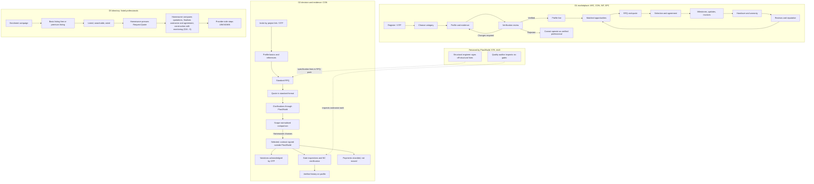

### 7.7 D1 release phasing for professional capabilities

S01 §22 splits D1 capabilities between the MVP and commercial launch (verbatim cell values):

| Capability | MVP | Commercial launch |
|---|---|---|
| Professional registration | Yes | Yes |
| Category-specific verification | Yes, rule-based | Yes, richer validation / document rules |
| Basic matching | Yes | Yes, advanced/semantic |
| Quote submission/comparison | Yes | Yes, normalized BOQ analysis |
| Project/milestone tracking | Yes | Yes |
| Photos/documents | Yes | Yes, richer media |
| In-app chat | Yes, basic | Yes, files/context/advanced |
| Payments | Yes, selected gateway flow | Yes, settlements/refunds/disputes |
| Issues / change orders | Yes | Yes, escalation workflows |
| Handover/warranty | Basic | Yes, full |
| Improve / maintenance | Basic | Yes, mature service marketplace |
| Advanced AI quote/BOQ analysis | Later | Yes |
| Automated professional scoring | Basic rules | Yes, richer signals |

So, within D1, provider settlement, refunds and disputes, escalation workflows and normalized BOQ analysis belong to commercial launch. S01 §9 also says "Quote normalization is a core product capability, not an optional feature."; how much normalization the D1 MVP needs is `AMBIGUOUS` (PAMB-033).

---

## 8. Professional registration

Registration means arriving at Plan2Build and creating an account and category. Profile fields are in section 10; verification is in section 9.

### 8.1 Entry: how each professional reaches Plan2Build

> **Client decisions (2026-10-03), CD-07, CD-14, CD-27.** All three joining routes are available: an invitation to a project, an enrolment campaign that lists the professional, and registering on the website. For the POC, Plan2Build builds its own list of contractors in Raipur and helps them onboard, creating accounts for those who want it. An invited family contractor gets project-only access after basic verification, without joining the Champions Club (proposed, section 44.8). Whether every route and role is live in the POC is CQ-08.

| Role | Entry routes in the sources | Tag |
|---|---|---|
| ARC, CON, INT, SPC [D1] | Public website and portal ("Marketing pages, registration, login, role routing and responsive portal shell", S10 §2 workstream 1); "Service-provider mobile app" for "Contractors and professionals" (S10 §1); "For Professionals" menu (S17). Marketing or acquisition channel for professionals: `UNKNOWN — REQUIRES CONFIRMATION` | `EXPLICIT` [D1] |
| CON [D2] | (1) Invitation per project: "Invite by project link/OTP; no complex onboarding before value is clear." (S06 §5.2); "Contractor receives project link/OTP and the RFQ pack." (S07 §5). (2) Homeowner nomination: "Choose/nominate contractors" (S06 §5.1); "The homeowner may nominate contractors or use contractor introductions." (S07 §4.4). (3) Plan2Build introduction: "Verified contractor introductions" (S03 §4; S05 §2); "introductions that arrive pre-qualified" (S03 §4.1); "Every introduction flows through him" (S03 §9, the Raipur associate). (4) Hand-picked for the pilot: "15 hand-picked contractors" (S03 §7.1 Gate 2). (5) Self-application: "Apply to be listed" (S14); the button links to the homeowner "Start your build plan" section, which has no form (S14), so the application path is `UNKNOWN — REQUIRES CONFIRMATION` | `EXPLICIT` |
| Listed providers [D3] | "Execute a social media campaign to recruit professionals based on city, state, and pin code." (S13); "I should be able to enroll large amount of service providers by area, by pin code, by city," (S13 transcript) | `EXPLICIT` [D3] |
| STE | Retained on a monthly retainer (S03 §7.3). Selection or appointment process: `UNKNOWN — REQUIRES CONFIRMATION` | `EXPLICIT` / `UNKNOWN` |
| AUD | Retained consultant paid per inspection; "deliberately unconnected to the associate's business" (S03 §7.3). Selection process: `UNKNOWN — REQUIRES CONFIRMATION` | `EXPLICIT` / `UNKNOWN` |
| SUP | No entry route defined. D3 lists "trusted suppliers" (S23b); S13 asks for flows for "suppliers, material suppliers" | `UNKNOWN — REQUIRES CONFIRMATION` |
| BRD [D1] | "Create brand account" (S10 §4); brand web dashboard (S10 §1) | `EXPLICIT` [D1]; `SUPERSEDED` for POC (S06 §1 "No portal in POC") |
| PMC, PTN, LAB, APL | None | `UNKNOWN — REQUIRES CONFIRMATION` |

### 8.2 Account registration

| Item | D1 professional | D2 contractor | D3 provider | STE | AUD |
|---|---|---|---|---|---|
| Authentication | TX-001 "User registration ... Email/identity verification as configured" (S02 §17); "Register / OTP" (S10 §4); OTP rate limits (S01 §21; S02 §16) | OTP: "OTP login" (S06 §3); "Register/OTP" (S08 §4); "OTP/email login" (S06 §6 module A) | `UNKNOWN — REQUIRES CONFIRMATION` | MFA: "consultant/admin MFA" (S06 §6 module A); "Admin/consultant accounts use MFA." (S06 §11) | "Secure login" (S09 §4) |
| Account fields | Not listed for professionals. The homeowner registration list ("name, email and password or a supported social sign-in method", S01 §4.1) is homeowner-specific. S06 §7 User entity: "user_id, role, contact, auth status, consent, organisation" (D2) | S06 §7 User entity as left; contractor "Firm, principal" (S05 §5) | `UNKNOWN` | `UNKNOWN` | "Assigned profile" (S09 §3) |
| Initial account state | PENDING_EMAIL after T01 (S01 §19); the professional moves to PENDING_REVIEW during verification (S01 §4.4) | `UNKNOWN — REQUIRES CONFIRMATION` | `UNKNOWN` | `UNKNOWN` | `UNKNOWN` |
| Role model | "USER → role = HOMEOWNER \| PROFESSIONAL \| ADMIN" (S01 §2) | "Roles are per project, not global; one person can hold different roles on different projects." (S05 P2) | `UNKNOWN` | Role "Structural consultant" (S06 §3) | Role "Auditor / engineer" (S06 §3) |
| Consent | `UNKNOWN` for professionals | "Consent & notice: Version privacy notice/terms acceptance and retain timestamp/source." (S06 §11) applies to all users (`DERIVED`) | `UNKNOWN` | As D2 | As D2 |

Conflict: D1 makes the role global ("USER → role = ...", S01 §2) while D2 makes roles per project (S05 P2). Recorded as PC-013.

### 8.3 Category selection

| Role | How the category is selected | Source / tag |
|---|---|---|
| D1 professional | "Choose professional category" step (S01 §4.2); TX-008 "Professional onboarding ... Profile created ... Category selected" (S02 §17); board field "Service Category" with a dropdown showing "Civil Contractor" (S19 › 1); category flows begin "Select Architect category", "Select Civil Contractor category", "Select Interior Designer / Fit-out category", "Select Specialised Service category" (S01 figs 2 to 5) | `EXPLICIT` [D1] |
| Specialist subtype | "Choose subtype + service coverage" (S01 fig 5); subtypes configurable in Admin (S01 §3) | `EXPLICIT` [D1] |
| More than one category | S01 §2: "The same professional account can hold multiple service categories only if the product explicitly supports multi-specialization; otherwise keep one primary category and allow additional specializations within the profile." S02 §5: "one or more service categories"; S02 §6.5: "A provider may be verified for one category and remain unverified for another." Both list the question as an open decision (S01 §23.1 "Whether a professional can hold multiple categories"; S02 App B) | `CONFLICT` PC-014; `OPEN QUESTION` POQ-003 |
| D2 contractor | No category step: the only D2 professional portal is the contractor portal (S05 C1) | `DERIVED` |
| D3 | Directory categories (S23b, S23d, S24 › 2); selection mechanism `UNKNOWN — REQUIRES CONFIRMATION` | `EXPLICIT` / `UNKNOWN` |
| Taxonomy ownership | Admin configures categories ("Configuration: Categories, service areas, rules, notification templates", S01 §17; "Taxonomy: Categories, specialties, cities/service areas ... Versioned configuration", S02 §15); final taxonomy is an open decision ("Final professional category taxonomy and specialist subtypes", S01 §23.1) | `EXPLICIT` [D1]; `OPEN QUESTION` POQ-002 |

### 8.4 Business information

| Role | Required business information | Source / tag |
|---|---|---|
| D1 (all categories) | Evidence group "Business evidence: Business name, tax/business evidence, operating address where relevant", required for "Contractors and businesses; configurable by category" (S01 §5.2) | `EXPLICIT` [D1] |
| CON [D1] | "business details" (S01 §3); "Identity/business information, GST/business evidence where applicable" (S02 §6.2); "Submit business, identity, experience and compliance documents" (S01 fig 3); "Team size" (S19 › 1 item list); "GST Registered" certification (S19 › 2) | `EXPLICIT` [D1] |
| INT [D1] | "business/compliance evidence where applicable" (S01 §3); "Identity/business evidence" and "team profile" (S02 §6.3) | `EXPLICIT` [D1] |
| SPC [D1] | "Identity/business evidence" and "equipment/team information" (S02 §6.4) | `EXPLICIT` [D1] |
| ARC [D1] | Business evidence not listed in S01 §3 or S02 §6.1 for architects (identity, contact, credentials and portfolio are listed instead) | `EXPLICIT` (absence) |
| CON [D2] | "Firm, principal" (S05 §5); "Firm and principal details" (S05 C1 inputs); "Create a verified contractor/business profile with service area, portfolio and credentials" (S09 §3 service-provider scope) | `EXPLICIT` [D2] |
| BRD [D1] | "Business verification" (S10 §4) | `EXPLICIT` [D1] |
| STE, AUD, SUP, PMC, PTN, LAB, APL | Not stated | `UNKNOWN — REQUIRES CONFIRMATION` |

### 8.5 Credentials

| Role | Credentials named | Who decides what is mandatory | Source / tag |
|---|---|---|---|
| ARC [D1] | "professional registration or credential where applicable" (S02 §6.1); "professional credentials" (S01 §3); "Submit identity + professional credentials + portfolio" (S01 fig 2). The registering body is not named | "mandatory according to category rules" (S01 §5.2) | `EXPLICIT` / `UNKNOWN` (which registration) |
| CON [D1] | "relevant registrations/compliance evidence" (S01 §3); "certifications/licenses where applicable", "insurance if provided" (S02 §6.2); board: "GST Registered", "Professional License", "INSURANCE (Optional)" (S19 › 2); "Upload Documents (Registration, Licenses, etc.)" (S19 › 1) | Category rules (S01 §5.2) | `EXPLICIT` [D1] |
| INT [D1] | "certifications where applicable" (S02 §6.3) | Category rules | `EXPLICIT` [D1] |
| SPC [D1] | "certifications/licenses where applicable" (S01 §3); "category-specific credential or license where applicable", "relevant certifications", "optional insurance evidence" (S02 §6.4); "Submit identity + license/certification evidence where applicable" (S01 fig 5) | Category rules | `EXPLICIT` [D1] |
| All D1 | "Exact verification evidence per category" is an open decision (S01 §23.1); "Exact legal/professional verification evidence required for each service category and geography." (S02 App B) | Admin configuration: "Admin configuration should define mandatory fields/evidence per category" (S02 §6.5) | `OPEN QUESTION` POQ-004 |
| CON [D2] | "credentials" (S09 §3); "past project evidence" (S05 C1); reference call records and site visit record (S05 §5). No licence or registration named | Plan2Build operations (S05 O1; S09 §3 ops "contractor verification") | `EXPLICIT` / `UNKNOWN` |
| STE | "registered structural engineer" (S04 §3) | Not stated | `EXPLICIT` / `UNKNOWN` |
| AUD | "certified engineer" (S20 to S22); "Independent structural consultant" (S03 §7.3) | Not stated | `EXPLICIT` / `UNKNOWN` |
| BRD (products) | Products qualify on "test certificates or IS conformity" (S04 R4). This is product qualification, not a brand credential | Published criteria | `EXPLICIT` [D2] |
| SUP, PMC, PTN, LAB, APL | None | | `UNKNOWN — REQUIRES CONFIRMATION` |

### 8.6 Registration actions

| ID | Action | Actor | Trigger | Preconditions | Inputs | System behavior and validation | Output / state | Notification | Failure / alternative | Source |
|---|---|---|---|---|---|---|---|---|---|---|
| PA-001 | Register account [D1] | Professional | Chooses to join | None stated | Not listed for professionals (`UNKNOWN`); OTP or email per auth provider | Creates User; "Email/identity verification as configured" (S02 TX-001); OTP endpoints rate-limited (S01 §21) | User PENDING_EMAIL (S01 T01), then ACTIVE (T02) | "Verification email" (S01 T01); "Welcome / next step" (T02) | Wrong OTP or expired token: "Rate-limit; allow retry; lock or cooldown after repeated failures" (S01 §20); email failure: "Record delivery failure; preserve OTP/account action safely" (S02 §20) | S01 §4.2, §19, §20; S02 §17, §20 |
| PA-002 | Choose professional category and subtype [D1] | Professional | After registration | Account exists | Category; specialist subtype and service coverage | Category list comes from admin configuration (S02 §15) | ProfessionalProfile created with category (S02 TX-008 "Category selected") | None stated | Category not in taxonomy: `UNKNOWN` | S01 §4.2, fig 5; S02 §17 |
| PA-003 | Join through a project invitation [D2] | Contractor | Plan2Build issues an invitation for a nominated or introduced contractor | Contractor nominated by homeowner or introduced (S07 §4.4) | Project link; OTP | "no complex onboarding before value is clear" (S06 §5.2) | Contractor can see the invited project and RFQ (S06 §11) | Invitation itself is the message; channel `UNKNOWN` | Contractor will not use the portal: staff capture the quote on his behalf (S05 P4) | S06 §5.2, §11; S07 §5; S05 P4 |
| PA-004 | Register through OTP and profile first [D2] | Contractor | Not stated | None stated | "business/profile details" | "verification" before "receive RFQ" | Verified contractor eligible for RFQs | `UNKNOWN` | `UNKNOWN` | S08 §4; S09 §4 |
| PA-005 | Apply to be listed [D2] | Contractor | Reads the contractors section | None stated | `UNKNOWN` (no form) | `UNKNOWN` | `UNKNOWN` | `UNKNOWN` | Button points to the homeowner start section | S14 |
| PA-006 | Enrol through campaign [D3] | Service provider | Social media campaign | None stated | `UNKNOWN` | `UNKNOWN` | Basic listing (free) | `UNKNOWN` | `UNKNOWN` | S13 |
| PA-007 | Create brand account [D1] | Brand | Not stated | None stated | Brand profile, categories, catalogue, territories, dealers (S10 §4) | "Business verification" | Published profile | `UNKNOWN` | `UNKNOWN` | S10 §2, §4 |
| PA-059 | Reset password [D1] | User (professional included) | Not stated | Account exists | Not stated | T49 "Reset password: Credential record: ACTIVE: Email" | ACTIVE | Email | Recovery is a QA scenario ("Registration, verification, login, recovery, session expiry, role escalation attempts", S01 §23.3); "Optional phone verification can be used for high-risk actions such as payments, payout-related approvals or account recovery." (S01 §4.1, written for homeowners; whether it applies to professional payouts is `UNKNOWN`) | S01 §4.1, §19, §23.3 |

PA-003 and PA-004 describe different orders (invitation before onboarding versus verification before RFQ). Both are kept; see PC-012.

---

## 9. Verification and eligibility

### 9.1 Who verifies, how, and what evidence

> **Client decisions (2026-10-03), CD-16, CD-21, CD-27.** Curation is rigorous: only the best of the best are onboarded into the "Champions Club", and not everyone who applies is accepted. Section 44.8 proposes the curation gates, scorecard, outcomes and review triggers, and the lighter basic verification for the family's own contractor. Every auditor has a unique ID (person or firm: CQ-15).

| Role | Verifier | Method | Evidence checked | Audit | Source / tag |
|---|---|---|---|---|---|
| ARC, CON, INT, SPC [D1] | Admin / operations | Verification case separate from the profile: "A profile can exist in draft state while a separate verification record tracks what was submitted, reviewed, rejected or re-requested." (S01 §5); queue-based review ("Can manage verification queue and category-specific rules", S02 §22.3) | Common checklist (9.3) plus category evidence (9.4) | "Professional verification: Review evidence, approve, reject, resubmission, suspend" with critical audit (S01 §17); "Reviewer, timestamp, reason, evidence set" (S02 §15) | `EXPLICIT` [D1] |
| Verifier profile [D1] | "different admin profiles for support, verification, finance and super-admin functions when the team grows" (S01 §17.1); "Approve and manage users, professional KYC, brands, listings, catalogues and categories." (S10 super-admin scope) | | | | `EXPLICIT` [D1] |
| CON [D2] | Plan2Build operations ("Contractor verification pipeline", S05 O1; "Manage users, contractor verification", S09 §3; "onboard and verify users", S08 §4 operations) | Reference calls and a site visit: the contractor record holds "verification status, reference call records, site visit record" (S05 §5); founding partners sign "after two reference calls and a site visit each" (S03 §7.1 Gate 2) | References, site verification, past project evidence (S05 C1; S06 §5.2) | Audit trail on every state transition (S05 §7) | `EXPLICIT` [D2] |
| Listed providers [D3] | Not stated | "Work with trusted, background-verified experts." (S23a, S23c); "All professionals are background checked and verified." (S23d) | `UNKNOWN — REQUIRES CONFIRMATION` | `UNKNOWN` | `EXPLICIT` claim [MOCKUP]; method `UNKNOWN` |
| STE | Not stated | Not stated | "registered structural engineer" (S04 §3) | `UNKNOWN` | `UNKNOWN — REQUIRES CONFIRMATION` |
| AUD | Not stated | Not stated | "certified engineer" (S20 to S22) | `UNKNOWN` | `UNKNOWN — REQUIRES CONFIRMATION` |
| BRD [D1] | Super admin ("Approve KYC / brands / listings", S10 §4) | "Business verification" (S10 §4) | `UNKNOWN` | Logged (S10 §4 super-admin note) | `EXPLICIT` [D1] |
| Products [D2] | Plan2Build against published criteria | "A product enters a set by meeting the written performance criteria, evidenced by test certificates or IS conformity." (S04 R4); yearly review with exclusion (S04 R8) | Test certificates, IS conformity, verified installation performance | "the removal is recorded" (S04 R8) | `EXPLICIT` [D2] |
| SUP, PMC, PTN, LAB, APL | Not stated | | | | `UNKNOWN — REQUIRES CONFIRMATION` |

### 9.2 Verification states

Three D1 versions exist. They are kept as written (PC-010).

| Source | States | Notes |
|---|---|---|
| S01 §5.1 (case lifecycle) | "DRAFT → SUBMITTED → UNDER_REVIEW → NEEDS_RESUBMISSION → UNDER_REVIEW → VERIFIED"; "Branch: REJECTED / SUSPENDED" | Uses NEEDS_RESUBMISSION |
| S01 App B (status dictionary) | "DRAFT → SUBMITTED → UNDER_REVIEW → RESUBMISSION_REQUIRED → VERIFIED → REJECTED → SUSPENDED" | Uses RESUBMISSION_REQUIRED; written as a list, not a sequence |
| S01 §4.4 (account states) | PENDING_REVIEW ("Professional verification in progress"), RESUBMISSION_REQUIRED ("Documents or evidence incomplete"), VERIFIED ("Professional has passed verification"), SUSPENDED, CLOSED | Verification is also reflected on the account |
| S01 §19 | T45 → RESUBMISSION_REQUIRED; T46 → VERIFIED; T44 → SUSPENDED | Admin actions |
| S02 §5.1 table | Draft, Submitted, Under Review, Changes Required, Verified, Suspended, Rejected | With provider permissions and admin actions (9.5) |
| S02 §19 | "Draft → Submitted → Under Review → Changes Required → Verified → Suspended → Rejected" | Same values as the S02 table |
| D2 contractor | "verification status" exists (S05 §5); values `UNKNOWN — REQUIRES CONFIRMATION` | |
| D3 | "Verified Professional" badge (S23d); "Verified Only" filter (S24 › 4) | Implies at least verified / not verified (`DERIVED`); whether unverified providers are listed is `AMBIGUOUS` (PAMB-002) |

### 9.3 Common verification checklist [D1]

Verbatim from S01 §5.2:

| Evidence group | Examples | Required for |
|---|---|---|
| Identity | Government identity evidence, profile photo | All professionals |
| Professional credentials | Registration / license / certification evidence where relevant | Credentialed professions; mandatory according to category rules |
| Business evidence | Business name, tax/business evidence, operating address where relevant | Contractors and businesses; configurable by category |
| Experience | Years, project count, past work | All professionals |
| Portfolio | Past-project images, descriptions, scope | Architects, contractors, interiors; specialist evidence as applicable |
| Coverage | City, pin/radius, service areas | All professionals |
| Quality / compliance | Insurance, safety or other evidence where applicable | Category dependent |
| References / reviews | Prior reviews or references if imported/verified | Optional or phased |
| Availability | Current capacity / start window | Marketplace matching and opportunities |

S01 §23.2: "Every provider category has its own verification rule set." S01 §22: category-specific verification is "Yes, rule-based" in the MVP and "Yes, richer validation / document rules" at commercial launch.

### 9.4 Category-specific verification evidence

| Role | S01 §3 "Verification emphasis" | S02 §6 "Verification evidence" | S01 §5.3 to §5.6 | S01 category figure |
|---|---|---|---|---|
| ARC | Identity; professional credentials; portfolio; experience; service area; specializations; documents | Identity, contact, operating city/coverage, professional registration or credential where applicable, experience, portfolio, specializations, past work, document evidence | "Architects emphasize credentials, design portfolio, specializations, scope definition and deliverable-based payments" | "Submit identity + professional credentials + portfolio" |
| CON | Identity; business details; experience; project portfolio; relevant registrations/compliance evidence; service area; team capacity | Identity/business information, GST/business evidence where applicable, experience, service area, property types, construction portfolio, certifications/licenses where applicable, team capacity, insurance if provided | "Civil contractors require the richest construction execution record: business/identity evidence, relevant compliance evidence, experience, capacity, BOQ, site updates, milestone payment requests, warranty and final handover evidence." | "Submit business, identity, experience and compliance documents" |
| INT | Identity; portfolio; design specialization; experience; service area; business/compliance evidence where applicable | Identity/business evidence, service specialization, portfolio, completed interiors, categories served, materials/brands knowledge, team profile, certifications where applicable | "evaluated on design specialization, portfolio, rooms handled, finish knowledge and execution/procurement capability" | "Submit identity + portfolio + specialization + experience" |
| SPC | Identity; category subtype; certifications/licenses where applicable; experience; service radius; portfolio/evidence | Identity/business evidence plus category-specific credential or license where applicable, service capability, coverage area, portfolio/past work, relevant certifications, equipment/team information and optional insurance evidence | Service-order model (section 19.5) | "Choose subtype + service coverage"; "Submit identity + license/certification evidence where applicable" |
| CON [D2] | Not applicable | Not applicable | Not applicable | Contractor record: "verification status, reference call records, site visit record" (S05 §5); "Profile basics + references/site verification status" (S06 §5.2) |

### 9.5 Verification transitions and actions

| ID | Transition | Actor | Trigger / precondition | Provider can | Admin action | Notification | Source |
|---|---|---|---|---|---|---|---|
| PA-008 | Create profile (Draft) | Professional | Category chosen | "Edit own profile" | "None" | None stated | S02 §5.1 |
| PA-009 | Submit verification (Draft → Submitted) | Professional | "Evidence checklist" control (S02 TX-009) | "Cannot change locked evidence unless resubmitted" | "Review" | `UNKNOWN` | S02 §5.1, §17 |
| PA-010 | Begin review (Submitted → Under Review) | Admin / operations (`DERIVED`; actor not named) | Case submitted | "Profile not yet market-active" | "Approve / request changes / reject" | `UNKNOWN` | S02 §5.1 |
| PA-011 | Request changes (Under Review → Changes Required / RESUBMISSION_REQUIRED) | Admin | "Incomplete documents" (S01 §20) | "Edit requested fields, resubmit"; "Can see verification status and requested corrections." (S02 §22.2) | "Review again" | T45 "Professional notice" (S01 §19) | S01 §19, §20; S02 §5.1, §22.2 |
| PA-012 | Resubmit (Changes Required → Under Review) | Professional | Corrected evidence | "Upload corrected evidence → PENDING_REVIEW" (S01 §4.4) | Review again | `UNKNOWN` | S01 §4.4, §5.1 |
| PA-013 | Approve (Under Review → Verified) | Admin | Required checks passed | "Discover, quote, deliver" | "Monitor" | T46 "Professional notice"; "Verification approved: Professional: Email + push: Professional profile" (S02 §14); "Verification result" to professional and admin (S01 §14.3) | S01 §19, §14.3; S02 §5.1, §14, TX-010 |
| PA-014 | Reject (Under Review → Rejected) | Admin | Application declined | "Cannot operate as verified professional" | "May allow re-application based on policy" | "Verification result" (S01 §14.3); channel `UNKNOWN` | S01 §14.3; S02 §5.1 |
| PA-015 | Suspend (Verified → Suspended) | Admin | Policy or operational action; "Reason required" (S02 TX-036) | "Cannot accept new opportunities/quotes" | "Investigate / reinstate" | T44 "Professional notice" (S01 §19); affected homeowner and provider notified when active projects exist (S02 §20) | S01 §4.4, §19; S02 §5.1, §17, §20 |
| PA-016 | Reinstate (Suspended → Verified) | Admin | Investigation complete | Normal permissions return (`DERIVED`) | "Investigate / reinstate"; "Admin restores or closes" (S01 §4.4) | `UNKNOWN` | S01 §4.4; S02 §5.1 |
| PA-017 | Suspend one category | Admin | "If a provider loses a required credential, the affected category can be suspended without deleting the entire account." | Other verified categories continue (`DERIVED`) | "suspend category" (S02 §15) | `UNKNOWN` | S02 §6.5, §15 |
| PA-018 | Close account (Suspended → CLOSED) | Admin | "Admin restores or closes" | None; "Historical records retained according to retention policy" | Close | `UNKNOWN` | S01 §4.4 |
| PA-019 | Verify contractor [D2] | Plan2Build operations | Contractor in the verification pipeline | `UNKNOWN` | Reference calls, site visit, record verification status | `UNKNOWN` | S05 §5, O1; S03 Gate 2 |

Every sensitive verification transition creates an audit event (S02 §19 "Transition control: only configured actors may move the object between states, and every sensitive transition is recorded as an audit event."; S02 §16 logs "verification").

### 9.6 Rejection, resubmission, approval, publication

| Topic | D1 | D2 CON | D3 |
|---|---|---|---|
| Rejection effect | "Cannot operate as verified professional" (S02 §5.1) | `UNKNOWN — REQUIRES CONFIRMATION` | `UNKNOWN` |
| Re-application after rejection | "May allow re-application based on policy" (S02 §5.1); the policy is not defined | `UNKNOWN` | `UNKNOWN` |
| Resubmission | Allowed; reviewer comments preserved (S01 §20) | `UNKNOWN` | `UNKNOWN` |
| Limit on resubmissions | `UNKNOWN — REQUIRES CONFIRMATION` | `UNKNOWN` | `UNKNOWN` |
| Approval effect | "Profile can appear in marketplace" (S01 §4.4); "Discover, quote, deliver" (S02 §5.1); "Professional/category activated" (S02 TX-010) | "A verified public profile page the contractor can share" (S05 C1) | "Verified Professional" badge (S23d) |
| Publication moment | "Profile activation" after approval (S01 §4.2); "PROFILE LIVE" (S01 §24) | The public profile shows "verification status" (S05 C1), so a profile may exist before verification completes (`AMBIGUOUS`, PAMB-003) | Listing tiers (S13); whether listing waits for verification: `UNKNOWN` |
| Discovery rule | "only professionals meeting minimum verification requirements are eligible for normal marketplace discovery" (S02 §4.4); "The system should never expose a provider simply because the provider exists in the directory; eligibility and matching rules determine inclusion." (S02 §4.4) | No discovery: contractors are invited (S06 §11) | Open directory with filters (S24 › 4); conflicts with D1 rule and D2 model (PC-001) |

### 9.7 Eligibility rules

| Rule | Direction | Source |
|---|---|---|
| "A provider may be verified for one category and remain unverified for another." | D1 | S02 §6.5 |
| "A provider can have multiple specializations under one professional profile, but each specialization can have category-specific evidence requirements." | D1 | S02 §6.5 |
| "Admin configuration should define mandatory fields/evidence per category so the system does not hard-code every future profession." | D1 | S02 §6.5 |
| "Opportunity matching must use both verification status and category specialization." | D1 | S02 §6.5 |
| View matched opportunities: "Yes - eligible only"; submit quote: "Yes - verified and eligible" | D1 | S02 §3 |
| Submit quote control: "Verified provider + open RFQ" | D1 | S02 TX-012 |
| "Can discover only eligible/matched opportunities." | D1 | S02 §22.2 |
| Agreement prerequisite: "Professional identity and verification complete." | D1 | S01 §10.2 |
| Suspended: "Cannot accept new opportunities/quotes" | D1 | S02 §5.1 |
| "Contractors see only invited projects and their own submissions." | D2 | S06 §11 |
| Contractor journey puts "verification" before "receive RFQ" | D2 | S08 §4; S09 §4 |
| "Invite by project link/OTP; no complex onboarding before value is clear." | D2 | S06 §5.2 |
| Whether an unverified nominated contractor can receive the RFQ | D2 | `CONFLICT` PC-012; `OPEN QUESTION` POQ-005 |
| Founding partner status after "two reference calls and a site visit each": what rights it gives | D2 | S03 §7.1; `UNKNOWN — REQUIRES CONFIRMATION` (POQ-006) |
| Capacity limits (how many open opportunities or projects a provider may hold) | All | `UNKNOWN — REQUIRES CONFIRMATION` (PMI-004) |

### 9.8 Credential expiry and loss

- Credential loss: "If a provider loses a required credential, the affected category can be suspended without deleting the entire account." (S02 §6.5) `EXPLICIT` [D1].
- How loss is detected, whether credentials carry expiry dates, reminders before expiry, grace periods, and automatic suspension: `UNKNOWN — REQUIRES CONFIRMATION` (PMI-005). No credential entity has an expiry field in any data model (S01 §18; S02 §18; S05 §5; S06 §7).
- Re-verification cycles: none defined. The only periodic review is for products: "Qualification is reviewed yearly." (S04 R8).

### 9.9 Diagram 2: registration to verification

D1 (S01 §4.2, §4.4, §5.1; S02 §5.1, fig 4):

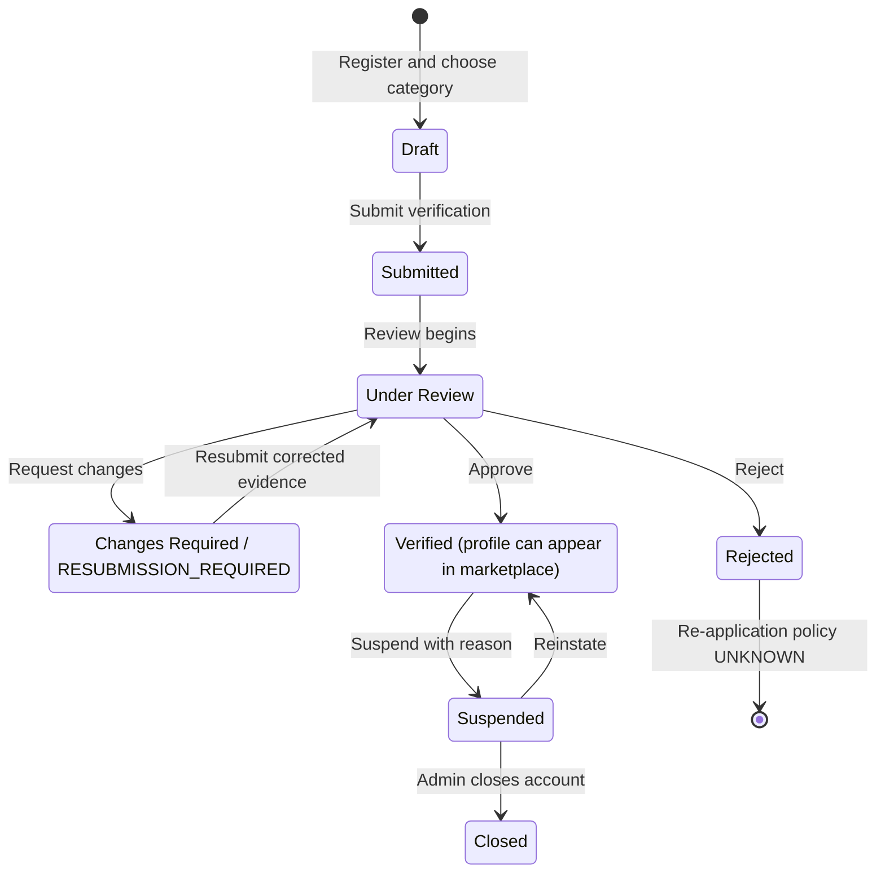

D2 contractor (S05 §5, O1; S06 §5.2; S08 §4; S09 §4):

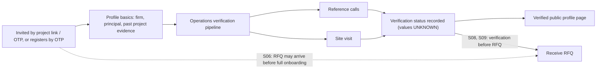

---

## 10. Professional profiles

### 10.1 Profile models

| Direction | Profile model | Source |
|---|---|---|
| D1 | "ProfessionalProfile: Professional business, specialization and service-area data" (S01 §18); "ProfessionalProfile is the aggregate root for provider identity/service capability." (S02 §18.1); profile separate from verification case (S01 §5) | `EXPLICIT` [D1] |
| D2 | Contractor entity "Firm, principal, verification status, reference call records, site visit record. No public rating or ranking field." (S05 §5); "a verified public profile page the contractor can share" (S05 C1); "reputation is represented through verification, portfolio and project/audit records" (S09 §3) | `EXPLICIT` [D2] |
| D3 | Professional cards and side-by-side comparison rows (S23d, S24 › 4) | `EXPLICIT` [D3][MOCKUP] |
| STE, AUD | AUD: "Assigned profile" (S09 §3). STE: none | `EXPLICIT` / `UNKNOWN` |
| BRD [D1] | "verified brand profile, product categories, catalogue, service territories and dealer contacts" (S10 §3 brand scope) | `EXPLICIT` [D1] |
| SUP | None | `UNKNOWN — REQUIRES CONFIRMATION` |

### 10.2 Field register

Abbreviations: Req = required; Opt = optional; "per category" = mandatory according to admin category rules (S01 §5.2; S02 §6.5). "Not stated" means the source gives no type, validation, edit or visibility rule. Visibility to other professionals is not stated for any profile field in any source.

| Field ID | Field | Purpose | Req / Opt | Type | Validation | Collected at | Editable? | Approval required? | Visible to IHB? | Visible to other professionals? | Visible to admin? | Source |
|---|---|---|---|---|---|---|---|---|---|---|---|---|
| PF-001 | Service category | Classifies the business; drives matching | Req (`DERIVED` from the registration step) | Enum, admin-configured | Must exist in taxonomy (`DERIVED`) | P03 | Not stated | Category verification (S02 §6.5) | Category tabs in D1 comparison (S18 › 4) | Not stated | Yes | S01 §2, §4.2; S19 › 1 |
| PF-002 | Specialist subtype | Narrows SPC opportunities | Req for SPC | Enum, admin-configured | Not stated | P03 | Not stated | Yes (evidence per subtype) | Not stated | Not stated | Yes | S01 §3, fig 5; S02 §6.4 |
| PF-003 | Specializations | Matching and display | Required verification evidence for ARC ("specializations", S01 §3; S02 §6.1) and INT ("design specialization", S01 §3; "specialization", S01 fig 4; "service specialization", S02 §6.3); otherwise not stated; "+ Add More" allows several | Multi-select (Residential, Commercial, Renovation, Interior Fit-out shown) | Not stated | P04 | Not stated; a "+ Add More" link is shown (S19 › 2 [MOCKUP]) | "each specialization can have category-specific evidence requirements" | Not stated | Not stated | Yes | S19 › 2; S02 §6.5; S01 §3 |
| PF-004 | City / coverage area / service radius | Location matching | Req for all (S01 §5.2 "All professionals") | City plus pin/radius | Not stated | P04 | Not stated | Part of verification | Location shown on D3 cards | Not stated | Yes | S01 §5.2, §8.1; S19 › 1 |
| PF-005 | Project size | Matching | Not stated | Not stated | Not stated | P04 | Not stated | Not stated | Not stated | Not stated | Yes | S19 › 1 item list |
| PF-006 | Experience (years, project count, past work) | Verification and display | Req for all | Range ("5 - 10 years" shown) | Not stated | P04 | Not stated | Yes | Yes in D3 ("12+ years experience") | Not stated | Yes | S01 §5.2; S19 › 1; S23d |
| PF-007 | Team size / team capacity | Capacity | CON, SPC per category | Not stated | Not stated | P04 | Not stated | Yes | Not stated | Not stated | Yes | S19 › 1; S01 §3; S02 §6.2, §6.4 |
| PF-008 | Portfolio (past-project images, descriptions, scope) | Verification and display | Req for ARC, CON, INT; SPC as applicable | Files and text | Not stated | P05 | Not stated | Yes | "past work" in D1 comparison fields (S02 §4.4) | Not stated | Yes | S01 §5.2; S19 › 1 |
| PF-009 | Documents (registration, licences) | Evidence | Per category | File upload | Not stated | P05 | Locked after submission unless resubmitted (S02 §5.1) | Yes | Not stated | Not stated | Yes | S19 › 1; S02 §5.1 |
| PF-010 | Identity evidence (government identity, profile photo) | Identity | Req for all | File / image | Not stated | P05 | Locked after submission | Yes | Profile photo: not stated | Not stated | Yes | S01 §5.2 |
| PF-011 | Professional credentials | Credentialed professions | "mandatory according to category rules" | File | Not stated | P05 | Locked after submission | Yes | Not stated | Not stated | Yes | S01 §5.2 |
| PF-012 | Business evidence (business name, tax/business evidence, operating address) | Business identity | "Contractors and businesses; configurable by category" | Text and file | Not stated | P05 | Locked after submission | Yes | Not stated | Not stated | Yes | S01 §5.2 |
| PF-013 | Quality / compliance (insurance, safety) | Category evidence | "Category dependent"; insurance optional | File | Not stated | P05 | Not stated | Yes | Not stated | Not stated | Yes | S01 §5.2; S02 §6.2, §6.4; S19 › 2 |
| PF-014 | Certifications (GST Registered, Professional License, Insurance) | Display and verification | Insurance marked "(Optional)" | Checklist | Not stated | P04 | Not stated | Not stated | Not stated | Not stated | Yes | S19 › 2 |
| PF-015 | References / reviews (imported) | Reputation | "Optional or phased" | Not stated | "if imported/verified" | P05 | Not stated | Yes | Not stated | Not stated | Yes | S01 §5.2 |
| PF-016 | Availability (current capacity / start window) | Matching | Required for "Marketplace matching and opportunities" | Not stated | Not stated | P04 | Not stated | Not stated | D3 "Availability" filter showing "Available Now" | Not stated | Yes | S01 §5.2, §8.1; S02 §4.4; S23d |
| PF-017 | Budget range | Matching | Not stated | Range ("₹ 5 Lakh – 50 Lakh" shown) | Not stated | P04 | Not stated | Not stated | Not stated | Not stated | Yes | S19 › 2; S02 §4.4 |
| PF-018 | Property types | Matching | Not stated | Not stated | Not stated | P04 | Not stated | Not stated | D3 project-type tags (S24 › 4) | Not stated | Yes | S19 › 2; S02 §6.2 |
| PF-019 | Project readiness | Not explained (PAMB-004) | Not stated | Not stated | Not stated | P04 | Not stated | Not stated | Not stated | Not stated | Not stated | S19 › 2 item list |
| PF-020 | Past work | Display | Not stated | Not stated | Not stated | P04 | Not stated | Not stated | Yes (S02 §4.4) | Not stated | Yes | S19 › 2; S02 §4.4 |
| PF-021 | Ratings | Reputation | System-derived (`DERIVED`) | Number | Not editable by admins (S01 §16) | After closure | No | Moderation only | Yes [D1] [D3]; prohibited [D2] | Not stated | Yes | S19 › 2, › 7; S01 §16; S05 §9 |
| PF-022 | Reputation metrics (verified reviews, project count, on-time delivery, response rate, profile strength, repeat business, complaint / dispute rate) | Reputation | System-derived | Numbers / percentages | Computed from platform records | Rolling or on events | No | Not stated | Partly (D3 shows completed projects, response time) | Not stated | Yes | S01 §16; S19 › 7 |
| PF-023 | Verification status [D1] | Eligibility | System | Enum (9.2) | State machine | P07 to P09 | Admin only | Admin | Implied by discovery rule | Not stated | Yes | S01 §4.4; S02 §5.1 |
| PF-024 | ARC: contact, operating city/coverage, professional registration, specializations, past work | Architect evidence | Per category | Mixed | Not stated | P04 to P05 | Not stated | Yes | Not stated | Not stated | Yes | S02 §6.1 |
| PF-025 | CON [D1]: property types, construction portfolio, team capacity, insurance | Contractor evidence | Per category; insurance "if provided" | Mixed | Not stated | P04 to P05 | Not stated | Yes | Not stated | Not stated | Yes | S02 §6.2 |
| PF-026 | INT: completed interiors, categories served, materials/brands knowledge, team profile, rooms handled, finish knowledge, execution/procurement capability | Interior evidence | Per category | Mixed | Not stated | P04 to P05 | Not stated | Yes | Not stated | Not stated | Yes | S02 §6.3; S01 §5.5 |
| PF-027 | SPC: service capability, equipment/team information, coverage area | Specialist evidence | Per category | Mixed | Not stated | P04 to P05 | Not stated | Yes | Not stated | Not stated | Yes | S02 §6.4 |
| PF-028 | Services, locations, capacity [D1 proposal] | Profile | Not stated | Not stated | Not stated | P04 | Not stated | "verified professional/business profile" | Not stated | Not stated | Yes | S10 §3 service-provider scope |
| PF-029 | Firm [D2] | Contractor identity | Req (`DERIVED` from "Firm and principal details" input) | Text | Not stated | P04 | Not stated | Part of verification | Shareable profile (`DERIVED`) | Shareable "to anyone" (S14) | Yes | S05 §5, C1 |
| PF-030 | Principal [D2] | Responsible person | As PF-029 | Text | Not stated | P04 | Not stated | Part of verification | As PF-029 | As PF-029 | Yes | S05 §5, C1 |
| PF-031 | Past project evidence / portfolio [D2] | Verification and profile | Not stated | Files | Not stated | P04 to P05 | Not stated | Part of verification | Yes, on public profile ("portfolio") | As PF-029 | Yes | S05 C1; S09 §3 |
| PF-032 | Service area and credentials [D2] | Profile | Not stated | Not stated | Not stated | P04 | Not stated | "verified contractor/business profile" | Not stated | Not stated | Yes | S09 §3 |
| PF-033 | Verification status [D2] | Trust signal | System | Values `UNKNOWN` | Not stated | P07 | Operations | Operations | Yes, on public profile | As PF-029 | Yes | S05 §5, C1 |
| PF-034 | Reference call records [D2] | Verification evidence | Recorded by operations | Records | Not stated | P07 | Operations | n/a | Not stated (internal, `DERIVED`) | Not stated | Yes | S05 §5 |
| PF-035 | Site visit record [D2] | Verification evidence | Recorded by operations | Record | Not stated | P07 | Operations | n/a | Not stated | Not stated | Yes | S05 §5 |
| PF-036 | Audit record [D2] | Reputation | System, from gate inspections | Records | Locked reports (S07 §6) | After gates | No | Homeowner consent not stated (PAMB-026) | Yes, on public profile | Shareable (S14) | Yes | S05 C1; S14 |
| PF-037 | Rating, score, ranking [D2] | Prohibited | Must not exist ("No public rating or ranking field") | n/a | n/a | n/a | n/a | n/a | n/a | n/a | n/a | S05 §5, C1, §9 |
| PF-038 | D3 card: name, firm, category label | Directory display | Not stated | Text | Not stated | Not stated | Not stated | Not stated | Yes | Not stated | Not stated | S23d; S24 › 5 |
| PF-039 | D3 card: star rating and review count | Directory display | Not stated | Number | Not stated | System (`DERIVED`) | Not stated | Not stated | Yes; "Minimum Rating" filter | Not stated | Not stated | S23a; S23d; S24 › 4 |
| PF-040 | D3 card: years of experience, city, completed projects | Directory display | Not stated | Number / text | Not stated | Not stated | Not stated | Not stated | Yes; "Experience" filter | Not stated | Not stated | S23d; S24 › 4 |
| PF-041 | D3 card: "Specializes In" tags; project-type tags | Directory display | Not stated | Tags | Not stated | Not stated | Not stated | Not stated | Yes | Not stated | Not stated | S23d; S24 › 4 |
| PF-042 | D3 card: "Starting from" price; "Price Range" | Directory display | Not stated | Currency (per project or per sq.ft.) | Not stated | Not stated | Not stated | Not stated | Yes | Not stated | Not stated | S23d |
| PF-043 | D3: "Typical Project Size" | Comparison row | Not stated | Currency range | Not stated | Not stated | Not stated | Not stated | Yes | Not stated | Not stated | S23d |
| PF-044 | D3: "Average Response Time" | Comparison row | Not stated | Duration | Not stated | System or self-declared: `UNKNOWN` | Not stated | Not stated | Yes | Not stated | Not stated | S23d |
| PF-045 | D3: "Services Offered", "Client Reviews" | Comparison rows | Not stated | Text / reviews | Not stated | Not stated | Not stated | Not stated | Yes | Not stated | Not stated | S23d |
| PF-046 | D3: "Verified Professional" badge | Trust signal | System (`DERIVED`) | Flag | Not stated | Not stated | Not stated | Not stated | Yes | Not stated | Not stated | S23d |
| PF-047 | D3 premium extras: "celebrity endorsements", "portfolio assistance" | Premium listing | Premium tier (S13 summary); the details describe "growth and premium growth tiers" (PAMB-035) | Not stated | Not stated | Not stated | Not stated | Not stated | Not stated | Not stated | Not stated | S13 |
| PF-048 | BRD [D1]: brand profile, product categories, catalogue, service territories, dealer contacts | Brand discovery | Not stated | Mixed | Not stated | Brand onboarding | "Maintain" (S10) | "Business verification"; super admin approves catalogues | Not stated | Not stated | Yes | S10 §3, §4 |

### 10.3 Fields the request asked about and their status

| Asked about | Status |
|---|---|
| Name, organization | D2 firm and principal (PF-029, PF-030); D3 name and firm (PF-038); D1 name field `UNKNOWN` (S06 §7 User has "organisation" in D2) |
| Location, service areas | PF-004, PF-032 |
| Categories | PF-001, PF-002 |
| Experience | PF-006, PF-040 |
| Portfolio, projects | PF-008, PF-031, PF-040 |
| Certifications, licenses | PF-011, PF-014 |
| Ratings, reviews | PF-021, PF-039 [D1, D3]; prohibited in D2 (PF-037) |
| Pricing, starting price | D3 only (PF-042); none in D1 or D2 profiles |
| Budget range | PF-017 [D1]; D3 "Typical Project Size" (PF-043) |
| Availability | PF-016 [D1]; D3 "Availability" filter with "Available Now" (S23d) |
| Verification badges | PF-033 [D2]; PF-046 [D3] |
| Response rate | PF-022 [D1 metric]; PF-044 [D3 response time] |
| Completion history | PF-022 ("Project count", "On-time delivery"); PF-036 [D2 audit record] |

Profile editing after verification, field-level validation, and which edits trigger re-verification are not stated in any source (`UNKNOWN — REQUIRES CONFIRMATION`, PMI-006).

---

## 11. Opportunity / lead flow

### 11.1 Five ways a professional gets work, kept separate

> **Client decisions (2026-10-03), CD-04, CD-07, CD-15, CD-16, CD-22, CD-26, CD-27, CD-28.** For the POC: homeowner-nominated (basic verification, project-only access), Plan2Build-introduced (Champions Club members from the recommendation engine's shortlist), marketplace-listed (a Request Quote goes as a lead to at most three contractors the homeowner picks, each only if its enlistment class covers the project; section 44.7), outside quote reviewed (Plan2Build reviews the quote against the workspace and comments) and invited to quote all apply. Matched (D1) is future intent. Open: CQ-02, CQ-07.

The sources describe five different models. They are not interchangeable and they come from different directions (PC-001, POQ-001).

| Model | Direction | How it arises | Who starts it | Which roles | Sources |
|---|---|---|---|---|---|
| Homeowner-nominated | D2 | The family names its own contractor or contractors; Plan2Build then issues the standard RFQ to them | Homeowner | CON | "Choose/nominate contractors → Plan2Build issues standard RFQ" (S06 §5.1); "The homeowner may nominate contractors" (S07 §4.4); "homeowner nominates contractors → standard RFQ" (S08 §2); "Nominate or select contractors for a standard RFQ" (S09 §3); "we never replace the contractor the family already chose" (S05 §2); onboarding captures "contractor status" (S06 §6 module B) |
| Plan2Build-introduced | D2; D3 mockups | Plan2Build puts a verified contractor in front of the family | Plan2Build (through the Raipur associate in the pilot) | CON [D2]; architects, contractors, service providers [D3] | "Verified contractor introductions" (S03 §4; S05 §2); "or use contractor introductions" (S07 §4.4); "introductions that arrive pre-qualified" (S03 §4.1); "Every introduction flows through him" (S03 §9); "Our team reviews your requirement and may reach out for more details." and "We connect you with verified and relevant architects, contractors and service providers." (S23c); "Let Plan2Build shortlist the right professionals for you." (S23d); step "Get matched" ("with verified professionals and receive quotations.", S24 › 1) [MOCKUP] |
| Marketplace-listed | D3 (and "listing" in D2) | The professional is listed in a searchable directory; the homeowner finds the card and presses "Request Quote" | Homeowner | Architects, contractors, interior designers, trade specialists [D3]; CON [D2] | Directory with filters, sort and "Request Quote" (S23d; S24 › 4) [MOCKUP]; "Featured Professionals" (S23a); "Maps API integration supports location-based search capabilities" (S13); "Listing is free for the contractors we invite." (S14); "Basic listing is offered as a free option for service providers." (S13) |
| Matched | D1 | The system scores eligible professionals against a published project need and alerts them | System | ARC, CON, INT, SPC [D1] | Matching dimensions and opportunity states (S01 §8); "Match providers ... Opportunity-provider links created ... Eligibility rules" (S02 TX-007); "Receive matched leads" (S10 §4) |
| Outside quote reviewed | D2 price boards | The family brings a quote from its own contractor and pays Plan2Build to review it; the contractor need not be on the platform | Homeowner | CON | "Independent Quote Review: Get an expert review of your contractor's quote", with "What is included, missing and unclear" and "Risk areas and key questions to ask your contractor" (S21, S22); ₹4,999 (S20 to S22) |
| Invited to quote | D1 and D2 | A specific professional is invited to an RFQ | Homeowner or system [D1]; Plan2Build operations [D2] | ARC, CON, INT, SPC [D1]; CON [D2] | T10 "Invite to RFQ" → RFQ_INVITED (S01 §19); RFQ "invited/matched providers" (S02 §7); "contractor invitations" (S06 §6 module G); RFQ "invited contractors" (S06 §7); "RFQ orchestration (Invite + monitor responses)" (S06 map 4) |

How the models relate:

- In D1, matching produces candidates and the homeowner (or system) invites some of them to the RFQ (`EXPLICIT`, S01 §8.2 "RFQ_INVITED ... Homeowner/System").
- In D2, nomination and introduction both end in an invitation to the same standard RFQ (`EXPLICIT`, S07 §4.4). There is no matching and no open discovery: "Contractors see only invited projects and their own submissions." (S06 §11).
- In D3, listing, team matching ("Get Expert Recommendations", S23d) and "Recommended Professionals" on the Build Plan page (S24 › 5) coexist. What the professional receives after "Request Quote" is not shown (`UNKNOWN — REQUIRES CONFIRMATION`).

### 11.2 D1 matched opportunity: full behavior

| Aspect | Behavior | Source / tag |
|---|---|---|
| Purpose | "Professionals should see projects they are eligible to serve, not a random lead feed." | S01 §8 `EXPLICIT` [D1] |
| Who creates it | Homeowner owns the DRAFT need; "Create opportunity: System/Homeowner: RFQ/opportunity created: Scope complete" | S01 §8.2; S02 TX-006 |
| When | Only after an explicit homeowner readiness action: "Saving qualification does not automatically publish a project to professionals. The homeowner must explicitly choose a readiness action such as "Start comparing professionals" or "Request quotes."" Planning flow ends "Finalize plan → Publish eligible needs" | S01 §6.2, §7.1 |
| Public or private | Not public. PUBLISHED means "Opportunity visible to eligible providers" | S01 §8.2 |
| Who can see it | Eligible, verified professionals of the matching category ("View matched opportunities: Yes - eligible only", S02 §3); admin ("Opportunities: Moderate, configure matching/category rules", S01 §17) | S01 §8.2, §17; S02 §3, §22.2 |
| Opportunity record | "Project, category, location, budget, scope, start date, eligible provider set"; states "Open, paused, closed" | S02 §7 |
| What the professional sees on a card | "Structured project briefs, Location, Budget, Scope, Expected start date, Service needed" (board item list); sample cards: "Independent House", "Raipur, Chhattisgarh", "₹ 40 - 55 Lakh", "Civil Construction", "Start: Apr 2025"; "Office Interior", "Durg, Chhattisgarh", "₹ 12 - 18 Lakh", "Interior Design"; "Villa Construction", "Bhilai, Chhattisgarh", "₹ 80 Lakh - 1.2 Cr", "Civil + Interior" (one opportunity spanning two categories, PC-014); each with a save (heart) icon; filters "All (12)", "Residential", "Commercial" | S19 › 3 [MOCKUP] |
| Opportunity assessment | "Understand fit and competitiveness.": "Project fit score, Number of competitors, Typical quote range, Market insights, Readiness score" | S19 › 4 [MOCKUP]; PC-015 (competitor information) |
| Matching dimensions | "Service category and specialization", "Location / service radius", "Project type", "Budget / project size", "Required timeline / availability", "Past-project relevance", "Verification status", "Profile completeness", "Quote history / response behavior", "User-selected preferences" | S01 §8.1 |
| Filtering for the homeowner | "Filter by service category, location/service radius, property type, specialization, budget range and availability." | S02 §4.4 |
| Hard eligibility | "Apply verification state: only professionals meeting minimum verification requirements are eligible for normal marketplace discovery."; "Opportunity matching must use both verification status and category specialization." | S02 §4.4, §6.5 |
| Scoring | "Compute a project-fit score from explicit rules first; AI/semantic ranking can augment but should not replace hard eligibility constraints."; "A "fit score" should be explainable at a high level: category fit, location fit, scope fit, budget fit, availability and profile quality. Keep the score as decision support rather than an unreviewable automated selection." AI task "Professional matching ... Candidate ranking / fit reasons ... Use explainable criteria; do not expose hidden sensitive factors" | S02 §4.4; S01 §8.2 rule, §7.2 |
| Location matching | "Location / service radius" dimension; Google Maps for "Address, geocoding, service area and distance" | S01 §8.1; S10 §5 |
| Service matching | Category and specialization; specialists: "The provider only receives opportunities matching the configured specialty." | S01 §8.1; S02 §6.4 |
| Budget matching | "Budget / project size" dimension; provider "Budget Range" field (S19 › 2) | S01 §8.1 |
| Project-type matching | "Project type" dimension; provider "Property types" field | S01 §8.1; S19 › 2 |
| Notification | T07 "Match professionals ... MATCHING/PUBLISHED ... Provider alerts"; "New matching opportunity" to the professional; "Opportunity matched: Professional: Push + email: Opportunity details" | S01 §19, §14.3; S02 §14 |
| View | T08 "View opportunity" → VIEWED (system moves it) | S01 §8.2, §19 |
| Interest / acceptance | T09 "Express interest" → INTERESTED (professional); "Accept / reject / clarify" | S01 §8.2, §19; S10 §4 |
| Decline | DECLINED: "Provider or homeowner declined"; moved by "Relevant actor" | S01 §8.2 |
| Expiry | EXPIRED: "Opportunity closed by date/rule"; moved by "System/Admin". The dates and rules are not defined | S01 §8.2; `UNKNOWN` (POQ-007) |
| No match found | "Offer broader radius/category or allow manual admin intervention" | S01 §20 |
| Reassignment | Not described | `UNKNOWN — REQUIRES CONFIRMATION` |
| Duplicate opportunities | Not described | `UNKNOWN — REQUIRES CONFIRMATION` |
| Capacity limits | "Availability: Current capacity / start window" is a matching input; no cap on concurrent opportunities is defined | S01 §5.2; `UNKNOWN` (PMI-004) |
| Lead access rules | "Lead access, subscription rules and commission treatment should be configurable by Super Admin." | S10 §4 [D1] |
| Improve loop | "A completed construction project can later create maintenance, repair, renovation, solar, interior or upgrade service requests."; T40 service request PUBLISHED → "Provider alerts"; "Repair or upgrade requests can create new service opportunities using the same professional marketplace." | S01 §15.3; S02 §13 [D1]; `SUPERSEDED` for POC (S05 §9) |
| Brand enquiries | "Receive relevant homeowner or project enquiries and route them by territory/category." | S10 §3 [D1] |
| Release status | Basic matching is MVP; "advanced/semantic" at launch; "Automated professional scoring: Basic rules" in MVP | S01 §22 |

### 11.3 D2 nominated or introduced contractor, invited to the standard RFQ

| Aspect | Behavior | Source / tag |
|---|---|---|
| Who creates the opportunity | No "opportunity" object in D2. Plan2Build issues the RFQ: "Plan2Build issues standard RFQ" | S06 §5.1 |
| When | After the PLAN stage (paid Build Plan and issued specification set), in the COMPARE stage | S06 §5.1; S05 P4 inputs |
| Who coordinates | City lead / concierge: "coordinate contractor RFQ" (S06 §3); operations "RFQ / comparison: Invitations, contractor participation, clarifications, normalisation findings" (S07 §7); RFQ permission for ops "Create / assist / monitor" (S09 §3) | `EXPLICIT` [D2] |
| Public or private | Private to the invited contractors | S06 §11 |
| Who can see it | "Contractors see only invited projects and their own submissions."; "Contractor cannot see another contractor's quotation." | S06 §11, §16.1 |
| How many contractors | Definition of done: "a scope-normalised comparison of three real quotes" (S05 §11); price boards sell "Compare up to 3 quotations" (S21, S22). A maximum is not stated for the RFQ itself | `EXPLICIT`; maximum `UNKNOWN` |
| Matching | None. Location, service, budget or project-type matching are not described for D2 | `EXPLICIT` (absence) |
| Verification requirement | `CONFLICT` PC-012: S06 §5.2 invites first; S08 §4 and S09 §4 verify before the RFQ | |
| Invitation channel | "Contractor receives project link/OTP and the RFQ pack." | S07 §5 |
| Notification | "RFQ reminders" (S06 §6 module M); "Receive notifications for RFQs, clarifications, variations and relevant project actions" (S09 §3). Channel: "Do not force homeowners or contractors to install an app during the POC. Use responsive web/PWA + WhatsApp for them" (S06 §1); "WhatsApp Business API provider + SMS fallback + email" (S06 §9); S07 starts with "Email + SMS initially; WhatsApp as an expansion path" (S07 §17) | `EXPLICIT`; channel order `CONFLICT` (PC-039) |
| Acceptance or decline of the invitation | Not described | `UNKNOWN — REQUIRES CONFIRMATION` (POQ-008) |
| Contractor will not use the portal | "A quote can be captured by Plan2Build staff on a contractor's behalf, for contractors who will not use the portal." | S05 P4 |
| Expiry | Not described; quotes carry a "validity" field (S06 §7) | `UNKNOWN` |
| Participation measure | "Contractors submitting compliant RFQ / contractors invited" (S06 §17); target "≥ 80% of those invited" (S03 §7.2) | `EXPLICIT` [D2] |
| Pilot cohort | "15 hand-picked contractors on behalf of paying families"; pass if "12 or more contractors quote to the standard format" | S03 §7.1 Gate 2 |
| Reassignment, duplicate handling, capacity | Not described | `UNKNOWN — REQUIRES CONFIRMATION` |

### 11.4 D3 listed professional

> **Client decisions (2026-10-03), CD-15, CD-16, CD-22, CD-26.** Contractor listing is part of the POC; only Champions Club members are listed; a Request Quote goes as a lead to at most three contractors the homeowner picks whose enlistment class covers the project, and section 44.7 gives what follows. What sets the class is CQ-07; whether other roles are listed is CQ-08.

| Aspect | Behavior | Source / tag |
|---|---|---|
| Visibility | Public directory: "Architects in Mumbai — Compare verified architects for your project. View profiles, ratings, past work and request quotations." with "124 Architects found" | S24 › 4 [MOCKUP] |
| Filters | Location, Rating, Experience, Project Type, Budget Range, Verified Only (S24 › 4); Service Category, City, Budget Range, Minimum Rating, Experience, Availability (S23d) | [MOCKUP] |
| Sorting | "Sort by: Relevance" (S23d, S24 › 4); other sort options not shown | [MOCKUP]; PC-002 |
| Promotion | "Featured Professionals — Top-Rated Professionals for Your Home Project." (S23a), shown as rating-based with no paid marker; "Recommended Professionals" with "Request Quote" on the Build Plan page (S24 › 5); premium listing (S13) | [MOCKUP]; PAMB-034; PC-006 |
| Homeowner actions | "View Profile", "Compare" (with a "+" icon), "Request Quote", save (heart) | S23d [MOCKUP] |
| Professional receives | Not shown | `UNKNOWN — REQUIRES CONFIRMATION` |
| Requirement posting | "Post Your Requirement" form; "What Happens Next?" says the team reviews it and connects the homeowner with professionals | S23c [MOCKUP] |
| Privacy | "We never share your personal details without your consent." | S23c [MOCKUP] |

### 11.5 Opportunity actions

| ID | Action | Actor | Direction | Result | Source |
|---|---|---|---|---|---|
| PA-020 | Receive matched opportunity alert | Professional | D1 | Opportunity visible; push + email | S01 T07; S02 §14 |
| PA-021 | View opportunity | Professional | D1 | VIEWED | S01 T08 |
| PA-022 | Assess fit (fit score, competitors, typical range, readiness) | Professional | D1 | None recorded | S19 › 4 [MOCKUP] |
| PA-023 | Save opportunity (heart icon) | Professional | D1 | `UNKNOWN` (icon only) | S19 › 3 [MOCKUP] |
| PA-024 | Express interest | Professional | D1 | INTERESTED; "Homeowner/system optional" notification | S01 T09 |
| PA-025 | Decline opportunity | Professional | D1 | DECLINED | S01 §8.2; S10 §4 |
| PA-026 | Request more information | Professional | D1 | Clarification thread (`DERIVED`) | S10 §3 "request more information" |
| PA-027 | Receive project invitation and RFQ pack | Contractor | D2 | Project and RFQ visible | S07 §5; S06 §11 |
| PA-028 | Receive "Request Quote" | Listed professional | D3 | `UNKNOWN` | S23d |
| PA-029 | Receive brand enquiry and route it | Brand | D1 | Routed to "brand team / dealer" | S10 §4 |

---

## 12. RFQ flow

### 12.1 Which roles take part in an RFQ

> **Client decision (2026-10-03), CD-20.** The architect's final design pack can be part of the standard RFQ package that contractors price.

| Role | RFQ behavior | Source / tag |
|---|---|---|
| CON [D2] | Receives the standard RFQ; the only D2 professional who quotes | S05 P4, C1; S06 §5.2 |
| ARC, CON, INT, SPC [D1] | Invited to a versioned RFQ after matching | S01 §9; S02 §7 |
| SPC [D1] service requests | Service request → "Quote / appointment" → service order | S01 §15.3, T40, T41 |
| BRD [D1] | "Receive product enquiries or RFQs", "Respond with offer or recommendation"; access table "Submit quotation: Yes/RFQ response". No quote structure is defined for brands | S10 §3, §4 |
| Listed professionals [D3] | Homeowner presses "Request Quote"; afterwards only homeowner-side steps are shown ("Get detailed quotations from shortlisted professionals", S24 › 5); provider-side RFQ steps `UNKNOWN` | S23d; S24 › 5 [MOCKUP] |
| STE, AUD | Never quote; retained by Plan2Build | S03 §7.3 |
| SUP | No RFQ behavior defined | `UNKNOWN — REQUIRES CONFIRMATION` |

RFQ objects:

| Direction | Fields | Source |
|---|---|---|
| D1 | "Scope version, attachments, response deadline, invited/matched providers"; states "Draft, Open, Closed, Cancelled"; "An RFQ is a reusable transactional object, not merely a message." | S02 §7 |
| D1 | "System creates RFQ with a versioned scope, target timeline and response deadline." | S01 §9.1 |
| D2 | "rfq: The standard request issued to contractors for a project, with its BOQ, drawings, specification set and quotation format." | S05 §5 |
| D2 | "RFQ: rfq_id, project, pack version, issue date, invited contractors, status" | S06 §7 |
| D2 | "Mandatory pack version; standard line schema; contractor cannot submit final quote with required fields missing without explicit exclusion." | S06 §10 |

The step cards below give D2 (the governing POC detail for contractors) and D1 (all four marketplace categories) side by side. D3 has no RFQ steps beyond "Request Quote"; every D3 cell would read `UNKNOWN — REQUIRES CONFIRMATION`, so the D3 column is omitted.

#### 12.2 PA-030 Step 1: RFQ received

| Attribute | D2 contractor | D1 professional |
|---|---|---|
| Actor | Contractor receives; Plan2Build issues ("Plan2Build issues standard RFQ", S06 §5.1) | Professional receives; homeowner or system invites (T10, S01 §8.2) |
| Trigger | Homeowner nominates contractors or uses introductions after receiving the Build Plan (S06 §5.1; S07 §4.4) | "Homeowner finalizes project requirements and selects one or more professional categories." (S01 §9.1) |
| Preconditions | Issued specification set, BOQ, drawings, timeline and fixed quotation format exist (S05 P4 inputs); contractor invited (S06 §11); verification first per S08 §4 and S09 §4, but not per S06 §5.2 (PC-012) | Opportunity published and provider eligible (S01 §8.2; S02 §3); verified for the category (S02 §6.5) |
| Inputs | RFQ pack: "BOQ, drawings, specification, timeline, standard quotation format" (S03 §7.1); "drawings, BOQ, performance specification, timeline and mandatory quotation template" (S06 §5.2) | "versioned scope, target timeline and response deadline" (S01 §9.1); "attachments" (S02 §7) |
| UI action | RFQ appears in the "RFQ inbox" (S05 C1); reached by "project link/OTP" (S07 §5) | Opportunity / RFQ detail; "Download RFQ & BOQ" with "(12 MB)" and a PDF icon (S19 › 5 mock; stage item "Download RFQ/BOQ") |
| System action | Records RFQ with "pack version, issue date, invited contractors, status" (S06 §7) | "System creates RFQ with a versioned scope, target timeline and response deadline." (S01 §9.1) |
| Validation | "Mandatory pack version" (S06 §10) | Scope complete before opportunity creation (S02 TX-006 "Scope complete"); RFQ opens subject to "Deadline/eligibility" (S02 TX-011) |
| Output | Contractor can open the RFQ | "Providers receive a notification and can open the full brief." (S01 §9.1) |
| State change | RFQ "status" (values `UNKNOWN`) | Opportunity participation → RFQ_INVITED (S01 §8.2); RFQ → Open (S02 §7) |
| Notification | Step 2 | Step 2 |
| Next action | Open RFQ (step 3) | Open RFQ (step 3) |
| Failure path | Contractor does not use the portal: staff capture the quote (S05 P4). Invitation never opened: `UNKNOWN` | "Provider does not respond: Expire invitation; optionally send reminder; do not mark quote as zero" (S01 §20) |
| Alternative path | Contractor registers by OTP first and is verified before receiving RFQs (S08 §4, S09 §4) | Brand receives "product enquiries or RFQs" (S10 §4) |
| Dependencies | Build Plan and specification issue (S05 P3, P4); drawings supplied by the homeowner (S06 §5.1 "upload drawings/inputs") | Planning flow "Finalize plan → Publish eligible needs" (S01 §7.1) |
| Business rules | "Contractors see only invited projects and their own submissions." (S06 §11); "No auction, bidding, countdown or price-ranked listing exists anywhere in the module." (S05 P4) | "Professionals should see projects they are eligible to serve, not a random lead feed." (S01 §8) |
| Data | rfq (S05 §5); RFQ (S06 §7) | RFQ, Opportunity (S01 §18; S02 §7) |

#### 12.3 PA-031 Step 2: Notification

| Attribute | D2 contractor | D1 professional |
|---|---|---|
| Actor | System | System |
| Trigger | RFQ issued; reminders | Invitation (T10) or match (T07) |
| Preconditions | Contractor contact available (`DERIVED`) | Professional account active |
| Inputs | Not stated | Event |
| UI action | None | None |
| System action | "RFQ reminders" (S06 §6 module M); "Receive notifications for RFQs, clarifications, variations and relevant project actions" (S09 §3) | T10 "Provider alert"; "Opportunity matched: Professional: Push + email: Opportunity details" (S02 §14) |
| Validation | "Configurable reminders with suppression rules; no spam." (S06 §10) | "Every notification event is generated from an explicit system event, not from UI-only behavior." (S01 §23.2) |
| Output | Message to contractor: web/PWA + WhatsApp for homeowners and contractors (S06 §1); "WhatsApp Business API provider + SMS fallback + email" (S06 §9); S07 starts with "Email + SMS initially; WhatsApp as an expansion path" (S07 §17) (PC-039) | Push and email (S02 §14) |
| State change | None stated | None |
| Notification | This step | This step |
| Next action | Open RFQ | Open opportunity details |
| Failure path | Delivery failure: `UNKNOWN` for D2 | "Email delivery failure: Record delivery failure; preserve OTP/account action safely" (S02 §20) |
| Alternative path | Plan2Build staff contact the contractor directly (`DERIVED` from staff quote capture, S05 P4) | None stated |
| Dependencies | Notification provider (WhatsApp Business provider, SMS, email, S06 §8) | Firebase push, Resend email (S10 §5) |
| Business rules | Notification text in Hindi (S05 §7 "notification text") | "Notification preferences and which events are mandatory vs optional" is open (S02 App B) |
| Data | Notification records: not specified for D2 | Notification entity (S01 §18); "Notification send: Delivery event logged: Template/channel" (S02 TX-039) |

#### 12.4 PA-032 Step 3: RFQ opened

| Attribute | D2 contractor | D1 professional |
|---|---|---|
| Actor | Contractor | Professional |
| Trigger | Invitation link or inbox | Notification |
| Preconditions | OTP login (S06 §3) | Logged in; eligible |
| Inputs | Project link / OTP | None |
| UI action | Open RFQ in the contractor portal; phone-first (S05 §7) | Open opportunity, "View Full Analysis" (S19 › 4) |
| System action | Authorise against project membership: "RBAC + project membership" (S06 §11) | T08 records view event |
| Validation | Contractor invited to this project (S06 §11) | Eligible only (S02 §3) |
| Output | RFQ pack visible | Brief visible |
| State change | `UNKNOWN` | VIEWED (S01 §8.2) |
| Notification | None stated | None ("Side effect: None", S01 T08) |
| Next action | Review pack (steps 4 to 10) | Review brief (steps 4 to 10) |
| Failure path | Link expired or wrong OTP: OTP retry limits are D1 rules (S01 §20); D2 behavior `UNKNOWN` | Access denied: "Denied + audit" (S02 fig 11) |
| Alternative path | Staff walk the contractor through it (`DERIVED`, S05 P4) | None |
| Dependencies | Identity and access module (S06 §6 module A) | Auth and role check (S02 §3) |
| Business rules | Hindi availability: "Everything a contractor sees is available in Hindi." (S05 C1) | "Download/view events may be logged for sensitive commercial documents." (S02 §12.1) |
| Data | Access log: `UNKNOWN` | View event (S01 T08) |

#### 12.5 PA-033 Step 4: Project brief viewed

| Attribute | D2 contractor | D1 professional |
|---|---|---|
| Actor | Contractor | Professional |
| Trigger | RFQ opened | Opportunity opened |
| Preconditions | Invited | Eligible |
| Inputs | Build Plan "Scope view" (S09 §3) | Opportunity fields "Project, category, location, budget, scope, start date" (S02 §7) |
| UI action | View scope | All: "Providers receive a notification and can open the full brief." (S01 §9.1). ARC: "Review project brief + scope + budget" (S01 fig 2); "review structured requirements, download the RFQ/brief" (S02 §6.1). CON: "Review standardized project brief / BOQ" (S01 fig 3). INT: "Review style, rooms, budget and finish scope" (S01 fig 4). SPC: "Review problem / scope / property details" (S01 fig 5) |
| System action | Serves the issued pack version | Serves the current RFQ version |
| Validation | Only the invited project (S06 §11) | Eligible only |
| Output | Brief | Brief |
| State change | None | None |
| Notification | None | None |
| Next action | Review drawings, specification, BOQ, timeline | Same |
| Failure path | `UNKNOWN` | `UNKNOWN` |
| Alternative path | None | None |
| Dependencies | Issued Build Plan version (S06 §10 "freeze version after client issue") | Finalized plan (S01 §7.1) |
| Business rules | Contractor never sees "homeowner-private comparison information" (S09 §3) | "A contractor must not be granted access to unrelated specialist scope unless explicitly authorized." (S02 §8) |
| Data | Build Plan document version (S05 §5 document) | ProjectPlan version (S01 §18) |

#### 12.6 PA-034 Step 5: IHB information visibility

| Attribute | D2 contractor | D1 professional |
|---|---|---|
| Actor | Contractor | Professional |
| Trigger | Viewing the RFQ | Viewing the opportunity |
| Preconditions | Invited | Eligible |
| Inputs | Not stated | Location, budget, scope, start date (S02 §7) |
| UI action | Not stated | Card shows city, budget band, service, start month (S19 › 3) |
| System action | Applies "Users should see only the information required for their role and project." (S07 §8) | Applies role and project permissions (S02 §3) |
| Validation | Not stated | Not stated |
| Output | Homeowner name, phone, address: `UNKNOWN — REQUIRES CONFIRMATION` (POQ-009) | Homeowner identity and contact before selection: `UNKNOWN — REQUIRES CONFIRMATION` (POQ-009) |
| State change | None | None |
| Notification | None | None |
| Next action | Continue review | Continue review |
| Failure path | None | None |
| Alternative path | Nominated contractors usually already know the family (`DERIVED`, S05 §2 "the contractor the family already chose") | None |
| Dependencies | Section 17 visibility matrix | Section 17 |
| Business rules | Contractor never sees "homeowner-private comparison information" (S09 §3) | No D1 rule on homeowner data shown to professionals (the S01 §7.2 "do not expose hidden sensitive factors" control is about ranking criteria, not homeowner data); D3 copy: "We never share your personal details without your consent." (S23c) |
| Data | Project record (S06 §7) | Project, Opportunity |

#### 12.7 PA-035 Step 6: Drawings viewed

| Attribute | D2 contractor | D1 professional |
|---|---|---|
| Actor | Contractor | Professional |
| Trigger | Reviewing the pack | Reviewing the brief |
| Preconditions | Drawings exist; supplied by the homeowner ("upload drawings/inputs", S06 §5.1) | Attachments exist (S02 §7) |
| Inputs | Drawings in the RFQ pack (S05 §5; S06 §5.2) | RFQ attachments; who supplies drawings for D1 RFQs is not stated |
| UI action | View or download | "Download RFQ & BOQ" (S19 › 5) |
| System action | "Use signed URLs for large file upload/download" (S06 §8.1); "Private buckets, signed URLs, short expiry" (S06 §11) | "File access uses signed/authorized URLs and context-based permissions." (S01 §21) |
| Validation | Project membership | Context permissions |
| Output | Drawing files | Files |
| State change | None | None |
| Notification | None | None |
| Next action | Review specification | Review scope |
| Failure path | `UNKNOWN` | `UNKNOWN` |
| Alternative path | None | In a multi-engagement project, architect drawings may exist; hand-off to the contractor is not described (`UNKNOWN`) |
| Dependencies | Homeowner upload (S06 §6 module B "drawings") | Document vault (S01 §14.1) |
| Business rules | Plan2Build does not generate plans ("AI design generation, plan generation, 3D visualisation", S05 §9) | None stated |
| Data | Document records (S05 §5) | Document (S01 §18) |

#### 12.8 PA-036 Step 7: Specifications viewed

| Attribute | D2 contractor | D1 professional |
|---|---|---|
| Actor | Contractor | Professional |
| Trigger | Reviewing the pack | Reviewing the brief |
| Preconditions | Specification set issued; structural lines signed off by the engineer (S04 §3) | AI-assisted "BOQ and specification starter set" accepted by the homeowner (S02 §4.3.1) |
| Inputs | "performance specification" (S06 §5.2); "specification set" (S05 §5) | "Materials / brands: When applicable" in the quote (S01 §9.2) |
| UI action | View lines | View |
| System action | Serves issued project line text ("the issued text is stored on the project instance", S04 §10) | Serves plan version |
| Validation | None stated | AI BOQ is subject to "User review and professional validation" (S01 §7.2) |
| Output | Specification lines with codes (for example A13) | Specification list |
| State change | None | Plan source marker may become PRO_VERIFIED ("PROJECT_PLAN(version, source=AI_DRAFT\|USER_FINAL\|PRO_VERIFIED, ...)", S01 §7.3); how a professional validates is not described |
| Notification | None | None |
| Next action | Review BOQ | Review BOQ |
| Failure path | `UNKNOWN` | `UNKNOWN` |
| Alternative path | None | None |
| Dependencies | STE sign-off (S04 §3); spec schema (S04) | AI planning (S01 §7) |
| Business rules | Specification is brand-free ("We never specify a brand.", S05 rule 7). Whether the contractor also sees the homeowner's qualifying options or chosen brands: `UNKNOWN` (POQ-010) | None stated |
| Data | project_spec_line (S05 §5) | ProjectPlan |

#### 12.9 PA-037 Step 8: BOQ viewed

| Attribute | D2 contractor | D1 professional |
|---|---|---|
| Actor | Contractor | Professional |
| Trigger | Reviewing the pack | Reviewing the brief |
| Preconditions | BOQ generated in the Build Plan (S05 P3) | BOQ exists for "detailed projects" (S01 §9.2) |
| Inputs | BOQ lines ("project, item code, quantity, unit, rate version, amount, assumptions", S06 §7 BOQLine) | "Download RFQ/BOQ", "Fill rates" (S19 › 5) |
| UI action | View; fill the quotation format against it | Download; fill rates |
| System action | Serves BOQ | Serves BOQ |
| Validation | None stated | None stated |
| Output | BOQ | BOQ |
| State change | None | None |
| Notification | None | None |
| Next action | Review timeline | Review timeline |
| Failure path | `UNKNOWN` | `UNKNOWN` |
| Alternative path | None | None |
| Dependencies | Rate and cost engine (S05 F2) | AI BOQ assistance (S01 §7.2) |
| Business rules | Whether the contractor sees Plan2Build's estimated rates and amounts, or quantities only: `UNKNOWN — REQUIRES CONFIRMATION` (POQ-011) | Category BOQ role: ARC "Design/specification context", CON "Primary BOQ", INT "Material/spec schedule", SPC "Category BOQ/checklist" (S02 §21) |
| Data | BOQLine (S06 §7) | ProjectPlan BOQ |

#### 12.10 PA-038 Step 9: Timeline viewed

| Attribute | D2 contractor | D1 professional |
|---|---|---|
| Actor | Contractor | Professional |
| Trigger | Reviewing the pack | Reviewing the brief |
| Preconditions | Schedule in Build Plan | Target timeline set (S01 §9.1) |
| Inputs | "timeline" (S06 §5.2; S05 P4) | "target timeline" (S01 §9.1); "start date" (S02 §7); "Expected start date" (S19 › 3) |
| UI action | View | View |
| System action | Serves schedule | Serves timeline |
| Validation | None stated | None stated |
| Output | Timeline | Timeline |
| State change | None | None |
| Notification | None | None |
| Next action | Review scope | Review scope |
| Failure path | `UNKNOWN` | `UNKNOWN` |
| Alternative path | None | None |
| Dependencies | Stage engine (S06 §6 module C) | Timeline guidance (S01 §7.2 "Be editable; final schedule belongs to project") |
| Business rules | Schedule is part of the baseline locked at Package A issue (S05 P3) | None stated |
| Data | project_stage planned dates (S05 §5) | ProjectPlan schedule |

#### 12.11 PA-039 Step 10: Scope reviewed

| Attribute | D2 contractor | D1 professional |
|---|---|---|
| Actor | Contractor | Professional |
| Trigger | Pack reviewed | Brief reviewed |
| Preconditions | RFQ open (`DERIVED`) | RFQ open |
| Inputs | Standard scope | Category-specific scope |
| UI action | "review standard scope" (S08 §4; S09 §4); "acknowledge scope" is a contractor job (S06 §3) | ARC "Review project brief + scope + budget"; CON "Review standardized project brief / BOQ" and "Inspect scope / site where applicable"; INT "Review style, rooms, budget and finish scope"; SPC "Review problem / scope / property details" (S01 figs 2 to 5); CON "inspect exclusions" (S02 §6.2) |
| System action | Records scope acknowledgement: mechanism `UNKNOWN` (S06 §1 lists "scope acknowledgement" as a portal task) | None stated |
| Validation | `UNKNOWN` | None |
| Output | Scope acknowledged (`EXPLICIT` as a job; record `UNKNOWN`) | Ready to clarify or quote |
| State change | `UNKNOWN` | None |
| Notification | None stated | None |
| Next action | Clarify or quote | Clarify or quote; CON may visit the site |
| Failure path | Contractor disputes scope: handled as a clarification (`DERIVED`) | `UNKNOWN` |
| Alternative path | None | Site visit before quote (S01 fig 3 "Inspect scope / site where applicable"; S10 homeowner "Shortlist / chat / site visit") |
| Dependencies | Issued scope | Plan version |
| Business rules | Comparable scope is the point: "Comparable scope • fewer hidden exclusions • cleaner variations" (S06 map 2 value exchange) | "Quote normalization is a core product capability, not an optional feature." (S01 §9) |
| Data | Not specified | Not specified |

Order note for D2: every D2 journey places clarification after the quote is submitted ("contractor submissions → clarification loop → scope-normalisation", S06 §5.1; "Submit quote" then "Answer clarification requests", S06 §5.2; S07 §5; S08 §4; S09 §4). The D2 column of steps 11 and 12 therefore describes a loop that runs after step 15. Contractor questions before quoting are only hinted at ("Plan2Build resolves questions", S07 §5) and are `AMBIGUOUS`.

#### 12.12 PA-040 Step 11: Clarification requested

| Attribute | D2 contractor | D1 professional |
|---|---|---|
| Actor | Plan2Build raises clarification requests on the submitted quote; the contractor answers ("Answer clarification requests without exposing competitor prices.", S06 §5.2). Contractor-initiated questions: `AMBIGUOUS` (S07 §5) | Professional asks (T11) |
| Trigger | Validation or normalisation findings on the submitted quote (`DERIVED` from S06 §5.1 order and S06 §7 ComparisonFinding "clarification status") | Ambiguity in brief |
| Preconditions | Quote submitted | RFQ open |
| Inputs | Question | "Message + clarification" (S01 T11) |
| UI action | Portal "clarifications" (S09 §2 portal scope; S08 §1) | Project-linked conversation (S01 §9.1) |
| System action | Clarification recorded; AI may "Suggest missing RFQ clarifications" with human review (S06 §12) | Creates clarification, status OPEN (S01 T11) |
| Validation | Competitor prices never exposed (S06 §5.2) | Messages belong to a context (S01 §14.2) |
| Output | Open clarification | Open clarification |
| State change | ComparisonFinding "clarification status" (S06 §7) | OPEN (S01 T11) |
| Notification | "Receive notifications for RFQs, clarifications" (S09 §3) | "Homeowner alert" (S01 T11) |
| Next action | Contractor answers; Plan2Build records (step 12) | Homeowner answers (step 12) |
| Failure path | Not answered: `UNKNOWN` | Not answered: `UNKNOWN` |
| Alternative path | Contractor question before quoting (`AMBIGUOUS`; "Plan2Build resolves questions", S07 §5) | "Shortlist / clarify" loop back to "Quote draft" (S02 fig 5) |
| Dependencies | Comparison engine findings (S05 P4) | Messaging (S01 §14.2) |
| Business rules | "Clarify: Plan2Build resolves questions and records clarifications against scope." (S07 §5) | "Clarifications occur in a project-linked conversation; material changes create a revised RFQ version." (S01 §9.1) |
| Data | ComparisonFinding (S06 §7) | Message, MessageThread (S01 §18) |

#### 12.13 PA-041 Step 12: Clarification answered

| Attribute | D2 contractor | D1 professional |
|---|---|---|
| Actor | Contractor answers; Plan2Build "resolves questions and records clarifications against scope" (S07 §5) | Homeowner (`DERIVED` from "Homeowner alert", S01 T11) |
| Trigger | Open clarification | Open clarification |
| Preconditions | Clarification exists | Clarification exists |
| Inputs | Answer | Answer |
| UI action | Portal | Conversation |
| System action | "records clarifications against scope" (S07 §5) | If material: "Revise RFQ ... RFQ version ... UPDATED ... Provider alert" (S01 T12) |
| Validation | No private contractor data exposed (S07 §5 "Private contractor commercial data") | None stated |
| Output | Recorded clarification | Answer; possibly new RFQ version |
| State change | Clarification status (values `UNKNOWN`) | RFQ UPDATED when revised (S01 T12) |
| Notification | Contractor notified of clarifications (S09 §3) | Provider alert on RFQ revision (S01 T12) |
| Next action | Scope-normalisation and comparison (S06 §5.1); whether the contractor may then revise the quote is `UNKNOWN` (POQ-013) | Prepare or revise quote |
| Failure path | `UNKNOWN` | `UNKNOWN` |
| Alternative path | Whether a clarification that changes scope issues a new pack version: `UNKNOWN` | None |
| Dependencies | Comparison QA by operations (S06 map 4 "Comparison QA (Normalise scope/clarifications)") | RFQ versioning |
| Business rules | Same answer to all invited contractors: `UNKNOWN` (POQ-012) | "Important commercial changes discussed in chat should not silently become system terms." (S01 §14.2) |
| Data | ComparisonFinding | RFQ version |

#### 12.14 PA-042 Step 13: Quote prepared

| Attribute | D2 contractor | D1 professional |
|---|---|---|
| Actor | Contractor, or Plan2Build staff on his behalf (S05 P4) | Professional |
| Trigger | Ready to quote | Ready to quote |
| Preconditions | RFQ open | "Verified provider + open RFQ" (S02 TX-012) |
| Inputs | Line prices against the RFQ lines; inclusion/exclusion; alternate spec; validity (S06 §7 Quote/QuoteLine) | Quote schema (section 13.2) |
| UI action | "quotation form matching our standard format" (S05 C1); "line-item quote form" (S06 §6 module G); on a phone (S05 C1 AC) | "Submit Your Quote" form with amount, timeline, warranty, inclusions/exclusions (S19 › 5) |
| System action | Holds the draft (`DERIVED` from "before final submission", S06 §5.2) | Quote in DRAFT (S01 App B; S02 §7) |
| Validation | Step 14 | Step 14 |
| Output | Draft quote | Draft quote |
| State change | Draft (name not stated) | DRAFT |
| Notification | None | None |
| Next action | Validate and submit | Submit |
| Failure path | Contractor cannot use the form: staff capture (S05 P4) | `UNKNOWN` |
| Alternative path | AI may "Extract line items/exclusions from contractor quotations" uploaded as documents (S06 §12) | None |
| Dependencies | Standard format (S05 P4) | Category quote structure (S01 §3) |
| Business rules | Mapped "line by line to the RFQ scope" (S05 §5) | Original values kept separate from normalized values (S01 §23.2) |
| Data | quote / quote_line (S05 §5); Quote / QuoteLine (S06 §7) | Quote, QuoteLineItem (S01 §18) |

#### 12.15 PA-043 Step 14: Quote validation

| Attribute | D2 contractor | D1 professional |
|---|---|---|
| Actor | System | System |
| Trigger | Contractor attempts final submission | Submission |
| Preconditions | Draft complete | Draft |
| Inputs | Quote lines | Quote elements |
| UI action | Flags shown before final submission | Not stated |
| System action | "system flags missing/excluded lines before final submission" (S06 §5.2) | Rate limit on "quote submission" endpoints (S01 §21; S02 §16) |
| Validation | "contractor cannot submit final quote with required fields missing without explicit exclusion" (S06 §10); "Missing quotation line: Contractor must explicitly mark the exclusion rather than silently omit the item." (S07 §11) | Required elements per S01 §9.2 ("Base price: Yes", "Inclusions: Yes", "Exclusions: Yes", "Timeline: Yes", "Payment terms: Yes", "Revision validity: Yes") |
| Output | Valid quote or list of flagged lines | Valid quote |
| State change | None until submitted | None |
| Notification | None | None |
| Next action | Fix lines or mark exclusions, then submit | Submit |
| Failure path | Submission blocked until each missing line is priced or explicitly excluded | `UNKNOWN` |
| Alternative path | AI flags "likely duplicate/contradictory quote items" (S06 §12) | None |
| Dependencies | Standard line schema (S06 §10) | Quote schema |
| Business rules | Exclusions must be explicit | "Exclusions: Yes: Prevents false price comparisons" (S01 §9.2) |
| Data | Quote lines | Quote |

#### 12.16 PA-044 Step 15: Quote submitted

| Attribute | D2 contractor | D1 professional |
|---|---|---|
| Actor | Contractor or staff | Professional |
| Trigger | Validation passed | Submit |
| Preconditions | RFQ open (`DERIVED`) | "Verified provider + open RFQ" (S02 TX-012) |
| Inputs | Quote | Quote and line items |
| UI action | Submit | "Submit Quote" (S19 › 5) |
| System action | "Contractor submits quote: Validate line items, exclusions and scope differences" (S09 §4 hand-off) | "Quote v1 created" (S02 TX-012) |
| Validation | Step 14 | Step 14 |
| Output | Quote stored as submitted: "Preserve original contractor quote unchanged." (S06 §10) | Quote v1 |
| State change | Submitted (name not stated) | QUOTE_SUBMITTED (S01 §8.2, T13); Submitted (S02 §7) |
| Notification | Homeowner "receives a traceable comparison" after normalisation (S09 §4); a direct alert to the homeowner is not stated | T13 "Homeowner alert"; "Quote received: Homeowner: Push + email: Compare / quote" (S02 §14); "Notify and add to comparison" (S10 §4) |
| Next action | Normalisation by Plan2Build (section 14) | Comparison (section 14) |
| Failure path | `UNKNOWN` | Submitted after deadline: step 19 |
| Alternative path | Staff capture (S05 P4) | None |
| Dependencies | Comparison engine (S05 P4) | Comparison (S01 §9.3) |
| Business rules | "Contractor input costs, margins and internal rates are never visible to a homeowner" (S05 P4) | "A normalized value must never overwrite the professional's submitted value." (S01 §9.3) |
| Data | quote / quote_line | Quote, QuoteLineItem |

#### 12.17 PA-045 Step 16: Quote versioning

| Attribute | D2 contractor | D1 professional |
|---|---|---|
| Actor | System | System |
| Trigger | Any change after submission | Revision |
| Preconditions | Quote submitted | Quote submitted |
| Inputs | `UNKNOWN` | New version |
| UI action | `UNKNOWN` | Not stated |
| System action | Original is never mutated by comparison ("Comparison cannot mutate original submitted quote.", S06 §16.1) | "Quote is immutable by version once submitted; revisions create new versions." (S02 §18.1) |
| Validation | None stated | Previous version preserved (S02 TX-013) |
| Output | Original kept | Version chain |
| State change | `UNKNOWN` | Revised (S02 §7) |
| Notification | None stated | None stated |
| Next action | Comparison | Comparison |
| Failure path | None | None |
| Alternative path | None | None |
| Dependencies | Audit log (S06 §11 "quote normalisation" audited) | Audit (S02 §16) |
| Business rules | Whether contractors may revise a submitted quote at all: `UNKNOWN` (POQ-013) | "Preserve every submitted revision as a versioned quote." (S02 §7.1) |
| Data | Quote | Quote versions |

#### 12.18 PA-046 Step 17: Quote revision

| Attribute | D2 contractor | D1 professional |
|---|---|---|
| Actor | `UNKNOWN` | Professional revises; request may come from the homeowner (actor of "Revision Requested" not stated) |
| Trigger | `UNKNOWN` | Revision requested, RFQ revised (T12), or professional's own change |
| Preconditions | `UNKNOWN` | RFQ open |
| Inputs | `UNKNOWN` | Changed elements |
| UI action | `UNKNOWN` | Not stated |
| System action | `UNKNOWN` | "Revise quote: Professional: Quote v2+ created: Previous version preserved" (S02 TX-013) |
| Validation | `UNKNOWN` | As step 14 |
| Output | `UNKNOWN` | New version |
| State change | `UNKNOWN` | "Revision Requested → Resubmitted" (S02 §19); "Revised" (S02 §7) |
| Notification | `UNKNOWN` | `UNKNOWN` |
| Next action | `UNKNOWN` | Comparison updated |
| Failure path | `UNKNOWN` | Edited after deadline: "Require a new quote version / extension" (S01 §20) |
| Alternative path | `UNKNOWN` | None |
| Dependencies | `UNKNOWN` | RFQ version |
| Business rules | `UNKNOWN` | "Important commercial changes discussed in chat ... require a quote revision or change order." (S01 §14.2) |
| Data | `UNKNOWN` | Quote versions |

#### 12.19 PA-047 Step 18: Resubmission

| Attribute | D2 contractor | D1 professional |
|---|---|---|
| Actor | `UNKNOWN` | Professional |
| Trigger | `UNKNOWN` | Revision requested |
| Preconditions | `UNKNOWN` | Revision Requested state |
| Inputs | `UNKNOWN` | Revised quote |
| UI action | `UNKNOWN` | Not stated |
| System action | `UNKNOWN` | New version |
| Validation | `UNKNOWN` | As step 14 |
| Output | `UNKNOWN` | Resubmitted quote |
| State change | `UNKNOWN` | Resubmitted (S02 §19) |
| Notification | `UNKNOWN` | `UNKNOWN` |
| Next action | `UNKNOWN` | Shortlist or selection |
| Failure path | `UNKNOWN` | `UNKNOWN` |
| Alternative path | `UNKNOWN` | None |
| Dependencies | `UNKNOWN` | None |
| Business rules | `UNKNOWN` | "Quote expiry rules and revision policy" is an open decision (S01 §23.1) |
| Data | `UNKNOWN` | Quote |

#### 12.20 PA-048 Step 19: Deadline

| Attribute | D2 contractor | D1 professional |
|---|---|---|
| Actor | System | System |
| Trigger | Deadline reached | "response deadline" reached (S01 §9.1) |
| Preconditions | A deadline exists: not stated for D2 | RFQ has a deadline |
| Inputs | `UNKNOWN` | Deadline |
| UI action | No countdown: "No auction, bidding, countdown or price-ranked listing exists anywhere in the module." (S05 P4) | Not stated |
| System action | `UNKNOWN` | Late submission: "Reject or route to exception policy" (S02 §20) |
| Validation | `UNKNOWN` | "Admin override only if policy allows" (S02 §20) |
| Output | `UNKNOWN` | Rejected or exception |
| State change | `UNKNOWN` | RFQ Closed (S02 §7, `DERIVED`) |
| Notification | `UNKNOWN` | "Provider sees reason" (S02 §20) |
| Next action | `UNKNOWN` | Comparison of on-time quotes |
| Failure path | `UNKNOWN` | Non-response: invitation expires (S01 §20) |
| Alternative path | `UNKNOWN` | Extension: "Require a new quote version / extension" (S01 §20) |
| Dependencies | None | Deadline configuration |
| Business rules | Whether D2 RFQs have deadlines: `UNKNOWN` (POQ-014) | "Quote response deadlines and whether late submissions are automatically rejected." is open (S02 App B) |
| Data | None | RFQ deadline |

#### 12.21 PA-049 Step 20: Expiry

| Attribute | D2 contractor | D1 professional |
|---|---|---|
| Actor | System | System |
| Trigger | Validity passes | Validity passes |
| Preconditions | Quote has "validity" (S06 §7) | "Revision validity: Yes: Defines how long the quote is valid" (S01 §9.2) |
| Inputs | Validity | Validity |
| UI action | `UNKNOWN` | Not stated |
| System action | `UNKNOWN` | Quote → EXPIRED (S01 App B; S02 §7, §19) |
| Validation | `UNKNOWN` | Not stated |
| Output | `UNKNOWN` | Expired quote |
| State change | `UNKNOWN` | EXPIRED |
| Notification | `UNKNOWN` | `UNKNOWN` |
| Next action | `UNKNOWN` | New version or none |
| Failure path | Homeowner chooses an expired quote: `UNKNOWN` | `UNKNOWN` |
| Alternative path | `UNKNOWN` | None |
| Dependencies | None | None |
| Business rules | `UNKNOWN` | Expiry rules open (S01 §23.1) |
| Data | Quote.validity | Quote |

#### 12.22 PA-050 Step 21: Withdrawal

| Attribute | D2 contractor | D1 professional |
|---|---|---|
| Actor | `UNKNOWN` | Professional (`DERIVED`; actor not stated) |
| Trigger | `UNKNOWN` | Professional withdraws |
| Preconditions | `UNKNOWN` | Quote submitted, not yet accepted (`DERIVED`) |
| Inputs | `UNKNOWN` | Not stated |
| UI action | `UNKNOWN` | Not stated |
| System action | `UNKNOWN` | Quote → WITHDRAWN (S01 App B; S02 §7, §19) |
| Validation | `UNKNOWN` | Not stated |
| Output | `UNKNOWN` | Withdrawn quote |
| State change | `UNKNOWN` | WITHDRAWN |
| Notification | `UNKNOWN` | `UNKNOWN` |
| Next action | `UNKNOWN` | None |
| Failure path | `UNKNOWN` | Withdrawal after selection: `UNKNOWN` |
| Alternative path | `UNKNOWN` | None |
| Dependencies | None | None |
| Business rules | `UNKNOWN` (POQ-013) | Not stated |
| Data | None | Quote |

#### 12.23 PA-051 Step 22: Acceptance or rejection

| Attribute | D2 contractor | D1 professional |
|---|---|---|
| Actor | Homeowner decides ("Decision: Homeowner chooses", S07 §11) | Homeowner (T16; S02 TX-015) |
| Trigger | Comparison reviewed | Comparison reviewed |
| Preconditions | Normalised comparison delivered | Quote submitted or shortlisted; "RFQ still open" for shortlist (S02 TX-014) |
| Inputs | Choice | Selection |
| UI action | Not stated | "Compare Selected" and select (S18 › 4) |
| System action | Award is outside the platform: "Award remains between homeowner and contractor" (S06 §5.1) | "System creates a Selection record containing selected quote version, selected scope snapshot and timestamps." (S01 §10.1) |
| Validation | None stated | "Acceptance rules" (S02 TX-015) |
| Output | Selected contractor participates in the project (S08 §4) | Selection; engagement record |
| State change | "Selected" (S07 §5); other contractors: `UNKNOWN` | SELECTED; quote "ACCEPTED or SELECTED pending agreement/payment setup" (S01 §10.1); others "not selected / opportunity closed according to business rules" |
| Notification | Selected and unselected contractors: `UNKNOWN` (POQ-015) | "Provider alert" (T16); "Quote accepted: Selected professional + homeowner: Push + email: Engagement" (S02 §14); unselected providers: `UNKNOWN` |
| Next action | Engagement in the project (section 16) | Provider accepts engagement (T17) |
| Failure path | Contractor declines after being chosen: `UNKNOWN` | Provider does not confirm: `UNKNOWN` |
| Alternative path | Homeowner keeps a contractor who never quoted on the platform: `UNKNOWN` | None |
| Dependencies | Comparison (S05 P4) | Comparison snapshot (S01 §18) |
| Business rules | No auction, no ranking (S05 P4) | "Never move a project to ACTIVE solely because a provider was selected." (S01 §10.2) |
| Data | Not specified | Selection, ComparisonSnapshot, Agreement (S01 §18) |

### 12.24 Diagram 3: opportunity → RFQ → quote → selection

```mermaid
flowchart TD
    subgraph D1["D1 marketplace"]
        O1["Homeowner readiness action"] --> O2["Opportunity MATCHING then PUBLISHED"]
        O2 --> O3["Provider alert"]
        O3 --> O4["VIEWED"]
        O4 -.->|"Optional"| O6["INTERESTED"]
        O4 -.->|"Explicit decline by provider or homeowner"| O7["DECLINED"]
        O4 -->|"S02 fig 5: matched provider drafts a quote"| O11["Quote DRAFT"]
        O2 -->|"Homeowner or system invites, T10"| O8["RFQ_INVITED"]
        O6 -.-> O8
        O8 --> O11
        O8 --> O9["Clarification in project conversation"]
        O9 -->|"Material change"| O10["RFQ revised, provider alert"]
        O10 --> O11
        O9 --> O11
        O11 --> O12["QUOTE_SUBMITTED"]
        O12 --> O13["Normalised comparison"]
        O13 --> O14["SHORTLISTED"]
        O14 --> O15["SELECTED"]
        O13 --> O16["Not selected"]
        O8 -->|"No response"| O17["Invitation expired"]
    end
    subgraph D2["D2 standard RFQ"]
        R1["Homeowner nominates or uses introductions"] --> R2["Plan2Build issues standard RFQ pack"]
        R2 --> R3["Contractor opens via link / OTP"]
        R3 --> R4["Quote in standard format"]
        R4 --> R5{"Missing or excluded lines?"}
        R5 -->|"Yes"| R6["Price the line or mark exclusion"]
        R6 --> R4
        R5 -->|"No"| R7["Submitted, kept unchanged"]
        R7 --> R8["Clarifications recorded by Plan2Build"]
        R8 --> R9["Scope-normalised comparison"]
        R9 --> R10["Homeowner chooses"]
        R10 --> R11["Selected; award outside Plan2Build"]
        R2 -.->|"Contractor will not use portal"| R12["Staff capture quote"]
        R12 --> R7
    end
```

---

## 13. Quotation flow

### 13.1 Quote structure by direction

| Element | D1 (S01 §9.2 quote schema, verbatim "Required?" column) | D1 other sources | D2 contractor | D3 |
|---|---|---|---|---|
| Base price / amount | "Yes" ("Headline commercial amount") | "Quote Amount (₹)" (S19 › 5); "Amount" (S02 §7) | Line prices; "price" per quote line (S06 §7) | "Starting from" on cards (S23d); quote content `UNKNOWN` |
| Line items / BOQ mapping | "Yes for detailed projects" ("Makes scope comparable") | "Fill rates" against downloaded BOQ (S19 › 5); QuoteLineItem "Normalized / raw cost components" (S01 §18) | "mapped line by line to the RFQ scope" (S05 §5); "line-item quote form" (S06 §6 module G) | `UNKNOWN` |
| Inclusions | "Yes" | "Inclusions / Exclusions" textarea (S19 › 5) | "inclusion/exclusion" per line (S06 §7) | `UNKNOWN` |
| Exclusions | "Yes" ("Prevents false price comparisons") | As above | Must be explicit; missing lines flagged (S06 §5.2, §10; S07 §11) | `UNKNOWN` |
| Alternative specifications | Not in schema | Not stated | "alternate spec" per quote line (S06 §7) | `UNKNOWN` |
| Timeline | "Yes" ("Start + duration / milestone schedule") | "Timeline: 6 Months" (S19 › 5) | Timeline is fixed by the RFQ pack (S06 §5.2); whether the contractor quotes his own duration: `UNKNOWN` | `UNKNOWN` |
| Start date | Within "Start + duration" | Not separate | `UNKNOWN` | `UNKNOWN` |
| Duration | Within "Start + duration" | "6 Months" sample | `UNKNOWN` | `UNKNOWN` |
| Warranty | "Category dependent" ("Defines service / workmanship coverage") | "Warranty: 2 Years" (S19 › 5) | `UNKNOWN` in the quote; warranties enter the build record with "term, expiry and installer" (S05 P8) | `UNKNOWN` |
| Payment terms | "Yes" ("Stage or schedule structure") | "Payment terms" (S19 › 5 item list); quote fields "payment terms" (S02 §7) | Payment schedule comes from the Build Plan (S05 P3 output "payment schedule"; P7 "Payment schedule from P3"); whether the contractor proposes his own terms: `UNKNOWN` (POQ-016) | `UNKNOWN` |
| Materials / brands | "When applicable" ("Supports apples-to-apples comparison") | CON quote "materials responsibility" (S01 §3) | Specification is brand-free (S05 rule 7); "lower material grade" is detected as a normalisation adjustment (S07 §11) | `UNKNOWN` |
| Quote validity | "Revision validity: Yes: Defines how long the quote is valid" | Expired state (S02 §19) | "validity" (S06 §7) | `UNKNOWN` |
| Attachments | "As required" ("Proposal, portfolio, scope or commercial documents") | "attachments" (S02 §7) | Contractor "upload selected documents" (S06 §3); quote documents can be AI-extracted (S06 §12) | `UNKNOWN` |
| Taxes | Not in schema | "Submit structured quotations with scope, milestones, timeline, taxes, terms and exclusions." (S10 §3) | Payment entity has "tax" (S06 §7); quote tax: `UNKNOWN` | `UNKNOWN` |
| Milestones | Within timeline | "milestones" (S10 §3) | Stages are fixed by the 16-stage model (S05 F1) | `UNKNOWN` |
| Contractor internal costs and margins | Not in schema | Not stated | Exist in the data and must stay hidden from homeowners: "Contractor input costs, margins and internal rates are never visible to a homeowner" (S05 P4); how they are entered: `UNKNOWN` (PAMB-005) | `UNKNOWN` |

### 13.2 Revision and approval behavior

> **Client decision (2026-10-03), CD-17.** Every quote is valid between a start date and an end date. A revision becomes a new version; Plan2Build keeps every version and the homeowner sees only the latest. Who sets the dates is CQ-09.

| Topic | D1 | D2 |
|---|---|---|
| Versioning | "Quote is immutable by version once submitted; revisions create new versions." (S02 §18.1); "Preserve every submitted revision as a versioned quote." (S02 §7.1) | Original preserved through comparison (S06 §10, §16.1); versions `UNKNOWN` |
| Revision request | "Revision Requested → Resubmitted" (S02 §19); requester not named | `UNKNOWN` |
| Commercial change in chat | "Important commercial changes discussed in chat should not silently become system terms. They require a quote revision or change order." (S01 §14.2) | No chat defined in D2 (section 18) |
| Normalisation | "A normalized value must never overwrite the professional's submitted value." (S01 §9.3); "Allow homeowner notes and internal comparison state without changing the provider quote." (S02 §7.1) | "normalisation_adjustment: Per quote: the exclusions, grade differences and quantity differences found, each with a rupee impact and a reference to the specification line concerned." (S05 §5) |
| Approval | Homeowner accepts ("Accept quote: Yes - project owner"; professional "No"; admin "Yes - only with controlled intervention", S02 §3) | Homeowner chooses (S07 §11); no platform acceptance record defined |
| Admin intervention | "Submit quote: ... Yes - override/audit" for admin (S02 §3); "RFQ / Quotes: Moderate, investigate abuse, inspect lifecycle: Never silently alter provider quote history" (S02 §15) | Staff may enter a quote on the contractor's behalf (S05 P4) |

### 13.3 Quote state machines

Kept as written (PC-011). Arrow lists in the S01 and S02 dictionaries are lists of values, not proven sequences.

| Source | States |
|---|---|
| S01 App B | "DRAFT → SUBMITTED → SHORTLISTED → SELECTED → REJECTED → WITHDRAWN → EXPIRED" |
| S01 §10.1 | "quote state becomes ACCEPTED or SELECTED pending agreement/payment setup" |
| S01 §8.2 (per-provider opportunity participation) | QUOTE_SUBMITTED, SELECTED, DECLINED, EXPIRED |
| S02 §7 table | "Draft, Submitted, Revised, Withdrawn, Rejected, Shortlisted, Accepted, Expired" |
| S02 §19 | "Draft → Submitted → Revision Requested → Resubmitted → Shortlisted → Accepted → Rejected → Withdrawn → Expired" |
| D2 | Draft and final submission implied (S06 §5.2 "before final submission"); no state list (`UNKNOWN`) |

Union of D1 values, for implementers who need the full set: DRAFT, SUBMITTED, REVISION_REQUESTED, RESUBMITTED / REVISED, SHORTLISTED, SELECTED / ACCEPTED, REJECTED, WITHDRAWN, EXPIRED. Whether SELECTED and ACCEPTED are the same state is `AMBIGUOUS` (PAMB-006).

### 13.4 Role-specific quotation differences

| Role | What the quote contains | What is different from other roles | Source / tag |
|---|---|---|---|
| ARC [D1] | "Design scope, deliverables, revision count, timeline, fee structure, site visits"; "design fee/timeline/warranty quote"; "Design/service quote" | Revision count and site visits are architect-only fields. Payments are deliverable-based: "concept approval, drawing package and final design handover" (S01 §5.3). Approval drawings: "approvals" appear in the execution record (S01 §3); whether the fee covers statutory approval drawings: `UNKNOWN` | S01 §3, §5.3; S02 §6.1, §21 `EXPLICIT` [D1] |
| CON [D1] | "Scope, BOQ, exclusions, timeline, warranty, payment schedule, materials responsibility"; "itemized/structured quotes"; "Construction quote" with "Primary BOQ" | Only the contractor quote states "materials responsibility". Payment pattern: "Mobilization + construction milestones + final retention/closeout as configured" (S01 §10.3) | S01 §3, §10.3; S02 §6.2, §21 `EXPLICIT` [D1] |
| CON [D2] | Line-by-line prices against the standard RFQ; explicit exclusions; "alternate spec"; "validity" | Fixed format chosen by Plan2Build; missing lines blocked; staff capture allowed; no price ranking of the result. Internal costs and margins private | S05 P4, §5; S06 §5.2, §7, §10 `EXPLICIT` [D2] |
| INT [D1] | "Rooms/areas, concept, finishes, BOQ, procurement, execution timeline, warranty"; "design/fit-out quotes, attach material schedules"; "Submit concept + commercial quote" | Concept and material schedule are interior-only; procurement inside the quote. Payment pattern: "Design advance + procurement/execution milestones + handover" (S01 §10.3) | S01 §3, fig 4; S02 §6.3, §21 `EXPLICIT` [D1] |
| SPC [D1] | "Visit/service scope, diagnosis, material/labour split, timeline, warranty, service report"; "Quote service + timeline + warranty"; "Technical/service quote" | Diagnosis and visit fee; material/labour split; "Quote scope is constrained to the service need." (S02 §6.4). Payment: "Visit/diagnostic fee + service completion or single payment, depending service" (S01 §10.3) | S01 §3, fig 5; S02 §6.4, §21 `EXPLICIT` [D1] |
| STE | No quote. Engagement is a retainer (S03 §7.3). Engineering scope, calculations, structural drawings, certifications, site visits: not described | | `EXPLICIT` (no quote); details `UNKNOWN` |
| AUD | No quote. Paid per inspection (S03 §7.3) | | `EXPLICIT` |
| SUP | No quote structure in any source. Product, SKU, brand, quantity, rate, tax, availability, delivery, warranty, return policy: none specified | Qualifying options carry "product, supplier, price, technical evidence reference, qualification status" (S05 §5): this is an option record shown to the homeowner, not a supplier quote | `UNKNOWN — REQUIRES CONFIRMATION` (PMI-001) |
| BRD [D1] | "Respond with product information, indicative offers or dealer recommendations." | No fields defined | S10 §3 `EXPLICIT` [D1] |
| PMC, APL, LAB, PTN | Nothing | | `UNKNOWN — REQUIRES CONFIRMATION` |

---

## 14. Professional comparison / shortlisting

### 14.1 Two different comparisons

The sources compare two different things. Both are kept.

| Comparison | What is compared | Direction | Source |
|---|---|---|---|
| Quote comparison | Submitted quotes for the same scope | D1, D2, D3 | S01 §9.3; S02 §7.1; S05 P4; S07 §11; board mocks S15, S17, S18 › 4 [D1][MOCKUP]; "Contractor Comparison: Compare quotes, ratings and experience easily." (S23a), "Compare quotes, ratings, experience and scope to choose the right professionals." (S23e), "Compare Quotes" (S23c) [D3][MOCKUP]; price boards: "Compare up to 3 quotations on a common basis", "Detailed comparison report", "Specification and quality check", "Cost-saving opportunities" (S21, S22) |
| Professional comparison | Professional profiles before any quote ("Compare Professionals Side by Side") | D3 | S23d [MOCKUP] |

### 14.2 Quote comparison process

| Step | D1 | D2 |
|---|---|---|
| Process | "Raw quotes → Scope normalization → Exclusions / inclusions mapping → Comparable total → Difference analysis → Homeowner shortlist → Selection" (S01 §9.3) | S07 §11 flow boxes (box title, then box text in brackets): Issued scope (BOQ + drawings + specs) → Contractor quote (Standard format) → Validation (Missing / exclusions) → Normalisation (Specification delta) → Comparison (Reason + rupee impact) → Decision (Homeowner chooses) |
| Who normalises | System (`DERIVED`) | Plan2Build: "normalise quotes" is a central operations job (S06 §3); "Comparison QA (Normalise scope/clarifications)" (S06 map 4); AI may "Draft scope-normalisation explanations" with human review (S06 §12) |
| Rules | "Map quoted items to a common scope or BOQ line where possible.", "Identify exclusions explicitly.", "Flag missing scope rather than assuming it is included.", "Display warranty and timeline alongside cost.", "Allow homeowner notes and internal comparison state without changing the provider quote.", "Preserve every submitted revision as a versioned quote." (S02 §7.1) | "The headline output is never a ranking by price. The primary presentation is the adjustment list."; "Each adjustment states the specification line, the deviation found, and the rupee impact." (S05 P4) |
| Output | Comparison snapshot: "The comparison page should preserve the original quote and a normalized comparison snapshot." (S01 §9.3); states "Draft, Saved, Finalized" (S02 §7) | "A comparison document showing each quote as submitted, the adjustments found, and the normalised total" (S05 P4) |
| What the professional sees | Not stated | Competitor quotes and the homeowner's comparison are hidden ("Contractor cannot see another contractor's quotation.", S06 §16.1; "homeowner-private comparison information", S09 §3). Whether he sees the adjustments found on his own quote is `AMBIGUOUS`; clarification requests do reach him (S06 §5.2) |

### 14.3 Ranking, recommendation, price, ratings and placement

> **Client decisions (2026-10-03), CD-18, CD-28.** Plan2Build gives the comparison with a recommendation based on the homeowner's requirements. The headline is still never a price ranking (PBR-035), and Plan2Build never recommends a brand (S04 R6). This settles the recommendation row of PC-002 for professionals. `RECOMMENDATION_ENGINE.md` gives the proposed engine: eligibility rules, multi-criteria scoring from verified evidence, re-ranking, written reasons, team review in the POC. Contractors never see their rank. Ratings, price filters and paid placement are unchanged (CQ-17).

This is the area with the most direct conflict between directions.

| Question | D1 | D2 | D3 | Conflict |
|---|---|---|---|---|
| Does Plan2Build recommend professionals? | Yes: "Receive recommended professionals and brands based on category, location and fit." (S10 §3); "Decision support should explain why a provider is recommended; it must not imply a guarantee of quality or outcome." (S10 §4); board mock "Recommended — Apex Constructions — Best balance of cost, quality and experience." (S15); "Recommendation Engine: Suggests the best options based on your goals, budget and preferences." (S16); "AI-powered recommendations" (S18 › 4) [MOCKUP] | No ranking or recommendation between quotes (S05 P4, §9); Plan2Build may introduce verified contractors ("Verified contractor introductions", S03 §4; S05 §2), which is a form of recommendation (`DERIVED`). For brands: "Plan2Build does not recommend one qualifying brand over another." (S04 R6) | Shown [MOCKUP]: "Recommended Professionals" (S24 › 5); "Get Expert Recommendations" (S23d); "Personalized Recommendations" (S23c) | PC-002 |
| Recommendation logic | "project-fit score from explicit rules first" (S02 §4.4); explainable fit score (S01 §8.2 rule) | Not applicable | `UNKNOWN` | |
| Ranks professionals? | "Candidate ranking / fit reasons" (S01 §7.2) | "A quality contractor who sees himself ranked leaves. Verification status and audit record only." (S05 §9); "Comparison and option-ranking logic should be reproducible from stored rules, not manually rearranged by sales users." (S06 §11.1) | "Sort by: Relevance" (S23d, S24 › 4) | PC-002 |
| Sorts or filters by price? | "budget range" filter (S02 §4.4) | "No feature allows contractors to be sorted or filtered by price." (S05 C1); "No auction, bidding, countdown or price-ranked listing" (S05 P4); "Price-ranked contractor listings, reverse auctions or bidding in any form." on the kill list (S03 §6) | "Budget Range" filter (S23d, S24 › 4); "Price Range" comparison row and "Starting from" prices (S23d) | PC-016 |
| Shows price comparison of quotes? | Board mocks show quotes side by side (S15, S17, S18 › 4); S15 adds a "Recommended" pick | Shown as submitted plus adjustments; "Not a price grid. A specification audit" (S05 §2). The S14 prototype labels a quote "Genuinely the lowest, on equal scope" | "Contractor Comparison: Compare quotes, ratings and experience easily." (S23a) [MOCKUP] | PC-017 (S14 label versus S05 P4) |
| Shows ratings? | Yes: "rating/reviews" among comparison fields (S02 §4.4); stars on board cards (S15, S17, S18 › 4) | No: "no star rating, score or ranking" (S05 C1); "Contractor ratings, scores, stars or league tables" excluded (S05 §9) | Yes: stars, "Minimum Rating" filter, "Top-Rated" (S23a, S23d, S24 › 4) | PC-003 |
| Shows reviews? | Yes (S01 §16; S19 › 7) | No reviews defined | Yes: "Client Reviews" row (S23d) | PC-003 |
| Technical fit | "scope coverage", "exclusions" (S02 §4.4) | Normalisation against specification lines (S05 P4) | "Show only differences" toggle (S23d) | |
| Premium placement | "featured listings" managed by super admin (S10 §3) | Brands: "Order is never for sale." (S04 R5); "Position is not for sale." (S14) | Premium listing tier (S13); "Featured Professionals" is headed "Top-Rated Professionals for Your Home Project." with no paid marker (S23a [MOCKUP]) | PC-006; PAMB-034 |
| Shortlist | T15 "Shortlist provider" → SHORTLISTED, "Professional optional" notification (S01 §19); "Quote shortlisted: Professional: Push: Quote / project" (S02 §14); "Allow shortlisting without committing to a professional." (S02 §4.4) | Not described | "Shortlisted Professionals: 4 Professionals (2 Contractors • 2 Designers)" (S23e); "Faster Shortlisting" (S23d) | |
| Homeowner decision | "Homeowner selects a provider from the comparison workspace." (S01 §10.1) | "Decision: Homeowner chooses" (S07 §11) | `UNKNOWN` | |

### 14.4 Professional-side consequences

| Event | What the professional experiences | Source / tag |
|---|---|---|
| Shortlisted [D1] | Push notification "Quote shortlisted" with deep link "Quote / project" | S02 §14 `EXPLICIT` [D1] |
| Comparison [D2] | Contractor is "Defended" rather than "Commoditised" because differences are explained (S03 §3.2 table); contractor never sees competitors' prices (S06 §5.2) | `EXPLICIT` [D2] |
| Comparison [D1 board] | Provider sees "Number of Competitors" and "Typical Quote Range" before quoting | S19 › 4 [MOCKUP]; PC-015 |
| Not shortlisted | Not described | `UNKNOWN` |

---

## 15. Selection / award

| Aspect | D1 | D2 | D3 |
|---|---|---|---|
| Who selects | Homeowner ("Select provider", T16; "Professional selection, quote selection" in homeowner approvals, S01 §2) | Homeowner ("Homeowner chooses", S07 §11) | `UNKNOWN` |
| Negotiation | "Negotiate and win" (S10 §4); "Negotiation" (S19 › 6). Behavior `UNKNOWN`; agreed commercial changes need "a quote revision or change order" (S01 §14.2) | No negotiation step; no auction or bidding (S05 P4) | `UNKNOWN` |
| Record created | "Selection record containing selected quote version, selected scope snapshot and timestamps" (S01 §10.1) | No selection record defined; "Award remains between homeowner and contractor" (S06 §5.1) | `UNKNOWN` |
| Selected state | SELECTED (S01 §8.2, T16); quote "ACCEPTED or SELECTED pending agreement/payment setup" (S01 §10.1); "Accepted" (S02 §19) | "Selected" (S07 §5); "selected contractor" (S09 §4) | `UNKNOWN` |
| Decision support sold to the homeowner | None | "Compare & Decide": "Choose the right contractor and scope with clarity." (S21, S22); the Build Plan includes a "Contractor selection framework" (S22) | "Review and finalise contractor and agreement" (S24 › 5 [MOCKUP]) |
| Other quotes | "Other invited providers are marked as not selected / opportunity closed according to business rules." (S01 §10.1); quote "Rejected" (S02 §7) | `UNKNOWN` | `UNKNOWN` |
| Professional notified | "Provider alert" (T16); "Quote accepted: Selected professional + homeowner: Push + email: Engagement" (S02 §14) | `UNKNOWN` (POQ-015) | `UNKNOWN` |
| Unselected professionals notified | Not stated | Not stated | Not stated |
| Multi-category | "The homeowner can accept a quote for one category without completing every other category." (S02 §8); "Can select one or more professionals for different scopes." (S02 §22.1) | One contractor per house (`DERIVED` from the single contract baseline, S05 §5) | "Shortlisted Professionals ... 2 Contractors • 2 Designers" (S23e [MOCKUP]; multi-category selection `DERIVED` from a sample count) |
| Admin role | "Accept quote ... Yes - only with controlled intervention" (S02 §3) | Not stated | `UNKNOWN` |
| Next | Engagement acceptance by provider (section 16) | Project participation (section 16) | `UNKNOWN` |

---

## 16. Engagement activation

### 16.1 D1: selection to active engagement

Sequence written in S01 §10.1 (verbatim steps):

1. "Homeowner selects a provider from the comparison workspace."
2. "System creates a Selection record containing selected quote version, selected scope snapshot and timestamps."
3. "Other invited providers are marked as not selected / opportunity closed according to business rules."
4. "A project engagement record is created and quote state becomes ACCEPTED or SELECTED pending agreement/payment setup."
5. "The provider confirms acceptance and the project becomes READY_TO_START once required prerequisites are satisfied."

Agreement prerequisites (S01 §10.2, verbatim): "Accepted scope / quote snapshot.", "Professional identity and verification complete.", "Project parties confirmed.", "Payment schedule created.", "Required documents uploaded / accepted.", "Start date and initial milestone agreed."

Rule (S01 §10.2): "Never move a project to ACTIVE solely because a provider was selected. Project activation should require the configured prerequisites so that payments, milestones, documents and parties remain synchronized."

| Aspect | D1 behavior | Source / tag |
|---|---|---|
| Selection state | SELECTED (T16) | S01 §19 |
| Professional acceptance | T17 "Accept engagement" → Agreement ACCEPTED, "Homeowner alert" | S01 §19 |
| Contract / agreement | Agreement entity: "Engagement record and accepted scope" (S01 §18); document class "Agreement: System/parties: Yes: Accepted scope / contract" (S01 §14.1). How it is signed: `UNKNOWN — REQUIRES CONFIRMATION` | `EXPLICIT` / `UNKNOWN` |
| Scope snapshot | "selected scope snapshot" in the Selection record | S01 §10.1 |
| Engagement record | "Create engagement: System: Scope, terms and milestones stored: Project membership" (S02 TX-016); "Engagement joins one Project + one ProfessionalProfile + one service scope." (S02 §18.1); fields "Provider, project, category/scope, commercial terms, start date" (S02 §7) | `EXPLICIT` [D1] |
| Payment schedule | T18 "Create payment schedule" → DUE, "Payment reminder" | S01 §19 |
| Invoicing | "Invoice: Provider/System: Invoice issued: Engagement active" (S02 TX-017), so a professional invoices only after activation in S02 | S02 §17 |
| Milestone creation | "Engagement is activated with an agreed milestone plan." (S02 §10.1); "Homeowner hires: Create project and milestones: Provider starts delivery workflow" (S10 §4) | `EXPLICIT` [D1] |
| Start date | "Start date and initial milestone agreed." | S01 §10.2 |
| Required documents | "Required documents uploaded / accepted." Which documents: `UNKNOWN — REQUIRES CONFIRMATION` | S01 §10.2 |
| Project access | Engagement membership grants project access ("Access is enforced using project/engagement membership and role rules.", S02 §12.1) | `EXPLICIT` [D1] |
| Notifications | T17 "Homeowner alert"; T22 "Project-start notification"; "Quote accepted: Selected professional + homeowner: Push + email: Engagement" (S02 §14) | `EXPLICIT` [D1] |
| Activation state | T22 "System: Activate project: Project: ACTIVE"; engagement "Pending Activation → Active" (S02 §19); "Pending, Active, ..." (S02 §7); READY_TO_START (S01 §10.1) appears in no state list (PAMB-007) | `EXPLICIT` / `AMBIGUOUS` |
| Category variants | ARC: "Agreement and advance / milestone payment" (S01 fig 2); CON: "Agreement + project activation" (S01 fig 3); INT: "Agreement + design approval" (S01 fig 4); SPC: "Homeowner selection / appointment" then "Service order created" (S01 fig 5), T41 "Specialist: Accept service: ServiceOrder: SCHEDULED: Homeowner alert" | `EXPLICIT` [D1] |
| Multiple engagements | "Plan2Build should not force one universal "winner" for the entire house. Instead, it should create an Engagement per selected service category while preserving one shared Project as the source of truth." (S01 §10.3); "Each engagement has its own scope, commercial terms, milestones, documents, invoices and completion state." (S02 §8) | `EXPLICIT` [D1] |
| Failure paths | Provider does not confirm; prerequisites never met; homeowner withdraws: `UNKNOWN — REQUIRES CONFIRMATION`. Engagement "Cancelled" state exists (S02 §7, §19) without a trigger | `UNKNOWN` |

### 16.2 What makes a professional engagement ACTIVE?

| Direction | Answer | Tag |
|---|---|---|
| D1 | The engagement is ACTIVE when the configured prerequisites are satisfied (S01 §10.2 list above) and the system activates it (T22 "System ... Activate project ... ACTIVE"). Selection alone never activates it (S01 §10.2). The professional's acceptance (T17) is required (S01 §10.1 step 5). The prerequisite list asks for "Payment schedule created", not a received payment, but the sources order payment and activation differently: S01 runs "SELECT → AGREE → PAY → BUILD" (S01 §1) and "SELECT → AGREEMENT → PAY → TRACK BUILD" (S01 §24.1), while S02 runs "ENGAGEMENT(S) ACTIVATED" before "INVOICE / MILESTONE PAYMENT" (S02 §24) and allows an invoice only when the "Engagement active" (S02 TX-017) (PC-045, POQ-055). Whether activation is per engagement (S02 §19) or per project (S01 §10.2, T22) when a project has several engagements is `AMBIGUOUS` (PAMB-007) | `EXPLICIT` with `AMBIGUOUS` parts |
| D2 | No source defines an "active" contractor engagement. The platform records: the contractor's role on the project ("role-based access for homeowner, spouse, contractor and Plan2Build staff", S05 P2); activation of stages ("project milestones/stages activated", S06 §5.1; "Project activation (Stages + decision calendar)", S06 map 4); and a locked baseline ("Issuing Package A locks the contract baseline: cost, schedule and specification.", S05 P3). The contract itself is signed outside Plan2Build ("Award remains between homeowner and contractor", S06 §5.1). How the selected contractor's quote becomes the "Original contract value" (S05 P7) and how that relates to Package A timing: `AMBIGUOUS` (PAMB-008) | `UNKNOWN — REQUIRES CONFIRMATION` (POQ-017) |
| D3 | Build Plan page "Next Steps": "Review and finalise contractor and agreement" and "Start construction with project monitoring support." (S24 › 5 [MOCKUP]). Mechanism not shown | `UNKNOWN — REQUIRES CONFIRMATION` |
| STE | Retainer (S03 §7.3); contract terms and start: `UNKNOWN` | `UNKNOWN` |
| AUD | Retained per inspection (S03 §7.3); becomes active on a project when assigned to a gate ("Gate scheduling (Assign auditor/readiness)", S06 map 4) | `EXPLICIT` (assignment) |

### 16.3 D2: contractor participation after selection

| Aspect | Behavior | Source / tag |
|---|---|---|
| Contract | "We never take the contract. Your client signs with you and pays you." (S14); "the execution contract remains between the homeowner and contractor" (S07 §4.5); "We never sign the construction contract" (S05 §2) | `EXPLICIT` [D2] |
| Contract structure from Plan2Build | The assurance layer includes "contract and milestone structure" (S03 §4). Whether Plan2Build supplies a contract template or only a payment schedule: `AMBIGUOUS` (PAMB-009) | `AMBIGUOUS` |
| E-signature | "Digio/Leegality later" listed as external services | S06 §8 `EXPLICIT` (later) |
| Baseline | contract_baseline: "Locked original scope, cost and schedule. Every variance is measured against this." | S05 §5 |
| Payment schedule | From the Build Plan ("payment schedule", S05 P3 output; "Payment schedule from P3", S05 P7) | `EXPLICIT` [D2] |
| Stages | Instantiated per project, repeating per floor (S05 F1) | `EXPLICIT` [D2] |
| Contractor access | "Stages / decisions: View / acknowledge"; "Variations: Raise / acknowledge"; "Assurance / evidence: Respond to findings"; "Payments: View recorded status" (S09 §3) | `EXPLICIT` [D2] |
| Required documents | "upload selected documents" (S06 §3); "provide agreed evidence" (S09 §4); which documents: `UNKNOWN` | `EXPLICIT` / `UNKNOWN` |
| Notifications | Not stated for activation | `UNKNOWN` |
| Failure paths | Contractor walks away after selection; family changes contractor mid-build: `UNKNOWN — REQUIRES CONFIRMATION` (POQ-018) | `UNKNOWN` |

### 16.4 Diagram 4: engagement activation

```mermaid
flowchart TD
    subgraph D1["D1 (S01 §10, §19; S02 §7, §19)"]
        S1["Homeowner selects provider"] --> S2["Selection record: quote version, scope snapshot, timestamps"]
        S2 --> S3["Engagement record; quote ACCEPTED or SELECTED"]
        S2 --> S4["Other providers not selected"]
        S3 --> S5{"Provider confirms acceptance?"}
        S5 -->|"Yes, T17"| S6["Agreement ACCEPTED"]
        S5 -->|"No"| S7["UNKNOWN"]
        S6 --> S8{"All prerequisites met?"}
        S8 -->|"No"| S9["Pending activation; no hidden transition"]
        S9 --> S8
        S8 -->|"Yes"| S10["System activates: ACTIVE; project-start notification"]
    end
    subgraph D2["D2 (S05 P2, P3; S06 §5.1)"]
        T1["Homeowner chooses contractor"] --> T2["Contract signed outside Plan2Build"]
        T2 --> T3["Contractor holds project role"]
        T3 --> T4["Stages and decision calendar activated"]
        T4 --> T5["Baseline locked at Package A issue (timing vs selection AMBIGUOUS)"]
        T5 --> T6["Variations, gates, payment records"]
    end
```

---

## 17. Project access and permissions

### 17.1 Access principles

| Principle | Direction | Source |
|---|---|---|
| "Authorization must be enforced at the API/database layer as well as at the UI. A hidden button is not a permission model. Every sensitive action must check actor identity, role, project membership, ownership and current object state." | D1 | S02 §3 |
| "All privileged API calls are authorized server-side; client UI visibility is not a security control." | D1 | S01 §21 |
| Professionals can view "Eligible opportunities and own projects" (ARC, CON, INT); SPC "Eligible service opportunities" | D1 | S01 §2 |
| "Submit milestone update: Yes - assigned engagement"; "View full audit history: Own relevant records" | D1 | S02 §3 |
| "A contractor must not be granted access to unrelated specialist scope unless explicitly authorized." | D1 | S02 §8 |
| "Participants are derived from project/engagement membership, not arbitrary usernames." | D1 | S02 §12.2 |
| "RBAC + project membership. Admin/consultant accounts use MFA. Contractors see only invited projects and their own submissions." | D2 | S06 §11 |
| "Roles are per project, not global; one person can hold different roles on different projects." | D2 | S05 P2 |
| "Users should see only the information required for their role and project. Contractor commercial inputs must remain private from homeowners, and supplier identity should remain hidden from blind assurance roles." | D2 | S07 §8 |
| "Role-based access enforced server-side. Supplier identity hidden from audit roles. Contractor commercial data inaccessible to homeowner roles. Audit trail on every state transition." | D2 | S05 §7 |
| "Auditor assignment should not expose supplier commercial preference where "blind" verification is required." | D2 | S06 §11.1 |
| Suspended professional: "Prevent new commercial actions; preserve historic data" | D1 | S01 §20 |
| Access after an engagement or project ends | All | `UNKNOWN — REQUIRES CONFIRMATION` (PMI-007) |

### 17.2 PROFESSIONAL DATA VISIBILITY MATRIX

Legend: Yes = visible per source; Own = only the professional's own records; No = explicitly not visible; ? = `UNKNOWN — REQUIRES CONFIRMATION`; n# = note below. Ops / admin combines D2 operations (S09 §3) and D1 admin (S01 §17); "authorised" means permission-scoped.

| Data | IHB | ARC [D1] | STE | CON [D1] | CON [D2] | INT [D1] | SPC [D1] | SUP | BRD | AUD | Ops / admin |
|---|---|---|---|---|---|---|---|---|---|---|---|
| IHB name | Own | ? | ? | ? | ? (n1) | ? | ? | ? | No (n2) | ? | Yes |
| IHB contact information | Own | ? | ? | ? | ? (n1) | ? | ? | ? | No (n2) | ? | Yes |
| Location | Own | City on opportunity (n3) | ? | City (n3) | ? | City (n3) | City (n3) | ? | Aggregated only (n2) | Site (n4) | Yes |
| Budget | Own | Yes, on opportunity (n3) | ? | Yes (n3) | ? | Yes (n3) | Yes (n3) | ? | No (n2) | ? | Yes |
| Plot details, built-up area | Own | ? | ? | ? | ? | ? | ? | ? | No (n2) | ? | Yes |
| Requirements / scope | Own | Yes, eligible (n3) | Safety-critical lines (n5) | Yes (n3) | Yes, invited (n6) | Yes (n3) | Yes (n3) | ? | No | Gate-relevant (n7) | Yes |
| Drawings | Own | RFQ attachments (n3) | ? | RFQ attachments (n3) | Yes (n6) | RFQ attachments (n3) | RFQ attachments (n3) | ? | No | ? | Yes |
| Documents | Own project | Own engagement (n8) | ? | Own engagement (n8) | Own uploads (n9) | Own engagement (n8) | Own engagement (n8) | ? | No | Own inspections | Yes |
| Specification | View / respond (n7) | ? | Safety-critical lines (n5) | ? | Scope view (n7) | ? | ? | ? | Aggregated, anonymised (n2) | Gate-relevant (n7) | Create / QA / version |
| BOQ | Own | Yes (n10) | ? | Yes (n10) | Yes (n6) | Yes (n10) | Yes (n10) | ? | No | ? | Yes |
| RFQ | Invite / compare (n7) | Own (n3) | No (`DERIVED`) | Own (n3) | Own invited (n6) | Own (n3) | Own (n3) | ? | Enquiries [D1] (n11) | No (n7) | Create / assist / monitor |
| Competitor quotes | Yes | Aggregates only (n12) | No | Aggregates only (n12) | No (n13) | Aggregates only (n12) | Aggregates only (n12) | ? | No | No | Yes |
| Comparison / normalisation | Yes | ? | No | ? | No (n14) | ? | ? | ? | No | No | Yes |
| Contractor profile | Yes (n15) | ? | ? | Own | Own; shareable (n15) | ? | ? | ? | ? | ? | Yes |
| Contractor internal cost / margin | No (n16) | ? | ? | ? | Own (n16) | ? | ? | ? | No | ? | Authorised ops (n16) |
| Supplier / brand of material | Yes, qualifying options (n17) | ? | No commercial linkage (n18) | ? | ? | ? | ? | Own | Aggregated (n2) | No (n19) | Yes |
| Contract values (original, current), paid to date, due, projected final cost | Yes (n20) | Own engagement payments (n21) | ? | Own (n21) | Conflict (n20) | Own (n21) | Own (n21) | ? | No | ? | Authorised ops (n20) |
| Approved variations | Yes | Own change orders | ? | Own change orders | Yes (n20) | Own change orders | Own change orders | ? | No | Related evidence (n7) | Yes |
| Project progress / stages | Yes | Own engagement | ? | Own engagement | View / acknowledge (n7) | Own engagement | Own engagement | ? | No | Assigned gate (n7) | Configure / monitor |
| Inspections / audit reports | View reports (n7) | ? | ? | ? (n22) | Respond to findings; gate status (n7, n23) | ? | ? | ? | No | Execute (n7) | Assign / approve / audit |
| Six-state material ledger | First three states, or all (n24) | ? | ? | ? | Yes (n24) | ? | ? | ? | Aggregated measures (n2) | Yes, blind to supplier (n19, n24) | Yes |
| Build record | Yes (n25) | ? | ? | ? | ? | ? | ? | ? | No | ? | Yes |
| Payment information | Pays P2B fees; money position (n7) | Payments on own engagement (n21) | ? | Own (n21) | View recorded status (n7) | Own (n21) | Own (n21) | ? | Own subscription [D1] (n11) | No payment action (n7) | Reconcile |
| Other professionals' scope on the same project | Yes | ? | ? | No unless authorised (n26) | Not applicable | ? | ? | ? | No | ? | Yes |

Notes:

- n1: Not stated. Nominated contractors usually already know the family ("the contractor the family already chose", S05 §2), but the platform rule is not written.
- n2: "All manufacturer-facing data is aggregated and anonymised. No homeowner identity, address or contact is ever supplied to a brand." (S04 §7); measures are "by category by city" (S04 §7). Applies to the D2 data product.
- n3: D1 opportunity fields "Project, category, location, budget, scope, start date" (S02 §7); card shows city and budget band (S19 › 3). Exact address before selection is not stated.
- n4: The auditor inspects on site; photos carry "approximate site location" (S06 §3.2) and scheduling uses "travel radius" (S05 O1). Address access is `DERIVED`.
- n5: "Approve safety-critical lines, version specification templates, review exceptions" (S06 §3).
- n6: RFQ pack: drawings, BOQ, performance specification, timeline, quotation template (S06 §5.2); "Contractors see only invited projects and their own submissions." (S06 §11).
- n7: S09 §3 access table, verbatim cell values.
- n8: "Access is enforced using project/engagement membership and role rules." (S02 §12.1).
- n9: Contractor "upload selected documents" (S06 §3); access to other project documents not stated.
- n10: "Download RFQ & BOQ" (S19 › 5); "review project scope and BOQ" (S02 §6.2).
- n11: Brand "Receive relevant homeowner or project enquiries" and "Payments: Subscription/status" (S10 §3). Whether homeowner identity reaches the brand in D1 is not stated.
- n12: "Number of Competitors" and "Typical Quote Range" (S19 › 4 [MOCKUP]; read as a permission only by derivation). Individual competitor quotes are not shown in any D1 source.
- n13: "Answer clarification requests without exposing competitor prices." (S06 §5.2); "Contractor cannot see another contractor's quotation." (S06 §16.1); "without accessing other contractors' commercial data" (S09 §3).
- n14: "homeowner-private comparison information" (S09 §3).
- n15: D2 public profile with "verification status, portfolio and audit record" that "the contractor can share" (S05 C1); "you can send it to anyone" (S14). D1: comparison fields include "past work, rating/reviews ... response indicators" (S02 §4.4).
- n16: "Contractor input costs, margins and internal rates are never visible to a homeowner" (S05 P4); "Contractor internal cost or margin: Contractor + authorised operations only; not homeowner-facing" (S07 §12); "The contractor sees cost booked against revenue by stage; the homeowner never does." (S05 P7).
- n17: qualifying_option holds "product, supplier, price, technical evidence reference, qualification status" (S05 §5) and options are shown to the homeowner (S04 R1, R2).
- n18: Structural lines carry no commercial data (S05 rule 8; S09 §1 "no commercial brand ranking").
- n19: "The auditor never sees the supplier." (S05 rule 9); "The auditor interface never displays the supplier or brand of the material being inspected." (S05 P6).
- n20: S07 §12 table: original contract value, current contract value, paid to date / due now / projected final cost to "Homeowner + authorised operations"; approved variations to "Homeowner + contractor + operations". S09 §3 gives the contractor "View recorded status" for payments and S05 §5 has payments "recorded by either party". S09 §4 hand-off: "Variation acknowledged: Update current contract value and projected completion date: Both parties receive the recorded change". Whether the contractor sees the contract value and paid-to-date figures is a conflict (PC-018). Who may record a payment is a separate conflict: "either party" (S05 §5) versus homeowner "record relevant payments" and contractor "View recorded status" (S09 §3) (PC-040).
- n21: "Payment success" goes to the professional (S01 §14.3); service provider "Receive/status" (S10 §3); "Update projects, upload evidence/documents, raise invoices and track payment status." (S10 §3).
- n22: D1 inspection documents are owned by "Inspector/admin/homeowner" (S01 §14.1); professional visibility not stated.
- n23: "Audit gate completed: Lock inspection report; create observation/NC records if required: Homeowner and contractor receive relevant status" (S09 §4); NC / rectification on contractor web (S06 §4).
- n24: "The homeowner sees the first three; only Plan2Build sees the last three." (S04 §2) versus the S06 §4 matrix, which marks material six-state tracking on homeowner, auditor and contractor channels. Conflict PC-019.
- n25: Build record readable without an account and transferable (S05 P8).
- n26: S02 §8.
- n27: Every "?" in the AUD column is bounded by S09 §3: auditors' "access is limited to the evidence required for independent verification."

D3 requirement data (S23c; S24 › 3) [MOCKUP]: project type; property type (S24 › 3 tiles include "Plot Construction"); city / location; area ("< 1,000 sq ft" to "> 3,000 sq ft" on S24 › 3, numeric with unit on S23c); budget band ("< ₹25 Lakhs" to "> ₹1 Cr" on S24 › 3); start timeline; services needed; style; notes; uploaded files such as floor plans. Which of these a listed professional sees is `UNKNOWN — REQUIRES CONFIRMATION` (POQ-009).

---

## 18. Communication

### 18.1 Communication mechanisms

| Mechanism | Who initiates | Who receives | When allowed | Context | Attachments | Commercial changes | Block / report | Direction / source |
|---|---|---|---|---|---|---|---|---|
| Project-linked messaging | Project members | Project / engagement members | During project | "Conversations belong to a project and optionally an engagement/RFQ." (S02 §12.2); "Messages belong to a context: Project, Opportunity, Quote or Service Order." (S01 §14.2) | "Files can be attached to messages and remain project-owned records." (S02 §12.2); stored "with permissions inherited from the context" (S01 §14.2) | "should not silently become system terms. They require a quote revision or change order." (S01 §14.2) | "Block/report controls should exist for safety, fraud or abusive content." (S01 §14.2) | D1 |
| Opportunity / RFQ clarification | Professional (T11) | Homeowner ("Homeowner alert") | While RFQ open | Opportunity or RFQ | As above | Material changes "create a revised RFQ version" (S01 §9.1) | As above | D1 |
| RFQ clarification | Contractor or Plan2Build | Plan2Build or contractor | During COMPARE | RFQ; recorded "against scope" (S07 §5) | Not stated | Not stated | `UNKNOWN` | D2 |
| Chat before hire | Homeowner and provider | Each other | "Shortlist / chat / site visit" before "Hire and pay" | Not stated | Not stated | As D1 rule | As D1 rule | D1 proposal (S10 §4) |
| In-app chat scope | | | MVP "Yes, basic"; launch "Yes, files/context/advanced" | | | | | D1 (S01 §22) |
| Admin chat | Admin | Not stated | Not stated | "direct chat window replies" | Not stated | Not stated | Not stated | D3 (S13) |
| Admin access to messages | Admin | | | "Admin access should be controlled and auditable rather than silent." | | | | D1 (S02 §12.2) |
| Email | System | Professional | Events (section 29) | Event | Not stated | Not applicable | Not applicable | D1: "Email + push" (S02 §14); Resend "OTP, verification, password reset and transactional email" (S10 §5). D2: "Email + SMS initially" (S07 §17) |
| Push | System | Professional; auditor | Events | Event | Not applicable | Not applicable | Not applicable | D1: Firebase (S10 §5); D2 auditor: "Push notifications, assignment queues, signatures and issue closure are operational" (S06 §3.2) |
| SMS | System | Users | Reminders | Event | Not applicable | Not applicable | Not applicable | D2 (S06 §3, §9; S07 §16.7) |
| WhatsApp | System | Homeowners and contractors: "Use responsive web/PWA + WhatsApp for them" (S06 §1) | Reminders with deep links | Event | Not applicable | Not applicable | Not applicable | D2 (S06 §1, §3.1, §9 "WhatsApp Business API provider + SMS fallback + email"); S07 starts without it: "Email + SMS initially; WhatsApp as an expansion path" (S07 §17); "add WhatsApp workflows where pilot behaviour shows that they materially improve response rates" (S07 §16.7) (PC-039) |
| Phone | Not defined for professionals | | | | | | | `UNKNOWN`. "Talk to an Expert" and timed "Expert discussion" are homeowner services (S21, S22, S23) |
| Expert communication | Structural consultant | Plan2Build | As needed | "Secure expert web workspace" (S06 §3) | Not stated | Not applicable | Not applicable | D2 |
| Concierge follow-up | City lead | Families; contractors (`DERIVED` from "coordinate contractor RFQ") | Daily | "Onboard families, chase documents, coordinate contractor RFQ, assist payments, schedule gates, handle exceptions" (S06 §3) | Not stated | Not stated | Not stated | D2 |
| Inspection acknowledgement | Auditor | Contractor / homeowner | During inspection | "Capture contractor/homeowner acknowledgement when relevant." (S06 §5.3) | Evidence | Not applicable | Not applicable | D2 |
| Broadcast | Ops / super admin | Users | Not stated | "Notifications / messaging: Control / broadcast" (S09 §3); "Broadcast/control" (S10 §3); "Send notifications" (S10 §4) | Not stated | Not applicable | Not applicable | D1, D2 |

### 18.2 Rules

- No D2 source defines a chat feature. S09 §3 grants contractors and auditors "Notifications / messaging: Yes" without defining messaging (PAMB-028). The defined D2 contractor communication is RFQ clarifications, variation acknowledgement, findings response, document upload and notifications (S06 §3; S09 §3). Do not assume a general chat system for D2 contractors.
- "Notifications are triggered on new messages based on user preferences." (S02 §12.2) [D1].
- Suspension: "Chat: Provider blocked/suspended: Prevent new commercial actions; preserve historic data" (S01 §20) [D1].
- Language: "Everything a contractor sees is available in Hindi." (S05 C1); notification text in Hindi (S05 §7) [D2]. D1 assumed "One language" (S10 §7 assumptions). Conflict recorded as PC-020.
- What data a professional may share with a homeowner outside the platform, and whether contact details may be exchanged in messages: `UNKNOWN — REQUIRES CONFIRMATION` (POQ-019).

---

## 19. Execution / delivery: category-specific flows

Each category below has its own lifecycle. Where a row says `UNKNOWN`, no source describes it for that category; behavior from another category must not be copied in. For all four D1 families the provider board lists the same delivery tools: "Negotiation", "Milestone tracker", "Updates", "Photos", "Invoices", "Change orders", "Client communication", "Document management" (S19 › 6, "Manage the awarded project professionally.").

### 19.1 CON: civil contractor

> **Client decisions (2026-10-03), CD-07, CD-15, CD-22, CD-26, CD-27.** For the POC, Path A (D2) and the contractor listing apply; Path B (D1) is future intent. Section 44.4 gives the revised flows, section 44.7 the listing-lead flow and section 44.8 the Champions Club rules. One handwritten note on the client's printout of Path A has not been read (CQ-21).

Two separate product models apply to the same trade.

D1 role flow (S01 §24.3, verbatim): "SIGN UP → CONTRACTOR CATEGORY → BUSINESS/COMPLIANCE VERIFICATION → PROFILE LIVE → CONSTRUCTION OPPORTUNITIES → STANDARDIZED BRIEF / BOQ → SITE CLARIFICATION → QUOTE → SELECTION → AGREEMENT → MILESTONES → SITE UPDATES → PAYMENTS → ISSUES / CHANGE ORDERS → COMPLETION → HANDOVER → WARRANTY → REVIEW → REPEAT BUSINESS"

D1 category figure (S01 fig 3): 1 Professional registration → 2 Select Civil Contractor category → 3 Submit business, identity, experience and compliance documents → 4 Verification review → 5 Profile activated → 6 Receive construction opportunities → 7 Review standardized project brief / BOQ → 8 Inspect scope / site where applicable → 9 Submit structured construction quote → 10 Homeowner comparison + selection → 11 Agreement + project activation → 12 Execute milestones + site updates → 13 Submit bills / milestone requests → 14 Handle issues and change orders → 15 Handover + warranty → 16 Review / reputation / repeat business.

D2 journey (S08 §4, verbatim): "Register/OTP → business/profile details → verification → receive RFQ → review standard scope → submit structured quotation → answer clarifications → participate in the selected project → acknowledge variations → provide required project evidence/documents."

| Execution area | D1 contractor | D2 contractor |
|---|---|---|
| Project activation | Prerequisites, then ACTIVE (section 16.1) | Stages and decision calendar activated by operations (S06 map 4); contract outside Plan2Build (section 16.3) |
| Construction stages | Example milestone model: Foundation, Structure, Masonry, Plastering, Finishes, Handover (S01 §12.2); "Construction stages" (S02 §21) | Sixteen canonical stages; stages 5, 6 and 9 repeat per floor (S04 §4; S05 rule 3) |
| Milestones | "Milestones configured → Work started → Provider update → Evidence / photos → Inspection / approval when applicable → Milestone completed → Payment status updated" (S02 fig 7); "Provider marks milestone ready to start or system reaches scheduled start." (S02 §10.1) | Payment milestones attach to stages: "A milestone becomes due on stage completion, and on audit clearance where the stage is a gate." (S05 P7); stage_master "is_payment_milestone flag" (S05 §5) |
| Progress updates | "Professional opens project → Select milestone → Upload photos/videos → Add progress note → Submit → System validates permissions + file metadata → Update stored → Notification → Homeowner views / comments / raises issue" (S01 §12.3) | Contractor "Stages / decisions: View / acknowledge" and "view relevant project status" (S09 §3); the portal includes "project updates" (S09 §2). Who records stage progress and the daily log ("stage_sub_activity: Sub-activities within a stage, used for progress and for the daily log.", S05 §5): `UNKNOWN — REQUIRES CONFIRMATION` (POQ-020) |
| Progress percentage | "Progress should be derived from configured milestone weights or measurable work packages. A raw "62%" should never be manually editable without an audit record. If the provider proposes a progress percentage, store both the submitted value and the system-calculated value." (S01 §12.4) | project_stage carries "progress" (S05 §5); source of the value: `UNKNOWN` |
| Site photos | "Site updates: Primary" (S02 §21); T23 "Update milestone: Milestone + site update: IN_PROGRESS: Homeowner alert" | Contractor photo upload not described; photographic evidence is captured by the auditor at gates (S05 P6) |
| Documents | Document class "Execution: Professional: Yes: Site reports, invoices, progress reports"; "Handover: Professional: Yes: Final docs, manuals, warranties" (S01 §14.1) | "upload selected documents" (S06 §3); "provide agreed evidence" (S09 §4); "upload agreed documents/evidence" (S09 §3) |
| Materials | Quote states "materials responsibility" (S01 §3) | "Your contractor buys what meets the spec; our engineer checks that he did." (S14); Plan2Build may supply at a disclosed margin (S05 rule 10) |
| Procurement | Not described for D1 contractors | Six-state ledger; the contractor channel is a primary place for "Material six-state tracking" (S06 §4). Who records Purchased and Installed: `UNKNOWN` (POQ-021) |
| Variations | Change orders (section 21) | Variation log; either party raises; the other acknowledges by OTP (section 21) |
| Payment records | Invoices (T27), settlement (T26) (section 22) | "View recorded status" (S09 §3); payments "recorded by either party with acknowledgement" (S05 §5); who may record is a conflict (PC-040) |
| Inspections | Optional inspector; "Possible approval: Homeowner / optional inspector" for Foundation and Structure (S01 §12.2); "If an inspection is required, inspection is scheduled and recorded." (S02 §10.1) | Six independent gates by the retained auditor (S05 P6): Gate 1 foundation pre-pour, Gate 2 plinth beam, Gate 3 each slab pre-pour, Gate 4 pre-plaster, Gate 5 waterproofing, Gate 6 snag (S04 §4) |
| Non-conformances | Issues (S01 §13.1) | NC raised by the auditor; contractor responds and rectifies; closure by re-inspection (S05 P6) or by an authorised reviewer (S06 §5.3) (PC-021) |
| Completion | T24 "Complete milestone: Evidence + request: PENDING_APPROVAL: Homeowner alert"; T25 homeowner approves | Stage completion makes a payment milestone due (S05 P7); who declares completion: `UNKNOWN` |
| Handover | T36 "Upload handover documents: Document + handover checklist: HANDOVER_PENDING: Homeowner alert"; T37 homeowner accepts → COMPLETED; checklist in section 20.4 | Stage 16 "External works, snagging and handover" with Gate 6 and payment "Yes (retention release)" (S04 §4); build record assembled automatically (S05 P8); "project completion" (S09 §4) |
| Warranty | "Construction warranty" (S02 §21); T38 system registers warranty | "Every warranty carries its term, expiry and installer." (S05 P8) |
| Reputation | Reviews, metrics (section 24) | Verification status, portfolio, audit record (S05 C1; S09 §3) |
| Liability | Not stated | "execution risk, supervision and liability stay with the contractor" (S03 §8.3) |

Diagram 5: contractor flow.

```mermaid
flowchart TD
    subgraph D1["D1 civil contractor"]
        A1["Profile live"] --> A2["Construction opportunity"]
        A2 --> A3["Brief and BOQ, site inspection where applicable"]
        A3 --> A4["Structured quote"]
        A4 --> A5["Selected; agreement; project ACTIVE"]
        A5 --> A6["Milestone IN_PROGRESS: site updates"]
        A6 --> A7["Complete milestone: PENDING_APPROVAL"]
        A7 -->|"Homeowner approves"| A8["APPROVED; payable eligible for settlement"]
        A7 -->|"Homeowner raises issue"| A9["Issue resolved by provider"]
        A9 --> A7
        A8 --> A10{"Final milestone?"}
        A10 -->|"No"| A6
        A10 -->|"Yes"| A11["Upload handover documents: HANDOVER_PENDING"]
        A11 --> A12["Homeowner accepts: COMPLETED"]
        A12 --> A13["Warranty ACTIVE; review"]
    end
    subgraph D2["D2 contractor"]
        B1["Selected; contract outside Plan2Build"] --> B2["Stages activated; baseline locked"]
        B2 --> B3["Builds stage"]
        B3 --> B4{"Gate stage?"}
        B4 -->|"Yes"| B5["Auditor inspection"]
        B5 -->|"Pass"| B6["Stage cleared; payment milestone due if the stage is one"]
        B5 -->|"Non-conformance"| B7["Contractor rectifies"]
        B7 --> B8["Re-inspection or authorised closure"]
        B8 --> B6
        B4 -->|"No"| B9["Stage complete; payment milestone due if flagged"]
        B6 --> B10["Payments recorded and acknowledged"]
        B9 --> B10
        B10 --> B11{"Stage 16 done?"}
        B11 -->|"No"| B3
        B11 -->|"Yes"| B12["Gate 6 snag; build record; audit record on profile"]
        B3 -.->|"Change"| B13["Variation raised; other party acknowledges by OTP"]
        B13 -.-> B3
    end
```

### 19.2 ARC: architect [D1 only]

> **Client decisions (2026-10-03), CD-06, CD-20, CD-25.** Architects take part as designers on request: Plan2Build's default is a concept design made with software tools, and a homeowner who wants a better 2D or 3D design can request an architect from the Champions Club. The architect's final design pack replaces the concept drawings in the Build Plan and can be part of the contractors' standard RFQ package. Fee and selection: CQ-25; method in `IHB_FLOW.md` section 33.6. The client's note at step 7, "P2B intervention same as contractor", is CQ-18.

Role flow (S01 §24.2, verbatim): "SIGN UP → ARCHITECT CATEGORY → VERIFY CREDENTIALS → PROFILE LIVE → DESIGN OPPORTUNITIES → RFQ → DESIGN QUOTE → SELECTION → AGREEMENT → DESIGN MILESTONES → DRAWINGS / REVISIONS → APPROVAL → FINAL DELIVERABLES → PAYMENT → REVIEW → REPEAT PROJECTS"

Category figure (S01 fig 2): 1 Professional registration → 2 Select Architect category → 3 Submit identity + professional credentials + portfolio → 4 Verification review → 5 Profile activated → 6 Receive relevant design / planning opportunities → 7 Review project brief + scope + budget → 8 Clarify requirements → 9 Submit architecture quote / scope / timeline → 10 Homeowner comparison + selection → 11 Agreement and advance / milestone payment → 12 Deliver drawings, revisions and design documents → 13 Milestone acceptance → 14 Final deliverables + review → 15 Reputation / repeat opportunities.

| Execution area | Behavior | Source / tag |
|---|---|---|
| Timing | "Before / during planning" | S01 §10.3 |
| Design brief | "Design brief, drawings, revisions, final design pack" are the primary deliverables | S01 §10.3 |
| Concept | "concept approval" is a payment point | S01 §5.3 |
| Drawings | "drawing package" payment point; "exchange design documents" | S01 §5.3; S02 §6.1 |
| Revisions | Quote states "revision count"; "Design changes" as change orders | S01 §3; S02 §21 |
| Approvals | Execution record includes "approvals" | S01 §3 |
| Design deliverables | "manage design milestones and complete handover of agreed drawings/outputs" | S02 §6.1 |
| Final design pack | "final design pack"; "final design handover" | S01 §3, §5.3 |
| Milestones | "Design stages"; site updates only "When relevant" | S02 §21 |
| Plan input role | "Plan/requirements input: Primary" | S02 §21 |
| Warranty | "Design/service warranty if offered" | S02 §21 |
| Post-handover | "Possible" | S02 §21 |
| Hand-off to construction | How the architect's drawings reach the contractor engagement on the same project: `UNKNOWN — REQUIRES CONFIRMATION` (POQ-022) | |
| Statutory approvals, site supervision during construction | Not described for architects. D3 shows an "Approvals & Permissions" stage ("Municipal approvals", "Statutory clearances", "Commencement certificate") after "Concept design" and "Detailed drawings" (S23e [MOCKUP]); who performs it is not stated (POQ-044) | `UNKNOWN` |
| D2 status | Not a participant (section 6.2) | |
| D3 status | Listed ("Architectural design, floor plans, approvals and more.", S23a); homeowner-side next steps on S24 › 5; provider delivery flow not shown | [MOCKUP] |

Diagram 6: architect flow.

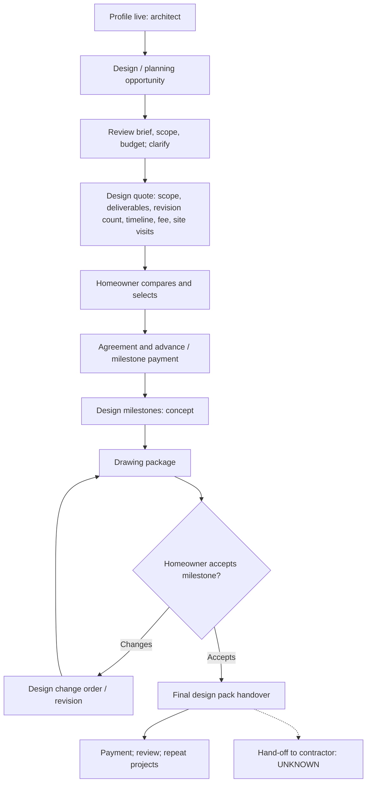

### 19.3 STE: structural engineer [D2]

> **Client decision (2026-10-03), CD-25.** Structural design is never AI-generated; the registered structural engineer designs and signs it. Whether the package includes full structural drawings for each house, and whether the retained engineer has the capacity, is CQ-22.

| Execution area | Behavior | Source / tag |
|---|---|---|
| Engineering scope | Structural specification lines A01, A02, A04, A05, A09, A12, A13, A19 | S04 §5 `EXPLICIT` |
| Sign-off | "Lines marked † are structural and must be issued under the sign-off of a registered structural engineer, not by Plan2Build alone. Plan2Build compiles and communicates; the engineer specifies." | S04 §3 |
| Approval role | "Approve safety-critical lines, version specification templates, review exceptions" (S06 §3); "Approve safety-critical specification lines, review exceptions, control expert versions" (S07 §8) | `EXPLICIT` [D2] |
| Versioning | DecisionVersion "schema_version, valid_from/to, approver, change reason" (S06 §7); master changes never alter issued instances (S04 §10) | `EXPLICIT` [D2] |
| Engineering rules | "Engineer-approved rules determine cost/specification outputs." (S06 §1); "Structural/safety lines require authorised engineer ownership/approval." (S06 §10) | `EXPLICIT` [D2] |
| AI boundary | Not automated: "Structural design/sign-off", "Safety-critical material grade/specification" (S06 §12; S07 §20) | `EXPLICIT` [D2] |
| Calculations, structural drawings, certification | Not described. Spec schema disclaimer: criteria "must be confirmed against the applicable Indian Standards and the project's structural design before issue" (S04 closing note); who produces the project's structural design is not stated | `UNKNOWN — REQUIRES CONFIRMATION` (POQ-023) |
| Site inspections | Not assigned to the engineer; gate inspections belong to the auditor (S05 P6) | `DERIVED` (from the role split) |
| Exceptions | "review exceptions" (S06 §3) | `EXPLICIT`; exception types `UNKNOWN` |
| Commercial independence | Structural lines "never brand-monetised" (S04 R9); workspace has "no commercial brand ranking" (S09 §1) | `EXPLICIT` |
| Package timing | Package A (structure) needs engineer sign-off; Package C does not ("It needs no engineer sign-off", S04 §10) | `EXPLICIT` |
| Authority to override assurance | Founder decision pending: "Approve assurance gates, remedy eligibility logic and who has authority to sign/override." | S06 §18.1 `OPEN QUESTION` |

Diagram 7: engineer flow.

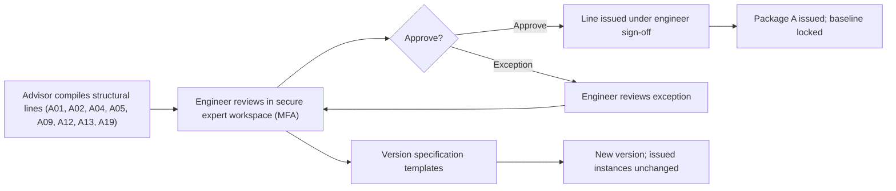

### 19.4 INT: interior designer / fit-out [D1 only]

> **Client decisions (2026-10-03), CD-01, CD-08, CD-09, CD-17, CD-18, CD-19.** Whether interior designers take part in the POC is CQ-08. When they do, the cross-role decisions apply: direct payments with marks, changes per CD-08, quote validity and versions, the recommendation, and the standard update format.

Role flow (S01 §24.4, verbatim): "SIGN UP → INTERIOR CATEGORY → PORTFOLIO/EXPERIENCE VERIFICATION → PROFILE LIVE → INTERIOR OPPORTUNITY → DESIGN / COMMERCIAL QUOTE → SELECTION → AGREEMENT → CONCEPT → MATERIAL/FINISH APPROVALS → EXECUTION UPDATES → CHANGE ORDERS → SNAG CLOSURE → HANDOVER → WARRANTY → REVIEW"

Category figure (S01 fig 4): 1 Professional registration → 2 Select Interior Designer / Fit-out category → 3 Submit identity + portfolio + specialization + experience → 4 Verification review → 5 Profile activated → 6 Receive relevant interior opportunities → 7 Review style, rooms, budget and finish scope → 8 Submit concept + commercial quote → 9 Homeowner compares and selects → 10 Agreement + design approval → 11 Design deliverables / BOQ / procurement plan → 12 Execution updates + approvals → 13 Change orders for scope variations → 14 Final installation / snag closure → 15 Handover + warranty / maintenance → 16 Review / reputation.

| Execution area | Behavior | Source / tag |
|---|---|---|
| Timing | "During/after core construction" | S01 §10.3 |
| Concept | "Concept boards"; "CONCEPT" stage | S01 §3, §24.4 |
| Room scope | "Rooms/areas" in quote; "rooms handled" in evaluation | S01 §3, §5.5 |
| Selections | "manage selections"; "MATERIAL/FINISH APPROVALS" | S02 §6.3; S01 §24.4 |
| Drawings | "drawings" in execution record | S01 §3 |
| Procurement | "procurement updates"; "procurement plan"; payments follow "procurement" milestones | S01 §3, fig 4, §5.5 |
| Execution | "execute scope-linked milestones, upload photos/documents" | S02 §6.3 |
| Installation | "installation progress"; "installation milestones" | S01 §3, §5.5 |
| Snagging | "snag closure" | S01 §3, §24.4 |
| Handover | "complete handover" | S02 §6.3 |
| Milestones | "Fit-out stages"; site updates "Primary" | S02 §21 |
| Change orders | "Material/scope changes" | S02 §21 |
| Warranty | "Fit-out/material warranty" | S02 §21 |
| D2 status | Referral partner category only ("Home Interior & Finishes ... Partner commission", S21, S22) | `EXPLICIT` |

Diagram 8: interior designer flow.

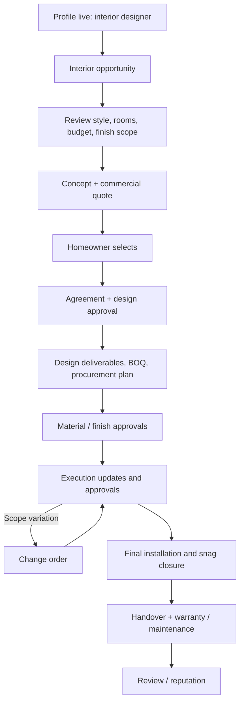

### 19.5 SPC: specialist service provider [D1 only]

> **Client decision (2026-10-03), CD-12.** After-handover needs at the MVP go to Plan2Build's back office; renovation and upgrades are "coming soon". No service-order flow is built (PRC-08). How the back office brings in a specialist is CQ-16.

Role flow (S01 §24.5, verbatim): "SIGN UP → SPECIALIST SUBTYPE → EVIDENCE / CERTIFICATION CHECK → PROFILE LIVE → SERVICE OPPORTUNITY → DIAGNOSE / REVIEW SCOPE → SERVICE QUOTE → SELECTION / APPOINTMENT → SERVICE ORDER → EXECUTION → BEFORE/AFTER PROOF → INVOICE → ACCEPTANCE → PAYMENT → WARRANTY / REMINDER → REVIEW"

Service-order model (S01 §5.6): "request → appointment → diagnosis/visit where needed → service → evidence → invoice → acceptance → settlement".

Category figure (S01 fig 5): 1 Professional registration → 2 Select Specialised Service category → 3 Choose subtype + service coverage → 4 Submit identity + license/certification evidence where applicable → 5 Verification review → 6 Profile activated → 7 Receive targeted service opportunities → 8 Review problem / scope / property details → 9 Quote service + timeline + warranty → 10 Homeowner selection / appointment → 11 Service order created → 12 Visit / execute work → 13 Upload proof / before-after / invoice → 14 Customer acceptance → 15 Payment settlement → 16 Review + repeat service eligibility.

| Execution area | Behavior | Source / tag |
|---|---|---|
| In-project engagement | A specialist can be engaged during the build: "Specialist service engagement: At any required stage" (S01 §10.3); "Engagement D: Specialist (e.g., Solar / Waterproofing / MEP)" (S02 §8); the homeowner "selects one or more professional categories" for the RFQ (S01 §9.1); the specialist then receives "targeted service opportunities" (S01 fig 5) through matching and invitation (T07, T10) | `EXPLICIT` [D1] |
| Request | Post-handover: homeowner service request: "Homeowner identifies need → Choose maintenance/repair/renovation/upgrade → Match service provider → Quote / appointment → Select → Service order → Completion proof → Payment → Review → Future reminder" (S01 §15.3); T40 "Create service request: ServiceRequest: PUBLISHED: Provider alerts" | `EXPLICIT` [D1] |
| Site visit / diagnosis | "diagnosis/visit where needed"; quote has "Visit/service scope, diagnosis" | S01 §5.6, §3 |
| Proposal | "Service quote" constrained to the need | S01 §24.5; S02 §6.4 |
| Appointment | T41 "Specialist: Accept service: ServiceOrder: SCHEDULED: Homeowner alert" | S01 §19 |
| Execution | "Visit / execute work" | S01 fig 5 |
| Evidence | "Before/after media"; "Upload proof / before-after / invoice" | S01 §3, fig 5 |
| Service report | "service report" | S01 §3 |
| Completion | T42 "Specialist: Complete service: MaintenanceRecord + evidence: PENDING_CONFIRMATION: Homeowner alert"; "completion creates a service record and warranty/maintenance hooks when applicable" | S01 §19; S02 §6.4 |
| Acceptance | "Customer acceptance" | S01 fig 5 |
| Warranty | "Category/service warranty"; "WARRANTY / REMINDER" | S02 §21; S01 §24.5 |
| Service request states | "DRAFT → PUBLISHED → QUOTING → SCHEDULED → IN_PROGRESS → PENDING_CONFIRMATION → COMPLETED → CANCELLED" | S01 App B |
| Post-handover maintenance | "Primary for service category" | S02 §21 |
| D2 status | Post-handover services are `SUPERSEDED` for the POC: "Renovation, maintenance and post-handover services: Follows the build record, not the MVP." (S05 §9). In-project specialists are simply absent from D2: the only D2 professional portal is the contractor's (S05 C1), so their exclusion is `DERIVED`, not stated. Solar is a referral line (S21, S22) | `SUPERSEDED` / `DERIVED` |

Diagram 9: specialist flow.

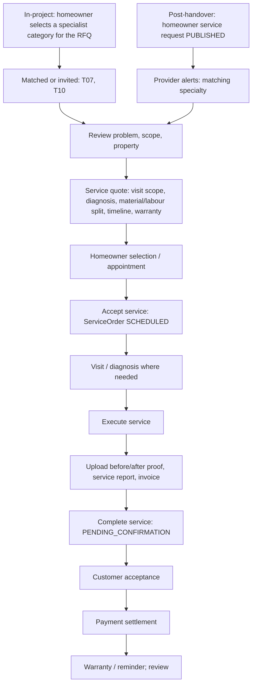

### 19.6 SUP: supplier

> **Client decision (2026-10-03), CD-13.** Material supply is out of scope for the MVP (phase 2); Plan2Build verifies and certifies materials only.

See section 23. No execution flow exists in any source.

### 19.7 AUD: quality auditor

> **Client decisions (2026-10-03), CD-05, CD-21.** Every auditor has a unique ID; whether the auditor is a person or a firm is CQ-15. Stage inspections are part of the homeowner's single package, so every package holder's house is inspected at the inspection stages.

D2 journeys (verbatim):

- S06 §5.3: "Open assigned project and gate; download job pack for offline use." "Confirm stage readiness and checklist version." "Capture item-by-item evidence; mark pass / observation / non-conformance / not-applicable." "For exceptions, record severity, note, photo/video and corrective action required." "Capture contractor/homeowner acknowledgement when relevant." "Sync; server locks report version and generates an inspection report." "Rectification evidence is submitted and closed by authorised reviewer; original evidence remains immutable."
- S08 §4: "Receive assignment → download job pack → work offline → complete gate checklist → capture photographs/video/measurements → record pass/observation/non-conformance → synchronise when connectivity returns → issue locked report → perform re-inspection where required."
- S09 §4: "Secure login → assignment → offline job-pack download → gate checklist → photos/measurements/tests → pass/observation/non-conformance → sync → locked report → rectification → re-inspection → closure."
- S07 §6: Assigned (Project + gate) → Offline pack (Download) → Readiness (Checklist version) → Inspect (Pass / Obs / NC) → Evidence (Photo / video / note) → Sync & lock (Report frozen) → Rectify (Re-inspect) → Close (Verified record).

| Execution area | Behavior | Source / tag |
|---|---|---|
| Assignment | Operations: "Gate scheduling (Assign auditor/readiness)" (S06 map 4); "Audit scheduling accounts for travel radius and shows cost per audit as it accrues." (S05 O1) | `EXPLICIT` [D2] |
| Readiness | "Confirm stage readiness and checklist version" (S06 §5.3). Who tells the auditor the stage is ready: `UNKNOWN` (POQ-024) | `EXPLICIT` / `UNKNOWN` |
| Checklist | "Structured checklist per gate" (S05 P6); audit_checkpoint_master "Checkpoints per gate, with expected evidence type" (S05 §5); templates versioned (S06 §10). The specification schema "is the audit checklist at each inspection gate" (S04 §1) | `EXPLICIT` |
| Inspections per house | S05 §2 sells "Six independent gate inspections", but Gate 3 runs for "each slab" (S04 §4) and stage 9 (Gate 4) repeats per floor (S04 §4; S05 rule 3), so a G+1 or G+2 house needs more than six visits (`DERIVED`). Capacity: "a retained consultant per city" (S03 §5.2) at "~₹4,000 per inspection" (S03 §7.3) | `AMBIGUOUS` (PAMB-029) |
| Outcomes per checkpoint | "pass / observation / non-conformance per checkpoint" (S05 P6); "not-applicable" also (S06 §5.3) | `EXPLICIT` |
| Evidence | "photographs, measurements, test results" (S05 P6); "Photographs are geotagged and timestamped at capture, and the sequence cannot be backdated." (S05 P6); "server-side hashing and immutable audit records" (S06 §3.2). S07 §6 says "timestamped, geotagged where permitted" and S06 §3.2 "approximate site location" (PC-043; S05 governs) | `EXPLICIT` |
| Tests | "Cube test results entered at 7 and 28 days attach retrospectively to the correct pour." (S05 P6); who performs the test: `UNKNOWN` | `EXPLICIT` / `UNKNOWN` |
| Offline | "Fully functional offline" (S05 P6); "Assume a multi-hour offline session." (S05 §7) | `EXPLICIT` |
| Blindness | "The auditor interface never displays the supplier or brand of the material being inspected." (S05 P6) | `EXPLICIT` |
| Acknowledgement | "Capture contractor/homeowner acknowledgement when relevant." (S06 §5.3) | `EXPLICIT` |
| Report | "A plain-language audit report PDF for the homeowner with technical detail appended, a pass status against the gate, and a tracked non-conformance register." (S05 P6); report locked (S07 §6); approved by central operations ("approve inspection reports", S06 §3) | `EXPLICIT` |
| NC closure | Re-inspection with "evidence and sign-off" (S05 P6; S07 §6) versus "closed by authorised reviewer" (S06 §5.3) | `CONFLICT` PC-021 |
| Concealed services | Captured at Gate 4 "room by room" (S04 §9; S05 P8) | `EXPLICIT` |
| Payment to auditor | "Retained consultant, ~₹4,000 per inspection" (S03 §7.3) | `EXPLICIT` |
| Language and device | "a module is not done until every criterion passes in Hindi as well as English" (S05 §6), which includes the auditor app (P6); "Contractor and auditor interfaces are phone-first" on "low-end Android" with "3GB RAM on a 3G connection" (S05 §7) | `EXPLICIT` [D2] |
| Acceptance test | "Auditor can inspect offline, sync, issue NC, collect closure evidence and lock report." (S06 §18) | `EXPLICIT` [D2] |
| D1 inspector | Inspection opened by "Homeowner/admin/assigned inspector where applicable", fields "Checkpoint, date, findings, evidence", states "Scheduled, Completed, Failed, Passed, Follow-up" (S02 §11); TX-030 "Inspection: Authorized actor: Inspection record: Evidence + finding" | `EXPLICIT` [D1] |

Additional diagram: auditor flow.

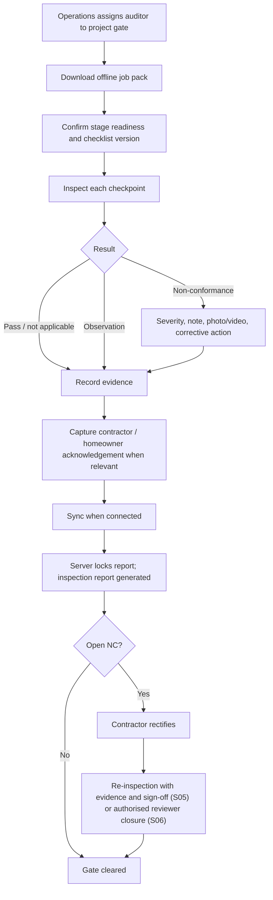

### 19.8 BRD: brand / manufacturer

> **Client decisions (2026-10-03), CD-18, CD-23.** The brand dashboard stays outside the pilot and appears only to communicate the future plan (our reading, CQ-19). Plan2Build still never recommends a brand.

| Area | D1 | D2 |
|---|---|---|
| Lifecycle | "Create brand account → Business verification → Add categories and catalogue → Set territories / dealers → Publish profile → Receive product enquiries or RFQs → Route to brand team / dealer → Respond with offer or recommendation → Update lead status → View product and territory analytics → Renew plan / listing" (S10 §4) | No portal (S06 §2); data product later "at roughly 200 houses in a city" (S03 §6) |
| Fulfilment | "Phase 1 treats brands primarily as verified discovery and lead-response partners; full order fulfilment is a later module." (S10 §4) | Not applicable |
| Products in specifications | Not applicable | Qualifying options only, never on specification lines (S05 rule 7); rules R1 to R9 (S04 §6) |
| Data received | "View product and territory analytics" (S10 §4) | "Specification share, switch rate, installation integrity, and warranty co-certification backed by evidence" at scale (S03 §4.1); aggregated and anonymised (S04 §7) |
| Co-certification | Not applicable | "Our verification allows them to extend a warranty on evidence rather than on trust — and turns our auditor from a cost line into a revenue line" (S03 §3.4); pilots "at around 50 houses" (S04 §7) |

### 19.9 PMC, PTN, LAB, APL

No execution behavior in any source (`UNKNOWN — REQUIRES CONFIRMATION`). Partners appear only as lines on the price boards (all six lines on S20 to S22; revenue types on S21, S22) and in the transaction layer (S03 §4).

---

## 20. Milestones / evidence

> **Client decision (2026-10-03), CD-19.** Milestone and site updates follow one standard format set by Plan2Build; its contents are CQ-11.

### 20.1 Milestone state machines

| Source | States |
|---|---|
| S02 §19 | "Upcoming → Ready → In Progress → Awaiting Review → Completed → Blocked → Cancelled" |
| S01 §19 | T23 IN_PROGRESS; T24 PENDING_APPROVAL; T25 APPROVED |
| S19 › 6 [MOCKUP] | "Foundation Completed", "Structure In Progress", "Plastering Pending", "Finishing Upcoming"; tiles "Photos (24)", "Invoices (3)", "Documents (12)"; "Pending" appears in no S01 or S02 list |
| S01 §12.2 | Example statuses "Completed / in progress", "Upcoming / in progress", "Upcoming / ready" |
| S02 §10.1 | "Milestone becomes Completed only when the configured completion rule is met." |
| D2 | Payment milestone "due on stage completion, and on audit clearance where the stage is a gate" (S05 P7); stage states not listed (project_stage has "progress", S05 §5) |

S02 uses "Awaiting Review" and "Completed"; S01 uses PENDING_APPROVAL and APPROVED. Recorded as PC-022.

### 20.2 Who owns each execution transition

| Action | D1 owner | D2 owner | Source |
|---|---|---|---|
| Start work | "Provider marks milestone ready to start or system reaches scheduled start." | `UNKNOWN` | S02 §10.1 |
| Stage / milestone update | Professional (T23; "Submit milestone update: Yes - assigned engagement") | `UNKNOWN` (contractor can "View / acknowledge" stages, S09 §3) | S01 §19; S02 §3 |
| Progress percentage | System-calculated; provider may propose; both stored | `UNKNOWN` | S01 §12.4 |
| Photos / videos | Professional (site update) | Auditor at gates | S01 §12.3; S05 P6 |
| Reports | Professional: "Site reports, invoices, progress reports" | Auditor: inspection report | S01 §14.1; S05 P6 |
| Documents | Professional uploads; "Upload document: Any authorized party" | Contractor uploads "selected documents" | S02 TX-028; S06 §3 |
| Completion request | Professional (T24 → PENDING_APPROVAL) | `UNKNOWN` | S01 §19 |
| Milestone approval | Homeowner (T25); "Homeowner / optional inspector" for early milestones; "Homeowner + required admin rule" for handover (S01 §12.2); "System/Admin/Homeowner per rule" (S02 TX-022) | Stage completion and audit clearance make payment due (S05 P7); approver of stage completion `UNKNOWN` | PC-023 |
| Inspection | Optional inspector or authorized actor | Retained auditor at six gates | S02 §11; S05 P6 |
| Homeowner acknowledgement | Milestone approval (T25) | Variations by OTP (S05 P5); line choices by OTP (S04 §8); inspection acknowledgement "when relevant" (S06 §5.3) | |
| Audit evidence | Not applicable | Auditor | S05 P6 |
| Rectification evidence | Issue "Resolution proof: Comment, image, document or inspection" | Submitted after NC (submitter not named; contractor channel supports it, S06 §4) | S01 §13.1; S06 §5.3 |
| Payment due | Homeowner pays via gateway (T19) | Recorded by either party with acknowledgement | S01 §19; S05 §5 |

### 20.3 Evidence rules

| Rule | Direction | Source |
|---|---|---|
| "Every milestone has evidence + approval logic." | D1 | S01 §23.2 |
| "System validates permissions + file metadata" on site updates | D1 | S01 §12.3 |
| "File: Upload fails or corrupted: Do not create a completed document record; allow retry" | D1 | S01 §20 |
| Document lifecycle "Uploaded → Processing → Available → Superseded → Archived" | D1 | S02 §19 |
| "Every log entry, quotation line, payment, document, photograph and audit result carries a foreign key to a specific stage instance and, where applicable, a specification line instance." | D2 | S05 rule 1 |
| "Photos/video/docs linked to checklist/decision/NC; metadata stored; upload resumable; retention rules configurable." | D2 | S06 §10 |
| "Inspection locked report cannot be edited; amendment creates separate record." | D2 | S06 §16.1 |
| "Evidence rule: No destructive edits after lock. Amendments and rectification are new records, not rewrites of inspection history." | D2 | S06 map 3 |
| Uploads: "virus scanning for uploads, content-type/size restrictions" | D2 | S06 §11 |

### 20.4 Handover checklist [D1]

Verbatim from S01 §15.1: "Final milestone completion evidence", "Snag / punch list closure", "Final invoice and payment reconciliation", "Final drawings / manuals / certificates", "Warranty records", "Supplier / material references", "Service contacts", "Project completion date", "User acceptance / sign-off". S02 §13: "Handover stores final documents, warranties, completion photos and final payment/completion status."; TX-031 "Handover: Provider + Homeowner: Engagement complete + handover record: All required docs".

D2 equivalent: the build record contents (S07 §13) and Gate 6 snag (S04 §4). Which handover documents the contractor must upload: `UNKNOWN — REQUIRES CONFIRMATION` (POQ-025).

---

## 21. Variations / change orders

### 21.1 Two models

> **Client decision (2026-10-03), CD-08.** Both models change for the POC: Plan2Build qualifies and quantifies every change, the other party acknowledges it by OTP, and there is no decline or rejection; disagreement goes to a discussion step led by Plan2Build, then closure. Waiting period, closure authority and acknowledgement timing are CQ-12.

| Aspect | D1 change order | D2 variation |
|---|---|---|
| Who can raise | T31: professional submits (S01 §19); "Provider or homeowner per policy" (S02 §11); TX-025 "Provider/Homeowner" | "Either party can raise; the other acknowledges with OTP before the variation takes effect." (S05 P5); contractor and homeowner both "Raise / acknowledge" (S09 §3) |
| Trigger | "Scope change identified" (S02 fig 8); commercial change discussed in chat (S01 §14.2) | Any "deviation from the locked baseline" (S05 P5); a specification line changed after OTP acknowledgement at Chosen: "any later change becomes a variation with cost and schedule impact attached" (S04 §8) |
| Affected stage | Linked to the milestone "if it affects scope, cost or schedule" (S02 §10.1) | "affected stage and specification line" (S05 P5 inputs) |
| Affected specification line | Not applicable; "resulting project-plan/BOQ revision" (S01 §13.2) | Yes (S05 P5); "affected stage/decision" (S07 §14 module H) |
| Reason | "reason" (S01 §13.2; S02 §11) | "reason category" (S05 P5, §5) |
| Cost impact | "additional/reduced cost" (S01 §13.2); "cost delta" (S02 §11) | "cost and schedule impact" (S05 P5) |
| Schedule impact | "timeline impact" (S01 §13.2); "time delta" (S02 §11) | As above; "Delay days carry a cause category and roll up into the project schedule position." (S05 P5) |
| Evidence | "attachments" (S01 §13.2); "documents" (S02 §11) | "supporting evidence" (S05 P5); "Reason + evidence" (S07 §12) |
| Review | REVIEW state after submission (S01 T31); "Homeowner review" (S02 fig 8); "Clarification" state (S02 §19) | No review state; operations "Manage / escalate" (S09 §3) |
| Acknowledgement / OTP | Not used | OTP acknowledgement by the other party (S05 P5; S07 §12 "Acknowledgement (OTP confirmation)") |
| Approval | Homeowner approves (T32; TX-026); "No change order becomes financially active until its approval rule is satisfied." (S02 fig 8) | The acknowledgement is the approval; S06 §10 adds "where possible" (PC-024) |
| Rejection | Homeowner rejects (T33; TX-027) → REJECTED, "Provider alert" | "approval/rejection" listed in module H (S06 §6) without behavior (`UNKNOWN`, POQ-026) |
| Escalation | Change order "User does not respond: Keep pending; do not silently apply" (S01 §20); "Change order conflicts with payment: Freeze conflicting state until resolved" (S02 §20) | "Unacknowledged variations escalate visibly to both parties after a configurable period." (S05 P5); exception feed lists "unacknowledged variations" (S05 O1) |
| Contract value update | "resulting project-plan/BOQ revision"; "The original contract/quote must remain immutable." (S01 §13.2) | "Approved variations update the running contract value and the projected completion date automatically." (S05 P5) |
| Completion date update | "timeline impact" recorded | "a revised completion date" (S05 P5 outputs) |
| Register | Not described | "A numbered variation register" (S05 P5) |
| Delay attribution | Not described | "an attribution record for every day of delay" (S05 P5) |
| Audit log | Change order "Yes" high-audit (S01 §18); "Every change order contains cost/time impact and approval trace." (S01 §23.2); "Notify + audit" (S02 fig 8) | "Audit trail on every state transition" (S05 §7); "version and audit trail" (S06 §6 module H) |
| States | "DRAFT → SUBMITTED → REVIEW → ACCEPTED / REJECTED → IMPLEMENTED → CLOSED" (S01 §13.2); "Draft, Submitted, Clarification, Approved, Rejected, Cancelled" (S02 §11, §19) (PC-025) | Status field (S06 §7); values `UNKNOWN` |
| Notifications | "Change order submitted" to homeowner and professional (S01 §14.3); to homeowner "Push + email" (S02 §14); "Change order approved/rejected: Professional + homeowner: Push + email: Engagement" (S02 §14) | "variation approvals" (S06 §6 module M); "Both parties receive the recorded change" (S09 §4) |
| Admin approval thresholds | "Change-order approval rules and whether certain monetary thresholds require admin approval." is open (S02 App B) | Not stated |
| Category variants | ARC "Design changes"; CON "Construction changes"; INT "Material/scope changes"; SPC "Technical scope changes" (S02 §21) | Contractor only |

### 21.2 How the professional's role differs from the homeowner's

| Direction | Professional | Homeowner | Source |
|---|---|---|---|
| D1 | Usually the raiser (T31); receives approval or rejection alert (T32, T33) | Approver (T32, T33; "Approve change order: Homeowner", S02 TX-026) | S01 §19; S02 §17 |
| D2 | Symmetric: raises client-requested changes so they are priced before building, and acknowledges homeowner-raised variations by OTP | Raises and acknowledges by OTP | S05 P5; S09 §3; S14 "Every change your client asks for is priced and acknowledged before you build it." |
| D2 | Sees "Approved variations" | Sees approved variations, current contract value and projected final cost | S07 §12 |
| D2 auditor | "View related evidence" | | S09 §3 |

### 21.3 Variation actions

| ID | Action | Actor | Direction | Result | Source |
|---|---|---|---|---|---|
| PA-052 | Draft and submit change order | Professional | D1 | REVIEW (S01) / Submitted (S02); homeowner alert | S01 T31; S02 TX-025 |
| PA-053 | Receive change order decision | Professional | D1 | ACCEPTED (plan update) or REJECTED | S01 T32, T33 |
| PA-054 | Implement accepted change order | Professional | D1 | IMPLEMENTED → CLOSED (actor not stated) | S01 §13.2 |
| PA-055 | Raise variation | Contractor | D2 | Pending homeowner OTP acknowledgement | S05 P5 |
| PA-056 | Acknowledge variation by OTP | Contractor | D2 | Variation takes effect; contract value and completion date update | S05 P5; S09 §4 |
| PA-057 | Ignore variation past configurable period | Contractor or homeowner | D2 | Visible escalation to both parties; exception feed | S05 P5, O1 |
| PA-058 | Record delay days with cause category | Not stated | D2 | Schedule position updated | S05 P5 |

### 21.4 Diagram 11: variation flow

```mermaid
flowchart TD
    subgraph D1["D1 change order"]
        A1["Scope change identified"] --> A2["Draft change order: old and new scope, reason, cost, time, attachments"]
        A2 --> A3["Submit: REVIEW; homeowner alert"]
        A3 --> A4{"Homeowner decision"}
        A4 -->|"Approve"| A5["ACCEPTED; engagement scope and plan updated; notify + audit"]
        A4 -->|"Reject"| A6["REJECTED; notify + audit"]
        A4 -->|"No response"| A7["Kept pending; never applied silently"]
        A5 --> A8["IMPLEMENTED then CLOSED"]
    end
    subgraph D2["D2 variation"]
        B1["Contractor or homeowner raises: stage, spec line, reason category, cost and schedule impact, evidence"] --> B2{"Other party acknowledges with OTP?"}
        B2 -->|"Yes"| B3["Variation takes effect; baseline preserved"]
        B3 --> B4["Current contract value and projected completion date update"]
        B4 --> B5["Both parties receive recorded change"]
        B2 -->|"Not within configurable period"| B6["Visible escalation to both parties; exception feed"]
        B6 --> B2
        B2 -->|"Rejected"| B7["Behavior UNKNOWN"]
    end
```

---

## 22. Payments / financials

### 22.1 What Plan2Build does with money, by direction

> **Client decisions (2026-10-03), CD-01, CD-09.** Plan2Build moves no money between homeowners and professionals, in any direction or path. Payments are direct; the homeowner marks paid and the professional marks received, yes or no, without amounts. Recording is optional.

| Question | D1 | D2 | D3 |
|---|---|---|---|
| Moves money between homeowner and professional? | S01: yes; the homeowner pays through the gateway, amounts are allocated to "milestone, platform fee and/or provider payable" and settled to the provider (S01 §11.1, §11.3). S02 also takes homeowner payments through the gateway but says "the exact fund-holding/settlement arrangement must be implemented according to the selected payment provider and business/legal model" and shows "Settlement tracked separately" (S02 §9, fig 6). S01 §23.1 lists "Exact payment/settlement business model and platform fee rules" as undecided (`OPEN QUESTION` POQ-031) | No: "Recording only — this module moves no money." (S05 P7); "Your client signs with you and pays you." (S14); "construction payment movement remains outside Plan2Build" (S09 §3) | `UNKNOWN` |
| Records money? | Yes: "Every rupee movement must have a payment record, gateway reference and project context." (S01 §11) | Yes: "payments recorded by either party with acknowledgement" (S05 §5) | `UNKNOWN` |
| Processes professional payments? | Settlement records exist in both (S01 §11.1 "Settlement: Record of provider payout / settlement"; S02 §9.1 "Settlement: provider-level payout/settlement record."); the payout arrangement itself is undecided (S02 §9; S01 §23.1) | No | `UNKNOWN` |
| Charges professional fees? | Configurable: "Lead access, subscription rules and commission treatment should be configurable by Super Admin." (S10 §4); open decision (S02 App B) | Not stated for contractors; "Listing is free for the contractors we invite." (S14) | Basic listing free; premium listing (S13) |
| Charges commissions? | "Commission/Fee: optional configurable platform fee record if the business model activates it." (S02 §9.1); super admin "Reconcile payments and commissions" (S10 §4) | From partners: "Partner commission" (S21, S22). From contractors: not stated | `UNKNOWN` |
| Charges subscriptions? | Service provider "Manage ratings, reviews, subscriptions and lead-performance analytics" (S10 §3); brand payments "Subscription/status" (S10 §3) | Not stated | "membership tiers" (S13 subtitle "Platform listing and membership tiers"); prices `UNKNOWN` |
| Charges listing fees? | Brand "Renew plan / listing" (S10 §4) | Free for invited contractors (S14) | Basic free (S13) |
| Supports premium listings? | "featured listings" (S10 §3 super-admin scope) | Not for contractors; brands: "Position is not for sale." (S14) | Premium listing tier (S13; price not stated); "Featured Professionals" are shown as "Top-Rated" with no paid marker (S23a [MOCKUP]; PAMB-034) |
| Supports escrow? | "The product should not describe funds as "escrow" unless the selected payment provider and the legal/commercial model actually support escrow-like custody." (S01 §11); "This blueprint does not assume an escrow model." (S02 §9) | Killed: "Escrow and payment gating" (S03 §6; S05 §9 "integrate no payment instrument and build no release mechanism"); S03 also says "Build the plumbing, switch it off, revisit past 200 houses." (PC-026) | `UNKNOWN` |
| Supports payouts? | Settlement states SETTLEMENT_PENDING, SETTLED (S01 §11.2) and Settled (S02 §9); arrangement undecided (as above); provider settlement is a commercial-launch item (S01 §22, "Yes, settlements/refunds/disputes") | No | `UNKNOWN` |

### 22.2 Financial relationships A to K

#### A. IHB → Professional

| Direction | Behavior | Source / tag |
|---|---|---|
| D1 | Homeowner pays milestone amounts through the gateway: "Milestone created → Amount due → Homeowner pays → Gateway success → Payment recorded → Milestone work progresses → Provider submits completion evidence → Homeowner/admin acceptance → Configured payable becomes eligible for settlement → Provider settlement → Milestone closed" (S01 §11.3). Category patterns: ARC "Advance + design milestones / final deliverable"; CON "Mobilization + construction milestones + final retention/closeout as configured"; INT "Design advance + procurement/execution milestones + handover"; SPC "Visit/diagnostic fee + service completion or single payment, depending service" (S01 §10.3). Provider "May invoice/request" (S02 §3); T27 "Raise invoice ... SUBMITTED ... Homeowner/admin alert" | `EXPLICIT` [D1] |
| D1 timing conflict | S01 §11.3 collects before work; S10 §4 hand-off "Milestone completed: Request approval/payment: Homeowner approves or raises issue"; S02 §10.1 step 7 "Payment request is triggered or released according to agreed payment terms."; S02 fig 6 starts "Milestone / invoice becomes payable"; IHB_FLOW C-060 | `CONFLICT` PC-027 |
| D2 | Outside Plan2Build. "Homeowner → contractor construction payment: Recorded/acknowledged where required; money movement remains outside Plan2Build in the current POC" (S08 §5). Milestones due "on stage completion, and on audit clearance where the stage is a gate" (S05 P7). Contractor "View recorded status" (S09 §3) | `EXPLICIT` [D2] |
| D3 | Not shown | `UNKNOWN` |

#### B. Professional → Supplier

| Direction | Behavior | Source / tag |
|---|---|---|
| D1 | Not described. Quote fields "materials responsibility" (CON), "procurement" (INT), "material/labour split" (SPC) show professionals may buy materials (S01 §3); no payment record is defined | `UNKNOWN — REQUIRES CONFIRMATION` |
| D2 | "Your contractor buys what meets the spec; our engineer checks that he did." (S14). The purchase is recorded as a ledger state (Purchased) with "purchase evidence" (S04 §9; S05 P8); the payment itself is not recorded | `EXPLICIT` (purchase recorded) / `UNKNOWN` (payment) |
| All | Credit terms, invoices between professional and supplier: not described | `UNKNOWN` |

#### C. IHB → Plan2Build

Not a professional payment, but it defines what the professional is not paying for. D2: advisory, Build Plan and assurance fees through Razorpay (S06 §9; S07 §16.9; S08 §5; S09 §3 "Pay Plan2Build fees"). D1: "platform fee" bucket in allocation (S01 §11.1). Price points and conflicts are in `IHB_FLOW.md` section 15.

#### D. Professional → Plan2Build

| Direction | Behavior | Source / tag |
|---|---|---|
| D1 service providers | Subscriptions, lead access and commissions configurable by super admin (S10 §4); service providers "Manage ... subscriptions" (S10 §3); amounts and rules not defined | `EXPLICIT` (configurable) / `UNKNOWN` (amounts) |
| D1 brands | "Payments: Subscription/status"; "Renew plan / listing" | S10 §3, §4 |
| D1 decision | "Exact payment settlement model and whether Plan2Build charges a commission, subscription, lead fee, or none in the first release." | S02 App B `OPEN QUESTION` |
| D2 contractors | "Listing is free for the contractors we invite." (S14). No contractor fee in any D2 source | `EXPLICIT` (free listing); other fees `UNKNOWN` |
| D2 partners and brands | "Partner commission" (building materials; interiors), "Referral fee" (finance, insurance, solar), "Ecosystem revenue" (partner brands / BTL) (S21, S22); payer of each is not named | `EXPLICIT` / `UNKNOWN` (payer) |
| D3 | Premium listing (S13); price `UNKNOWN` | `EXPLICIT` / `UNKNOWN` |

#### E. Plan2Build → Professional

| Direction | Behavior | Source / tag |
|---|---|---|
| D1 | Settlement of the provider payable after acceptance (S01 §11.3; T26 "Release configured payable: Settlement: SETTLEMENT_PENDING: Provider alert"); "Settlement: provider-level payout/settlement record." (S02 §9.1) | `EXPLICIT` [D1] |
| D2 retained structural engineer | "Retainer, ₹25,000/month" | S03 §7.3 |
| D2 retained auditor | "Retained consultant, ~₹4,000 per inspection" | S03 §7.3 |
| D2 capped remedy | "if we clear a gate and a structural defect in what we inspected surfaces later, we pay to fix it, capped" (S03 §3.3); who receives the money (homeowner or contractor) and the cap: `UNKNOWN` | `EXPLICIT` / `UNKNOWN` |
| D2 contractors | None | `EXPLICIT` (absence) |

#### F. Material transactions

| Direction | Behavior | Source / tag |
|---|---|---|
| D2 | "materials supplied at a disclosed margin" (S05 §2); "Where Plan2Build supplies a material, the margin in rupees appears on the specification sheet the family keeps." (S05 rule 10); "Supply at a disclosed margin is an operations process in the MVP, not a marketplace product." (S05 §9); "~₹70,000 per house" (S03 §4); pilot gate "Offer disclosed-margin materials on at least one category" (S03 §7.1 Gate 3); records "disclosed margin/referral records" (S06 §6 module K). S05 rule 8 makes structural lines "reject any attempt to associate manufacturer participation or margin"; whether that bars Plan2Build's own disclosed-margin supply of structural materials (concrete, ready-mix, steel) is `AMBIGUOUS` (PAMB-030) | `EXPLICIT` [D2] |
| D2 decision | "Choose whether material transactions are recorded as referral, disclosed margin sale, or both; this affects invoicing/data model." (S06 §18.1); "Whether we take materials margin, and on what disclosure terms" (S03 §9) | `OPEN QUESTION` POQ-027 |
| D2 who buys from Plan2Build | Not stated: the family, the contractor, or either (PAMB-010) | `AMBIGUOUS` |
| D1 | Brands: "full order fulfilment is a later module" (S10 §4); "logistics" outside Phase 1 (S10 §1) | `EXPLICIT` [D1] |
| D2 price boards | "Building Materials" with "Partner commission" (S21, S22); "Partner pricing" (S20) | `EXPLICIT` |
| D3 | "Material Supply" service (S23c) [MOCKUP] | `EXPLICIT`; flow `UNKNOWN` |

#### G. Referral fees

| Item | Behavior | Source |
|---|---|---|
| Lines | Finance ("Loans from leading banks and NBFCs"), insurance, solar and green: "Referral fee" | S21, S22 (S20 lists them under "Partner pricing") |
| Amount | "Finance, insurance, solar referral: ₹18,000" per house, month 6 | S03 §5.1 |
| Payer | Not stated | `UNKNOWN` |
| Disclosure | "No upfront platform fee. Any Plan2Build commercial relationship disclosed where applicable." | S20 |
| Contractor introductions | Listed in the transaction layer with referral fees (S03 §4: "Verified contractor introductions ... Disclosed margin on materials ... and referral fees"). Whether contractors pay an introduction fee: `UNKNOWN` (POQ-028) | `AMBIGUOUS` |

#### H. Commissions

D1: configurable commission (S10 §4; S02 §9.1). D2 price boards: "Partner commission" on building materials and on home interior and finishes (S21, S22). Rates, payers and timing: `UNKNOWN — REQUIRES CONFIRMATION`.

#### I. Listing fees

D2: none for invited contractors (S14). D3: basic listing free (S13). D1: brand "Renew plan / listing" (S10 §4); service-provider listing fees not named. Amounts: `UNKNOWN`.

#### J. Premium listing fees

D3: "Premium listing options include celebrity endorsements and portfolio assistance features." (S13). D1: "featured listings" (S10 §3). Price, placement effect and disclosure: `UNKNOWN`. Conflicts with D2 independence rules (PC-006).

#### K. Refunds

| Direction | Behavior | Source / tag |
|---|---|---|
| D1 | Refund states REFUND_PENDING → REFUNDED / REFUND_FAILED (S01 §11.2); "Partial refund: Create refund record against original transaction and update refundable balance"; "Full refund: Payment and relevant payable balances move to refunded state"; "Provider dispute: Freeze affected settlement if configured; create dispute record and admin task"; "Milestone cancelled after payment: Apply configured refund / reallocation policy and preserve audit history" (S01 §11.4); "Refund: Admin/Policy" (S02 TX-020); "Refund policy and dispute ownership" open (S01 §23.1) | `EXPLICIT` [D1] |
| D2 | Refunds of Plan2Build fees are an operations job ("refunds/exceptions", S06 §3). Refunds involving contractors: none (no money moves) | `EXPLICIT` |
| Professional-initiated refunds | Not described | `UNKNOWN` |

### 22.3 Payment and settlement states [D1]

| Source | States |
|---|---|
| S01 §11.2 | CREATED, INITIATED, PENDING, SUCCESS, FAILED, ALLOCATED, SETTLEMENT_PENDING, SETTLED, REFUND_PENDING, REFUNDED (plus RETRY and REFUND_FAILED as next states) |
| S02 §9, §19 | Initiated, Pending, Paid / Captured, Failed, Expired, Refund Requested, Refunded, Partially Refunded, Disputed, Settled |

Recorded as PC-028 (different state sets). Professional-facing states are SETTLEMENT_PENDING, SETTLED / Settled ("Settlement visible where appropriate", S02 §9) and the failure branch "SETTLEMENT_PENDING: Provider payout requested / queued: SETTLED / FAILED" (S01 §11.2); retry and notification after a failed payout are `UNKNOWN`. On a failed homeowner payment: "Payment fails: Keep milestone unpaid; show retry; do not duplicate invoice" (S01 §11.4).

### 22.4 D2 money position as seen by the contractor

> **Client decision (2026-10-03), CD-09.** The contractor marks payments received. No payment amounts are recorded, so "paid to date" and "due now" amounts do not exist. What else the contractor sees (contract value, change costs) is CQ-13.

| Figure | Contractor | Source |
|---|---|---|
| Approved variations | Yes | S07 §12 |
| Original / current contract value | Not listed for contractor (PC-018) | S07 §12 |
| Paid to date, due now, projected final cost | Not listed for contractor; S09 §3 gives "View recorded status" (PC-018) | S07 §12; S09 §3 |
| Cost booked against revenue by stage | Yes, contractor only | S05 P7 |
| Recording a payment | "recorded by either party with acknowledgement" (S05 §5); S09 gives recording to the homeowner ("record relevant payments") and the contractor only "View recorded status" (S09 §3) (PC-040) | S05 §5; S09 §3 |

### 22.5 D3 billing philosophy from the 1 October meeting

The meeting notes record one decision: "Project-based pricing model standard The team aligned on a pricing philosophy to charge clients for project completion rather than by hours." (S13). The summary speaks of "guaranteed project pricing" and "guaranteed project delivery pricing instead of hourly rates", and the details say Alok Jha proposed charging "for completing the entire project rather than being billed by the hour, emphasizing guaranteed delivery" (S13). Whether this applies to Plan2Build's own fees or to professionals' billing, and who guarantees delivery, is not stated. A delivery guarantee conflicts with the D2 position that "execution risk, supervision and liability stay with the contractor" (S03 §8.3) and "We never take the contract." (S14) (PC-046, POQ-056; IHB_FLOW C-072).

---

## 23. Materials / procurement and the supplier flow

> **Client decision (2026-10-03), CD-13.** Material supply is out of the MVP (phase 2); Plan2Build verifies and certifies only. The D2 disclosed-margin supply and the D3 material-supply columns of section 23.2 do not apply at the MVP. What "certification" covers is CQ-14.

### 23.1 Materials and procurement rules

| Rule | Professional affected | Source |
|---|---|---|
| "We never specify a brand." Brands appear "only as qualifying options against published technical criteria, in a separate and clearly distinct step, ordered by price and never by commercial relationship." | BRD, SUP | S05 rule 7 |
| "Every brand-relevant line shows at least three qualifying options with prices, one in the value tier, ordered by price." | BRD, SUP | S05 P3 |
| Qualification rules R1 to R9 (R2 "Minimum three options, maximum five"; R4 "A brand that fails cannot buy entry."; R5 "Order is never for sale."; R6 "The homeowner chooses, unprompted"; R8 yearly review with removal for "repeated verified installation failures"; R9 structural lines "never brand-monetised") | BRD, SUP | S04 §6 |
| Option ordering: "ordered by price" (S05 rule 7; S03 §4.2) versus "ordered by price or alphabetically" (S04 R5) | BRD | IHB_FLOW C-061; PC-029 |
| Structural lines carry brand categories ("Cement / RMC", "Steel", "Testing lab") while R9 forbids participation revenue on them | BRD, SUP, LAB | S04 §5, R9; IHB_FLOW C-065; PC-030 |
| "The auditor never sees the supplier." | AUD, SUP | S05 rule 9 |
| "Capture selected product separately from purchased product. A switch is a first-class event, not a note." | CON, SUP | S06 §10 |
| The specification "is the procurement list." | CON, SUP | S04 §1 |
| "Product qualification criteria and commercial relationships should be separate data fields and separate permissions." | BRD, SUP | S06 §11.1 |
| Switch rate: "Where dealers substitute them out at the counter" | SUP (dealer) | S04 §7 |
| Verification of delivery: "Verified at: Audit gate, site log entry, or delivery challan check." | CON, AUD | S04 §2 |
| Build record per line: "the product chosen, the purchase evidence, the installation date, the verification result, the warranty term and expiry, and the installer" | CON, SUP | S04 §9 |
| MaterialRecord "project decision, brand/product, selected/purchased/installed/verified metadata" | | S06 §7 |
| Procurement influence KPI: "Projects with ≥1 captured material purchase through/referred by P2B / eligible live projects" | | S06 §17 |
| Handover includes "Supplier / material references" | D1 professionals | S01 §15.1 |
| Long-lead items flagged: C19, C21 (10 weeks); C16, C17, C18, C20, C22, B07 (8 weeks); B14 (6 weeks) | CON (`DERIVED`: affects ordering) | S04 §8 |

### 23.2 SUPPLIER FLOW (investigation of every template stage)

| Stage | D1 brand journey (no supplier flow; dealers appear only as brand routing targets) | D2 (supplier on qualifying option; Plan2Build disclosed-margin supply) | D3 (trusted suppliers, material supply) |
|---|---|---|---|
| Supplier discovery | Brand creates an account (S10 §4) | Not described; products enter sets by meeting criteria (S04 R4) | "Discover quality building materials and home solutions from trusted suppliers." (S23b) |
| Registration | "Create brand account" (S10 §4); dealer registration `UNKNOWN` | `UNKNOWN` | `UNKNOWN` |
| Verification | "Business verification" (S10 §4) | Product qualification by "test certificates or IS conformity" (S04 R4); supplier verification `UNKNOWN` | `UNKNOWN` |
| Supplier profile | "verified brand profile" (S10 §3) | `UNKNOWN` | `UNKNOWN` |
| Product / material catalogue | "Add categories and catalogue" (S10 §4) | Qualifying options per line (S05 §5); a catalogue is "postponed": "Material marketplace/catalogue" (S06 §2) | Category chips: Tiles & Flooring, Sanitaryware, Doors & Windows, Lighting & Fixtures (S23b) |
| Eligibility | Territories and categories (S10 §3) | Published technical criteria (S04 R4); annual review (S04 R8) | `UNKNOWN` |
| Availability | `UNKNOWN` | Long lead times drive the decisions calendar (S04 §8); stock availability `UNKNOWN` | `UNKNOWN` |
| Lead / requirement | "Receive product enquiries or RFQs" (S10 §4) | The homeowner's choice at Options issued (S04 §2) | "Material Supply" service request (S23c) |
| Quotation | "Respond with offer or recommendation" (S10 §4) | Option "price" (S05 §5); supplier quotation `UNKNOWN` | `UNKNOWN` |
| Selection | Not described | "The homeowner chooses, unprompted" (S04 R6); OTP at Chosen (S04 §8) | `UNKNOWN` |
| Order | "full order fulfilment is a later module" (S10 §4) | Purchase recorded as Purchased; who places the order `UNKNOWN` | `UNKNOWN` |
| Payment | Not described | Disclosed-margin sale or referral (open, S06 §18.1) | `UNKNOWN` |
| Fulfillment | Later module (S10 §4) | Operations process (S05 §9) | `UNKNOWN` |
| Delivery | "logistics" outside Phase 1 (S10 §1) | "delivery challan check" as verification method (S04 §2); "delivery evidence" in build record (S07 §13) | `UNKNOWN` |
| Installation relationship | Not described | Installed state; installer named in warranty (S05 P8) | `UNKNOWN` |
| Warranty | Not described | "warranty term and expiry, and the installer" (S04 §9); co-certification later (S03 §3.4) | `UNKNOWN` |
| Returns / cancellation | Not described | Not described | `UNKNOWN` |
| Settlement | Not described | Not described | `UNKNOWN` |

### 23.3 Missing supplier requirements

The following are needed to build any supplier experience and are absent from every source (PMI-001 to PMI-003):

1. Whether "suppliers", "material suppliers", "dealers" and "brands" are one category or several (S13 lists "suppliers, material suppliers" separately; PAMB-011).
2. Supplier registration, KYC, GST and business verification.
3. Supplier profile fields, service territory and delivery radius.
4. Catalogue model: product, SKU, brand, specification grade, unit, rate, tax.
5. Availability and stock, lead times by supplier.
6. Requirement intake, supplier quotation and comparison.
7. Order placement (by homeowner, contractor or Plan2Build), order states, order cancellation.
8. Payment terms, invoicing, taxes, margin disclosure on supplier-facing documents.
9. Delivery scheduling, proof of delivery, short delivery, damaged goods, substitution handling.
10. Returns, replacements and warranty claims routing.
11. Settlement between Plan2Build, supplier and buyer.
12. Supplier ratings, suspension and removal (other than product removal under S04 R8).
13. Supplier notifications and communication channels.
14. Supplier visibility of homeowner data (only the brand rule in S04 §7 exists).

### 23.4 Diagram 10: supplier flow (supported stages only)

```mermaid
flowchart TD
    subgraph D2["D2 specification-led supply"]
        S1["Specification line issued (performance only)"] --> S2["Options issued: 3 to 5 qualifying products with prices, one value tier"]
        S2 --> S3["Homeowner chooses unprompted; OTP acknowledgement; line frozen into baseline"]
        S3 --> S4["Purchased: by contractor or through Plan2Build disclosed-margin supply (who orders UNKNOWN)"]
        S4 --> S5["Installed"]
        S5 --> S6["Verified at gate, site log or delivery challan; auditor blind to supplier"]
        S4 -.->|"Different product bought"| S7["Switch event recorded"]
        S6 --> S8["Build record: product, purchase evidence, installation date, warranty, installer"]
    end
    subgraph D1["D1 brand dashboard (not in POC)"]
        B1["Create brand account"] --> B2["Business verification"]
        B2 --> B3["Categories, catalogue, territories, dealers"]
        B3 --> B4["Publish profile"]
        B4 --> B5["Receive enquiries or RFQs"]
        B5 --> B6["Route to brand team / dealer"]
        B6 --> B7["Respond with offer or recommendation"]
        B7 --> B8["Update lead status; analytics; renew plan / listing"]
    end
    subgraph D3["D3 directory"]
        C1["Trusted suppliers listed"] --> C2["Homeowner requests Material Supply"]
        C2 --> C3["Everything after this UNKNOWN"]
    end
```

---

## 24. Reviews / reputation

### 24.1 Review behavior by direction

> **Client decision (2026-10-03), CD-22.** The client did not decide on reviews; Section 2 step 17 counts reviews only where they are enabled (CQ-17). The marketplace path that ended in a review is future intent.

| Question | D1 | D2 | D3 |
|---|---|---|---|
| Does the IHB review professionals? | Yes: T43 "Homeowner: Review professional: Review: SUBMITTED: Professional/admin optional" (S01 §19); "Review submission: Homeowner: Review record: Completed engagement" (S02 TX-035) | No review feature in any D2 source; ratings excluded (S05 §9) | Reviews shown (S23d "Client Reviews"; review counts on cards) |
| When | "Verified reviews: Homeowner after completed engagement: After closure" (S01 §16); "Project closes: Request review and archive: Both parties complete rating/feedback" (S10 §4) | Not applicable | `UNKNOWN` |
| Who can review | Homeowner (S01 §2 "Can create: ... reviews") | Not applicable | `UNKNOWN` |
| Can professionals review IHBs? | "Both parties complete rating/feedback" (S10 §4) suggests yes; S01 and S02 give only homeowner reviews (PAMB-012) | No | `UNKNOWN` |
| Professional response | "Collect and respond to reviews" (S10 §4); service provider "Reviews: Receive/respond"; brand "Receive/respond" (S10 §3) | Not applicable | `UNKNOWN` |
| Public? | Shown in comparison ("rating/reviews", S02 §4.4); board shows "4.8 / 5" and "Based on 36 reviews" (S19 › 7 [MOCKUP]) | No public rating: "The public profile carries verification status, portfolio and audit record — and no star rating, score or ranking." (S05 C1) | Yes (S23a, S23d, S24 › 4) |
| Affect ranking? | Fit score uses "profile quality" (S01 §8.2 rule); whether ratings feed it: `UNKNOWN` | Not applicable | "Featured Professionals — Top-Rated Professionals" (S23a); "Minimum Rating" filter (S23d) |
| Affect eligibility? | `UNKNOWN` | Not applicable | `UNKNOWN` |
| Moderation | "Ratings should never be editable by admins for convenience. If moderation is required, the review should be hidden/removed via a documented moderation action while preserving the original audit record." (S01 §16); "Reviews: Moderate policy violations; preserve published history: Reason and moderator recorded" (S02 §15) | Not applicable | `UNKNOWN`; meeting mentions "recommendation reviews" (S13) without explanation (PAMB-013) |
| Review disputes | `UNKNOWN — REQUIRES CONFIRMATION` | Not applicable | `UNKNOWN` |
| Removal | Hidden or removed by documented moderation action (S01 §16) | Not applicable | `UNKNOWN` |
| Suspension link | "Complaint / dispute rate" is a reputation metric (S01 §16); whether it triggers suspension: `UNKNOWN` | Not applicable | `UNKNOWN` |

### 24.2 Reputation metrics [D1]

Verbatim from S01 §16 ("Reputation is earned from verified platform activity, not only star ratings."):

| Metric | Source | Update timing |
|---|---|---|
| Verified reviews | Homeowner after completed engagement | After closure |
| Project count | Completed projects on platform | On completion |
| On-time delivery | Milestone schedule vs actual dates | At milestone / completion |
| Response rate | RFQ responses vs invitations | Rolling |
| Profile strength | Profile completeness + verification + documents | Continuous |
| Repeat business | Completed services with returning customers | At new selection |
| Complaint / dispute rate | Platform issue/dispute records | Rolling |

The board shows six of these seven metrics (no complaint / dispute rate), with sample values: "4.8 / 5", "34 Projects Completed", "92% On-time Delivery", "95% Response Rate", "90% Profile Strength", "65% Repeat Clients" (S19 › 7). "Automated professional scoring: Basic rules" in the MVP (S01 §22).

### 24.3 D2 reputation

- "Verified history can later become a contractor credential/profile, but public ratings are not an MVP requirement." (S06 §5.2)
- "Do not build public contractor ratings until there is sufficient verified project history to make them meaningful." (S06 §13.1); "verified contractor profiles" are a Phase 5 item (S06 §13).
- "reputation is represented through verification, portfolio and project/audit records" (S09 §3).
- "The inspection certifies your work. Your record sits on your profile and you can send it to anyone." (S14)
- Contractor value at scale: "A verified profile and audit record that justifies his price premium, and introductions that arrive pre-qualified" (S03 §4.1).
- Timing conflict: S05 C1 builds the public profile with the audit record in the MVP; S06 places verified profiles later (PC-031; IHB_FLOW C-067).

### 24.4 Retained professionals and brands

- STE and AUD: no reputation or review mechanism in any source (`UNKNOWN`).
- Products (not brands): "A product with repeated verified installation failures is removed from sets regardless of commercial relationship, and the removal is recorded." (S04 R8).

---

## 25. Suspension / rejection / expiry

### 25.1 Failure-path register

> **Client decisions (2026-10-03), CD-10, CD-16, CD-27.** Rejection at curation means the professional is not onboarded; section 44.8 proposes a waiting period before reapplying and the warning, suspension and removal triggers for members. Plan2Build's operations team handles exceptions and disputes.

| Path | Trigger | Actor | Preconditions | Resulting state | Notifications | Impact on active engagements | Impact on future opportunities | Access restrictions | Source / tag |
|---|---|---|---|---|---|---|---|---|---|
| Registration rejection | Not distinguished from verification rejection | Admin | | See verification rejection | | | | | S01 §4.2 `AMBIGUOUS` |
| Verification rejection | "Application declined" | Admin | Under Review | Rejected | "Verification result" to professional and admin (S01 §14.3) | None (not yet active) | "Cannot operate as verified professional"; re-application "based on policy" | Cannot discover, quote or deliver (`DERIVED` from S02 §5.1) | S02 §5.1 [D1] |
| Resubmission | "Incomplete documents" | Admin requests; professional resubmits | Under Review | Changes Required / RESUBMISSION_REQUIRED → Under Review | T45 "Professional notice" | None | Not yet eligible | "Edit requested fields, resubmit" | S01 §19, §20; S02 §5.1 [D1] |
| Credential expiry | Not defined | | | | | | | | `UNKNOWN` (PMI-005) |
| Credential loss | "If a provider loses a required credential" | Admin | Verified | Affected category suspended; account kept | `UNKNOWN` | `UNKNOWN` | No opportunities in that category (`DERIVED`) | Category only | S02 §6.5 [D1] |
| Suspension | "policy or operational action" | Admin; "Reason required" | Verified / active | SUSPENDED (S01 §4.4); Suspended (S02 §5.1) | T44 "Professional notice"; "Notify affected homeowner/provider" when active projects exist | "preserve active records"; "Admin reviews active engagements" | "Cannot accept new opportunities/quotes"; "Prevent new opportunities" | "blocks sensitive actions while preserving historical project records needed for operations and disputes" (S01 §21); "Prevent new commercial actions; preserve historic data" (S01 §20) | S01 §4.4, §19, §20, §21; S02 §5.1, §17, §20 [D1] |
| Category suspension | Credential loss | Admin ("suspend category") | Category verified | Category suspended | `UNKNOWN` | `UNKNOWN` | That category only | That category | S02 §6.5, §15 [D1] |
| Account closure | "Admin restores or closes" | Admin | Suspended | CLOSED: "Account no longer operational" | `UNKNOWN` | `UNKNOWN` | None | All | S01 §4.4 [D1] |
| Professional-initiated closure | Not defined | | | | | | | | `UNKNOWN` |
| Reinstatement | Investigation complete | Admin ("Investigate / reinstate"; "Admin restores"; "SUSPEND / RESTORE") | Suspended | Verified / ACTIVE | `UNKNOWN` | `UNKNOWN` | Restored (`DERIVED`) | Lifted | S01 §4.4, §24.6; S02 §5.1, §15 [D1] |
| Account compromise | "Account compromise suspected" | System / admin | Any | Sessions revoked "as policy dictates" | "Security notice" | `UNKNOWN` | `UNKNOWN` | Re-authentication | S02 §20 [D1] |
| Opportunity expiry | "closed by date/rule" | System / admin | Open | EXPIRED | `UNKNOWN` | None | That opportunity closed | | S01 §8.2 [D1] |
| Invitation expiry | Provider does not respond | System | RFQ_INVITED | Invitation expired; "do not mark quote as zero" | Optional reminder | None | Response rate metric (S01 §16, `DERIVED`) | | S01 §20 [D1] |
| Homeowner payment fails | Gateway failure | Gateway / system | Milestone due | Milestone stays unpaid | "show retry"; failure notice (T20) | "do not duplicate invoice" | None | None | S01 §11.4, T20 [D1] |
| Provider payout fails | Payout error | System | SETTLEMENT_PENDING | FAILED (S01 §11.2) | `UNKNOWN` | Settlement retry `UNKNOWN` | None | None | S01 §11.2 [D1] |
| Quote expiry | Validity passed | System | Submitted | EXPIRED | `UNKNOWN` | None | None | | S01 App B; S02 §19 [D1] |
| Quote withdrawal | Not described | Professional (`DERIVED`) | Submitted | WITHDRAWN | `UNKNOWN` | None | None | | S01 App B; S02 §19 [D1] |
| Late quote | "Quote submitted after deadline" | System | Deadline passed | Rejected or exception | "Provider sees reason" | None | None | | S02 §20 [D1] |
| Professional withdrawal from engagement | Not described | | | | | | | | `UNKNOWN` (POQ-018) |
| Project / engagement cancellation | Not described (state exists) | `UNKNOWN` | | Engagement "Cancelled" (S02 §19) | `UNKNOWN` | Refund / reallocation if milestone paid: "Apply configured refund / reallocation policy and preserve audit history" (S01 §11.4) | | | S02 §19; S01 §11.4 [D1] |
| Engagement dispute | Either party (S02 §11) or admin (S01 T34) | Admin resolves | Engagement exists | Engagement "Disputed" (S02 §19); dispute states (section 26) | "All relevant parties" (S01 T34) | "Freeze affected settlement if configured" (S01 §11.4); "Freeze relevant workflow if needed" (S02 §9) | `UNKNOWN` | | S01 §11.4, §13.3, §19; S02 §9, §11 [D1] |
| Removal from an active project | Not described | | | | | | | | `UNKNOWN` (POQ-029) |
| D2 contractor: any of the above | Not described, except that operations "handle exceptions and disputes" (S08 §4); process, states and SLAs not stated | Plan2Build operations | | | | | | | `UNKNOWN — REQUIRES CONFIRMATION` (POQ-030) |
| D3 listing: delisting, downgrade, premium expiry | Not described | | | | | | | | `UNKNOWN` |
| STE / AUD replacement | Not described | | | | | | | | `UNKNOWN` |

### 25.2 Diagram 12: suspension and re-verification

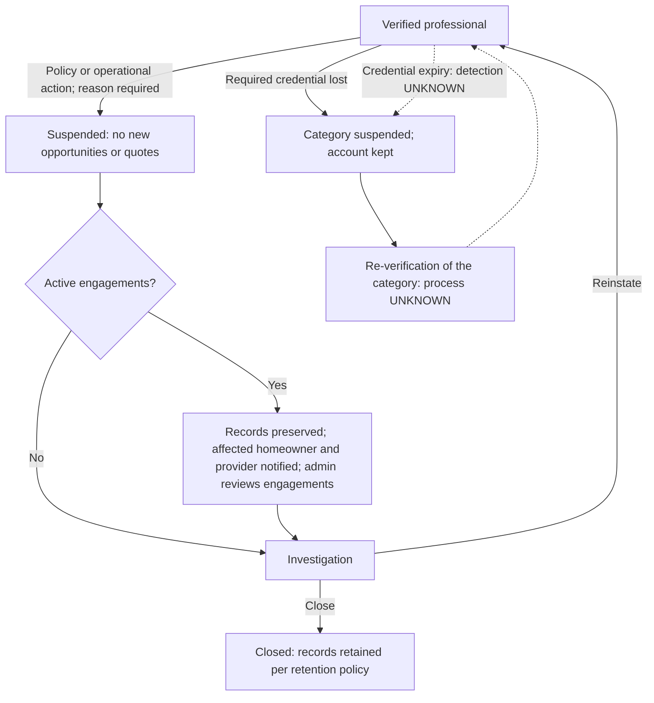

---

## 26. State machines

Each machine lists the states exactly as the sources name them. Where sources differ, each version is kept and the conflict is referenced. "Actor" comes from the source; `DERIVED` actors are marked.

| ID | Machine | Applies to | States (source wording) | Transitions (actor) | Source | Conflict / gap |
|---|---|---|---|---|---|---|
| PSM-01 | Professional account | D1 professionals | PENDING_EMAIL, ACTIVE, PENDING_REVIEW, RESUBMISSION_REQUIRED, VERIFIED, SUSPENDED, CLOSED | Verify email → ACTIVE; approve / reject / request resubmission (admin); upload corrected evidence → PENDING_REVIEW; "Admin restores or closes" | S01 §4.4; App B User "PENDING_EMAIL → ACTIVE → SUSPENDED → CLOSED" | Account and verification states mixed (PC-010) |
| PSM-02 | Verification case | D1 professionals | S01 §5.1: DRAFT, SUBMITTED, UNDER_REVIEW, NEEDS_RESUBMISSION, VERIFIED, REJECTED, SUSPENDED. S01 App B: RESUBMISSION_REQUIRED instead of NEEDS_RESUBMISSION. S02: Draft, Submitted, Under Review, Changes Required, Verified, Suspended, Rejected | Submit (professional); review, request changes, approve, reject, suspend, reinstate (admin) | S01 §5.1, App B; S02 §5.1, §19 | PC-010 |
| PSM-03 | Category verification | D1 professionals | Verified for a category; unverified for another; category suspended | Suspend category on credential loss (admin) | S02 §6.5, §15 | State names not given |
| PSM-04 | Contractor verification | D2 CON | "verification status" (values not stated) | Operations pipeline: reference calls, site visit | S05 §5, O1 | `UNKNOWN` values |
| PSM-05 | Opportunity participation | D1 professionals | DRAFT, MATCHING, PUBLISHED, VIEWED, INTERESTED, RFQ_INVITED, QUOTE_SUBMITTED, SELECTED, DECLINED, EXPIRED | DRAFT (homeowner); MATCHING (system); PUBLISHED (system / admin); VIEWED (system); INTERESTED (professional); RFQ_INVITED (homeowner / system); QUOTE_SUBMITTED (professional); SELECTED (homeowner); DECLINED (relevant actor); EXPIRED (system / admin) | S01 §8.2 | |
| PSM-06 | Opportunity object | D1 | "Open, paused, closed" | Not stated | S02 §7 | Differs from PSM-05 (object versus participation; PAMB-014) |
| PSM-07 | RFQ | D1; D2 | D1: "Draft, Open, Closed, Cancelled"; UPDATED on revision (T12). D2: "status" (values not stated) | Open RFQ (system / homeowner, TX-011); revise (homeowner, T12) | S02 §7, §17; S01 T12; S06 §7 | D2 values `UNKNOWN` |
| PSM-08 | Quote | D1; D2 | Section 13.3 | Submit, revise (professional); shortlist, accept (homeowner); expire (system) | S01 App B, §10.1; S02 §7, §19 | PC-011; D2 `UNKNOWN` |
| PSM-09 | Comparison | D1 | "Draft, Saved, Finalized"; COMPARING (T14) | Homeowner | S02 §7; S01 T14 | |
| PSM-10 | Engagement / agreement | D1 | "Pending, Active, Paused, Completed, Cancelled, Disputed" (S02 §7); "Pending Activation → Active → Paused → Completed → Cancelled → Disputed" (S02 §19); Agreement ACCEPTED (T17) | Accept (professional, T17); activate (system, T22) | S01 §10, §19; S02 §7, §19 | PAMB-007 |
| PSM-11 | Project (as seen by the professional) | D1 | S01 §12.1: DRAFT, PLANNING, RFQ_OPEN, PROVIDER_SELECTED, AGREEMENT_PENDING, ACTIVE, ON_HOLD, AT_RISK, COMPLETED, HANDOVER_PENDING, WARRANTY_ACTIVE, MAINTENANCE. S01 App B adds QUALIFIED. S02 §19: Draft / Onboarding, Qualified, Planning, Plan Confirmed, Open for Discovery, RFQ Open, Selecting, Active, On Hold, Completed, Handed Over, Archived | "Build: Milestone missed: Mark at-risk; trigger alerts; optional escalation" (S01 §20) | S01 §12.1, §20, App B; S02 §19 | IHB_FLOW SM-01 conflicts; PC-032 (handover ordering) |
| PSM-12 | Milestone | D1 | S02: "Upcoming → Ready → In Progress → Awaiting Review → Completed → Blocked → Cancelled". S01: IN_PROGRESS, PENDING_APPROVAL, APPROVED | Ready / in progress (provider or schedule); complete request (provider); approve (homeowner or per rule) | S02 §10.1, §19; S01 T23 to T25 | PC-022; PC-023 |
| PSM-13 | Stage and payment milestone | D2 CON | Payment milestone becomes due "on stage completion, and on audit clearance where the stage is a gate" | Not stated | S05 P7 | State names `UNKNOWN` |
| PSM-14 | Change order | D1 | "DRAFT → SUBMITTED → REVIEW → ACCEPTED / REJECTED → IMPLEMENTED → CLOSED" (S01 §13.2); "Draft, Submitted, Clarification, Approved, Rejected, Cancelled" (S02 §11, §19) | Submit (professional); approve / reject (homeowner) | S01 §13.2, T31 to T33; S02 §11, §19 | PC-025 |
| PSM-15 | Variation | D2 CON | Raised; acknowledged by OTP (takes effect); escalated when unacknowledged; status values not listed | Raise (either party); acknowledge (other party); escalate (system after configurable period) | S05 P5; S06 §7 | POQ-026 (rejection) |
| PSM-16 | Payment and settlement | D1 professionals | Section 22.3, including SETTLEMENT_PENDING → FAILED | Initiate (homeowner); confirm (gateway); allocate, release payable (system); settle | S01 §11; S02 §9, §19 | PC-028 |
| PSM-17 | Payment record | D2 CON | Recorded; acknowledged | Either party records; the other acknowledges | S05 §5, P7 | State names `DERIVED` |
| PSM-18 | Issue | D1 professionals | "OPEN → ACKNOWLEDGED → IN_PROGRESS → RESOLVED → VERIFIED → CLOSED", branch "ESCALATED / DISPUTED" (S01 §13.1); "Open, Acknowledged, In Progress, Resolved, Closed" (S02 §11, §19) | Raise (homeowner / professional); resolve (professional, T29; "Assignee", TX-024); verify / close (homeowner, T30); "No resolution by due date: Escalate to admin" (S01 §20) | S01 §13.1, §19, §20; S02 §11, §17, §19 | PC-033 |
| PSM-19 | Dispute | D1 professionals | "OPEN → EVIDENCE_COLLECTION → UNDER_REVIEW → RESOLUTION_PROPOSED → ACCEPTED / ESCALATED → CLOSED" (S01 §13.3); "Open, Under Review, Awaiting Response, Resolved, Closed" (S02 §11) | Open: admin (S01 T34) or any party (S02 TX-037); resolve: admin | S01 §13.3, T34, T35; S02 §11, §17 | PC-034 |
| PSM-20 | Review | D1 | SUBMITTED; hidden / removed by moderation | Submit (homeowner); moderate (admin) | S01 T43, §16 | Further states `UNKNOWN` |
| PSM-21 | Document | D1; D2 | D1: "Uploaded → Processing → Available → Superseded → Archived". D2: document "render status" | Upload (any authorised party) | S02 §19, TX-028; S05 §5 | |
| PSM-22 | Service request / order | D1 SPC | "DRAFT → PUBLISHED → QUOTING → SCHEDULED → IN_PROGRESS → PENDING_CONFIRMATION → COMPLETED → CANCELLED"; ServiceOrder SCHEDULED (T41) | Create (homeowner, T40); accept (specialist, T41); complete (specialist, T42) | S01 App B, §19 | `SUPERSEDED` for POC (S05 §9) |
| PSM-23 | Warranty | D1 professionals | "WARRANTY_REGISTERED → ACTIVE → EXPIRING_SOON → EXPIRED", branch "CLAIM_OPEN → RESOLVED → CLOSED" | Register (system, T38); create (system / provider, TX-032) | S01 §15.2, §19; S02 §17 | Professional role in claims `UNKNOWN` |
| PSM-24 | Gate inspection | D2 AUD | Assigned, Offline pack, Readiness, Inspect, Evidence, Sync & lock, Rectify, Close (journey steps used as states) | Assign (operations); inspect (auditor); lock (server); approve report (central operations) | S07 §6; S06 §3, §5.3 | Formal state names `UNKNOWN` |
| PSM-25 | Non-conformance | D2 AUD, CON | Open; rectification; re-inspection; closed; "status" field | Raise (auditor); rectify (contractor, `DERIVED`); close by re-inspection (S05) or authorised reviewer (S06) | S05 P6; S06 §5.3, §7; S09 §4 | PC-021 |
| PSM-26 | D1 inspection | D1 inspector | "Scheduled, Completed, Failed, Passed, Follow-up" | Opened by "Homeowner/admin/assigned inspector where applicable" | S02 §11 | |
| PSM-27 | Specification line ledger | D2 CON, SUP, BRD, AUD | "SPECIFIED → OPTIONS_ISSUED → CHOSEN → PURCHASED → INSTALLED → VERIFIED" | Chosen: homeowner OTP (S04 §8); Verified: gate or site log or challan (S04 §2); "Decision state cannot jump across invalid transitions without authorised override + reason." (S06 §16.1) | S06 §7.1; S04 §2, §8 | POQ-021 (who records Purchased, Installed) |
| PSM-28 | Brand lifecycle | D1 BRD | Journey steps only (account, verification, catalogue, territories, published, enquiries, lead status, renewal) | Approve (super admin, "Approve KYC / brands / listings") | S10 §4 | State names `UNKNOWN` |
| PSM-29 | Contractor participation | D2 CON | Invite, Profile, Receive RFQ, Submit quote, Validate, Clarify, Selected, Credential (journey steps) | | S06 map 2 | State names `UNKNOWN` |
| PSM-30 | Product qualification | D2 BRD / SUP products | Qualifies (enters set); in set; removed after review | Plan2Build (`DERIVED`) | S04 R4, R8 | State names `DERIVED` |
| PSM-31 | Supplier order / material fulfilment | SUP | None | | | `UNKNOWN — REQUIRES CONFIRMATION` (PMI-002) |
| PSM-32 | Suspension | D1 professionals | SUSPENDED / Suspended; category suspended | Suspend, reinstate, close (admin) | S01 §4.4; S02 §5.1, §6.5 | Diagram 12 |

---

## 27. Professional data model

Entity names are as the sources give them. D1 entities come from S01 §18 and S02 §18; D2 entities from S05 §5 and S06 §7. S05 §5 says its model is "Indicative rather than prescriptive — names and normalisation are yours to decide. What is not negotiable is that these concepts exist as first-class entities with stable identifiers". S01 §18: "Physical names can change during implementation, but the relationships should remain."

### 27.1 D1 professional-side entities

| ID | Entity | Purpose (source wording) | Fields named in sources | Relationships | Owner | Visibility | Lifecycle | Audit | Source |
|---|---|---|---|---|---|---|---|---|---|
| PDATA-001 | User | "Identity, authentication, account status" | Not listed for professionals | Has ProfessionalProfile (S02 fig 12) | User | Self, admin | PSM-01 | "Usually" high-audit | S01 §18 |
| PDATA-002 | ProfessionalProfile | "Professional business, specialization and service-area data"; "aggregate root for provider identity/service capability" | Section 10 (PF-001 to PF-028) | User → ProfessionalProfile → Quote, AuditEvent (S02 fig 12); "Engagement joins one Project + one ProfessionalProfile + one service scope." (S02 §18.1) | Professional | Eligible homeowners see comparison fields (S02 §4.4); admin | Draft until verified (S02 §5.1) | "Usually" | S01 §18; S02 §18.1 |
| PDATA-003 | VerificationCase | "Verification lifecycle and submitted evidence" | Status; evidence set; reviewer comments (S01 §20) | ProfessionalProfile → VerificationCase → VerificationDocument | Admin decides; professional submits | Professional sees "status and requested corrections" (S02 §22.2) | PSM-02 | "Reviewer, timestamp, reason, evidence set" (S02 §15) | S01 §5, §18 |
| PDATA-004 | VerificationDocument | "Individual evidence linked to verification" | Not listed | VerificationCase | Professional | Admin | Locked after submission unless resubmitted | "Usually" | S01 §18 |
| PDATA-005 | Opportunity | "Published need for professional discovery" | "Project, category, location, budget, scope, start date, eligible provider set" | Project → Opportunity/RFQ → Quote (S02 fig 12) | Homeowner / system | Eligible professionals | PSM-05, PSM-06 | "Usually" | S01 §18; S02 §7 |
| PDATA-006 | RFQ | "Request for quotation" | "Scope version, attachments, response deadline, invited/matched providers" | Opportunity; Quote | Homeowner / system | Invited professionals | PSM-07 | "Usually" | S01 §18; S02 §7 |
| PDATA-007 | Quote | "Professional commercial proposal" | "Amount, timeline, warranty, inclusions, exclusions, payment terms, attachments" | RFQ; ProfessionalProfile; Engagement | Professional | Homeowner; admin | PSM-08; "immutable by version once submitted" | "Yes" | S01 §18; S02 §7, §18.1 |
| PDATA-008 | QuoteLineItem | "Normalized / raw cost components" | Not listed | Quote | Professional (raw); system (normalized) | Homeowner; admin | Original and normalized kept separately (S01 §23.2) | "Usually" | S01 §18 |
| PDATA-009 | ComparisonSnapshot | "Frozen comparison view used for decision" | "Selected quotes, normalized scope, comparison metrics, homeowner notes" | Quotes | Homeowner | Homeowner | PSM-09 | "Usually" | S01 §18; S02 §7 |
| PDATA-010 | Selection | "Provider selection transaction" | "selected quote version, selected scope snapshot and timestamps" | Quote; Agreement | Homeowner | Homeowner; selected professional | Created at T16 | "Usually" | S01 §10.1, §18 |
| PDATA-011 | Agreement / Engagement | "Engagement record and accepted scope"; "Engagement joins one Project + one ProfessionalProfile + one service scope." | "Provider, project, category/scope, commercial terms, start date" | Project; ProfessionalProfile; Milestone, Invoice, Document, Issue, ChangeOrder, Review, Warranty (S02 fig 12) | System / parties | Parties; admin | PSM-10 | "Usually" | S01 §18; S02 §7, §18.1 |
| PDATA-012 | Milestone | "Project stage / deliverable" | Status, evidence, approval (S01 §12.2) | Engagement; Payment | Professional updates; homeowner approves | Parties | PSM-12 | "Usually" | S01 §18 |
| PDATA-013 | PaymentSchedule | "Defines expected amounts and due dates per project/milestone" | Amounts, due dates | Project; Milestone | System | Parties | Created T18 | "Usually" | S01 §11.1, §18 |
| PDATA-014 | PaymentIntent / Payment Attempt | "Represents an initiated collection attempt"; "one gateway transaction attempt" | Gateway order reference | PaymentSchedule | Homeowner | Homeowner; admin | PSM-16 | "Usually" | S01 §11.1; S02 §9.1 |
| PDATA-015 | PaymentTransaction / Payment | "Provider-confirmed transaction record"; "confirmed commercial payment record" | Gateway reference | Invoice; AuditEvent | System | Homeowner; professional "as applicable" | PSM-16 | "Yes" | S01 §11.1, §18; S02 §9.1 |
| PDATA-016 | PaymentAllocation | "How a successful amount maps to milestone, platform fee and/or provider payable" | Buckets | PaymentTransaction | System | Admin; parties (`DERIVED`) | ALLOCATED | "Yes" | S01 §11.1 |
| PDATA-017 | Invoice / Milestone Payment Request | "Commercial document tied to a project/quote/milestone"; "commercial request for payment"; "project-specific payable event" | Not listed | Engagement → Invoice → Payment (S02 fig 12) | Provider / system | Homeowner; admin | T27 SUBMITTED | "Usually" | S01 §11.1; S02 §9.1, TX-017 |
| PDATA-018 | Settlement | "Record of provider payout / settlement" | "settlement reference and date" (S02 §9) | Payment | System | Professional ("Settlement visible where appropriate") | SETTLEMENT_PENDING → SETTLED | "Yes" | S01 §11.1, §18; S02 §9 |
| PDATA-019 | Refund | "Reversal record linked to original payment" | Amount, reason | Payment | Admin / policy | Parties | REFUND_PENDING → REFUNDED | "Yes" | S01 §11.1; S02 §9.1 |
| PDATA-020 | Commission / Fee | "optional configurable platform fee record if the business model activates it" | Not listed | Payment | Plan2Build | Admin | Not stated | Not stated | S02 §9.1 |
| PDATA-021 | Issue | "Problem / issue lifecycle" | "Issue type", "Severity", "Reported by", "Location in project", "Evidence", "Assigned party", "Due date", "Resolution proof", "Closure actor" | Engagement | Raiser; assignee resolves | Project members | PSM-18 | "Usually" | S01 §13.1, §18 |
| PDATA-022 | ChangeOrder | "Scope/cost/timeline variation" | "old scope, requested new scope, reason, additional/reduced cost, timeline impact, attachments, requester, approver, approval timestamp and resulting project-plan/BOQ revision" | Engagement; Milestone | Raiser; homeowner approves | Parties | PSM-14 | "Yes" | S01 §13.2, §18 |
| PDATA-023 | Dispute | "Formal dispute case" | "Issue/transaction references, description, evidence" | Issue / transaction | Admin | Parties | PSM-19 | "Yes" | S01 §18; S02 §11 |
| PDATA-024 | Inspection | Inspection record | "Checkpoint, date, findings, evidence" | Project / milestone | "Homeowner/admin/assigned inspector where applicable" | Owner roles | PSM-26 | Audit on sensitive change | S02 §11, TX-030 |
| PDATA-025 | Document | "Project / transaction file metadata" | "project, engagement, uploader, category, version, created time and visibility" | Engagement | Uploader; class owners (S01 §14.1) | Membership and role rules | PSM-21 | "Usually"; view events "may be logged" | S01 §14.1, §18; S02 §12.1 |
| PDATA-026 | MessageThread / Message | "Context-specific communication" / "Individual communication event" | Context (Project, Opportunity, Quote, Service Order) | Project / engagement / RFQ | Members | Members; admin "controlled and auditable" | Not stated | "Usually" | S01 §14.2, §18; S02 §12.2 |
| PDATA-027 | Notification | "Outbound event" | Template, channel | Event | System | Recipient | "Delivery event logged" | "Usually" | S01 §18; S02 TX-039 |
| PDATA-028 | Review | "Verified feedback" | Not listed | Engagement → Review | Homeowner | Public in comparison (`DERIVED`, S02 §4.4) | PSM-20 | "Usually"; moderation keeps original | S01 §16, §18 |
| PDATA-029 | Warranty | "Warranty record" | "product/service, provider, start date, expiry date and evidence" | Engagement → Warranty → MaintenanceTask | System / provider | Homeowner | PSM-23 | "Usually" | S01 §18; S02 §13, TX-032 |
| PDATA-030 | ServiceRequest / ServiceOrder | "Post-handover request" | Not listed | Project | Homeowner / specialist | Matched specialists | PSM-22 | "Usually" | S01 §18, T40, T41 |
| PDATA-031 | MaintenanceRecord | "Completed service history" | Evidence | ServiceOrder | Specialist | Homeowner | PENDING_CONFIRMATION (T42) | "Usually" | S01 §18, T42 |
| PDATA-032 | AuditLog / AuditEvent | "Immutable admin/system action history" | "actor_id + actor_role + action + entity_type + entity_id + old_value_hash + new_value_hash + reason + IP/device metadata (as appropriate) + created_at" | All | System | Admin; "Own relevant records" for professionals (S02 §3) | Append-only | "Yes" | S01 §18, §21.1; S02 §18.1 |
| PDATA-033 | Brand records | Brand profile, product categories, catalogue, service territories, dealer contacts, enquiries / leads, lead status, analytics, plan / listing | As named | Brand → catalogue, territories, dealers, enquiries | Brand | Super admin approves | Brand journey (PSM-28) | Logged (S10 §4 super-admin note) | S10 §2, §3, §4 |
| PDATA-052 | PaymentEvent | "Raw webhook/status event for reconciliation" | Not listed | PaymentTransaction | System | Admin | Not stated | Not stated | S01 §11.1 |
| PDATA-053 | LedgerEntry | "Append-only accounting-style record for auditability" | Not listed | Payments, settlements | System | Admin | Append-only; "Financial records are immutable append-style transactions; corrections are represented by new records." (S01 §21) | Append-only | S01 §11.1, §21 |

### 27.2 D2 professional-side entities

| ID | Entity | Purpose (source wording) | Fields named in sources | Relationships | Owner | Visibility | Lifecycle | Audit | Source |
|---|---|---|---|---|---|---|---|---|---|
| PDATA-034 | contractor | Contractor record | "Firm, principal, verification status, reference call records, site visit record. No public rating or ranking field." | Quotes; projects (by role) | Operations (verification); contractor (profile) | Public profile: verification status, portfolio, audit record (S05 C1) | PSM-04 | Audit trail on every state transition (S05 §7) | S05 §5 |
| PDATA-035 | User (D2) | Identity | "user_id, role, contact, auth status, consent, organisation" | Project roles (per project, S05 P2) | User | Self; operations | Not stated | Consent logging (S06 §6 module A) | S06 §7 |
| PDATA-036 | rfq / RFQ | "The standard request issued to contractors for a project, with its BOQ, drawings, specification set and quotation format." | "rfq_id, project, pack version, issue date, invited contractors, status" | Project; quotes | Plan2Build | Invited contractors | PSM-07 | Audit | S05 §5; S06 §7 |
| PDATA-037 | quote / quote_line; Quote / QuoteLine | "A contractor response, mapped line by line to the RFQ scope." | "contractor, RFQ, line, price, inclusion/exclusion, alternate spec, validity" | rfq; normalisation adjustments | Contractor (or staff on his behalf) | Homeowner sees as submitted; internal costs hidden (S05 P4); other contractors never (S06 §16.1) | PSM-08 (D2 `UNKNOWN`) | Original preserved | S05 §5; S06 §7 |
| PDATA-038 | normalisation_adjustment; ComparisonFinding | "Per quote: the exclusions, grade differences and quantity differences found, each with a rupee impact and a reference to the specification line concerned. This is the comparison engine's output and must be auditable." | "scope delta, commercial impact, technical impact, clarification status" | quote; project_spec_line | Plan2Build | Homeowner; operations; not contractors (S09 §3) | Not stated | "must be auditable"; quote normalisation audited (S06 §11) | S05 §5; S06 §7 |
| PDATA-039 | variation / Variation | "Change orders: raiser, reason category, affected stage, cost and schedule impact, acknowledgement record." | "project, originator, description, cost/time impact, approvals, status" | project_stage; project_spec_line; contract_baseline | Raiser; acknowledger | Homeowner, contractor, operations | PSM-15 | "version and audit trail" (S06 §6 module H) | S05 §5; S06 §7 |
| PDATA-040 | contract_baseline | "Locked original scope, cost and schedule. Every variance is measured against this." | Scope, cost, schedule | Project; variations | Plan2Build (locked at Package A issue, S05 P3) | Original contract value: homeowner + authorised operations (S07 §12) | Locked | Audit | S05 §5 |
| PDATA-041 | payment_milestone / payment | "Amounts due against stages, and payments recorded by either party with acknowledgement. Recording only — no money movement." | Amounts, stage, acknowledgement | project_stage | Either party records | Contractor "View recorded status" (S09 §3) | PSM-13, PSM-17 | Audit | S05 §5 |
| PDATA-042 | audit_gate / audit_result / non_conformance; GateInspection / InspectionItem / NonConformance | "Inspection instances, checkpoint results, and tracked non-conformances with rectification and re-inspection." | GateInspection "project, gate, auditor, checklist version, start/end, result, locked report hash"; InspectionItem "inspection, checklist item, result, note, evidence refs, NC link"; NonConformance "severity, description, owner, due date, closure evidence, status"; the assurance module also holds "capped-remedy eligibility flags" (S06 §6 module I) | project_stage (gate) | Auditor; operations approve reports | Homeowner reports; contractor findings; never supplier to auditor | PSM-24, PSM-25 | Locked report hash; amendments separate (S06 §16.1) | S05 §5; S06 §7 |
| PDATA-043 | audit_checkpoint_master | "Checkpoints per gate, with expected evidence type." | Checkpoint, evidence type | Gates | Plan2Build operations | Auditor | Versioned templates (S06 §10) | Configuration audit (S06 §10) | S05 §5 |
| PDATA-044 | document (D2) | "Every generated artefact: type, version, project, render status, PDF reference, public share token." | As listed | Project | System | Public share token for customer documents (S05 rule 4) | Versioned | Deterministic regeneration (S05 §7) | S05 §5 |
| PDATA-045 | spec_line_master; DecisionDefinition; DecisionVersion | Master specification lines and versions | "Immutable code, title, performance criteria template, consuming stage, decide-by lead time in weeks, verification method, brand category, is_structural flag"; DecisionVersion "schema_version, valid_from/to, approver, change reason" | project_spec_line | Plan2Build; structural lines approved by STE | Not stated | Versioned; codes immutable | Approver recorded | S05 §5; S06 §7 |
| PDATA-046 | project_spec_line / ProjectDecision; spec_line_event / DecisionEvent | Project instance of a line and its append-only history | Instance: "issued performance criteria, current state, and the chosen option"; event: "state_from/to, actor, time, evidence, reason, source channel" | project; qualifying_option | Plan2Build issues; homeowner chooses | Homeowner first three states or all (PC-019); contractor channel (S06 §4) | PSM-27 | Append-only (S06 §7.1) | S05 §5; S06 §7 |
| PDATA-047 | qualifying_option | "Options presented against a specification line: product, supplier, price, technical evidence reference, qualification status. Never attached to a structural line." | As listed | project_spec_line | Plan2Build | Homeowner; never auditor (supplier) | PSM-30 | Ordering "reproducible from stored rules" (S06 §11.1) | S05 §5 |
| PDATA-048 | MaterialRecord | Material data per decision | "project decision, brand/product, selected/purchased/installed/verified metadata" | ProjectDecision | Not stated | Auditor blind to supplier | PSM-27 | Not stated | S06 §7 |
| PDATA-049 | project_stage / ProjectStage | Stage instance (repeating per floor) | "planned and actual dates, progress, and the floor it belongs to"; "status, dependency" | project; gates; payments | Plan2Build | Contractor "View / acknowledge" (S09 §3) | PSM-13 | Audit | S05 §5; S06 §7 |
| PDATA-050 | BOQLine | BOQ line | "project, item code, quantity, unit, rate version, amount, assumptions" | Project; RFQ pack | Plan2Build | Contractor via RFQ pack (rates: POQ-011) | Versioned with Build Plan | Not stated | S06 §7 |
| PDATA-051 | Payment (Plan2Build fees) | Fee payments through Razorpay | "invoice, line, amount, tax, payment gateway ref, status, reconciliation" | Project | Plan2Build | Homeowner; operations | Webhook-reconciled | Idempotent (S06 §16.1) | S06 §7 |

### 27.3 Entities that do not exist in any source

Supplier, supplier profile, product catalogue (outside D1 brands), stock, purchase order, delivery, return, supplier invoice, supplier settlement, credential (as a separate entity with expiry), professional subscription, listing tier, premium placement, lead fee, structural engineer engagement, auditor engagement contract, referral partner, referral record (other than "disclosed margin/referral records", S06 §6 module K). `UNKNOWN — REQUIRES CONFIRMATION` (PMI-008).

---

## 28. Permission matrix

### 28.1 PROFESSIONAL_PERMISSION_MATRIX

Values are source wording or short forms of it. "?" = `UNKNOWN — REQUIRES CONFIRMATION`. "No" = explicitly not permitted or not part of the role.

| Permission | ARC [D1] | CON [D1] | CON [D2] | INT [D1] | SPC [D1] | STE [D2] | AUD [D2] | SUP | BRD [D1] |
|---|---|---|---|---|---|---|---|---|---|
| View | "Eligible opportunities and own projects" (S01 §2) | Same | "only invited projects and their own submissions" (S06 §11) | Same as ARC | "Eligible service opportunities" (S01 §2) | Safety-critical lines (S06 §3) | "Gate-relevant view"; "Assigned gate" (S09 §3) | ? | Enquiries, own catalogue (S10 §3) |
| Create | "Professional profile, portfolio, quotes, project updates" (S01 §2) | "Professional profile, quotes, site updates, invoices, milestone requests" | Profile "Yes + verification"; quote (S09 §3) | "Professional profile, concepts, quotes, design updates" | "Professional profile, service quotes, service reports" | ? | "create findings" (S07 §8) | ? | Profile, catalogue, territories (S10 §3) |
| Edit | Own profile in Draft; requested fields in Changes Required (S02 §5.1); quote revision (S02 TX-013) | Same | ? | Same | Same | Templates: "version specification templates" (S06 §3) | No edit after lock; amendments only (S06 §16.1) | ? | "Maintain" (S10 §3) |
| Submit | Verification, quote, milestone update, change order, handover documents (S02 TX-009, TX-012, §3; S01 T31, T36); invoice: "May invoice/request" (S02 §3), T27 "Provider: Raise invoice", only after "Engagement active" (S02 TX-017); S01 §2 lists invoices only for CON | Same, invoices also in S01 §2 | Quote (S06 §3); variation (S05 P5; S09 §3; S06 §4) | Same as ARC | Same as ARC plus service completion (T42); invoice in the execution record (S01 §3, §5.6, fig 5) | ? | Inspection sync (S06 §5.3) | ? | Offer or recommendation (S10 §4) |
| Accept | Engagement (T17) | Engagement (T17) | Invitation: ? | Engagement | Service (T41) | ? | Assignment: ? | ? | ? |
| Reject | Opportunity: "Accept / reject / clarify" (S10 §4); DECLINED (S01 §8.2) | Same | ? | Same | Same | ? | ? | ? | ? |
| Withdraw | Quote WITHDRAWN (actor `DERIVED`) | Same | ? | Same | Same | No | No | ? | ? |
| Upload | Documents (S02 TX-028) | Photos, videos, documents (S01 §12.3) | "upload selected documents" (S06 §3) | Photos, documents (S02 §6.3) | Before/after proof, invoice (S01 fig 5) | ? | Photos, video, evidence (S05 P6) | ? | Catalogue (S10 §4) |
| Download | RFQ / brief (S02 §6.1); "Download RFQ/BOQ" (S19 › 5, a board for all four families) | "Download RFQ/BOQ" (S19 › 5) | RFQ pack (`DERIVED`) | "Download RFQ/BOQ" (S19 › 5) | "Download RFQ/BOQ" (S19 › 5) | ? | "download job pack for offline use" (S06 §5.3) | ? | ? |
| Quote | "Yes - verified and eligible" (S02 §3) | Same | Yes, standard format (S05 C1) | Same | Same | No | No | ? | "Yes/RFQ response" (S10 §3) |
| Respond | Clarifications (T11); resolve issues (T29 "Professional: Resolve issue"); disputes "Can raise/respond" (S02 §3); reviews "Receive/respond" (S10 §3) | Same | "answer clarifications" (S06 §3); "Respond to findings" (S09 §3) | Same as ARC | Same as ARC | "review exceptions" (S06 §3) | ? | ? | Reviews "Receive/respond" (S10 §3) |
| Approve | "Own quote, deliverables, project updates" (S01 §2) | "Own delivery updates and requests" | ? | "Own scope and deliverables" | "Own service delivery requests" | "Approve safety-critical lines" (S06 §3) | Pass status; "sync and sign" (S07 §8) | ? | ? |
| Acknowledge | Issue ACKNOWLEDGED (S01 §13.1) | Same | Scope (S06 §3); variations by OTP (S05 P5); stages "View / acknowledge"; payment records (S05 §5) | Same as ARC | Same as ARC | ? | ? | ? | ? |
| Raise variation | "Design changes" (S02 §21) | "Construction changes"; T31 | "Raise / acknowledge" (S09 §3) | "Material/scope changes" | "Technical scope changes" | No | No: "View related evidence" (S09 §3) | ? | No |
| View IHB information | Section 17.2 | Section 17.2 | Section 17.2 | Section 17.2 | Section 17.2 | ? | Site (`DERIVED`) | ? | ? [D1]; No [D2] (S04 §7) |
| View project | Own projects | Own projects | Invited projects | Own projects | Own service orders | ? | Assigned gate | ? | No |
| View financial data | Own engagement payments (S01 §14.3); payable release alert (T26 "Provider alert") | Same | "View recorded status" (S09 §3); cost against revenue by stage (S05 P7); contract values: PC-018 | Same as ARC | Same as ARC | No | "No payment action" (S09 §3) | ? | Own subscription (S10 §3) |
| View competitor information | Aggregates (S19 › 4 [MOCKUP]) | Aggregates | No (S06 §16.1) | Aggregates | Aggregates | No | No | ? | No |
| Upload progress | "When relevant" (S02 §21) | "Primary" | ? | "Primary" | "When relevant" | No | No | ? | No |
| Upload evidence | Yes | Yes | "provide agreed evidence" (S09 §4) | Yes | Yes | No | Yes | ? | No |
| Complete milestone | Request (T24) | Request (T24) | ? | Request | Complete service (T42) | No | Gate pass status | ? | No |
| Communicate | Project messaging (S01 §14.2) | Same | "Notifications / messaging: Yes" (S09 §3) | Same | Same | Secure workspace | "Notifications / messaging: Yes" (S09 §3) | ? | "Messaging/notifications: Yes" (S10 §3) |
| Review | Respond to reviews (S10 §3); rate homeowner: PAMB-012 | Same | No reviews | Same | Same | No | No | ? | Receive / respond |
| Manage products | No | No | No | No | No | No | No | ? | Yes (S10 §3) |
| Manage catalogue | No | No | No | No | No | No | No | ? | Yes (S10 §4) |
| Manage inventory | No | No | No | No | No | No | No | ? | ? |
| Manage orders | No | No | No | No | No | No | No | ? | "Order/enquiry status" (S10 §3); fulfilment later (S10 §4) |
| Analytics | "Lead/business" for service providers (S10 §3) | Same | "Project/RFQ view" (S09 §3) | Same as ARC | Same as ARC | ? | "Assignment view" (S09 §3) | ? | "Lead/product" (S10 §3) |

### 28.2 NOT PERMITTED / RESTRICTED ACTIONS

| ID | Restriction | Applies to | Source |
|---|---|---|---|
| PNP-01 | A contractor cannot see another contractor's quotation | CON [D2] | S06 §16.1 |
| PNP-02 | A contractor cannot access other contractors' commercial data or homeowner-private comparison information | CON [D2] | S09 §3 |
| PNP-03 | Contractor input costs, margins and internal rates must never be shown to a homeowner | Homeowner (protects CON) | S05 P4, §7 |
| PNP-04 | No feature may sort or filter contractors by price | Platform [D2] | S05 C1 |
| PNP-05 | No auction, bidding, countdown or price-ranked listing | Platform [D2] | S05 P4; S03 §6 |
| PNP-06 | No contractor rating, score, star or league table | Platform [D2] | S05 §9, C1 |
| PNP-07 | The auditor never sees the supplier or brand of inspected material | AUD | S05 rule 9, P6 |
| PNP-08 | No brand on a specification line; no commercial data on structural lines | BRD, SUP | S05 rules 7, 8 |
| PNP-09 | A failing product cannot buy entry; order is never for sale | BRD | S04 R4, R5 |
| PNP-10 | No homeowner identity, address or contact supplied to a brand | BRD | S04 §7 |
| PNP-11 | A suspended professional cannot accept new opportunities or quotes | D1 professionals | S02 §5.1 |
| PNP-12 | Only verified and eligible providers may submit quotes | D1 professionals | S02 §3, TX-012 |
| PNP-13 | A contractor must not access unrelated specialist scope unless explicitly authorized | CON [D1] | S02 §8 |
| PNP-14 | Normalisation never overwrites the professional's submitted values | Platform | S01 §9.3; S06 §16.1 |
| PNP-15 | Admins never edit ratings for convenience | Admin | S01 §16 |
| PNP-16 | A locked inspection report cannot be edited; amendments are separate records | AUD, operations | S06 §16.1 |
| PNP-17 | Admin never silently alters provider quote history | Admin | S02 §15 |
| PNP-18 | A variation does not take effect before the other party's OTP acknowledgement | CON [D2] | S05 P5 |
| PNP-19 | No change order becomes financially active before its approval rule is satisfied; unanswered change orders are never applied silently | D1 professionals | S02 fig 8; S01 §20 |
| PNP-20 | Locked verification evidence cannot be changed unless resubmitted | D1 professionals | S02 §5.1 |
| PNP-21 | AI may not perform structural design or sign-off, or set safety-critical grades | STE (protects role) | S06 §12; S07 §20 |
| PNP-22 | Progress percentage cannot be manually edited without an audit record | D1 professionals | S01 §12.4 |
| PNP-23 | Plan2Build does not recommend one qualifying brand over another | Plan2Build (affects BRD) | S04 R6 |
| PNP-24 | Inspection photos cannot be backdated | AUD | S05 P6 |
| PNP-25 | A non-conformance cannot be closed without a re-inspection record with evidence and sign-off (S05); S06 allows an authorised reviewer (PC-021) | AUD, CON | S05 P6; S06 §5.3 |
| PNP-26 | Offline sync must not duplicate checklist or evidence rows | AUD | S06 §16.1 |
| PNP-27 | Contractors never sign with or are replaced by Plan2Build ("We never take the contract") | Plan2Build [D2] | S14; S05 §2 |
| PNP-28 | Admin manual overrides require a reason and an audit event | Admin | S01 §17.1, §20 |
| PNP-29 | A professional cannot create a homeowner project or edit the homeowner's planning inputs (S02 §3 rows "Create own project" and "Edit own planning inputs": Professional column "No") | D1 professionals | S02 §3 |
| PNP-30 | A professional cannot accept a quote, verify professionals or suspend accounts (S02 §3 rows "Accept quote", "Verify professional", "Suspend account": Professional "No") | D1 professionals | S02 §3 |
| PNP-31 | Contractors and auditors cannot create a project or requirement (S09 §3 row "Create project / requirement": Contractor and Auditor columns "No"); auditors have "No payment action" and RFQ access "No" | CON [D2], AUD | S09 §3 |
| PNP-32 | An auditor's access is "limited to the evidence required for independent verification" | AUD | S09 §3 |
| PNP-33 | Financial records are never edited; "corrections are represented by new records" | D1 professionals (payments, settlements) | S01 §21 |

---

## 29. Notification matrix

### 29.1 PROFESSIONAL_NOTIFICATION_MATRIX

The mandatory or optional status is almost never stated: "Notification preferences and which events are mandatory vs optional" is an open decision (S02 App B), and D2 says "User can control non-essential messages." (S06 §10). Where a source marks a recipient "optional", that is reproduced. Templates are not defined anywhere ("Notification channels and templates" is an open decision, S01 §23.1); none are invented here.

| ID | Event | Trigger | Recipient | Channel | Mandatory / optional | Deep link | Content purpose | Direction / source |
|---|---|---|---|---|---|---|---|---|
| PNOT-01 | Registration | T01 account created | Registering user | Email ("Verification email"); Resend for "OTP, verification, password reset and transactional email" (S10 §5) | Not stated | Not stated | Verify email | D1: S01 §19 T01 |
| PNOT-02 | Email verified | T02 | User | Not stated | Not stated | Not stated | "Welcome / next step" | D1: S01 T02 |
| PNOT-03 | OTP | Login or invitation | Contractor | "Email + SMS: OTP, urgent reminders, key transactional links" (S07 §16.7) | Not stated | Project link (S07 §5) | Authenticate | D2: S06 §3; S07 §5, §16.7 |
| PNOT-04 | Verification submitted | TX-009 | Not stated | Not stated | Not stated | Not stated | Not stated | `UNKNOWN` |
| PNOT-05 | Verification approved | T46; TX-010 | Professional; admin also receives "Verification result" (S01 §14.3) | "Email + push" | Not stated | "Professional profile" | Activation | D1: S01 §14.3, T46; S02 §14, TX-010 "Audit + notification" |
| PNOT-06 | Resubmission requested | T45 | Professional | Not stated | Not stated | Not stated | "Professional notice"; requested corrections visible (S02 §22.2) | D1: S01 T45 |
| PNOT-07 | Verification rejected | Admin rejects | Professional; admin | Not stated | Not stated | Not stated | "Verification result" | D1: S01 §14.3 |
| PNOT-08 | Opportunity matched | T07 | Professional | "Push + email" | Admin copy "Optional" (S01 §14.3) | "Opportunity details" | "New matching opportunity" | D1: S01 §14.3, T07; S02 §14 |
| PNOT-09 | Interest expressed | T09 | Homeowner / system | Not stated | "Homeowner/system optional" | Not stated | Inform homeowner | D1: S01 T09 |
| PNOT-10 | Invited to RFQ | T10 | Provider | Not stated | Not stated | Brief (S01 §9.1) | "Provider alert"; "Providers receive a notification and can open the full brief." | D1: S01 §9.1, T10 |
| PNOT-11 | RFQ issued / reminder | RFQ issued; reminder rules | Contractor | Web/PWA + WhatsApp for contractors (S06 §1); "WhatsApp Business API provider + SMS fallback + email" (S06 §9); email + SMS first in S07 §17 (PC-039) | Suppression rules (S06 §10) | Not stated | "RFQ reminders"; "Receive notifications for RFQs" | D2: S06 §6 module M; S09 §3 |
| PNOT-12 | RFQ revised | T12 | Provider | Not stated | Not stated | Not stated | "Provider alert" | D1: S01 T12 |
| PNOT-13 | Clarification raised | T11 | Homeowner [D1]; contractor [D2] | Not stated | Not stated | Not stated | "Homeowner alert" [D1]; contractor receives "clarifications" notifications [D2] | D1: S01 T11; D2: S09 §3 |
| PNOT-14 | Quote deadline | Deadline approaching | Not defined | | | | No deadline reminder in any source; D2 forbids a "countdown" (S05 P4) | `UNKNOWN` |
| PNOT-15 | Quote submitted | T13 | Homeowner | "Push + email" | Admin "Optional" (S01 §14.3) | "Compare / quote" | "Quote received" | D1: S01 §14.3, T13; S02 §14. Confirmation to the professional: `UNKNOWN` |
| PNOT-16 | Late quote | Submitted after deadline | Provider | Not stated | Not stated | Not stated | "Provider sees reason" | D1: S02 §20 |
| PNOT-17 | Shortlisted | T15 | Professional | "Push" | "Professional optional" (S01 T15) | "Quote / project" | "Quote shortlisted" | D1: S01 T15; S02 §14 |
| PNOT-18 | Selected | T16; TX-015 | Selected professional + homeowner | "Push + email" | Not stated | "Engagement" | "Quote accepted" | D1: S01 T16; S02 §14 |
| PNOT-19 | Not selected | Other providers closed | Not stated | | | | | `UNKNOWN` [D1, D2] |
| PNOT-20 | Engagement accepted | T17 | Homeowner | Not stated | Not stated | Not stated | "Homeowner alert" | D1: S01 T17 |
| PNOT-21 | Payment due | T18 | Homeowner; professional "as relevant" | Not stated | Not stated | Not stated | "Payment reminder" | D1: S01 §14.3, T18 |
| PNOT-22 | Project activated | T22 | Project parties (`DERIVED`) | Not stated | Not stated | Not stated | "Project-start notification" | D1: S01 T22 |
| PNOT-23 | Milestone updated | T23 | Homeowner | "Push + email" | Admin "Optional" | "Build dashboard" | Progress | D1: S01 §14.3; S02 §14 |
| PNOT-24 | Completion requested | T24 | Homeowner | Not stated | Not stated | Not stated | "Homeowner alert" | D1: S01 T24 |
| PNOT-25 | Milestone approved | T25 | Provider | Not stated | Not stated | Not stated | "Provider alert" | D1: S01 T25 |
| PNOT-26 | Payable released | T26 | Provider | Not stated | Not stated | Not stated | "Provider alert" | D1: S01 T26 |
| PNOT-27 | Payment success | Gateway success | Homeowner + professional "as applicable" | "Push + email" | Admin "Optional" | "Payment / invoice" | Receipt | D1: S01 §14.3; S02 §14 |
| PNOT-28 | Payment failure | Gateway failure | Homeowner | Not stated | Not stated | Not stated | "Receipt / failure notice" (T20) | D1: S01 T20 |
| PNOT-29 | Invoice raised | T27 | Homeowner / admin | Not stated | Not stated | Not stated | "Homeowner/admin alert" | D1: S01 T27 |
| PNOT-30 | Issue raised | T28 | Professional; admin; homeowner if raised by others | "Push + email" | Not stated | "Issue detail" | "Issue created" to "Other party + admin when required" | D1: S01 §14.3, T28; S02 §14 |
| PNOT-31 | Issue resolved / closed | T29, T30 | Homeowner (T29); provider (T30) | Not stated | Not stated | Not stated | Alerts | D1: S01 T29, T30 |
| PNOT-32 | Change order submitted | T31 | Homeowner; professional (S01 §14.3) | "Push + email" to homeowner | Admin "Optional" | "Change order" | Review | D1: S01 §14.3, T31; S02 §14 |
| PNOT-33 | Change order approved / rejected | T32, T33 | Professional + homeowner | "Push + email" | Not stated | "Engagement" | Decision | D1: S01 T32, T33; S02 §14 |
| PNOT-34 | Variation needs acknowledgement / approved | Raised; acknowledged | Both parties | Not stated | Not stated | Not stated | "variation approvals"; "Both parties receive the recorded change" | D2: S06 §6 module M; S09 §4 |
| PNOT-35 | Variation unacknowledged | Configurable period passes | Both parties | Not stated | Not stated | Not stated | "escalate visibly to both parties" | D2: S05 P5 |
| PNOT-36 | Dispute opened | T34 | "All relevant parties"; homeowner, professional, admin (S01 §14.3) | Not stated | Not stated | Not stated | Inform | D1: S01 §14.3, T34 |
| PNOT-37 | Dispute resolved | T35 | "Parties notified" | Not stated | Not stated | Not stated | Outcome | D1: S01 T35 |
| PNOT-38 | Auditor assignment | Gate scheduled | Auditor | Push ("Push notifications, assignment queues, signatures and issue closure are operational") | Not stated | Assigned gate | Assignment | D2: S06 §3.2 |
| PNOT-39 | Inspection reminder | Gate due | Not stated | Not stated | Not stated | Not stated | "inspection reminders" | D2: S06 §6 module M |
| PNOT-40 | Gate completed / NC raised | Report locked | Homeowner and contractor | Not stated | Not stated | Not stated | "Homeowner and contractor receive relevant status" | D2: S09 §4 |
| PNOT-41 | NC closure | Closure | Not stated | Not stated | Not stated | Not stated | "issue closure" | D2: S06 §6 module M |
| PNOT-42 | Suspension | T44; TX-036 | Professional; affected homeowner when active projects exist | Not stated | Not stated | Not stated | "Professional notice"; "Notify affected homeowner/provider" | D1: S01 T44; S02 §20 |
| PNOT-43 | Review submitted | T43 | Professional / admin | Not stated | "Professional/admin optional" | Not stated | Inform | D1: S01 T43 |
| PNOT-44 | Handover documents uploaded | T36 | Homeowner | Not stated | Not stated | Not stated | "Homeowner alert" | D1: S01 T36 |
| PNOT-45 | Handover accepted / project complete | T37 | Provider | Not stated | Not stated | Not stated | "Provider alert" | D1: S01 T37 |
| PNOT-46 | Maintenance due | Schedule | Homeowner; professional "✓ if assigned" | "Push" to homeowner (S02 §14) | Not stated | "Improve / service request" | Reminder | D1: S01 §14.3; S02 §14 |
| PNOT-47 | Service request published | T40 | Specialists | Not stated | Not stated | Not stated | "Provider alerts" | D1: S01 T40 |
| PNOT-48 | Service accepted / completed | T41, T42 | Homeowner | Not stated | Not stated | Not stated | "Homeowner alert" | D1: S01 T41, T42 |
| PNOT-49 | New message | Message created | Thread members | Per preferences | "based on user preferences" | Conversation | Message | D1: S02 §12.2 |
| PNOT-50 | Security notice | Suspected compromise | User | Not stated | Not stated | Not stated | "Security notice" | D1: S02 §20 |
| PNOT-51 | Broadcast | Ops / super admin | Users | Not stated | Not stated | Not stated | "Control / broadcast"; "Send notifications" | D1, D2: S09 §3; S10 §4 |
| PNOT-52 | Document upload (general) | Upload | Not stated | | | | | `UNKNOWN` |
| PNOT-53 | Brand enquiry | Homeowner enquiry | Brand | Not stated | Not stated | Not stated | "Receive product enquiries or RFQs" | D1: S10 §4 |
| PNOT-54 | Payment allocated | T21 | "Relevant parties" | Not stated | Not stated | Not stated | Allocation to milestone, fee, payable | D1: S01 T21 |
| PNOT-55 | Manual override | T50 | Affected users | Not stated | "Notification when relevant" | Not stated | Inform of an admin change | D1: S01 T50 |
| PNOT-56 | Password reset | T49 | User | Email | Not stated | Not stated | Recover access | D1: S01 T49; Resend "password reset" (S10 §5) |

### 29.2 Notification rules

- "Every notification event is generated from an explicit system event, not from UI-only behavior." (S01 §23.2) [D1]
- "Notifications: Configurable reminders with suppression rules; no spam. User can control non-essential messages." (S06 §10) [D2]
- Language: notification text in Hindi and English (S05 §7) [D2].
- Delivery failure: "Record delivery failure; preserve OTP/account action safely" (S02 §20).
- Logging: "Notification send: System: Delivery event logged: Template/channel" (S02 TX-039).

---

## 30. Cross-actor interactions

### 30.1 CROSS_PROFESSIONAL_INTERACTION_MAP

| ID | Actor A | Action | Actor B | Response | State change | Notification | Direction / source |
|---|---|---|---|---|---|---|---|
| PINT-01 | IHB | Nominates own contractor(s) | Plan2Build operations | Issues standard RFQ to them | RFQ issued | RFQ notification to contractor | D2: S06 §5.1; S07 §4.4 |
| PINT-02 | Plan2Build (via Raipur associate in pilot) | Introduces verified contractor | IHB | Accepts introduction into the RFQ (`DERIVED`) | Contractor invited | `UNKNOWN` | D2: S03 §4, §9; S07 §4.4 |
| PINT-03 | Plan2Build operations | Verification pipeline: reference calls, site visit | CON | Provides references and site access (`DERIVED`) | verification status recorded | `UNKNOWN` | D2: S05 §5, O1; S03 Gate 2 |
| PINT-04 | Plan2Build operations / city lead | Issues RFQ pack, monitors responses | CON | Submits quote in standard format | Quote submitted | "RFQ reminders" | D2: S06 §3, §6 module M, map 4 |
| PINT-05 | Plan2Build staff | Captures quote on behalf of CON | CON | Supplies quote offline (`DERIVED`) | Quote recorded | None | D2: S05 P4 |
| PINT-06 | CON | Asks or answers clarification | Plan2Build | "resolves questions and records clarifications against scope" | Clarification status | Clarification notifications | D2: S06 §5.2; S07 §5 |
| PINT-07 | Plan2Build | Delivers normalised comparison | IHB | Chooses contractor | Contractor selected; contract outside platform | `UNKNOWN` to contractors | D2: S05 P4; S07 §11 |
| PINT-08 | CON or IHB | Raises variation | IHB or CON | Acknowledges with OTP | Variation in effect; contract value and completion date updated | "Both parties receive the recorded change" | D2: S05 P5; S09 §4 |
| PINT-09 | CON or IHB | Records a payment | The other party | Acknowledges | Paid to date updated | Not stated | D2: S05 §5, P7 |
| PINT-10 | Plan2Build operations | Assigns auditor to gate | AUD | Downloads job pack, inspects | Inspection scheduled | Push (assignment queue) | D2: S06 §3.2, map 4; S05 O1 |
| PINT-11 | AUD | Inspects contractor's work; records NC | CON | Rectifies; submits evidence | NC open → rectification | Gate status to homeowner and contractor | D2: S05 P6; S06 §5.3; S09 §4 |
| PINT-12 | AUD | Captures acknowledgement | CON / IHB | Acknowledges "when relevant" | Acknowledgement recorded | None | D2: S06 §5.3 |
| PINT-13 | AUD / authorised reviewer | Re-inspects or reviews rectification | CON | | NC closed | "issue closure" | D2: S05 P6; S06 §5.3 (PC-021) |
| PINT-14 | Central operations | Approves inspection report | AUD | | Report approved (already locked at sync, S06 §5.3) | Not stated | D2: S06 §3 |
| PINT-15 | Plan2Build advisor | Compiles structural specification lines | STE | Approves (signs off) | Line issued under sign-off | Not stated | D2: S04 §3; S06 §3 |
| PINT-16 | STE | Versions templates; reviews exceptions | Plan2Build operations | Applies new version | DecisionVersion created | Not stated | D2: S06 §3, §7 |
| PINT-17 | STE output | Structural lines in RFQ pack | CON | Quotes against them | | | D2: S05 P4 (`DERIVED`) |
| PINT-18 | Admin | Reviews verification | D1 professional | Resubmits or is verified / rejected | PSM-02 | Verification result | D1: S01 §5, §17; S02 §5.1 |
| PINT-19 | System | Matches and alerts | D1 professional | Views, expresses interest or declines | PSM-05 | Opportunity matched | D1: S01 §8; S02 §14 |
| PINT-20 | IHB | Invites to RFQ; selects | D1 professional | Quotes; accepts engagement | RFQ_INVITED → QUOTE_SUBMITTED → SELECTED → ACCEPTED | Provider alerts | D1: S01 §19 |
| PINT-21 | D1 professional | Posts milestone update; requests completion | IHB | Views, comments, raises issue, approves | IN_PROGRESS → PENDING_APPROVAL → APPROVED | Homeowner / provider alerts | D1: S01 §12.3, T23 to T25 |
| PINT-22 | Payment gateway | Confirms homeowner payment | System | Allocates; releases payable after acceptance | SUCCESS → ALLOCATED → SETTLEMENT_PENDING → SETTLED | Payment success to both | D1: S01 §11; S02 §9 |
| PINT-23 | IHB | Raises issue | D1 professional | Resolves with proof | OPEN → RESOLVED → CLOSED | Alerts | D1: S01 T28 to T30 |
| PINT-24 | D1 professional | Submits change order | IHB | Approves or rejects | REVIEW → ACCEPTED / REJECTED | Alerts | D1: S01 T31 to T33 |
| PINT-25 | Either party / admin | Opens dispute | Admin | Resolves with reason and evidence | Dispute states | All parties | D1: S01 §13.3, T34, T35; S02 §11 |
| PINT-26 | ARC, INT, SPC | Hold separate engagements on the same project as CON | CON | No defined interaction; "A contractor must not be granted access to unrelated specialist scope unless explicitly authorized." | None | None | D1: S02 §8 (hand-offs `UNKNOWN`, POQ-022) |
| PINT-27 | CON | Buys material meeting the specification | SUP / dealer | Supplies; dealer may substitute "at the counter" | PURCHASED (switch event if different) | None | D2: S14; S04 §7; S06 §10 |
| PINT-28 | Plan2Build | Supplies material at disclosed margin | IHB / CON | Pays (payer `AMBIGUOUS`, PAMB-010) | Purchase recorded | None | D2: S05 rule 10, §9 |
| PINT-29 | IHB | Sends product enquiry | BRD | Routes to brand team or dealer; responds | Lead status | Not stated | D1: S10 §4 |
| PINT-30 | Plan2Build | Supplies aggregated, anonymised data | BRD | Buys data products (later) | None | None | D2: S04 §7; S03 §4.1 |
| PINT-31 | AUD evidence | Supports warranty co-certification | BRD | Extends warranty "on evidence" (later) | None | None | D2: S03 §3.4 |
| PINT-32 | IHB | Takes a referral (finance, insurance, solar, interiors) | PTN | Not described | None | None | D2 boards: S20 to S22 |
| PINT-33 | Notification system | Sends events | All professionals | | | Channels in section 29 | S02 §14; S06 §9; S07 §16.7 |
| PINT-34 | AI services | Extracts quote lines and exclusions; flags duplicates; drafts normalisation explanations | Plan2Build operations (review) | Human review before use | None | None | D2: S06 §12; S07 §20 |
| PINT-35 | AI services | Ranks candidate professionals with fit reasons | Homeowner (decision support) | | None | None | D1: S01 §7.2, §8.2 |
| PINT-36 | Maps / geocoding | Service area and distance; location search | Matching / directory | On failure "Allow manual address entry; mark geocoding pending" | None | None | D1: S10 §5; S02 §20; D3: S13 |
| PINT-37 | Field operations executive | "Onboarding and concierge logging" | CON / IHB | Not described | None | None | D2: S03 §7.3 |
| PINT-38 | IHB | Presses "Request Quote" | Listed professional | Not shown | None | None | D3: S23d (`UNKNOWN`) |

### 30.2 Who interacts with whom

| From \ To | IHB | CON | ARC | INT | SPC | STE | AUD | SUP | BRD | Ops / admin |
|---|---|---|---|---|---|---|---|---|---|---|
| CON | PINT-08, 09, 21, 23, 24 | None (PNP-01) | PINT-26 | PINT-26 | PINT-26 | PINT-17 (indirect) | PINT-11, 12 | PINT-27 | None | PINT-03, 04, 06 |
| ARC | PINT-20, 21 | PINT-26 | Not described | Not described | Not described | None | None | None | None | PINT-18 |
| INT | PINT-20, 21 | PINT-26 | Not described | Not described | Not described | None | None | Not described | Not described | PINT-18 |
| SPC | PINT-20, 21 | PINT-26 | Not described | Not described | Not described | None | None | Not described | None | PINT-18 |
| STE | None | Indirect via specification | None | None | None | | None | None | None (PNP-08) | PINT-15, 16 |
| AUD | PINT-12 | PINT-11, 12, 13 | None | None | None | None | | None (PNP-07) | PINT-31 (later) | PINT-10, 14 |
| SUP | Not described | PINT-27 | None | Not described | Not described | None | None | | Not described | Not described |
| BRD | PINT-29 [D1]; never identity (PNP-10) | None | None | None | None | None | PINT-31 | Dealers (S10 §4) | | PINT-30 |

### 30.3 Sequence: D2 contractor, auditor and homeowner around one gate

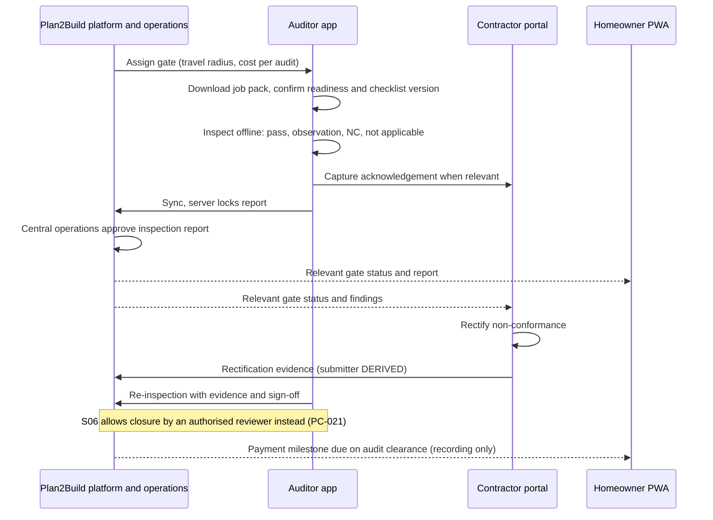

---

## 31. Edge cases

| ID | Edge case | Role | Direction | Source-supported behavior | Source / tag |
|---|---|---|---|---|---|
| PEC-001 | Professional does not respond to an RFQ invitation | D1 professionals | D1 | "Expire invitation; optionally send reminder; do not mark quote as zero" | S01 §20 |
| PEC-002 | Contractor does not respond to the standard RFQ | CON | D2 | Not described; participation KPI counts it (S06 §17) | `UNKNOWN` |
| PEC-003 | Late quote | D1 professionals | D1 | "Reject or route to exception policy"; "Provider sees reason"; "Admin override only if policy allows" | S02 §20 |
| PEC-004 | Quote edited after deadline | D1 professionals | D1 | "Require a new quote version / extension" | S01 §20 |
| PEC-005 | Incomplete quote (missing lines) | CON | D2 | Submission blocked until each line is priced or explicitly excluded | S06 §5.2, §10; S07 §11 |
| PEC-006 | Invalid quote (wrong format, contradictory items) | CON | D2 | AI flags "likely duplicate/contradictory quote items" for review | S06 §12 |
| PEC-007 | Contractor will not use the portal | CON | D2 | Staff capture the quote | S05 P4 |
| PEC-008 | Quote rejected (not selected) | All quoting roles | D1 | Marked not selected per business rules; notification not stated | S01 §10.1; `UNKNOWN` notification |
| PEC-009 | Quote expiry | D1 professionals | D1 | EXPIRED; rules open | S01 §23.1 |
| PEC-010 | Quote withdrawal | D1 professionals | D1 | WITHDRAWN; conditions not stated | S02 §19 |
| PEC-011 | Professional withdraws after selection | All | All | Not described | `UNKNOWN` (POQ-018) |
| PEC-012 | Professional suspended with active projects | D1 professionals | D1 | "Prevent new opportunities; preserve active records"; notify affected homeowner and provider; "Admin reviews active engagements" | S02 §20 |
| PEC-013 | Expired credential | D1 professionals | D1 | Expiry not modelled | `UNKNOWN` (PMI-005) |
| PEC-014 | Lost credential | D1 professionals | D1 | Category suspended, account kept | S02 §6.5 |
| PEC-015 | Failed verification | D1 professionals | D1 | Rejected; re-application per policy | S02 §5.1 |
| PEC-016 | Incomplete verification documents | D1 professionals | D1 | "Move to resubmission; preserve reviewer comments" | S01 §20 |
| PEC-017 | Verified for one category, not another | D1 professionals | D1 | Allowed; matching uses both verification and specialization | S02 §6.5 |
| PEC-018 | Missed milestone | D1 professionals | D1 | "Mark at-risk; trigger alerts; optional escalation" | S01 §20 |
| PEC-019 | Stage behind benchmark | CON | D2 | Appears in operations exception feed | S05 O1 |
| PEC-020 | Failed inspection [D1] | D1 professionals | D1 | Inspection states include "Failed" and "Follow-up"; consequences not stated | S02 §11 |
| PEC-021 | Gate non-conformance | CON, AUD | D2 | NC recorded with severity and corrective action; rectification; closure by re-inspection or authorised reviewer | S05 P6; S06 §5.3 (PC-021) |
| PEC-022 | Inspection without connectivity | AUD | D2 | Fully offline; sync later without loss or duplicates | S05 P6; S06 §16.1 |
| PEC-023 | Correction needed after report lock | AUD | D2 | Amendment as a separate record | S06 §16.1 |
| PEC-024 | Cube test results arrive later | AUD | D2 | Attach retrospectively to the correct pour at 7 and 28 days | S05 P6 |
| PEC-025 | Variation disagreement (other party will not acknowledge) | CON | D2 | Variation does not take effect; escalates visibly after configurable period; rejection behavior not defined | S05 P5; `UNKNOWN` (POQ-026) |
| PEC-026 | Change order not answered | D1 professionals | D1 | "Keep pending; do not silently apply" | S01 §20 |
| PEC-027 | Change order conflicts with payment | D1 professionals | D1 | "Freeze conflicting state until resolved"; admin if dispute | S02 §20 |
| PEC-028 | Payment disagreement | All | D1 | Dispute workflow; "Freeze affected settlement if configured" | S01 §11.4, §13.3 |
| PEC-029 | Payment recorded but not acknowledged | CON | D2 | Not described | `UNKNOWN` |
| PEC-030 | Payment timeout or duplicate webhook | D1 professionals (settlement) | D1 | Reconcile before retry; idempotency | S01 §11.4, §20 |
| PEC-031 | Project cancellation | All | D1 | Engagement "Cancelled" state; refund / reallocation policy for paid milestones | S02 §19; S01 §11.4 |
| PEC-032 | Homeowner changes scope | D1 professionals | D1 | Change order; chat changes need a quote revision or change order | S01 §13.2, §14.2 |
| PEC-033 | Homeowner changes a chosen specification line | CON | D2 | "any later change becomes a variation with cost and schedule impact attached" | S04 §8 |
| PEC-034 | Supplier out of stock / material unavailable | SUP, CON | All | Not described; long-lead items are flagged early | S04 §8; `UNKNOWN` |
| PEC-035 | Dealer substitutes a different product | SUP, CON | D2 | Recorded as a switch event; feeds switch rate | S06 §10; S04 §7 |
| PEC-036 | Fewer than three qualifying products | BRD, SUP | D2 | "the line shows what qualifies and states plainly that the set is short" | S04 R2 |
| PEC-037 | Attempt to attach brand or margin to a structural line | BRD, SUP | D2 | Rejected at the data layer | S05 rule 8, F1 |
| PEC-038 | Product repeatedly fails installation verification | BRD | D2 | Removed at annual review; removal recorded | S04 R8 |
| PEC-039 | Delivery failure | SUP | All | Not described | `UNKNOWN` |
| PEC-040 | Warranty problem | All | D1 | Warranty claim branch "CLAIM_OPEN → RESOLVED → CLOSED"; professional role not stated | S01 §15.2 |
| PEC-041 | Structural defect found after a cleared gate | AUD, CON | D2 | Capped remedy: Plan2Build pays to fix, capped; terms not stated | S03 §3.3 |
| PEC-042 | Review dispute | D1 professionals | D1 | Not described; moderation hides or removes with audit | S01 §16; `UNKNOWN` dispute |
| PEC-043 | Account closure | D1 professionals | D1 | CLOSED; records retained per retention policy | S01 §4.4 |
| PEC-044 | Reactivation | D1 professionals | D1 | Admin reinstates or restores | S01 §4.4; S02 §5.1 |
| PEC-045 | Suspended provider in chat | D1 professionals | D1 | "Prevent new commercial actions; preserve historic data" | S01 §20 |
| PEC-046 | Account compromise | All | D1 | Session revocation; security notice | S02 §20 |
| PEC-047 | Wrong OTP / expired token | All | D1 | "Rate-limit; allow retry; lock or cooldown after repeated failures" | S01 §20 |
| PEC-048 | File upload fails | All | D1, D2 | No completed record; retry; resumable uploads in D2 | S01 §20; S06 §10 |
| PEC-049 | Contractor tries to see unrelated specialist scope | CON | D1 | Denied unless explicitly authorised | S02 §8 |
| PEC-050 | Contractor tries to see a competitor's quote | CON | D2 | Denied | S06 §16.1 |
| PEC-051 | No professionals match | D1 professionals | D1 | "Offer broader radius/category or allow manual admin intervention" | S01 §20 |
| PEC-052 | Unverified nominated contractor | CON | D2 | Conflict on whether the RFQ can be issued first | PC-012 |
| PEC-053 | Family keeps a contractor who never quotes on the platform | CON | D2 | Not described | `UNKNOWN` |
| PEC-054 | Map or geocoding failure | All | D1 | "Allow manual address entry; mark geocoding pending" | S02 §20 |
| PEC-055 | AI extraction unavailable | CON (quotes) | D1, D2 | "Keep plan draft; retry with backoff" is stated for planning only; quote extraction failure not described | S02 §20; `UNKNOWN` |
| PEC-056 | Provider dispute on settlement | D1 professionals | D1 | "Freeze affected settlement if configured; create dispute record and admin task" | S01 §11.4 |
| PEC-057 | Evidence incomplete in a dispute | All | D1 | "Set evidence request state and deadline" | S01 §20 |
| PEC-058 | Storage quota exceeded | All | D1 | "Block or degrade large upload; notify admins/user" | S01 §20 |
| PEC-059 | Auditor connected to the supplier or associate | AUD | D2 | Auditor is "deliberately unconnected to the associate's business"; never told the supplier | S03 §7.3, §4.2 |
| PEC-060 | Listed provider with premium placement but poor verification | D3 providers | D3 | Not described | `UNKNOWN` |
| PEC-061 | A caught defect is filmed for investor evidence | CON | D2 | "ideally filmed with the contractor's consent" (S03 §8.2); homeowner consent and refusal handling not stated | S03 §8.2; `UNKNOWN` |
| PEC-062 | Homeowner payment fails | D1 professionals | D1 | "Keep milestone unpaid; show retry; do not duplicate invoice" | S01 §11.4 |
| PEC-063 | Provider payout fails | D1 professionals | D1 | SETTLEMENT_PENDING → FAILED; retry and notice not stated | S01 §11.2 |
| PEC-064 | Contractors refuse the standard scope | CON | D2 | Pilot kill criterion: "Contractors will not quote to a standard scope, or the normalised comparison reveals no material differences. The intelligence layer has no teeth." | S03 §7.1 Gate 2 |

---

## 32. Business rules

> **Client decisions (2026-10-03), CD-01 to CD-28.** Section 43.4 lists the rules below that the client decisions refine, tighten or bring into scope.

| ID | Rule | Roles | Direction | Source |
|---|---|---|---|---|
| PBR-001 | "A professional category is a business classification, not a separate authentication system." | ARC, CON, INT, SPC | D1 | S01 §2 |
| PBR-002 | "Category-specific verification determines what the professional is allowed to advertise, quote for and deliver." | ARC, CON, INT, SPC | D1 | S02 §5 |
| PBR-003 | The professional profile and the verification case are separate records | ARC, CON, INT, SPC | D1 | S01 §5 |
| PBR-004 | "Every provider category has its own verification rule set." | ARC, CON, INT, SPC | D1 | S01 §23.2 |
| PBR-005 | Admin configures mandatory fields and evidence per category; the specialist subtype list is configurable, not hard-coded | ARC, CON, INT, SPC | D1 | S02 §6.5; S01 §3 |
| PBR-006 | A provider may be verified for one category and unverified for another; a lost credential suspends only the affected category | ARC, CON, INT, SPC | D1 | S02 §6.5 |
| PBR-007 | "Opportunity matching must use both verification status and category specialization." | ARC, CON, INT, SPC | D1 | S02 §6.5 |
| PBR-008 | Only professionals meeting minimum verification requirements are eligible for normal marketplace discovery; a provider is never exposed "simply because the provider exists in the directory" | ARC, CON, INT, SPC | D1 | S02 §4.4 |
| PBR-009 | Saving homeowner qualification does not publish anything to professionals; an explicit readiness action is required | All D1 | D1 | S01 §6.2 |
| PBR-010 | The fit score is explainable decision support, "rather than an unreviewable automated selection"; AI ranking cannot replace hard eligibility | All D1 | D1 | S01 §8.2; S02 §4.4 |
| PBR-011 | Only "verified and eligible" providers submit quotes, against an open RFQ | All D1 | D1 | S02 §3, TX-012 |
| PBR-012 | Quotes are immutable by version; revisions create new versions; every revision is preserved | All D1 | D1 | S02 §7.1, §18.1 |
| PBR-013 | Normalised values never overwrite submitted values | All quoting roles | D1, D2 | S01 §9.3; S06 §10, §16.1 |
| PBR-014 | Material RFQ changes create a revised RFQ version | All D1 | D1 | S01 §9.1 |
| PBR-015 | Commercial changes agreed in chat require a quote revision or change order | All D1 | D1 | S01 §14.2 |
| PBR-016 | Selection alone never activates a project; configured prerequisites must be met | All D1 | D1 | S01 §10.2 |
| PBR-017 | One engagement per selected category on one shared project; each engagement owns its scope, terms, milestones, documents, invoices and completion | All D1 | D1 | S01 §10.3; S02 §8 |
| PBR-018 | Completing one engagement must not automatically create a financial obligation | All D1 | D1 | S02 §8 |
| PBR-019 | A contractor has no access to unrelated specialist scope unless explicitly authorised | CON | D1 | S02 §8 |
| PBR-020 | Every rupee movement has a payment record, gateway reference and project context; payment confirmation is server-side | All D1 | D1 | S01 §11; S02 §9 |
| PBR-021 | Funds are not described as escrow unless the provider and legal model support it | All D1 | D1 | S01 §11; S02 §9 |
| PBR-022 | Progress is derived from milestone weights; a provider's proposed percentage is stored beside the calculated one | CON, INT, ARC, SPC | D1 | S01 §12.4 |
| PBR-023 | "Every milestone has evidence + approval logic."; a milestone is Completed only when its configured rule is met | All D1 | D1 | S01 §23.2; S02 §10.1 |
| PBR-024 | Every change order records cost and time impact and an approval trace; the original contract / quote stays immutable | All D1 | D1 | S01 §13.2, §23.2 |
| PBR-025 | Dispute outcomes need "an admin actor, reason, evidence and timestamp" | All D1 | D1 | S01 §13.3 |
| PBR-026 | Messages belong to a context; files inherit context permissions; block / report controls exist | All D1 | D1 | S01 §14.2 |
| PBR-027 | Reputation comes from verified platform activity; admins never edit ratings; moderation preserves the original record | All D1 | D1 | S01 §16 |
| PBR-028 | Suspension blocks sensitive actions while preserving records needed for operations and disputes | All D1 | D1 | S01 §21 |
| PBR-029 | Every manual override has actor, old value, new value and reason | Admin | D1 | S01 §17.1 |
| PBR-030 | Lead access, subscription rules and commission treatment are configurable by super admin | Service providers | D1 | S10 §4 |
| PBR-031 | Recommendation must explain why a provider is recommended and "must not imply a guarantee of quality or outcome" | All D1 | D1 | S10 §4 |
| PBR-032 | Plan2Build never signs the construction contract and never replaces the contractor the family chose | CON | D2 | S05 §2; S14 |
| PBR-033 | Contractors see only invited projects and their own submissions; never another contractor's quotation | CON | D2 | S06 §11, §16.1 |
| PBR-034 | The RFQ has a mandatory pack version and standard line schema; a final quote cannot omit required lines without explicit exclusion | CON | D2 | S06 §10 |
| PBR-035 | The comparison headline is never a price ranking; each adjustment names the specification line, deviation and rupee impact | CON | D2 | S05 P4 |
| PBR-036 | Staff may capture a quote on a contractor's behalf | CON | D2 | S05 P4 |
| PBR-037 | Contractor input costs, margins and internal rates are never visible to a homeowner | CON | D2 | S05 P4, §7 |
| PBR-038 | No auction, bidding, countdown, price-ranked listing, price sort or price filter | CON | D2 | S05 P4, C1 |
| PBR-039 | The contractor's public profile shows verification status, portfolio and audit record, and no rating, score or ranking | CON | D2 | S05 C1 |
| PBR-040 | Everything a contractor sees is in Hindi; quotes can be completed on a phone | CON | D2 | S05 C1 |
| PBR-041 | Either party raises a variation; the other acknowledges with OTP before it takes effect; approved variations update contract value and completion date; unacknowledged ones escalate | CON | D2 | S05 P5 |
| PBR-042 | Payments are recorded by either party with acknowledgement; Plan2Build moves no construction money | CON | D2 | S05 §5, P7 |
| PBR-043 | A payment milestone becomes due on stage completion, and on audit clearance where the stage is a gate | CON | D2 | S05 P7 |
| PBR-044 | The contractor sees cost booked against revenue by stage; the homeowner never does | CON | D2 | S05 P7 |
| PBR-045 | Every log entry, quotation line, payment, document, photograph and audit result carries a foreign key to a stage instance and, where applicable, a specification line instance | CON, AUD | D2 | S05 rule 1 |
| PBR-046 | The auditor never sees the supplier or brand; enforced by access control. S05's absolute wording governs over the conditional wording elsewhere (PC-041) | AUD | D2 | S05 rule 9, P6, §7; S09 §3 |
| PBR-047 | Inspection works fully offline; photographs are geotagged and timestamped and cannot be backdated (S07 §6 adds "where permitted", PC-043) | AUD | D2 | S05 P6 |
| PBR-048 | A non-conformance closes only by re-inspection with evidence and sign-off (S05); S06 allows an authorised reviewer (PC-021) | AUD, CON | D2 | S05 P6; S06 §5.3 |
| PBR-049 | Locked inspection reports are never edited; corrections are amendments | AUD | D2 | S06 §10, §16.1 |
| PBR-050 | The auditor is a retained consultant, "deliberately not a hire, and deliberately unconnected to the associate's business" | AUD | D2 | S03 §7.3 |
| PBR-051 | Structural lines are issued under a registered structural engineer's sign-off; "Plan2Build compiles and communicates; the engineer specifies." | STE | D2 | S04 §3 |
| PBR-052 | Structural lines carry no commercial data or manufacturer revenue | STE, BRD, SUP | D2 | S05 rule 8; S04 R9 |
| PBR-053 | AI never performs structural design, sign-off or safety-critical grade decisions | STE | D2 | S06 §12 |
| PBR-054 | Brands appear only as qualifying options in a separate step, ordered by price, never by commercial relationship; specification lines never hold a brand | BRD, SUP | D2 | S05 rule 7 |
| PBR-055 | Qualification rules R1 to R9 (specification first; 3 to 5 options; value tier; published technical criteria; no paid ranking; homeowner chooses unprompted; disclosure on the document; annual review; no structural monetisation) | BRD, SUP | D2 | S04 §6 |
| PBR-056 | Where Plan2Build supplies material, its margin in rupees is printed on the family's document; whether rule 8 bars such margin on structural lines is open (PAMB-030) | SUP (Plan2Build as supplier) | D2 | S05 rules 8, 10 |
| PBR-057 | Manufacturer-facing data is aggregated and anonymised; no homeowner identity, address or contact goes to a brand | BRD | D2 | S04 §7 |
| PBR-058 | Each build-record warranty carries term, expiry and installer | CON, SUP | D2 | S05 P8 |
| PBR-059 | Execution risk, supervision and liability stay with the contractor | CON | D2 | S03 §8.3 |
| PBR-060 | Roles are per project, not global | All D2 | D2 | S05 P2 |
| PBR-061 | Admin and consultant accounts use MFA | STE, admin; possibly AUD, since "consultant" is not defined (PAMB-023) | D2 | S06 §6 module A, §11 |
| PBR-062 | "Comparison and option-ranking logic should be reproducible from stored rules, not manually rearranged by sales users." | BRD (options), CON (quote comparison) | D2 | S06 §11.1 |
| PBR-063 | Basic listing is free for service providers | Listed providers | D3 | S13 |
| PBR-064 | Listing is free for the contractors Plan2Build invites | CON | D2 | S14 |
| PBR-065 | An auditor's access "is limited to the evidence required for independent verification" | AUD | D2 | S09 §3 |
| PBR-066 | Every module, including the contractor portal and the auditor app, must pass its acceptance criteria "in Hindi as well as English"; no hardcoded strings, including "generated documents, PDF templates and validation messages" | CON, AUD | D2 | S05 §6, rule 6 |
| PBR-067 | "Contractor and auditor interfaces are phone-first"; target "low-end Android" with "3GB RAM on a 3G connection" | CON, AUD | D2 | S05 §7 |
| PBR-068 | "Product qualification criteria and commercial relationships should be separate data fields and separate permissions." | BRD, SUP | D2 | S06 §11.1 |
| PBR-069 | "Financial records are immutable append-style transactions; corrections are represented by new records." | D1 professionals | D1 | S01 §21 |
| PBR-070 | A professional invoice requires an active engagement ("Engagement active") | D1 professionals | D1 | S02 TX-017 |
| PBR-071 | "A contractor can submit a standards-compliant quote from phone or desktop without training-heavy support." | CON | D2 | S06 §18; S07 §22 |

---

## 33. Assumptions

These are the only assumptions this document makes. None adds product behavior.

| ID | Assumption | Why it is needed | Basis |
|---|---|---|---|
| PAS-01 | Source IDs S01 to S25, S23a to S23e and directions D1 to D3 are the same as in `IHB_FLOW.md` | Cross-document consistency | IHB_FLOW §3 |
| PAS-02 | "Professional" (S01, S02) and "service provider" (S10, S19) name the same D1 participant set | Merging two vocabularies | S19 subtitle "A guided flow for architects, civil contractors, interior designers and specialized service providers."; S10 §1 "Contractors and professionals" |
| PAS-03 | The D2 "structural consultant" (S06 §3, S07 §8, S09 §1) is the "registered structural engineer" (S04 §3) and the "Structural engineer" on retainer (S03 §7.3) | One role code (STE) | Identical job: sign-off of structural specification lines |
| PAS-04 | The D2 "Auditor / field engineer", "Quality auditor" and the "certified engineer" of the price boards are one role (AUD) | One role code | Same job (stage / gate inspection); PAMB-025 records the residual doubt |
| PAS-05 | D3 directory labels map to role codes by name: "Architects & Designers" → ARC; "Construction Contractors" / "Civil & Construction" → CON; "Interior Designers" → INT; trade services (electrical, plumbing, AC) → SPC; painting and modular kitchens are grouped differently across sources (PAMB-032) | Placing D3 evidence | Labels in S23a, S23b, S23d, S24 |
| PAS-06 | Arrow lists in status dictionaries (S01 App B; S02 §19) are value sets, not mandated sequences | Avoid inventing transitions | S01 App B title "Status dictionary" |
| PAS-07 | Mockup sample values (names, ratings, prices, counts) are illustrative | Avoid treating samples as data | IHB_FLOW rule 4 (section 4.2) |
| PAS-08 | "Contractor" in D2 means the civil contractor | Role code CON | D2 contractor jobs are construction quotes and execution (S06 §3) |
| PAS-09 | Where S01 and S02 disagree, neither supersedes the other (S02 is 26 minutes later; both claim to be final) | Conflict handling | S01, S02 core properties |

---

## 34. Ambiguities

| ID | Ambiguity | Sources | Effect | Handling |
|---|---|---|---|---|
| PAMB-001 | "2 Contractors • 2 Designers" may mean interior designers, architects or both | S23e | Multi-category shortlist meaning | Recorded only |
| PAMB-002 | The S24 › 4 "Verified Only" filter (shown switched on) implies unverified providers may be listed; S23d points the other way ("Found 24 Verified Professionals", a "Verified Professional" badge on every card, "All professionals are background checked and verified.") | S24 › 4; S23d | Conflicts with the D1 discovery rule if true | POQ-048 |
| PAMB-003 | The D2 public profile "carries verification status", so a profile may exist before verification completes | S05 C1 | Publication timing | Recorded |
| PAMB-004 | S19 profile item "Project readiness" is not explained | S19 › 2 | Field meaning unknown | PF-019 |
| PAMB-005 | How contractor internal costs, margins and rates enter the system (S05 P4 and P7 assume they exist) | S05 P4, P7 | Data capture design | Recorded |
| PAMB-006 | Whether SELECTED and ACCEPTED are one quote state or two | S01 §10.1; S02 §19 | Quote state machine | Union kept (13.3) |
| PAMB-007 | READY_TO_START (S01 §10.1) appears in no state list; activation is per project (S01 T22) or per engagement (S02 §19) | S01 §10.1, T22; S02 §19 | Activation logic | Section 16.2 |
| PAMB-008 | How the chosen contractor's quote becomes the "Original contract value" and how this relates to the baseline lock at Package A issue | S05 P3, P7, §5 | D2 activation | POQ-017 |
| PAMB-009 | "contract and milestone structure" in the assurance layer: a contract template or only a schedule | S03 §4 | Plan2Build's role in the contract | Recorded |
| PAMB-010 | Who buys material that Plan2Build supplies at a disclosed margin (family or contractor) | S05 rule 10, §9; S03 §4 | Material payments | POQ-027 |
| PAMB-011 | "suppliers" and "material suppliers" are listed separately; "dealers" and "brands" also appear | S13; S04 §7; S10 §4 | Supplier taxonomy | POQ-043 |
| PAMB-012 | "Both parties complete rating/feedback" may mean professionals rate homeowners | S10 §4 | Review model | POQ-033 |
| PAMB-013 | "recommendation reviews" in the meeting notes is not explained | S13 | D3 feature | Recorded |
| PAMB-014 | Opportunity object states ("Open, paused, closed", S02 §7) differ from per-provider participation states (S01 §8.2) | S01 §8.2; S02 §7 | Two machines kept | PSM-05, PSM-06 |
| PAMB-015 | The S06 §4 matrix marks the contractor web as a primary channel for "RFQ creation / issue" although Plan2Build issues RFQs | S06 §4, §5.1 | Contractor capability | Read as the place where the contractor receives the RFQ (`DERIVED`); not relied on |
| PAMB-016 | The field operations executive does "Onboarding and concierge logging"; whether this is the site log used for verification is unclear | S03 §7.3; S04 §2 | Daily log ownership | POQ-020 |
| PAMB-017 | "Typical Quote Range" shown to a D1 provider may be a market range or a summary of competing quotes | S19 › 4 | Competitor visibility | PC-015 |
| PAMB-018 | The meeting categories "professionals, ISB, and professional services" ("IB or professionals" in the transcript) | S13 | D3 category model | Recorded |
| PAMB-019 | D3 "Starting from" prices and "Price Range" rows: set by the provider or computed | S23d | Pricing display | POQ-049 |
| PAMB-020 | "Listing" in D2: "Listing is free for the contractors we invite" and "Apply to be listed" link to no form or directory | S14 | Whether D2 has a contractor directory | POQ-001 |
| PAMB-021 | What "founding partners" sign and what status they gain | S03 §7.1 | Contractor tier | POQ-006 |
| PAMB-022 | The D1 "assigned inspector" may be a specialist ("inspections" subtype, S02 §6.4) or Plan2Build staff | S02 §6.4, §11 | Inspector role | Recorded |
| PAMB-023 | The auditor is called an "Independent structural consultant" (S03 §7.3) while the engineer is the "Structural consultant" (S06 §3) | S03 §7.3; S06 §3 | Naming overlap between AUD and STE | Kept separate (section 7.5) |
| PAMB-024 | P2 lists roles "homeowner, spouse, contractor and Plan2Build staff"; whether the retained auditor and engineer count as staff for access purposes | S05 P2; S03 §7.3 | Access model | Recorded |
| PAMB-025 | Whether the price boards' "certified engineer" stage checks are the same retained auditor | S20 to S22; S03 §7.3 | AUD scope and pay | PAS-04 |
| PAMB-026 | The contractor's public profile carries the "audit record" of houses he built and "you can send it to anyone", while "Individual house data belongs to the homeowner, and this is stated in the engagement letter." | S05 C1; S14 #contractors; S04 §7 | What house data may appear on a contractor profile | POQ-051 |
| PAMB-027 | The contractor portal is "Deliberately thin. Enough for a contractor to participate in an RFQ and acknowledge variations, and nothing more.", yet other D2 sources give contractors payment recording, a cost-against-revenue view, NC rectification, six-state tracking, document upload and gate status | S05 C1, §5, P7; S06 §3, §4; S09 §4 | Contractor portal scope | POQ-052 |
| PAMB-028 | S09 grants contractors and auditors "Notifications / messaging: Yes" but no D2 source defines a messaging feature | S09 §3 | Whether D2 needs any messaging | Recorded (section 18.2) |
| PAMB-029 | Six gate inspections are sold per house, yet Gate 3 runs for each slab and stage 9 (Gate 4) repeats per floor, so multi-floor houses need more visits; one retained consultant per city must cover them | S05 §2; S04 §4; S05 rule 3; S03 §5.2, §7.3 | Auditor workload, scheduling and cost | POQ-040 |
| PAMB-030 | S05 rule 8 makes structural lines "reject any attempt to associate manufacturer participation or margin"; whether "margin" covers Plan2Build's own disclosed-margin supply of concrete, ready-mix or steel is unclear | S05 rules 8, 10; S03 §4, §7 | Material supply on structural lines; the Raipur associate's business | POQ-054 |
| PAMB-031 | In D1, "structural consultancy" and "inspections" are specialist scopes that quote to and are paid by homeowners; the D2 structural engineer and auditor are retained by Plan2Build. How the D1 specialist scopes relate to the D2 retained roles is not stated | S02 §6.4; S01 §10.3; S03 §7.3 | Role mapping | Kept as separate roles (SPC versus STE, AUD) |
| PAMB-032 | The homeowner board groups "Specialists (interiors, MEP, etc.)", while S01 §2 and S02 §6 keep interior designers as their own category. Painting is a specialist subtype in S01 §3 but sits under "Interiors & Renovation" in S24 › 2; "Modular Kitchen" sits under interiors (S23b) and on an interior designer's card (S23d) | S18 › 4; S01 §2, §3; S02 §6; S23b; S23d; S24 › 2 | Category taxonomy | Kept separate (POQ-002) |
| PAMB-033 | S01 §9 calls quote normalization "a core product capability, not an optional feature", while S01 §22 places "normalized BOQ analysis" at commercial launch | S01 §9, §22 | D1 MVP comparison scope | Recorded (section 7.7) |
| PAMB-034 | S23a labels its "Featured Professionals" section "Top-Rated Professionals for Your Home Project." with no paid or sponsored marker, while S13 offers premium listings; whether premium listing buys a featured slot is not shown | S23a; S13 | Paid placement versus rating-based featuring | POQ-032 |
| PAMB-035 | Listing tiers: the S13 summary names basic and premium listings, the details mention "portfolio assistance under growth and premium growth tiers, which encompass designing, budgeting, and monitoring"; whether growth tiers are provider tiers or homeowner plans is unclear, and no tier price is stated | S13 | Provider monetisation | POQ-032; IHB_FLOW AMB-073 |

---

## 35. Conflicting source material

> **Client decisions (2026-10-03), CD-01 to CD-28.** Section 43.3 lists the conflicts the decisions settle or narrow. The rows below are unchanged and still record the sources.

| ID | Topic | Source A | Source B | Roles | Handling here | Open question |
|---|---|---|---|---|---|---|
| PC-001 | How professionals get work | D1: system matching and invitation (S01 §8, §9; S02 §7) | D2: nominated or introduced, invited to a standard RFQ, no discovery (S06 §5.1, §11; S07 §4.4). D3: open directory with "Request Quote" (S23d, S24 › 4) | ARC, CON, INT, SPC | All three kept (section 11) | POQ-001 |
| PC-002 | Ranking and recommendation | D1: "Candidate ranking / fit reasons" (S01 §7.2); "Recommended" pick (S15); "Recommendation Engine: Suggests the best options based on your goals, budget and preferences." (S16); "AI-powered recommendations" (S18 › 4); D3 "Featured", "Recommended Professionals" (S24 › 5), "Sort by: Relevance" | D2: "A quality contractor who sees himself ranked leaves." (S05 §9); no recommendation of one brand (S04 R6) | CON, ARC, INT, SPC, BRD | Section 14.3 | POQ-001 |
| PC-003 | Ratings and reviews | D1 reviews and ratings (S01 §16; S02 §4.4; S19 › 7); "Contractor Network: Verified and rated professionals" (S17); D3 stars, "Minimum Rating", "Top-Rated" | D2: "no star rating, score or ranking" (S05 C1); ratings "are out. Not deprioritised — out." (S05 §2) and excluded (S05 §9); other D2 sources only postpone them (PC-042) | All quoting roles | Section 24 | POQ-033 |
| PC-004 | Money between homeowner and professional | D1: collected through the gateway, allocated, settled to the provider (S01 §11) | D2: "Recording only — this module moves no money." (S05 P7); "Your client signs with you and pays you." (S14) | All quoting roles | Section 22 | POQ-031 |
| PC-005 | Charging professionals | D1: subscriptions, lead access, commissions configurable (S10 §4); open decision (S02 App B) | D2: "Listing is free for the contractors we invite." (S14); D3: free basic listing, premium tier (S13) | All | Section 22.2 D | POQ-031 |
| PC-006 | Paid placement | D1 "featured listings" (S10 §3); D3 premium listing (S13). S23a "Featured Professionals" are shown as "Top-Rated" without a paid marker (PAMB-034) | D2: "Position is not for sale." (S14); "Order is never for sale." (S04 R5); no ranking (S05 §9) | All; BRD | Section 14.3 | POQ-032 |
| PC-007 | Brand money | "Partner Brands / BTL: Branded products, campaigns and ecosystem partnerships" as "Ecosystem revenue" (S21, S22) | Independence rules: brand selection ordered by price, never by commercial relationship; no structural monetisation (S03 §4.2; S04 §6) | BRD | Both kept | POQ-047 |
| PC-008 | Who produces architectural plans | Price boards: "Detailed plan, drawings and specifications for execution" (S21, S22), "Detailed architectural plan (as per your chosen scope)" (S22), "1 BHK + 2D Design + Landscape" to "3 BHK + 2D Design + Landscape" at ₹29,999 to ₹49,999 (S20, S21); D3 Build Plan "What's Included": "Architectural Design", "3D Visualisation", "Contractor Options" (S24 › 5). "3D Visualisation" clashes directly with S05 §9 | D2: "AI design generation, plan generation, 3D visualisation: Not part of the proposition." (S05 §9); no architect role in D2 | ARC | Section 6.2 | POQ-044 |
| PC-009 | PMC | D3: "PMC Services" (S23b); "PMC" (S24 › 2); "Project Management" service (S23c) | D2 kill list: "Full PMC with permanent engineering teams in every city." (S03 §6); "Full project management execution tooling" excluded (S05 §9) | PMC | Section 6.10 | POQ-044 |
| PC-010 | Verification state names | S01 §5.1 NEEDS_RESUBMISSION | S01 §4.4 and App B RESUBMISSION_REQUIRED; S02 "Changes Required" | D1 professionals | All kept (9.2) | POQ-004 |
| PC-011 | Quote state sets | S01 App B; S01 §10.1 | S02 §7 and §19 (adds Revision Requested, Resubmitted, Revised, Accepted) | D1 professionals | Union (13.3) | POQ-035 |
| PC-012 | Contractor onboarding order | S06 §5.2: "Invite by project link/OTP; no complex onboarding before value is clear." | S08 §4 and S09 §4: verification before "receive RFQ" | CON | Both kept | POQ-005 |
| PC-013 | Role scope | S01 §2: global role "USER → role = HOMEOWNER \| PROFESSIONAL \| ADMIN" | S05 P2: "Roles are per project, not global" | All | Both kept (8.2) | POQ-001 |
| PC-014 | Multiple categories per professional | S01 §2: one primary category unless multi-specialization is supported | S02 §5: "one or more service categories"; S02 §6.5 per-category verification; the provider board shows an opportunity spanning "Civil + Interior" (S19 › 3) | ARC, CON, INT, SPC | Both kept | POQ-003 |
| PC-015 | Competitor information shown to professionals | S19 › 4: "Number of Competitors", "Typical Quote Range" | S06 §5.2, §16.1: no competitor prices; S09 §3: no other contractors' commercial data | CON and D1 roles | Both kept | POQ-001 |
| PC-016 | Price filtering and sorting | D1 budget-range filter (S02 §4.4); D3 "Budget Range" filter, "Price Range", "Starting from" (S23d) | D2: "No feature allows contractors to be sorted or filtered by price." (S05 C1) | CON and others | Both kept | POQ-049 |
| PC-017 | Presentation of the cheapest quote | S14 demo labels a quote "Genuinely the lowest, on equal scope" | S05 P4: "The headline output is never a ranking by price."; S03 §3.2: "the headline finding should never be who is cheapest." | CON | Both kept; S05 governs build scope | None (implementation follows S05 unless decided otherwise) |
| PC-018 | Contractor visibility of contract value and paid-to-date | S07 §12: these figures go to "Homeowner + authorised operations" | S09 §4 hand-off: "Variation acknowledged: Update current contract value and projected completion date: Both parties receive the recorded change"; S05 P7 gives the contractor "cost booked against revenue by stage"; IHB_FLOW C-069. Who may record payments is PC-040 | CON | Both kept (17.2 n20) | POQ-041 |
| PC-019 | Who sees the six-state ledger | S04 §2: "The homeowner sees the first three; only Plan2Build sees the last three." | S06 §4: material six-state tracking on homeowner, auditor and contractor channels. Side A is repeated in S03 §3.4 ("The homeowner sees the first three. Only Plan2Build sees the last three"), and S05 rule 2 says "the last three have no consumer in the MVP" | CON, AUD | Both kept (17.2 n24) | POQ-021 |
| PC-020 | Language | S10 §7: "One language" for Phase 1 | S05 rule 6, C1: Hindi from first release; everything a contractor sees in Hindi | All | Both kept; D2 governs POC | None |
| PC-021 | Non-conformance closure | S05 P6: "A non-conformance can only be closed by a re-inspection record with evidence and sign-off."; S07 §6; S09 §3 "non-conformances require rectification and a separate re-inspection before closure"; S06 §18 "collect closure evidence" | S06 §5.3: "Rectification evidence is submitted and closed by authorised reviewer" | AUD, CON | Both kept | POQ-039 |
| PC-022 | Milestone state names | S02 §19: Upcoming, Ready, In Progress, Awaiting Review, Completed, Blocked, Cancelled | S01 T23 to T25: IN_PROGRESS, PENDING_APPROVAL, APPROVED; provider board: "Completed", "In Progress", "Pending", "Upcoming" (S19 › 6 [MOCKUP]; "Pending" is in no S01 or S02 list) | D1 professionals | Both kept (20.1) | POQ-034 |
| PC-023 | Milestone approval authority | S01 T25: homeowner approves; S01 §12.2 "Homeowner + required admin rule" at handover | S02 TX-022: "System/Admin/Homeowner per rule"; D2: stage completion plus audit clearance (S05 P7); S01 §23.1 open decision | D1 professionals; CON | Both kept | POQ-034 |
| PC-024 | When a variation takes effect | S05 P5: acknowledged "before the variation takes effect"; S08 §5 "before the variation becomes active" | S06 §10: acknowledgement "before implementation where possible" | CON | Both kept | POQ-026 |
| PC-025 | Change-order states | S01 §13.2: DRAFT, SUBMITTED, REVIEW, ACCEPTED / REJECTED, IMPLEMENTED, CLOSED | S02 §11, §19: Draft, Submitted, Clarification, Approved, Rejected, Cancelled | D1 professionals | Both kept | POQ-036 |
| PC-026 | Escrow plumbing | S03 §6: "Build the plumbing, switch it off, revisit past 200 houses." | S05 §9: "integrate no payment instrument and build no release mechanism" | All | Both kept | POQ-031 |
| PC-027 | D1 timing of homeowner payment to the professional | S01 §11.3: homeowner pays when the milestone is created and due, before work | S10 §4: "Milestone completed: Request approval/payment: Homeowner approves or raises issue"; S02 §10.1 step 7: "Payment request is triggered or released according to agreed payment terms."; S02 fig 6 starts "Milestone / invoice becomes payable"; "Milestone Payments: Links payments to verified progress." (S16) | D1 professionals | Both kept (IHB_FLOW C-060) | POQ-031 |
| PC-028 | Payment state sets | S01 §11.2 | S02 §9, §19 | D1 professionals | Both kept (22.3) | POQ-031 |
| PC-029 | Qualifying option order | S05 rule 7; S03 §4.2; S14: ordered by price | S04 R5: "ordered by price or alphabetically" | BRD | Both kept (IHB_FLOW C-061) | None |
| PC-030 | Brand categories on structural lines | S04 §5: A01 "Testing lab", A04 / A09 / A12 "Cement / RMC", A13 "RMC / Cement", A05 "Steel" | S04 R9 and S05 rule 8: no participation revenue or commercial data on structural lines; S04 §10 "Make it structurally impossible to attach a brand or a commercial field to a line flagged structural."; S05 F1 acceptance test; qualifying_option "Never attached to a structural line" (S05 §5) | BRD, SUP, LAB | Both kept (IHB_FLOW C-065) | POQ-047 |
| PC-031 | When the contractor gets a verified profile | S05 C1: verified public profile with audit record in the MVP | S06 §5.2, §13: verified history "later"; verified contractor profiles in Phase 5; S03 §4.1 lists "A verified profile and audit record" under "Gets at scale" | CON | Both kept (IHB_FLOW C-067) | POQ-017 |
| PC-032 | Project completion versus handover order | S01 §12.1 and T36, T37: HANDOVER_PENDING then COMPLETED | S02 §19: Completed then Handed Over | D1 professionals | Both kept | POQ-034 |
| PC-033 | Issue states | S01 §13.1 adds VERIFIED, ESCALATED, DISPUTED | S02 §11, §19: Open, Acknowledged, In Progress, Resolved, Closed | D1 professionals | Both kept | None |
| PC-034 | Who opens a dispute | S01 T34: admin opens | S02 §11, TX-037: "Either party" / "Any party" | D1 professionals | Both kept | POQ-037 |
| PC-035 | Professional app | S10 §1: dedicated "Service-provider mobile app" for Android and iOS; S02 §2: professionals on "Website + professional mobile" | S06 §1, §3: contractor responsive web portal, no app install; S08 §1: no separate contractor app; auditor app the only mobile app (S07 §1) | CON and D1 roles | D2 governs POC | POQ-001 |
| PC-036 | Brand portal | S10: brand web dashboard with catalogue, territories, enquiries | S06 §1: "No portal in POC"; S06 §2 postpones a "Manufacturer self-service analytics portal"; S05 §9: no manufacturer dashboards; S09 §7 excludes "brand portals" | BRD | D1 tagged `SUPERSEDED` for POC | None |
| PC-037 | Post-handover specialist services | D1 Improve loop and specialist service orders (S01 §15.3, T40 to T42); "Repairs & Service Network: Connects to trusted specialists." (S16); D3 "Specialist Services" and "Upgrade / Repairs" | S05 §9: "Renovation, maintenance and post-handover services: Follows the build record, not the MVP." | SPC | D1 tagged `SUPERSEDED` for POC; D3 conflict kept | POQ-001 |
| PC-038 | Inspection model | D1: optional inspector; homeowner approves milestones (S01 §12.2; S02 §11); "optional independent inspections" (S15); "Optional expert inspections" (S17) | D2: six independent gates by a retained auditor (S05 P6); price boards sell single stage checks (S20 to S22), a "3-Stage Package" (S20 only) and multi-stage packages (S20 to S22) | AUD, CON | D2 governs; package conflicts in IHB_FLOW C-050 | POQ-040 |
| PC-039 | First notification channels in D2 | S06 §1: "Use responsive web/PWA + WhatsApp for them" (homeowners and contractors); S06 §9: "WhatsApp Business API provider + SMS fallback + email" | S07 §17: "Email + SMS initially; WhatsApp as an expansion path"; S07 §16.7: add WhatsApp "where pilot behaviour shows that they materially improve response rates" | CON, AUD, homeowner | Both kept | POQ-045 |
| PC-040 | Who records construction payments | S05 §5 and P7: payments "recorded by either party with acknowledgement" | S09 §3: homeowner "record relevant payments"; contractor "View recorded status" | CON | Both kept; S05 governs build scope | POQ-041 |
| PC-041 | How absolute auditor blindness is | S05 rule 9 ("This is a hard requirement"), P6, §7; S09 §3: auditors never see supplier or brand | S07 §6: "during a blind verification workflow"; S07 §19: "audit roles can be kept blind"; S06 §11.1: "where "blind" verification is required" | AUD | S05 governs: always blind | None |
| PC-042 | Contractor ratings within D2 | S05 §2: "contractor ratings and price-ranked listings are out. Not deprioritised — out."; S05 §9, C1 | S03 §6 postpones "Contractor marketplace mechanics, vendor dashboards and ratings"; S06 §13.1 "Do not build public contractor ratings until ..."; S07 §2 "Later when traction is proven: Full public contractor marketplace and ratings" | CON | S05 governs the MVP | POQ-033 |
| PC-043 | Photo geotagging | S05 P6: "geotagged and timestamped at capture" | S07 §6: "timestamped, geotagged where permitted"; S06 §3.2 "approximate site location" | AUD | S05 governs | None |
| PC-044 | Transaction-layer partner list | S05 §2: "Verified contractor introductions, materials supplied at a disclosed margin, finance and insurance referral" | S03 §4: "finance, insurance, solar, interiors"; S03 §5.1: "Finance, insurance, solar referral"; the price boards list six partner lines, including home interior and finishes and partner brands (S20 to S22) | PTN, INT, SPC | Both kept; S05 governs build scope | POQ-047 |
| PC-045 | Payment versus activation order [D1] | S01 §1: "SELECT → AGREE → PAY → BUILD"; S01 §24.1: "SELECT → AGREEMENT → PAY → TRACK BUILD" | S02 §24: "ENGAGEMENT(S) ACTIVATED" before "INVOICE / MILESTONE PAYMENT"; S02 TX-017 invoice requires "Engagement active" | D1 professionals | Both kept | POQ-055 |
| PC-046 | Delivery guarantee | S13: "guaranteed project delivery pricing instead of hourly rates"; "emphasizing guaranteed delivery" | "execution risk, supervision and liability stay with the contractor" (S03 §8.3); "We never take the contract." (S14); S05 §2 "We never sign the construction contract" | CON and all D3 providers | Both kept; who would carry the guarantee is unknown | POQ-056 |

---

## 36. Open questions

> **Client decisions (2026-10-03), CD-01 to CD-28.** Section 43.3 lists the questions the decisions settle or narrow; section 43.5 lists the open points that remain or arise. The rows below are unchanged.

| ID | Question | Why it matters | Sources |
|---|---|---|---|
| POQ-001 | Which professional model governs, and for which roles: D1 matched marketplace, D2 invited standard RFQ, or D3 open directory? Does the D2 "listing" mean a directory? | Every professional flow depends on it | PC-001, PC-002, PC-013, PC-015, PC-035, PC-037; PAMB-020 |
| POQ-002 | What is the final professional taxonomy and specialist subtype list? | Category rules and matching | S01 §23.1 |
| POQ-003 | Can one professional hold several categories under one profile? | Verification and matching | S01 §2, §23.1; S02 §5, App B |
| POQ-004 | What exact verification evidence is required per category and geography, and what are the canonical verification state names? | Onboarding build | S01 §23.1; S02 App B; PC-010 |
| POQ-005 | Can a nominated contractor receive the RFQ before verification completes? | D2 onboarding | PC-012 |
| POQ-006 | What does founding-partner status give a contractor? | Contractor tiers | S03 §7.1; PAMB-021 |
| POQ-007 | What dates or rules expire a D1 opportunity? | Opportunity lifecycle | S01 §8.2 |
| POQ-008 | Can a D2 contractor accept or decline an invitation, and how is that recorded? | Participation KPI | S06 §17 |
| POQ-009 | Which homeowner details (name, phone, address, budget) does a professional see before and after selection? | Privacy and conversion | Section 17.2 |
| POQ-010 | Does the contractor see the homeowner's qualifying options and chosen brands? | Procurement | S05 §5; S06 §4 |
| POQ-011 | Does the RFQ BOQ show Plan2Build's estimated rates and amounts, or quantities only? | Contractor pricing behavior | S06 §7 BOQLine |
| POQ-012 | Are clarification answers shared with every invited contractor? | Fair comparison | S07 §5 |
| POQ-013 | In D2, may a contractor revise or withdraw a submitted quote? | Quote lifecycle | Section 12 |
| POQ-014 | Do D2 RFQs have response deadlines? | RFQ lifecycle | S05 P4 ("countdown" excluded) |
| POQ-015 | Are selected and unselected D2 contractors notified, and how? | Contractor experience | Section 15 |
| POQ-016 | Does the D2 contractor propose his own timeline, warranty and payment terms in the quote? | Quote format | Section 13.1 |
| POQ-017 | What makes a D2 contractor's participation active, how is the original contract value set, and when does the contractor's verified profile go live? | Activation | PAMB-008; PC-031 |
| POQ-018 | What happens when a professional withdraws after selection, or the family changes contractor mid-build? | Continuity | Sections 16, 25 |
| POQ-019 | May professionals and homeowners exchange contact details or move discussions off-platform? | Communication policy | Section 18 |
| POQ-020 | Who records D2 stage progress and the daily log? The contractor portal includes "project updates" (S09 §2) and lets the contractor "view relevant project status" (S09 §3), but no source says who writes progress | Execution data | S05 §5; S09 §2, §3; PAMB-016 |
| POQ-021 | Who records the Purchased and Installed states, and who sees which ledger states? | Procurement data | PC-019 |
| POQ-022 | How do architect drawings reach the contractor engagement on the same project? | Multi-engagement projects | S02 §8 |
| POQ-023 | Who produces the project's structural design and calculations that the engineer's sign-off relies on? | Structural liability | S04 closing note |
| POQ-024 | Who declares a gate stage ready for inspection? | Gate scheduling | S06 §5.3, map 4 |
| POQ-025 | Which handover documents must the D2 contractor provide? | Build record | S07 §13 |
| POQ-026 | What happens when a variation is rejected, and does acknowledgement always precede implementation? | Variation log | PC-024 |
| POQ-027 | Are material transactions referral, disclosed-margin sale, or both, and who buys? | Material flow and invoicing | S06 §18.1; S03 §9; PAMB-010 |
| POQ-028 | Do contractors pay any fee for introductions? | Contractor economics | S03 §4 |
| POQ-029 | Can a professional be removed from an active project, by whom, and with what effect? | Exception handling | Section 25 |
| POQ-030 | What suspension, withdrawal and delisting rules apply to D2 contractors? | Contractor governance | Section 25 |
| POQ-031 | What is the professional fee model (commission, subscription, lead fee, listing fee or none), and does Plan2Build ever move professional money? | Monetisation | PC-004, PC-005, PC-026 to PC-028 |
| POQ-032 | What does premium listing cost and include, and how is it disclosed and kept apart from ranking? | D3 monetisation versus independence | PC-006 |
| POQ-033 | Are ratings and reviews allowed, for which roles, and can professionals rate homeowners? | Reputation | PC-003; PAMB-012 |
| POQ-034 | Who approves milestone or stage completion, and what are the canonical milestone and project state names? | Execution and payment | PC-022, PC-023, PC-032 |
| POQ-035 | What are the quote expiry, revision and late-submission rules? | Quote lifecycle | S01 §23.1; S02 App B |
| POQ-036 | Which change orders need admin approval, and which state set applies? | Variations | S02 App B; PC-025 |
| POQ-037 | Who opens disputes, what are the SLAs, and who holds refund authority? | Disputes | S02 App B; PC-034 |
| POQ-038 | What are the project visibility and provider discovery rules? | Opportunity design | S01 §23.1 |
| POQ-039 | Is a non-conformance closed only by re-inspection, or can an authorised reviewer close it? | Assurance | PC-021 |
| POQ-040 | Who may sign or override assurance results, and how many gates does each package include? | Assurance | S06 §18.1; PC-038 |
| POQ-041 | Which money figures does the contractor see? | Visibility | PC-018 |
| POQ-042 | How are the structural engineer and auditor appointed, verified, contracted and replaced? | Retained roles | Sections 6.6, 6.7 |
| POQ-043 | What supplier categories exist (supplier, material supplier, dealer, brand) and what is the supplier flow? | Supplier build | Section 23; PAMB-011; S13 |
| POQ-044 | Are architects, PMC, approvals / legal support and testing labs platform categories, and who provides each? | Taxonomy | PC-008, PC-009 |
| POQ-045 | Which notification channels and mandatory events apply to each professional role? | Notifications | S01 §23.1; S02 App B |
| POQ-046 | What is the retention policy for professional documents? | Compliance | S01 §23.1; S02 App B |
| POQ-047 | Are partner-brand / BTL campaigns compatible with the independence rules, and how are structural brand categories treated? | Brand revenue | PC-007, PC-030 |
| POQ-048 | Does the D3 directory list unverified providers? | Discovery | PAMB-002 |
| POQ-049 | May professional prices be shown, filtered or sorted? | Directory design | PC-016; PAMB-019 |
| POQ-050 | What are the capped-remedy terms, how are the "capped-remedy eligibility flags" set, and who receives the payment? (AI must not "Promise warranty/remedy eligibility outside rules engine", S06 §12) | Assurance liability | S03 §3.3; S06 §6 module I, §12 |
| POQ-051 | Which house-level audit data may a contractor show on his public profile, and is the homeowner's consent needed? | Privacy versus contractor reputation | PAMB-026 |
| POQ-052 | What is the contractor portal's MVP scope beyond RFQ responses and variation acknowledgement? | Portal build | PAMB-027 |
| POQ-053 | How do products of the lead founder's company (VAC Buildcare) enter qualifying sets, and what disclosure appears on the family's documents? | Independence | S03 §4.2, §8.3 |
| POQ-054 | What is the scope, stake and independence protocol for the Raipur associate, whose ready-mix concrete business is a brand category on structural lines, and may Plan2Build earn margin on structural materials? | Independence; contractor introductions | S03 §7, §9; PAMB-030; PC-030 |
| POQ-055 | In D1, must a homeowner payment succeed before an engagement becomes active, or does activation come first? | Activation and invoicing | PC-045 |
| POQ-056 | Does the "guaranteed delivery" and project-based pricing idea of the 1 October meeting apply to Plan2Build's fees or to professionals, and who carries the guarantee? | Liability and pricing | PC-046; S13 |

---

## 37. Missing information

| ID | Missing | Roles | Where it would be needed |
|---|---|---|---|
| PMI-001 | Supplier quote structure, registration, verification and profile | SUP | Sections 13.4, 23 |
| PMI-002 | Supplier order, fulfilment, delivery, returns and settlement | SUP | Section 23 |
| PMI-003 | Supplier notifications, communication and visibility of homeowner data | SUP | Sections 17, 29 |
| PMI-004 | Capacity limits on concurrent opportunities and projects | All | Section 9.7 |
| PMI-005 | Credential expiry dates, reminders and automatic suspension | ARC, CON, INT, SPC | Section 9.8 |
| PMI-006 | Profile editing after verification and re-verification triggers | ARC, CON, INT, SPC | Section 10 |
| PMI-007 | Access after an engagement or project ends | All | Section 17 |
| PMI-008 | Entities absent from every data model (section 27.3) | All | Section 27 |
| PMI-009 | D1 professional account registration fields | ARC, CON, INT, SPC | Section 8.2 |
| PMI-010 | D2 contractor verification status values and pass criteria | CON | Section 9 |
| PMI-011 | D3 provider onboarding, listing creation and what happens after "Request Quote" | D3 providers | Sections 8, 11.4 |
| PMI-012 | D2 contractor notification templates and per-event channel rules | CON | Section 29 |
| PMI-013 | Structural engineer workflow detail: exception types, turnaround, rejection of a line | STE | Section 19.3 |
| PMI-014 | Auditor onboarding, credential checks, scheduling rules and payment process | AUD | Section 19.7 |
| PMI-015 | Brand role in the POC and data product terms | BRD | Section 19.8 |
| PMI-016 | Partner onboarding, referral process and payouts | PTN | Section 22.2 G |
| PMI-017 | D2 dispute process between homeowner and contractor (operations "handle exceptions and disputes", S08 §4; process, states and SLAs absent) | CON | Section 25 |
| PMI-018 | D1 settlement timing, deductions and payout method | ARC, CON, INT, SPC | Section 22 |
| PMI-019 | Review dispute process | D1 roles | Section 24 |
| PMI-020 | Language support for D1 professionals | D1 roles | Section 18.2 |

---

## 38. Source traceability matrix

File names for each source ID are in section 3. "Stage" uses the P01 to P26 identifiers from section 7.3; "n/a" means the requirement is not tied to a lifecycle stage.

| ID | Requirement | Source | Section / table / figure | Role | Stage | Classification | This document |
|---|---|---|---|---|---|---|---|
| PT-001 | Four D1 professional categories with distinct create / approve / view rights | S01 | §2 table 4; §3 table 6 | ARC, CON, INT, SPC | P03 | `EXPLICIT` [D1] | 6 |
| PT-002 | Four families named by the board; flows vary by category | S02 | §6 | ARC, CON, INT, SPC | P03 | `EXPLICIT` [D1] | 6, 7.4 |
| PT-003 | Specialist subtypes configurable in Admin | S01; S02 | §3 table 7; §6.4 | SPC | P03 | `EXPLICIT` [D1] | 6.5 |
| PT-004 | Contractor is the only D2 marketplace-facing professional | S05; S06 | §5, C1; §3 | CON | P01 to P26 | `DERIVED` [D2] (no other D2 portal) | 6.3 |
| PT-005 | Structural lines signed off by a registered structural engineer on retainer | S04; S03; S06; S07; S09 | §3, §5; §7.3; §3; §8; §1 | STE | n/a | `EXPLICIT` [D2] | 6.6, 19.3 |
| PT-006 | Independent retained auditor, blind to supplier | S03; S05; S06; S07; S08; S09 | §7.3, §4.2; rule 9, P6; §3, §5.3; §6; §4; §3, §4 | AUD | n/a | `EXPLICIT` [D2] | 6.7, 19.7 |
| PT-007 | Supplier appears as option supplier, dealer, "trusted suppliers", "Material Supply" | S05; S03; S04; S13; S15; S23b; S23c | §5; §3.4; §2, §7; next steps; board; chips; services | SUP | n/a | `EXPLICIT` / `UNKNOWN` flow | 6.8, 23 |
| PT-008 | Brand dashboard and journey | S10 | §2, §3, §4 | BRD | n/a | `EXPLICIT` [D1]; `SUPERSEDED` for POC | 6.9, 19.8 |
| PT-009 | Brand independence rules and data product | S03; S04; S05; S06 | §3.4, §4.1, §4.2; §6, §7; rules 7, 8, §9; §2, §3, §11.1 | BRD | n/a | `EXPLICIT` [D2] | 6.9, 23.1 |
| PT-010 | PMC listed versus PMC killed | S23b; S24; S23c; S03; S05 | chips; › 2; services; §6; §9 | PMC | n/a | `CONFLICT` | 6.10 |
| PT-011 | Referral and commission partners | S20 to S22; S03; S05 | partner lines on all three boards ("Partner pricing" on S20; revenue types on S21, S22); §4, §5.1; §2 | PTN | n/a | `EXPLICIT` | 6.11, 22.2 |
| PT-012 | Testing lab and approvals support mentioned only | S04; S23b; S23c; S24 | §5 A01; chips; services; › 2 | LAB, APL | n/a | `EXPLICIT` (mention) | 6.12 |
| PT-013 | Common professional spine | S01 | §3 | D1 roles | P01 to P26 | `EXPLICIT` [D1] | 7 |
| PT-014 | Registration chain | S01 | §4.2 table 8 | D1 roles | P02 to P09 | `EXPLICIT` [D1] | 7.2, 8 |
| PT-015 | Onboarding and activation figure | S02 | §5.1 fig 4 | D1 roles | P02 to P09 | `EXPLICIT` [D1] | 7.2, 9.9 |
| PT-016 | Seven-stage provider journey with screen mockups | S19 | › 1 to › 7 | D1 roles | P01 to P26 | `EXPLICIT` [D1][MOCKUP] | 7.2, 10, 11 |
| PT-017 | Service-provider journey; configurable lead access, subscriptions, commissions | S10 | §4 table 11 | D1 roles | P02 to P26 | `EXPLICIT` [D1] | 7.2, 22 |
| PT-018 | D2 contractor journeys | S06; S07; S08; S09 | §5.2 map 2; §5; §4; §4 | CON | P01 to P25 | `EXPLICIT`; `CONFLICT` on order (PC-012) | 7.2, 8 |
| PT-019 | D3 enrolment campaign and listing tiers | S13 | summary, next steps, details | D3 providers | P01, P09 | `EXPLICIT` [D3] | 8.1, 22 |
| PT-020 | Account state machine | S01 | §4.4 table 9; App B | D1 roles | P02 to P09 | `EXPLICIT` [D1] | 9.2, PSM-01 |
| PT-021 | Verification states (three versions) | S01; S02 | §5.1, App B; §5.1 table 7, §19 | D1 roles | P06 to P09 | `CONFLICT` (PC-010) | 9.2, PSM-02 |
| PT-022 | Common verification checklist | S01 | §5.2 table 11 | D1 roles | P05 | `EXPLICIT` [D1] | 9.3 |
| PT-023 | Category-specific evidence | S01; S02 | §3 table 6, §5.3 to §5.6, figs 2 to 5; §6.1 to §6.4 | ARC, CON, INT, SPC | P05 | `EXPLICIT` [D1] | 9.4 |
| PT-024 | Eligibility rules | S02 | §3, §6.5, TX-012, §22.2 | D1 roles | P10 to P16 | `EXPLICIT` [D1] | 9.7 |
| PT-025 | Credential loss suspends the category | S02 | §6.5 | D1 roles | P08 | `EXPLICIT` [D1] | 9.8, 25 |
| PT-026 | Contractor verification by reference calls and site visit | S05; S03 | §5, O1; §7.1 Gate 2 | CON | P07 | `EXPLICIT`; values `UNKNOWN` | 9.1, PSM-04 |
| PT-027 | Profile fields shown on the provider board | S19 | › 1, › 2, › 7 | D1 roles | P04 | `EXPLICIT` [D1][MOCKUP] | 10 |
| PT-028 | D2 contractor record and public profile | S05; S09 | §5, C1; §3 | CON | P04, P09 | `EXPLICIT` [D2] | 10 |
| PT-029 | D3 professional card and comparison fields | S23d; S24 | cards; › 4 | D3 providers | P09 | `EXPLICIT` [D3][MOCKUP] | 10 |
| PT-030 | Matching dimensions and opportunity participation states | S01 | §8.1; §8.2 table 17 | D1 roles | P10 to P13 | `EXPLICIT` [D1] | 11.2, PSM-05 |
| PT-031 | Opportunity object fields and states | S02 | §7 table 8 | D1 roles | P10 | `EXPLICIT` [D1] | 11.2, PSM-06 |
| PT-032 | Readiness action before publication | S01 | §6.2 table 13 | D1 roles | P10 | `EXPLICIT` [D1] | 11.2 |
| PT-033 | Nominated and introduced contractors | S06; S07; S08; S09; S03 | §5.1; §4.4; §2; §3; §4, §9 | CON | P10 | `EXPLICIT` [D2] | 11.3 |
| PT-034 | Contractors see only invited projects and own submissions | S06 | §11; §16.1 | CON | P10 to P16 | `EXPLICIT` [D2] | 11.3, 17 |
| PT-035 | Open directory with filters and "Request Quote" | S23a; S23d; S24 | featured; cards; › 4 | D3 providers | P10 | `EXPLICIT` [D3][MOCKUP] | 11.4 |
| PT-036 | RFQ objects and pack | S01; S02; S05; S06 | §9.1; §7; §5; §7, §10 | D1 roles, CON | P13 | `EXPLICIT` | 12.1 |
| PT-037 | Clarification handling | S01; S06; S07 | §9.1, T11, T12; §5.2; §5 | D1 roles, CON | P15 | `EXPLICIT` | 12.12, 12.13 |
| PT-038 | Missing or excluded lines block final submission | S06; S07 | §5.2, §10; §11 | CON | P16 | `EXPLICIT` [D2] | 12.15 |
| PT-039 | Staff capture of quotes | S05 | P4 | CON | P16 | `EXPLICIT` [D2] | 12.14 |
| PT-040 | Deadlines and late submissions | S01; S02 | §9.1, §20, §23.1; §20, App B | D1 roles | P16 | `EXPLICIT`; `OPEN QUESTION` | 12.20 |
| PT-041 | Quote schema | S01 | §9.2 table 19 | D1 roles | P16 | `EXPLICIT` [D1] | 13.1 |
| PT-042 | Quote state sets | S01; S02 | App B, §10.1; §7, §19 | D1 roles | P16 to P19 | `CONFLICT` (PC-011) | 13.3 |
| PT-043 | Category quote structures and payment patterns | S01; S02 | §3 table 6, §10.3; §6, §21 | ARC, CON, INT, SPC | P16 | `EXPLICIT` [D1] | 13.4 |
| PT-044 | Standard-format quote and normalisation adjustments | S05; S06; S07 | P4, §5; §7; §11 | CON | P16 | `EXPLICIT` [D2] | 13, 14 |
| PT-045 | Comparison process and rules | S01; S02; S05; S07 | §9.3; §7.1; P4; §11 | D1 roles, CON | P18 | `EXPLICIT` | 14.2 |
| PT-046 | No ratings, price ranking, auctions, price filters | S05; S03 | §9, P4, C1; §6 | CON | P18 | `EXPLICIT` [D2] | 14.3, 28.2 |
| PT-047 | Recommendation, ranking and featured professionals | S01; S02; S10; S15; S16; S23a; S23d; S24 | §7.2, §8.2; §4.4; §3, §4; boards; featured; sort; › 5 recommended | D1, D3 roles | P18 | `CONFLICT` (PC-002) | 14.3 |
| PT-048 | Selection behavior | S01; S02; S06; S07 | §10.1, T16; TX-015, §14; §5.1; §11 | All quoting roles | P19 | `EXPLICIT` | 15 |
| PT-049 | Activation prerequisites | S01 | §10.2, T17 to T22 | D1 roles | P20, P21 | `EXPLICIT` [D1] | 16.1, 16.2 |
| PT-050 | One engagement per selected category | S01; S02 | §10.3; §8 | D1 roles | P21 | `EXPLICIT` [D1] | 16.1 |
| PT-051 | Contract and payment outside Plan2Build | S05; S06; S07; S14 | §2; §5.1; §4.5; #contractors | CON | P20, P21 | `EXPLICIT` [D2] | 16.3 |
| PT-052 | Access principles | S01; S02; S05; S06; S07 | §2, §21; §3, §8, §12.2; P2, §7; §11; §8 | All | n/a | `EXPLICIT` | 17.1 |
| PT-053 | Money visibility for contractors | S07; S05; S09 | §12 table 25; P7; §3 | CON | P24 | `CONFLICT` (PC-018) | 17.2 |
| PT-054 | Messaging rules and admin chat | S01; S02; S10; S13 | §14.2; §12.2; §4; details | D1, D3 roles | P15 to P25 | `EXPLICIT` | 18 |
| PT-055 | D2 notification channels | S06; S07 | §1, §3, §3.1, §9; §16.7, §17 | D2 roles | n/a | `EXPLICIT` [D2] | 18, 29 |
| PT-056 | D1 contractor execution | S01; S02 | §5.4, §12, §24.3, fig 3; §6.2, §10, §21 | CON | P22 to P26 | `EXPLICIT` [D1] | 19.1 |
| PT-057 | D2 contractor execution | S05; S04; S06; S08; S09; S14 | rule 1, P5 to P8; §4; §5.1; §4; §3, §4; #contractors | CON | P22 to P25 | `EXPLICIT` [D2] | 19.1 |
| PT-058 | Architect execution | S01; S02 | §3, §5.3, §10.3, §24.2, fig 2; §6.1, §21 | ARC | P22 to P26 | `EXPLICIT` [D1] | 19.2 |
| PT-059 | Structural engineer duties and AI boundary | S04; S06; S07; S09 | §3, §10; §1, §3, §10, §12; §8, §20; §1 | STE | n/a | `EXPLICIT` [D2] | 19.3 |
| PT-060 | Interior execution | S01; S02 | §3, §5.5, §10.3, §24.4, fig 4; §6.3, §21 | INT | P22 to P26 | `EXPLICIT` [D1] | 19.4 |
| PT-061 | Specialist service-order model | S01; S02 | §3, §5.6, §15.3, §24.5, fig 5, T40 to T42, App B; §6.4, §21 | SPC | P22 to P26 | `EXPLICIT` [D1]; `SUPERSEDED` for POC | 19.5 |
| PT-062 | Auditor execution | S05; S06; S07; S08; S09 | P6; §3.2, §5.3, map 3; §6; §4; §3, §4 | AUD | n/a | `EXPLICIT` [D2] | 19.7 |
| PT-063 | Milestone states and approval | S01; S02 | §12.2 to §12.4, T23 to T25; §10.1, §19, TX-022 | D1 roles | P22 | `CONFLICT` (PC-022, PC-023) | 20 |
| PT-064 | Evidence rules | S01; S05; S06 | §20, §23.2; rule 1; §10, §16.1, map 3 | All | P22 | `EXPLICIT` | 20.3 |
| PT-065 | Handover checklist | S01; S02 | §15.1; §13, TX-031 | D1 roles | P25 | `EXPLICIT` [D1] | 20.4 |
| PT-066 | D1 change orders | S01; S02 | §13.2, T31 to T33, §20; §11, fig 8, TX-025 to TX-027, §20, §21 | D1 roles | P23 | `EXPLICIT` [D1] | 21 |
| PT-067 | D2 variations | S05; S06; S07; S08; S09; S04; S14 | P5, §5; §6 module H, §7, §10; §12, §14; §5; §3, §4; §8; #contractors | CON | P23 | `EXPLICIT`; `CONFLICT` (PC-024) | 21 |
| PT-068 | D1 payments and settlement | S01; S02 | §11; §9 | D1 roles | P24 | `EXPLICIT` [D1] | 22 |
| PT-069 | D2 recording-only money | S05; S06; S07; S08; S09; S14 | P7, §5, §9; §9; §12, §16.9; §5; §3; #contractors | CON | P24 | `EXPLICIT` [D2] | 22 |
| PT-070 | Fees charged to professionals | S10; S02; S14; S13 | §3, §4; §9.1, App B; #contractors; summary | All | n/a | `CONFLICT` (PC-005) | 22.2 |
| PT-071 | Retained professional pay | S03 | §7.3 table 16 | STE, AUD | n/a | `EXPLICIT` [D2] | 22.2 E |
| PT-072 | Material supply, referral and commission revenue | S03; S05; S06; S20 to S22 | §4, §5.1, §9; §2, rule 10, §9; §6 module K, §18.1; boards (revenue types on S21, S22 only) | SUP, PTN | n/a | `EXPLICIT`; `OPEN QUESTION` | 22.2 F to H |
| PT-073 | Qualification rules for products | S04; S05; S03; S14 | §6; rule 7, P3; §4.2; #independence | BRD, SUP | n/a | `EXPLICIT` [D2] | 23.1 |
| PT-074 | Six-state ledger and switch events | S04; S06; S05 | §2, §7; §7.1, §10; rule 2 | CON, SUP, AUD | P22 | `EXPLICIT`; `CONFLICT` (PC-019) | 23.1, PSM-27 |
| PT-075 | Reviews and reputation metrics | S01; S02; S10; S19 | §16, T43; §15, TX-035; §3, §4; › 7 | D1 roles | P26 | `EXPLICIT` [D1] | 24 |
| PT-076 | D2 reputation through verification and audit record | S05; S06; S09; S14; S03 | C1, §9; §5.2, §13, §13.1; §3; #contractors; §4.1 | CON | P26 | `EXPLICIT`; `CONFLICT` (PC-031) | 24.3 |
| PT-077 | Suspension, category suspension, reinstatement, closure | S01; S02 | §4.4, §20, §21, T44; §5.1, §6.5, §15, §20, TX-036 | D1 roles | n/a | `EXPLICIT` [D1] | 25 |
| PT-078 | Notification events and channels | S01; S02; S06; S09; S05 | §14.3, §19; §14, §20, TX-039; §3.2, §6 module M, §10; §3, §4; P5 | All | n/a | `EXPLICIT` | 29 |
| PT-079 | D1 data model | S01; S02 | §18, §21.1; §18 | D1 roles | n/a | `EXPLICIT` [D1] | 27.1 |
| PT-080 | D2 data model | S05; S06 | §5; §7 | D2 roles | n/a | `EXPLICIT` [D2] | 27.2 |
| PT-081 | Restrictions | S05; S06; S04; S02; S09 | rules 7 to 9, P4, P6, C1, §9; §11, §16.1; R4 to R6, §7; §3, §5.1, §8, §15; §3 | All | n/a | `EXPLICIT` | 28.2 |
| PT-082 | Contractor and homeowner channels: web/PWA + WhatsApp versus email + SMS first | S06; S07 | §1, §9; §16.7, §17 | CON | P10, P13 | `CONFLICT` (PC-039) | 11.3, 18, 29 |
| PT-083 | D1 role capabilities and surfaces ("Website + professional mobile") | S02 | §2 table 3 | ARC, CON, INT, SPC | P01 to P26 | `EXPLICIT` [D1] | 6.2 to 6.5 |
| PT-084 | D1 MVP versus commercial-launch phasing | S01 | §22 table 46 | D1 roles | n/a | `EXPLICIT` [D1] | 7.7 |
| PT-085 | Related-party manufacturer and the Raipur associate | S03 | §4.2 box, §7, §8.3, §9 | BRD, SUP | n/a | `EXPLICIT`; `OPEN QUESTION` | 6.8, 6.9, 36 |
| PT-086 | Auditor language, device and acceptance criteria | S05; S06 | §6, §7, rule 6; §18 | AUD, CON | n/a | `EXPLICIT` [D2] | 19.7, 32 |

---

## 39. Common vs role-specific matrix

"Common" is the D1 spine shared by ARC, CON [D1], INT and SPC (S01 §3; S02 §5, §6). It does not apply to STE, CON [D2], AUD, SUP or BRD. `UNKNOWN` = `UNKNOWN — REQUIRES CONFIRMATION`.

| Capability | Common (D1 spine) | Architect | Structural engineer | Contractor [D1] | Contractor [D2] | Interior designer | Specialist | Auditor | Supplier | Brand [D1] |
|---|---|---|---|---|---|---|---|---|---|---|
| Registration | Register → choose category → basic profile (S01 §4.2) | "Select Architect category" | Retained; process `UNKNOWN` | "Select Civil Contractor category" | Invitation link / OTP or OTP registration (PC-012) | "Select Interior Designer / Fit-out category" | "Choose subtype + service coverage" | Retained; "Secure login" | `UNKNOWN` | "Create brand account" |
| Verification | Case, checklist, admin review, states (9.2, 9.3) | Credentials, portfolio, specializations | "registered" stated; no process | Business, compliance, capacity, GST, insurance | Reference calls, site visit, operations pipeline | Portfolio, specialization, rooms, finish knowledge | Subtype licence / certification | "certified engineer" stated; no process | `UNKNOWN` (products: published criteria) | "Business verification" |
| Profile | ProfessionalProfile | Specializations, portfolio | None | Team capacity, property types, construction portfolio | Firm, principal, verification status, portfolio, audit record; no rating | Completed interiors, categories served | Equipment / team, coverage | "Assigned profile" | `UNKNOWN` | Catalogue, territories, dealers |
| Opportunities | Matched, eligible only | Plan / design opportunities | None | Build opportunities | Invited only | Interior scopes | Matching specialty; service requests | Gate assignments | `UNKNOWN` | Product enquiries |
| RFQ | Versioned RFQ, deadline, clarifications | Download RFQ / brief | None | Brief / BOQ, site inspection | Standard pack, mandatory template | Style, rooms, budget, finish scope | Problem, scope, property | None | `UNKNOWN` | "enquiries or RFQs" |
| Quotation | S01 §9.2 schema | Design scope, deliverables, revision count, fee, site visits | None | Scope, BOQ, exclusions, warranty, payment schedule, materials responsibility | Line-by-line standard format; explicit exclusions; staff capture | Concept, rooms, finishes, procurement | Diagnosis, material / labour split, service report | None | `UNKNOWN` | Offer or recommendation |
| Selection | Homeowner selects; Selection record | Same | n/a | Same | Homeowner chooses; award outside Plan2Build | Same | Selection / appointment | n/a | Homeowner chooses product "unprompted" (S04 R6) [D2] | Homeowner receives "recommended professionals and brands" (S10 §3) and sends enquiries or RFQs (S10 §4); selection mechanism `UNKNOWN` |
| Engagement | Acceptance + prerequisites → ACTIVE | Advance / milestone payment | Retainer | Agreement + project activation | Contract outside; stages activated; baseline | Agreement + design approval | Service order | Assigned per gate | `UNKNOWN` | n/a |
| Progress | Milestone updates and evidence | Design stages; site updates "When relevant" | None | Site updates "Primary" | View / acknowledge stages; recorder `UNKNOWN` | Site updates "Primary" | Before / after proof | Inspection evidence | None | None |
| Materials | None common | None | Specifies structural grades | "materials responsibility" | Buys to specification; ledger | Procurement | Material / labour split | Verifies, blind to supplier | Option supplier; flow `UNKNOWN` | Catalogue [D1]; qualifying products [D2] |
| Variations | Change orders | "Design changes" | n/a | "Construction changes" | Raise / acknowledge by OTP | "Material/scope changes" | "Technical scope changes" | "View related evidence" | n/a | n/a |
| Inspections | Optional inspector [D1] | Not described | Not assigned | Optional inspector; homeowner approval | Six gates; "Respond to findings" | Not described | "inspections" can be a subtype | Executes gates | None | Co-certification later [D2] |
| Payments | Gateway collection and settlement [D1] | Advance + design milestones | Retainer from Plan2Build | Mobilization + milestones + retention | Recorded only | Design advance + procurement / execution + handover | Visit fee + completion | Per inspection from Plan2Build | `UNKNOWN` | Subscription / status |
| Reviews | Homeowner reviews; metrics [D1] | Same | None | Same | None; audit record instead | Same | Same | None | None | Receive / respond |
| Suspension | Suspend, category suspension, reinstate, close [D1] | Same | `UNKNOWN` | Same | `UNKNOWN` | Same | Same | `UNKNOWN` | Product removal at annual review (S04 R8); supplier `UNKNOWN` | `UNKNOWN` |

---

## 40. Reconciliation / supersession

> **Client decisions (2026-10-03), CD-01, CD-12, CD-15, CD-18, CD-22, CD-23.** PRC-02, PRC-06 and PRC-09 are partly reversed for the POC; PRC-04 and PRC-07 are confirmed; PRC-08 stays superseded. See section 43.3.

| ID | Earlier behavior | Earlier source | Later / governing source | Status for the POC | Notes |
|---|---|---|---|---|---|
| PRC-01 | An earlier MVP functional specification (not in the Source of Truth) | Not supplied | S05 header: "Supersedes: the earlier MVP functional specification ... That document should not be used." | `SUPERSEDED` | |
| PRC-02 | "contractor listings, site tracking and escrow" | Earlier material (S05 §1) | S05 §1: "That is not what we are building." | `SUPERSEDED` | Applies to D1 by derivation |
| PRC-03 | Dedicated service-provider mobile app; "Website + professional mobile" | S10 §1, §2; S02 §2 | S06 §1, §3; S08 §1; S09 §1 (contractor responsive portal) | `SUPERSEDED` (`DERIVED`) | PC-035 |
| PRC-04 | Brand web dashboard, catalogue, territories, enquiry routing | S10 §2 to §4 | S06 §1 "No portal in POC"; S05 §9; S09 §7 | `SUPERSEDED` | PC-036 |
| PRC-05 | Professional ratings and reviews | S01 §16; S10 §3 | S05 §2, §9, C1 | `SUPERSEDED` for contractors in the POC | Other D2 sources only postpone ratings (PC-042); D3 reintroduces them (PC-003) |
| PRC-06 | Matched marketplace and lead feed | S01 §8; S10 §4 | S03 §6 (marketplace mechanics postponed); S06 §2 (full contractor marketplace postponed) | `SUPERSEDED` for the POC (S05 §1 "contractor listings ... That is not what we are building.") | D3 reopens an open directory (PC-001) |
| PRC-07 | Platform collection, allocation and settlement of professional payments | S01 §11; S02 §9 | S05 P7, §9; S07 §16.9; S08 §5 | `SUPERSEDED` for construction payments | Razorpay remains for Plan2Build fees |
| PRC-08 | Specialist service orders and the Improve loop | S01 §15.3, T40 to T42 | S05 §9 | `SUPERSEDED` for the POC | D3 lists specialist services (PC-037) |
| PRC-09 | Headline price comparison (S15, S17, S18 › 4) with a recommended pick (S15 only) | S15, S17, S18 board mocks | S03 §3.2; S05 P4 | `SUPERSEDED` | PC-017 for the S14 label |
| PRC-10 | Optional inspector and homeowner milestone approval | S01 §12.2; S02 §11 | S05 P6, P7 | `SUPERSEDED` for the POC (`DERIVED`) | PC-038 |
| PRC-11 | Architect as a marketplace participant in planning | S01, S02 | S05 §9 (no plan generation); Build Plan by the advisor (S05 §8, P3) | `SUPERSEDED` for the POC (`DERIVED`) | D3 and S22 reopen it (PC-008) |
| PRC-12 | Configurable lead access, subscriptions, commissions | S10 §4 | D2 silent except "Listing is free for the contractors we invite." (S14) | Kept [D1]; `CONFLICT` | PC-005 |
| PRC-13 | D1 verification case, checklist and states | S01, S02 | D2 silent (contractor verification by references and site visit) | Kept [D1] | |
| PRC-14 | D3 directory, ratings, premium listings | S13, S23, S24 | No D3 artifact claims to supersede D2 | Recorded as conflicts | Recency is not authority (section 4.2 rule 5) |
| PRC-15 | S11, S12 copies of S10; S09 rewrite for D2 | S10 to S12 | S09 | Not shown by date: S12 (D1 scope) was saved one minute after S09 (D2 scope). D1 flows in S10 to S12 are superseded for the POC only through S05's exclusions (`AMBIGUOUS`) | |
| PRC-16 | Three price boards | S20, S21 | S22 (latest by 11 seconds) | S22 latest (`DERIVED`) | Revenue labels identical in S21 and S22 |
| PRC-17 | S01 versus S02 (same day, both "final") | S01 | S02 (26 minutes later) | Both kept | PAS-09 |

---

## 41. Completeness audit

### 41.1 Method

1. First pass: every artifact read for professional content (13 DOCX in body order with tables and 27 embedded figures, the HTML markup and script, 10 PNG images at native resolution and zoomed crops, the ZIP's 5 PNG mockups). Professional content inside homeowner-focused documents was included (for example S01 §6.2, S02 §4.4, S05 P2, S07 §12, S20 to S22).
2. Second pass (section 41.2): a hostile re-read against the 25 questions in the request, with corrections applied.
3. Third pass (section 41.3): "What happens next?" asked at every professional action.
4. Mechanical checks (section 41.6): identifiers, tables, diagrams, quotations, wording.

### 41.2 Second-pass audit

| # | Question | Finding | Correction made |
|---|---|---|---|
| 1 | Did I miss any professional category? | Searched all sources for role words (engineer, consultant, inspector, designer, vendor, installer, partner, bank, dealer, lab). Found two additions: "vendor dashboards" (S03 §6) and the warranty "installer" (S05 P8; S07 §13). The words civil engineer, surveyor, plumber and electrician do not occur as roles | Added the vendor-dashboard note to 6.8 and the installer note to 6.12 |
| 2 | Did I merge two distinct roles? | D1 and D2 contractors kept apart; STE and AUD kept apart despite the naming overlap (PAMB-023); SUP and BRD kept apart. The D1 "inspector" is shown under AUD as a D1 variant with PAMB-022 | None needed |
| 3 | Did I mistake supplier behavior for contractor behavior? | Contractor purchasing (S14) is kept in CON; the supplier flow (23.2) uses only supplier-specific evidence and leaves gaps open | None needed |
| 4 | Missed onboarding requirement? | Re-checked S01 §4, §5; S02 §5, §6; S10 §3, §4; S19; S05 §5, C1, O1; S06 §5.2; S08 §4; S09 §3, §4; S13; S14 | None |
| 5 | Missed credential? | GST, licence, insurance, registration, "registered" engineer, "certified engineer", product test certificates and IS conformity all listed | None |
| 6 | Missed verification state? | NEEDS_RESUBMISSION, RESUBMISSION_REQUIRED, PENDING_REVIEW, Changes Required all present | None |
| 7 | Missed profile field? | S19 › 1 "Project size" and "Team size", S01 §5.2 "profile photo", S10 "capacity" confirmed present | None |
| 8 | Missed eligibility rule? | S02 §3 rows that deny professionals certain actions were missing from the restrictions list | Added PNP-29 to PNP-31 |
| 9 | Missed opportunity state? | All ten S01 §8.2 states and S02 §7 object states present | None |
| 10 | Missed RFQ state? | Draft, Open, Closed, Cancelled, UPDATED present; D2 values unknown | None |
| 11 | Missed quotation state? | All values from S01 App B, S01 §10.1, S02 §7, S02 §19 present | None |
| 12 | Missed role-specific quote structure? | ARC, CON (D1, D2), INT, SPC, BRD covered; STE, AUD, SUP, PMC marked | None |
| 13 | Missed permission? | See item 8 | PNP-29 to PNP-31 |
| 14 | Missed data field? | S05 §5 and S06 §7 entities re-checked field by field | None |
| 15 | Missed notification? | S01 §14.3, S01 §19 side effects, S02 §14, S06 module M, S09 hand-offs, S05 P5 escalation all mapped | None |
| 16 | Missed financial rule? | Price-board revenue labels were attributed to S20 although only S21 and S22 carry them | Corrected in 6.11 and 22.2 G during this pass; the independent images audit found further instances (sections 5, 19.9, 41.4, PT-011, PT-072, PC-044), now corrected |
| 17 | Missed suspension path? | Account compromise and late-quote paths added in section 25 | Present |
| 18 | Missed execution flow? | Six role flows plus auditor; BRD, PMC, PTN, LAB, APL marked | None |
| 19 | Missed supplier flow? | All 18 template stages investigated (23.2); missing items listed (23.3) | None |
| 20 | Missed interaction with another professional? | ARC / INT / SPC with CON, CON with SUP, AUD with CON, STE with CON via specification, BRD with AUD (co-certification) | None |
| 21 | Missed edge case? | 60 edge cases; each requested case present | None |
| 22 | Imported behavior from another role? | Checked the visibility and permission matrices: values for INT and SPC were not copied from CON where only CON is named. The independent audit found the reverse error: generic D1 items (S19 › 5 "Download RFQ/BOQ", T27 invoicing, T29 issue resolution, T26 payable alerts) had been limited to CON | Corrected in section 28.1 |
| 23 | Treated a mockup as behavioral evidence? | This pass judged the tagging complete, but the independent images audit found untagged mockup inferences (D3 recommendation, premium placement from "Featured Professionals", editability from "+ Add More", competitor aggregates, multi-category selection) and found that D3 does show homeowner-side steps after "Request Quote" (S24 › 5) | Tagged `[MOCKUP]` (and `DERIVED` where behavior is inferred); D3 steps added to 7.1 and 7.3 |
| 24 | Used old or superseded behavior incorrectly? | D1 content tagged `[D1]`; supersession in section 40 | None |
| 25 | Overlooked professional requirements inside IHB-focused documents? | Included S01 §6.2, S02 §4.4, S04 §8, S05 P2, S07 §12, S09 hand-offs, S20 to S22 certified engineer, S23c matching copy | None |

Quotation check during this pass: 15 quotations failed the script check against the text extracts and transcription notes, and were corrected. The independent audit then showed that several figure quotations had been "corrected" towards the transcription notes rather than the images ("design / planning" is spaced in the figure). All figure quotations were re-read from the images and restored (section 41.8).

### 41.3 Third-pass unknown-behavior audit

For each professional action, "What happens next?" was asked. Where the sources answer, the answer is in the section shown; where they do not, the gap is marked and logged.

| Role | Action | What happens next? | Answer |
|---|---|---|---|
| D1 professional | Registers | Email verification, category choice | S01 T01, T02; section 8 |
| D1 professional | Submits verification | Review; approve, request changes or reject | Section 9.5 |
| D1 professional | Is rejected | Re-application "based on policy" | Policy `UNKNOWN` (POQ-004) |
| D1 professional | Credential expires | Not modelled | `UNKNOWN` (PMI-005) |
| D1 professional | Expresses interest | Homeowner or system may invite to RFQ | S01 T09, T10 |
| D1 professional | Is not invited after interest | Not described | `UNKNOWN` |
| D1 professional | Submits quote | Homeowner alert; comparison | S01 T13; section 14 |
| D1 professional | Is not selected | "marked as not selected" | Notification `UNKNOWN` |
| D1 professional | Accepts engagement | Prerequisites, then system activation | Section 16 |
| D1 professional | Never accepts | Not described | `UNKNOWN` |
| D1 professional | Requests milestone completion | Homeowner / admin acceptance, payable released | S01 T24 to T26; PC-023 |
| D1 professional | Milestone rejected or issue raised | Issue workflow | S01 T28 to T30 |
| D1 professional | Uploads handover documents | Homeowner accepts → COMPLETED; warranty registered | S01 T36 to T38 |
| D1 professional | Receives a review | May respond (S10 §3); moderation | Review disputes `UNKNOWN` (PMI-019) |
| D1 professional | Is suspended with active projects | Records preserved; admin reviews engagements | Outcome for the homeowner's project `UNKNOWN` (POQ-029) |
| D2 contractor | Receives invitation | Opens RFQ pack | Accept / decline `UNKNOWN` (POQ-008) |
| D2 contractor | Is not verified yet | RFQ or verification first | `CONFLICT` (PC-012) |
| D2 contractor | Submits quote | Normalisation; homeowner comparison | Section 14 |
| D2 contractor | Wants to revise or withdraw | Not described | `UNKNOWN` (POQ-013) |
| D2 contractor | Is chosen | Contract outside the platform; stages activated | Activation rule `UNKNOWN` (POQ-017) |
| D2 contractor | Is not chosen | Not described | `UNKNOWN` (POQ-015) |
| D2 contractor | Raises variation | Homeowner OTP acknowledgement; escalation if ignored | Rejection `UNKNOWN` (POQ-026) |
| D2 contractor | Records a payment | Homeowner acknowledges | Non-acknowledgement `UNKNOWN` (PEC-029) |
| D2 contractor | Receives NC | Rectifies; re-inspection or reviewer closure | `CONFLICT` (PC-021) |
| D2 contractor | Finishes stage 16 | Gate 6, build record | Contractor's last action and profile update timing `UNKNOWN` (POQ-025, PC-031) |
| D2 contractor | Leaves mid-build | Not described | `UNKNOWN` (POQ-018) |
| STE | Approves a line | Line issued under sign-off | Rejection of a line `UNKNOWN` (PMI-013) |
| AUD | Is assigned a gate | Offline inspection | Readiness signal `UNKNOWN` (POQ-024) |
| AUD | Locks report | Central operations approve; statuses sent | Section 19.7 |
| SUP | Any action | No flow | `UNKNOWN` (PMI-001 to PMI-003) |
| BRD [D1] | Receives enquiry | Routes to team or dealer, responds | Fulfilment "later module" |
| D3 provider | Receives "Request Quote" | Not shown | `UNKNOWN` (PMI-011) |
| PMC, PTN, LAB, APL | Any action | No flow | `UNKNOWN` (POQ-044, PMI-016) |

### 41.4 Per-category completeness audit

COMPLETE = sources define the behavior well enough to build; PARTIAL = some behavior defined, gaps logged; UNKNOWN = no source behavior; n/a = the role does not do this.

#### Architect (ARC) [D1; D3 listing only]

| Area | Status | Notes |
|---|---|---|
| Registration | PARTIAL | Steps defined; account fields `UNKNOWN` (PMI-009) |
| Verification | PARTIAL | Evidence named; registering body and rules per geography open (POQ-004) |
| Profile | PARTIAL | Fields named; validation and edit rules `UNKNOWN` |
| Opportunity | PARTIAL | Matching defined; expiry rules open (POQ-007) |
| RFQ | PARTIAL | D1 steps defined; drawings source `UNKNOWN` |
| Quote | PARTIAL | Structure defined; states conflict (PC-011) |
| Selection | COMPLETE | S01 §10.1 |
| Engagement | PARTIAL | Prerequisites defined; documents `UNKNOWN` |
| Execution | PARTIAL | Deliverables defined; hand-off to contractor `UNKNOWN` (POQ-022) |
| Milestones | PARTIAL | States conflict (PC-022) |
| Variations | PARTIAL | "Design changes"; states conflict (PC-025) |
| Payments | PARTIAL | Pattern defined; fees and timing open (POQ-031) |
| Inspection | UNKNOWN | Not described |
| Handover | PARTIAL | "final design pack"; checklist generic |
| Reviews | PARTIAL | Defined; disputes `UNKNOWN` |
| Suspension | PARTIAL | Generic D1 rules |
| D2 status | n/a | Not a D2 participant (PC-008) |

#### Civil contractor (CON) [D1]

| Area | Status | Notes |
|---|---|---|
| Registration | PARTIAL | As ARC |
| Verification | PARTIAL | Evidence named; per-geography rules open |
| Profile | PARTIAL | Board fields; validation `UNKNOWN` |
| Opportunity | PARTIAL | As ARC |
| RFQ | PARTIAL | Site inspection optional |
| Quote | PARTIAL | Structure defined |
| Selection | COMPLETE | |
| Engagement | PARTIAL | |
| Execution | PARTIAL | Milestones and site updates defined |
| Milestones | PARTIAL | PC-022, PC-023 |
| Variations | PARTIAL | PC-025 |
| Payments | PARTIAL | PC-027, PC-028 |
| Inspection | PARTIAL | Optional inspector only |
| Handover | COMPLETE | S01 §15.1, T36, T37 |
| Reviews | PARTIAL | |
| Suspension | PARTIAL | |

#### Contractor (CON) [D2]

| Area | Status | Notes |
|---|---|---|
| Registration | PARTIAL | Invitation or OTP; order conflict (PC-012) |
| Verification | PARTIAL | Method defined; status values `UNKNOWN` (PMI-010) |
| Profile | PARTIAL | Firm, principal, portfolio, audit record |
| Opportunity | PARTIAL | Nomination / introduction; invitation response `UNKNOWN` |
| RFQ | PARTIAL | Pack and validation defined; deadlines `UNKNOWN` |
| Quote | PARTIAL | Format and validation defined; revision `UNKNOWN` |
| Selection | PARTIAL | Homeowner chooses; notifications `UNKNOWN` |
| Engagement | UNKNOWN | No activation rule (POQ-017) |
| Execution | PARTIAL | Gates and variations defined; daily log owner `UNKNOWN` |
| Milestones | PARTIAL | Due rules defined; completion authority `UNKNOWN` |
| Variations | PARTIAL | Raise / acknowledge defined; rejection `UNKNOWN` |
| Payments | PARTIAL | Recording defined; visibility conflict (PC-018) |
| Inspection | PARTIAL | Gates defined; NC closure conflict (PC-021) |
| Handover | PARTIAL | Gate 6 and build record; contractor documents `UNKNOWN` |
| Reviews | COMPLETE | No ratings; audit record instead (timing PC-031) |
| Suspension | UNKNOWN | Not described (POQ-030) |

#### Interior designer (INT) [D1; D3 listing only]

| Area | Status | Notes |
|---|---|---|
| Registration | PARTIAL | As ARC |
| Verification | PARTIAL | Evidence named |
| Profile | PARTIAL | |
| Opportunity | PARTIAL | |
| RFQ | PARTIAL | |
| Quote | PARTIAL | Structure defined |
| Selection | COMPLETE | |
| Engagement | PARTIAL | "Agreement + design approval" |
| Execution | PARTIAL | Concept to snag closure defined |
| Milestones | PARTIAL | "Fit-out stages" |
| Variations | PARTIAL | "Material/scope changes" |
| Payments | PARTIAL | Pattern defined |
| Inspection | UNKNOWN | |
| Handover | PARTIAL | |
| Reviews | PARTIAL | |
| Suspension | PARTIAL | |

#### Specialist (SPC) [D1; post-handover services superseded for the POC; in-project specialists absent from D2; D3 listing]

| Area | Status | Notes |
|---|---|---|
| Registration | PARTIAL | Subtype and coverage |
| Verification | PARTIAL | Licence / certification where applicable |
| Profile | PARTIAL | |
| Opportunity | PARTIAL | Matching specialty; service requests |
| RFQ | PARTIAL | |
| Quote | PARTIAL | Diagnosis, material / labour split |
| Selection | PARTIAL | Selection / appointment |
| Engagement | PARTIAL | Service order SCHEDULED |
| Execution | PARTIAL | Service-order model defined |
| Milestones | PARTIAL | "Service-specific stages" |
| Variations | PARTIAL | "Technical scope changes" |
| Payments | PARTIAL | Visit fee + completion |
| Inspection | UNKNOWN | |
| Handover | PARTIAL | Completion proof, acceptance |
| Reviews | PARTIAL | |
| Suspension | PARTIAL | |

#### Structural engineer (STE) [D2]

| Area | Status | Notes |
|---|---|---|
| Registration | UNKNOWN | Retained (POQ-042) |
| Verification | UNKNOWN | "registered" only |
| Profile | UNKNOWN | |
| Opportunity | n/a | Retained |
| RFQ | n/a | |
| Quote | n/a | |
| Selection | UNKNOWN | Appointment process not stated |
| Engagement | PARTIAL | Retainer amount stated |
| Execution | PARTIAL | Sign-off, versioning, exceptions defined; calculations and drawings `UNKNOWN` |
| Milestones | n/a | |
| Variations | n/a | |
| Payments | PARTIAL | "₹25,000/month" |
| Inspection | n/a | Gates belong to AUD |
| Handover | n/a | |
| Reviews | n/a | |
| Suspension | UNKNOWN | |

#### Auditor (AUD) [D2]

| Area | Status | Notes |
|---|---|---|
| Registration | UNKNOWN | Retained (POQ-042) |
| Verification | UNKNOWN | "certified engineer" only |
| Profile | PARTIAL | "Assigned profile" |
| Opportunity | PARTIAL | Assignment by operations |
| RFQ | n/a | |
| Quote | n/a | |
| Selection | UNKNOWN | Appointment not stated |
| Engagement | PARTIAL | Per inspection |
| Execution | COMPLETE | Offline gate workflow fully specified, except NC closure authority (PC-021) |
| Milestones | n/a | |
| Variations | PARTIAL | "View related evidence" |
| Payments | PARTIAL | "~₹4,000 per inspection"; process `UNKNOWN` |
| Inspection | COMPLETE | Core job |
| Handover | PARTIAL | Gate 6 snag |
| Reviews | n/a | |
| Suspension | UNKNOWN | |

#### Supplier (SUP)

| Area | Status | Notes |
|---|---|---|
| Registration | UNKNOWN | PMI-001 |
| Verification | UNKNOWN | Products only (S04 R4) |
| Profile | UNKNOWN | |
| Opportunity | UNKNOWN | |
| RFQ | UNKNOWN | |
| Quote | UNKNOWN | Option price only |
| Selection | PARTIAL | Homeowner chooses product |
| Engagement | UNKNOWN | |
| Execution | UNKNOWN | |
| Milestones | n/a | |
| Variations | n/a | |
| Payments | UNKNOWN | POQ-027 |
| Inspection | PARTIAL | Auditor blind to supplier |
| Handover | PARTIAL | Purchase evidence, warranty, installer in build record |
| Reviews | UNKNOWN | |
| Suspension | UNKNOWN | Product removal only |

#### Brand (BRD)

| Area | Status | Notes |
|---|---|---|
| Registration | PARTIAL | D1 only; superseded for POC |
| Verification | PARTIAL | "Business verification" [D1] |
| Profile | PARTIAL | [D1] |
| Opportunity | PARTIAL | Enquiries [D1] |
| RFQ | PARTIAL | "RFQ response" [D1], no structure |
| Quote | UNKNOWN | |
| Selection | PARTIAL | Qualifying options [D2] |
| Engagement | n/a | |
| Execution | n/a | |
| Milestones | n/a | |
| Variations | n/a | |
| Payments | PARTIAL | Subscription [D1]; ecosystem revenue [D2 boards] |
| Inspection | PARTIAL | Co-certification later |
| Handover | n/a | |
| Reviews | PARTIAL | Receive / respond [D1] |
| Suspension | UNKNOWN | |

#### PMC, partners (PTN), testing labs (LAB), approvals and legal support (APL)

| Role | Status | Notes |
|---|---|---|
| PMC | UNKNOWN in every area | Listed only (D3); killed for Plan2Build itself (PC-009) |
| PTN | UNKNOWN in every area except revenue type | Partner lines S20 to S22; revenue types S21, S22; S03 §5.1 |
| LAB | UNKNOWN in every area | Brand category on A01 |
| APL | UNKNOWN in every area | Requested service (S23c) |

### 41.5 Statistics

| Item | Count |
|---|---|
| Professional categories with their own section | 12 role codes (ARC, CON, INT, SPC, STE, AUD, SUP, BRD, PMC, PTN, LAB, APL); CON split into D1 and D2 models |
| Lifecycle stages | 26 (P01 to P26) |
| Professional actions | 59 (PA-001 to PA-059) |
| Profile fields | 48 (PF-001 to PF-048) |
| State machines | 32 (PSM-01 to PSM-32) |
| Data entities | 53 (PDATA-001 to PDATA-053) |
| Interactions | 38 (PINT-01 to PINT-38) |
| Notification events | 56 (PNOT-01 to PNOT-56) |
| Business rules | 71 (PBR-001 to PBR-071) |
| Not-permitted actions | 33 (PNP-01 to PNP-33) |
| Edge cases | 64 (PEC-001 to PEC-064) |
| Assumptions | 9 (PAS-01 to PAS-09) |
| Ambiguities | 35 (PAMB-001 to PAMB-035) |
| Conflicts | 46 (PC-001 to PC-046) |
| Open questions | 56 (POQ-001 to POQ-056) |
| Missing information | 20 (PMI-001 to PMI-020) |
| Traceability rows | 86 (PT-001 to PT-086) |
| Reconciliation records | 17 (PRC-01 to PRC-17) |
| Mermaid diagrams | 15 |

### 41.6 Verification performed

| Check | Method | Result |
|---|---|---|
| Identifiers | Script: every referenced ID (P, PA, PF, PSM, PDATA, PINT, PNOT, PBR, PNP, PEC, PAS, PAMB, PC, POQ, PMI, PT, PRC) must be defined as a table row or heading; no ID defined twice | All defined; no duplicates |
| Tables | Script: every row has the header's column count (escaped pipes ignored) | No mismatches |
| Diagrams | All 15 Mermaid blocks parsed with mermaid 11 | 0 errors |
| Quotations | Script: every double-quoted string of 8 or more characters checked against the text extracts of all DOCX files, the HTML, and the image transcriptions (figure text re-read from the images) | All found |
| Wording | Script: banned filler words and em dashes outside quotations | Only "foreign key" (a technical term) and an em dash inside a file name |
| Source of Truth | SHA-256 of all 25 files recorded while drafting and compared again before release; file modification times all predate this document (latest 2026-10-02 14:07) | Unchanged |

### 41.7 Confidence assessment

| Area | Confidence | Reason |
|---|---|---|
| Taxonomy and role separation | High | Every role traced to named sources; overlaps logged |
| D1 marketplace behavior (ARC, CON, INT, SPC) | High as a specification, low as a current requirement | Detailed in S01 and S02, but S01 calls unboarded rules proposals and D2 supersedes much of it for the POC |
| D2 contractor behavior | Medium-high | S05 governs build scope; activation, revision, deadlines, suspension and notifications are open |
| D2 auditor behavior | High | Specified across S05, S06, S07, S08, S09; one conflict (PC-021) |
| D2 structural engineer | Medium | Duties clear; process detail absent |
| Supplier and brand | Low | Brand flow only in superseded D1; supplier flow absent |
| D3 directory | Low | Mockups and AI-generated meeting notes only; after "Request Quote" only homeowner-side steps are shown, and no provider-facing screen exists |
| Money | Medium | Directions conflict; the model choice is open (POQ-031) |

### 41.8 Independent audit results

After the first complete draft, independent read-only auditors re-checked the document against the sources. Every finding was verified against the source text or image before it was applied.

| Audit | Scope | Findings | Outcome |
|---|---|---|---|
| D1 sources | S01, S02, S10 to S12, S18, S19 (text, figures, board crops) | 29 (4 high, 14 medium, 11 low) | All verified. Main corrections: D1 "structural consultancy" and "inspections" separated from the retained STE and AUD (PAMB-031); site updates versus milestones in S02 §21; specializations not optional; Diagram 3 no longer invents an interest gate; negotiation added (S10 §4, S19 › 6); payment versus activation order (PC-045); settlement failure path; S01 §22 phasing (7.7); S02 §2 capabilities; generic invoicing, issue resolution and payable alerts for all D1 categories; figure quotations restored to the image spacing |
| D2 sources | S03 to S09, S14 | 37 (3 high, 22 medium, 12 low) | All verified. Main corrections: D2 clarification follows quote submission (section 12); contractors get web/PWA + WhatsApp (S06 §1) with the S07 conflict logged (PC-039); supplier homeowner-data rule removed (only brands are covered, S04 §7); new conflicts PC-040 to PC-044; new ambiguities PAMB-028 to PAMB-030; related-party manufacturer and Raipur associate questions (POQ-053, POQ-054); auditor language, device, access and acceptance rules (PBR-065 to PBR-067, PBR-071); "No portal in POC" re-cited to S06 §1; S09 supersession of S10 to S12 downgraded to ambiguous. Three findings were applied in a weaker form than proposed (as ambiguities rather than conflicts or bans) because the sources do not support the stronger statement |
| Images, mockups and meeting notes | S13, S15 to S25 (images re-read at full size and as crops; S13 checked against the DOCX XML) | 26 (4 high, 12 medium, 10 low) | All verified against the images; all applied. Main corrections: D3 homeowner-side steps after "Request Quote" (S24 › 5) added to 7.1, 7.3 and diagram 1; "Featured Professionals" no longer treated as paid placement (PAMB-034); quote comparison versus profile comparison corrected in 14.1; price-board evidence moved out of D3 rows; S24 › 5 content re-cited from S23e; listing tiers (PAMB-035); the S13 project-based pricing decision (22.5, PC-046, POQ-056); "Verified Only" cited to S24 › 4 only; modular kitchens and painting (PAMB-032); D1 board items (S15, S16, S17, S18 › 4) added to PC-002, PC-003, PC-027, PC-037, PC-038 and 6.9; price-board deliverables added to 6.7, 11.1, 14.1, 15; S23e approvals stage; S19 › 6 statuses (PC-022) and the "Civil + Interior" opportunity (PC-014); exact spacing of board figures restored |

---

## 42. Final canonical professional flows

> **Client decisions (2026-10-03), CD-01 to CD-28.** Section 44 gives these flows revised for the POC. Where the two differ, section 44 governs for the MVP and the POC; this section still records the sources.

These are the shortest correct statements of each role's flow. Each step carries its direction. Nothing here overrides the detail in sections 6 to 31, and none of these flows may be used for a different role.

### 42.1 Rules that must never be broken

1. Architect, civil contractor, structural engineer, interior designer, specialist, auditor, supplier and brand are different roles with different verification, quotes, execution and money. Do not reuse one role's flow for another.
2. The D1 contractor (marketplace, platform payments, reviews) and the D2 contractor (invited, standard RFQ, recording only, no ratings) are different product models. For the POC build scope, S05 governs (section 4.2 rule 1); whether the D3 directory replaces either model is open (POQ-001).
3. In the D2 sources the structural engineer and the auditor work for Plan2Build: they never quote to, are selected by, or are paid by the homeowner (S03 §7.3). The D1 specialist scopes "structural consultancy" and "inspections" (S02 §6.4) do quote to homeowners; they are SPC subtypes, not these roles (PAMB-031).
4. In D2, brands never buy position (S04 R4, R5), never appear on specification lines (S05 rule 7) and never receive homeowner identity (S04 §7). What suppliers may see of homeowner data is `UNKNOWN` (PMI-003).
5. Where this document says `UNKNOWN — REQUIRES CONFIRMATION`, nothing may be built from assumption.

### 42.2 Canonical flows

ARC [D1]: Register → choose Architect category → submit identity, credentials, portfolio → admin review (Changes Required ↔ Under Review) → Verified → profile live → matched design opportunity → view (interest optional) → RFQ invitation, or a quote draft straight from the matched opportunity (S02 fig 5) → review brief → clarify → design quote (scope, deliverables, revision count, timeline, fee, site visits) → shortlisted → negotiation (behavior `UNKNOWN`) → selected → accept engagement → prerequisites → ACTIVE → concept → drawing package → revisions / design change orders → milestone acceptance → final design pack → settlement → review → repeat opportunities. [D3]: listed with rating and "Request Quote"; homeowner-side next steps shown (S24 › 5); provider-side flow `UNKNOWN`. [D2]: not a participant.

CON [D1]: Register → choose Civil Contractor category → business, identity, experience, compliance evidence → admin review → Verified → profile live → construction opportunity → standardized brief / BOQ → optional site inspection → structured quote → shortlisted → selected → accept → prerequisites → ACTIVE → milestones with site updates → completion requests → homeowner approval → payable released → settlement → issues and change orders → handover documents → homeowner acceptance → warranty → review.

CON [D2]: Nominated by the family or introduced by Plan2Build → invited by project link / OTP (verification order `CONFLICT` PC-012) → operations verification (reference calls, site visit) → standard RFQ pack → quote in the standard format (missing lines priced or explicitly excluded; staff may capture) → clarifications through Plan2Build (no competitor prices) → scope-normalised comparison (no ranking) → homeowner chooses → contract and payments outside Plan2Build → stages activated, baseline locked → build stage by stage → variations raised or acknowledged by OTP → gate inspections, NC rectification, re-inspection → payments recorded and acknowledged → Gate 6 and build record → verified profile with audit record.

INT [D1]: Register → choose Interior Designer / Fit-out category → identity, portfolio, specialization, experience → review → Verified → interior opportunity → review style, rooms, budget, finish scope → concept + commercial quote → selected → agreement + design approval → design deliverables, BOQ, procurement plan → material / finish approvals → execution updates → change orders → installation and snag closure → handover, warranty → review. [D2]: referral category only.

SPC [D1; post-handover part superseded for the POC]: Register → choose subtype and coverage → identity and licence / certification where applicable → review → Verified → targeted service opportunity (in-project, at "any required stage") or post-handover service request → review problem, scope, property → service quote → selection / appointment → service order SCHEDULED → visit / diagnosis → service → before/after proof, service report, invoice → PENDING_CONFIRMATION → customer acceptance → settlement → warranty / reminder → review.

STE [D2]: Retained (₹25,000/month) → advisor compiles structural lines → engineer reviews in a secure MFA workspace → approves (line issued under sign-off) or reviews the exception → versions templates → issued instances never change retroactively. Appointment, credential checks and line rejection: `UNKNOWN`.

AUD [D2]: Retained per inspection (~₹4,000) → operations assign a gate → offline job pack → readiness and checklist version → inspect each checkpoint (pass / observation / NC / not applicable), blind to supplier → geotagged, timestamped evidence (S07: geotagged "where permitted", PC-043) → acknowledgement when relevant → sync → report locked → central operations approve → rectification → re-inspection with evidence and sign-off (or authorised reviewer closure, PC-021) → gate cleared.

SUP: Option supplier on a qualifying set (D2) → homeowner chooses → purchase recorded (switch event if substituted) → installed → verified (auditor blind to supplier) → build record. Registration, catalogue, orders, delivery, returns, settlement: `UNKNOWN`.

BRD [D1, superseded for the POC]: Create brand account → business verification → catalogue, territories, dealers → publish → enquiries or RFQs → route to brand team or dealer → respond → lead status → analytics → renew plan / listing. [D2]: products qualify on published criteria; no portal; aggregated, anonymised data products later.

PMC, PTN, LAB, APL: named only; no flow (`UNKNOWN — REQUIRES CONFIRMATION`).

## 43. Client decisions (2026-10-03)

> **Product model decisions (2026-10-04).** Chirag's PD-01 to PD-26 are recorded in IHB_FLOW section 32.6; the canonical homeowner flow is IHB_FLOW section 34. Effects here: discovery of approved professionals is free and connection, leads and RFQ need an active package (PD-19; overrides the no-package branch of CD-26); categories to discover include structural engineers, site and civil engineers and MEP (PD-08); no paid placement and no premium tiers (PD-08, PD-18; overrides S13); "Champions Club" is only the name for approved, listed professionals, with no membership system (PD-18; overrides the design in 44.8); homeowners use only the professionals they need and may use outside professionals (PD-17); any qualified structural engineer may sign where sign-off is required (PD-24). Reconciliation: `02_IMPLEMENTATION/PRODUCT_FLOW_RECONCILIATION.md`.

This section records the decisions the client made on the client-facing flow document, as clarified by Chirag on 2026-10-03, and the answers Chirag gave or delegated the same day to four open points (CD-25 to CD-28).

### 43.1 Method and precedence

The client reviewed a printout of the client-facing flow document `SYSTEM_BLUEPRINT/PLAN2BUILD_USER_FLOWS.html` and wrote notes by hand in two rounds:

- **R1** covers Section 1 of that document, the homeowner (IHB) flow, on printed pages 2 to 8.
- **R2** covers Sections 2 to 4: the common professional flow, the role flows, and the hand-offs between homeowner, Plan2Build and professionals.

Chirag read the notes and clarified them on 2026-10-03. Where a decision rests on Chirag's account rather than on a note we read in the photos, the register says so. Step numbers and the capitalised "Section 1" to "Section 4" refer to the client document; a lower-case "section" is a section of this blueprint.

Rules for this layer:

1. A client decision takes precedence over the source directions, conflicts and open questions it covers, for the MVP and the POC in Raipur. The tag `CLIENT DECISION` and the identifiers CD-01 to CD-28 mark it.
2. Provenance is part of every row. CD-01 to CD-24 come from the client's notes and Chirag's clarifications. CD-25 to CD-28 answer four open points the same day: Chirag decided who produces the drawings (CD-25) and what the Champions Club is (CD-27), and delegated the listing-lead flow (CD-26), the rule for the family's own contractor (CD-27) and the recommendation engine (CD-28) to Sakha. Delegated designs, and the methods Sakha recommends inside Chirag's decisions, count as decided for the MVP but carry the effect "Proposed answer" until Chirag reviews them; the client sees them in the next version of the client document.
3. Sections 1 to 42 are not rewritten. They still record what the Source of Truth says. A short note at the top of each affected stage, decision tree, state machine and register points to the decision.
4. The register (section 43.2) and the open points (section 43.5) are identical in `PROFESSIONALS_FLOW.md` and `IHB_FLOW.md` (sections 32.2 and 32.5). Section 43.3 lists the effect on this document's identifiers; "IHB" and "PRO" in the register refer to identifiers in `IHB_FLOW.md` and `PROFESSIONALS_FLOW.md`. An effect of Narrowed means the decision answers part of the question and the rest stays open; Proposed answer means a delegated design answers it, pending Chirag's review.
5. Section 44 gives the flow revised for the MVP and the POC; `IHB_FLOW.md` section 33 gives the other side of the same journeys.
6. The first summary prepared for the client (`SYSTEM_BLUEPRINT/PLAN2BUILD_Client_Review_Changes.docx`) read step 9 as a Complete Build Plan with the other services sold separately. CD-05 replaces that reading. The round 2 questions (`SYSTEM_BLUEPRINT/PLAN2BUILD_Client_Questions_Round2.docx`) carry ten of the open points in section 43.5.

### 43.2 Decision register

| ID | Decision | Client's note (as written) or source | Clarification | Settles or narrows | Applies to |
|---|---|---|---|---|---|
| CD-01 | Plan2Build is an aggregator platform. It connects homeowners with professionals and never takes, holds or releases the payments between them. | Not written on the printout. Stated by Chirag on 2026-10-03: the portal will not take payments, because it is an aggregator portal. R2, Section 2 step 15 points the same way (CD-09). | Homeowners and professionals pay each other directly and only update the payment status on the website. This covers payments between homeowners and professionals; how Plan2Build collects its own fee is CQ-03. | IHB: C-014, C-063 and SUP-01, SUP-02, SUP-10 confirmed; OQ-001, C-001 narrowed. PRO: PC-004, PC-026 settled; PC-027, PC-028, PC-045, POQ-055 moot; POQ-031 narrowed; PRC-07 confirmed. | J15, J19; PRO §22 |
| CD-02 | The requirement form uses multiple-choice boxes, so the homeowner picks answers instead of typing. | "MCQ boxes" (R1, step 6) | Confirmed by Chirag. | IHB: OQ-039, C-042 narrowed. | J06 |
| CD-03 | The MVP covers new homes only. Renovation, interiors, kitchens, extensions and repairs move to phase 2 and appear on the website as "coming soon". | "Not at MVP stage. Needed for later development." (R1, "Building a new home?" decision after step 6) | Chirag: other types are kept for phase 2 and shown on a coming-soon page. | IHB: OQ-003 settled; C-006 settled for the MVP (with CD-12). | J01, J05 |
| CD-04 | When the homeowner already holds a contractor's quote, Plan2Build reviews the quote and the details the contractor provides against the project workspace (16 stages, 67 decisions) and comments where needed. The Build Plan is also offered at the MVP. | "At MVP I suggest P2B only reviews & comments on the quote based on point 8" (R1, "Already holding contractor quotes?" decision after step 8). The client also ticked the box describing Quote Review and Compare & Decide. | "Point 8" is step 8, the project workspace. The contractor provides the quote and the details; the Plan2Build team checks everything personally and comments. Chirag asked to offer both paths at the MVP, to give the client as much as possible. | IHB: C-041 and DT-05 settled for the MVP; OQ-001 and OQ-034 narrowed. | J09, J14; PRO §11.1 |
| CD-05 | One package holds everything: the Build Plan, quote review and comparison, and stage inspections. The homeowner pays for it all at once or in instalments, one per milestone. | "Should be one package only" (R1, step 9) | Chirag: everything in a single package; during the POC the fee can be paid upfront or milestone by milestone, which he described as "EMI". Read here as Plan2Build collecting its own fee in parts, not as credit (lending stays excluded, S03 §6; S05 §9). This replaces the reading in the first client summary, which kept quote review, comparison, stage checks and assurance as separate purchases. | IHB: OQ-006, C-011, PC-02, C-046 settled; C-056, PC-04, PC-06, PC-07 and SUP-13 moot; OQ-007, OQ-008, OQ-014, OQ-016, OQ-019, OQ-053, C-033, C-035, C-036, C-062, PC-03, PC-05 narrowed; PC-01 and OQ-017 still open (CQ-01, CQ-04). PRO: PC-038 settled for the MVP. | J09, J10, J11, J20 |
| CD-06 | The Build Plan includes architectural design drawings and 3D views. | "Yes" (R1, step 10, against the open point on design drawings and 3D views) | Confirmed by Chirag. This overrides, for the MVP, the S05 §9 exclusion of 3D visualisation. Who prepares the drawings is CQ-05. | IHB: PC-08 settled; OQ-005, OQ-035, C-008 narrowed. PRO: PC-008 narrowed. | J10 |
| CD-07 | Both contractor routes stay: the family's own contractor, or one found through Plan2Build. For the POC, Plan2Build builds its own list of contractors in Raipur, the fixed pilot market, and helps them onboard, creating accounts for those who want it. Self sign-up through the website exists and becomes the main route once the website has traction. | "This is OK. We will create a list of contractors for POC in given market." (R1, step 13) | Chirag: Raipur is the fixed market; Plan2Build helps contractors onboard in the initial phase, and even later creates an account for any contractor who asks. | IHB: OQ-009, OQ-010, C-004, C-055 narrowed. PRO: POQ-001, PC-001, PC-012, PMI-011 narrowed. | J12; PRO §8, §11 |
| CD-08 | Plan2Build qualifies and quantifies every change: whether it is valid, and its cost and time impact. The other party then acknowledges it by OTP. There is no "decline": if the parties do not agree, Plan2Build leads a discussion step, followed by closure. | "P2B needs to step in here & resolve. In fact P2B should qualify & quantify the change. Do not keep decline as an option. Put in a discussion step followed by closure." (R1, step 19). R2, Section 2 step 14: the client's note points back to this rule (recorded as a paraphrase). | Applies to every change, in the homeowner flow and every professional flow. The OTP acknowledgement is kept from the sources (S05 P5); the client did not comment on it. | IHB: C-016 settled; OQ-013 narrowed; C-071 still open (CQ-12). PRO: POQ-026, POQ-036, PC-025 narrowed; PC-024 still open (CQ-12). | J18; PRO §21 |
| CD-09 | Construction payments are made directly. For each milestone the homeowner marks the payment paid and the professional marks it received, as yes or no, with no amount; the project then moves on to the next milestone. Recording is optional. The money position keeps the agreed contract value and the cost of each approved change. | "Keep this feature as good to use. In India, as cash transactions happen & both parties might be hesitant to have verifiable records." (R1, step 20); "(Payment acknowledgement here is not quantified)" (R1, step 23); "(Optional) Keep this out of scope. Only done or not done record." (R2, Section 2 step 15) | Chirag: the amounts stay private between the parties; they tick that the money is paid and received, and the project goes to the next milestone. Chirag chose to keep the contract value and the change amounts in the money position. | IHB: C-014 refined; OQ-015, OQ-050, OQ-058, C-069 narrowed. PRO: PC-004, PC-040 settled; PC-028 moot; POQ-041, PC-018 narrowed. | J19, J22; PRO §22 |
| CD-10 | The homeowner issue log is included: raise, fix with proof, verify, close. Plan2Build's operations team handles exceptions and disputes. | "Include. Exactly in the flow stated." (R1, step 22) | The step shown to the client said that Plan2Build's operations team handles exceptions and disputes, and that the issue log was not yet confirmed. The note confirms both. | IHB: OQ-032 settled; OQ-031, C-022, C-023 narrowed. PRO: POQ-037, PC-033, PC-034 narrowed. | J21; PRO §25 |
| CD-11 | The permanent build record is a must-have feature. | "This is the best feature" (R1, step 24, with a tick) | No change to the flow. | IHB: OQ-050, OQ-053, C-062 narrowed (with CD-05, CD-09). | J22 |
| CD-12 | After handover, Plan2Build's back-office team helps homeowners with what they need at the MVP. Support for renovation, resale and insurance is not built in the MVP: it appears as "coming soon" and is offered as a promise, and homeowners who opt in are helped directly by the team. | "Yes, back office will do. (Keep the feature only at MVP)" (R1, step 25) | Chirag: the team helps people set up what they need; renovation, resale and insurance support is a promise shown as coming soon, and those who opt for it are helped. | IHB: OQ-023 settled for the MVP; C-006 settled for the MVP (with CD-03). PRO: PC-037 settled for the MVP; PRC-08 still superseded. | J23; PRO §19.5 |
| CD-13 | Material supply is out of scope for the MVP and moves to phase 2. Plan2Build's role on materials is verification and certification only. | "For MVP, let us keep material supply scope out. Only verification & certification." (R2, Supplier / Material Provider) | Chirag: material supply is kept for phase 2. What "certification" covers is CQ-14. | IHB: OQ-021, C-038 settled for the MVP; C-044 confirmed for the pilot (with CD-23); OQ-016, OQ-022, C-015 narrowed. PRO: POQ-027 settled for the MVP; POQ-043, PC-044 narrowed. | J17; PRO §23 |
| CD-14 | All three joining routes for professionals are available: an invitation to a project, an enrolment campaign that lists them, and registering on the website. | "All 3 routes should be available." (R2, Section 2 step 1) | Confirmed by Chirag. Whether every route is live in the POC is CQ-08. | PRO: POQ-001, PC-001 narrowed. | PRO §8 |
| CD-15 | A quote request made from the public directory goes as a lead only to registered contractors, according to their enlistment class. | "It should go as a lead only to registered contractors according to their enlistment class." (R2, Section 2, public directory listing) | Confirmed by Chirag. What sets the enlistment class is CQ-07. | IHB: C-004, C-005 narrowed; SUP-14 partly reversed. PRO: PMI-011, POQ-038 narrowed; PRC-06 partly reversed. | J12, J13; PRO §11 |
| CD-16 | Curation is rigorous: only top-class professionals are onboarded, and together they form Plan2Build's "Champions Club". Only curated professionals are listed. | Relayed by Chirag from the printout (Section 2, review outcome after step 4); not captured in our reading of the photos. Chirag relayed that the curation process must be top class and rigorous, and that Plan2Build must create a "champions club". | Chirag: not everyone is onboarded, so that Plan2Build keeps its reputation. | IHB: OQ-010, C-055 narrowed. PRO: POQ-048, PAMB-002 settled; POQ-038, PC-012 narrowed; POQ-005 still open (CQ-06). | J12; PRO §9 |
| CD-17 | Every quote is valid between a start date and an end date; it does not stay open indefinitely. A revision becomes a new version: Plan2Build keeps every earlier version, and the homeowner sees only the latest. | Relayed by Chirag from the printout (Section 2, step 9); not captured in our reading of the photos. Chirag relayed that a quote should not stay open permanently: it should have a start date and an end date, with the record of previous versions kept. | Chirag: the older versions stay only with Plan2Build; the homeowner has only the latest one. | IHB: OQ-011 narrowed. PRO: POQ-013, POQ-035 narrowed. | J13; PRO §12, §13 |
| CD-18 | Plan2Build gives the comparison together with a recommendation, from a recommendation engine that suggests professionals and contractors' plans based on the homeowner's requirements. The comparison stays scope-normalised, its headline is never who is cheapest, the homeowner still chooses, and Plan2Build still never recommends one brand over another. | Relayed by Chirag from the printout (Section 2, step 10); not captured in our reading of the photos. Chirag relayed that Plan2Build should give the comparison with a recommendation, from a recommendation engine. | The scope-normalised comparison (Section 1, step 15) and the brand rule (Section 1, step 11) were ticked in R1 and stay; the recommendation is added to them. | IHB: C-013 settled for professionals; OQ-008, OQ-009, C-012 narrowed. PRO: PC-002 settled for professionals; PRC-09 partly reversed; PC-017 still open (CQ-10). | J12, J14; PRO §14 |
| CD-19 | Milestone and site updates follow one standard format set by Plan2Build. | "Format standardisation" (R2, Section 2 step 13); "Standardised format" (R2, Contractor Path B, step B9) | What the format contains is CQ-11. | PRO: POQ-020, POQ-052 narrowed. | J16; PRO §19, §20 |
| CD-20 | The architect's final design pack can be part of the standard quote request (RFQ) package that contractors price. | "Can be part of RFQ package." (R2, Architect step 11) | Confirmed by Chirag. The client's note at Architect step 7, "P2B intervention same as contractor", is not yet clear (CQ-18). | PRO: POQ-022 narrowed. | J13; PRO §19.2 |
| CD-21 | Every auditor, registered as an entity, gets a unique ID. | "Unique ID of the auditor (entity)." (R2, Auditor / Inspector step 1) | Chirag: all auditors get a unique ID. Whether the auditor is a person or a firm, and where the ID appears, is CQ-15. | PRO: POQ-042 narrowed. | J20; PRO §19.7 |
| CD-22 | The full marketplace path (matching, platform payments, reviews) is shown as intent for future development. Contractor listing is part of the POC. | "Can be shown as intent for future development. However contractor listing is part of POC." (R2, Section 4, marketplace path) | Confirmed by Chirag. | IHB: OQ-001, OQ-009, C-001, C-004 narrowed; C-041 settled for the MVP (with CD-04); SUP-09 partly reversed. PRO: PAMB-020 settled; POQ-001, PC-001 narrowed; PRC-02, PRC-06 partly reversed. | J01, J12; PRO §11, §19.1, §42 |
| CD-23 | The brand dashboard stays outside the pilot and appears only to communicate the future plan. | "OK. Only for communication, not POC @ market." (R2, Brand / Manufacturer, brand dashboard) | This is our reading; it awaits the client's confirmation (CQ-19). | IHB: SUP-06, C-044 confirmed for the pilot; OQ-022 narrowed. PRO: PRC-04, PC-036 confirmed for the POC; POQ-047 narrowed. | PRO §19.8 |
| CD-24 | Steps approved without change. | R1 ticks or "OK": Section 1 steps 5, 8, 11, 14, 15, 16, 17, 18, 21, 24 and 26, and the Quote Review or Compare & Decide box. R2 ticks: Section 2 steps 12, 16 and 17 and the "Quote or decline?" decision; Section 4, invited contractor path, rows 1 to 10. | Chirag added Section 2 step 8 (review the brief) as approved, and reported that the client found the Section 3 role flows good apart from the notes in CD-13, CD-19 to CD-21, CD-23 and CQ-18. Later decisions modify some ticked steps: CD-13 removes Plan2Build's supply from step 18, CD-18 adds a recommendation to step 15, and CD-05 changes what row 1 of Section 4 says the homeowner pays for. The tick on step 21 covers the six inspection stages it listed. | IHB: C-050 narrowed. | Several |
| CD-25 | Plan2Build provides a concept design by default, made with software tools from the requirements the homeowner submits, with 3D views generated through image-generation APIs. A homeowner who wants a better 2D or 3D design can request an architect, who works as a professional on the platform. Answers CQ-05. | Chirag, 2026-10-03: an image generation tool, suggested by Sakha, generates the 3D views and the 2D drawings from the requirements the homeowner submits. Later the same day: the design Plan2Build provides is the 3D design made through image-generation APIs; architects are designers too, and a homeowner who wants a better 3D or 2D design can request one from an architect. | Method recommended by Sakha, for Chirag to confirm (IHB_FLOW section 33.6): image generation for the 3D views, guided by a 3D model of the plan so that the picture matches it; concept 2D plans kept as dimensioned vector drawings (the family's sanctioned plan where one exists, otherwise a plan library, later a layout engine), checked by a qualified person before they feed the BOQ (CQ-26); an architect's design, when requested, replaces the concept drawings in the Build Plan and the RFQ package (CD-20) and is paid directly to the architect (CD-01) unless Chirag decides otherwise (CQ-25); structural design never by AI, by the registered structural engineer (BR-055). Reason: the BOQ, cost estimate, RFQ and quotes are measured from the drawings, and image models do not keep dimensions. Image generation was excluded from both development proposals (S09; S11), so it needs a budget line (CQ-24). | IHB: PC-08 settled; OQ-005, OQ-033, OQ-035, C-009 narrowed; SUP-05 partly reversed (AI images for the 3D views only). PRO: PC-008 settled; POQ-022, POQ-023, POQ-044 narrowed (architects take part as designers on request). | J10; PRO §19.2, §19.3, §44.4 |
| CD-26 | A Request Quote from the contractor listing becomes a lead to at most three contractors the homeowner picks, each only if it is a registered Champions Club member whose enlistment class covers the project. The contractor accepts or declines within a set window. An accepted lead joins the project's standard RFQ when the homeowner holds the package; otherwise the contractor quotes on Plan2Build's standard quote template and Plan2Build offers the package for review and comparison. | Delegated to Sakha by Chirag on 2026-10-03 (answers the part of CQ-07 on what follows a lead). | Designed by Sakha; Chirag to review (PROFESSIONALS_FLOW section 44.7). The limit of three, the response and quote windows and the class thresholds are configuration, not fixed rules. The client's answer on what sets the enlistment class (CQ-07) may replace the proposed class table. | IHB: C-005, OQ-011 narrowed. PRO: PMI-011, POQ-008, POQ-009, POQ-014 proposed answers; POQ-038 narrowed. | J12, J13; PRO §11.4, §44.7 |
| CD-27 | The Champions Club is the set of professionals Plan2Build onboards and lists: only the best of the best, so that Plan2Build keeps its standard. Only members are listed, recommended or sent leads. The family's own contractor does not have to join the Club to work on that family's project: after basic verification it gets project-only access and is labelled as chosen by the family. Answers CQ-06. | Chirag, 2026-10-03: the Champions Club means onboarding only the best of the best professionals on the site, to maintain a standard. | The rule for the family's own contractor is Sakha's recommendation, for Chirag to confirm (PROFESSIONALS_FLOW section 44.8). It follows from Chirag's definition (the Club is about whom Plan2Build puts on its site) and from the rule that Plan2Build never replaces the contractor the family chose (S05 §2). The curation gates, scorecard and review triggers in section 44.8 are proposals. | IHB: OQ-010, C-055 proposed answers. PRO: POQ-005, PC-012, POQ-030 proposed answers; POQ-048 confirmed. | J12; PRO §9, §25, §44.8 |
| CD-28 | Plan2Build's recommendation engine is a staged pipeline: eligibility rules, candidate retrieval, multi-criteria scoring from verified platform evidence and the homeowner's ranked priorities, re-ranking for diversity and fair lead distribution, and written reasons for every recommendation. Rules and weights are versioned data, not code. It recommends contractors for a project and the best-fitting quote at comparison; it never recommends brands and is never a price ranking. Plan2Build's team reviews its output during the POC, and a learned ranking model replaces the expert weights once enough outcomes exist. Answers CQ-10. | Chirag, 2026-10-03, asked Sakha to design it on his behalf as a proper, scalable engine rather than simple if-else rules, using proven algorithms and what large platforms do. | Designed by Sakha; Chirag to review. Full design in `SYSTEM_BLUEPRINT/RECOMMENDATION_ENGINE.md`. | IHB: OQ-008, OQ-033, C-012 narrowed. PRO: PC-017 proposed answer (no "lowest" headline; an unusually low quote is flagged as a risk); POQ-038 narrowed. | J06, J12, J14; PRO §14, §44 |

### 43.3 Effect on this document's identifiers

Only identifiers that a decision settles, narrows, confirms, reverses or makes moot are listed, plus the open ones the decisions make more pressing. Every other open question, conflict and ambiguity is unchanged.

| Effect | ID | Topic | Detail | Decisions |
|---|---|---|---|---|
| Settled | POQ-048 | Unverified providers in the directory | No; only curated professionals are listed. | CD-16 |
| Settled | PC-004 | Money between homeowner and professional | Paid directly; marks only. | CD-01, CD-09 |
| Settled | PC-008 | Who produces architectural plans | Plan2Build's concept design with software tools by default; an architect's design on the homeowner's request (IHB_FLOW section 33.6). | CD-06, CD-25 |
| Settled | PC-026 | Escrow plumbing | None. | CD-01 |
| Settled | PC-040 | Who records construction payments | The homeowner marks paid, the professional marks received. | CD-09 |
| Settled | PAMB-002 | "Verified Only" filter | Only curated professionals are listed. | CD-16 |
| Settled | PAMB-020 | "Listing" in D2 | Contractor listing is part of the POC. | CD-22 |
| Settled for the MVP | POQ-027 | Material transactions | None. | CD-13 |
| Settled for the MVP | PC-037 | Post-handover specialist services | Back office; renovation and upgrades "coming soon". | CD-12 |
| Settled for the MVP | PC-038 | Inspection model | D2 inspection stages, bundled in the package. | CD-05 |
| Settled for professionals | PC-002 | Ranking and recommendation | A recommendation is allowed, designed in RECOMMENDATION_ENGINE.md. Brands: never. | CD-18, CD-28 |
| Confirmed | PC-036 | Brand portal | None in the pilot. | CD-23 |
| Confirmed | PRC-07 | Platform collection of professional payments | No further detail. | CD-01 |
| Confirmed for the POC | PRC-04 | Brand dashboard | No further detail. | CD-23 |
| Still superseded | PRC-08 | Specialist service orders and the Improve loop | The back office handles after-handover needs at the MVP. | CD-12 |
| Partly reversed | PRC-02 | Contractor listings, site tracking and escrow | Contractor listing is in the POC; escrow stays out. | CD-01, CD-22 |
| Partly reversed | PRC-06 | Matched marketplace and lead feed | Matching stays out; directory requests reach registered contractors as leads. | CD-15, CD-22 |
| Partly reversed | PRC-09 | Headline price comparison with a recommended pick | The price headline stays superseded; a recommendation based on the homeowner's requirements returns. | CD-18 |
| Proposed answer | POQ-005 | Nominated contractor quoting before verification | Basic verification first, then project-only access without Club membership; a failed check is CQ-23. | CD-07, CD-16, CD-27 |
| Proposed answer | POQ-008 | Accepting or declining an invitation | A contractor accepts or declines a listing lead within a set window. | CD-26 |
| Proposed answer | POQ-009 | Homeowner details a professional sees | For leads: the brief without the homeowner's name, phone or exact address until the contractor accepts. | CD-26 |
| Proposed answer | POQ-014 | D2 RFQ response deadlines | Lead acceptance and quote windows, set as configuration. | CD-26 |
| Proposed answer | POQ-030 | Suspension, withdrawal and delisting rules | Champions Club review triggers (warning, suspension, removal) in section 44.8. | CD-27 |
| Proposed answer | PC-012 | Contractor onboarding order | The family's contractor is invited by link and OTP and verified before the RFQ; Club curation applies to listing. | CD-07, CD-16, CD-27 |
| Proposed answer | PC-017 | Presentation of the cheapest quote | No "lowest" label as a headline; an unusually low quote is flagged as a risk. | CD-18, CD-28 |
| Proposed answer | PMI-011 | D3 onboarding, listing and "Request Quote" | Section 44.7 (assisted onboarding, curation, leads by enlistment class and what follows a lead). | CD-07, CD-15, CD-16, CD-26 |
| Moot | POQ-055 | D1 payment before activation | No platform payments. | CD-01 |
| Moot | PC-027 | D1 timing of homeowner payment | No further detail. | CD-01 |
| Moot | PC-028 | D1 payment state sets | The payment marks replace them. | CD-01, CD-09 |
| Moot | PC-045 | D1 payment versus activation | No further detail. | CD-01 |
| Narrowed | POQ-001 | Which professional model governs | For the POC, the invited path (D2) plus the contractor listing with leads by enlistment class; the matched marketplace is future intent. | CD-07, CD-14, CD-15, CD-22 |
| Narrowed | POQ-013 | Revising or withdrawing a D2 quote | Revisions become versions; withdrawal stays open. | CD-17 |
| Narrowed | POQ-020 | Who records D2 progress | The professional posts milestone updates (Section 2 step 13, annotated rather than removed) in the standard format. | CD-19 |
| Narrowed | POQ-022 | How architect drawings reach the contractor | The final design pack can be part of the RFQ package; when an architect designs on request, the pack replaces the concept drawings. | CD-20, CD-25 |
| Narrowed | POQ-023 | Who produces the structural design | Never AI-generated; the registered structural engineer designs and signs; scope and capacity are CQ-22. | CD-25 |
| Narrowed | POQ-026 | Rejected variations; acknowledgement before implementation | No rejection; discussion, then closure. Acknowledgement timing is CQ-12. | CD-08 |
| Narrowed | POQ-031 | Fee model; does Plan2Build move professional money | Plan2Build never moves it; the fee model stays open. | CD-01 |
| Narrowed | POQ-035 | Quote expiry, revision and late submission | Validity dates and versions; late submission stays open (CQ-09). | CD-17 |
| Narrowed | POQ-036 | Change orders needing admin approval | Plan2Build qualifies and quantifies every change; state names stay open. | CD-08 |
| Narrowed | POQ-037 | Disputes | Plan2Build's operations team handles them; SLAs and refund authority stay open. | CD-10 |
| Narrowed | POQ-038 | Visibility and discovery rules | Curated listing; leads to at most three contractors by enlistment class; recommendations by the engine. What sets the class is CQ-07. | CD-15, CD-16, CD-26, CD-28 |
| Narrowed | POQ-041 | Money figures the contractor sees | The payment marks are shared; the rest is CQ-13. | CD-09 |
| Narrowed | POQ-042 | Appointing the structural engineer and auditor | Every auditor has a unique ID (CQ-15). | CD-21 |
| Narrowed | POQ-043 | Supplier categories and flow | No supply flow at the MVP; phase 2. | CD-13 |
| Narrowed | POQ-044 | Architects, PMC, approvals and labs as categories | Architects take part as designers on the homeowner's request; PMC, approvals support and testing labs stay open. | CD-25 |
| Narrowed | POQ-047 | Brand campaigns | The brand dashboard is outside the pilot; campaigns stay open. | CD-23 |
| Narrowed | POQ-052 | Contractor portal MVP scope | Quote versions with dates, standard updates, change acknowledgement after Plan2Build's assessment, payment received marks, issue fixes with proof. | CD-08, CD-09, CD-10, CD-17, CD-19 |
| Narrowed | PC-001 | How professionals get work | See POQ-001. | CD-07, CD-14, CD-15, CD-22 |
| Narrowed | PC-018 | Contractor visibility of contract value | See POQ-041. | CD-09 |
| Narrowed | PC-025 | Change-order states | No Rejected state; discussion and closure added. | CD-08 |
| Narrowed | PC-033 | Issue states | Raise, fix with proof, verify, close. | CD-10 |
| Narrowed | PC-034 | Who opens a dispute | Plan2Build's operations team handles disputes. | CD-10 |
| Narrowed | PC-044 | Transaction-layer partners | No materials at a disclosed margin at the MVP. | CD-13 |
| Still open | POQ-033 | Ratings and reviews | See CQ-17. | None |
| Still open | PC-024 | When a variation takes effect | See CQ-12. | CD-08 |

### 43.4 Business rules affected

| Effect | Rule | Detail | Decisions |
|---|---|---|---|
| Refined | PBR-041 | Plan2Build qualifies and quantifies; the other party acknowledges by OTP; no decline; discussion, then closure. | CD-08 |
| Refined | PBR-042 | Marks without amounts; recording is optional. | CD-09 |
| Tightened | PBR-008 [D1] | Only Champions Club members are listed, recommended or sent leads. | CD-16, CD-27 |
| Adopted for the POC | PBR-012 [D1] | Plan2Build keeps every version; the homeowner sees only the latest. | CD-17 |
| Applies by derivation (`DERIVED`) | PBR-010, PBR-031 [D1] | The recommendation engine is explainable, never an unreviewable automated selection, and never implies a guarantee. | CD-18, CD-28 |
| Applies | PBR-062 | Engine rules, weights and model versions are stored, so any recommendation can be reproduced; sales users cannot reorder results by hand. | CD-28 |
| Applies | PBR-028 | A suspended Champions Club member loses listing, recommendations and leads; records needed for operations and disputes are kept. | CD-27 |
| Kept, extended | PBR-051 | Structural lines stay under the registered structural engineer's sign-off, and structural design is never AI-generated. | CD-25 |
| Kept | PBR-043 | The due rule is unchanged; a due milestone carries no amount. | CD-09 |
| Kept | PBR-050 | The auditor stays retained; each auditor has a unique ID. | CD-21 |
| Unchanged | PBR-035, PBR-038 | The recommendation must not become a price ranking, sort or filter. | CD-18 |
| Unchanged | PBR-063, PBR-064 | Listing stays free as the sources say; the client did not address price. The listing is now curated. | CD-16 |
| Not triggered at the MVP | PBR-056 | No supply, so no margin to print; the rule applies again if supply returns in phase 2. | CD-13 |

### 43.5 Open points after the decisions

Nothing may be built from assumption for these points. The round 2 questions are in `SYSTEM_BLUEPRINT/PLAN2BUILD_Client_Questions_Round2.docx`.

| ID | Open point | Decisions | Related identifiers | Status |
|---|---|---|---|---|
| CQ-01 | Package price and instalments: what the single package costs, which milestones the instalments follow and how much each is. Confirm that the instalments are Plan2Build's own fee collected in parts, not credit through a finance partner. | CD-05 | IHB OQ-007, OQ-019, PC-01 | Not yet asked |
| CQ-02 | Homeowners who already hold a quote: whether they buy the full package or a review on its own; what follows the review (award to that contractor, or the Build Plan and a standard RFQ); whether that contractor must join the platform to provide the details. | CD-04, CD-05 | IHB DT-05, C-041, PC-07; PRO §11.1 | Not yet asked |
| CQ-03 | How Plan2Build's own fee is collected: online checkout, payment link or offline. CD-01 covers only the payments between homeowners and professionals. | CD-01, CD-05 | IHB OQ-016, DT-06 | Not yet asked |
| CQ-04 | Refunds and cancellation: what happens to the package and its instalments if the homeowner stops, or the build is abandoned. | CD-05 | IHB OQ-017 | Not yet asked |
| CQ-05 | Who prepares the design drawings and 3D views at the MVP: Plan2Build, the homeowner's own architect, or an architect from Plan2Build's list. If any 3D images are produced by software, note that the D2 development proposal excludes image generation (S09). | CD-06, CD-20, CD-25 | IHB OQ-005, C-009; PRO PC-008, POQ-023 | Answered by Chirag in CD-25: Plan2Build's concept design with software tools by default, an architect's design on request; method for Chirag to confirm; structural scope moved to CQ-22. The client's answer to round 2 question 6 is still awaited |
| CQ-06 | Curation (Champions Club): the criteria; whether membership is shown to homeowners; how members are reviewed or removed; whether a rejected professional can apply again; whether the family's own contractor must pass it before quoting. | CD-07, CD-16, CD-27 | IHB OQ-010, C-055; PRO POQ-005, PC-012 | Answered in CD-27: definition by Chirag; the rule for the family's contractor and the curation proposals for Chirag to confirm |
| CQ-07 | Enlistment class: what sets a contractor's class (a government enlistment or Plan2Build's own classes), whether a lead goes to every contractor in the class or to a limited number, and what follows a lead (the standard RFQ or a direct quote). | CD-15, CD-26 | IHB C-005; PRO PMI-011 | Partly answered in CD-26 (what follows a lead; at most three contractors; a proposed class table). What sets the class is still asked in the round 2 questions (no. 3) |
| CQ-08 | Joining routes and roles in the POC: whether all three routes are live in the POC, and whether the listing covers architects, interior designers and specialists or only contractors. | CD-14, CD-22, CD-25 | PRO POQ-001, POQ-044 | Partly answered by CD-25 (architects take part as designers on request). Whether all three routes are live, and which other roles are listed, is still asked in the round 2 questions (no. 2) |
| CQ-09 | Quote dates: who sets the start and end dates, and what happens when a quote expires before the homeowner decides. | CD-17 | IHB OQ-011; PRO POQ-035 | Not yet asked |
| CQ-10 | Recommendation: the factors it uses; whether it names one contractor or orders several; whether contractors see it; how it stays separate from a price ranking (BR-083 in IHB_FLOW, PBR-035 in PROFESSIONALS_FLOW); whether the label "Genuinely the lowest, on equal scope" may appear. | CD-18, CD-28 | IHB C-012, OQ-008; PRO PC-002, PC-017 | Answered in CD-28 (design for Chirag to review; `RECOMMENDATION_ENGINE.md`) |
| CQ-11 | Standard update format: what it contains, and whether one format serves every trade. | CD-19 | PRO POQ-020 | Asked in the round 2 questions (no. 4) |
| CQ-12 | Changes: how long a change waits for acknowledgement before the discussion step; who decides at closure if the parties still disagree; whether acknowledgement must always come before the work is done. | CD-08 | IHB OQ-013, C-071; PRO PC-024, POQ-026 | Not yet asked |
| CQ-13 | Payment marks: whether the next milestone waits for the paid and received marks, given that recording is optional; what happens when the homeowner marks paid and the professional does not mark received; confirm that the money position shows the contract value and the cost of each approved change. | CD-09 | IHB OQ-015, OQ-058; PRO PC-040, POQ-041 | Partly asked in the round 2 questions (no. 1) |
| CQ-14 | Materials: what "certification" covers, and whether the website's materials category and "Material Supply" request are removed for the MVP. | CD-13 | IHB OQ-021; PRO POQ-043 | Asked in the round 2 questions (no. 8) |
| CQ-15 | Auditor ID: whether the auditor is registered as a person or a firm, and where the ID appears. | CD-21 | PRO POQ-042 | Asked in the round 2 questions (no. 7) |
| CQ-16 | After handover: how homeowners reach the back office, what it covers at the MVP (warranty reminders, maintenance, repairs), and how the opt-in for renovation, resale and insurance is recorded. | CD-12 | IHB OQ-023; PRO PC-037 | Not yet asked |
| CQ-17 | Reviews and ratings of professionals: in the MVP or not. Section 2 step 17, which the client ticked, counts homeowner reviews only where they are enabled. | None | IHB OQ-024, C-002; PRO POQ-033, PC-003 | Not yet asked |
| CQ-18 | Architect step 7: what "P2B intervention same as contractor" means. | None | PRO §19.2 | Asked in the round 2 questions (no. 5) |
| CQ-19 | Brand dashboard: confirm the reading recorded in CD-23. | CD-23 | PRO PRC-04 | Asked in the round 2 questions (no. 9) |
| CQ-20 | Marketplace path, row 8 (paying through the platform): confirm that it is out. | CD-01 | PRO PRC-07 | Asked in the round 2 questions (no. 10) |
| CQ-21 | One handwritten note on the printout page for Contractor Path A (right edge, near steps A3 to A5) is cut off in the photo and has not been read. | None | PRO §19.1 | Needs a clearer photo of the printout |
| CQ-22 | Structural drawings and permits: does the package include full structural (RCC) drawings for each house, and permit-ready drawings? Who prepares and signs them, and is the retained structural engineer's capacity enough? Permit drawings are normally signed by a licensed architect or engineer; confirm the Raipur rule. | CD-06, CD-25 | IHB OQ-005, OQ-046; PRO POQ-023 | Not yet asked |
| CQ-23 | The family's own contractor failing basic verification (identity or references do not check out): does Plan2Build still serve the project, and on what terms? | CD-27 | IHB OQ-010, C-055; PRO POQ-005 | Not yet asked |
| CQ-24 | Budget: both development proposals excluded image generation (S09; S11). CD-25 adds 3D rendering and a plan library, and CD-28 adds the recommendation engine. Who funds them, and in which phase? | CD-25, CD-28 | IHB OQ-005 | Not yet asked |
| CQ-25 | Architect design on request: is the architect's fee paid directly to the architect (CD-01) or included in or added to the package? Does Plan2Build shortlist architects with the recommendation engine, and does the architect also prepare permit and working drawings? | CD-25 | IHB OQ-035; PRO PC-008, POQ-044 | Not yet asked |
| CQ-26 | Who on Plan2Build's side checks the generated concept drawings before they feed the BOQ and the RFQ: an in-house or retained architect, or a civil engineer? | CD-25 | IHB OQ-005, C-009 | Not yet asked |

## 44. Revised canonical professional flows (POC)

This section restates section 42 with the client decisions applied. It gives the flows to build for the MVP and the POC in Raipur. Where a decision does not change a step, sections 8 to 25 still give the detail.

Markers: **[S]** settled in the sources; **[C]** contested; **[U]** unknown; **[CD-nn]** decided by the client (section 43.2); **CQ-nn** an open point (section 43.5). "Step n" is the step in Section 2 of the client document; P-codes are the stages of section 7.3.

### 44.1 Rules for the POC

1. Roles stay distinct (section 42.1 rule 1). Do not reuse one role's flow for another.
2. Plan2Build is an aggregator. It never takes, holds or releases payments between homeowners and professionals, in any role or path, including the future marketplace path [CD-01]. Payments are marked paid and received, yes or no, without amounts, and recording is optional [CD-09].
3. Contractors in the POC follow the invited path (Path A, D2), plus the contractor listing, where a homeowner's Request Quote reaches at most three contractors the homeowner picks, each only if its enlistment class covers the project (section 44.7) [CD-15, CD-22, CD-26]. The matched marketplace (Path B, D1) is future intent [CD-22]. This replaces section 42.1 rule 2 for the POC.
4. Curation is rigorous: only the best of the best are onboarded into the "Champions Club", and only members are listed, recommended or sent leads [CD-16, CD-27]. The family's own contractor works on that family's project with project-only access after basic verification, without joining the Club (section 44.8) [CD-27, proposed].
5. Plan2Build may recommend professionals and contractors' plans based on the homeowner's requirements, through the engine in `RECOMMENDATION_ENGINE.md` [CD-18, CD-28]. It never recommends a brand (S04 R6), the comparison headline is never a price ranking (PBR-035), and no professional sees its rank.
6. Architects take part as designers on request: Plan2Build's default is a concept design made with software tools, and a homeowner who wants a better 2D or 3D design can request an architect from the Champions Club [CD-25].
7. Plan2Build qualifies and quantifies every change; the other party acknowledges it by OTP; there is no decline; disagreement goes to a discussion step led by Plan2Build, then closure [CD-08].
8. Milestone and site updates follow one standard format [CD-19].
9. The structural engineer and the auditor stay retained by Plan2Build (section 42.1 rule 3); structural design is never AI-generated [CD-25]; every auditor has a unique ID [CD-21].
10. Plan2Build supplies no materials at the MVP; its role is verification and certification [CD-13]. The brand rules of section 42.1 rule 4 are unchanged, and the brand dashboard stays outside the pilot [CD-23].
11. Where an open point (CQ-nn) applies, nothing may be built from assumption.

### 44.2 Common professional flow for the POC

1. **P01 Learn about Plan2Build** (step 1). Three routes are available [CD-14]: an invitation to quote on one project (contractors, Path A); an enrolment campaign that lists the professional (contractor listing is part of the POC [CD-22]); or registering through the website. For the POC, Plan2Build builds its own list of contractors in Raipur and helps them onboard, creating accounts for those who want it [CD-07]. Whether every route and every role is live in the POC: CQ-08.
2. **P02, P03 Category** (step 2). [S] (section 8)
3. **P04 to P06 Profile and evidence** (step 3). [S] (sections 8 and 9)
4. **P07, P08 Curation review** (step 4). Only the best of the best are onboarded, forming the "Champions Club" [CD-16, CD-27]. Gates, scorecard and outcomes are proposed in section 44.8: member with a class; changes requested, then resubmitted; rejected, so not onboarded, with a waiting period before reapplying.
5. **P09 Profile live** (step 5). Only Club members are listed, recommended or sent leads [CD-16, CD-27].
6. **P10 Work arrives** (step 6). In the POC: an invitation to a standard RFQ (the family nominated the contractor, or Plan2Build introduced one from the engine's shortlist), a lead from a homeowner's Request Quote in the listing (section 44.7) [CD-15, CD-26], or, for architects, a homeowner's request for a design [CD-25]. Matched opportunities are future intent [CD-22]. What sets the enlistment class: CQ-07.
7. **P11, P12 View; quote or decline** (step 7 and the "Quote or decline?" decision). [S] [CD-24]
8. **P13 to P15 Review the brief and clarify** (step 8). [S] [CD-24]
9. **P16, P17 Submit the quote** (step 9). Each quote is valid between a start date and an end date [CD-17]. A submitted quote is never changed; a revision becomes a new version; Plan2Build keeps every version and the homeowner sees only the latest [CD-17]. Quote dates: CQ-09.
10. **P18, P19 Compare and shortlist** (step 10). The homeowner compares quotes mapped to a common scope, with Plan2Build's recommendation based on the homeowner's requirements and written reasons [CD-18, CD-28], and chooses. The professional never sees the recommendation or its own rank.
11. **P20 Accept the engagement** (step 11). [S]
12. **P21 Engagement activated** (step 12). [S] [CD-24]
13. **P22 Deliver milestones with updates** (step 13). Photos, videos, progress notes and documents against each milestone, in one standard format [CD-19]; contents: CQ-11.
14. **P23 Changes and issues** (step 14). Changes follow CD-08: Plan2Build qualifies and quantifies; OTP acknowledgement; no decline; discussion, then closure. Issues: raise, fix with proof, verify, close [CD-10].
15. **P24 Completion and payment** (step 15). The professional requests completion of a milestone; the homeowner approves it or raises an issue [S]. Payment is made directly; the homeowner marks it paid and the professional marks it received, yes or no, without an amount; recording is optional [CD-01, CD-09]. Approval authority and state names stay open (POQ-034); payment marks: CQ-13.
16. **P25 Handover and warranty** (step 16). [S] [CD-24]
17. **P26 Reputation and repeat work** (step 17). Verified activity [S] [CD-24]; homeowner reviews count only where enabled, and whether they are enabled is CQ-17.

### 44.3 Common flow diagram (POC)

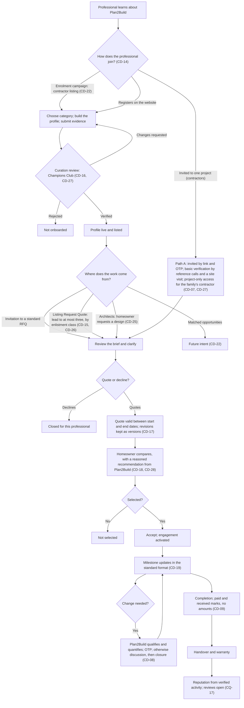

### 44.4 Role flows for the POC

ARC [POC, as designers on request, CD-25]: Register → choose Architect → credentials and portfolio → curation review into the Champions Club [CD-16, CD-27] → profile live → a homeowner who wants a better 2D or 3D design than Plan2Build's concept design requests an architect; Plan2Build shortlists Club architects with the recommendation engine, or the homeowner picks from the listing [CD-25, CD-28; CQ-25] → review the brief, the requirement and Plan2Build's concept design → design quote, valid between a start and an end date, revisions kept as versions [CD-17] → compared and selected, with Plan2Build's recommendation [CD-18] (Plan2Build's role at this step: CQ-18) → agreement and payment directly with the homeowner [CD-01] → concept → drawing package → revisions within the quoted count [S]; design change orders follow CD-08 → final design pack, which replaces Plan2Build's concept drawings in the Build Plan and joins the contractors' standard RFQ package [CD-20, CD-25] → payments marked paid and received [CD-09] → reputation (reviews: CQ-17). Whether architects also take other work in the POC is CQ-08.

CON, Path A [POC]: Nominated by the family, or introduced by Plan2Build from the Champions Club using the recommendation engine's shortlist [CD-07, CD-27, CD-28] → invited by project link and OTP; Plan2Build helps the contractor onboard and can create the account [CD-07] → verified by reference calls and a site visit [S]; the family's own contractor needs only this basic verification and gets project-only access without joining the Club [CD-27, proposed; a failed check is CQ-23] → standard RFQ package, which can include the architect's design pack [CD-20] → quote line by line, valid between a start and an end date, revisions kept as versions [CD-17] → clarifications through Plan2Build, no competitor prices [S] → scope-normalised comparison with Plan2Build's recommendation; the homeowner chooses [CD-18] → contract and payments directly with the homeowner [CD-01] → build stage by stage, updates in the standard format [CD-19] → changes qualified and quantified by Plan2Build, acknowledged by OTP, no decline, discussion then closure [CD-08] → inspections by the retained auditor (unique ID [CD-21]), fixes re-checked [S] → payments marked paid by the homeowner and received by the contractor, no amounts [CD-09] → handover; the final payment is marked [CD-09]; build record [CD-11] → verified profile with audit record and no star ratings [S] (reviews: CQ-17).

CON, listing [POC]: Listed after curation into the Champions Club [CD-16, CD-22, CD-27] → a homeowner's Request Quote arrives as a lead when the contractor is one of the homeowner's picks (at most three) and its enlistment class covers the project [CD-15, CD-26] → accept or decline within the acceptance window → if the homeowner holds the package, the standard RFQ as in Path A; if not, a site visit if needed and a quote on Plan2Build's standard template within the quote window, after which Plan2Build offers the homeowner the package for review and comparison [CD-26, proposed; CQ-02] → selected or not selected. Section 44.7 gives the full flow. Whatever the route, CD-01, CD-08, CD-09, CD-17, CD-18 and CD-19 apply.

CON, Path B [future intent, CD-22]: As section 42.2 CON [D1], with three changes once it is built: no platform payment or settlement [CD-01]; milestone and site updates in the standard format [CD-19]; change orders follow CD-08, with no rejection.

INT (whether interior designers take part in the POC: CQ-08): As section 42.2 INT [D1], with curated onboarding [CD-16], quote validity and versions [CD-17], the recommendation in the comparison [CD-18], updates in the standard format [CD-19], change orders per CD-08, and payments made directly and marked paid and received [CD-01, CD-09].

SPC (whether specialists take part in the POC: CQ-08): During the build, as section 42.2 SPC with the same cross-role decisions as INT above. After handover at the MVP: the homeowner's need goes to Plan2Build's back office [CD-12]; how the back office brings in a specialist is CQ-16. Renovation and upgrades are "coming soon" [CD-12]; no service-order flow is built (PRC-08).

STE [D2]: Unchanged from section 42.2. Structural design is never AI-generated [CD-25]; whether the engineer prepares full structural drawings for each house, and has the capacity, is CQ-22 (POQ-023).

AUD [D2]: As section 42.2, plus: each auditor has a unique ID [CD-21] (person or firm: CQ-15); every package holder's house is inspected at the inspection stages [CD-05]; non-conformance closure stays open (PC-021).

SUP [MVP]: Qualifying options shown [S] → homeowner chooses [S] → the contractor buys to the specification, and a substitute is recorded as a switch [S]; Plan2Build supplies nothing [CD-13] → installed → verified (the auditor never sees the supplier) and certified [CD-13] → build record. Supplier sign-up, catalogue, ordering, delivery, returns and payment: phase 2 [CD-13]. What "certification" covers: CQ-14.

BRD [POC]: Product qualifies on published criteria → shown as a qualifying option in a separate step → homeowner chooses; Plan2Build never recommends a brand [CD-18] → yearly review → aggregated, anonymised data later [S]. Brand dashboard: outside the pilot, shown only to communicate the plan [CD-23] (CQ-19).

PMC, PTN, LAB, APL: unchanged; named only, no flow (`UNKNOWN — REQUIRES CONFIRMATION`).

### 44.5 Hand-offs between homeowner, Plan2Build and professionals

These rows are the hand-offs of Section 4 of the client document.

Invited contractor path:

| Row | Hand-off | Status after the decisions |
|---|---|---|
| 1 | Homeowner submits project facts and drawings and pays; Plan2Build reviews and sets up the workspace | Ticked [CD-24]. The payment is now for the single package, at once or as the first instalment [CD-05] |
| 2 to 5 | Structural sign-off; Build Plan issued; product choices by OTP; contractor nominated or introduced | Ticked [CD-24]. The Build Plan carries Plan2Build's concept drawings and generated 3D views, or an architect's design on request [CD-06, CD-25]; introductions come from the Champions Club with the engine's shortlist [CD-27, CD-28] |
| 6 | Invitation by link and OTP; verification by reference calls and a site visit | Ticked [CD-24]. Plan2Build can create the contractor's account [CD-07]; the family's own contractor needs basic verification only and gets project-only access [CD-27, proposed] |
| 7, 8 | Quote line by line; clarification questions | Ticked [CD-24]. Quote validity dates and versions [CD-17] |
| 9 | Scope-normalised comparison; the homeowner chooses | Ticked [CD-24]. Plan2Build adds a recommendation with written reasons [CD-18, CD-28] |
| 10 | Contract signed and paid directly | Ticked [CD-24] [CD-01] |
| 11 | Changes raised and acknowledged | Plan2Build qualifies and quantifies; OTP; no decline; discussion, then closure [CD-08] |
| 12 | Payments recorded | The homeowner pays directly and marks paid; the contractor marks received; no amounts; Plan2Build shows the contract value, the approved change costs and the marks [CD-01, CD-09] |
| 13 to 17 | Auditor assigned; inspection; report; findings; fixes and re-inspection | Unchanged. The auditor has a unique ID [CD-21]; every package holder has the inspections [CD-05] |
| 18 | Stage payment due after the inspection clears; the homeowner pays directly | Due without an amount; marked paid and received [CD-09] |
| 19 | Build record assembled and kept | Must-have [CD-11] |
| 20 | Inspection results added to the contractor's audit record | Unchanged |

Marketplace path: shown as intent for future development [CD-22]. Row 8 (payment through the platform) is out under CD-01; the client's line beside it is read the same way (CQ-20). When the path is built, row 9 (change orders) follows CD-08 and row 11 (reviews) depends on CQ-17.

### 44.6 Differences from section 42

| Role | Section 42 (sources) | Section 44 (client decisions) | Decisions |
|---|---|---|---|
| All | Directions kept apart; governing model open (POQ-001) | Invited path plus contractor listing in the POC; marketplace is future intent | CD-14, CD-15, CD-22 |
| All | D1 platform payments versus D2 recording | Direct payments; paid and received marks; no amounts | CD-01, CD-09 |
| All | Verified (D1), invited (D2), possibly unverified listings (D3) | Curated "Champions Club" members are listed, recommended and sent leads; the family's own contractor gets project-only access | CD-16, CD-27 |
| All | No recommendation (D2) versus recommendations (D1, D3) | Staged recommendation engine with written reasons; never brands; no professional sees its rank | CD-18, CD-28 |
| All | D2 quote versions unknown | Validity dates; Plan2Build keeps versions; the homeowner sees the latest | CD-17 |
| All | Change rejection undefined (D2) or allowed (D1) | No decline; Plan2Build qualifies and quantifies; discussion, then closure | CD-08 |
| All | No update format | One standard format | CD-19 |
| ARC | D1 only; drawings to the contractor undefined | Designers on the homeowner's request; the final design pack replaces Plan2Build's concept drawings and can join the RFQ package | CD-20, CD-25 |
| CON | Path A or Path B open | Path A and listing leads (at most three per request; accept or decline; then the standard RFQ or the standard template) in the POC; Path B is future intent | CD-15, CD-22, CD-26 |
| STE | Retained; producer of the structural design open (POQ-023) | Structural design never AI-generated; scope per house is CQ-22 | CD-25 |
| SPC | Post-handover orders superseded for the POC | Back office handles after-handover needs; renovation "coming soon" | CD-12 |
| AUD | Retained per inspection | Unique ID; inspections bundled in every package | CD-05, CD-21 |
| SUP | Plan2Build may supply at a disclosed margin | No supply at the MVP; verification and certification | CD-13 |
| BRD | Dashboard superseded for the POC | Dashboard only to communicate the plan | CD-23 |

### 44.7 Contractor listing leads (CD-26)

Designed by Sakha on Chirag's delegation; Chirag to review. Values marked "configuration" are starting values that Plan2Build can change without code.

1. The homeowner opens the contractor listing. It shows only Champions Club members, each with the enlistment class, service area, verified details, portfolio and audit record, and a Request Quote button. There are no star ratings and no price sort or filter (BR-089 in IHB_FLOW; PBR-038; ratings are CQ-17).
2. The homeowner presses Request Quote on up to three profiles, or asks Plan2Build to suggest contractors; the recommendation engine then proposes up to three, each with written reasons (CD-28).
3. A homeowner who is not registered, or has not defined the project, registers by OTP and completes the requirement form first. A lead without project facts cannot be classed or quoted.
4. Plan2Build sets the project class from the requirement (table below) and checks each pick: the class covers the project, the service area covers the site, capacity is free in the start window, the member is not suspended, and no conflict of interest is recorded. A pick that fails is not sent; the homeowner sees why and gets suggestions that pass.
5. Each eligible pick receives the lead on the portal, with a notification. The lead shows the locality (not the exact address), plot size, built-up area, floors, budget band, start window, services needed, and whether the homeowner holds the package. It does not show the homeowner's name, phone or exact address.
6. The contractor accepts or declines within the acceptance window (configuration: 48 hours). A decline carries a reason from a short list: fully booked, outside my class, outside my area, not my type of work. No answer in time expires the lead. After a decline or expiry, the homeowner is offered a replacement suggestion.
7. On acceptance, the homeowner and the contractor can message each other through the platform. Whether phone numbers are shared stays open (POQ-019).
8. The quote follows one of two routes:
   - **The homeowner holds the package:** the contractor joins the project's standard RFQ, as in Path A from the standard RFQ package: a line-by-line quote valid between a start and an end date, clarifications through Plan2Build, and a comparison with a recommendation (CD-17, CD-18).
   - **The homeowner does not hold the package:** a site visit if needed, then a quote on Plan2Build's standard quote template, organised by the 16 stages, within the quote window (configuration: 10 days). The homeowner sees the quotes, and Plan2Build offers the package for review and comparison against the workspace (CD-04, CD-05). How a review on its own is paid for is CQ-02.
9. The homeowner selects a contractor; the contract and payments are direct (CD-01). With the package, Path A continues from the contract: stages, inspections, changes, payment marks, build record.
10. Leads that are not selected close, and the contractor is told. A lead is also withdrawn when the homeowner has been inactive for the inactivity window (configuration: 30 days).

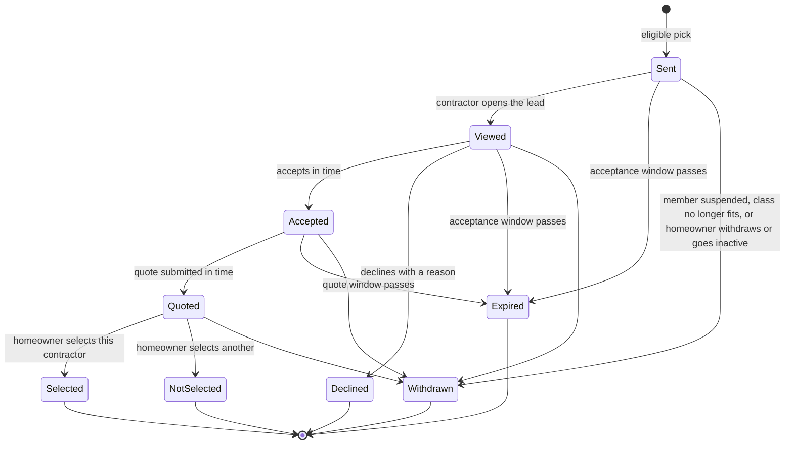

Proposed enlistment classes (configuration; the client's answer to CQ-07 may replace them with a government enlistment):

| Class | Projects it covers | What a contractor must show to hold it |
|---|---|---|
| C | Up to ground plus one floor, and up to about 2,500 sq ft built-up | At least two completed houses of this size in the last five years |
| B | Up to ground plus two floors, and up to about 5,000 sq ft built-up | At least two completed houses of ground plus one or larger, one of them ground plus two |
| A | Larger than class B, or with a basement | At least two completed houses of ground plus two or larger, and a site engineer on the team |

A project takes the higher of its class by floors and its class by area. A class A contractor may take any project, class B takes B and C, and class C takes C only. Curation sets each contractor's class from references and the site visit (section 44.8).

Rules:

- At most three contractors hold an open lead on the same project at a time (configuration). A replacement goes out only after a decline, expiry or withdrawal.
- One lead per project and contractor; pressing Request Quote again does not create a second lead.
- A lead never goes to a contractor outside the Club, outside its class or outside its service area (CD-15, CD-26).
- If the homeowner changes the project facts after leads are sent, the leads are updated and the contractors told; a contractor whose class no longer covers the project has its lead withdrawn, with the reason.
- Lead response, response time and quote completeness feed the recommendation engine (`RECOMMENDATION_ENGINE.md`).
- Nothing in this flow charges the contractor; fees from professionals stay open (POQ-028, POQ-031).

Data: Lead (project, contractor, source: homeowner pick, engine suggestion or replacement; project class and contractor class when sent; sent, accept-by and quote-by times; state; decline reason; engine request). EnlistmentClassRule (class, maximum floors, maximum built-up area, basement allowed, version). ContractorCapacity (declared maximum concurrent sites, active sites, paused until).

### 44.8 Champions Club and the family's own contractor (CD-27)

> **Superseded in part (2026-10-04, PD-18).** Chirag clarified that "Champions Club" is the name for every professional Plan2Build has reviewed and approved for public listing. The application, curation, admission, class-by-scorecard and six-monthly membership review below are Sakha's design and are not to be built as a membership system. What survives: the checks as the listing approval checklist (open point F-02), the family's own contractor with basic verification and project-only access, and listing states (pending review, listed, suspended, rejected). See `02_IMPLEMENTATION/PRODUCT_FLOW_RECONCILIATION.md` section D.

Chirag's definition: the Champions Club means onboarding only the best of the best professionals on the site, so that Plan2Build keeps its standard. Only members are listed, recommended or sent leads. The rest of this section is Sakha's proposal, for Chirag to confirm.

Curation gates. All must pass:

| Gate | What Plan2Build checks |
|---|---|
| Identity and business | PAN, address, GST registration where applicable, firm details |
| Track record | At least five completed independent houses in the last five years (configuration), with at least three homeowner references reached by Plan2Build |
| Site visit | A running site passes Plan2Build's checklist: workmanship, a supervisor present, material storage, basic safety, housekeeping |
| Capacity | The team (a site supervisor or engineer) and a declared maximum of concurrent sites that the site visit supports |
| Clean record | No unresolved fraud, abandonment or safety incident found in references and checks |
| Agreement | Accepts Plan2Build's rules: the standard quote format, stage inspections and fixes, the change process (CD-08), payment marks (CD-09), no paid placement |

Scorecard: reviewers score experience depth, reference quality, site-visit quality and documentation discipline. The scores set the member's class (section 44.7) and give the recommendation engine its starting signals for a new member.

Outcomes: member with a class; changes requested, then resubmitted; rejected, with the right to apply again after six months (configuration).

Ongoing review every six months (configuration), from platform evidence: first-visit inspection pass rate, non-conformance closure time, on-time milestones, approved changes as a share of contract value, issue response and closure times, lead response rate and quote completeness.

| Trigger | Result |
|---|---|
| A metric below its floor at two reviews in a row, or a pattern of late responses | Warning, with an improvement plan |
| A critical structural non-conformance left unrectified past its due date; a dispute decided against the member by Plan2Build's operations team; misrepresentation | Suspension: no listing, recommendations or leads; active projects continue with closer inspection; records are kept (PBR-028) |
| Repeated suspension, fraud, or abandoning a site | Removal from the Club |

The family's own contractor (project-only access):

- Invited by link and OTP; Plan2Build helps it onboard and can create the account (CD-07).
- Basic verification before the RFQ: identity, reference calls and a site visit, as in the D2 contractor flow (section 42.2, CON [D2]).
- Works under the same project rules as any contractor: the standard quote, stage inspections, the change process, payment marks, the issue log and the build record.
- Not listed, not recommended and sent no leads. Labelled "Chosen by the family" in the workspace and the build record, so the homeowner can tell it apart from a Plan2Build introduction.
- May apply to the Club; the inspection record from this project counts as evidence.
- If basic verification fails: CQ-23.

What homeowners and members see:

- The listing shows only members, with a Club badge, class, verified details, portfolio and audit record. Whether house-level audit data may appear on a public profile, and with whose consent, stays open (POQ-051; OQ-056 in IHB_FLOW).
- Members see their own metrics and, for each lead, why it was sent to them. They never see their rank or another member's data.
