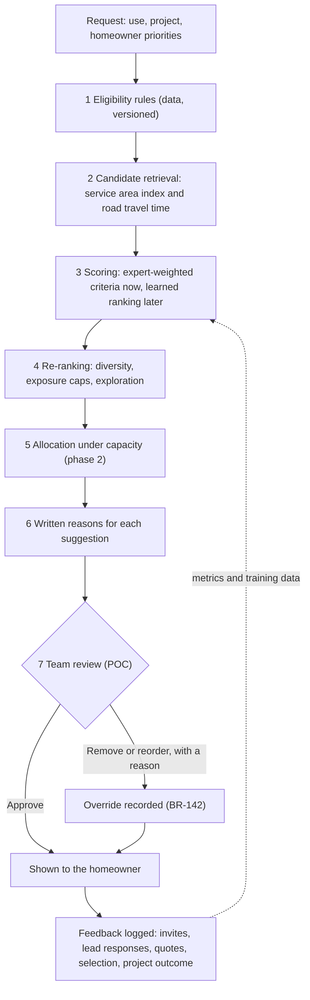

# Plan2Build: recommendation engine

Design of the engine that suggests contractors (and later other professionals) for a project, and the best-fitting quote at comparison. Proposed by Sakha at Chirag's request on 2026-10-03 (CD-28); Chirag to review.

## 0. Document control

| Item | Value |
|---|---|
| File | `SYSTEM_BLUEPRINT/RECOMMENDATION_ENGINE.md` |
| Version | 0.1 (proposal) |
| Prepared | 2026-10-03 |
| Status | Proposed design for Chirag's review. Not yet shown to the client. |
| Decisions it implements | CD-18 (comparison with a recommendation), CD-25 (architects shortlisted for design on request), CD-26 (listing leads), CD-27 (Champions Club), CD-28 (this design). The register is in `IHB_FLOW.md` section 32 and `PROFESSIONALS_FLOW.md` section 43. |
| Rules it must keep | No brand recommendation (BR-066; S04 R6). The comparison headline is never a price ranking (BR-083; PBR-035). No price sort or filter in listings (BR-089; PBR-038). Position is never for sale (S04 R5; S14). Explain why and never imply a guarantee (BR-092; PBR-031). Reproducible from stored rules (PBR-062). Manual overrides are recorded (BR-142). AI assists the workflow and is not the authority (S06 §12). |

## 1. What the engine decides

| Use | Question it answers | When it runs | Who sees the output | Phase |
|---|---|---|---|---|
| Contractor shortlist | Which Champions Club contractors fit this project? | The homeowner asks Plan2Build to find contractors, picks fewer than three in the listing, or a lead is declined or expires | The homeowner, after Plan2Build's team reviews the list | POC |
| Quote recommendation | Which quote fits this homeowner's priorities best? | All quotes are in and the adjustment list is done | The homeowner, beside the adjustment list | POC |
| Architect shortlist | Which Club architects fit this design request? | A homeowner asks for a better design than Plan2Build's concept (CD-25) | The homeowner, after team review | POC, once CQ-25 is settled |
| Lead allocation | Which eligible contractors get this week's leads, so that no one is overloaded and new members get a fair share? | Lead volume makes contractors compete for capacity | Internal | Phase 2 |
| Other professionals | Interior designers and specialists | When they join the POC (CQ-08) | The homeowner | Later |

Never: brands or products (S04 R6), and price-ranked lists of contractors (S05 C1). The configuration validator rejects any item type or signal that would allow either (section 8).

## 2. What large platforms do, and what Plan2Build takes from them

| Practice | Where it is used | Use at Plan2Build |
|---|---|---|
| A staged pipeline: retrieve many candidates, filter, score a few, re-rank | YouTube's published recommender (2016) and most large retail, video and job platforms | Yes, from day one. The stages stay the same as data grows; only the scoring method changes. |
| Learning to rank: gradient-boosted trees with a ranking objective (LambdaMART) | Search and marketplace ranking; Airbnb has published how it ranks search results with learned models | Later, once a few hundred projects have logged outcomes (section 7). |
| Collaborative filtering and embeddings ("people like you chose this") | Amazon's item-to-item recommendations, Netflix | Not now. A family builds a house once, so there is no repeat behaviour to learn from. For rare, high-stakes choices such as houses, cars and loans, the standard approach is knowledge-based recommendation: match stated requirements to verified attributes. |
| Two-sided matching with capacity | Job platforms; home-services lead platforms, which often send one request to three to five pros | Yes. A contractor can run only a few sites, so a suggestion is useful only if the contractor can take the job. |
| Re-ranking for diversity, exposure caps and exploration | Marketplace and feed re-rankers | Yes, from phase 1. |
| Shortest-path algorithms (Dijkstra, bidirectional Dijkstra, A*, contraction hierarchies) | Routing engines and maps | Yes, but only for road travel time from a contractor's base to the site, and inside the min-cost-flow solver that allocates leads at scale. They do not decide who fits best. |

## 3. Pipeline



### 3.1 Stage 1: eligibility rules

Hard rules that a candidate must pass. They are rows in a versioned rules table read by a small rule interpreter, not branches in code, and every failure is stored with its reason so that the homeowner can be told why a pick was not sent.

| Rule | Uses | Source |
|---|---|---|
| Champions Club member, verified for the category, not suspended (read since 2026-10-04 as: LISTED for the category, PD-18) | Shortlists, allocation | CD-16, CD-27, PD-18 |
| Enlistment class covers the project class | Contractor shortlist, leads, allocation | CD-15, CD-26 |
| Service area covers the site, and road travel time is within the member's declared limit | Shortlists | CD-26 |
| Capacity free in the homeowner's start window; not paused | Shortlists, allocation | CD-26 |
| Not already declined, expired or invited on this project | Shortlists | CD-26 |
| No recorded conflict of interest (independence protocol still open: POQ-053, POQ-054 in PROFESSIONALS_FLOW) | All | S03 §9 |
| For quotes: submitted, valid on the comparison date, adjustment list complete | Quote recommendation | CD-17, CD-18 |

### 3.2 Stage 2: candidate retrieval

- Members' bases and service areas are indexed by hexagonal grid cells (for example Uber's H3) or by a spatial database (for example PostGIS). The plot's coordinates map to a cell, and the index returns the members whose areas cover it.
- Road travel time from each base to the site comes from a routing engine (for example OSRM, which is open source, or a maps distance-matrix service) and is cached per pair of cells. Routing engines compute these times with shortest-path algorithms of the Dijkstra family.
- At Raipur scale (tens of members) this stage is small; the same code serves many cities without change.

### 3.3 Stage 3: scoring

The POC uses expert-weighted criteria built from verified platform evidence (section 5). The learned model of section 7 replaces the weights later; the stages around it stay.

### 3.4 Stage 4: re-ranking

- **Diversity.** The next suggestion is the candidate with the highest value of λ × score − (1 − λ) × similarity to the suggestions already chosen (maximal marginal relevance), so that three suggestions are not near copies of one another. Similarity compares team size band, typical project size and base area.
- **Exposure caps.** A member receives at most a set number of engine suggestions per week (configuration), so the strongest few are not flooded and others still get work.
- **Exploration (phase 1).** One of three slots may go to a new member, chosen by Thompson sampling: draw a value from Beta(successes + 1, failures + 1), where a success is a lead accepted and quoted, and take the highest draw. New members get a fair chance and the engine learns about them.

### 3.5 Stage 5: allocation under capacity (phase 2)

When many projects compete for the same members in a week, allocate leads as a min-cost flow:

- Source → each project, capacity = the number of leads the project needs (up to three).
- Project → each eligible member, capacity 1, cost = 1 − score.
- Member → sink, capacity = the leads the member can take that week.

Solve with successive shortest augmenting paths. Each shortest path is found with Dijkstra's algorithm on reduced costs (Johnson potentials), which keep every reduced cost non-negative; because every starting cost is non-negative, the potentials can start at zero. Whole-number capacities give whole-number assignments. At larger scale, solve the problem periodically and use its dual prices as per-member penalties when scoring in real time.

### 3.6 Stage 6: written reasons

- Each suggestion carries two or three reasons built from the criteria that contributed most to its score, with the evidence behind them and the homeowner's own priorities named. Example: "Finishes on time most often among the contractors who fit your project (90% of milestones on schedule), which you ranked first; strong inspection record."
- The homeowner sees a fit label ("Strong fit for your priorities"), not a raw score, to avoid false precision and league tables.
- Reasons are template text in Hindi and English. AI may help phrase them, under human review, but never changes the order (S06 §12).

### 3.7 Stage 7: team review (POC)

Plan2Build's team sees each shortlist with scores and reasons before the homeowner does. It can remove or reorder a candidate only with a reason; each override records the actor, old value, new value and reason (BR-142) and becomes training data.

## 4. Signals

Contractor signals come from evidence the platform records. Star ratings are not used (ratings are CQ-17).

| Signal | Meaning | Source | Small-sample handling |
|---|---|---|---|
| First-visit pass rate | Share of inspection checkpoints passed at the first visit | Auditor reports | Beta prior at the Club average |
| Non-conformance closure time | Median days from finding to closure | Auditor reports | Shrunk toward the Club median |
| On-time milestones | Share of milestones done by the planned date | Milestone updates (CD-19) | Beta prior |
| Change discipline | Approved change value as a share of contract value | Change log (CD-08) | Shrunk toward the Club median |
| Issue response | Median hours to first response on homeowner issues | Issue log (CD-10) | Shrunk toward the Club median |
| Lead response | Share of leads answered within the window | Leads (CD-26) | Beta prior |
| Quote completeness | Share of RFQ lines priced rather than excluded | RFQ quotes | Beta prior |
| Similar work | Completed houses of the project's class and floors | Curation and platform record | None |
| Curation score | Reviewers' scorecard | Curation (CD-27) | None; used most for new members |
| Travel time | Road minutes from base to site | Routing | None |
| Capacity headroom | Free sites in the start window | Capacity record | None |

Homeowner inputs: the ranking of priorities from the requirement form (quality of work, finishing on time, staying within budget, experience with similar homes), budget band, start window, floors and location.

Never used: anything derived from payments, premium tiers, partner status or lead fees; brand or supplier relationships; and personal attributes such as religion, caste, gender or family details.

## 5. Scoring in the POC

1. **Normalise** each signal to 0 to 1 on a fixed scale, not relative to the other candidates, so that scores stay stable when a candidate drops out. Example: travel score = 1 − min(minutes, 90) / 90.
2. **Smooth small samples.** A rate is shown as (successes + a) / (trials + a + b), where a / (a + b) is the Club average and a + b sets how much evidence it takes to trust a member's own rate (configuration: 20). A new member starts near the Club average instead of at 0% or 100%. The lower bound of the Wilson interval is an alternative with the same effect.
3. **Weight.** Weight = λ × expert weight + (1 − λ) × homeowner weight, with λ = 0.5 to start. Expert weights are set by Plan2Build per use and stored with a version. Homeowner weights come from the ranking in the requirement form, converted by rank-order centroid: the criterion ranked k of n gets (1 / n) × (1/k + 1/(k+1) + ... + 1/n). For four ranked priorities that gives about 0.52, 0.27, 0.15 and 0.06.
4. **Score** = sum of weight × criterion value, minus penalties for risk flags.

Worked example: contractor shortlist. Expert weights: similar work 0.25, quality record 0.30, schedule record 0.20, budget discipline 0.15, responsiveness 0.10. The homeowner ranks finishing on time first, quality second, staying within budget third and experience with similar homes fourth. Blended weights: schedule 0.36, quality 0.285, similar work 0.155, budget 0.15, responsiveness 0.05.

| Contractor | Similar work | Quality | Schedule | Budget | Responsiveness | Score |
|---|---|---|---|---|---|---|
| A | 0.90 | 0.80 | 0.60 | 0.70 | 0.90 | 0.73 |
| B | 0.60 | 0.85 | 0.90 | 0.80 | 0.70 | 0.81 |
| C (new member) | 0.50 | 0.78 | 0.75 | 0.75 | 0.80 | 0.72 |

B comes first because the homeowner ranked finishing on time first. C passed its only three checkpoints, but with so little evidence its rate is held near the Club average: (3 + 15) / (3 + 20) = 0.78, so it cannot jump above members with long records; its schedule and budget values are the Club averages. Had the homeowner ranked experience with similar homes first, A would score 0.80 against B's 0.75 and come first.

## 6. Quote recommendation at comparison

The adjustment list comes first and stays primary (BR-083). The recommendation sits beside it.

| Criterion | Type | Measured as |
|---|---|---|
| Scope completeness | Higher is better | 1 minus the rupee value of excluded or missing lines as a share of Plan2Build's estimate |
| Scope-normalised total | Lower is better | The total after the adjustment list |
| Timeline fit | Higher is better | Overlap of the proposed start and duration with the homeowner's window |
| Payment schedule fit | Higher is better | How closely the schedule follows the Build Plan's cash-flow plan |
| Warranty | Higher is better | Length and coverage on a fixed scale |
| Contractor record | Higher is better | The contractor's shortlist score from section 5 |

Method (TOPSIS):

1. One row per quote, one column per criterion.
2. Normalise each column: value / square root of the sum of the squared values in that column.
3. Multiply each column by its blended weight. Staying within budget, if the homeowner ranked it, weights the total and the payment fit.
4. For each column, the ideal is the best value among the quotes (highest, or lowest for the total) and the anti-ideal is the worst.
5. For each quote, measure the distance to the ideal (d+) and to the anti-ideal (d−).
6. Closeness = d− / (d+ + d−), between 0 and 1. The highest closeness is the best fit.

Risk flags are shown and never scored as a win: a scope-normalised total more than 15% below the low end of Plan2Build's estimate band (configuration); many excluded lines; a validity period that ends before the homeowner can decide.

Presentation: "Best fit for your priorities" names one quote with two or three reasons and the trade-off against the next quote, for example "Quote 2 fits your start date and has the fewest exclusions; Quote 1 is ₹1.8 lakh lower after scope adjustment but excludes waterproofing". There is no "cheapest" or "lowest" label. The homeowner chooses. Contractors never see the recommendation, their position or another contractor's price.

## 7. Learning phase

- **Log from day one:** each request, its candidates, a snapshot of their signals, scores and reasons, the engine and configuration versions, what was shown, team overrides, the homeowner's actions, lead responses, quotes, the selection and the project outcome.
- **Labels:** 0 not picked; 1 lead sent; 2 quoted; 3 selected; 4 selected with a good outcome (finished within 10% of the planned time, no critical non-conformance left unrectified, approved changes within 10% of the contract value; thresholds are configuration).
- **Model:** gradient-boosted trees with a ranking objective (LambdaMART, for example in LightGBM), with each project as one query group. The POC score is one of its inputs, so the model starts from the experts' judgment.
- **When to switch:** per use, once a few hundred projects have outcomes and an offline test on the most recent projects shows the model beats the expert score (NDCG at 3, and how often the eventually selected contractor was in the top three) with no loss of fairness. Until then the model runs in shadow.
- **Online measures:** share of homeowners who invite at least one suggested contractor, time to award, project outcome quality, and the spread of suggestions across members.
- **Experiments:** members' capacity is shared, so a test split by homeowner contaminates itself. Split by city or by week instead, and only at scale.

## 8. Guardrails

| Guardrail | How it is enforced |
|---|---|
| No brands | The engine's item types exclude products and brands; the configuration validator rejects a brand item type. |
| No paid influence | Signals come from an allowlist; any signal derived from payments, premium tiers, partner status or lead fees is rejected when configuration loads (S04 R5; S14). |
| No price headline | Price is one weighted criterion at the quote stage only; listings never sort or filter by price (BR-089; PBR-038); no "lowest" label. |
| Reasons required | A suggestion without written reasons is not shown (BR-092; PBR-031). |
| Reproducible | Rules, weights and model versions are stored, and any past recommendation can be recomputed from them (PBR-062). |
| No ranks shown to professionals | Members see their own metrics and why a lead was sent to them, never their rank or another member's data. |
| Privacy | Contractors see no homeowner name, phone or exact address before accepting a lead (CD-26); external AI services receive no personal data; data residency follows OQ-059 in IHB_FLOW. |
| Fairness monitoring | Monthly review of the share of suggestions and leads per member, new against established members, and by area. |
| Human authority | Plan2Build's team reviews shortlists in the POC; AI never changes an order (S06 §12). |

## 9. Data model

| Entity | Fields |
|---|---|
| EngineConfig | Use, version, eligibility rules, criteria and expert weights, smoothing priors, thresholds, created by, created at, active from |
| RecommendationRequest | Use, project, trigger, configuration version, model version, created at |
| Candidate | Request, subject (contractor, architect or quote), eligible, failed rules with reasons, signal snapshot, criterion values, total, rank, reasons |
| ReviewAction | Request, reviewer, action (approve, remove, reorder), reason, old value, new value, at |
| ShownItem | Request, subject, position, fit label, shown at |
| Outcome | Subject, project, lead state, quoted, selected, outcome measures, recorded at |
| ProfessionalMetric | Professional, metric, numerator, denominator, smoothed value, as of |
| ExposureLedger | Professional, week, suggestions, leads |

## 10. Configuration as data

Example of one use's configuration. Values are starting points for Plan2Build's team to set and sign off.

```yaml
use: contractor_shortlist
version: 2026-10-03.1
eligibility:
  - club_member
  - verified_for_category
  - not_suspended
  - class_covers_project
  - service_area_covers_site
  - capacity_free_in_start_window
  - no_conflict_of_interest
criteria:
  similar_work:      {expert_weight: 0.25, signal: completed_houses_same_class, scale: [0, 5]}
  quality_record:    {expert_weight: 0.30, signal: first_visit_pass_rate, prior: club_average, prior_strength: 20}
  schedule_record:   {expert_weight: 0.20, signal: on_time_milestone_rate, prior: club_average, prior_strength: 20}
  budget_discipline: {expert_weight: 0.15, signal: change_value_share, direction: lower_is_better}
  responsiveness:    {expert_weight: 0.10, signal: lead_response_rate, prior: club_average, prior_strength: 10}
homeowner_priorities:
  quality_of_work: quality_record
  finishing_on_time: schedule_record
  staying_within_budget: budget_discipline
  similar_homes_experience: similar_work
blend_lambda: 0.5
rerank:
  diversity_lambda: 0.7
  exposure_cap_per_week: 5
  exploration_slots: 0
explanations:
  languages: [hi, en]
  reasons_per_item: 3
review:
  team_review_required: true
```

## 11. Phases

| Phase | When | What runs | What gets built |
|---|---|---|---|
| 0, POC | Up to about 50 projects, Raipur | Eligibility rules, expert-weighted scoring with smoothing, written reasons, team review, quote recommendation by TOPSIS | Configuration store, rule interpreter, nightly metric jobs, request and outcome logging, reason templates |
| 1 | About 50 to a few hundred projects | Adds diversity, exposure caps and exploration; weights checked against outcomes (logistic regression) | Monitoring dashboards and the fairness review |
| 2 | A few hundred projects with outcomes, several cities | Learned ranking in shadow, then live; min-cost-flow allocation when leads compete for capacity | Training pipeline, offline evaluation, allocation job |
| 3 | Many cities and professional types | Embeddings to retrieve across types (architects, interior designers, specialists); per-city models where data allows | As needed |

## 12. Open points

- Expert weights, thresholds and the priority question's wording: Plan2Build's team to set and sign off, with versions.
- Whether house-level audit data may feed public profiles, and with whose consent (POQ-051 in PROFESSIONALS_FLOW; OQ-056 in IHB_FLOW).
- Reviews (CQ-17): if the client enables them, they enter as one more smoothed signal; the engine does not need them.
- Architect shortlisting depends on how architect design is bought and paid for (CQ-25).
- Hosting and data residency for the routing and metric services (OQ-059 in IHB_FLOW).
- Budget for building the engine (CQ-24).
